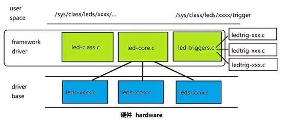

# Linux LED驱动开发及实验

## 1. LED 驱动开发基础

LED（发光二极管）是最常见的电子元件之一，经常被用作设备的电源指示、运行状态、报警提示等。它的特点是结构简单、响应快、功耗低。对于直插式二极管器件来说，一般是器件长引脚为正极，短引脚为负极。

<center>
    
    <br>
</center>


### 1.2. LED 硬件原理

LED 有正负两个引脚，只有正极接高电平、负极接低电平时才会发光，如下图二极管图示。

<center>
    
    <br>
</center>


### 1.3. Linux 下 LED 驱动开发流程

1. **硬件连接**：确认 LED 已接到 SoC 的 GPIO 。

2. **设备树配置**：在设备树里描述 LED 的 GPIO 编号、默认状态等。

3. **驱动实现**：推荐直接用内核自带的 gpio-leds 框架，无需手写驱动。

4. **用户空间控制**：通过 sysfs 文件系统、shell 脚本或应用程序控制 LED 。

通过标准化的 LED 驱动开发流程，可以让 LED 控制变得简单可靠，方便后续维护和扩展。

## 2. LED 子系统

Linux 内核提供了统一的 LED 子系统框架，开发 LED 驱动时应遵循该框架。如下图：

<center>
    
    <br>
</center>

- 用户空间：包含LED相关的类文件<br>

- 框架驱动：负责定义LED的类、核心功能和触发器。<br>

- 驱动基础：实现了具体的硬件驱动，与硬件直接交互。


### 2.1. led_classdev 结构体

LED 子系统的核心是 `led_classdev` 结构体，定义在 `path/to/your/linux-6.6/drivers/leds/leds.h` 文件中。
`led_classdev` 用于描述一个 LED 设备，定义如下（部分字段）：
```c
struct led_classdev {
    const char *name;                                               // LED 名称
    unsigned int brightness;                                        // 当前亮度
    unsigned int max_brightness;                                    // 最大亮度
    int flags;                                                      // 标志位
    void (*brightness_set)(struct led_classdev *led_cdev,
                           enum led_brightness brightness);         // 设置亮度（不可睡眠）
    int (*brightness_set_blocking)(struct led_classdev *led_cdev,
                                   enum led_brightness brightness); // 设置亮度（可睡眠）
    int (*blink_set)(struct led_classdev *led_cdev,
                     unsigned long *delay_on,
                     unsigned long *delay_off);                     // 设置闪烁（可选）
    const char *default_trigger;                                    // 默认触发器（可选）
    ...
};
```
`brightness_set/brightness_set_blocking`：必须实现其一，用于设置 LED 亮灭或亮度。

`blink_set`：可选，实现硬件闪烁支持。

`default_trigger`：可选，指定默认触发器（如定时闪烁、磁盘活动等）。


### 2.2. LED 驱动的核心操作

开发 LED 驱动时，通常需要实现如下操作函数：

`brightness_set` 或 `brightness_set_blocking`：设置 LED 的亮灭或亮度。<br>

`blink_set`（可选）：设置 LED 闪烁。<br>

例如 GPIO LED 驱动的 brightness_set 实现：

```c
static void gpio_led_set(struct led_classdev *led_cdev, enum led_brightness value)
{
    struct gpio_led_data *led_dat = cdev_to_gpio_led_data(led_cdev);
    int level = (value == LED_OFF) ? 0 : 1;
    gpiod_set_value(led_dat->gpiod, level);
}
```

### 2.3. LED 设备的注册与注销

LED 设备注册常用如下接口：

```c
int devm_led_classdev_register(struct device *parent, struct led_classdev *led_cdev);
```
`parent`：父设备<br>

`led_cdev`：要注册的 LED 设备

注销由内核自动完成（devm 管理），无需手动释放。若需手动注销，可用：
```c
void led_classdev_unregister(struct led_classdev *led_cdev);
```

### 2.4. 设备树支持

LED 子系统支持设备树描述，打开具体板级设备树 `path/to/your/linux-6.6/arch/riscv/boot/dts/spacemit/k1-x_MUSE-Pi-Pro.dts` ，找到leds节点，格式如下：

```dts
leds {
    compatible = "gpio-leds";

    led1 {
            label = "sys-led";
            gpios = <&gpio 96 0>;
            linux,default-trigger = "none";
            default-state = "on";
            status = "okay";
    };
}
```
compatible = "gpio-leds"：匹配内核 `leds-gpio.c` 驱动<br>

每个子节点描述一个 LED，支持 label、gpios、default-state 等属性

### 2.5. LED 驱动分析

#### 2.5.1. 匹配关系

在 `path/to/your/linux-6.6/driver/leds/leds-gpio.c` 中，我们找到驱动的匹配表 (of_gpio_leds_match)：
```c
static const struct of_device_id of_gpio_leds_match[] = {
	{ .compatible = "gpio-leds", },
	{},
};
```

驱动注册：
```c
static struct platform_driver gpio_led_driver = {
    .probe		= gpio_led_probe,
    .shutdown	= gpio_led_shutdown,
    .driver		= {
        .name	= "leds-gpio",
        .of_match_table = of_gpio_leds_match,
    },
};
```

注册到内核：
```c
module_platform_driver(gpio_led_driver); //把 gpio_led_driver 注册为 platform 驱动
```

#### 2.5.2. probe 函数

匹配到 compatible 后，内核会调用：
```c
static int gpio_led_probe(struct platform_device *pdev)
```
probe 函数支持两种初始化方式：**platform data** 和**设备树**（推荐）。设备树下每个 led 子节点会被注册为一个 LED 设备，用户可通过 `sysfs` 控制。


## 3. LED 驱动开发实例与实验流程

> **说明**：本次实验采用 **GPIO70** 引脚为例，我们将 LED 模块的正极接入 **GPIO70** 引脚，LED 模块的负极 **接地** 。

### 3.1. 设备树配置

在设备树中配置 LED 所用的 GPIO 引脚，推荐直接用 gpio-leds 框架，无需自定义驱动。

在 `~/cross-builder/linux-6.6/arch/riscv/boot/dts/spacemit/` 路径下找到 `k1-x_MUSE-Pi-Pro.dts`,输入以下命令：

```bash
vim ~/cross-builder/linux-6.6/arch/riscv/boot/dts/spacemit/k1-x_MUSE-Pi-Pro.dts
```

> **注**：vim 的用法此处不过多介绍，可以自行搜索其基本用法。

在 leds 节点下添加自定义 led2：

```dts
leds {
    compatible = "gpio-leds";
    led2 {
        label = "my_led";               // LED 标签
        gpios = <&gpio 70 0>;           // 指定 GPIO70
        linux,default-trigger = "none"; // 默认无触发器
        default-state = "on";           // 默认状态为开启
        status = "okay";                // 状态为正常
    };
};
```

### 3.2. 设备树编译

启动 Docker。
```bash
docker start cross-build-user
docker exec -it cross-build-user bash
```

进入 `linux-6.6` 目录重新编译 dtb 文件。
```bash
cd cross-builder/linux-6.6
make dtbs
```
<center>
    
    <br>
</center>


在 MUSE Pi Pro 上执行下面命令查看 ip：
```bash
ifconfig
```

如下图所示，ip 为 `10.0.91.67` 。
<center>
    
    <br>
</center>


执行下面命令将编译好的 k1-x_MUSE-Pi-Pro.dtb 文件传输到 MUSE Pi Pro 板子上。

> **注**：下面的 `bianbu@10.0.91.67` 根据上面结果替换成对应的 ip 。

```bash
sudo scp arch/riscv/boot/dts/spacemit/k1-x_MUSE-Pi-Pro.dtb bianbu@10.0.91.67:/home/bianbu
```

首次通过 ssh 连接 MUSE Pi Pro 会弹出连接确认，键盘输入 yes ，接着再输入密码回车即可。

<center>
    
    <br>
</center>


在 MUSE Pi Pro 上执行以下命令进行替换：
```bash
sudo cp ~/k1-x_MUSE-Pi-Pro.dtb /boot/spacemit/6.6.63
```

将开发板进行重启：
```bash
sudo reboot
```


### 3.3. LED 控制方法

#### 3.3.1. sysfs 接口控制

```bash
echo 1 | sudo tee /sys/class/leds/my_led/brightness  # 点亮 LED
echo 0 | sudo tee /sys/class/leds/my_led/brightness  # 熄灭 LED
```

#### 3.3.2. 用户空间 C 程序控制

在 MUSE Pi Pro 上新建 `led_control.c` 文件，并填入以下内容：

```c
#include <stdio.h>
#include <fcntl.h>
#include <unistd.h>

int main() {
    int fd = open("/sys/class/leds/my_led/brightness", O_WRONLY);
    if (fd < 0) {
        perror("Failed to open LED brightness file");
        return -1;
    }
    write(fd, "1", 1); // 点亮 LED
    sleep(2);
    write(fd, "0", 1); // 熄灭 LED
    sleep(2);
    close(fd);
    return 0;
}
```

**编译与运行：**

在 MUSE Pi Pro 上执行以下命令编译并运行代码。

```bash
gcc -o led_control led_control.c
sudo ./led_control
```

### 3.4. 运行结果

由于 MUSE Pi Pro 的 GPIO 默认拉高，也就是 LED 灯接上就可以亮，所以我们可以通过控制灯亮灭来验证是否成功，如下图：

**LED 灯灭：**

<center>
    
    <br>
</center>

**LED 灯亮：**

<center>
    
    <br>
</center>
