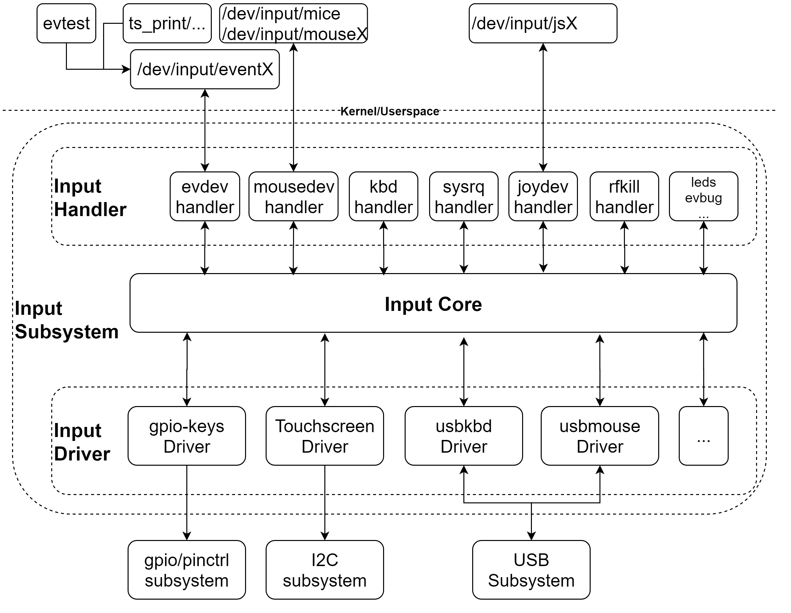
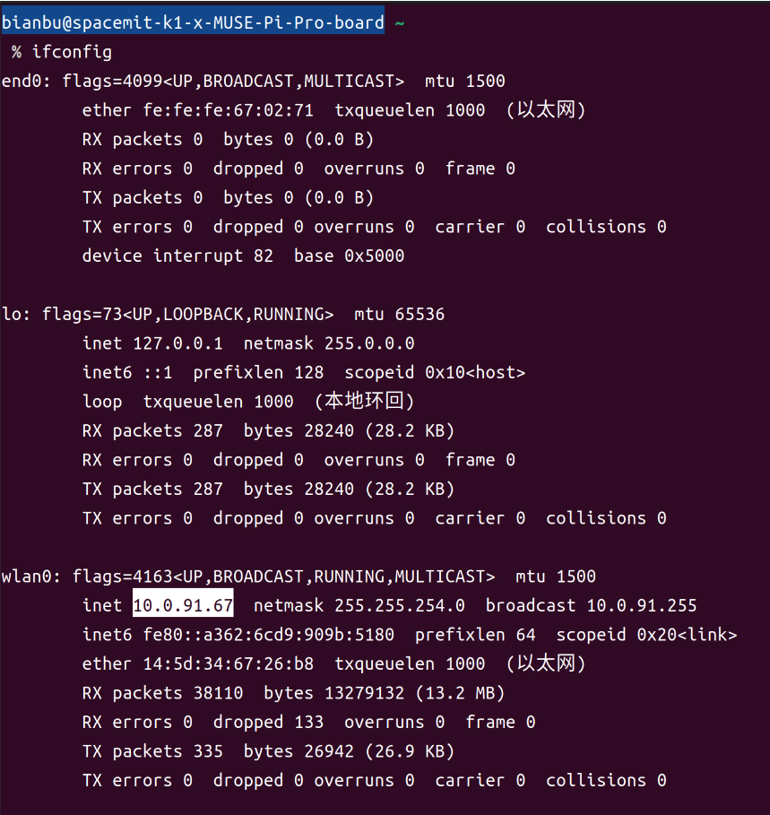
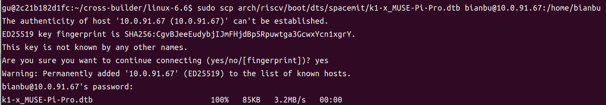
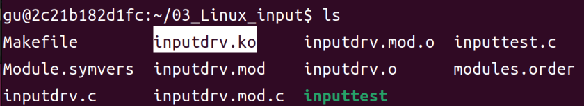
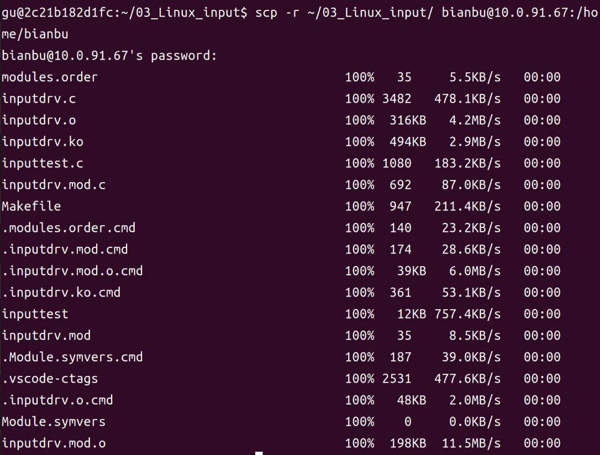
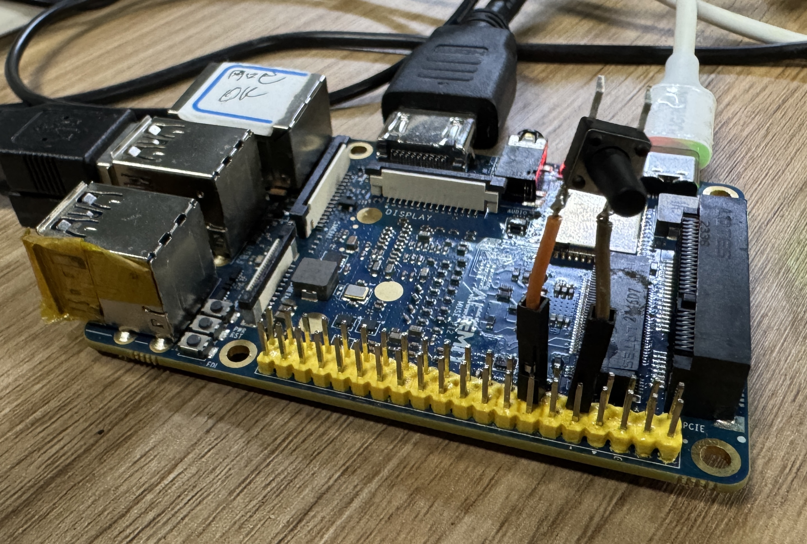

# Linux input 子系统介绍及实践

## 1. input 子系统概述

Linux input 子系统为各种输入设备（如按键、键盘、鼠标、触摸屏、遥控器等）提供统一的驱动开发和事件管理框架。它将硬件输入事件标准化，极大简化了驱动开发和应用集成。

### 1.1. 架构分层与工作流程

<center>
    
    <br>
</center>

- **输入设备驱动层**：负责采集硬件输入（如 GPIO 按键、I2C 触摸屏），通过 input core 上报事件。

- **input core 层**：内核核心，负责事件分发、设备注册、事件缓冲、同步等。

- **事件处理/应用层**：用户空间通过 /dev/input/eventX 读取事件，可用 evtest、cat、应用程序等工具处理。

### 1.2. 内核实现原理

Linux input 子系统基于一套精心设计的内核架构，实现了灵活而高效的输入事件处理流程：

#### 1.2.1. 输入设备驱动与内核连接

驱动通过 input_allocate_device() 分配 input_dev 结构体，设置设备支持的事件类型和事件代码后，调用 input_register_device() 将设备注册到内核。

```c
struct input_dev {
    const char *name;
    const char *phys;
    struct input_id id;

    unsigned long evbit[BITS_TO_LONGS(EV_CNT)];     /* 支持的事件类型位图 */
    unsigned long keybit[BITS_TO_LONGS(KEY_CNT)];   /* 支持的按键位图 */
    unsigned long relbit[BITS_TO_LONGS(REL_CNT)];   /* 支持的相对坐标位图 */
    unsigned long absbit[BITS_TO_LONGS(ABS_CNT)];   /* 支持的绝对坐标位图 */

    /* 其他设备属性与状态信息 */
    void *private;                                  /* 设备私有数据 */
};
```

注册过程中，内核会为该输入设备在 /dev/input/ 目录下创建一个 eventX 设备节点，并通过 sysfs 提供设备信息。

#### 1.2.2. 输入事件上报机制

驱动层通过一系列 input_report_* 函数上报输入事件：

```c
/* 上报按键事件 */
void input_report_key(struct input_dev *dev, unsigned int code, int value);
/* 上报相对坐标事件（如鼠标移动） */
void input_report_rel(struct input_dev *dev, unsigned int code, int value);
/* 上报绝对坐标事件（如触摸屏坐标） */
void input_report_abs(struct input_dev *dev, unsigned int code, int value);
```

每次上报完一组相关事件后，必须调用 input_sync() 同步事件，通知内核一个完整事件已产生：

```c
void input_sync(struct input_dev *dev);
```

#### 1.2.3. 事件处理流程

内核收到事件后，会转换为标准格式的 input_event 结构体：

```c
struct input_event {
    struct timeval time;    /* 事件发生的时间戳 */
    __u16 type;             /* 事件类型 EV_* */
    __u16 code;             /* 事件代码 KEY_*, ABS_* 等 */
    __s32 value;            /* 事件值 */
};
```

这些事件被传递给输入事件处理层，经过转换和分发后，被写入到相应设备文件的缓冲区中。用户空间应用程序可通过 read() 系统调用从 /dev/input/eventX 设备文件读取这些事件。

### 1.3. 主要数据结构与接口

`devm_input_allocate_device()` / `input_register_device()` / `input_unregister_device()`：input 设备的分配、注册、注销。<br>

`gpiod_get()` / `gpiod_put()` / `gpiod_get_value()`：GPIO 描述符获取与操作（推荐新内核用法）。<br>

`timer_list` / `timer_setup()` / `mod_timer()`：定时器机制，常用于轮询式输入检测。

### 1.4. 事件类型与代码

Input 子系统定义了多种标准事件类型，通过预定义的宏使用：

- **EV_KEY**：按键事件，代码如 KEY_ENTER、KEY_POWER 等

- **EV_REL**：相对坐标事件，如 REL_X、REL_Y（鼠标移动）<br>

- **EV_ABS**：绝对坐标事件，如 ABS_X、ABS_Y（触摸屏位置）<br>

- **EV_SW**：开关事件，如 SW_LID（笔记本盖子）<br>

- **EV_SYN**：同步事件，标志一次完整输入事件的结束<br>

事件类型和代码值定义在内核头文件 `path/to/your/linux-6.6/include/uapi/linux/input-event-codes.h` 中。


### 1.5. 按键 input 子系统驱动开发流程

```c
// 设置设备树匹配表
static const struct of_device_id bianbu_input[] = {
    { .compatible = "bianbu,input-test" },
    { },
};

// 定义platform_driver结构体
static struct platform_driver chip_demo_gpio_driver = {
    .probe      = chip_demo_gpio_probe,
    .remove     = chip_demo_gpio_remove,
    .driver     = {
        .name   = "bianbu_input_test",
        .of_match_table = bianbu_input,
    },
};

// 从设备树获取GPIO资源
input_gpio = gpiod_get(&pdev->dev, NULL, GPIOD_IN);
if (IS_ERR(input_gpio)) {
    dev_err(&pdev->dev, "Failed to get GPIO for test\n");
    return PTR_ERR(input_gpio);
}

// 分配input_dev结构体
test_input_dev = devm_input_allocate_device(&pdev->dev);
if (!test_input_dev) {
    gpiod_put(input_gpio);
    return -ENOMEM;
}

// 配置input设备信息
test_input_dev->name = "bianbu_input";
test_input_dev->phys = "bianbu/gpio72";
test_input_dev->id.bustype = BUS_HOST;

// 设置支持的事件类型和按键类型
__set_bit(EV_KEY, test_input_dev->evbit);    // 支持按键事件
__set_bit(KEY_0, test_input_dev->keybit);    // 支持KEY_0按键

// 注册input设备到内核
err = input_register_device(test_input_dev);
if (err) {
    gpiod_put(input_gpio);
    return err;
}

// 定时器轮询方式
static void poll_gpio_func(struct timer_list *t)
{
    int value = gpiod_get_value(input_gpio);
    if (value != last_key_state) {
        // 上报按键事件
        input_report_key(test_input_dev, KEY_0, value);
        input_sync(test_input_dev);    // 同步事件
        last_key_state = value;
    }
    mod_timer(&poll_timer, jiffies + POLL_INTERVAL);
}

// 初始化定时器
timer_setup(&poll_timer, poll_gpio_func, 0);
mod_timer(&poll_timer, jiffies + POLL_INTERVAL);
```

## 2. input 驱动开发实例与实验流程

> **说明**：本次实验采用 **GPIO72** 引脚为例。

### 2.1. 设备树配置

在 `path/to/your/linux-6.6/arch/riscv/boot/dts/spacemit/k1-x_MUSE-Pi-Pro.dts` 根节点下添加：
```dts
/{
    ...
    input_test: input_test@0 {
        compatible = "bianbu,input-test";
        gpios = <&gpio 72 0>;
        status = "okay";
    };
};
```

启动 Docker。
```bash
docker start cross-build-user
docker exec -it cross-build-user bash
```

进入 `linux-6.6` 目录重新编译 dtb 文件。
```bash
cd cross-builder/linux-6.6
make dtbs
```
<center>
    
    <br>
</center>


在 MUSE Pi Pro 上执行下面命令查看 ip：
```bash
ifconfig
```

如下图所示，ip 为 `10.0.91.67` 。
<center>
    
    <br>
</center>


执行下面命令将编译好的 k1-x_MUSE-Pi-Pro.dtb 文件传输到 MUSE Pi Pro 板子上。

> **注**：下面的 `bianbu@10.0.91.67` 根据上面结果替换成对应的 ip 。

```bash
sudo scp arch/riscv/boot/dts/spacemit/k1-x_MUSE-Pi-Pro.dtb bianbu@10.0.91.67:/home/bianbu
```

首次通过 ssh 连接 MUSE Pi Pro 会弹出连接确认，键盘输入 yes ，接着再输入密码回车即可。

<center>
    
    <br>
</center>


在 MUSE Pi Pro 上执行以下命令进行替换：
```bash
sudo cp ~/k1-x_MUSE-Pi-Pro.dtb /boot/spacemit/6.6.63
```

将 MUSE Pi Pro 进行重启：
```bash
sudo reboot
```

### 2.2. 核心代码 (部分)
```c
// 获取设备树中分配的GPIO（label为NULL，获取gpios第一个，即72号）
input_gpio = gpiod_get(&pdev->dev, NULL, GPIOD_IN);

// 分配input_dev结构体
test_input_dev = devm_input_allocate_device(&pdev->dev);

// 注册input设备
err = input_register_device(test_input_dev);

// 初始化定时器，定期轮询GPIO
timer_setup(&poll_timer, poll_gpio_func, 0);
last_key_state = gpiod_get_value(input_gpio);
mod_timer(&poll_timer, jiffies + POLL_INTERVAL);

// 定时器回调函数
static void poll_gpio_func(struct timer_list *t)
{
    int value = gpiod_get_value(input_gpio);
     if (value != last_key_state) {
        input_report_key(test_input_dev, KEY_0, value);
        input_sync(test_input_dev);
        last_key_state = value;
    }
    mod_timer(&poll_timer, jiffies + POLL_INTERVAL);
}
```

### 2.3. 运行和测试

#### 2.3.1. 编译驱动程序

**下载源码压缩包**

[input_test.zip](code/03_input_test.zip)

> **补充**：源码文件具体作用请看压缩包里的 README.md 文件。

**解压**
```bash
unzip 03_input_test.zip -d ~/
```

**编译**

驱动文件需要在Ubuntu上进行编译，因为SDK在Ubuntu上。修改Makefile里的内核路径为实际路径。

```bash
cd ~/03_input_test/
vim Makefile
```

修改``` KERN_DIR ``` 的路径，如图所示：

<center>
    
    <br>
</center>

执行以下命令，编译驱动

```bash
make
```
<center>
    
    <br>
</center>

编译成功以后就会生成一个名为 `inputdrv.ko` 的驱动模块文件。

<center>
    
    <br>
</center>


#### 2.3.2. 加载驱动

将上一小节编译好的 `03_input_test` 文件夹拷贝到 MUSE Pi Pro 开发板上，执行下面命令。

> **注**：下面的 `bianbu@10.0.91.67` 根据上面结果替换成对应的 ip 。

```bash
scp -r ~/03_Linux_input/ bianbu@10.0.91.67:/home/bianbu
```
<center>
    
    <br>
</center>


在开发板上进入该目录并输入如下命令加载 `inputdrv.ko` 这个驱动模块。
```bash
cd 03_input_test/
sudo insmod inputdrv.ko
```

#### 2.3.3. 运行测试

将按键一端接到 **GPIO72** ，另一端接到 **GND** 。

<center>
   
    <br>
</center>

在终端输入下面命令，找到你驱动注册的设备（此处是 Name="bianbu_input"），它下面会有一行 `H: Handlers=eventX` ，这里的 `eventX` 就是你要用的设备节点。如图所示：

```bash
cat /proc/bus/input/devices
```

找到 ```Name="bianbu_input"``` 的事件号：

<center>
    
    <br>
</center>


当驱动模块加载成功以后使用 `inputtest` 来测试，输入如下命令：

```bash
sudo ./inputtest /dev/input/event7 # 此处实际设备号为event7
```

`按下/松开`按键时可看到 KEY_ENTER 事件。如图所示：

<center>
   
    <br>
</center>


