# **1. Shell 简介**

## **1.1 什么是 Shell**

在 Linux 系统中，Shell是一种应用程序，这个应用程序提供了一个界面，是用户与操作系统内核之间的一个接口。它就像是一个命令解释器，接收用户输入的命令，然后将这些命令翻译成内核能够理解的语言，从而让内核去执行相应的操作。可以把 Shell 想象成一个桥梁，连接着用户和操作系统的核心部分。

例如，你在终端输入 `ls` 命令时，Shell 会接收到这个命令，然后告诉内核需要列出当前目录下的文件和文件夹，内核执行相应操作后，将结果返回给 Shell，Shell 再将结果展示给你。

常见的 Shell 有很多种，如 `bash`（Bourne Again Shell）、`zsh`、`fish` 等。其中，`bash` 是大多数 Linux 发行版的默认 Shell，它功能强大，兼容性好，是学习和使用 Shell 的首选。

## **1.2 Shell 脚本**

Shell 脚本是一种包含一系列 Shell 命令的文本文件。通过编写 Shell 脚本，可以将多个命令组合在一起，一次性执行，从而实现自动化任务。例如，你可以编写一个脚本来备份文件、安装软件或者进行系统维护等。

一个简单的 Shell 脚本[点击下载](code/02_Shell/1-2-hello/hello.sh)示例如下：

```bash
#!/bin/bash
# 这是一个简单的 Shell 脚本，用于输出问候语
echo "Hello, Linux!"
```

解释：

- `#!/bin/bash` 是脚本的第一行，它告诉系统这个脚本应该使用哪个解释器来执行，这里指定的是 `bash`。
- `echo` 是一个 Shell 命令，用于输出文本。

要运行这个脚本，首先需要给脚本文件添加可执行权限，然后在终端中执行它。假设脚本文件名为 `hello.sh`，可以按照以下步骤操作：

```bash
# 添加可执行权限
chmod +x hello.sh
# 执行脚本
./hello.sh
```

程序运行效果如图 1.2.1 所示。
<center>
    
    <br>
    <div style="color:orange; border-bottom: 1px solid #d9d9d9;
    display: inline-block;
    color: #999;
    padding: 2px;"> 图1.2.1 hello-world运行结果</div>
</center>	

## **1.3 运行Shell 脚本**

运行 Shell 脚本有多种方式，除了上面提到的直接在终端中执行脚本文件外，还可以使用 `sh` 或 `bash` 命令来执行。

- **直接执行脚本文件**

如上面的示例，先给脚本文件添加可执行权限，然后在终端中使用 `./脚本文件名` 的方式执行。

- **使用 `sh` 命令执行**

```bash
bash hello.sh
```

这种方式明确指定使用 `bash` 来执行脚本，无论系统默认的 Shell 是什么。

# **2. Shell 数据结构**

## **2.1 变量**

### **2.1.1 定义局部变量**

在 Shell 脚本里，局部变量是在脚本内部定义，仅在脚本内部使用的变量。定义变量时，变量名和变量值之间不能有空格。比如，定义一个名为`name`的变量，值为`Tom` [点击下载示例代码](code/02_Shell/2-1-variable/)：

```bash
#!/bin/bash
name=Tom
```

这里变量名`name`遵循命名规则，**由字母、数字和下划线组成，且不能以数字开头**。如果要定义多个单词组成的变量值，可使用双引号或单引号。像定义包含多个单词的`message`变量：

```bash
#!/bin/bash
message="Hello, world!"
```

### **2.1.2 使用变量**

使用变量时，在变量名前加`$`符号。假设要输出之前定义的`name`和`message`变量：

```bash
#!/bin/bash
name=Tom
message="Hello, world!"
echo $name
echo $message
```

运行这个脚本，会依次输出`Tom`和`Hello, world!`。还能在命令中使用变量，比如创建一个以变量值命名的目录：

```bash
#!/bin/bash
dir_name=test_dir
mkdir $dir_name
```

这个脚本会创建一个名为`test_dir`的目录。

以上运行结果如图2.1.1所示：
<center>
    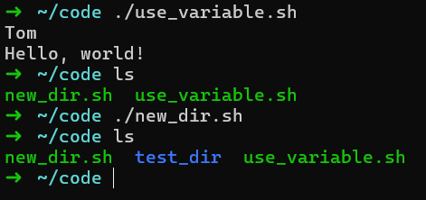
    <br>
    <div style="color:orange; border-bottom: 1px solid #d9d9d9;
    display: inline-block;
    color: #999;
    padding: 2px;"> 图2.1.1 variable运行结果</div>
</center>	

### **2.1.3 环境变量**

环境变量是系统中全局生效的变量，用来存储系统运行时的一些配置信息，比如`PATH`变量，它存储了系统搜索命令的路径。在 Shell 脚本里可以访问和修改环境变量。要查看当前系统的`PATH`变量值，可使用如下命令：

```bash
#!/bin/bash
echo $PATH
```

如果想在脚本里临时修改`PATH`变量，添加一个新的路径，示例如下[点击下载](code/02_Shell/2-1-variable/env_variable.sh)：

```bash
#!/bin/bash
# 备份原PATH变量值
old_path=$PATH
echo "old path: $old_path"
# 添加新路径到PATH变量
PATH=$PATH:/new/path
echo "new path: $PATH"
# 恢复原PATH变量值
PATH=$old_path
```

这个脚本先备份`PATH`变量的原始值，再添加新路径并输出修改后的`PATH`变量值，最后恢复原始值，结果如图2.1.2所示。
<center>
    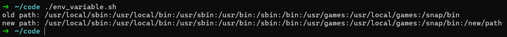
    <br>
    <div style="color:orange; border-bottom: 1px solid #d9d9d9;
    display: inline-block;
    color: #999;
    padding: 2px;"> 图2.1.2 临时修改环境变量</div>
</center>	

### **2.1.4 Shell 脚本传参**

在执行 Shell 脚本时，可以向脚本传递参数。在脚本内部，通过`$1`、`$2`、`$3`…… 来获取这些参数，`$1`表示第一个参数，`$2`表示第二个参数，以此类推。比如，编写一个接收两个参数并输出它们的脚本：

```bash
#!/bin/bash
echo "脚本名：$0"
echo "传入参数个数为：$#"
echo "第一个参数是：$1"
echo "第二个参数是：$2"
echo "整体参数是：$*"
echo "参数列表是：$@"
```

保存脚本为`param.sh` [点击下载](code/02_Shell/2-1-variable/param.sh)，执行时传递参数：

```bash
bash param.sh apple banana
```
<center>
    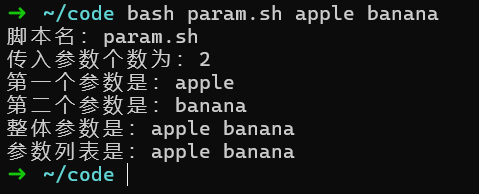
    <br>
    <div style="color:orange; border-bottom: 1px solid #d9d9d9;
    display: inline-block;
    color: #999;
    padding: 2px;"> 图2.1.3 Shell脚本传参</div>
</center>	

运行结果如图2.1.3所示：

- `$0`代表脚本本身的名字
- `$#`表示传递给脚本的参数个数
- `$*`和`$@`都表示所有参数，但它们在使用上有些细微差别
- `$*`会把所有参数当成一个整体
- `$@`会把每个参数当成独立的个体

## **2.2 数组**

### **2.2.1 定义数组**

在 Shell 脚本中，数组用于存储多个值。定义数组有多种方式，比如可以在定义时直接赋值：

```bash
#!/bin/bash
fruits=("apple" "banana" "cherry")
```

也可以逐个赋值：

```bash
#!/bin/bash
fruits[0]="apple"
fruits[1]="banana"
fruits[2]="cherry"
```

### **2.2.2 数组操作**

访问数组元素时，通过数组名加下标（**下标从 0 开始**）的方式，例如访问上面`fruits`数组的第一个元素：

```bash
#!/bin/bash
fruits=("apple" "banana" "cherry")
echo ${fruits[0]}
```

如果想获取数组的所有元素，可以使用`*`或`@`：

```bash
#!/bin/bash
fruits=("apple" "banana" "cherry")
echo ${fruits[*]}
echo ${fruits[@]}
```

获取数组长度（即元素个数）的方法为：

```bash
#!/bin/bash
fruits=("apple" "banana" "cherry")
echo ${#fruits[@]}
```

还能向数组中添加元素，假设要给`fruits`数组添加一个新元素`"date"`：

```bash
#!/bin/bash
fruits=("apple" "banana" "cherry")
fruits+=("date")
echo ${fruits[@]}
```

[点击下载](code/02_Shell/2-2-array/)示例代码后，运行结果如图2.2.1所示：
<center>
    
    <br>
    <div style="color:orange; border-bottom: 1px solid #d9d9d9;
    display: inline-block;
    color: #999;
    padding: 2px;"> 图2.2.1 Shell数组</div>
</center>	

## **2.3 字符串**
### **2.3.1 定义字符串**

定义字符串的方式有单引号、双引号和不使用引号三种：

- 用**单引号定义**的字符串，其中的变量不会被替换，原样输出；
- 用**双引号定义**的字符串，其中的变量会被替换成实际值；
- **不使用引号定义**时，适用于简单的字符串，且字符串中不能包含空格等特殊字符。

示例如下[点击下载](code/02_Shell/2-3-string/define_str.sh)：

```bash
#!/bin/bash
name=Tom
str1='Hello, $name'
str2="Hello, $name"
str3=Hello
echo $str1
echo $str2
echo $str3
```
运行结果如图2.3.1所示：
<center>
    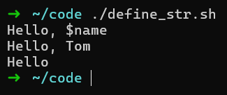
    <br>
    <div style="color:orange; border-bottom: 1px solid #d9d9d9;
    display: inline-block;
    color: #999;
    padding: 2px;"> 图2.3.1 定义字符串</div>
</center>

### **2.3.2 字符串操作**

获取字符串长度的方法是在字符串前使用`#`符号，例如：

```bash
#!/bin/bash
str="Hello, world!"
echo ${#str}
```

字符串拼接很简单，直接将两个字符串写在一起即可，示例如下：

```bash
#!/bin/bash
str1="Hello"
str2="world"
result=$str1$str2
echo $result
```

结合字符串拼接和长度示例代码[点击下载](code/02_Shell/2-3-string/use_str.sh)，执行结果如图2.3.2所示：
<center>
    
    <br>
    <div style="color:orange; border-bottom: 1px solid #d9d9d9;
    display: inline-block;
    color: #999;
    padding: 2px;"> 图2.3.2 使用字符串</div>
</center>


查找子字符串可以使用`grep`命令，比如查找字符串`"Hello, world!"`中是否包含`"world"`，[点击下载示例代码](code/02_Shell/2-3-string/search_str.sh)：

```bash
#!/bin/bash
str="Hello, world!"
sub_str="world"
if echo "$str" | grep -q "$sub_str"; then
    echo "包含子字符串$sub_str"
else
    echo "不包含子字符串$sub_str"
fi
```

运行结果如图2.3.3所示：
<center>
    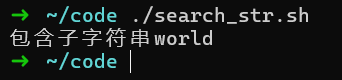
    <br>
    <div style="color:orange; border-bottom: 1px solid #d9d9d9;
    display: inline-block;
    color: #999;
    padding: 2px;"> 图2.3.3 查找字符串</div>
</center>


# **3. Shell 脚本控制结构**

## **3.1 顺序结构**

顺序结构是 Shell 脚本中最基本的执行结构，它按照脚本中命令出现的先后顺序依次执行。在顺序结构中，脚本从第一行命令开始，逐行执行，直到脚本的最后一行。

示例[点击下载](code/02_Shell/3-1-sequential/)：

```bash
#!/bin/bash
echo "开始执行脚本"
mkdir new_dir
echo "创建了目录 new_dir"
cd new_dir
echo "进入了 new_dir 目录"
```

在这个脚本里，首先会输出 “开始执行脚本”，然后执行`mkdir new_dir`命令创建一个名为`new_dir`的目录，接着输出 “创建了目录 new_dir”，再执行`cd new_dir`命令进入该目录，最后输出 “进入了 new_dir 目录” 。整个过程严格按照命令的先后顺序依次执行。执行结果如图3.1.1所示：
<center>
    
    <br>
    <div style="color:orange; border-bottom: 1px solid #d9d9d9;
    display: inline-block;
    color: #999;
    padding: 2px;"> 图3.1.1 顺序结构</div>
</center>

## **3.2 选择结构**

### **3.2.1 if-else选择结构**

`if - else`结构用于根据条件判断来决定执行不同的代码块。基本语法如下：

```bash
if [ 条件判断 ]; then
    # 条件成立时执行的代码块
else
    # 条件不成立时执行的代码块
fi
```

在条件判断中，可以使用各种比较运算符，如`-eq`（等于）、`-ne`（不等于）、`-gt`（大于）、`-lt`（小于）、`-ge`（大于等于）、`-le`（小于等于）等。例如[点击下载示例代码](code/02_Shell/3-2-conditional/numerical.sh)，判断一个数是否大于 10：

```bash
#!/bin/bash
num=15
if [ $num -gt 10 ]; then
    echo "$num 大于 10"
else
    echo "$num 小于等于 10"
fi
```

运行上述脚本，会输出 “15 大于 10”，结果如图3.2.1所示：
<center>
    
    <br>
    <div style="color:orange; border-bottom: 1px solid #d9d9d9;
    display: inline-block;
    color: #999;
    padding: 2px;"> 图3.2.1 if-else选择结构</div>
</center>


还可以使用逻辑运算符（`&&`表示逻辑与，`||`表示逻辑或）连接多个条件。比如判断一个数是否在 10 到 20 之间[点击下载示例代码](code/02_Shell/3-2-conditional/logical.sh)：

```bash
#!/bin/bash
num=15
if [ $num -gt 10 ] && [ $num -lt 20 ]; then
    echo "$num 在 10 到 20 之间"
else
    echo "$num 不在 10 到 20 之间"
fi
```
结果如图3.2.2所示：
<center>
    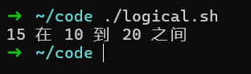
    <br>
    <div style="color:orange; border-bottom: 1px solid #d9d9d9;
    display: inline-block;
    color: #999;
    padding: 2px;"> 图3.2.2 if-else选择结构</div>
</center>

### **3.2.2 case选择结构**

`case`结构用于根据变量的值从多个分支中选择一个执行，适用于对同一个变量进行多种不同值的判断。基本语法如下：

```bash
case 变量 in
模式1)
    # 变量值等于模式1时执行的代码块
    ;;
模式2)
    # 变量值等于模式2时执行的代码块
    ;;
*)
    # 变量值不匹配任何模式时执行的代码块
    ;;
esac
```

例如，根据用户输入的选项执行不同操作[点击下载示例代码](code/02_Shell/3-2-conditional/case.sh)：

```bash
#!/bin/bash
echo "请输入选项：1. 查看目录 2. 创建文件 3. 退出"
read choice
case $choice in
1)
    ls
    ;;
2)
    touch new_file.txt
    echo "创建了文件 new_file.txt"
    ;;
3)
    echo "退出程序"
    exit 0
    ;;
*)
    echo "无效的选项"
    ;;
esac
```

根据不同输出执行对应操作，执行结果如图3.2.3所示：
<center>
    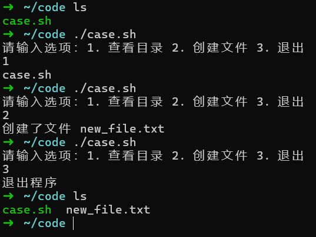
    <br>
    <div style="color:orange; border-bottom: 1px solid #d9d9d9;
    display: inline-block;
    color: #999;
    padding: 2px;"> 图3.2.3 case选择结构</div>
</center>

## **3.3 循环结构**
### **3.3.1 for循环结构**

`for`循环常用于对一组数据进行重复操作。基本语法有两种：

- 一种是针对列表的循环：

```bash
for 变量 in 列表; do
    # 循环体代码块
done
```

例如，遍历一个水果列表并输出每个水果[点击下载示例代码](code/02_Shell/3-3-loop/for_array.sh)：

```bash
#!/bin/bash
fruits=("apple" "banana" "cherry")
for fruit in ${fruits[@]}; do
    echo $fruit
done
```

<center>
    
    <br>
    <div style="color:orange; border-bottom: 1px solid #d9d9d9;
    display: inline-block;
    color: #999;
    padding: 2px;"> 图3.3.1 for循环结构</div>
</center>

- 一种是数值循环，语法如下：

```bash
for (( 初始值; 条件; 增量 )); do
    # 循环体代码块
done
```

比如，从 1 到 5 进行计数并输出[点击下载示例代码](code/02_Shell/3-3-loop/for_num.sh)：

```bash
#!/bin/bash
for ((i=1; i<=5; i++)); do
    echo $i
done
```
<center>
    
    <br>
    <div style="color:orange; border-bottom: 1px solid #d9d9d9;
    display: inline-block;
    color: #999;
    padding: 2px;"> 图3.3.2 for循环结构</div>
</center>

### **3.3.2 while循环结构**

`while`循环会在条件为真时不断执行循环体。基本语法如下：

```bash
while [ 条件判断 ]; do
    # 循环体代码块
done
```

例如，计算 1 到 10 的累加和[点击下载示例代码](code/02_Shell/3-3-loop/while.sh)：

```bash
#!/bin/bash
sum=0
i=1
while [ $i -le 10 ]; do
    sum=$((sum + i))
    i=$((i + 1))
done
echo "1到10的累加和是：$sum"
```
<center>
    
    <br>
    <div style="color:orange; border-bottom: 1px solid #d9d9d9;
    display: inline-block;
    color: #999;
    padding: 2px;"> 图3.3.3 while循环结构</div>
</center>

在这个脚本中，只要`i`小于等于 10，就会不断执行循环体，将`i`累加到`sum`中，并使`i`自增 1 ，最后输出累加和。

### **3.3.3 until循环结构**

`until`循环与`while`循环相反，它会在条件为假时不断执行循环体，直到条件为真时停止。基本语法如下：

```bash
until [ 条件判断 ]; do
    # 循环体代码块
done
```

例如，同样计算 1 到 10 的累加和[点击下载示例代码](code/02_Shell/3-3-loop/until.sh)：

```bash
#!/bin/bash
sum=0
i=1
until [ $i -gt 10 ]; do
    sum=$((sum + i))
    i=$((i + 1))
done
echo "1到10的累加和是：$sum"
```
<center>
    
    <br>
    <div style="color:orange; border-bottom: 1px solid #d9d9d9;
    display: inline-block;
    color: #999;
    padding: 2px;"> 图3.3.4 until循环结构</div>
</center>

这里只要`i`不大于 10，即`i`小于等于 10 时，就会执行循环体，直到`i`大于 10 时停止循环，输出累加和。

# **4. Shell 脚本函数**

## **4.1 定义函数**

在 Shell 脚本中，函数是一段可重复使用的代码块，将相关的命令组合在一起，方便在脚本的不同位置调用执行。定义函数的基本语法如下：

```bash
函数名() {
    命令序列
}
```

例如，定义一个简单的函数用于输出问候语：

```bash
#!/bin/bash
say_hello() {
    echo "Hello, everyone!"
}
```

在这个例子中，`say_hello`是函数名，函数体包含一条`echo`命令，用于输出 “Hello, everyone!”。注意，函数定义中函数名后面的括号是必需的，即使没有参数也不能省略

## **4.2 使用函数**

定义好函数后，就可以在脚本中调用它。调用函数很简单，直接使用函数名即可，[点击下载示例代码](code/02_Shell/4-2-function/say_hello.sh)。例如：

```bash
#!/bin/bash
say_hello() {
    echo "Hello, everyone!"
}

# 调用函数
say_hello
```

<center>
    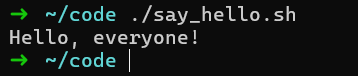
    <br>
    <div style="color:orange; border-bottom: 1px solid #d9d9d9;
    display: inline-block;
    color: #999;
    padding: 2px;"> 图4.2.1 调用函数</div>
</center>

运行上述脚本，会输出 “Hello, everyone!”。函数还可以接收参数，在函数内部通过`$1`、`$2`等特殊变量来获取传递的参数，和脚本接收参数的方式类似。下面是一个带参数的函数示例[点击下载](code/02_Shell/4-2-function/sum.sh)，该函数用于计算两个数的和：

```bash
#!/bin/bash
sum() {
    result=$(( $1 + $2 ))
    echo "两数之和为：$result"
}

# 调用函数并传递参数
sum 5 3
```

<center>
    
    <br>
    <div style="color:orange; border-bottom: 1px solid #d9d9d9;
    display: inline-block;
    color: #999;
    padding: 2px;"> 图4.2.2 函数传参</div>
</center>

在这个脚本中，`sum`函数接收两个参数，通过`$1`和`$2`获取这两个参数的值，计算它们的和并输出结果。运行脚本后，会输出 “两数之和为：8”。

函数还可以有返回值，在 Shell 脚本中，函数的返回值通过`return`命令来指定，返回值是一个整数，范围是 0 - 255。0 通常表示成功，非 0 表示失败。例如[点击下载示例代码](code/02_Shell/4-2-function/check_number.sh)：

```bash
#!/bin/bash
check_number() {
    if [ $1 -gt 10 ]; then
        return 0
    else
        return 1
    fi
}

check_number 15
if [ $? -eq 0 ]; then
    echo "数字大于10"
else
    echo "数字小于等于10"
fi
```

<center>
    
    <br>
    <div style="color:orange; border-bottom: 1px solid #d9d9d9;
    display: inline-block;
    color: #999;
    padding: 2px;"> 图4.2.3 函数返回</div>
</center>

在示例中，`check_number`函数接收一个参数，判断该参数是否大于 10，根据判断结果返回不同的值。在函数调用后，通过`$?`获取函数的返回值并进行判断，从而输出相应的信息。

# **5. 外部命令**

在 Shell 脚本的世界里，除了掌握基本的数据结构、控制结构和函数知识外，与外部命令协作是提升脚本功能和实用性的关键。外部命令如同 Shell 脚本的得力助手，赋予脚本更强大的处理能力，前面的示例中已经出现过很多命令了，这里详细介绍几个常用的命令。

## **5.1 echo**

`echo`是 Shell 中常用的外部命令，主要用于在终端输出文本或变量值。它的基本语法是`echo [选项] [字符串或变量]` 。例如，直接输出一段文本：

```bash
echo "这是一段简单的文本"
```

当需要输出变量值时，如下：

```bash
name="Alice"
echo "欢迎 $name"
```

`echo`命令还有一些实用的选项，比如`-n`选项，它可以使`echo`命令在输出内容后不换行。例如：

```bash
echo -n "第一行内容"
echo " 第二行内容"
```

上述代码执行后，“第一行内容” 和 “第二行内容” 会显示在同一行。`-e`选项则用于启用转义字符的解析，像`\n`（换行）、`\t`（制表符）等。示例如下：

```bash
echo -e "第一行\n第二行"
```

运行后会在终端分两行输出 “第一行” 和 “第二行”。

<center>
    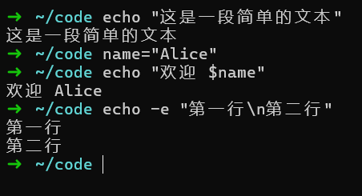
    <br>
    <div style="color:orange; border-bottom: 1px solid #d9d9d9;
    display: inline-block;
    color: #999;
    padding: 2px;"> 图5.1.1 echo命令</div>
</center>

## **5.2 awk**

`awk`是一种强大的文本处理工具，它擅长从文本数据中提取字段、进行计算和格式化输出。`awk`的基本语法是`awk [选项] '模式 {动作}' [文件]`。

假设有一个名为`data.txt`的文件[点击下载文件](code/02_Shell/5-2-text/data.txt)，内容如下：

```plaintext
Alice 25 Engineer
Bob 30 Designer
Charlie 35 Doctor
```

要提取每行的第一个字段（名字），可以使用以下命令：

```bash
awk '{print $1}' data.txt
```
<center>
    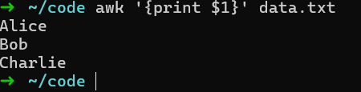
    <br>
    <div style="color:orange; border-bottom: 1px solid #d9d9d9;
    display: inline-block;
    color: #999;
    padding: 2px;"> 图5.2.1 awk print</div>
</center>

这里`{print $1}`是动作，表示打印每行的第一个字段。`$1`代表第一个字段，`$2`代表第二个字段，以此类推。

`awk`还能进行简单的计算。比如，计算文件中所有人年龄的总和（假设第二列为年龄）：

```bash
awk '{sum+=$2} END {print sum}' data.txt
```
<center>
    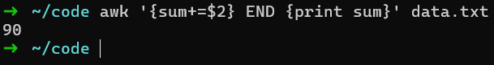
    <br>
    <div style="color:orange; border-bottom: 1px solid #d9d9d9;
    display: inline-block;
    color: #999;
    padding: 2px;"> 图5.2.2 awk sum</div>
</center>

在这个命令中，`{sum+=$2}`是在处理每一行时，将第二列的值累加到`sum`变量中。`END`是一个特殊的模式，表示在处理完所有行后执行后面的动作，这里是打印`sum`的值，即年龄总和为`90`。

## **5.3 grep**

`grep`用于在文本中搜索指定的模式，返回包含匹配内容的行。基本语法是`grep [选项] '模式' [文件]`。

还是以上面的`data.txt`文件为例，要查找文件中包含 “Bob” 的行，使用如下命令：

```bash
grep "Bob" data.txt
```
<center>
    
    <br>
    <div style="color:orange; border-bottom: 1px solid #d9d9d9;
    display: inline-block;
    color: #999;
    padding: 2px;"> 图5.3.1 grep命令</div>
</center>

`grep`支持多种匹配模式，比如使用正则表达式。如果要查找名字以 “C” 开头的行，可以这样写：

```bash
grep "^C" data.txt
```
<center>
    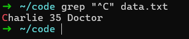
    <br>
    <div style="color:orange; border-bottom: 1px solid #d9d9d9;
    display: inline-block;
    color: #999;
    padding: 2px;"> 图5.3.2 grep命令</div>
</center>

这里`^`是正则表达式中的锚定符号，表示行的开头，所以`^C`表示以 “C” 开头的行。

`grep`还有一些常用选项，`-i`选项用于忽略大小写匹配。例如，搜索文件中包含 “alice” 的行（不区分大小写）：

```bash
grep -i "alice" data.txt
```
<center>
    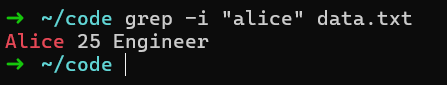
    <br>
    <div style="color:orange; border-bottom: 1px solid #d9d9d9;
    display: inline-block;
    color: #999;
    padding: 2px;"> 图5.3.3 grep命令</div>
</center>

`-v`选项则用于显示不匹配指定模式的行。比如，显示文件中不包含 “Engineer” 的行：

```bash
grep -v "Engineer" data.txt
```
<center>
    
    <br>
    <div style="color:orange; border-bottom: 1px solid #d9d9d9;
    display: inline-block;
    color: #999;
    padding: 2px;"> 图5.3.4 grep命令</div>
</center>


## **5.4 sed**

`sed`是一个流编辑器，用于对文本进行行编辑操作，如替换、删除、插入等。基本语法是`sed [选项] '命令' [文件]`。

在`data.txt`文件中，将 “Engineer” 替换为 “Programmer”，可以使用以下命令：

```bash
sed 's/Engineer/Programmer/' data.txt
```
<center>
    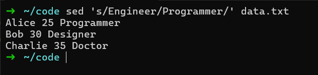
    <br>
    <div style="color:orange; border-bottom: 1px solid #d9d9d9;
    display: inline-block;
    color: #999;
    padding: 2px;"> 图5.4.1 sed命令</div>
</center>

这里`'s/Engineer/Programmer/'`是`sed`的替换命令，`s`表示替换，斜杠之间的 “Engineer” 是要被替换的字符串，“Programmer” 是替换后的字符串。

如果要删除文件中包含 “Bob” 的行，命令如下：

```bash
sed '/Bob/d' data.txt
```
<center>
    
    <br>
    <div style="color:orange; border-bottom: 1px solid #d9d9d9;
    display: inline-block;
    color: #999;
    padding: 2px;"> 图5.4.2 sed命令</div>
</center>

`/Bob/d`表示匹配包含 “Bob” 的行，并执行删除操作。

`sed`还可以在文件中插入内容。比如，在文件每一行的开头插入 “Name:”，命令如下：

```bash
sed 's/^/Name: /' data.txt
```
<center>
    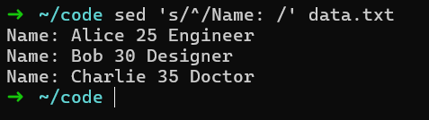
    <br>
    <div style="color:orange; border-bottom: 1px solid #d9d9d9;
    display: inline-block;
    color: #999;
    padding: 2px;"> 图5.4.3 sed命令</div>
</center>

这里`^`表示行的开头，`s/^/Name: /`表示在每行开头插入 “Name:”。

上面通过`sed`命令进行的修改都只会输出在屏幕上，如果要直接修改文件，则需要指定参数：

- `-i`：表示直接修改原文件，操作是不可逆的
- `-i.bak`：自动创建备份文件，会出现一个`原文件名.bak`的文件，内容是修改前的文件内容

<center>
    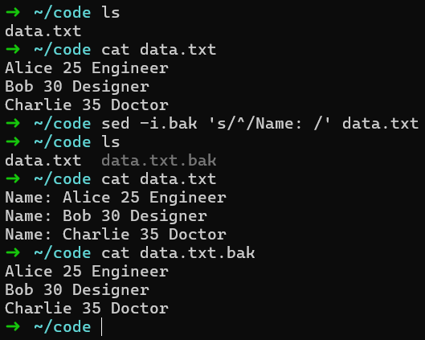
    <br>
    <div style="color:orange; border-bottom: 1px solid #d9d9d9;
    display: inline-block;
    color: #999;
    padding: 2px;"> 图5.4.4 sed命令</div>
</center>
可以看到`data.txt`的内容已经被修改了，而自动出现了`data.txt.bak`文件，文件内容与`data.txt`修改前内容相同。

<center>
    
    <br>
    <div style="color:orange; border-bottom: 1px solid #d9d9d9;
    display: inline-block;
    color: #999;
    padding: 2px;"> 图5.4.5 sed命令</div>
</center>
而直接`-i`就会修改源文件，且不会生成备份文件。