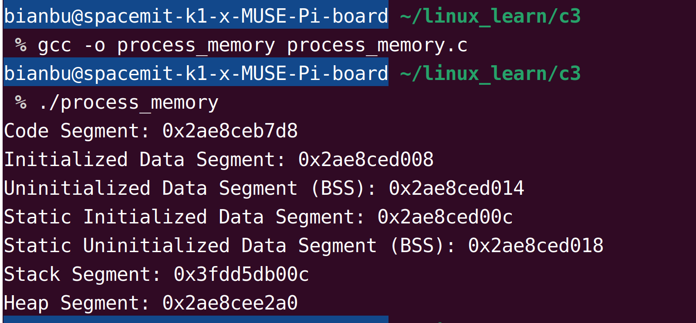
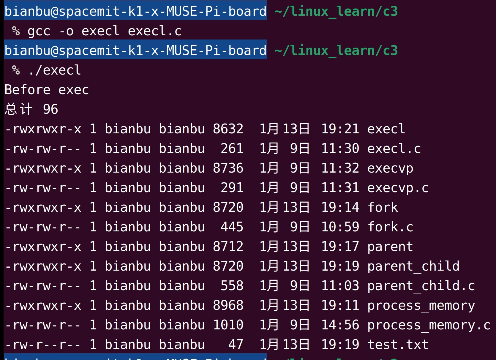
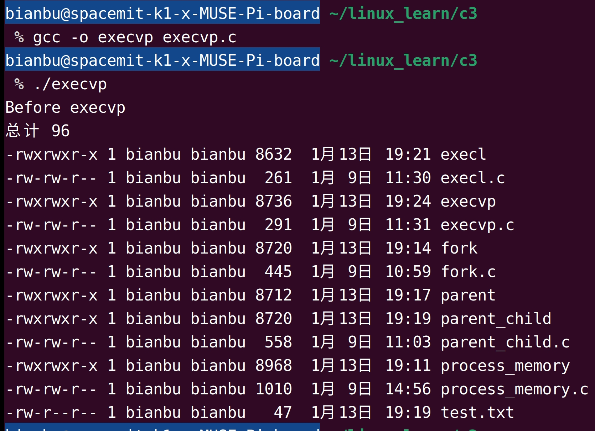
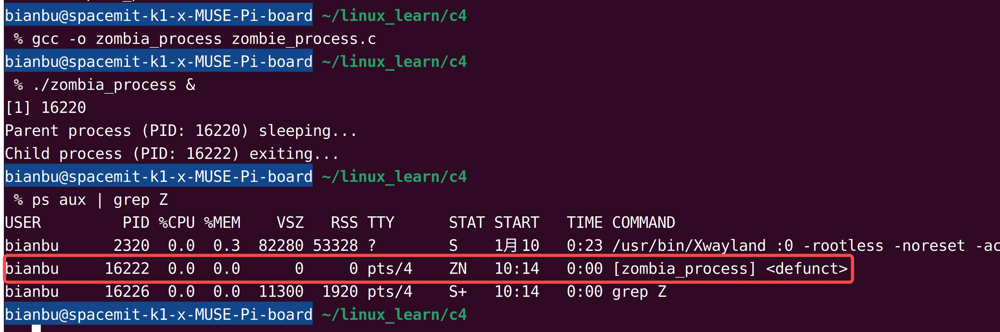
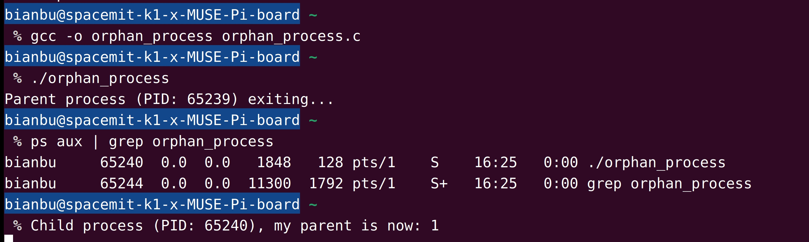

# 1. 进程简介

**进程**是操作系统中资源分配和调度的基本单位，是程序的一次执行过程。一个程序在操作系统中运行时，被操作系统创建为一个进程。每个进程具有自己独立的地址空间，并能够与操作系统交互完成任务。

## **1.1 进程的特性**

进程有以下特性：

- **动态性：**进程是程序的执行实体，它具有生命周期，从创建到终止都处于动态变化中。

- **独立性：**每个进程都有独立的资源和运行环境，不受其他进程的直接影响。

- **并发性：**多个进程可以同时运行（在多核处理器上并行运行，在单核处理器上通过时间片轮转并发执行）。

- **控制性：**进程可以由操作系统调度，也可以由其他进程控制（如父进程与子进程之间的关系）。

## **1.2 进程与程序的区别**

尽管“程序”和“进程”这两个术语在日常使用中常被混淆，但它们在操作系统中具有明确的区别：

| 特性         | 程序                                                 | 进程                                   |
| :----------- | :--------------------------------------------------- | :------------------------------------- |
| **定义**     | 程序是一个静态的代码文件，是磁盘上的指令和数据集合。 | 进程是程序在操作系统中的动态执行实例。 |
| **存储位置** | 程序存储在磁盘等存储设备中。                         | 进程存在于内存中。                     |
| **动态性**   | 程序是静态的，只是代码和数据的集合。                 | 进程是动态的，有生命周期。             |
| **并发性**   | 程序本身不能并发执行。                               | 多个进程可以并发运行。                 |

比如，一个文本编辑器的可执行文件（如 `vim`）是一个程序。当用户打开 `vim` 时，操作系统为该程序创建一个进程来执行，这就是进程。

## 1.3 查看系统进程

在 Linux 系统中，可以使用 `top` 和 `htop` 工具查看当前运行的进程，功能类似于 Windows 系统中的任务管理器。这些工具能够实时显示系统资源使用情况，包括 CPU、内存占用及各个进程的详细信息。

通过终端安装 `htop` 工具：

```bash
sudo apt update
sudo apt install htop
```

安装完成后，在终端中输入以下命令启动 `htop`：

```bash
htop
```

运行后，会显示一个类似于图1.3.1所示的界面：

<figure style="text-align: center;">      <figcaption style="margin-top: 10px; color: #555;">图1.3.1 使用 htop 查看系统进程</figcaption> </figure>

在 `htop` 界面中，每一条记录代表一个进程，展示了该进程的相关信息，例如 PID（进程 ID）、用户、CPU 使用率、内存使用量等。用户可以通过上下箭头键浏览列表，并使用功能键（如 F4、F9）进行筛选或结束进程。

如图1.3.1所示，红框部分标注了当前运行的 Chromium 浏览器进程，并可以清晰地看到它的资源占用情况。

# 2. 进程的内存布局

在Linux操作系统中，每个进程都有独立的虚拟地址空间，用于管理和组织进程运行时所需的内存资源。进程的内存空间按照功能分为多个区域，各区域负责存储不同类型的数据或代码，便于操作系统对内存的高效管理。

## 2.1 内存布局详解

典型的进程内存布局如图2.1.1所示：

<figure style="text-align: center;"> <!-- 设置居中 -->
   <!-- 调整大小 -->
  <figcaption style="margin-top: 10px; color: #555;">图2.1.1 进程内存布局</figcaption>
</figure>

从高地址到低地址，每个区域的作用如下：

内存地址最高处存储程序的命令行参数（如 `argv`）以及环境变量（如 `PATH`、`HOME` 等）。这些内容在程序启动时由操作系统加载到内存中。

#### **1）栈区（Stack）：**

栈区用于存储函数的局部变量、函数参数以及函数调用时的返回地址。它的内存分配和释放由编译器自动完成，在程序块开始时分配内存，结束时释放。栈区从高地址向低地址增长，操作方式类似于数据结构中的栈。

#### **2）堆区（Heap）：**

堆区用于动态分配内存（如使用 `malloc`、`calloc` 等）。与栈区不同，堆区的内存分配和释放由程序员手动控制。如果忘记释放，可能会造成内存泄漏。堆区从低地址向高地址增长。

栈区和堆区之间的区域未被分配，用于供栈和堆动态扩展。如果堆和栈增长到这一区域并发生冲突，将导致内存错误（如堆栈碰撞）。

#### **3）未初始化数据段（BSS）：**

存储未初始化的全局变量和静态变量。在程序加载时，这些变量会被自动初始化为 0。BSS 段在程序中未占用实际的文件大小，而是在运行时动态分配。

#### **4）初始化数据段（Data）：**

存储已初始化的全局变量和静态变量。在程序加载时，这些变量会被初始化为定义的值。与 BSS 段不同，初始化数据段占用实际的程序文件大小。

#### **5）代码段（Text）：**

存储程序的可执行指令（即函数体的二进制代码）。代码段通常是只读的，以防止意外修改代码。多个进程运行相同程序时，可以共享代码段。

## 2.2 示例：内存布局查看

以下代码 process_memory.c [(点击下载)](code/08_process_basic/2-1-process-memory) 通过打印变量地址来展示内存布局中的不同区域：

```c
#include <stdio.h>
#include <stdlib.h>

int global_initialized = 10;        // 初始化数据段
int global_uninitialized;           // 未初始化数据段

void memory_demo() {
    static int static_initialized = 20;   // 初始化数据段
    static int static_uninitialized;      // 未初始化数据段

    int local_var = 30;                   // 栈区
    int *dynamic_var = malloc(sizeof(int)); // 堆区
    *dynamic_var = 40;

    printf("Code Segment: %p\n", (void*)memory_demo);
    printf("Initialized Data Segment: %p\n", (void*)&global_initialized);
    printf("Uninitialized Data Segment (BSS): %p\n", (void*)&global_uninitialized);
    printf("Static Initialized Data Segment: %p\n", (void*)&static_initialized);
    printf("Static Uninitialized Data Segment (BSS): %p\n", (void*)&static_uninitialized);
    printf("Stack Segment: %p\n", (void*)&local_var);
    printf("Heap Segment: %p\n", (void*)dynamic_var);

    free(dynamic_var);
}

int main() {
    memory_demo();
    return 0;
}
```

编译和运行结果如图2.1.2所示，可以看到，从代码段到栈区，地址是递增的。

<figure style="text-align: center;"> <!-- 设置居中 -->
   <!-- 调整大小 -->
  <figcaption style="margin-top: 10px; color: #555;">图2.1.2 进程内存布局代码演示</figcaption>
</figure>

# 3. 进程的创建

在Linux系统中，进程的创建是通过系统调用完成的，其中 **`fork`** 和 **`exec`** 是两个核心系统调用。`fork` 用于创建新进程，`exec` 则用于在进程中加载和执行新的程序。两者的结合构成了多进程编程的基础。

## 3.1 父子进程与`fork`函数

`fork` 是 Linux 中用于创建新进程的系统调用，它通过复制当前进程（父进程）的地址空间来创建一个子进程。子进程是父进程的副本，但具有独立的进程 ID，并且可以独立运行。

### 3.1.1 父子进程的资源分配

父子进程之间既有共享的资源，也有独立的部分：

**共享资源：**

- 文件描述符： 父子进程可以同时访问相同的文件描述符。例如，如果父进程打开一个文件，子进程可以继续读写该文件。
- 环境变量： 子进程继承父进程的环境变量，如路径和配置。

**独立资源：**

- 内存： 父子进程各自拥有独立的内存空间，即使子进程最初是父进程的副本，但之后对内存的修改不会相互影响（写时复制机制，Copy-On-Write）。
- 程序计数器和栈： 每个进程都有自己的执行栈和程序计数器，独立执行。

### 3.1.2 `fork` 函数介绍

`fork` 函数定义在 `<unistd.h>` 头文件中，其原型如下：

```c
pid_t fork(void);
```

根据返回值来区分父进程和子进程：

- 父进程中：返回子进程的 PID（> 0）。
- 子进程中：返回 0。
- 失败时：返回 -1，并设置 `errno` 表示具体错误。

### 3.1.3 示例：`fork` 创建子进程

以下代码 fork.c [(点击下载)](code/08_process_basic/3-1-fork) 展示了如何使用 `fork` 创建一个子进程，并区分父进程和子进程的进程号：

```c
#include <stdio.h>
#include <unistd.h>

int main() {
    pid_t pid = fork(); // 调用 fork 创建子进程

    if (pid == -1) {
        perror("fork failed");
        return -1;
    }

    if (pid == 0) {
        // 子进程
        printf("Child process: PID = %d, Parent PID = %d\n", getpid(), getppid());
    } else {
        // 父进程
        printf("Parent process: PID = %d, Child PID = %d\n", getpid(), pid);
    }

    return 0;
}
```

编译与运行结果如图3.1.1所示。

<figure style="text-align: center;"> <!-- 设置居中 -->
   <!-- 调整大小 -->
  <figcaption style="margin-top: 10px; color: #555;">图3.1.1 fork函数创建子进程</figcaption>
</figure>

### 3.1.4 示例：父子进程的文件共享

以下示例 parent_child.c [(点击下载)](code/08_process_basic/3-1-parent-child) 展示了父子进程如何共享文件描述符，同时写入同一个文件：

```c
#include <stdio.h>
#include <unistd.h>
#include <fcntl.h>

int main() {
    int fd = open("test.txt", O_WRONLY | O_CREAT | O_TRUNC, 0644);
    pid_t pid = fork();
    if (pid == -1) {
        perror("fork failed");
        return -1;
    }

    if (pid == 0) {
        // 子进程写入文件
        write(fd, "Child process writing.\n", 23);
    } else {
        // 父进程写入文件
        write(fd, "Parent process writing.\n", 24);
    }

    close(fd);
    return 0;
}
```

程序编译和运行结果如图3.1.2所示，父子进程对同一个文件执行写操作。

<figure style="text-align: center;"> <!-- 设置居中 -->
   <!-- 调整大小 -->
  <figcaption style="margin-top: 10px; color: #555;">图3.1.2 fork函数代码演示2</figcaption>
</figure>

## 3.2 `exec` 系列函数加载新程序

`exec` 系列函数用于在当前进程中加载一个新的程序。调用 `exec` 后，当前进程的代码和数据会被新的程序替换，但进程 ID 保持不变。`exec` 系列函数是构建父子进程模型的关键工具，常与 `fork` 结合使用。

常用的 `exec` 系列函数：

| 函数名称 | 功能                                                     |
| -------- | -------------------------------------------------------- |
| `execl`  | 参数通过可变参数列表传递，适用于参数数量固定的情况。     |
| `execv`  | 参数通过数组传递，适用于参数动态变化的情况。             |
| `execvp` | 类似于 `execv`，但可以通过 PATH 环境变量查找可执行文件。 |
| `execve` | `exec` 系列函数的底层实现，需要显式传递环境变量。        |

### 3.2.1 示例：`execl` 使用

以下代码 execl.c [(点击下载)](code/08_process_basic/3-2-execl) 展示了如何使用 `execl` 加载并执行 `ls` 命令：

```bash
#include <unistd.h>
#include <stdio.h>

int main() {
    printf("Before exec\n");

    // 使用 execl 执行 ls 命令
    execl("/bin/ls", "ls", "-l", NULL);

    // 如果 exec 成功，这行代码不会被执行
    perror("execl failed");
    return 0;
}
```

运行后，当前进程的代码会被 `ls` 命令替换，输出当前目录的文件列表。如图3.2.1所示。

<figure style="text-align: center;"> <!-- 设置居中 -->
   <!-- 调整大小 -->
  <figcaption style="margin-top: 10px; color: #555;">图3.2.1 execl函数代码演示</figcaption>
</figure>
### 3.2.2 示例：`execvp` 使用

以下代码 execvp.c [(点击下载)](code/08_process_basic/3-2-execvp) 展示了如何使用 `execvp`，从 PATH 环境变量中查找并执行程序：

```c
#include <unistd.h>
#include <stdio.h>

int main() {
    char *args[] = {"ls", "-l", NULL};

    printf("Before execvp\n");

    // 使用 execvp 执行 ls 命令
    execvp("ls", args);

    // 如果 execvp 成功，这行代码不会被执行
    perror("execvp failed");
    return 0;
}
```

程序运行后，`execvp` 将执行 `ls` 命令，并输出当前目录的文件列表。如图3.2.2所示。

<figure style="text-align: center;"> <!-- 设置居中 -->
   <!-- 调整大小 -->
  <figcaption style="margin-top: 10px; color: #555;">图3.2.2 execvp函数代码演示</figcaption>
</figure>

# 4. 僵尸进程与孤儿进程

在 Linux 系统中，进程之间的关系（如父子进程）会引发一些特殊的状态，比如僵尸进程和孤儿进程。这些状态的处理对系统资源管理至关重要，尤其是在复杂的并发程序中。

## **4.1 僵尸进程**

僵尸进程（Zombie Process）是指 **已经终止** 的子进程，但其父进程 **尚未回收其退出状态** 的一种特殊状态。僵尸进程占用了一定的系统资源（如进程表项），如果不被及时回收，可能导致系统资源耗尽。

**僵尸进程产生原因：**

当一个子进程执行完毕并退出时，操作系统会向其父进程发送 `SIGCHLD` 信号，通知父进程可以通过系统调用（如 `wait` 或 `waitpid`）获取子进程的退出状态。如果父进程没有及时处理 `SIGCHLD` 信号，子进程的进程表项（即进程描述符）会保留在内核中，导致子进程变成僵尸进程。

**僵尸进程的危害：**

僵尸进程不会真正占用 CPU 或内存资源，但它会占用有限的系统进程表项。如果系统中出现大量僵尸进程，可能会导致新的进程无法创建。

**如何解决僵尸进程：**

1）父进程回收子进程的资源：

- 使用 `wait` 或 `waitpid` 系统调用。
- 通过 `signal(SIGCHLD, SIG_IGN)` 告诉内核忽略子进程的退出状态，自动清理僵尸进程。

2）杀死父进程：

- 如果父进程无法正常回收子进程，杀死父进程会使子进程变为孤儿进程（参见下文），随后由 `init` 进程接管并回收。

### **示例：僵尸进程的产生**

以下代码 zombie_process.c [(点击下载)](code/08_process_basic/4-1-zombie) 展示了如何产生一个僵尸进程：

```c
#include <stdio.h>
#include <unistd.h>
#include <stdlib.h>

int main() {
    pid_t pid = fork();

    if (pid == -1) {
        perror("fork failed");
        return -1;
    }

    if (pid == 0) {
        // 子进程
        printf("Child process (PID: %d) exiting...\n", getpid());
        exit(0); // 子进程退出
    } else {
        // 父进程，故意不调用 wait() 回收子进程
        printf("Parent process (PID: %d) sleeping...\n", getpid());
        sleep(30); // 父进程休眠，子进程变为僵尸进程
    }

    return 0;
}
```

在上述代码中，子进程执行完毕后，通过 `exit()` 退出，此时父进程没有调用 `wait()` 或 `waitpid()` 来回收子进程的退出状态，导致子进程的进程表项（如 PID、退出状态）仍保留在内核中，等待父进程回收。所以子进程进入僵尸状态，占用系统资源，直到父进程回收或退出为止。

编译运行后，通过 `ps` 命令可以看到一个状态为 `Z` 的僵尸进程。运行结果如图4.1.1所示：

<figure style="text-align: center;"> <!-- 设置居中 -->
   <!-- 调整大小 -->
  <figcaption style="margin-top: 10px; color: #555;">图4.1.1 僵尸进程代码示例运行结果</figcaption>
</figure>


想要避免僵尸进程，需修改父进程的代码，添加 `waitpid` 调用回收子进程：

```c
if (pid > 0) {
    waitpid(pid, NULL, 0); // 回收子进程
    printf("Child process (PID: %d) has been cleaned up.\n", pid);
}
```

## **4.2 孤儿进程**

孤儿进程（Orphan Process）是指 **其父进程已经退出** 的子进程。这时，系统会将孤儿进程的父进程重新设置为 `init` 进程（PID 为 1），由 `init` 负责管理和回收孤儿进程。

**孤儿进程的特点:**

- 孤儿进程不会像僵尸进程一样长期占用系统资源，因为 `init` 进程会定期清理所有孤儿进程。
- 孤儿进程通常不会对系统造成危害，但如果父进程异常退出，可能会对程序逻辑产生不良影响。

### **示例：孤儿进程的产生**

以下代码 orphan_process.c [(点击下载)](code/08_process_basic/4-2-orphan) 展示了如何产生一个孤儿进程：

```c
#include <stdio.h>
#include <unistd.h>
#include <stdlib.h>

int main() {
    pid_t pid = fork();

    if (pid == -1) {
        perror("fork failed");
        return -1;
    }

    if (pid == 0) {
        // 子进程
        sleep(20); // 延迟 20 秒
        printf("Child process (PID: %d), my parent is now: %d\n", getpid(), getppid());
    } else {
        // 父进程
        printf("Parent process (PID: %d) exiting...\n", getpid());
        exit(0); // 父进程退出
    }

    return 0;
}
```

编译运行后，父进程会立即退出，子进程在休眠结束后发现其父进程变为 `init`。如图4.2.1所示。

<figure style="text-align: center;"> <!-- 设置居中 -->
   <!-- 调整大小 -->
  <figcaption style="margin-top: 10px; color: #555;">图4.1.1 僵尸进程代码示例运行结果</figcaption>
</figure>

# 5. 守护进程

守护进程（Daemon Process）是一种在后台运行的特殊进程，通常用于执行某些服务或长期运行的任务。

例如：

- `cron`：负责定时任务调度。
- `sshd`：负责处理远程登录。
- `httpd`：提供 HTTP 服务。

**守护进程的特点：**

- 后台运行： 它不直接与用户交互。
- 独立性： 通常脱离控制终端运行，不受用户会话的影响。

## 5.1 守护进程创建流程

创建守护进程的标准步骤如下：

**1）创建子进程，脱离父进程：**

通过 `fork` 创建子进程，并让父进程退出，保证子进程成为孤儿进程，由 `init` 接管。

这样做的好处是，守护进程不会依赖其创建者。

**2）调用 `setsid()`，创建新的会话：**

调用 `setsid` 使进程脱离当前终端，并成为会话的领导者。

**3）改变当前工作目录：**

通常将当前工作目录更改为根目录 `/`，避免占用可卸载文件系统。

**4）重设文件权限掩码：**

使用 `umask(0)` 清除文件权限掩码，确保守护进程创建的文件权限不受限制。

**5）关闭文件描述符：**

关闭标准输入、输出和错误（`stdin`、`stdout`、`stderr`），避免占用终端资源。

## 5.2 示例：守护进程的创建

以下代码 daemon_process.c [(点击下载)](code/08_process_basic/5-2-daemon) 展示了如何创建一个简单的守护进程：

```c
#include <stdio.h>
#include <stdlib.h>
#include <unistd.h>
#include <fcntl.h>
#include <sys/stat.h>
#include <sys/types.h>

void create_daemon() {
    pid_t pid;

    // 第一步：创建子进程，退出父进程
    pid = fork();
    if (pid < 0) {
        perror("fork failed");
        exit(EXIT_FAILURE);
    }
    if (pid > 0) {
        // 父进程退出
        exit(EXIT_SUCCESS);
    }

    // 第二步：创建新会话
    if (setsid() < 0) {
        perror("setsid failed");
        exit(EXIT_FAILURE);
    }

    // 第三步：更改工作目录
    if (chdir("/") < 0) {
        perror("chdir failed");
        exit(EXIT_FAILURE);
    }

    // 第四步：重设文件权限掩码
    umask(0);

    // 第五步：关闭文件描述符
    close(STDIN_FILENO);
    close(STDOUT_FILENO);
    close(STDERR_FILENO);

    // 守护进程的核心逻辑
    while (1) {
        // 模拟守护进程运行：每隔 5 秒写入日志
        int fd = open("/tmp/daemon.log", O_WRONLY | O_CREAT | O_APPEND, 0644);
        if (fd < 0) {
            exit(EXIT_FAILURE);
        }
        dprintf(fd, "Daemon is running...\n");
        close(fd);
        sleep(5);
    }
}

int main() {
    create_daemon();
    return 0;
}
```

编译并运行程序后，使用 `ps` 命令查看进程：

```
ps -ef | grep daemon_process
```

检查日志文件：

```
tail -f /tmp/daemon.log
```

运行结果如图5.1.1所示，可以看到前台已经退出，但进程依旧在后台执行，并每隔5秒打印文字到 `/tmp/daemon.log` 文件。

<figure style="text-align: center;"> <!-- 设置居中 -->
   <!-- 调整大小 -->
  <figcaption style="margin-top: 10px; color: #555;">图5.1.1 守护进程代码示例运行结果</figcaption>
</figure>