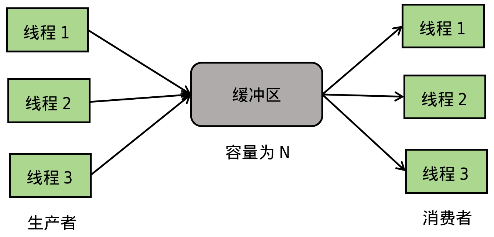
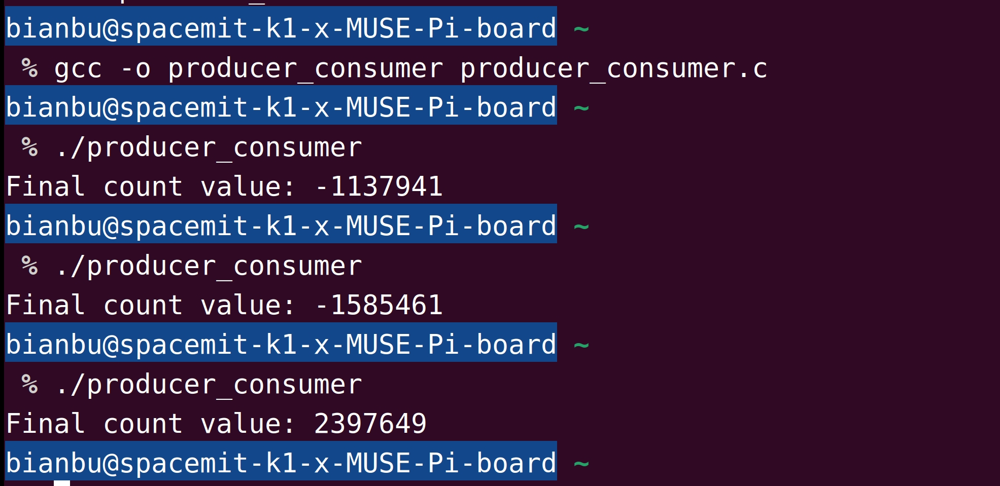
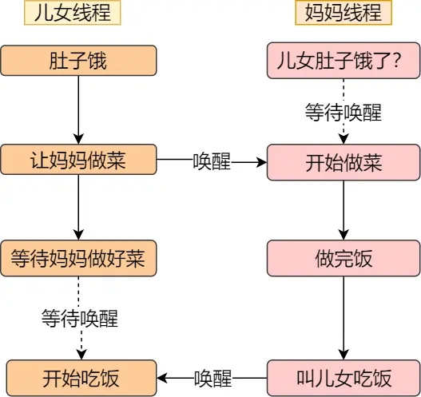
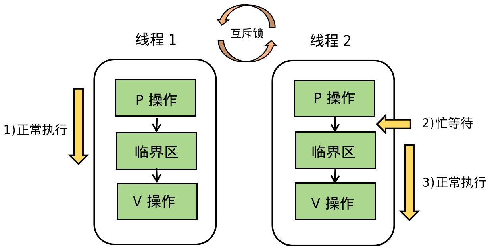
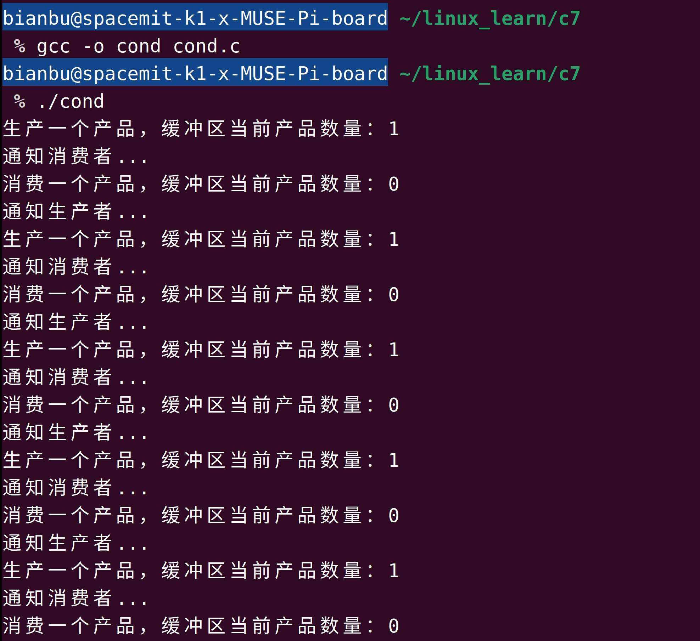
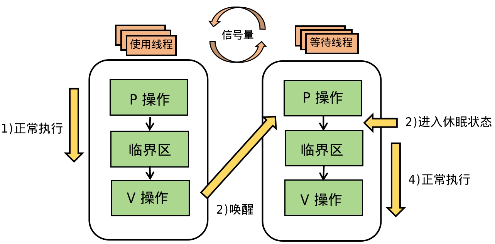
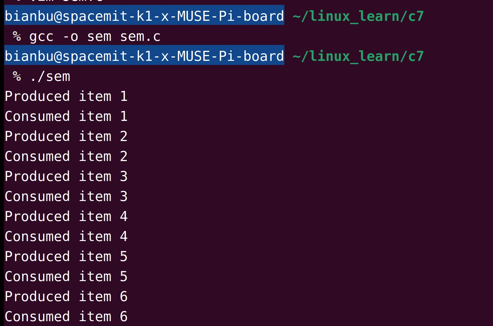

# 1. 为什么需要线程同步

## 1.1 线程安全性问题

多线程编程的优势在于能够并发执行多个任务，从而提高程序性能和资源利用率。然而，当多个线程同时访问共享资源时，如果缺乏有效保护机制，可能会导致数据竞争和资源冲突等问题，最终引发程序行为异常甚至崩溃。

常见线程安全性问题有：

- **数据不一致**：线程并发访问和修改共享资源时可能导致数据竞争，导致结果不可预测。例如，一个线程正在更新变量的值，另一个线程同时读取未更新完成的数据。
- **非原子操作**：共享资源的修改通常由多个步骤组成，例如变量的递增（`x++`）包含读取值、加一和写回三个步骤。多个线程并发执行这些操作可能导致最终结果错误。
- **程序异常**：未保护的共享资源访问可能引发内存错误、非法指针访问等问题，甚至导致程序崩溃。

### 示例：生产者-消费者模型

生产者-消费者问题是多线程编程中的经典例子。假设一个生产者线程生产产品放入缓冲区，消费者线程从缓冲区消费产品，二者并发执行。模型如图1.1.1所示：

<figure style="text-align: center;"> <!-- 设置居中 -->
   <!-- 调整大小 -->
  <figcaption style="margin-top: 10px; color: #555;">图1.1.1 生产者-消费者问题模型</figcaption>
</figure>
在缓冲区的操作中，假设生产者生产一个产品后，缓冲区的产品数加1；消费者消费一个产品后，缓冲区的产品数减1。在实际应用中，此过程分为以下三步：

1. 读取缓冲区的当前值到寄存器。
2. 在寄存器中执行加一或减一操作。
3. 将寄存器的值写回缓冲区。

如果生产者和消费者并发操作缓冲区，且操作步骤交错执行，可能会导致数据不一致。如图1.1.2所示：

<figure style="text-align: center;"> <!-- 设置居中 -->
   <!-- 调整大小 -->
  <figcaption style="margin-top: 10px; color: #555;">图1.1.2 生产者和消费者并发操作缓冲区</figcaption>
</figure>
在上述场景中，假设缓冲区初始产品数为10：

1. 生产者读取缓冲区值（10），并在寄存器中加一（寄存器值为11）。
2. 生产者时间片耗尽，消费者读取缓冲区值（仍为10），并在寄存器中减一（寄存器值为9）。
3. 消费者写回缓冲区值（9），随后生产者写回寄存器值（11）。

最终，缓冲区产品数错误地从10变为11，而非应有的10。这种错误源于并发线程在操作共享资源时未实现同步。

以下程序 producer_consumer.c [(点击下载)](code/11_thread_sync/1-1-producer-consumer-unsafe) 模拟了生产者消费者问题：生产者生产1亿个产品，消费者消费1亿个产品，最终 `count` 应该为0。但事实并非如此。

```c
#include <stdio.h>
#include <pthread.h>

int count = 0; // 共享变量

void *producer(void *arg) {
    for (int i = 0; i < 100000000; i++) {
        count++; // 生产者操作
    }
    return NULL;
}

void *consumer(void *arg) {
    for (int i = 0; i < 100000000; i++) {
        count--; // 消费者操作
    }
    return NULL;
}

int main() {
    pthread_t t1, t2;

    pthread_create(&t1, NULL, producer, NULL);
    pthread_create(&t2, NULL, consumer, NULL);

    pthread_join(t1, NULL);
    pthread_join(t2, NULL);

    printf("Final count value: %d\n", count);
    return 0;
}
```

运行结果如图1.1.3所示，`count` 的值并非预期的0，且每次运行结果可能不同。

<figure style="text-align: center;"> <!-- 设置居中 -->
   <!-- 调整大小 -->
  <figcaption style="margin-top: 10px; color: #555;">图1.1.3 生产者-消费者模型输出示例</figcaption>
</figure>

## 1.2 线程互斥

在生产者-消费者问题中，缓冲区是共享资源，生产者和消费者对缓冲区的操作称为**临界区**（Critical Section）。如果多个线程同时对缓冲区进行读写操作，可能会导致数据竞争或资源冲突，最终出现不一致的结果。

例如，生产者和消费者分别执行 `count++` 和 `count--` 操作。由于这两个操作不是原子性的，生产者和消费者线程可能交替运行，导致最终结果错误。为了确保缓冲区的正确性，需要使用**互斥**（Mutual Exclusion）机制。

互斥机制的核心是保证在任意时刻，只有一个线程可以进入临界区对共享资源进行操作。如图1.2.1所示：

<figure style="text-align: center;"> <!-- 设置居中 -->
   <!-- 调整大小 -->
  <figcaption style="margin-top: 10px; color: #555;">图1.2.1 临界区资源互斥访问</figcaption>
</figure>


互斥的作用是确保共享资源的访问和修改具有一致性。例如，通过使用互斥锁（Mutex）来保证同一时刻只有一个线程能访问临界区，其余线程需排队等待，直到资源被释放为止。

## 1.3 线程同步

互斥机制主要解决多线程对临界区的并发访问问题，而**线程同步**（Thread Synchronization）则关注线程之间的协作。在线程同步的场景中，多个线程往往需要协调执行顺序，以完成某些共同任务。例如，一个线程负责生产数据，另一个线程负责消费数据。这种场景下，消费者线程必须等待生产者线程完成数据生产后才能继续运行。

线程同步需要借助某些机制在线程间进行信号传递。例如，生产者线程通知消费者线程数据已经就绪，消费者线程再继续运行。这种相互协调和等待机制可通过条件变量（Condition Variables）或信号量（Semaphores）实现。

以下是线程同步的一个生活类比：当你饿了想吃饭时，你需要让妈妈做饭。在妈妈做饭的过程中，你必须等待，直到饭做好后，妈妈通知你开始吃饭。这段过程可以用图1.3.1来形象化地描述：

<figure style="text-align: center;"> <!-- 设置居中 -->
   <!-- 调整大小 -->
  <figcaption style="margin-top: 10px; color: #555;">图1.3.1 线程同步图示</figcaption>
</figure>


需要注意的是，同步和互斥是两个不同的概念：

- **同步**：强调操作的**顺序性**，如“操作B必须在操作A完成后才能执行”。
- **互斥**：强调操作的**排他性**，如“操作A和操作B不能同时执行”。

尽管两者的目标不同，但它们在实际应用中往往相辅相成。线程同步的核心是协调线程的执行顺序，而互斥机制则通过限制共享资源的同时访问，保障线程按预期顺序运行。在某些场景下，线程同步需要依赖互斥来实现。例如，生产者和消费者线程既需要协调执行顺序（同步），又需防止对共享缓冲区的同时访问（互斥）。

# 2. 互斥锁

## 2.1 什么是互斥锁

互斥锁（Mutex）是用于保护临界区的基本同步机制。它通过保证同一时间只有一个线程能够进入临界区，从而避免数据竞争和资源冲突。

当多个线程需要访问共享资源（如全局变量、文件等）时，互斥锁可以确保以下两点：

- **数据一致性**：避免多个线程同时修改数据而导致不一致的问题。
- **排他性**：确保线程按顺序依次访问临界区，而非同时操作。

互斥锁的使用本质上与经典的 PV 操作思想一致。PV 操作最初由信号量引入，用于解决临界区访问问题，其中：

- **P操作**：试图进入临界区，减少信号量值。当信号量值为 0 时，表示临界区已被占用，线程必须等待。
- **V操作**：离开临界区，增加信号量值，释放资源。

互斥锁可以看作是一个特殊的二值信号量，只有 0 和 1 两种状态，适合用于管理单线程访问的场景。

线程间使用互斥锁访问临界区资源的过程可用图2.1.1所示。

<figure style="text-align: center;"> <!-- 设置居中 -->
   <!-- 调整大小 -->
  <figcaption style="margin-top: 10px; color: #555;">图2.1.1 互斥锁的PV操作</figcaption>
</figure>

忙等待表示当互斥锁被使用时，线程需要不断查询互斥锁是否释放，整个过程会一直占用CPU资源。

## 2.2 互斥锁API

在POSIX线程库中，互斥锁由 `pthread_mutex_t` 类型表示，其相关操作包括初始化、加锁和解锁。

**1）初始化互斥锁**

静态初始化：

```c
pthread_mutex_t mutex = PTHREAD_MUTEX_INITIALIZER;
```

动态初始化：

```c
int pthread_mutex_init(pthread_mutex_t *mutex, const pthread_mutexattr_t *attr);
```

> <small style="color: #6c757d;">参数说明：<br>1. `mutex`：指向要初始化的互斥锁对象的指针（`pthread_mutex_t`类型）。<br>2. `attr`：指向互斥锁属性的指针，通常为 `NULL`，表示使用默认属性。如果需要特定的锁行为（例如递归锁或错误检查锁），可以提供自定义的属性。</small>

**2）加锁和解锁**

加锁（对应 P 操作，进入临界区）：

```c
int pthread_mutex_lock(pthread_mutex_t *mutex);
```

解锁（对应 V 操作，离开临界区）：

```c
int pthread_mutex_unlock(pthread_mutex_t *mutex);
```

**3）销毁互斥锁**

当互斥锁不再使用时，释放资源：

```c
int pthread_mutex_destroy(pthread_mutex_t *mutex);
```

## 2.3 示例：互斥锁解决生产者-消费者问题

以下代码 mutex.c [(点击下载)](code/11_thread_sync/2-2-mutex) 对1.1节中的生产者-消费者问题进行了改进，利用互斥锁确保线程对共享资源的安全访问。

```c
#include <stdio.h>
#include <pthread.h>

// 全局变量和互斥锁
int count = 0; 
pthread_mutex_t mutex = PTHREAD_MUTEX_INITIALIZER; // 初始化互斥锁

// 生产者线程函数
void *producer(void *arg) {
    int times = 100000000; // 生产一亿次
    while (times--) {
        pthread_mutex_lock(&mutex);   // 加锁
        count += 1;                    // 修改共享资源
        pthread_mutex_unlock(&mutex); // 解锁
    }
    return NULL;
}

// 消费者线程函数
void *consumer(void *arg) {
    int times = 100000000; // 消费一亿次
    while (times--) {
        pthread_mutex_lock(&mutex);   // 加锁
        count -= 1;                    // 修改共享资源
        pthread_mutex_unlock(&mutex); // 解锁
    }
    return NULL;
}

int main() {
    pthread_t thread_prod, thread_cons;

    // 创建生产者和消费者线程
    pthread_create(&thread_prod, NULL, producer, NULL);
    pthread_create(&thread_cons, NULL, consumer, NULL);

    // 等待线程结束
    pthread_join(thread_prod, NULL);
    pthread_join(thread_cons, NULL);

    // 输出最终结果
    printf("Final count = %d\n", count);

    return 0;
}
```

在此代码中，`pthread_mutex_lock` 和 `pthread_mutex_unlock` 确保同一时刻只有一个线程能够操作共享变量 `count`，从而避免数据竞争。程序运行结束后，`count` 的值始终为 `0`，如图2.3.1所示：

<figure style="text-align: center;"> <!-- 设置居中 -->
   <!-- 调整大小 -->
  <figcaption style="margin-top: 10px; color: #555;">图2.3.1 互斥锁示例输出</figcaption>
</figure>


# 3. 条件变量

## **3.1 什么是条件变量**

在使用互斥锁时，线程可能会因为繁忙等待导致效率低下，例如需要不断加锁和解锁以检查条件是否满足。这种方法不仅浪费资源，还可能降低程序运行效率。条件变量（Condition Variable）是一种高级线程同步机制，用于解决互斥锁在某些场景下效率低的问题。

通过条件变量，线程在等待某些条件满足时可以主动进入睡眠状态，释放互斥锁资源，从而避免繁忙等待。条件满足后，其他线程会发出通知，将等待的线程唤醒，重新锁定互斥锁，继续执行后续操作。这种机制有效地提高了多线程程序的运行效率。

条件变量的工作流程如下：

1. 线程等待条件： 当条件不满足时，线程调用条件变量等待函数，自动释放互斥锁，并进入睡眠状态。
2. 条件发生变化： 其他线程改变条件后，通知等待的线程，使其被唤醒。
3. 继续执行： 被唤醒的线程重新获取互斥锁，并检查条件是否满足，条件满足后继续执行后续代码。

多线程使用条件变量进行PV操作的流程如图3.1.1所示。

<figure style="text-align: center;"> <!-- 设置居中 -->
   <!-- 调整大小 -->
  <figcaption style="margin-top: 10px; color: #555;">图3.1.1 条件变量的PV操作</figcaption>
</figure>

## 3.2 条件变量API

**1）初始化条件变量**

静态初始化：

```c
pthread_cond_t cond = PTHREAD_COND_INITIALIZER;
```

动态初始化：

```c
int pthread_cond_init(pthread_cond_t *cond, const pthread_condattr_t *attr);
```

> <small style="color: #6c757d;">参数说明：<br>1. `cond`：指向要初始化的条件变量对象的指针（`pthread_cond_t`类型）。<br>2. `attr`：指向条件变量属性的指针，通常为 `NULL`，表示使用默认属性。如果需要特定的条件变量行为（例如广播顺序控制），可以提供自定义的属性。</small>

**2）等待条件**

当前线程等待条件变量，释放互斥锁，直到被通知唤醒。

```c
int pthread_cond_wait(pthread_cond_t *cond, pthread_mutex_t *mutex);
```

> <small style="color: #6c757d;">参数说明：<br>1. `cond`：指向条件变量对象的指针（`pthread_cond_t`类型）。<br>2. `mutex`：指向互斥锁对象的指针（`pthread_mutex_t`类型），在等待时需要释放它。</small>

带超时的等待：

```c
int pthread_cond_timedwait(pthread_cond_t *cond, pthread_mutex_t *mutex, 
                           const struct timespec *abstime);
```

> <small style="color: #6c757d;">`abstime`：指定超时的绝对时间（`struct timespec`类型）。超时时间必须早于当前时间。</small>

**3）通知线程**

唤醒一个等待的线程：

```c
int pthread_cond_signal(pthread_cond_t *cond);
```

唤醒所有等待的线程：

```c
int pthread_cond_broadcast(pthread_cond_t *cond);
```

**4）销毁条件变量**

```c
int pthread_cond_destroy(pthread_cond_t *cond);
```

## 3.3 示例：条件变量解决生产者-消费者问题

在生产者-消费者问题中，缓冲区的大小是一个重要因素：

- 当缓冲区内产品数量为 0 时，消费者无法消费，消费者线程必须等待生产者生产产品。
- 当缓冲区内产品数量达到最大值时，生产者不能继续生产，生产者线程需要等待消费者消费产品。

使用互斥锁虽然可以解决数据竞争问题，但无法解决生产者和消费者线程的协调问题。通过引入条件变量，可以有效地解决这个问题，实现更高效的线程协作。以下是使用条件变量实现的程序 cond.c [(点击下载)](code/11_thread_sync/3-3-cond)：

```c
#include <stdio.h>
#include <pthread.h>
#include <unistd.h>

int count = 0;
const int buf_size = 10; // 缓冲区大小
pthread_cond_t cond = PTHREAD_COND_INITIALIZER;
pthread_mutex_t mutex = PTHREAD_MUTEX_INITIALIZER;

void *producer(void *arg) {
    while (1) {
        pthread_mutex_lock(&mutex);
        while (count >= buf_size) { // 缓冲区满时等待
            printf("缓冲区已满，等待消费者消费。\n");
            pthread_cond_wait(&cond, &mutex);
        }
        count += 1;
        printf("生产一个产品，缓冲区当前产品数量：%d\n", count);
        pthread_cond_signal(&cond); // 通知消费者
        printf("通知消费者...\n");
        pthread_mutex_unlock(&mutex);
        sleep(1); // 模拟生产的时间
    }
}

void *consumer(void *arg) {
    while (1) {
        pthread_mutex_lock(&mutex);
        while (count <= 0) { // 缓冲区为空时等待
            printf("缓冲区已空，等待生产者生产。\n");
            pthread_cond_wait(&cond, &mutex);
        }
        count -= 1;
        printf("消费一个产品，缓冲区当前产品数量：%d\n", count);
        pthread_cond_signal(&cond); // 通知生产者
        printf("通知生产者...\n");
        pthread_mutex_unlock(&mutex);
        sleep(1); // 模拟消费的时间
    }
}

int main() {
    pthread_t producer_thread, consumer_thread;
    
    pthread_create(&producer_thread, NULL, producer, NULL);
    pthread_create(&consumer_thread, NULL, consumer, NULL);
    
    pthread_join(producer_thread, NULL);
    pthread_join(consumer_thread, NULL);
    
    return 0;
}
```

在此程序中，**互斥锁**用于保护共享变量 `count`，确保生产者和消费者线程不会同时访问缓冲区数据；**条件变量**用于协调生产者和消费者线程的行为。当缓冲区已满时，生产者线程释放互斥锁并进入等待状态，直到消费者线程消费产品并发出信号；当缓冲区为空时，消费者线程释放互斥锁并进入等待状态，直到生产者线程生产产品并发出信号。这种设计避免了忙等问题，提高了线程协作效率。运行程序后，可以观察到生产者和消费者线程交替操作缓冲区的日志输出，如图3.3.1所示。

<figure style="text-align: center;"> <!-- 设置居中 -->
   <!-- 调整大小 -->
  <figcaption style="margin-top: 10px; color: #555;">图3.3.1 条件变量示例输出</figcaption>
</figure>


# **4. 信号量**

## 4.1 什么是信号量

信号量（Semaphore）是一种用于多线程或多进程同步的计数器，其核心作用是协调多个线程对共享资源的访问。与互斥锁不同，信号量不仅能实现单线程对临界区的互斥访问，还可以用于多个线程之间的同步协作，允许一定数量的线程同时进入临界区。

为了获得共享资源，线程需要执行下列操作：

1. 查询控制该资源的信号量。
2. 若信号量值为正，则线程可以使用该资源。在这种情况下，线程会将信号量值减1，表示它使用了一个资源单位。
3. 否则，若信号量值为0，则线程进入休眠状态，直至信号量值大于0。线程被唤醒后，返回步骤1。

当线程不再使用该共享资源时，该信号量值增1。如果有线程正在休眠等待此信号量，则唤醒它们。整个过程可用图4.1.1所示。

<figure style="text-align: center;"> <!-- 设置居中 -->
   <!-- 调整大小 -->
  <figcaption style="margin-top: 10px; color: #555;">图4.1.1 信号量的PV操作</figcaption>
</figure>


## 4.2 信号量API

**1）初始化信号量**

```c
int sem_init(sem_t *sem, int pshared, unsigned int value);
```

> <small style="color: #6c757d;">参数说明：<br>1. `sem`：指向信号量对象的指针（`sem_t`类型），用于存储信号量的状态。<br>2. `pshared`：指定信号量是否可以跨进程使用。`0` 表示仅在当前进程内有效；非 `0`：信号量可以在多个进程之间共享，通常需要使用共享内存。<br>3. `value`：指定信号量的初始值，表示可用资源的数量。常见用法为 `0` 或正整数，`0` 表示没有资源可用。</small>

**2）等待信号量**

获取信号量并减 1，如果信号量值为 0，则线程阻塞。

```c
int sem_wait(sem_t *sem);
```

**3）释放信号量**

增加信号量的值，并唤醒等待中的线程。

```c
int sem_post(sem_t *sem);
```

**4）销毁信号量**

信号量不再使用时，销毁信号量以释放资源：

```c
int sem_destroy(sem_t *sem);
```

## 4.3 示例：信号量解决生产者-消费者问题

在生产者-消费者问题中，信号量可以有效地管理共享资源，避免忙等和数据竞争。以下程序 signal.c [(点击下载)](code/11_thread_sync/4-3-signal) 是使用信号量来解决生产者消费者问题的例子。

```c
#include <stdio.h>
#include <pthread.h>
#include <semaphore.h>
#include <unistd.h>

#define BUF_SIZE 10

int buffer[BUF_SIZE];
int count = 0;

sem_t empty;  // 空闲缓冲区信号量
sem_t full;   // 已占用缓冲区信号量
pthread_mutex_t mutex = PTHREAD_MUTEX_INITIALIZER;

void *producer(void *arg) {
    int item = 0;
    while (1) {
        sleep(1); // 模拟生产时间
        sem_wait(&empty); // 等待空闲缓冲区
        pthread_mutex_lock(&mutex);

        buffer[count++] = ++item; // 生产产品
        printf("Produced item %d\n", item);

        pthread_mutex_unlock(&mutex);
        sem_post(&full); // 增加已占用缓冲区
    }
}

void *consumer(void *arg) {
    while (1) {
        sem_wait(&full); // 等待有产品可消费
        pthread_mutex_lock(&mutex);

        int item = buffer[--count]; // 消费产品
        printf("Consumed item %d\n", item);

        pthread_mutex_unlock(&mutex);
        sem_post(&empty); // 增加空闲缓冲区
        sleep(1); // 模拟消费时间
    }
}

int main() {
    pthread_t prod, cons;

    sem_init(&empty, 0, BUF_SIZE); // 初始化空闲信号量
    sem_init(&full, 0, 0);         // 初始化已占用信号量

    pthread_create(&prod, NULL, producer, NULL);
    pthread_create(&cons, NULL, consumer, NULL);

    pthread_join(prod, NULL);
    pthread_join(cons, NULL);

    sem_destroy(&empty);
    sem_destroy(&full);

    return 0;
}
```

在上述程序中，`empty` 表示缓冲区的空闲空间，初始值为缓冲区大小；`full` 表示缓冲区中已有的产品数量，初始值为 0。生产者线程在放入产品之前，检查是否有空闲缓冲区（`sem_wait(&empty)`）；消费者线程在取出产品之前，检查是否有产品可消费（`sem_wait(&full)`）。互斥锁 `pthread_mutex_t` 确保线程对共享变量 `buffer` 和 `count` 的修改是安全的。程序运行结果如图4.3.1所示。

<figure style="text-align: center;"> <!-- 设置居中 -->
   <!-- 调整大小 -->
  <figcaption style="margin-top: 10px; color: #555;">图4.3.1 信号量示例输出</figcaption>
</figure>