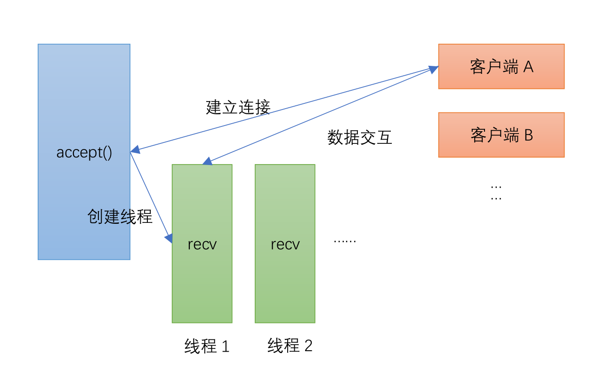
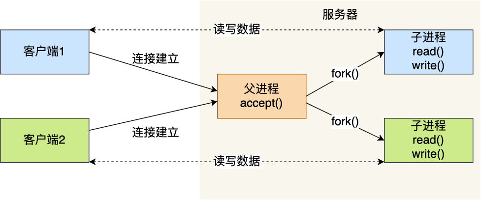
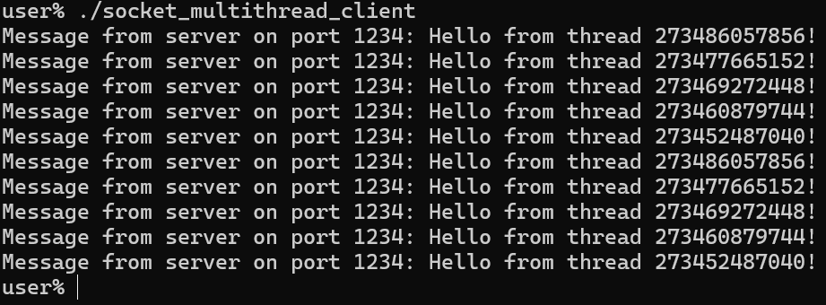
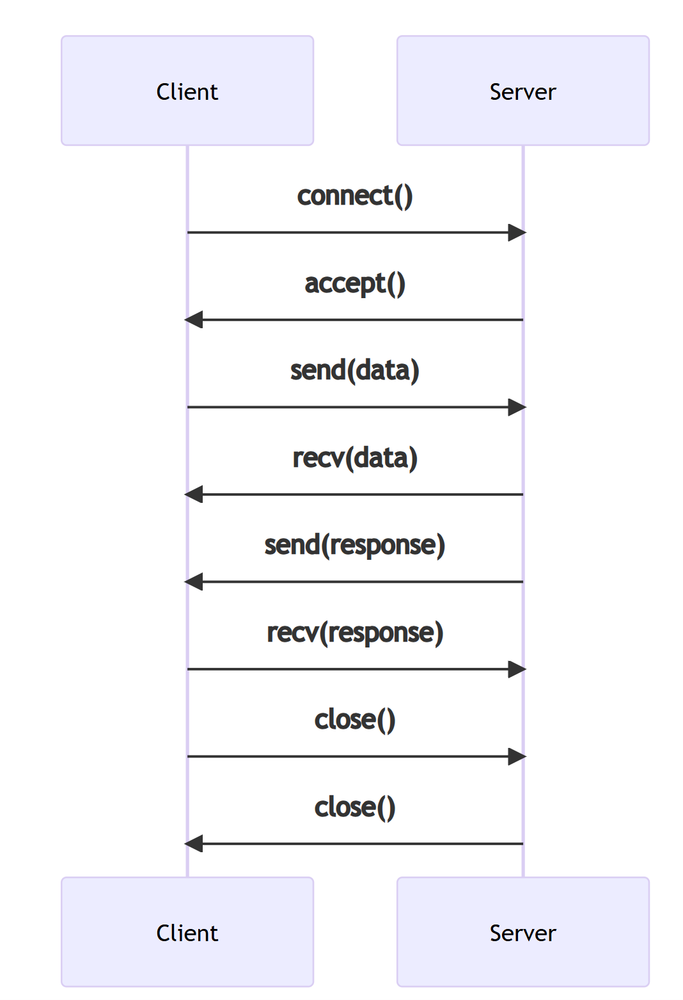
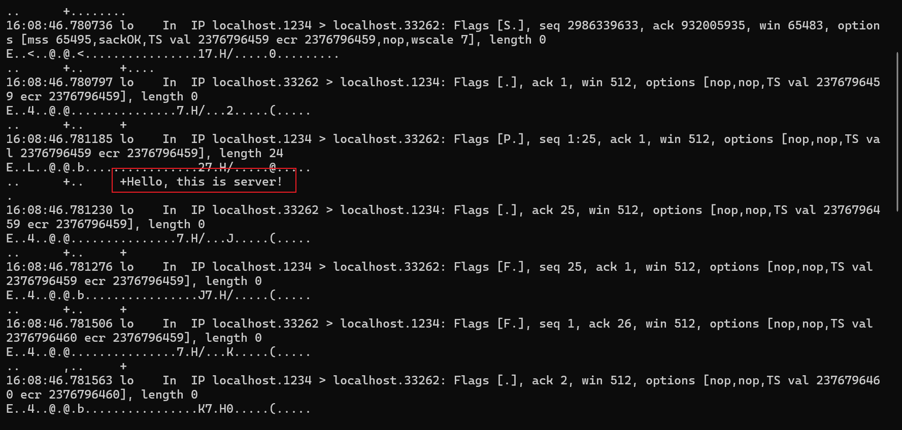

# **1. 多线程网络通信**

网络编程基础章节中的Socket通信综合案例讲述了Linux下如何通过Socket简单地实现网络通信。服务端调用`listen()`函数后，服务端套接字将处于监听状态，随时准备接收客户端发来的连接请求。此后，服务端调用`accept()`函数从处于established状态的连接队列头部取出一个已经完成的连接，如果这个队列没有已经完成的连接，`accept()`函数就会阻塞当前线程，直到取出队列中已完成的客户端连接为止。

同样，如果服务端已经进入`accept()`函数，此时其他客户端发起的请求也会被阻塞，无法得到回应。这时联想到前面章节讲过的多线程技术，服务端接受一个客户端的连接后，创建一个线程或者进程，然后在新创建的线程或进程中循环处理数据。主线程只负责监听客户端的连接，并使用`accept()`接受连接,不进行数据的处理，那么客户端就无需限制请求的频率了，这就相比阻塞等待的方案强大了许多！流程如图1.1.2所示：

<figure style="text-align: center;"> <!-- 设置居中 -->
   <!-- 调整大小 -->
  <figcaption style="margin-top: 10px; color: #555;">图1.1.1 多线程处理Socket请求</figcaption>
</figure>

客户端代码与之前基本没变，只需要将请求的间隔去掉即可；而服务端需要将处理客户端请求的逻辑放在`handle_client()`函数中，该函数传入被`accept()`的客户端的Socket。然后主线程利用创建线程将处理Socket即可，然后将执行客户端相应的子线程从主线程分离，不阻塞主线程，主线程可以继续运行，去`accept()`连接队列中下一个完成的连接。

服务端和客户端代码[打包下载](code/13_multithread_network/1-1-socket_multithread/)

**服务端代码：**
```c
#include <arpa/inet.h>
#include <netinet/in.h>
#include <pthread.h>
#include <stdio.h>
#include <stdlib.h>
#include <string.h>
#include <sys/socket.h>
#include <unistd.h>

// 处理客户端请求的线程函数
void* handle_client(void* client_socket) {
    int clnt_sock = *(int*)client_socket;  // 获取客户端套接字
    free(client_socket);                   // 释放动态分配的内存

    // 提取客户端的 IP 地址和端口
    struct sockaddr_in clnt_addr;
    socklen_t clnt_addr_size = sizeof(clnt_addr);
    getpeername(clnt_sock, (struct sockaddr*)&clnt_addr,
                &clnt_addr_size);  // 获取客户端地址信息

    char client_ip[INET_ADDRSTRLEN];
    inet_ntop(AF_INET, &clnt_addr.sin_addr, client_ip, sizeof(client_ip));
    int client_port = ntohs(clnt_addr.sin_port);

    // 打印客户端信息
    printf("Client connected: IP = %s, Port = %d\n", client_ip, client_port);

    // 获取线程ID
    pthread_t thread_id = pthread_self();

    // 向客户端发送数据
    char response[256];
    snprintf(response, sizeof(response), "Hello from thread %lu!\n", thread_id);
    write(clnt_sock, response, strlen(response));

    // 模拟服务器处理请求的时间
    sleep(1);

    // 关闭套接字
    close(clnt_sock);
    return NULL;
}

int main() {
    // 创建套接字
    int serv_sock = socket(AF_INET, SOCK_STREAM, IPPROTO_TCP);

    // 将套接字和IP、端口绑定
    struct sockaddr_in serv_addr;
    memset(&serv_addr, 0, sizeof(serv_addr));  // 每个字节都用0填充
    serv_addr.sin_family = AF_INET;            // 使用IPv4地址
    serv_addr.sin_addr.s_addr = inet_addr("127.0.0.1");  // 具体的IP地址
    serv_addr.sin_port = htons(1234);                    // 端口
    bind(serv_sock, (struct sockaddr*)&serv_addr, sizeof(serv_addr));

    // 进入监听状态，等待用户发起请求
    listen(serv_sock, 20);

    // 接收客户端请求
    while (1) {
        struct sockaddr_in clnt_addr;
        socklen_t clnt_addr_size = sizeof(clnt_addr);
        int* clnt_sock = malloc(sizeof(int));  // 动态分配内存来保存客户端套接字
        *clnt_sock =
            accept(serv_sock, (struct sockaddr*)&clnt_addr, &clnt_addr_size);

        // 创建一个线程处理客户端请求
        pthread_t thread_id;
        if (pthread_create(&thread_id, NULL, handle_client, clnt_sock) != 0) {
            perror("Failed to create thread");
            close(*clnt_sock);  // 若线程创建失败，关闭套接字
            free(clnt_sock);    // 释放内存
        }
        pthread_detach(thread_id);  // 使线程在结束后自动回收资源
    }
    close(serv_sock);
    return 0;
}
```
**客户端代码：**
```c
#include <arpa/inet.h>
#include <stdio.h>
#include <stdlib.h>
#include <string.h>
#include <sys/socket.h>
#include <time.h>
#include <unistd.h>

int main() {
    const char* server_ip = "127.0.0.1";  // 服务器的IP地址
    int port = 1234;                      // 服务器端口
    int num_attempts = 10;                // 连接次数

    for (int i = 0; i < num_attempts; i++) {
        // 创建套接字
        int sock = socket(AF_INET, SOCK_STREAM, 0);
        if (sock < 0) {
            perror("Socket creation failed");
            exit(EXIT_FAILURE);
        }

        // 向服务器发起请求
        struct sockaddr_in serv_addr;
        memset(&serv_addr, 0, sizeof(serv_addr));  // 每个字节都用0填充
        serv_addr.sin_family = AF_INET;            // 使用IPv4地址
        serv_addr.sin_addr.s_addr = inet_addr(server_ip);  // 具体的IP地址
        serv_addr.sin_port = htons(port);  // 设置端口为1234

        // 尝试连接到服务器
        if (connect(sock, (struct sockaddr*)&serv_addr, sizeof(serv_addr)) <
            0) {
            perror("Connection failed");
            close(sock);
            sleep(1);  // 连接失败后休眠1秒
            continue;  // 如果连接失败，继续尝试下一个连接
        }

        // 读取服务器传回的数据
        char buffer[40];
        ssize_t bytes_read = read(sock, buffer, sizeof(buffer) - 1);
        if (bytes_read < 0) {
            perror("Failed to read from server");
        } else {
            buffer[bytes_read] = '\0';  // 确保字符串以 null 结尾
            printf("Message from server on port %d: %s", port, buffer);
        }

        // 关闭套接字
        close(sock);
    }

    return 0;
}
```
在分别编译完成以上服务端和客户端代码后，先运行服务端进程，进入监听模式，然后再另一个终端运行客户端进程，可以看到图1.1.3和图1.1.4的结果：
<figure style="text-align: center;"> <!-- 设置居中 -->
   <!-- 调整大小 -->
  <figcaption style="margin-top: 10px; color: #555;">图1.1.2 多线程服务端输出</figcaption>
</figure>

<figure style="text-align: center;"> <!-- 设置居中 -->
   <!-- 调整大小 -->
  <figcaption style="margin-top: 10px; color: #555;">图1.1.3 客户端输出</figcaption>
</figure>
可以看到，客户端在没有限制的情况下连续向服务端发起了10次Socket请求，并都得到了来自不同线程的响应。


# **2 线程池网络编程**
上文的做法是为每一个客户端连接创建一个新的线程，这种方式在小规模并发时工作正常，相较于主线程阻塞处理一个Socket请求来说效率大大提升了，但随着连接数的增加，以下问题会逐渐显现：

- 性能开销：每次创建和销毁线程都会消耗系统资源，尤其是创建线程的时间开销会导致响应变慢。
- 上下文切换：大量线程并发运行会导致频繁的上下文切换，增加 CPU 的负担，降低系统性能。
- 资源消耗：每个线程都有自己的栈和其他资源，过多的线程会消耗大量的内存，导致系统不稳定。

<figure style="text-align: center;"> <!-- 设置居中 -->
   <!-- 调整大小 -->
  <figcaption style="margin-top: 10px; color: #555;">图2.1.1 线程池模型</figcaption>
</figure>

因此，这里可以引入线程池的概念。线程池通过预先创建一定数量的线程来处理多个请求，这样可以有效提高性能和稳定性。使用线程池的优点在于，它能够实现资源的复用，降低响应延迟，因为线程已经存在，可以快速处理客户端请求。线程池还能够控制并发线程的数量，防止服务器过载，从而提升系统的健壮性。此外，线程池的管理也相对简单，因为它集中管理线程的生命周期，包括创建、销毁和回收。

## **2.1 线程池的设计**
在设计和实现线程池时，首先需要设置一个请求队列以保存等待处理的客户端请求，工作线程从队列中获取请求并进行处理。预先创建一定数量的工作线程，空闲时等待请求到来是设计的关键。同时，使用信号量和互斥锁来管理对请求队列的访问，确保线程安全。为了增强系统的灵活性，可以考虑实现动态调整线程池大小的功能，根据系统负载情况增加或减少线程数量。

在实现过程中，使用结构体来定义请求信息，使得每个线程能够独立处理不同的请求。信号量可以控制线程的等待和唤醒，而互斥锁则保护请求队列的访问，确保在多线程环境下的安全性。此外，设计线程池的销毁功能，确保在服务器关闭时，所有工作线程能够正常退出并释放资源，也是至关重要的。合理的错误处理机制可以进一步增强系统的稳定性。

示例设计如下：
```c
// 线程池结构体
typedef struct {
    pthread_t threads[MAX_THREADS];       // 线程数组
    request_t request_queue[QUEUE_SIZE];  // 请求队列
    int queue_size;                       // 当前队列大小
    int queue_front;                      // 队列前端
    int queue_rear;                       // 队列后端
    sem_t queue_sem;                      // 信号量，用于控制队列
    pthread_mutex_t queue_lock;           // 互斥锁，用于保护队列
    int stop;                             // 停止标志
} thread_pool_t;
```

## **2.2 线程池的实现**

那么在使用线程池前，需要对线程池进行一个初始化，这样当有新的Socket请求进来后，主线程可以直接从线程池中拿取线程来进行处理，而不需要自己去重新创建线程并调度，可以节省上下文切换等开销。
可能的一种线程池初始化方式：
```c
// 初始化线程池
thread_pool_t* thread_pool_init() {
    thread_pool_t* pool = malloc(sizeof(thread_pool_t));
    pool->queue_size = 0;
    pool->queue_front = 0;
    pool->queue_rear = 0;
    pool->stop = 0;
    sem_init(&pool->queue_sem, 0, 0);
    pthread_mutex_init(&pool->queue_lock, NULL);

    // 创建线程，woker函数根据需求自己定义
    for (int i = 0; i < MAX_THREADS; i++) {
        pthread_create(&pool->threads[i], NULL, worker, pool);
    }
    return pool;
}
```

既然提供了线程池的创建，那么自然也要提供销毁线程池的接口，这样才能最大程度防止内存的泄露：
```c
void thread_pool_destroy(thread_pool_t* pool) {
    pthread_mutex_lock(&pool->queue_lock);
    pool->stop = 1;  // 设置停止标志
    pthread_mutex_unlock(&pool->queue_lock);

    // 发送信号给所有线程
    for (int i = 0; i < MAX_THREADS; i++) {
        sem_post(&pool->queue_sem);
    }

    // 等待所有线程结束
    for (int i = 0; i < MAX_THREADS; i++) {
        pthread_join(pool->threads[i], NULL);
    }

    // 清理资源
    sem_destroy(&pool->queue_sem);
    pthread_mutex_destroy(&pool->queue_lock);
    free(pool);
}
```

## **2.3 使用线程池来处理Socket请求**
在上面我们设计了一个可以即取即用的线程池，那么如何将Socket的请求交给线程池来处理而不是手动创建新线程呢？
是的，就是通过修改上面线程池初始化接口中的`woker`函数，只要将以前线程处理Socket的逻辑写入到`woker`函数中即可实现：
```c
// 处理Socket请求
void* worker(void* pool) {
    thread_pool_t* thread_pool = (thread_pool_t*)pool;

    while (1) {
        sem_wait(&thread_pool->queue_sem);  // 等待队列

        pthread_mutex_lock(&thread_pool->queue_lock);  // 获取锁
        if (thread_pool->stop) {
            pthread_mutex_unlock(&thread_pool->queue_lock);
            break;  // 如果停止标志被设置，退出循环
        }

        // 从队列获取请求
        request_t req = thread_pool->request_queue[thread_pool->queue_front];
        thread_pool->queue_front = (thread_pool->queue_front + 1) % QUEUE_SIZE;
        thread_pool->queue_size--;
        pthread_mutex_unlock(&thread_pool->queue_lock);  // 释放锁

        // 处理请求
        char client_ip[INET_ADDRSTRLEN];
        inet_ntop(AF_INET, &req.address.sin_addr, client_ip, sizeof(client_ip));
        int client_port = ntohs(req.address.sin_port);
        printf("Client connected: IP = %s, Port = %d\n", client_ip,
               client_port);

        // 向客户端发送数据，包含线程 ID
        char response[256];
        pthread_t thread_id = pthread_self();
        snprintf(response, sizeof(response), "Hello from thread %lu!\n",
                 thread_id);
        write(req.socket, response, strlen(response));

        // 关闭套接字
        close(req.socket);
    }
    return NULL;
}
```

到这里我们就可以利用线程池来处理Socket的并发请求了：

完整[打包下载](code/13_multithread_network/1-1-socket_multithread/)

**完整代码：**
```c
#include <arpa/inet.h>
#include <netinet/in.h>
#include <pthread.h>
#include <semaphore.h>
#include <stdio.h>
#include <stdlib.h>
#include <string.h>
#include <sys/socket.h>
#include <unistd.h>

#define MAX_THREADS 5  // 最大线程数
#define QUEUE_SIZE 20  // 请求队列大小

// 请求结构体
typedef struct {
    int socket;
    struct sockaddr_in address;
} request_t;

// 线程池结构体
typedef struct {
    pthread_t threads[MAX_THREADS];       // 线程数组
    request_t request_queue[QUEUE_SIZE];  // 请求队列
    int queue_size;                       // 当前队列大小
    int queue_front;                      // 队列前端
    int queue_rear;                       // 队列后端
    sem_t queue_sem;                      // 信号量，用于控制队列
    pthread_mutex_t queue_lock;           // 互斥锁，用于保护队列
    int stop;                             // 停止标志
} thread_pool_t;

// 线程池工作函数
void* worker(void* pool) {
    thread_pool_t* thread_pool = (thread_pool_t*)pool;

    while (1) {
        sem_wait(&thread_pool->queue_sem);  // 等待队列

        pthread_mutex_lock(&thread_pool->queue_lock);  // 获取锁
        if (thread_pool->stop) {
            pthread_mutex_unlock(&thread_pool->queue_lock);
            break;  // 如果停止标志被设置，退出循环
        }

        // 从队列获取请求
        request_t req = thread_pool->request_queue[thread_pool->queue_front];
        thread_pool->queue_front = (thread_pool->queue_front + 1) % QUEUE_SIZE;
        thread_pool->queue_size--;
        pthread_mutex_unlock(&thread_pool->queue_lock);  // 释放锁

        // 处理请求
        char client_ip[INET_ADDRSTRLEN];
        inet_ntop(AF_INET, &req.address.sin_addr, client_ip, sizeof(client_ip));
        int client_port = ntohs(req.address.sin_port);
        printf("Client connected: IP = %s, Port = %d\n", client_ip,
               client_port);

        // 向客户端发送数据，包含线程 ID
        char response[256];
        pthread_t thread_id = pthread_self();
        snprintf(response, sizeof(response), "Hello from thread %lu!\n",
                 thread_id);
        write(req.socket, response, strlen(response));

        // 关闭套接字
        close(req.socket);
    }
    return NULL;
}

// 初始化线程池
thread_pool_t* thread_pool_init() {
    thread_pool_t* pool = malloc(sizeof(thread_pool_t));
    pool->queue_size = 0;
    pool->queue_front = 0;
    pool->queue_rear = 0;
    pool->stop = 0;
    sem_init(&pool->queue_sem, 0, 0);
    pthread_mutex_init(&pool->queue_lock, NULL);

    // 创建线程
    for (int i = 0; i < MAX_THREADS; i++) {
        pthread_create(&pool->threads[i], NULL, worker, pool);
    }
    return pool;
}

// 向线程池添加请求
void thread_pool_add_request(thread_pool_t* pool, request_t req) {
    pthread_mutex_lock(&pool->queue_lock);  // 获取锁

    // 添加请求到队列
    pool->request_queue[pool->queue_rear] = req;
    pool->queue_rear = (pool->queue_rear + 1) % QUEUE_SIZE;
    pool->queue_size++;

    pthread_mutex_unlock(&pool->queue_lock);  // 释放锁
    sem_post(&pool->queue_sem);               // 发送信号
}

// 停止线程池
void thread_pool_destroy(thread_pool_t* pool) {
    pthread_mutex_lock(&pool->queue_lock);
    pool->stop = 1;  // 设置停止标志
    pthread_mutex_unlock(&pool->queue_lock);

    // 发送信号给所有线程
    for (int i = 0; i < MAX_THREADS; i++) {
        sem_post(&pool->queue_sem);
    }

    // 等待所有线程结束
    for (int i = 0; i < MAX_THREADS; i++) {
        pthread_join(pool->threads[i], NULL);
    }

    // 清理资源
    sem_destroy(&pool->queue_sem);
    pthread_mutex_destroy(&pool->queue_lock);
    free(pool);
}

int main() {
    // 创建套接字
    int serv_sock = socket(AF_INET, SOCK_STREAM, IPPROTO_TCP);

    // 将套接字和IP、端口绑定
    struct sockaddr_in serv_addr;
    memset(&serv_addr, 0, sizeof(serv_addr));  // 每个字节都用0填充
    serv_addr.sin_family = AF_INET;            // 使用IPv4地址
    serv_addr.sin_addr.s_addr = inet_addr("127.0.0.1");  // 具体的IP地址
    serv_addr.sin_port = htons(1234);                    // 端口
    bind(serv_sock, (struct sockaddr*)&serv_addr, sizeof(serv_addr));

    // 进入监听状态，等待用户发起请求
    listen(serv_sock, 20);

    // 初始化线程池
    thread_pool_t* pool = thread_pool_init();

    // 接收客户端请求
    while (1) {
        struct sockaddr_in clnt_addr;
        socklen_t clnt_addr_size = sizeof(clnt_addr);
        int clnt_sock =
            accept(serv_sock, (struct sockaddr*)&clnt_addr, &clnt_addr_size);

        // 添加请求到线程池
        request_t req;
        req.socket = clnt_sock;
        req.address = clnt_addr;
        thread_pool_add_request(pool, req);
    }

    // 关闭服务器套接字
    close(serv_sock);
    // 销毁线程池
    thread_pool_destroy(pool);
    return 0;
}
```

客户端的请求代码无需修改，可以直接使用以前的没有请求限制的版本，这里只需要编译线程池版本的服务端代码，运行、进入监听模式，启动客户端进程，可以看到图2.3.1和图2.3.2的结果：
<figure style="text-align: center;"> <!-- 设置居中 -->
   <!-- 调整大小 -->
  <figcaption style="margin-top: 10px; color: #555;">图2.3.1 线程池服务端输出</figcaption>
</figure>

<figure style="text-align: center;"> <!-- 设置居中 -->
   <!-- 调整大小 -->
  <figcaption style="margin-top: 10px; color: #555;">图2.3.2 客户端输出</figcaption>
</figure>
仔细观察图2.3.2和图1.1.2的区别，图1.1.2是对每个请求都创建新线程来处理，可以看到每个线程id都不同，而图2.3.2线程池中只有5个线程，当10个Socket请求到达时，只会由5个线程来先响应5个请求，处理完后，线程池会复用这5个线程来响应剩下的请求，所以可以看到线程id只有5个重复的。

# **3. 网络数据的加密与解密**
在进行网络编程的时候，我们通常使用Socket进行数据的传输，就像我们上面一直做的哪有。然而Socket作为一个数据传输协议，其本身对数据并不会作加密。所以数据传输的过程可以很轻松地被监听并截获到传输的数据。openssl提供了SSL的加密库，通过ssl+socket的方式可以保证连接安全和数据的加密。

## **3.1 网络通信加解密原理**

首先回顾一下，上面无论是否使用多线程技术来进行服务端和客户端通信，其通信过程都是如图3.1.1所示：
<figure style="text-align: center;"> <!-- 设置居中 -->
   <!-- 调整大小 -->
  <figcaption style="margin-top: 10px; color: #555;">图3.1.1 Socket通信过程</figcaption>
</figure>
图2.5展示了一个Socket连接的时候会涉及到的握手过程。服务端会通过`accept`去接收客户端的请求。客户端通过`connect`去连接到客户端。使用`send/write`和`recv/read`去做数据的传输。那么传输过程中的参数data也就是我们交互的数据了。当我们建立连接开始发送数据的时候。使用一些抓包工具wireshark,或者tcpdump去监听Socket端口就能很轻松地获取到传输的明文数据了。

SSL协议在应用层和TCP/IP层之间运行，这允许它对数据流自身进行加密，然后可以使用任何应用层协议安全地传输数据流。所以为了避免数据的监听，我们就需要使用SSL去建立一个安全的通道，在数据发送和接收之前和后进行SSL的连接建立，通过加密的SSL通道进行数据传输可以保证即便数据被监听了攻击者也得不到数据的真实含义。
经过加密措施后的数据传输过程如图3.1.2所示：
<figure style="text-align: center;"> <!-- 设置居中 -->
   <!-- 调整大小 -->
  <figcaption style="margin-top: 10px; color: #555;">图3.1.2 SSL加密后Socket通信过程</figcaption>
</figure>

## **3.2 OpenSSL加解密Socket通信实现**

在使用SSL加解密前，需要配置相关环境：
```bash
sudo apt update
sudo apt install openssl libssl-dev -y
```

然后第一步，生成私钥和自签名证书，可以自己生成，也可以使用下面的模板进行生成：
```bash
openssl req -x509 -newkey rsa:2048 -keyout server.key -out server.crt -days 365 -nodes -subj "/C=CN/ST=Beijing/L=Beijing/O=MyCompany/OU=MyUnit/CN=127.0.0.1/emailAddress=myemail@example.com"
```

其次调用openssl对服务端和客户端数据发送均进行加解密：

服务端和客户端代码[打包下载](code/13_multithread_network/3-1-socket_ssl/)

**服务端代码：**
```c
#include <arpa/inet.h>
#include <netinet/in.h>
#include <openssl/err.h>
#include <openssl/ssl.h>
#include <stdio.h>
#include <stdlib.h>
#include <string.h>
#include <sys/socket.h>
#include <unistd.h>

void init_openssl() {
    SSL_load_error_strings();
    OpenSSL_add_ssl_algorithms();
}

void cleanup_openssl() {
    EVP_cleanup();
}

SSL_CTX* create_context() {
    const SSL_METHOD* method;
    SSL_CTX* ctx;

    method = SSLv23_server_method();  // 选择 SSL 方法
    ctx = SSL_CTX_new(method);
    if (!ctx) {
        perror("Unable to create SSL context");
        ERR_print_errors_fp(stderr);
        exit(EXIT_FAILURE);
    }
    return ctx;
}

void configure_context(SSL_CTX* ctx) {
    // 加载证书和私钥
    if (SSL_CTX_use_certificate_file(ctx, "server.crt", SSL_FILETYPE_PEM) <=
        0) {
        ERR_print_errors_fp(stderr);
        exit(EXIT_FAILURE);
    }
    if (SSL_CTX_use_PrivateKey_file(ctx, "server.key", SSL_FILETYPE_PEM) <= 0) {
        ERR_print_errors_fp(stderr);
        exit(EXIT_FAILURE);
    }
}

int main() {
    init_openssl();                   // 初始化 OpenSSL
    SSL_CTX* ctx = create_context();  // 创建 SSL 上下文
    configure_context(ctx);           // 配置 SSL 上下文

    // 创建套接字
    int serv_sock = socket(AF_INET, SOCK_STREAM, IPPROTO_TCP);

    // 将套接字和IP、端口绑定
    struct sockaddr_in serv_addr;
    memset(&serv_addr, 0, sizeof(serv_addr));  // 每个字节都用0填充
    serv_addr.sin_family = AF_INET;            // 使用IPv4地址
    serv_addr.sin_addr.s_addr = inet_addr("127.0.0.1");  // 具体的IP地址
    serv_addr.sin_port = htons(1234);                    // 端口
    bind(serv_sock, (struct sockaddr*)&serv_addr, sizeof(serv_addr));

    // 进入监听状态，等待用户发起请求
    listen(serv_sock, 20);

    // 接收客户端请求
    struct sockaddr_in clnt_addr;
    socklen_t clnt_addr_size = sizeof(clnt_addr);
    while (1) {
        int clnt_sock =
            accept(serv_sock, (struct sockaddr*)&clnt_addr, &clnt_addr_size);

        // 提取客户端的 IP 地址和端口
        char client_ip[INET_ADDRSTRLEN];
        inet_ntop(AF_INET, &clnt_addr.sin_addr, client_ip, sizeof(client_ip));
        int client_port = ntohs(clnt_addr.sin_port);

        // 打印客户端信息
        printf("Client connected: IP = %s, Port = %d\n", client_ip,
               client_port);

        // 创建 SSL 连接
        SSL* ssl = SSL_new(ctx);
        SSL_set_fd(ssl, clnt_sock);
        if (SSL_accept(ssl) <= 0) {
            ERR_print_errors_fp(stderr);
        } else {
            // 向客户端发送数据
            char str[] = "Hello, this is server!\n";
            SSL_write(ssl, str, sizeof(str));
        }

        // 关闭 SSL 连接
        SSL_shutdown(ssl);
        SSL_free(ssl);
        close(clnt_sock);
    }
    close(serv_sock);
    SSL_CTX_free(ctx);  // 释放 SSL 上下文
    cleanup_openssl();  // 清理 OpenSSL
    return 0;
}
```

**客户端代码：**
```c
#include <arpa/inet.h>
#include <openssl/err.h>
#include <openssl/ssl.h>
#include <stdio.h>
#include <stdlib.h>
#include <string.h>
#include <sys/socket.h>
#include <time.h>
#include <unistd.h>

void init_openssl() {
    SSL_load_error_strings();
    OpenSSL_add_ssl_algorithms();
}

void cleanup_openssl() {
    EVP_cleanup();
}

SSL_CTX* create_context() {
    const SSL_METHOD* method;
    SSL_CTX* ctx;

    method = SSLv23_client_method();  // 选择 SSL 方法
    ctx = SSL_CTX_new(method);
    if (!ctx) {
        perror("Unable to create SSL context");
        ERR_print_errors_fp(stderr);
        exit(EXIT_FAILURE);
    }
    return ctx;
}

int main() {
    init_openssl();                   // 初始化 OpenSSL
    SSL_CTX* ctx = create_context();  // 创建 SSL 上下文

    const char* server_ip = "127.0.0.1";  // 服务器的IP地址
    int port = 1234;                      // 服务器端口
    int num_attempts = 5;                 // 连接次数

    for (int i = 0; i < num_attempts; i++) {
        // 创建套接字
        int sock = socket(AF_INET, SOCK_STREAM, 0);
        if (sock < 0) {
            perror("Socket creation failed");
            exit(EXIT_FAILURE);
        }

        // 向服务器发起请求
        struct sockaddr_in serv_addr;
        memset(&serv_addr, 0, sizeof(serv_addr));  // 每个字节都用0填充
        serv_addr.sin_family = AF_INET;            // 使用IPv4地址
        serv_addr.sin_addr.s_addr = inet_addr(server_ip);  // 具体的IP地址
        serv_addr.sin_port = htons(port);  // 设置端口为1234

        // 尝试连接到服务器
        if (connect(sock, (struct sockaddr*)&serv_addr, sizeof(serv_addr)) <
            0) {
            perror("Connection failed");
            close(sock);
            sleep(1);  // 连接失败后休眠1秒
            continue;  // 如果连接失败，继续尝试下一个连接
        }

        // 创建 SSL 连接
        SSL* ssl = SSL_new(ctx);
        SSL_set_fd(ssl, sock);
        if (SSL_connect(ssl) <= 0) {  // 执行 SSL 握手
            ERR_print_errors_fp(stderr);
        } else {
            // 读取服务器传回的数据
            char buffer[40];
            ssize_t bytes_read =
                SSL_read(ssl, buffer, sizeof(buffer) - 1);  // 使用 SSL_read
            if (bytes_read < 0) {
                perror("Failed to read from server");
            } else {
                buffer[bytes_read] = '\0';  // 确保字符串以 null 结尾
                printf("Message from server on port %d: %s\n", port, buffer);
            }
        }

        // 关闭 SSL 连接
        SSL_shutdown(ssl);
        SSL_free(ssl);
        close(sock);

        // 暂停 1 秒钟
        sleep(1);
    }

    SSL_CTX_free(ctx);  // 释放 SSL 上下文
    cleanup_openssl();  // 清理 OpenSSL
    return 0;
}
```
**编译、链接**：因为这里使用到了openssl作为加密工具，因此需要将可执行文件链接到openssl的库中，具体方法为在编译过程加入参数：
```bash
gcc socket_ssl_server.c -o socket_ssl_server -lssl -lcrypto
gcc socket_ssl_client.c -o socket_ssl_client -lssl -lcrypto
```
运行结果如图3.2.1和3.2.2所示：

<figure style="text-align: center;"> <!-- 设置居中 -->
   <!-- 调整大小 -->
  <figcaption style="margin-top: 10px; color: #555;">图3.2.1 服务端输出</figcaption>
</figure>

<figure style="text-align: center;"> <!-- 设置居中 -->
   <!-- 调整大小 -->
  <figcaption style="margin-top: 10px; color: #555;">图3.2.2 客户端输出</figcaption>
</figure>
可以看到服务端正确接收到了来自客户端的加密请求，而客户端也接收到了服务端的返回，并成功解密输出。

但是如何确定这个是加解密后的结果呢还是这就是明文传输的，因此，这里使用tcpdump工具对`1234`端口进行监听，来看看openssl加密的传输内容和未加密的传输内容，结果见图3.2.3和图3.2.4
```bash
tcpdump -i any port 1234 -A
```

<figure style="text-align: center;"> <!-- 设置居中 -->
   <!-- 调整大小 -->
  <figcaption style="margin-top: 10px; color: #555;">图3.2.3 加密后数据传输</figcaption>
</figure>

<figure style="text-align: center;"> <!-- 设置居中 -->
   <!-- 调整大小 -->
  <figcaption style="margin-top: 10px; color: #555;">图3.2.4 明文数据传输</figcaption>
</figure>
可以看到图3.2.3中的传输内容是加密处理过的，而图3.2.4中可以明确看到不经SSL加密的信息是可以被监听窃取的。