sidebar_position: 1

# Python 环境搭建

## 1. 什么是 Python？

编程语言是一种让计算机理解人类指令的工具。就像人类用语言交流一样，程序员使用编程语言来告诉计算机该做什么。

Python 是一种编程语言，相比其他编程语言，Python 的语法更加接近人类的自然语言，使其更容易上手。

---

## 2. 安装 Python

解释型语言是编程语言的一种类型，解释型语言写出的代码需要通过一个名为解释器的程序来翻译为机器指令并执行。

Python 是一种解释型语言，运行 Python 代码需要 Python 解释器。我们的系统中默认安装了 Python 解释器。

以下是验证系统是否已安装 Python 解释器的步骤。

### 步骤 1：打开终端

点击终端图标打开终端，如下图。


如果终端出现了如下图的打印，输入数字 **2** 即可。
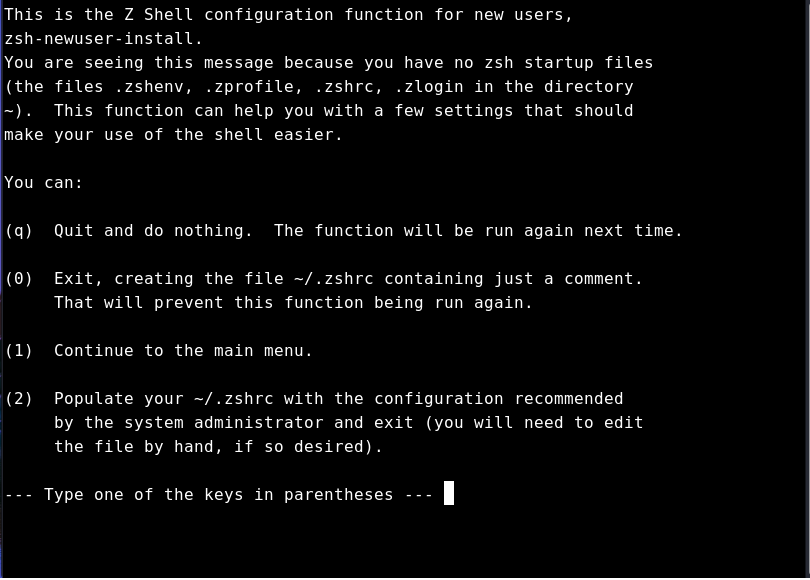

### 步骤 2：检查 Python 版本

在终端输入以下命令并按回车键（Enter）执行：

```bash
python --version
```

如果终端输出 Python 版本号（如 `Python 3.12.3`），说明系统已安装 Python 解释器，如图 2.3。
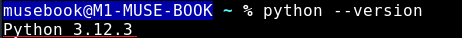

---

## 3. 编写示例程序

确认 Python 已安装后，可以运行 Python 程序。下面示范如何创建并运行一个简单的猜数字游戏。

### 步骤 1：创建 Python 文件

如图 3.1，在终端输入以下命令创建 `random_game.py` 文件并使用默认编辑器 Mousepad（如下图）打开：

```bash
# 创建 random_game.py 文件
touch random_game.py 
# 用默认编辑器打开文件 random_game.py
mousepad random_game.py
```

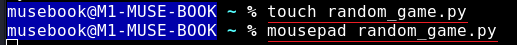

### 步骤 2：编写代码

将以下代码复制到 `random_game.py` 文件中， 如下图。

```python
import random

def main():
    # 生成一个1 到 100 之间的随机数
    random_number = random.randint(1, 100)
    guess = None

    print("欢迎来到随机数猜测游戏！")
    print("我已经选择了一个 1 到 100 之间的数字。你能猜到它是什么吗？")

    # 主游戏直到猜到随机数
    while guess != random_number:
        guess = input("请输入你的猜测：")

        # 检测输入是个数字
        if not guess.isdigit():
            print("请只输入数字！")
            continue

        guess = int(guess)
        if guess < random_number:
            print("太低了！再试一次。")
        elif guess > random_number:
            print("太高了！再试一次。")
        else:
            print("恭喜你，猜对了！")

if __name__ == "__main__":
    main()
```

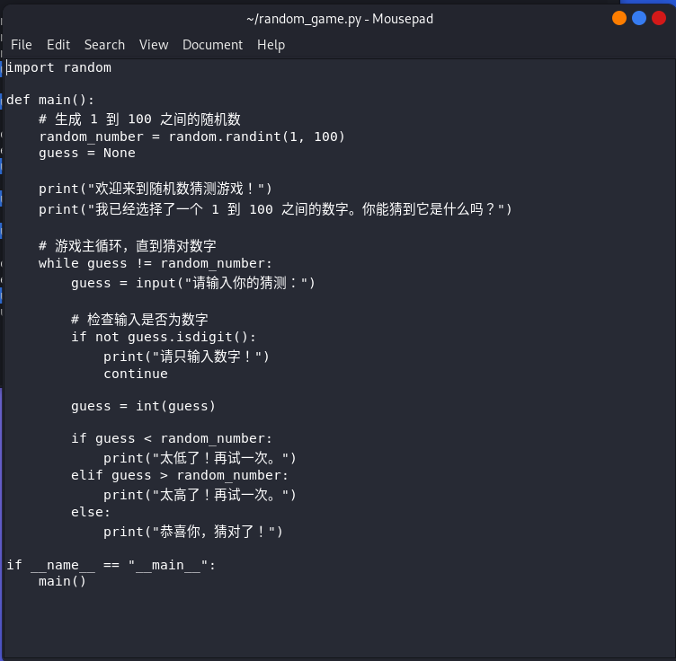

### 步骤 3：保存并退出

保存文件（操作如下图）
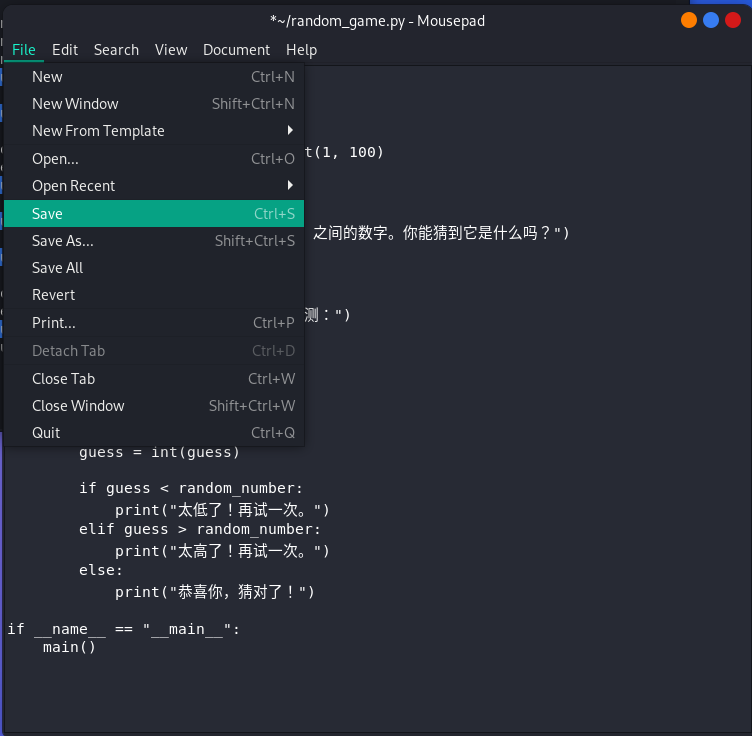

并关闭编辑器（操作下图）
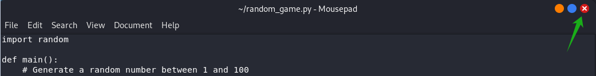

### 步骤 4：运行 Python 程序

在终端输入以下命令运行 Python 代码，开始游戏（操作如下图）：

```bash
python random_game.py
```

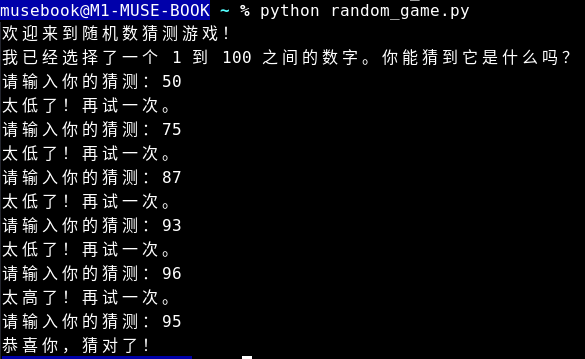

> **注**：如果要运行的 Python 程序依赖系统中未安装的库，请参考 **第4节**。
---

## 4. Python 虚拟环境搭建及依赖库安装（可选）

可以把虚拟环境想象成一个隔离的“容器”，它允许你在其中创建和管理 Python 项目所需的不同依赖和库，而不会让这些依赖和库与其他项目发生冲突。

Python 虚拟环境可以创建一个独立的 Python 环境，以防止不同项目的库发生冲突， 步骤如下：

### 步骤 1：安装 Python 虚拟环境工具

如下图，在终端执行以下命令安装 `python3-venv` 软件包。

```bash
sudo apt install -y python3-venv
```


安装成功后，执行以下命令验证：

```bash
python -m venv -h
```

如果终端输出 `venv` 相关的帮助信息（如下图），说明 Python 虚拟环境安装成功。
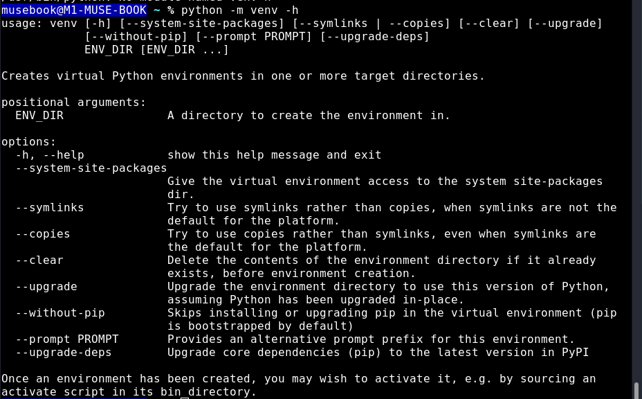

### 步骤 2：创建虚拟环境

如图 4.3，在终端输入以下命令创建 `python_venv` 目录并生成 Python 虚拟环境：

```bash
python -m venv python_venv
```

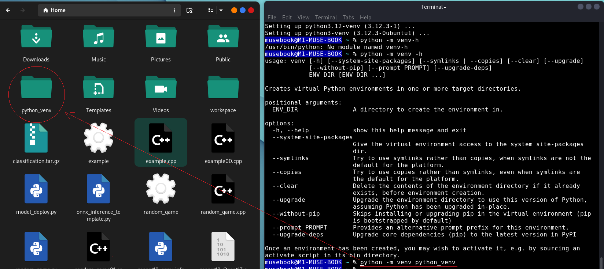

### 步骤 3：激活虚拟环境

如下图，在终端输入以下命令激活虚拟环境：

```bash
source python_venv/bin/activate
```


可以执行以下命令检查是否处于虚拟环境：

```bash
python -m site
```

如下图，如果终端输出 `python_venv` 目录路径，则说明当前处于虚拟环境。

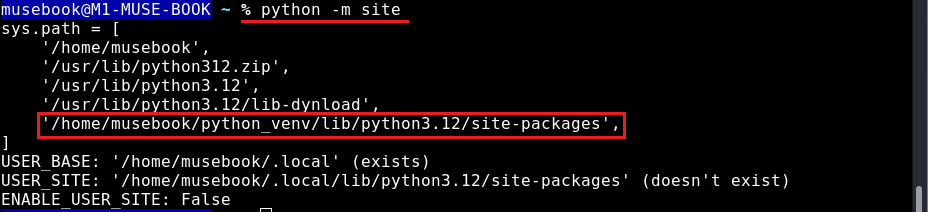

### 步骤 4：安装依赖库

虚拟环境与系统环境隔离，初始化完成后是没有安装任何模块的，如果运行 Python 程序（示例，运行以下程序）时报错 `ModuleNotFoundError` （如下图），说明缺少依赖库，例如 `numpy`。

```bash
python -c "import numpy"
```

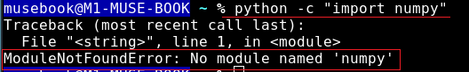

#### 安装 numpy 库

在虚拟环境中，可以使用 pip 命令安装 numpy 库。由于 pip 默认使用的源在外网，可能因网络不稳定而导致下载失败。因此，我们使用 `-i` 选项指定 pip 使用进迭时空提供的 pypi 源（如下图）

```bash
pip install numpy -i https://git.spacemit.com/api/v4/projects/33/packages/pypi/simple
```

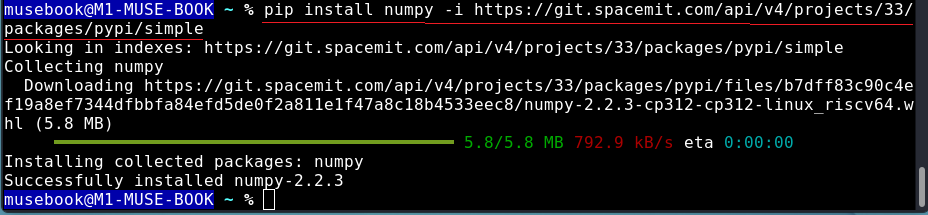

安装完成后，可以尝试导入库验证是否安装成功：

```bash
python -c "import numpy"
```

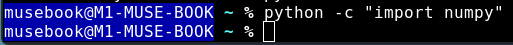

如果没有报错（如上图），说明 `numpy` 安装成功。

### 步骤 5：退出虚拟环境

在虚拟环境中安装的 Python 库仅能在该环境中使用。使用以下命令退出虚拟环境(如下图)：

```bash
deactivate
```


