sidebar_position: 3

# 集成开发环境（IDE）

​集成开发环境（Integrated Development Environment，简称 IDE）是一种软件应用程序，旨在为开发者提供全面的开发工具集，以便于软件开发过程中的编写、调试和维护。我们的系统中默认安装了 VSCodium 和 Zed 两款 IDE，本文主要介绍如何使用 VSCodium 来运行 python 和 C++ 代码，但也会在最后附上 Zed 的使用简介。

## 2. 准备工作

### 2.1 打开 VSCodium

​我们的系统中已经将 VSCodium 应用图标置于桌面底部的 dock 栏中，点击图标即可打开 VSCodium，如图 2.1.1 。初次打开 VSCodium 应用，VSCodium 会提示用户选择颜色主题，这里我们不做操作，采用默认的即可，如图 2.1.2 所示。

<center>
    
    <br>
    <div style="color:orange; border-bottom: 1px solid #d9d9d9;
    display: inline-block;
    color: #999;
    padding: 2px;"> 图 2.1.1 </div>
</center>

<center>
    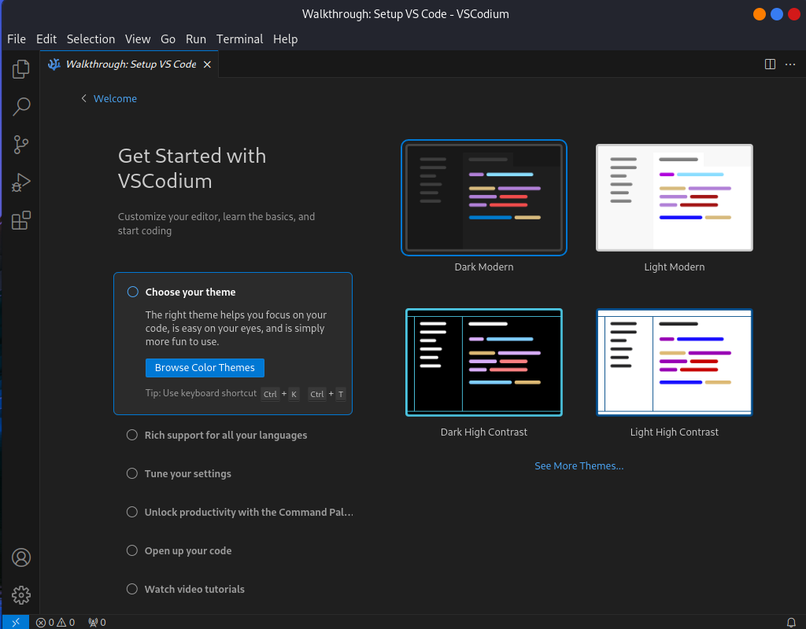
    <br>
    <div style="color:orange; border-bottom: 1px solid #d9d9d9;
    display: inline-block;
    color: #999;
    padding: 2px;"> 图 2.1.2 </div>
</center>

### 2.2 准备工作目录

​在 VSCodium 中也可以使用终端，在选项卡中选择 Terminal->New Ternimal 即可打开终端，如图 2.2.1 所示。

<center>
    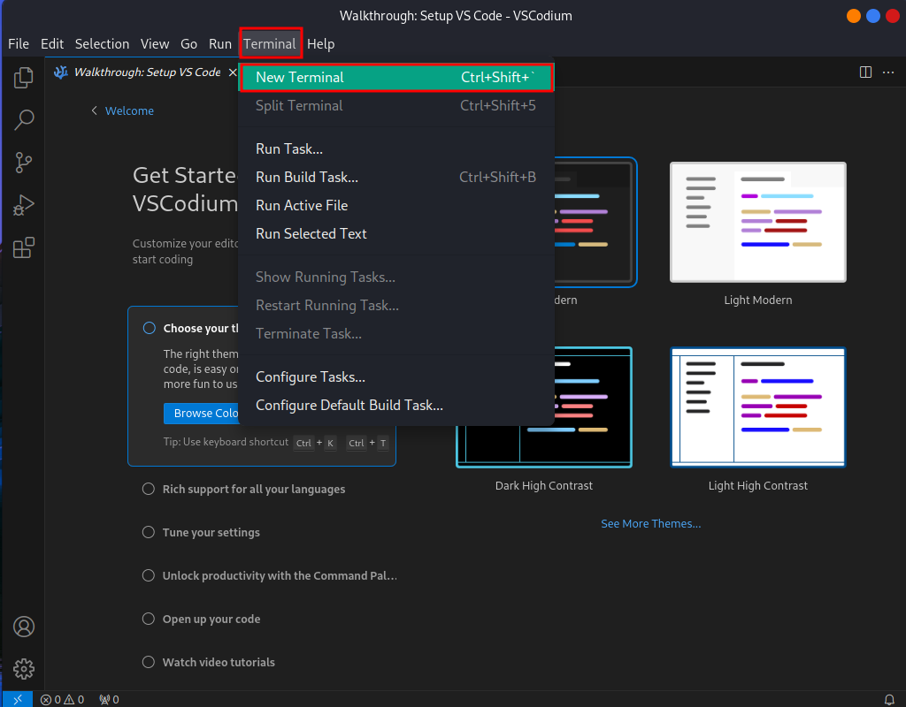
    <br>
    <div style="color:orange; border-bottom: 1px solid #d9d9d9;
    display: inline-block;
    color: #999;
    padding: 2px;"> 图 2.2.1 </div>
</center>

​打开终端后，在终端中使用以下命令创建 workspace 目录，如图 2.2.2 所示。

```Bash
mkdir workspace
```

<center>
    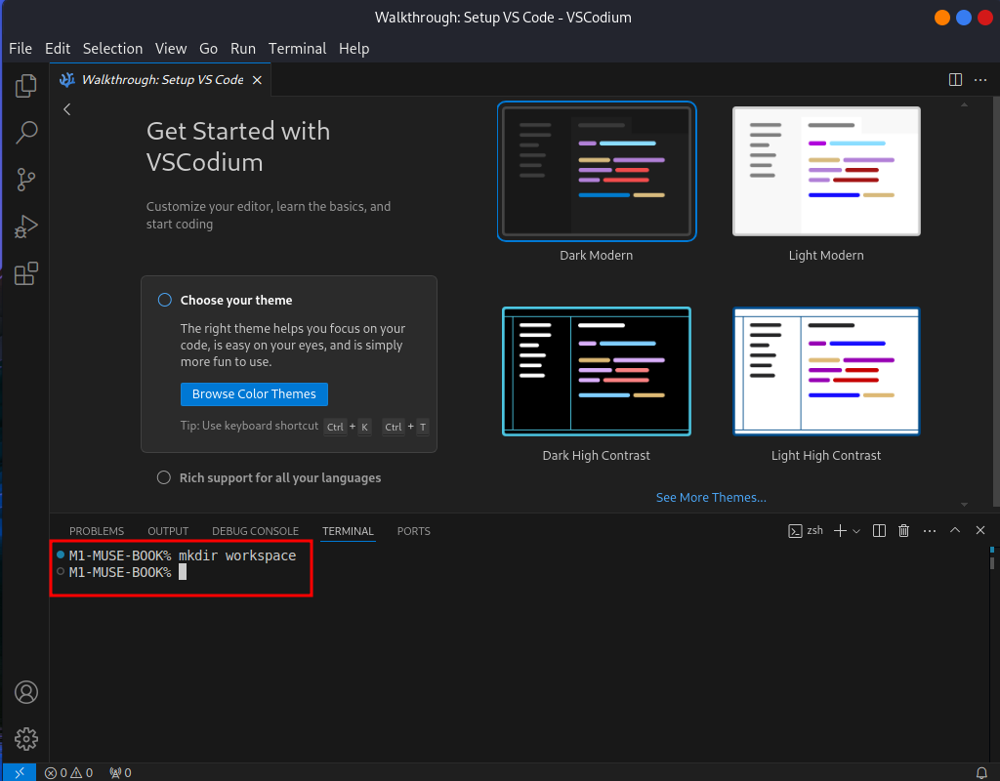
    <br>
    <div style="color:orange; border-bottom: 1px solid #d9d9d9;
    display: inline-block;
    color: #999;
    padding: 2px;"> 图 2.2.2 </div>
</center>

​创建好工作目录之后，我们需要用 VSCodium 打开工作目录，点击左侧打开文件的图标，接着选择 Open Folder 如图 2.2.3 所示。此时会弹出目录选择窗口，选择刚刚创建的 workspace 目录然后 Open，如图 2.2.4。

<center>
    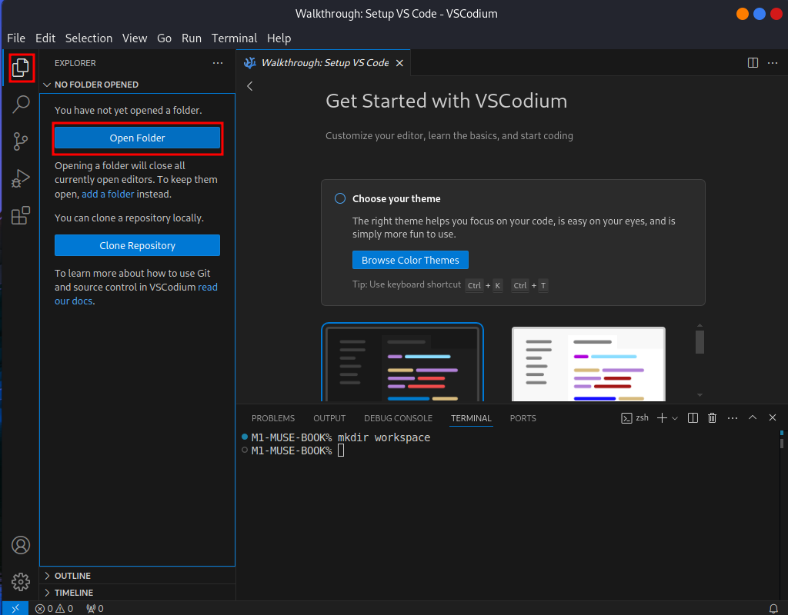
    <br>
    <div style="color:orange; border-bottom: 1px solid #d9d9d9;
    display: inline-block;
    color: #999;
    padding: 2px;"> 图 2.2.3 </div>
</center>

<center>
    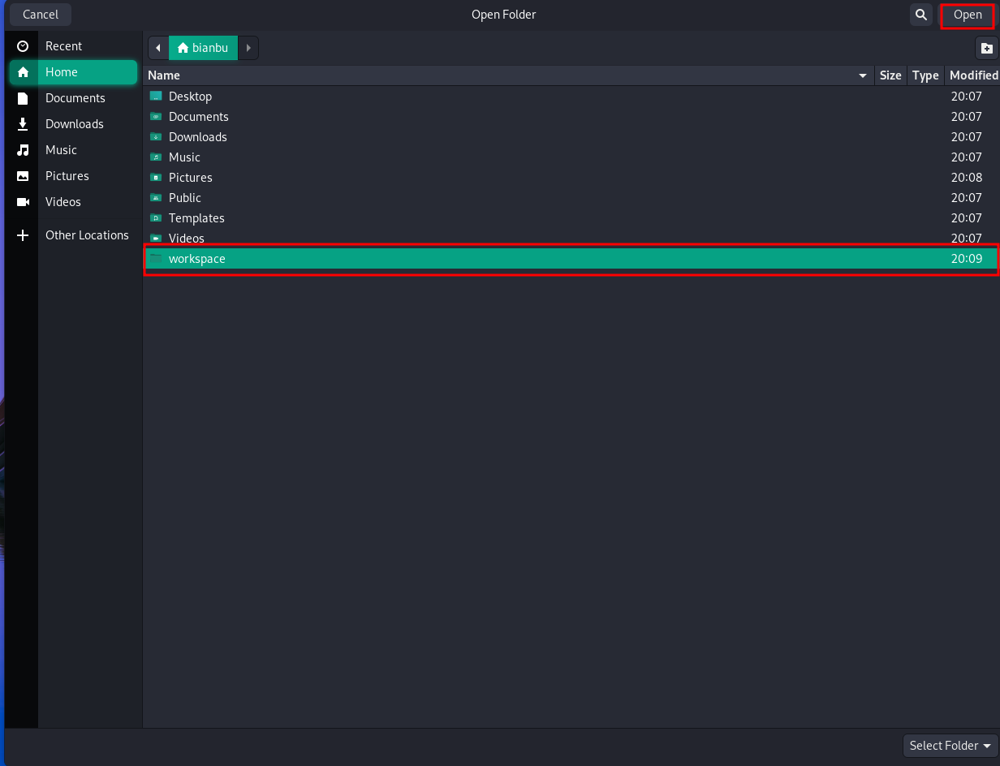
    <br>
    <div style="color:orange; border-bottom: 1px solid #d9d9d9;
    display: inline-block;
    color: #999;
    padding: 2px;"> 图 2.2.4 </div>
</center>

​在计算机用户首次使用 VSCodium 打开工作目录时，会出现如图 2.2.5 的警告，此时可以勾选 "Trust the authors of all files in the parent folder 'bianbu' "，并选择 "Yes， I trust the authors"，后续便不会再出现此类警告。

<center>
    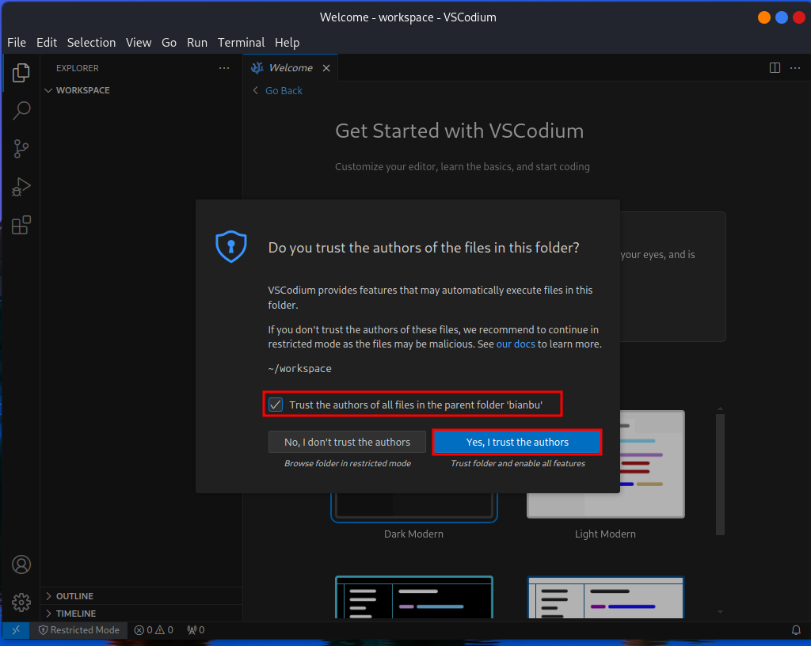
    <br>
    <div style="color:orange; border-bottom: 1px solid #d9d9d9;
    display: inline-block;
    color: #999;
    padding: 2px;"> 图 2.2.5 </div>
</center>

​成功打开 workspace 目录后，可以在 VSCodium 中看到 workspace 目录，且目录为空，如图 2.2.6 所示。

<center>
    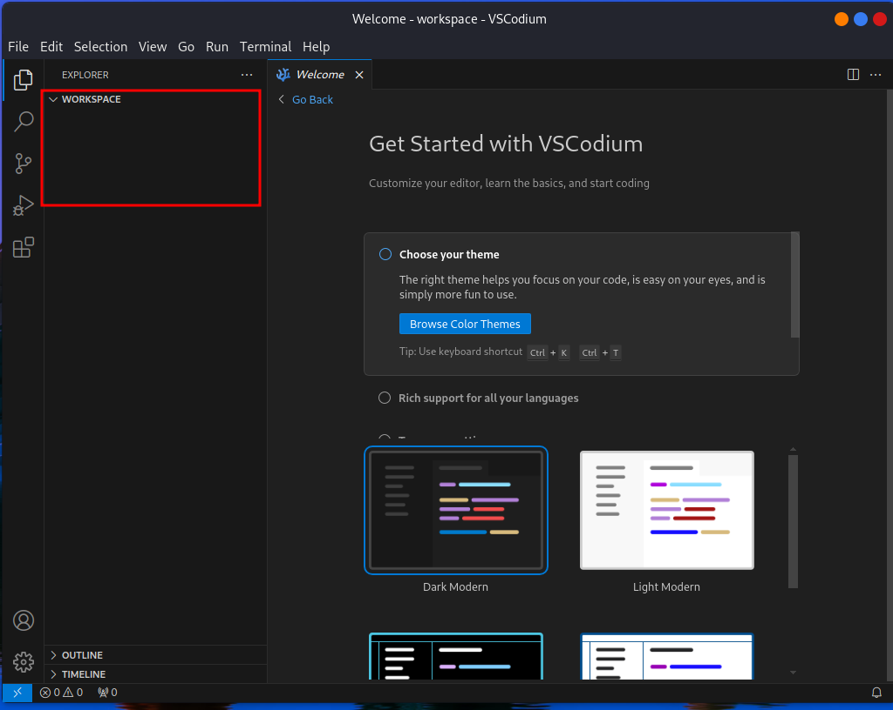
    <br>
    <div style="color:orange; border-bottom: 1px solid #d9d9d9;
    display: inline-block;
    color: #999;
    padding: 2px;"> 图 2.2.6 </div>
</center>

## 3. python 程序运行

### 3.1 创建 Python 示例文件

​ 如图 3.1.1 所示，点击 WORKSPACE 工作目录行的新增文件图标即可开始添加新文件。接着在出现的输入框中键入 python_demo.py 为文件命名，如图 3.1.2 所示。命名后按 Enter 键，可以看到文件已创建好，而且 VSCodium 自动创建了一个标签页打开该文件，如图 3.1.3 所示。

<center>
    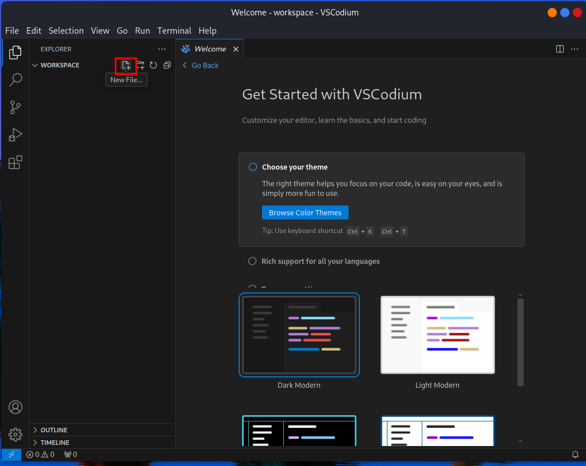
    <br>
    <div style="color:orange; border-bottom: 1px solid #d9d9d9;
    display: inline-block;
    color: #999;
    padding: 2px;"> 图 3.1.1 </div>
</center>

<center>
    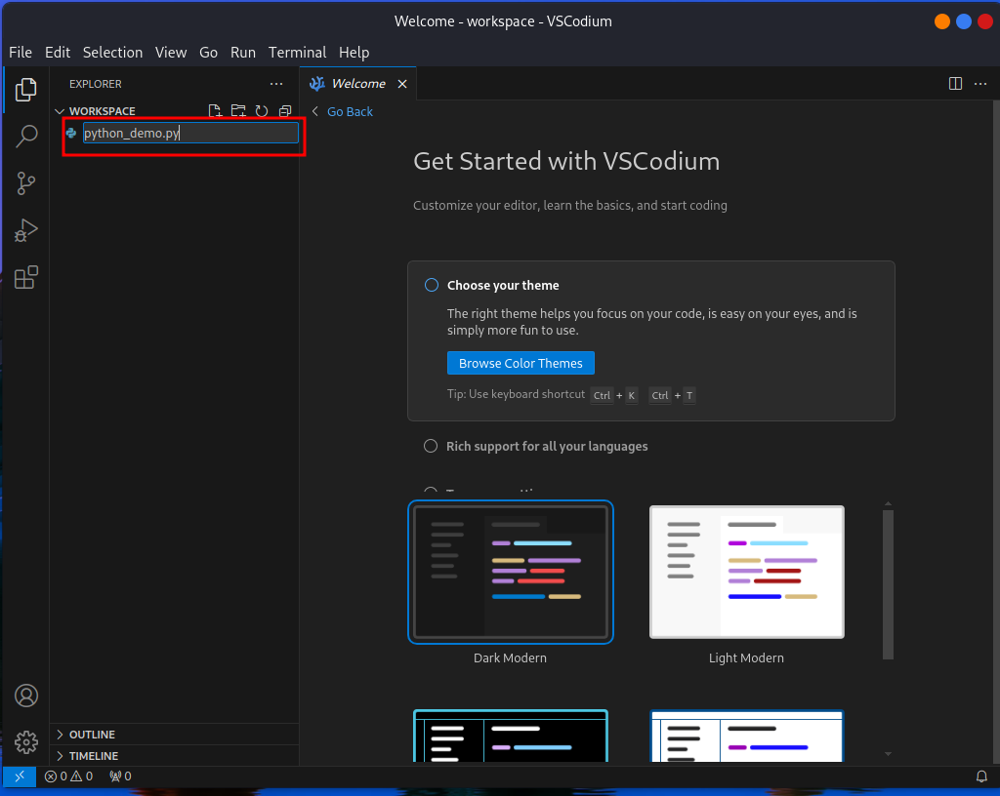
    <br>
    <div style="color:orange; border-bottom: 1px solid #d9d9d9;
    display: inline-block;
    color: #999;
    padding: 2px;"> 图 3.1.2 </div>
</center>

<center>
    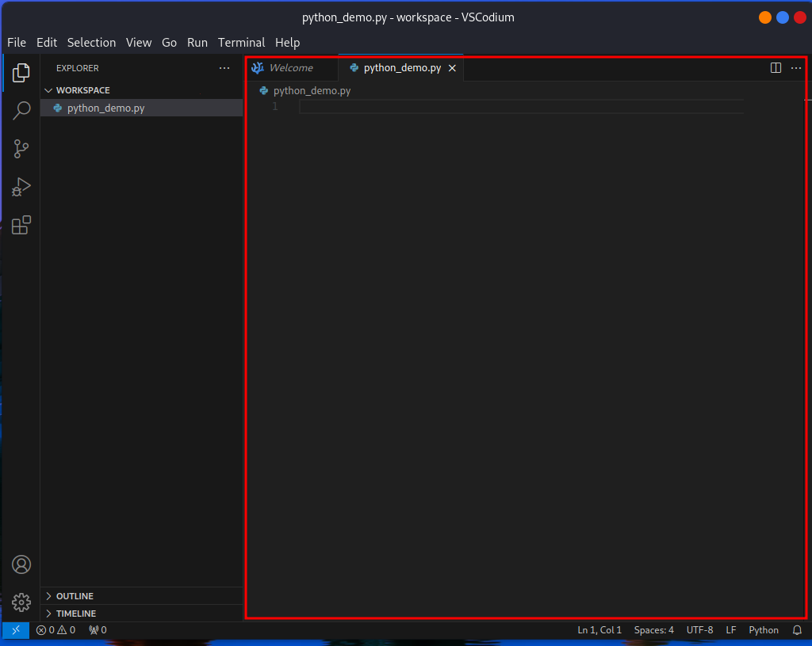
    <br>
    <div style="color:orange; border-bottom: 1px solid #d9d9d9;
    display: inline-block;
    color: #999;
    padding: 2px;"> 图 3.1.3 </div>
</center>

​在新建的文件中编写如下示例程序，如图 3.1.4。

```Python
print("Hello Bianbu!")
```

<center>
    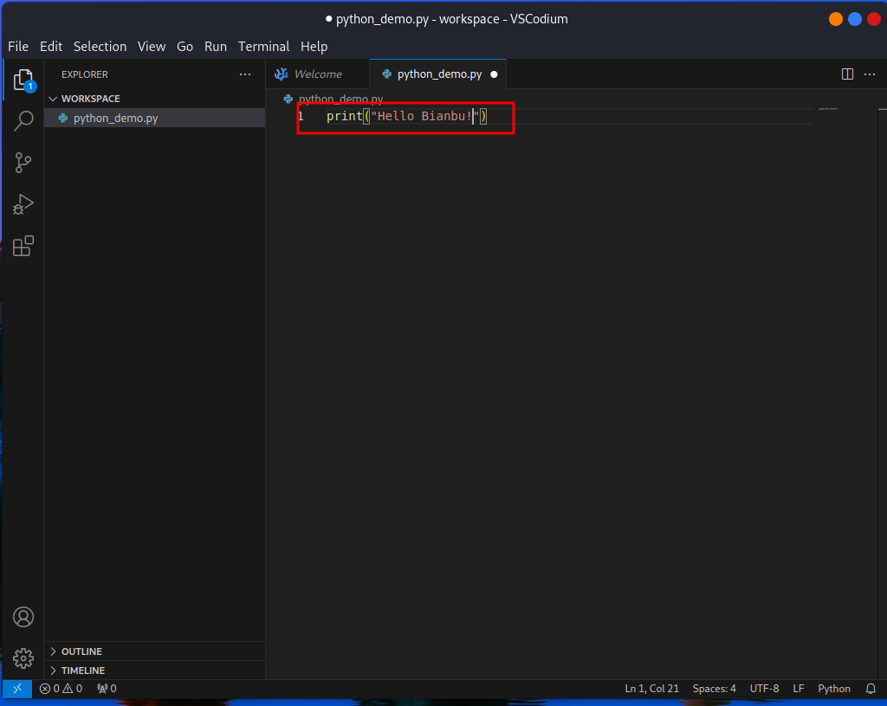
    <br>
    <div style="color:orange; border-bottom: 1px solid #d9d9d9;
    display: inline-block;
    color: #999;
    padding: 2px;"> 图 3.1.4 </div>
</center>

​编写好示例程序后，点击左上角 File 选项卡的 Save 选项保存文件，如图 3.1.5，也可以使用快捷键 "Ctrl + S" 保存文件。

<center>
    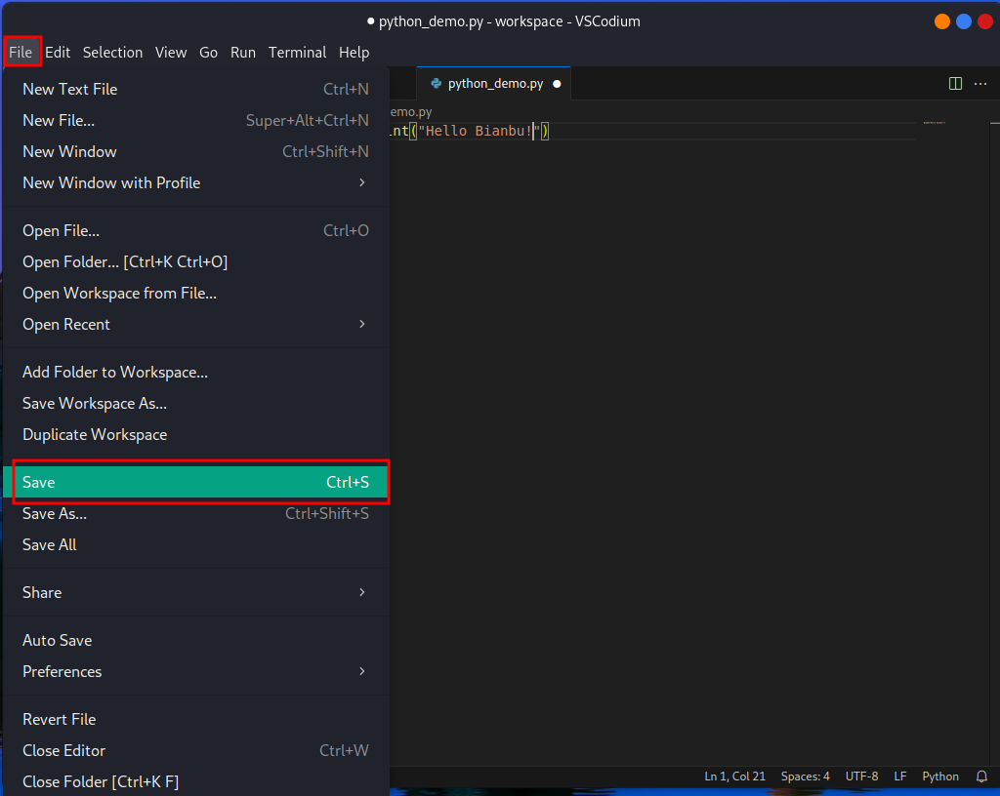
    <br>
    <div style="color:orange; border-bottom: 1px solid #d9d9d9;
    display: inline-block;
    color: #999;
    padding: 2px;"> 图 3.1.5 </div>
</center>

### 3.2 在终端中运行程序

​在 python 环境搭建章节中，我们介绍了如何在终端中运行 Python 程序，在 VSCodium 中，也可以通过终端的方式运行程序。在选项卡中选择 Terminal->New Ternimal 打开终端，然后使用以下命令运行程序，如图 3.2.1 所示。

```Bash
python python_demo.py
```

<center>
    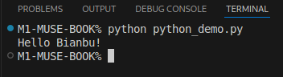
    <br>
    <div style="color:orange; border-bottom: 1px solid #d9d9d9;
    display: inline-block;
    color: #999;
    padding: 2px;"> 图 3.2.1 </div>
</center>

## 3.3 安装拓展运行程序

​ 点击左侧侧边栏的拓展图标，在拓展列表中搜索 python，安装名为"Python"的拓展，如图 3.3.1 所示。拓展安装成功后 Python 拓展标签的右下角会变成小齿轮图标，如图 3.3.2 所示。

<center>
    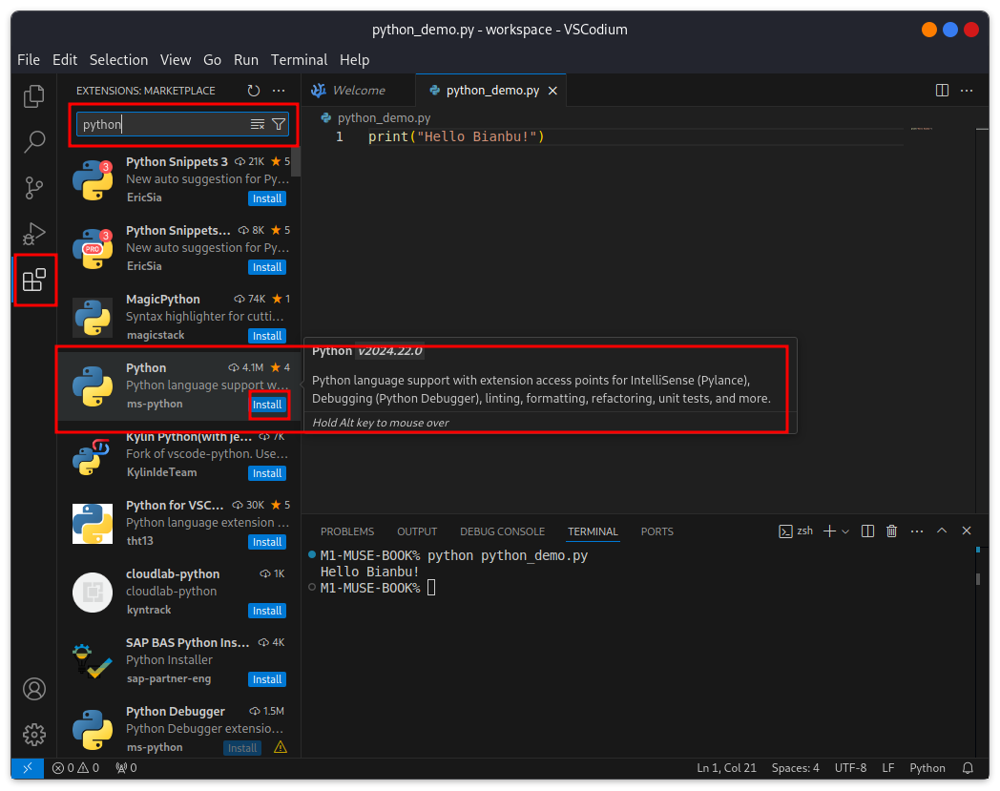
    <br>
    <div style="color:orange; border-bottom: 1px solid #d9d9d9;
    display: inline-block;
    color: #999;
    padding: 2px;"> 图 3.3.1 </div>
</center>

<center>
    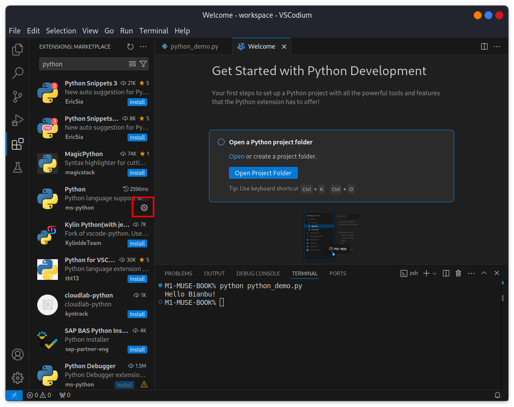
    <br>
    <div style="color:orange; border-bottom: 1px solid #d9d9d9;
    display: inline-block;
    color: #999;
    padding: 2px;"> 图 3.3.2 </div>
</center>

​安装好拓展后，回到 python_demo.py 页面，可以看到运行程序的图标，如图 3.3.3 所示，点击即可运行 Python 程序。运行结果如图 3.3.4 所示。

<center>
    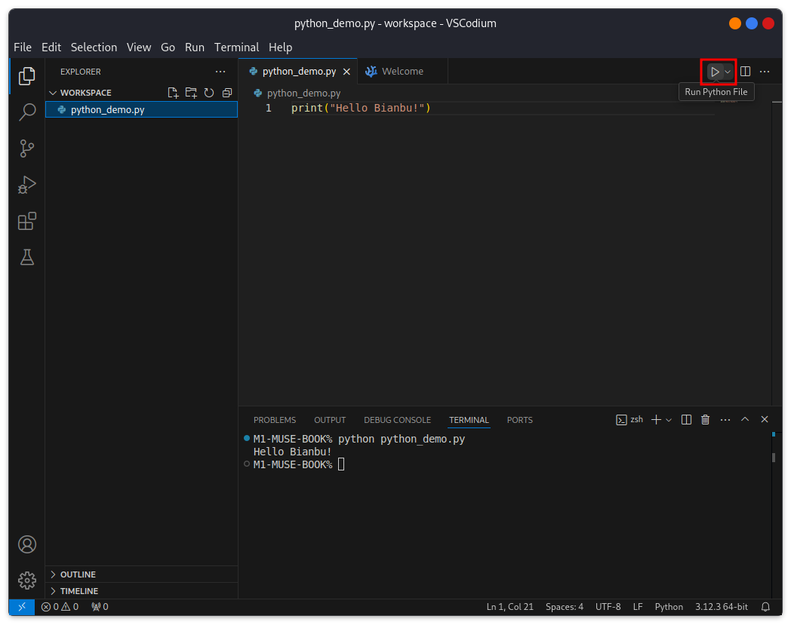
    <br>
    <div style="color:orange; border-bottom: 1px solid #d9d9d9;
    display: inline-block;
    color: #999;
    padding: 2px;"> 图 3.3.3 </div>
</center>

<center>
    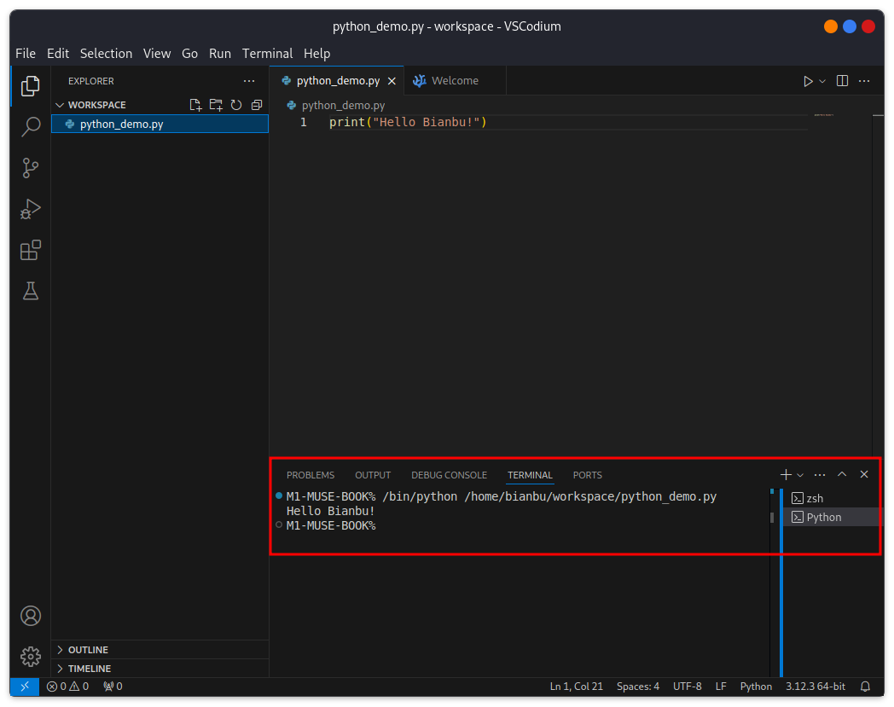
    <br>
    <div style="color:orange; border-bottom: 1px solid #d9d9d9;
    display: inline-block;
    color: #999;
    padding: 2px;"> 图 3.3.4 </div>
</center>

## 4. C++程序运行

### 4.1 创建 C++ 示例文件

​ 按照"3.1 创建 Python 示例文件"中的流程创建 C++ 示例文件 cpp_demo.cpp，文件内容如下，创建好的 C++ 文件如图 4.1.1 所示。

```C++
#include <iostream>
int main() {
    std::cout << "Hello Bianbu!" << std::ends;
    return 0;
}
```

<center>
    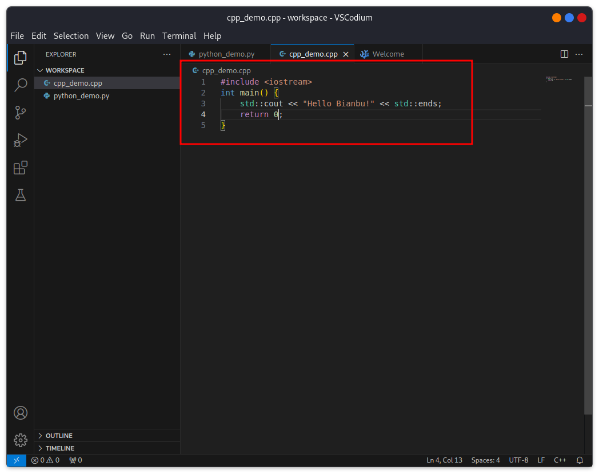
    <br>
    <div style="color:orange; border-bottom: 1px solid #d9d9d9;
    display: inline-block;
    color: #999;
    padding: 2px;"> 图 4.1.1 </div>
</center>

### 4.2 在终端中运行程序

​ 在 C++环境搭建章节中，我们已经介绍了如何在命令行中运行 C++ 程序。在 VSCodium 中，我们打开终端，然后键入如下命令来编译和运行 C++ 示例程序即可，如图 4.2.1 所示。

```Bash
# 编译 cpp_demo.cpp 文件
g++ cpp_demo.cpp -o cpp_demo
# 运行编译后的二进制文件 cpp_demo
./cpp_demo
```

<center>
    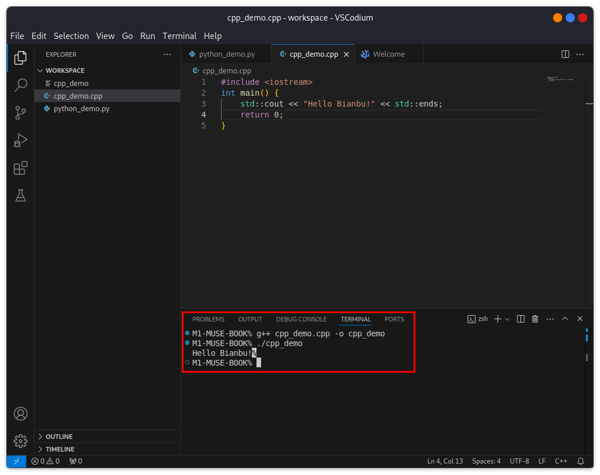
    <br>
    <div style="color:orange; border-bottom: 1px solid #d9d9d9;
    display: inline-block;
    color: #999;
    padding: 2px;"> 图 4.2.1 </div>
</center>

### 4.3 安装拓展运行程序

​ 打开拓展列表，搜索 C++，安装名为 "C/C++ Runner" 的拓展，如图 4.3.1 所示。安装好 "C/C++ Runner" 拓展后， "C/C++ Runner" 拓展的页面如图 4.3.2 所示。

<center>
    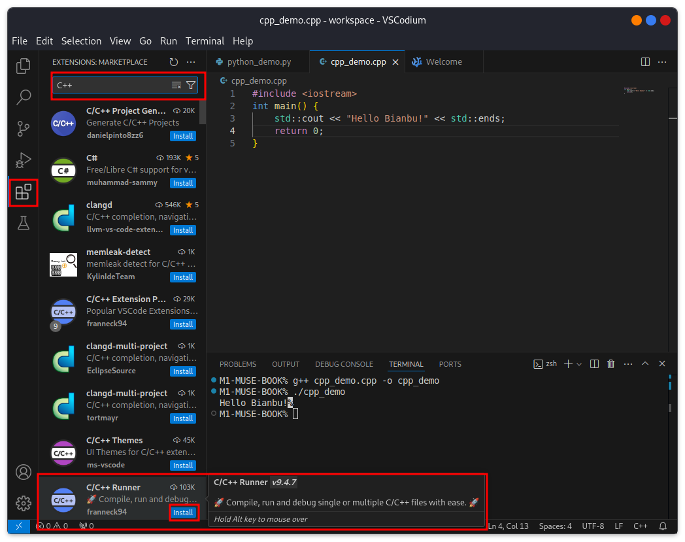
    <br>
    <div style="color:orange; border-bottom: 1px solid #d9d9d9;
    display: inline-block;
    color: #999;
    padding: 2px;"> 图 4.3.1 </div>
</center>

<center>
    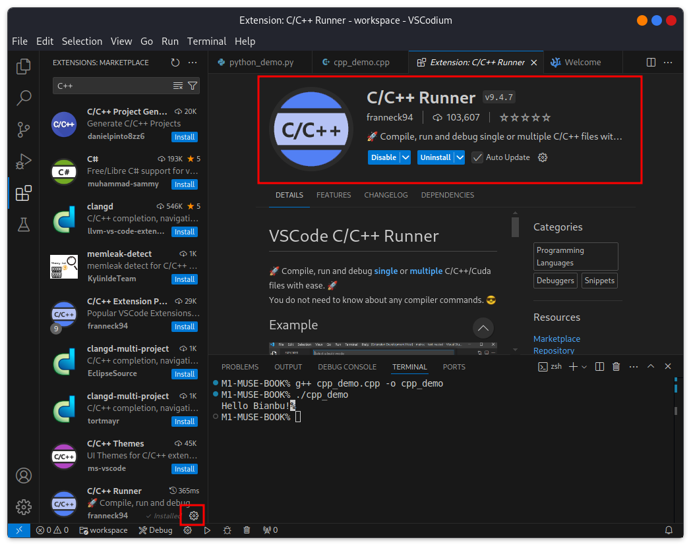
    <br>
    <div style="color:orange; border-bottom: 1px solid #d9d9d9;
    display: inline-block;
    color: #999;
    padding: 2px;"> 图 4.3.2 </div>
</center>

​此时，我们回到 C++ 的示例文件页面，如图 4.3.3 所示选择 C/C++ Runner: Run File 即可运行程序。运行结果如图 4.3.4 所示。

<center>
    
    <br>
    <div style="color:orange; border-bottom: 1px solid #d9d9d9;
    display: inline-block;
    color: #999;
    padding: 2px;"> 图 4.3.3  </div>
</center>

<center>
    
    <br>
    <div style="color:orange; border-bottom: 1px solid #d9d9d9;
    display: inline-block;
    color: #999;
    padding: 2px;"> 图 4.3.4 </div>
</center>

## 5. Zed 使用简介

### 5.1 启动Zed

​我们的系统中也已经将 Zed 应用图标置于桌面底部的 dock 栏中，点击图标即可打开 Zed，如图 5.1.1 。初次打开 Zed 应用，Zed 会显示欢迎页面，如图 5.1.2 所示，这里我们不做操作，采用默认的即可。

<center>
    
    <br>
    <div style="color:orange; border-bottom: 1px solid #d9d9d9;
    display: inline-block;
    color: #999;
    padding: 2px;"> 图 5.1.1 </div>
</center>

<center>
    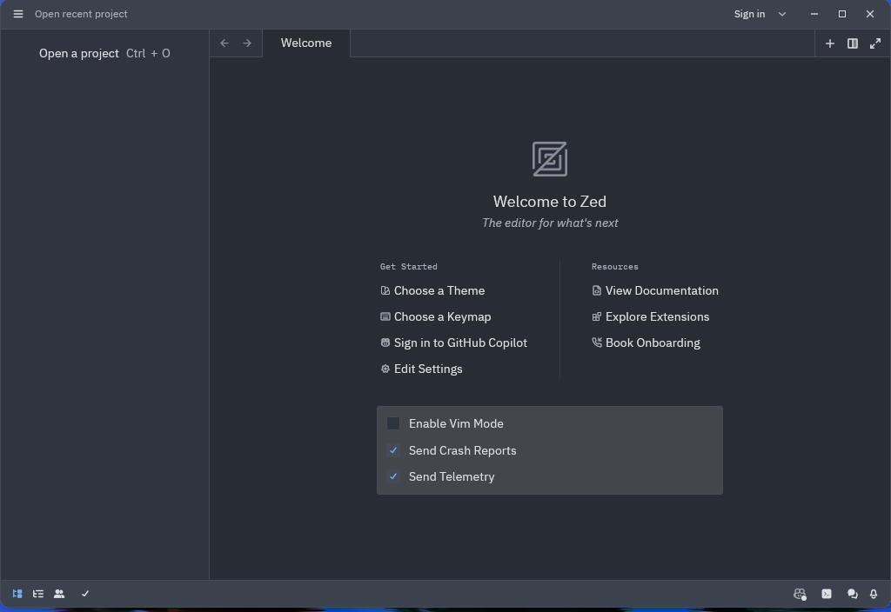
    <br>
    <div style="color:orange; border-bottom: 1px solid #d9d9d9;
    display: inline-block;
    color: #999;
    padding: 2px;"> 图 5.1.2 </div>
</center>

### 5.2 打开项目目录

​点击左上角的下拉列表，选择"open a new Project"，如图 5.2.1 所示。

<center>
    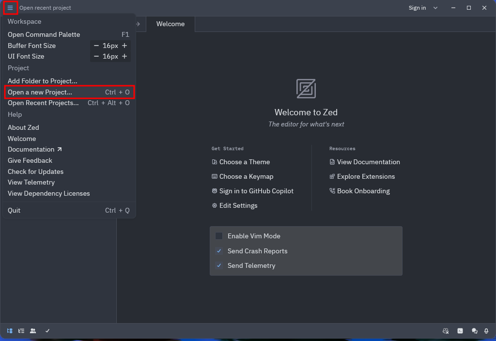
    <br>
    <div style="color:orange; border-bottom: 1px solid #d9d9d9;
    display: inline-block;
    color: #999;
    padding: 2px;"> 图 5.2.1 </div>
</center>

​随后 Zed 会弹出选择项目目录的窗口，这里我们选择前面创建的 workspace，如图 5.2.2 所示。

<center>
    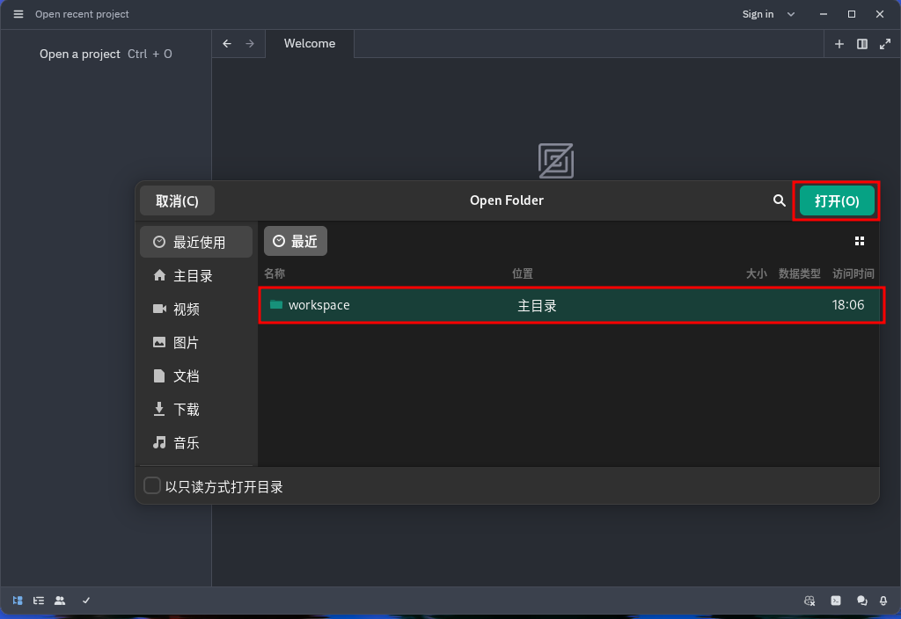
    <br>
    <div style="color:orange; border-bottom: 1px solid #d9d9d9;
    display: inline-block;
    color: #999;
    padding: 2px;"> 图 5.2.2 </div>
</center>

​成功打开项目后，Zed 显示项目中的文件和目录，这一点和 VSCodium 相似，如图5.2.3所示。

<center>
    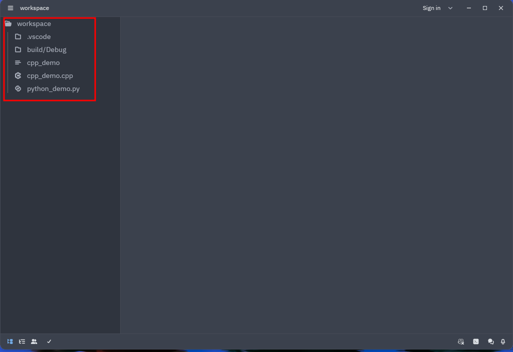
    <br>
    <div style="color:orange; border-bottom: 1px solid #d9d9d9;
    display: inline-block;
    color: #999;
    padding: 2px;"> 图 5.2.3 </div>
</center>

### 5.3 编辑文件

​ 打开项目后，点击左侧文件列表的 python_demo.py 文件，Zed 就会打开对应文件，此时我们可以对文件内容进行修改，如图 5.3.1.

<center>
    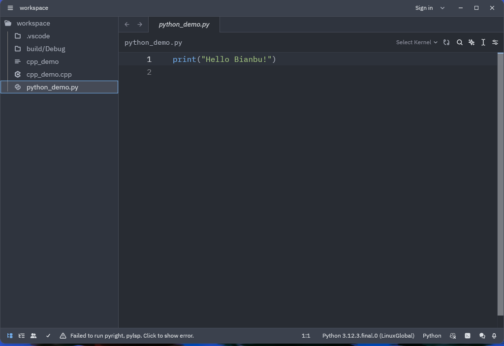
    <br>
    <div style="color:orange; border-bottom: 1px solid #d9d9d9;
    display: inline-block;
    color: #999;
    padding: 2px;"> 图 5.3.1 </div>
</center>

​我们在 python_demo.py 文件中加上以下代码，然后使用 "Ctrl+S" 快捷键保存文件。

```python
print("Here is Zed!")
```

​编辑后的代码文件如图5.3.2所示。

<center>
    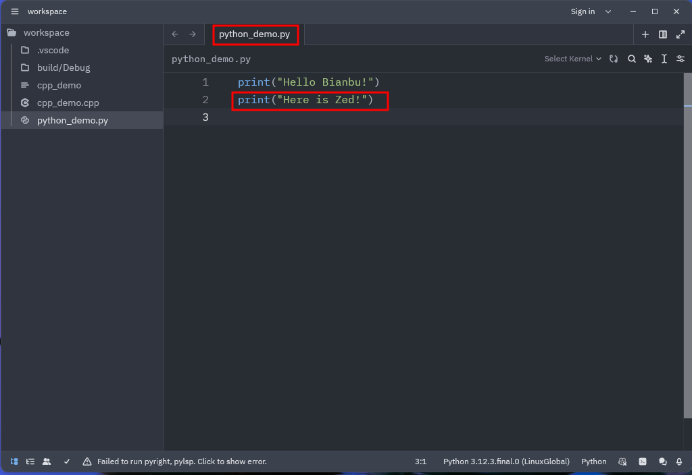
    <br>
    <div style="color:orange; border-bottom: 1px solid #d9d9d9;
    display: inline-block;
    color: #999;
    padding: 2px;"> 图 5.3.2 </div>
</center>

### 5.4 运行程序

​ 修改 python_demo.py 文件后，我们在 Zed 中打开终端。点击右下角的终端图标，如图 5.4.1 所示。

<center>
    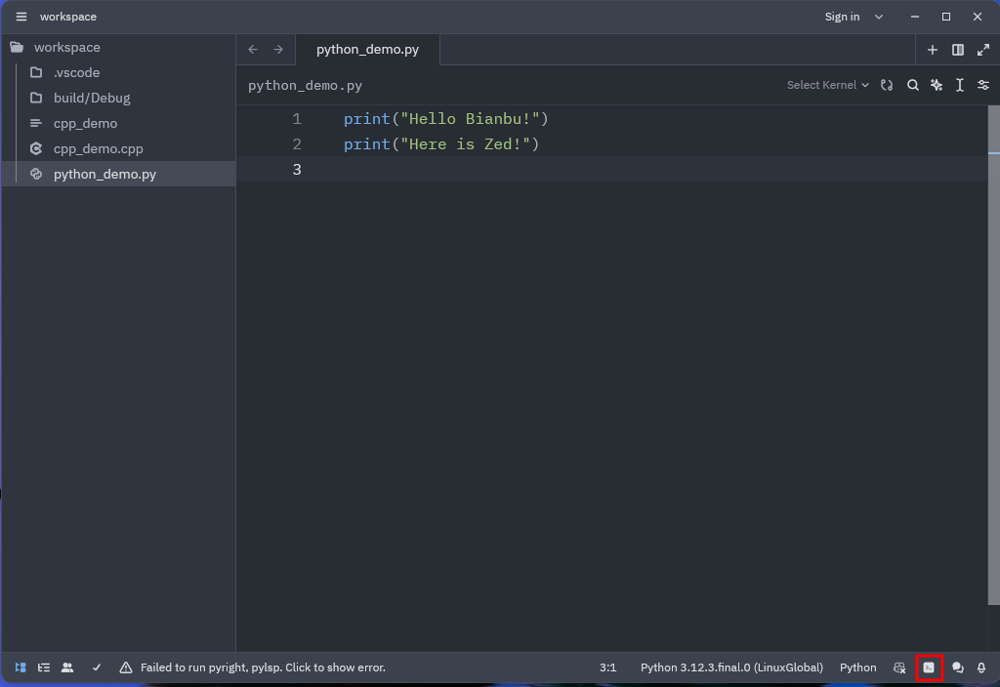
    <br>
    <div style="color:orange; border-bottom: 1px solid #d9d9d9;
    display: inline-block;
    color: #999;
    padding: 2px;"> 图 5.4.1 </div>
</center>

​ 打开终端后，在终端中输入以下命令执行程序：

```shell
python python_demo.py
```

​ 程序运行结果如图 5.4.2 所示。

<center>
    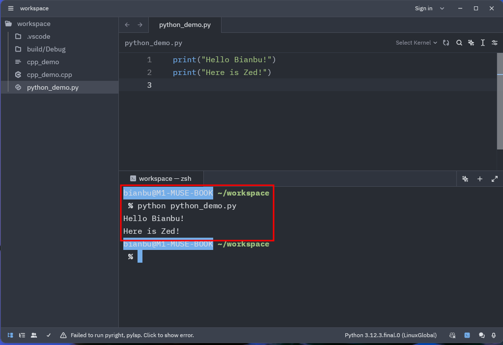
    <br>
    <div style="color:orange; border-bottom: 1px solid #d9d9d9;
    display: inline-block;
    color: #999;
    padding: 2px;"> 图 5.4.2 </div>
</center>
