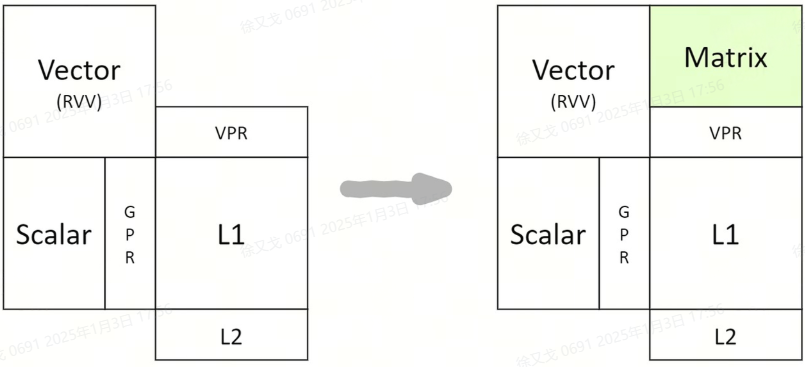
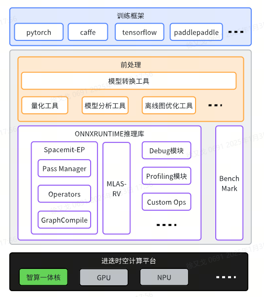

# 进迭时空 AI 框架介绍

## AI CPU

为了保证AI算力的通用性和易用性，进迭时空基于自身CPU核的研发能力，以标准RISC-V核为基础，通过扩展AI指令的方式，打造了带有AI融合算力的CPU。我们把这种具有完整CPU功能和强大AI算力的融合处理器，命名为AI CPU，如下图所示。

    
     
    
 图1 AI CPU 

**AI** **CPU** **算力构成**

在AI计算中，会用到Scalar算力，Vector算力及Matrix算力。我们最大限度的遵循RISC-V社区标准，仅对matrix算力进行了指令扩展。

智算核（单core）算力构成详细描述如下：

- Scalar算力，采用RISC-V 64GCB标准指令；

- Vector算力，采用RISC-V Vector 1.0标准指令；

- Matrix算力，以**专用加速指令**的方式提供，采用RISC-V custom-1的编码空间，操作数和结果保存复用RVV的VPR寄存器。详细扩展指令描述可以参考我们开源在github的指令集手册https://github.com/space-mit/riscv-ime-extension-spec

## 进迭时空 AI 软件架构

完整的CPU功能保证了AI算力的通用性及易用性，让AI CPU可以非常便捷的接入开源生态；强大的AI算力可以给AI应用带来10倍以上的性能提升。并且，我们遵循RISCV社区IME group的理念，复用Vector寄存器资源进行AI计算，以极小的硬件代价就为智算核注入澎湃的AI算力。

如下图所示，基于进迭时空的AI技术路线，我们能轻松的以轻量化插件的方式，无感融入到每一个AI算法部署框架中，目前我们以ONNXRuntime为基础，结合深度调优的加速后端，就可以成功的将模型高效的部署到我们的芯片上，如上图所示。对于用户来说，如果有ONNXRuntime的使用经验，就可以无缝衔接。

    
     
    
 图2 进迭时空架构图 

**训练框架**： 训练框架是指用于开发、训练和评估机器学习（ML）或深度学习（DL）模型的软件工具和库。这些框架提供了实现各种机器学习算法的接口，简化了从数据预处理到模型部署的整个工作流程.常见的训练框架包括PyTorch，TensorFlow，Caffe，PaddlePaddle等，其中尤以 PyTorch 最受开发者青睐。

**前处理**：前处理旨在模型部署前一系列的准备工作，包括量化模型(缩小模型数值范围，减少计算量，获取更高的推理性能)，模型分析工具(将模型结构可视化，便于设计和分析模型)，模型优化工具(提供默认的一些策略来对模型做优化)等。

**ONNXRUNTIME推理库**：onnxruntime推理库用于模型部署。模型部署领域有许多优秀的开源框架，如 NCNN、MNN 和 TensorRT 等，而 ONNX Runtime 凭借其广泛的兼容性和高效性能，成为了其中备受欢迎的选择之一。

**进迭时空计算平台**：进迭时空计算平台是以进迭时空的芯片为核心，结合多种异构计算资源（如GPU和NPU），构建了一个高性能的计算平台，致力于为客户提供卓越的算力支持。