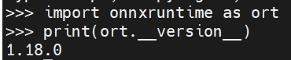
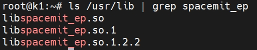

# ONNX Runtime 安装

Onnxruntime是由微软推出，用于优化和加速机器学习推理和训练，适用于ONNX模型，是一个跨平台推理和训练机器学习加速器。借助进迭时空团队适配的onnxruntime，可以充分利用k1芯片2T的AI算力。以下是几种可以在进迭时空k1芯片端安装onnxruntime的方法：

## 安装

- python

使用Python包管理器pip安装python版本onnxruntime
```bash
pip install --index-url https://git.spacemit.com/api/v4/projects/33/packages/pypi/simple spacemit-ort --break-system-packages
```

- c++

bianbu系统已经预装了onnxruntime，或者您可以通过以下命令直接安装
```bash
sudo apt install onnxruntime
```

## 验证安装

安装完成后，建议验证 ONNX Runtime 是否正确安装。可以进行简单的测试：

- python

```python
import onnxruntime as ort
print(ort.__version__)
```
<center>
    
    <br>
    <div style="color:orange; border-bottom: 1px solid #d9d9d9;
    display: inline-block;
    color: #999;
    padding: 2px;"> 图 1.1 </div>
</center>
如打印出上述的onnxruntime的版本号，表明安装成功。

- c++

```c++
ls /usr/lib | grep spacemit_ep
```
<center>
    
    <br>
    <div style="color:orange; border-bottom: 1px solid #d9d9d9;
    display: inline-block;
    color: #999;
    padding: 2px;"> 图 1.2 </div>
</center>
可根据上述打印内容判断onnxruntime是否已经安装到您的库中。
