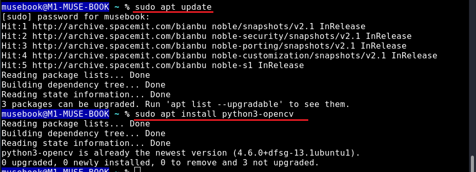
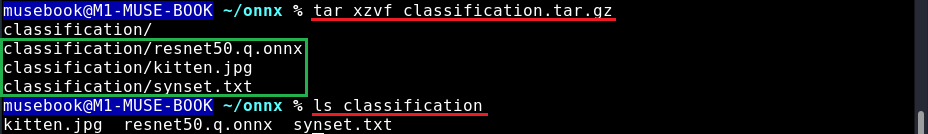
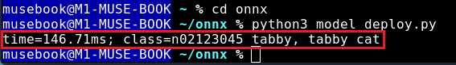

# ONNX 模型部署指南

## 简介

本指南面向希望部署 ONNX 模型进行图像分类任务的开发者。假设读者具备基本的 Python 编程和机器学习概念知识，但不需要有 ONNX Runtime 的使用经验。

## 依赖安装

在运行 ONNX 模型之前，需要安装必要的依赖项。

```bash
# 更新软件包列表
sudo apt update
# OpenCV 用于计算机视觉操作
sudo apt install python3-opencv  
```

更新和安装结果如下图。



## 准备模型部署代码

准备以下代码，以便后续拷贝到对应的运行程序中

```python
import numpy as np
import onnxruntime as ort
import spacemit_ort  # SpacemiT acceleration library
from PIL import Image
import cv2
import time

# Load and convert image to RGB format
def get_image(path):
    with Image.open(path) as img:
        img = np.array(img.convert('RGB'))  # Convert image to RGB numpy array
    return img
    
# Image preprocessing function
def preprocess(img):        
    # Normalize pixel values to the range [0, 1]
    img = img / 255.  
    
    # Resize image to 256x256 pixels
    img = cv2.resize(img, (256, 256))
    
    # Center crop to 224x224 pixels
    h, w = img.shape[0], img.shape[1]
    y0 = (h - 224) // 2  # Compute vertical crop offset
    x0 = (w - 224) // 2  # Compute horizontal crop offset
    img = img[y0 : y0+224, x0 : x0+224, :]  # Perform cropping
    
    # Apply ImageNet mean and standard deviation normalization
    img = (img - [0.485, 0.456, 0.406]) / [0.229, 0.224, 0.225]
    
    # Change dimension order to Channel-Height-Width
    img = np.transpose(img, axes=[2, 0, 1])
    
    # Convert to float32 data type
    img = img.astype(np.float32)
    
    # Add batch dimension (required for model input)
    img = np.expand_dims(img, axis=0)
    
    return img
    
# Prediction function
def predict(path):
    img = get_image(path)    
    img = preprocess(img)
    
    # Create input dictionary for ONNX Runtime
    ort_inputs = {session.get_inputs()[0].name: img}  
    
    # Measure inference time
    start = time.time()
    
    # Run model inference
    preds = session.run(None, ort_inputs)[0]  
    
    end = time.time()
    
    # Process prediction results
    preds = np.squeeze(preds)  # Remove unnecessary dimensions
    a = np.argsort(preds)[::-1]  # Sort predictions by confidence
    
    # Print results
    print('time=%.2fms; class=%s' % (round((end-start) * 1000, 2), labels[a[0]]))

# Load class labels from ImageNet
with open('classification/synset.txt', 'r') as f:
    labels = [l.rstrip() for l in f]

# Configure ONNX Runtime session options
session_options = ort.SessionOptions()
session_options.intra_op_num_threads = 2  # Set number of threads for internal operations

# Initialize inference session with a custom hardware provider
session = ort.InferenceSession('classification/resnet50.q.onnx',
                              sess_options=session_options,
                              providers=["SpaceMITExecutionProvider"])  # Custom execution provider

# Perform prediction on a sample image
img_path = 'classification/kitten.jpg'
predict(img_path)
```

## 执行指南

### 第 1 步：准备环境

运行代码之前，请确保您已经：

1. 安装了 Python 3.x
2. 进行 **[依赖安装](#依赖安装)** 中的命令安装了所需软件包
3. 为项目创建了工作目录

### 第 2 步：下载并解压资源  

首先，下载样本数据包：  
[classification.tar.gz](https://gitlab.dc.com:8443/mastery-suite/spacemit-riscv-content/-/blob/main/docs/AI/01_AI%E5%9F%BA%E7%A1%80%E5%AD%A6%E4%B9%A0%E5%8F%8A%E5%AE%9E%E8%B7%B5/code/classification.tar.gz)  

然后，解压文件：

```bash
# 解压下载的文件
tar xzvf classification.tar.gz

# 验证解压后的文件
ls classification/
# 预期输出：resnet50.q.onnx  synset.txt  kitten.jpg
```

如下图，解压后目录结构如下：


```
classification/
├── resnet50.q.onnx    # 量化 ONNX 模型
├── synset.txt         # ImageNet 类别标签
└── kitten.jpg         # 示例输入图片
```

请确保这些文件存在，然后再进行下一步。

### 第 3 步：创建部署脚本

```bash
# 进入项目目录
cd your_project_directory

# 创建一个新的 Python 文件
touch model_deploy.py

# 用文本编辑器打开文件（例如 VS Code、Nano 或其他你喜欢的编辑器）
# 然后将第 1.2 节中的完整部署代码复制并粘贴到此文件 model_deploy.py 中
```

如下图，此例子的项目目录为 **onnx**


### 第 4 步：运行推理脚本

```bash
# 确保你在正确的目录中
cd your_project_directory

# 执行部署脚本
python3 model_deploy.py
```

如果成功，你应该会看到类似的输出如下图：



### 第 5 步：解释结果

输出将显示以下内容：

- 推理时间（毫秒）
- 预测的类别 ID 和标签（来自 ImageNet 的 1000 个类别）
- 对于样本图像 "kitten.jpg"，它应正确识别为虎斑猫

>**注意事项：**
>
> - 如果看到关于文件缺失的错误，请验证是否正确解压了 classification.tar.gz 文件，并确保 classification 目录中存在所有所需文件。
> - 如果遇到 OpenCV 导入错误，可能需要使用 `pip install opencv-python` 重新安装该软件包。
> - 如果onnxruntime无法成功导入，请参考文档 **onnxruntime安装**
> - 可以通过调整会话配置中的 `intra_op_num_threads` 值来解决性能问题，使其更适合你的硬件能力。
