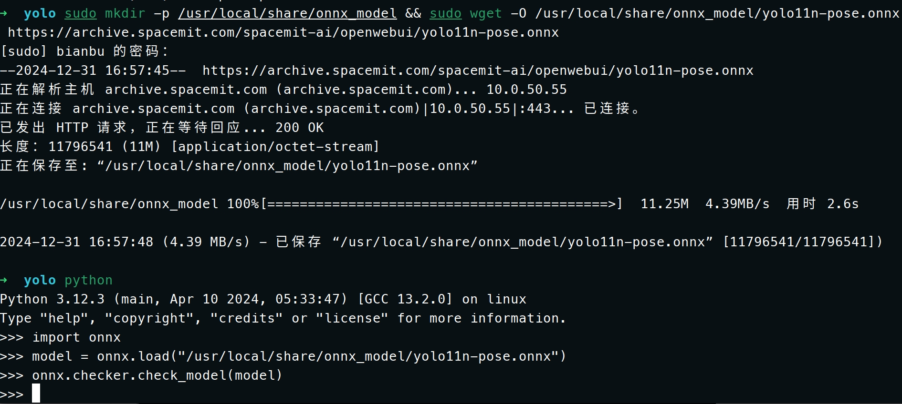

sidebar_position: 9

# ONNX Runtime 故障排查

当使用onnxruntime遇到问题时，可以采取以下步骤进行故障排查：

## 环境与模型检查

确保你的开发和运行环境已经正确安装并配置了所有必要的依赖项，包括onnxruntime及其版本是否与你的项目兼容。确认onnx模型文件没有损坏。使用 onnx.checker 检查模型的有效性，确保模型符合 ONNX 标准。

点击ctrl+alt+t打开终端，输入以下命令安装onnx

```bash
sudo apt install python3-onnx -y
```

运行下列代码，可以检查onnx模型是否规范。首先复制以下命令粘贴到终端点击确定:

```bash
sudo mkdir -p /usr/local/share/onnx_model && sudo wget -O /usr/local/share/onnx_model/yolo11n-pose.onnx https://archive.spacemit.com/spacemit-ai/openwebui/yolo11n-pose.onnx
```

然后在终端输入python点击确定，然后复制下面代码到终端，点击运行：

```python
import onnx
model = onnx.load("/usr/local/share/onnx_model/yolo11n-pose.onnx")
onnx.checker.check_model(model)
```

输出显示：
<center>
    
    <br>
    <div style="color:orange; border-bottom: 1px solid #d9d9d9;
    display: inline-block;
    color: #999;
    padding: 2px;"> 图 1.1 </div>
</center>

## 尝试定位问题

- 简化问题

   尝试使用简单的模型来测试onnxruntime是否正常工作，排除模型本身的问题。如果可能的话，逐步增加模型复杂度直到重现问题。

- 检查输入数

   确保提供给onnxruntime的输入数据格式、类型和尺寸都正确无误。对于图像等数据，还要确保预处理步骤（如归一化）是正确的。

- 验证输出

   结果比较onnxruntime的输出与原生框架（如PyTorch, TensorFlow）的输出，确保两者一致。

- 更新到最新版本

   确保你正在使用最新的onnx和onnxruntime，因为旧版本可能存在已知的bug，这些bug在新版本中可能已经被修复。

- 查阅文档和社区资源

   查阅官方文档，了解是否有类似问题的解决方案。访问进迭时空论坛，看看其他用户是否遇到了相同的问题，并查找解决方案。

## 联系支持或贡献社区

   如果以上步骤都无法解决问题，考虑联系onnxruntime的开发者或进迭时空开发团队寻求帮助。也可以考虑为项目贡献，提交bug报告或提出改进意见。

## 总结

   通过上述方法，你应该能够有效地对onnxruntime中遇到的问题进行排查和解决。如果问题仍然存在，提供详细的错误信息和上下文对于获得外部帮助是非常有帮助的。
