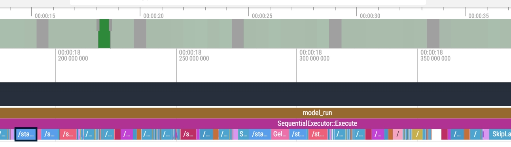
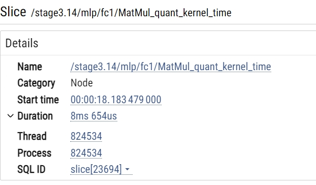
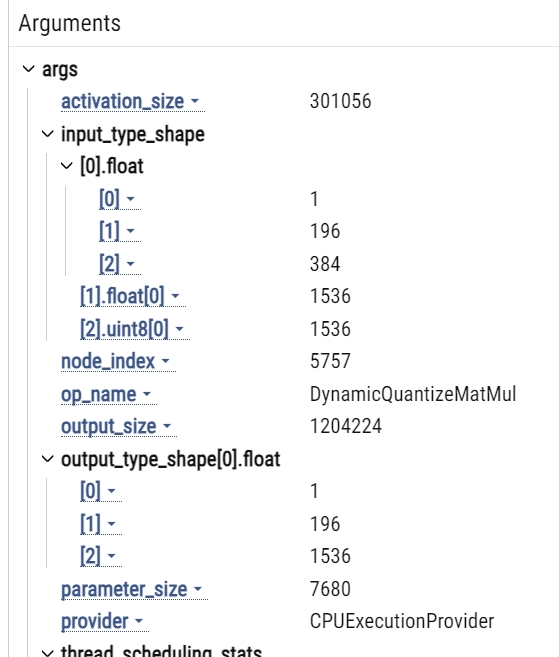

# 1. 性能分析概述
可以通过onnxruntime性能工具获取整模型性能，如有需要，可以进一步开启onnxruntime profiling，获取算子级的性能分析报告
# 2. 整模型性能分析
在k1上可以使用onnxruntime_perf_test工具测试模型性能，并通过开启profiling功能获取算子级别的性能分析报告。

下载测试模型文件: [yolov6p5_n.q.onnx](code/yolov6p5_n.q.onnx)
```bash
# example
onnxruntime_perf_test yolov6p5_n.q.onnx -x 4 -r 10 -e spacemit -p yolov6 -I
```
结果如下所示
```bash
using SpaceMITExecutionProvider
Setting intra_op_num_threads to 4
Session creation time cost: 0.708476 s
First inference time cost: 60 ms
Total inference time cost: 0.446395 s
Total inference requests: 10
Average inference time cost: 44.6395 ms
Total inference run time: 0.446867 s
Number of inferences per second: 22.378
Avg CPU usage: 48 %
Peak working set size: 53567488 bytes
Avg CPU usage:48
Peak working set size:53567488
Runs:10
Min Latency: 0.0429274 s
Max Latency: 0.049022 s
P50 Latency: 0.0446158 s
P90 Latency: 0.049022 s
P95 Latency: 0.049022 s
P99 Latency: 0.049022 s
P999 Latency: 0.049022 s
```

# 3. 使用profiling
用户也可以在编写相关程序的过程手动开启profiling功能，获取模型运行的性能分析报告。

#### Python

配置环境
```bash
sudo apt install libsleef3
sudo apt install python3-virtualenv

# 切换到home目录创建并激活python虚拟环境
cd ~/
virtualenv py3
source ~/py3/bin/activate

# 如果之前没有在K1上配置过spacemit的pypi源，可通过这个命令进行配置
pip config set global.extra-index-url https://git.spacemit.com/api/v4/projects/33/packages/pypi/simple

# 安装依赖包
pip install numpy==1.26.4
pip install onnxruntime==1.20.0
```
运行下面的demo程序
```python
import numpy as np
import onnxruntime as ort


session_options = ort.SessionOptions()
# 开启profiling，默认为 False
session_options.enable_profiling = True
# 设置生成profile文件的文件名前缀，默认为 onnxruntime_profile 
session_options.profile_file_prefix = 'test_profile'


model_path = "yolov6p5_n.q.onnx"
session = ort.InferenceSession(
    model_path,
    sess_options=session_options,
    providers=ort.get_available_providers()
)

# 打印模型的inputs_name 和 inputs_shape
inputs_name = session.get_inputs()[0].name
inputs_shape = session.get_inputs()[0].shape
print("inputs_name:", inputs_name)
print("inputs_shape:", inputs_shape)

# 生成输入数据并进行推理
np.random.seed(42)
dummy_input = np.random.uniform(low=0.0, high=1, size=inputs_shape).astype(np.float32)
res = session.run(None, {inputs_name: dummy_input})

# 保存性能分析文件
prof_file = session.end_profiling()
print("Performance profile saved to:", prof_file)
```

输出内容如下，当前目录下会有一个test_profile_ 开头的性能分析文件，可查看具体的性能分析结果：
```bash
inputs_name: images
inputs_shape: [1, 3, 320, 320]
Performance profile saved to: test_profile_2024-12-31_10-15-00.json
```

# 4. Profiling文件分析
通过onnxruntime_perf_test工具或者代码中手动开启profile工具之后，您可以获得对应的json格式的profiling文件，我们推荐将profiling文件传输到PC端，然后在PC端打开[Perfetto工具](https://www.ui.perfetto.dev/)对profiling文件进行分析。

将json文件滑动至页面或者点按按钮打开本地文件，拖动如下时间轴：
<center>
    
    <br>
    <div style="color:orange; border-bottom: 1px solid #d9d9d9;
    display: inline-block;
    color: #999;
    padding: 2px;"> 图 4.1 </div>
</center>

以下为选定算子后的显示实例：
<center>
    
    <br>
    <div style="color:orange; border-bottom: 1px solid #d9d9d9;
    display: inline-block;
    color: #999;
    padding: 2px;"> 图 4.2 </div>
</center>

<center>
    
    <br>
    <div style="color:orange; border-bottom: 1px solid #d9d9d9;
    display: inline-block;
    color: #999;
    padding: 2px;"> 图 4.3 </div>
</center>
