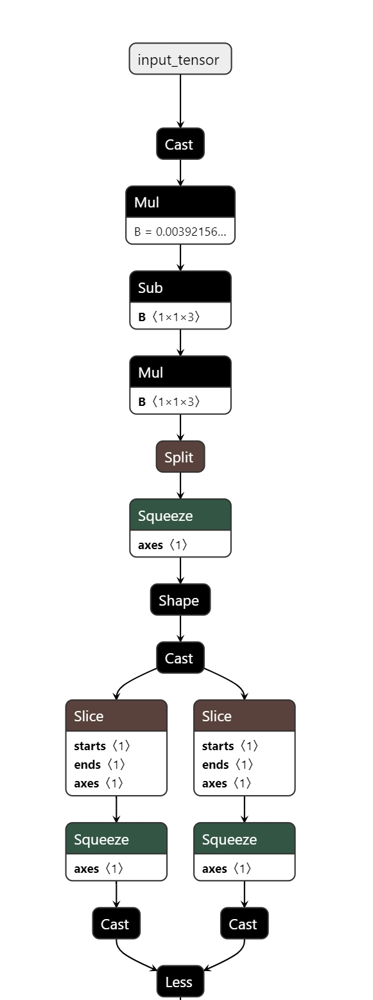
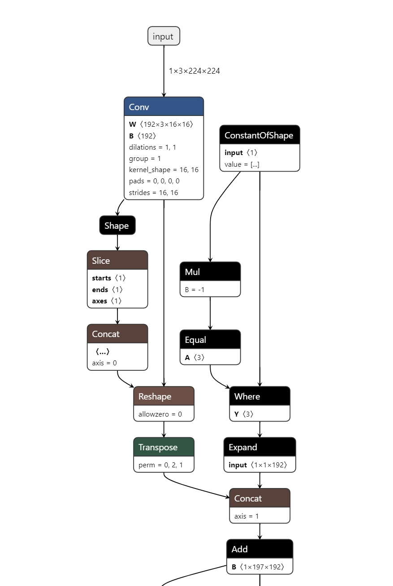

sidebar_position: 11

# 模型转换概述

为了更好的使用进迭时空ai工具，我们推荐您使用onnx模型。ONNX 全称为 Open Neural Network Exchange，是微软提出并推广的一种机器学习模型的开放格式表示。本文将展示将tensorflow以及pytorch模型转换成onnx模型。
模型转换仅支持在 **x86** 服务器上运行。

## 模型转换实例 (仅在x86平台上操作)

### tensorflow模型转onnx模型 (仅支持x86)

#### 软件准备

```bash
# 仅支持x86
sudo apt install python3-virtualenv

# 切换到home目录创建并激活python虚拟环境
cd ~/
virtualenv py3
source ~/py3/bin/activate

pip install numpy==1.26.4
pip install tensorflow
# 如果没有显卡，则安装tensorflow-cpu
# pip install tensorflow-cpu

pip install -U tf2onnx
```

#### 模型准备

```bash
wget http://download.tensorflow.org/models/object_detection/tf2/20200711/efficientdet_d0_coco17_tpu-32.tar.gz
tar zxvf efficientdet_d0_coco17_tpu-32.tar.gz 
```

#### 模型转换

```bash
python -m tf2onnx.convert --saved-model efficientdet_d0_coco17_tpu-32/saved_model/  --opset 13 --output efficientdet.onnx
```

等待上面模型转换的命令执行后之后，当前目录下将有一个 **efficientdet.onnx** 模型文件。
访问 [https://netron.app/](https://netron.app/) ，上传转换出来的模型文件，可以查看模型结构。
本模型转化后的结构显示如下
<center>
    
    <br>
    <div style="color:orange; border-bottom: 1px solid #d9d9d9;
    display: inline-block;
    color: #999;
    padding: 2px;"> 图 2.1 </div>
</center>

#### 模型验证

使用onnx.checker检查模型的有效性，确保模型符合ONNX标准。

```bash
# 安装onnx
# 仅支持x86
pip install onnx
```

运行下列python文件，无返回异常则表示模型转换正常。

```python
import onnx
model = onnx.load("efficientdet.onnx")
onnx.checker.check_model(model)
```

### pytorch模型转onnx模型 (仅支持x86)

#### 软件准备

```bash
# 仅支持x86
pip install torch
pip install timm
```

#### 量化文件准备

```python
import torch
import timm


# 创建预训练模型，会自动下载模型文件
model = timm.create_model('vit_tiny_patch16_224', pretrained=True)

dummy_input = torch.randn((1,3,224,224))
y = model(dummy_input)
torch.onnx.export(
    model,                                # model being run
    dummy_input,                          # model input (or a tuple for multiple inputs)
    "vit_tiny_patch16_224.onnx",          # where to save the model (can be a file or file-like object)
    input_names=['input'],                # the model's input names
    output_names=['output']
)      
```

运行上述python文件既可以完成模型转换，访问 [https://netron.app/](https://netron.app/) ，上传转换出来的模型文件，可以查看模型结构。
本模型转化后的结构显示如下

<center>
    
    <br>
    <div style="color:orange; border-bottom: 1px solid #d9d9d9;
    display: inline-block;
    color: #999;
    padding: 2px;"> 图 2.2 </div>
</center>

#### 模型验证

使用onnx.checker检查模型的有效性，确保模型符合ONNX标准。

```bash
# 仅支持x86
pip install onnx
```

运行下列python文件，无返回异常则转换正常。

```python
import onnx


model = onnx.load("vit_tiny_patch16_224.onnx") # vit_tiny_patch16_224.onnx 为上面转换出来的模型
onnx.checker.check_model(model)
```
