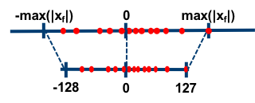
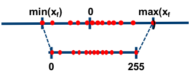
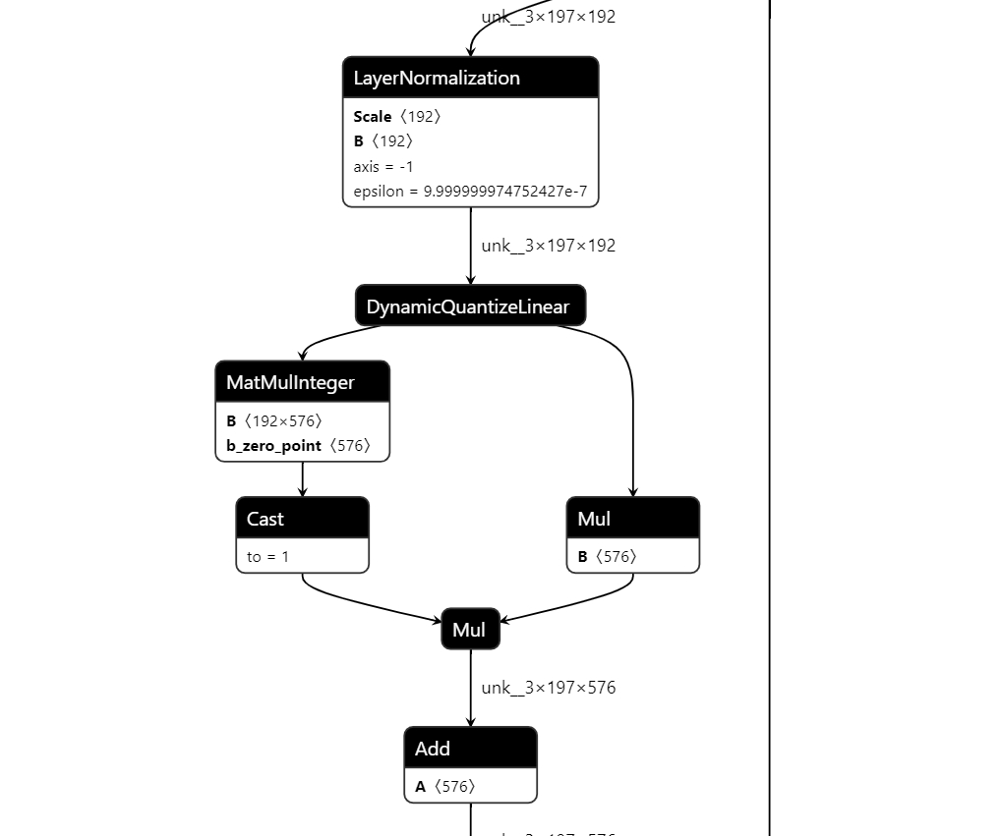

# 1. 模型量化介绍
  简而言之，所谓的模型量化就是将浮点存储（运算）转换为整型存储（运算）的一种模型压缩技术。简单来说，即原来表示一个权重需要使用float32表示，量化后只需要使用int8，int4等来表示就可以啦，仅仅这一个操作，我们就可以获得4倍甚至更多的网络加速。

# 2. 模型量化的原因
  随着深度学习技术在多个领域的快速应用，具体包括计算机视觉、自然语言处理、语音等，出现了大量的基于深度学习的网络模型。这些模型都有一个特点，即大而复杂、适合在gpu上面进行推理，并不适合应用在手机等嵌入式设备中，而通常需要将这些复杂的模型部署在一些低成本的嵌入式设备中，因而这就产生了一个矛盾。为了很好的解决这个矛盾，模型量化应运而生，它可以在损失少量精度的前提下对模型进行压缩，使得将这些复杂的模型应用到手机、机器人等嵌入式终端中变成了可能。

  随着模型预测越来越准确，网络越来越深，神经网络消耗的内存大小成为一个核心的问题，尤其是在移动设备上。通常情况下，目前的手机一般配备 4GB 内存来支持多个应用程序的同时运行，而三个模型运行一次通常就要占用1GB内存。

  模型大小不仅是内存容量问题，也是内存带宽问题。模型在每次预测时都会使用模型的权重，图像相关的应用程序通常需要实时处理数据，这意味着至少 30 FPS。因此，如果部署相对较小的 ResNet50 网络来分类，运行网络模型就需要 3GB/s 的内存带宽。网络运行时，内存，CPU 和电池会都在飞速消耗，我们无法为了让设备变得智能一点点就负担如此昂贵的代价。

# 3. 模型量化的动机
- 更少的存储开销和带宽需求

    使用更少的比特数存储数据，有效减少应用对存储资源的依赖。

- 更快的计算速度

    即对大多数处理器而言，整型运算的速度一般（但不总是）要比浮点运算更快一些；

- 更低的能耗与占用面积

- 尚可接受的精度损失。
    即量化相当于对模型权重引入噪声，所幸CNN本身对噪声不敏感（在模型训练过程中，模拟量化所引入的权重加噪还有利于防止过拟合），在合适的比特数下量化后的模型并不会带来很严重的精度损失。

# 4. 模型量化分类
根据映射函数是否是线性可以分为两类-即线性量化和非线性量化，本文主要研究的是线性量化技术。

## 4.1 线性量化
  常见的线性量化过程可以用以下数学表达式来表示

$ r = Round ⁡ ( S ( q − Z ) ) r=\operatorname{Round}(S(q-Z))r=Round(S(q−Z))$

其中，q 表示的是原始的float32数值；
Z表示的是float32数值的偏移量，在很多地方又叫Zero Point；
S表示的是float32的缩放因子，在很多地方又叫Scale；
Round(⋅) 表示的是四舍五入近似取整的数学函数，除了四舍五入，使用向上或者向下取整也是可以的；
r表示的是量化后的一个整数值。
根据参数 Z 是否为零可以将线性量化分为两类—即对称量化和非对称量化。

### 4.1.1 对称量化
<center>
    
    <br>
    <div style="color:orange; border-bottom: 1px solid #d9d9d9;
    display: inline-block;
    color: #999;
    padding: 2px;"> 图 4.1 </div>
</center>
  如上图所示，所谓的对称量化，即使用一个映射公式将输入数据映射到[-128,127]的范围内，图中-max(|Xf|)表示的是输入数据的最小值，max(|Xf|)表示输入数据的最大值。对称量化的一个核心即零点的处理，映射公式需要保证原始的输入数据中的零点通过映射公式后仍然对应[-128,127]区间的零点。总而言之，对称量化通过映射关系将输入数据映射在[-128,127]的范围内。

### 4.1.2 非对称量化
<center>
    
    <br>
    <div style="color:orange; border-bottom: 1px solid #d9d9d9;
    display: inline-block;
    color: #999;
    padding: 2px;"> 图 4.2 </div>
</center>
  如上图所示，所谓的非对称量化，即使用一个映射公式将输入数据映射到[0,255]的范围内，图中min(Xf)表示的是输入数据的最小值，max(Xf)表示输入数据的最大值。总而言之，对称量化通过映射关系将输入数据映射在[0,255]的范围内。

## 4.2 静态量化

静态量化是一种在模型训练后进行的量化方法，它不依赖于输入数据。在静态量化中，我们使用一组固定的缩放因子和偏移量来将模型的权重和激活值从浮点数转换为整数。

## 4.3 动态量化
与静态量化不同，动态量化是在模型运行时进行的，它依赖于输入数据。在动态量化中，我们使用输入数据的统计信息来动态计算缩放因子和偏移量，并将模型的权重和激活值从浮点数转换为整数。

# 5. 模型量化实践
量化的过程仅支持在 **x86** 服务器上进行，使用量化xquant工具，可以将数据类型为float32的原始模型转换为int8数据类型量化模型。量化得到的模型在k1上推理部署可以获得数倍的加速收益。

## 5.1 软件准备
```bash
# 仅支持x86
sudo apt install python3-virtualenv

# 切换到home目录创建并激活python虚拟环境
cd ~/
virtualenv py3
source ~/py3/bin/activate

pip install numpy==1.26.4
pip install torch
pip install timm
pip install onnxruntime==1.20.0
pip install pandas
pip install opencv-python
pip install xquant --index-url https://git.spacemit.com/api/v4/projects/33/packages/pypi/simple
```

## 5.2 模型准备 (仅支持x86平台)
运行下面的python文件生成 vit_tiny_patch16_224.onnx 模型
```python
import torch
import timm


# 创建预训练模型，会自动下载模型文件
model = timm.create_model('vit_tiny_patch16_224', pretrained=True)

dummy_input = torch.randn((1,3,224,224))
y=model(dummy_input)
torch.onnx.export(
    model,                                # model being run
    dummy_input,                          # model input (or a tuple for multiple inputs)
    "vit_tiny_patch16_224.onnx",          # where to save the model (can be a file or file-like object)
    input_names = ['input'],              # the model's input names
    output_names = ['output']
)   
```

准备配置文件vit.json ，onnx_model 改为具体的需要量化的onnx模型文件路径
```json
{
    "model_parameters": {
        "onnx_model": "./vit_tiny_patch16_224.onnx",
        "working_dir": "./temp"
    },
    "quantization_parameters": {
        "analysis_enable": true, 
        "precision_level": 3
    }
	
}
```


## 5.3 量化 (仅支持x86平台)
```bash
python -m xquant --config ./vit.json
```

在/temp目录下即可获得动态量化后的vit模型 vit_tiny_patch16_224.q.onnx
访问 [https://netron.app/](https://netron.app/) ，上传量化后的模型文件，可以查看模型量化后的结构。

<center>
    
    <br>
    <div style="color:orange; border-bottom: 1px solid #d9d9d9;
    display: inline-block;
    color: #999;
    padding: 2px;"> 图 5.1 </div>
</center>