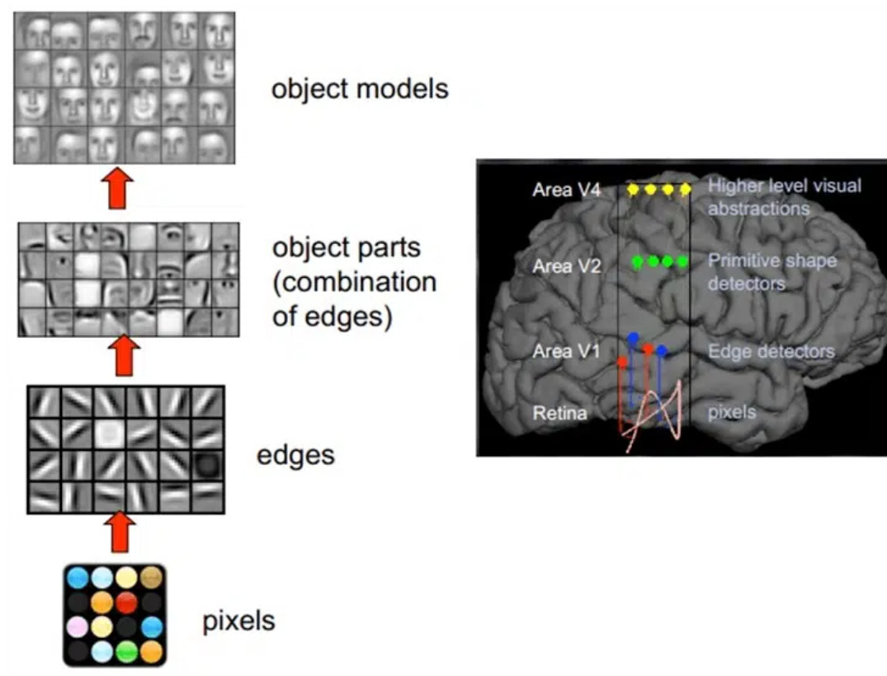
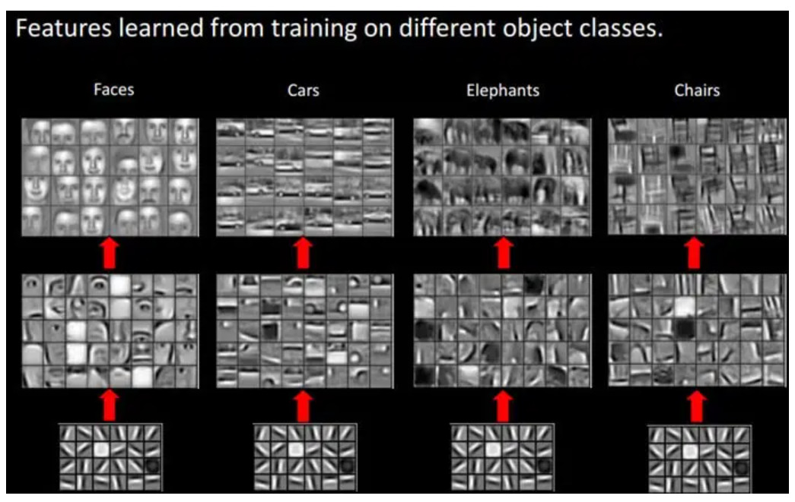
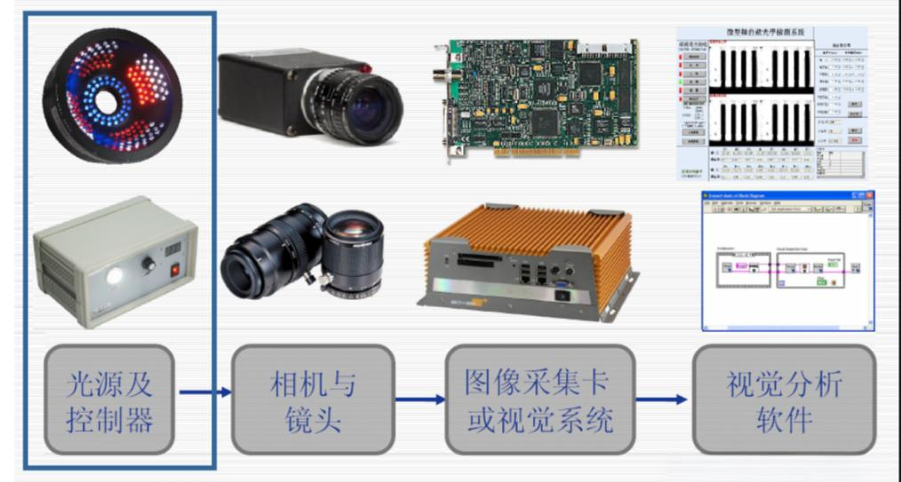
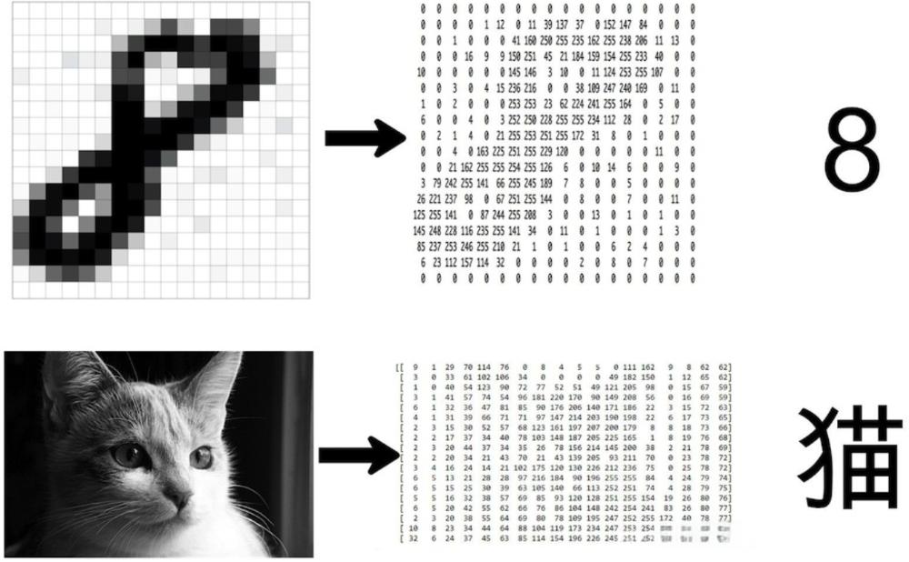
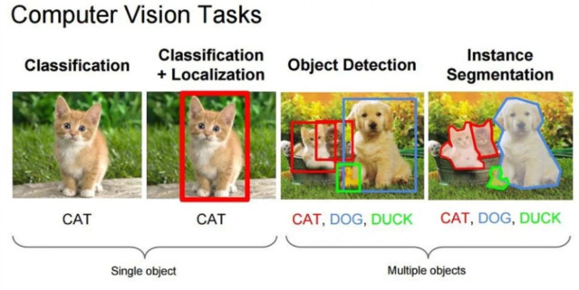

sidebar_position: 13

# 计算机视觉介绍

## 人类视觉原理

人类的视觉原理如下：从原始信号摄入开始（瞳孔摄入像素 Pixels），接着做初步处理（大脑皮层某些细胞发现边缘和方向），然后抽象（大脑判定，眼前的物体的形状，是圆形的），然后进一步抽象（大脑进一步判定该物体是只气球）。下面是人脑进行人脸识别的一个示例：

    
     
    
 图1.1 人类识别人脸原理 

对于不同的物体，人类视觉也是通过这样逐层分级，来进行认知的：

    
     
    
 图1.2 人类识别不同物体 

我们可以观察到，在网络的最底层，提取出的特征基本上是相似的基础元素，例如各种边缘和纹理。随着层次的加深，网络逐渐捕捉到更加特定和复杂的局部特征，如轮子、眼睛、躯干等物体组成部分。到达最高层时，这些不同的高级特征被综合起来，形成对整个图像的理解，从而使得网络能够像人类一样准确地区分不同的物体。

## 计算机视觉

计算机视觉是一门研究如何使计算机通过模拟人类视觉系统来感知和理解图像和视频中信息的学科。

### 机器视觉系统组成

机器视觉系统一般由相机**、**镜头**、**光源及控制器**、**图像采集卡、计算机 (或嵌入式图像处理系统)**、**图像处理与分析软件**、**输入与输出控制**、**执行控制与机构等部分组成来分别完成图像的获取、图像的处理和分析、输出或显示.常见的机器视觉系统如下图所示。

    
     
    
 图2.1 机器视觉系统组成 

### 计算机视觉原理

图像在计算机中的表示如下图所示。

    
     
    
 图2.2 计算机"眼"中的图片 

在上图中我们可以看到，计算机"眼"中的图片不过是一堆数字组成的矩阵罢了。细心的同学会发现矩阵中的每个元素都是介于0-255之间的整数。对于上图所示的黑白图像，由于只有明暗的区别，因此只需要一个数字就可以表示不同的灰度。一般在图像中我们使用0表示最暗的黑色，255表示最亮的白色。因此，矩阵中的每一个元素都对应着一个介于0到255之间的整数，用以精确描述图像中每个像素的灰度值。

### 计算机视觉任务

计算机视觉任务是指利用计算机技术和算法来解析和理解**图像或视频内容**的各种工作。一般计算机视觉任务包括图像分类，目标检测，人脸识别，语义分割，姿态估计等。

    
     
    
 图2.3 计算机视觉任务 

### Opencv

OpenCV（Open Source Computer Vision Library）是一个开源的计算机视觉和机器学习软件库，由英特尔公司发起并得到社区的广泛支持。它提供了一个跨平台的编程框架，用于实时的计算机视觉应用开发。

#### OpenCV的主要特点包括

1. **跨平台**：可以在Windows、Linux、Mac OS X和Android等操作系统上运行。
2. **多种编程语言支持**：主要使用C++编写，但也提供了Python、Java和其他语言的接口。
3. **广泛的功能**：包括但不限于图像处理、视频分析、特征检测、人脸识别、机器学习、深度学习等。
4. **高性能**：优化的算法实现，支持多核处理和GPU加速。
5. **社区支持**：拥有活跃的开发者社区，不断更新和维护库的功能。
6. **文档和教程**：提供详细的API文档和大量的教程，方便学习和使用。

#### OpenCV的应用领域

- **图像处理**：图像滤波、变换、色彩空间转换等。
- **视频分析**：视频稳定、背景减除、目标跟踪等。
- **特征检测和描述**：角点检测、特征点匹配、描述子提取等。
- **3D视觉**：立体视觉、3D重建、点云处理等。
- **机器学习**：支持SVM、决策树、随机森林等多种机器学习算法。
- **深度学习**：集成了如Caffe、TensorFlow、PyTorch等深度学习框架的接口。
- **实时应用**：实时视频处理、交互式媒体、增强现实等。
