# 1. 神经网络与全连接层

 神经网络(Neural Networks,NN)是一种模仿人脑神经结构的机器学习技术，旨在实现类似人类的智能行为。人脑中的神经网络极为复杂，据估计，成年人的大脑中包含约1000亿个神经元。

    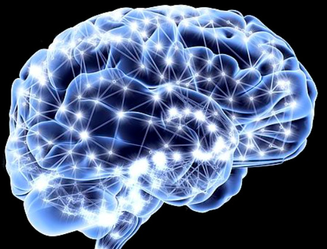
     
    
 图1.1 人脑神经结构 

 仿照人脑的结构，我们抽象出一个简单的神经网络结构，蓝色表示输入层，黑色表示**隐藏层**，绿色表示输出层。圆圈代表"神经元"，连接线代表“神经元”之间的连接，每个连接线对应一个不同的**权重**（其值称为**权值**），这是需要训练得到的，图中每个神经元都与下一层的所有神经元相连。

    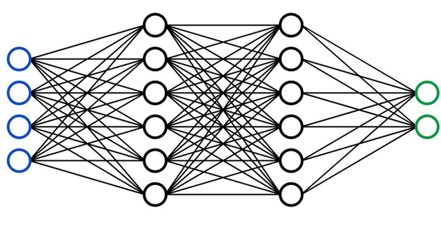
     
    
 图1.2 神经网络结构 

拆解神经网络结构的一块来分析计算过程，输入层里神经元只负责传输数据，隐藏层和输出层需要对前一层的输入进行计算并保存结果，之后这个结果会变成下一层的输入，依次计算，最后从输出层输出。非线性函数用于拟合更复杂的场景，否则我们的神经网络将仅能处理线性关系。

    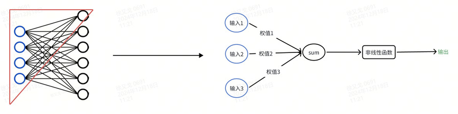
     
    
 图1.3 神经网络拆解 

 如何简单理解神经网络的过程呢？看看下图你就明白了。

    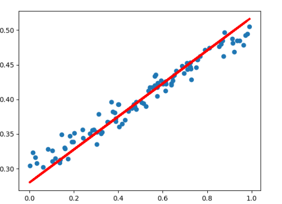
     
    
 图1.4 神经网络拟合 

 我们把输入当成是x，权值为w，整个网络其实就是拟合f(x) = wx + b的一个过程，图中的红色线可以理解为一个神经网络。

 在图1.2中，我们看到神经元被分散展示，但实际上它们是按层组织的。每一层中的神经元依次排列，形成了清晰的层次结构。在神经网络架构中，**全连接层（Fully Connected Layer, FC）**是非常重要的组成部分。在全连接层中，每个神经元与前一层的所有神经元相连，并且每条连接都有一个对应的权值。 

 下图中圈出的部分展示了典型的全连接层结构：每个神经元接收来自前一层所有神经元的输入，并通过学习到的权值对这些输入进行加权求和，进而产生该层的输出。

    
     
    
 图1.5 全连接层 

## 全连接层的作用:

​	  在全连接层中，每个神经元与前一层的所有输入节点均建立连接，这意味着每个神经元都能够接收到输入层的全部信息。通过这种方式，全连接层能够整合来自所有神经元的数据，从而对特征进行高度综合性的概括。因此，全连接层具备强大的特征提取和总结能力。

# 2. 卷积神经网络与卷积层

卷积神经网络(Convolutional Neural Networks，CNN)设计灵感最初来自于对人类及动物视觉系统的模拟研究。1962年Hubel和Wiesel通过对猫视觉皮层细胞的研究，提出了感受野（Receptive Fields）的概念，之后慢慢就有了卷积神经网络的出现。

感受野的基本概念指的是感觉系统中任何一个神经元所响应的输入区域，即该神经元所受特定感官信息影响的范围。以视觉为例，可以简单地理解为眼睛中的感光细胞所覆盖的视野区域，以及这一区域内的图像信息如何被传递并处理成大脑能够解析的信号。换句话说，感受野定义了某一神经元对视觉场景中特定部分的响应范围，即眼睛所见并反馈给大脑的信息区域。

例如，在下图中，我们首先映入眼帘的是整张图片，这构成了我们对整个图像的全局感受野；随后，当您的视线聚焦于红框内突出显示的小猫头部时，这就体现了您对图像局部的感受野。通过这一局部区域的感受野所捕捉到的特征，经过大脑的分析处理，我们能够识别出图像中的主体是一只猫。

    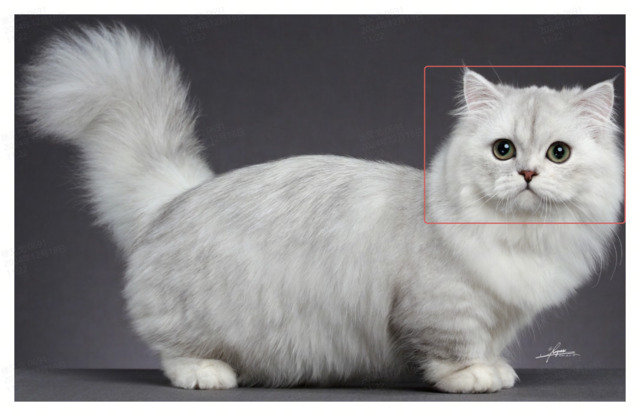
     
    
 图2.1 真实图片感受野 

卷积神经网络（CNN）跟神经网络非常相似，主要区别在于层的结构和计算的方式，卷积神经网络通常由卷积层、池化层和全连接层组成，而神经网络一般只有全连接层。

卷积神经网络的末端会根据具体任务的需求连接相应的输出层，例如，使用softmax函数进行多类分类任务，或采用其他适合的函数来完成回归、检测等不同类型的预测任务。这样设计的网络结构能够有效地从输入数据中提取特征，并对这些特征进行高效的处理与分析，以实现精准的任务目标。下面是一个经典的CNN分类网络vgg16的结构图(每个立方体代表网络中的一层)：

    
     
    
 图2.2 vgg16网络结构 

计算方式的主要差异体现在卷积层中，这里的计算过程具体实现了感受野的概念。卷积层通过应用滤波器（或称卷积核）在输入数据上滑动，并与对应的区域进行元素级别的乘加运算，以此模拟神经元的感受野，捕捉输入数据中的局部特征。这种方式使得网络能够专注于输入的特定部分，有效地提取空间层次上的特征信息。下图是卷积计算的过程:

    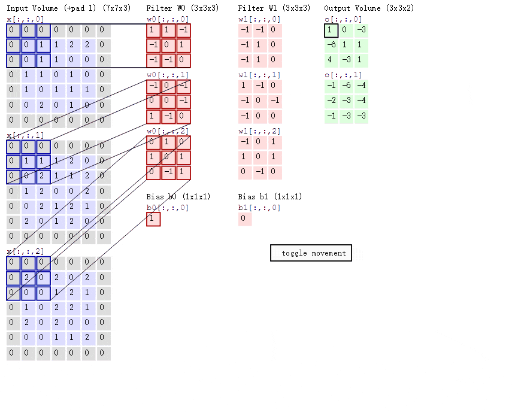
     
    
 图2.3 卷积计算过程 

池化是缩小高、长方向上的空间的运算。池化层的主要作用是对输入的特征图进行压缩，一方面使特征图变小，简化网络计算复杂度；一方面进行特征压缩，提取主要特征。

    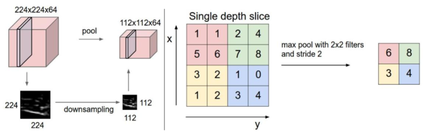
     
    
 图2.4 池化层 

​							

卷积计算的过程可以简单地理解为：我们使用训练好的特征提取器（即权值或filter）在原始图像上滑动，逐步提取所需的信息和特征。这一过程非常类似于使用一个特制的筛子来筛选和保留我们感兴趣的内容。通过这种方式，网络能够捕捉到图像中的关键特征，为后续的分析和识别任务做好准备。

更形象地说，就像用一个精心设计的漏斗过滤沙砾以寻找珍贵的宝石一样，卷积神经网络利用其学习到的特征提取器在图像数据中“筛选”，从而提取出对于特定任务至关重要的特征信息。

    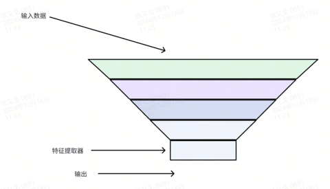
     
    
 图2.5 特征提取器 

    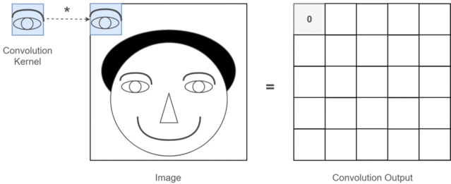
     
    
 图2.6 特征提取过程 

再看下真实图片经过卷积的输出：

    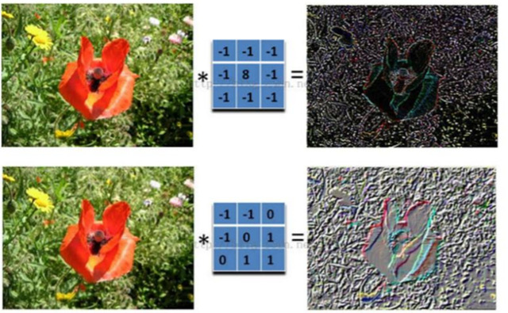
     
    
 图2.7 真实图片的卷积结果 

## 卷积层的作用

卷积层通过应用多个小型滤波器（或称卷积核）在输入数据（如图像）上滑动，并与对应的区域进行元素级别的乘加运算，来捕捉输入中的局部特征。每个滤波器学习到特定类型的特征，例如边缘、纹理或形状等。卷积层对比全连接层减少了需要的参数数量，所有位置都使用相同的滤波器参数。

卷积层加全连层的组合结果:

    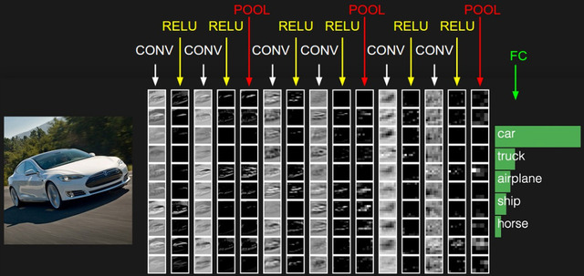
     
    
 图2.8 卷积层+全连接层 

​						