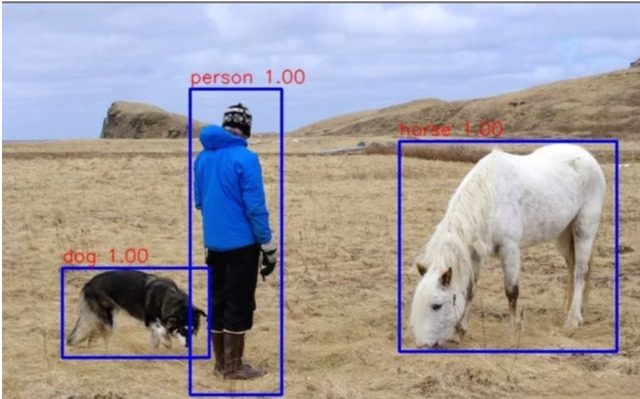
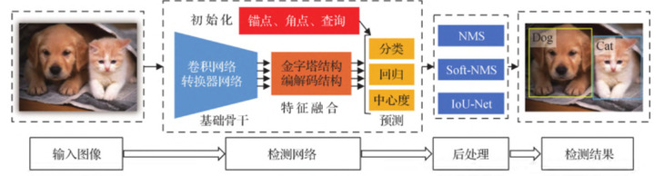
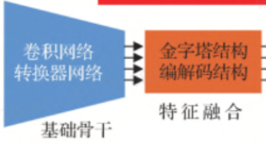
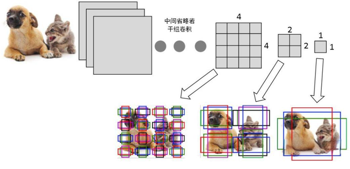
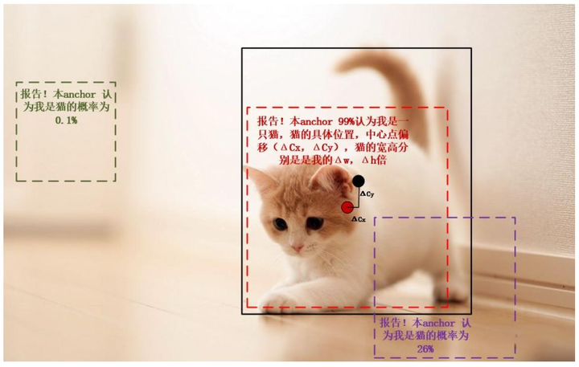
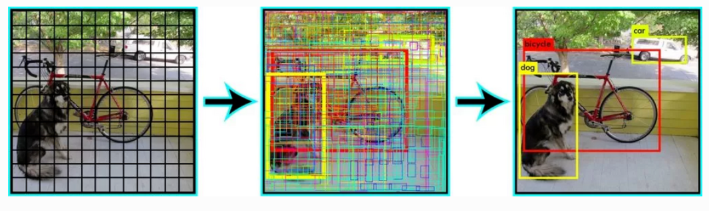
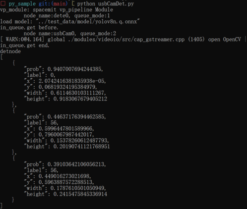

# 1. 目标检测任务

 目标检测是计算机视觉领域的一个基本任务，旨在从图像或视频中检测出某一类语义对象的实例，并同时确定它们的位置。

<center>
    
    <br>
    <div style="color:orange; border-bottom: 1px solid #d9d9d9;
    display: inline-block;
    color: #999;
    padding: 2px;"> 图1.1 目标检测任务 </div>
</center>


## 1.1. 目标检测整体流程：

<center>
    
    <br>
    <div style="color:orange; border-bottom: 1px solid #d9d9d9;
    display: inline-block;
    color: #999;
    padding: 2px;"> 图1.1.1 目标检测推理流程 </div>
</center>


 **输入图像：**输入图像时一般我们需要对图像做预处理，一般包括letterbox，图像大小resize，图像格式转换，像素值归一化 ，图像通道转换等过程。这些预处理步骤是训练过程中用于提升模型效果的重要手段。为了确保推理阶段的一致性和准确性，同样需要对输入图像执行相同的预处理操作。这不仅有助于维持模型的表现，还能确保推理结果与训练期间所学的内容相一致。

 **检测网络：**检测网络一般可以简单描述为2个过程特征提取+检测(Detect)。

​	            特征提取网络普遍采用卷积层作为核心构建模块。下面的基础骨干网络和特征融合网络均通过精心设计的卷积模块组合而成，其目的在于高效、精准地提取目标特征。

<center>
    
    <br>
    <div style="color:orange; border-bottom: 1px solid #d9d9d9;
    display: inline-block;
    color: #999;
    padding: 2px;"> 图1.1.2 特征提取网络 </div>
</center>


​                   检测(Detect)这个部分主要是有2个过程，获取类别以及得到检测框坐标。Detect层的做法也很多，这里也只是介绍基于anchor的其中一种做法。

​                   基于anchor(锚框)的来获取检测框的。什么是anchor？就是我们在特征图或者原图上预设的一组或多组检测框。

<center>
    
    <br>
    <div style="color:orange; border-bottom: 1px solid #d9d9d9;
    display: inline-block;
    color: #999;
    padding: 2px;"> 图1.1.3 anchor是什么 </div>
</center>


​		 借助预定义的锚框（anchor），我们可以更快速且更精确地计算出真实的检测框。通过识别哪些锚框与实际物体相匹配，并对这些锚框进行调整，我们不仅能够定位含有物体的区域，还能高效地确定每个检测到的物体所属的分类。

​                 下图中虚线框为预设的anchor，实线框为真实框，(ΔCx,ΔCy)是anchor框到真实框的中心点距离，高宽分别为Δw倍，Δh倍，目标检测网络的任务之一就是预测这一中心点的位移。训练目标检测网络，我们的目标是使网络预测的位移值与实际的中心点位移之间的误差最小化。确定有物体的anchor框后，我们anchor框对应的特征信息去计算分类函数(softmax,交叉熵)我们就可以得到检测物体的具体类别了。

<center>
    
    <br>
    <div style="color:orange; border-bottom: 1px solid #d9d9d9;
    display: inline-block;
    color: #999;
    padding: 2px;"> 图1.1.4 anchor的作用 </div>
</center>


 **后处理：**通常情况下，我们不能直接使用检测网络输出的结果，而是需要经过一系列的后处理步骤来确保结果的准确性和可用性。这些后处理步骤主要包括去除重复的检测框和将检测框的坐标进行适当的转换。在检测阶段会产生很多大小不一、类别概率不同的但包含同一物体的检测框，我们需要通过nms算法来筛除掉类别概率低的重复检测框。检测框的坐标转换是由于检测网络出来的结果通常是(中心点坐标，宽，高)的形式，我们需要转换到(检测框左上角坐标，检测框右下角坐标)再乘以缩放系数还原到原图上真实的坐标值。

<center>
    
    <br>
    <div style="color:orange; border-bottom: 1px solid #d9d9d9;
    display: inline-block;
    color: #999;
    padding: 2px;"> 图1.1.5 检测框去重 </div>
</center>


 **检测结果：**后处理的结果就能直接使用了，一般会用opencv的接口来完成在图像或者视频上画框。


## 2. 目标检测实例

#### 2.1. 相关代码：

```python
import time 
import py_node_cfg
import vp_module as vp
from usbCamNode import UsbCamNode
from detectNode import DetectNode

# 创建目标检测node，设置node号和模型路径。
detectnode = DetectNode("dete0", "../test_data/model/yolov8n.q.onnx") 
# 创建摄像头node
usbcamnode = UsbCamNode("usbCam0")

# 关联检测node和摄像头
detectnode.attach_to([usbcamnode])

# 检测开始
usbcamnode.start()
try:
    wait = input()
except KeyboardInterrupt:
    wait = None
    
# 检测结束
usbcamnode.stop_cap()
usbcamnode.detach_recursively()
time.sleep(1)


```

#### 2.2. 执行流程
软件包下载：
[video_demo.zip](code/video_demo.zip)

```shell
unzip video_demo.zip
cd video_demo/15_usbCamDet
export LD_LIBRARY_PATH=./libs:../third_party/engine/lib:../third_party/mipi_cam/lib:$LD_LIBRARY_PATH
python usbCamDet.py
```

#### 2.3. 执行结果

<center>
    
    <br>
    <div style="color:orange; border-bottom: 1px solid #d9d9d9;
    display: inline-block;
    color: #999;
    padding: 2px;"> 图2.3 目标检测代码正确执行结果 </div>
</center>

