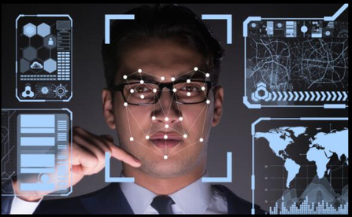
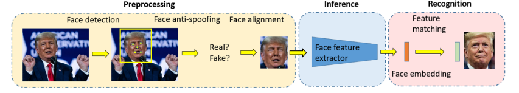
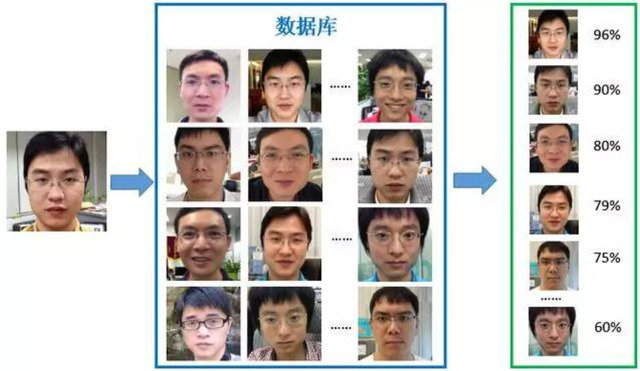
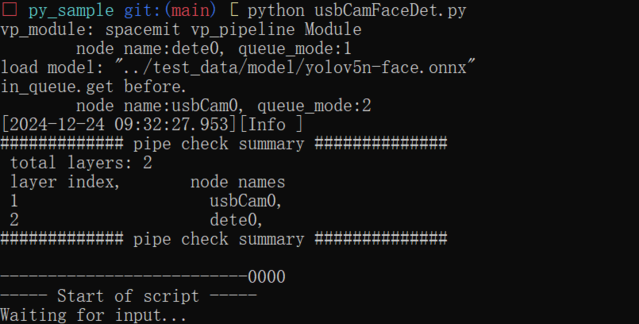

# 人脸识别简介和实例

## 1. 人脸识别任务

 人脸识别算法是一种利用人脸特征信息进行身份识别的技术。在固定场景中，例如门禁系统和闸机应用，单一人脸识别算法即可高效准确地确认个人身份。然而，在更为复杂或动态的环境中，为了提高识别的精度和可靠性，通常需要结合目标检测、人脸对齐等多种辅助算法来综合判断场景中个体的身份。

<center>
    
    <br>
    <div style="color:orange; border-bottom: 1px solid #d9d9d9;
    display: inline-block;
    color: #999;
    padding: 2px;"> 图1 人脸识别任务 </div>
</center>

### 1.1. 人脸识别整体流程

<center>
    
    <br>
    <div style="color:orange; border-bottom: 1px solid #d9d9d9;
    display: inline-block;
    color: #999;
    padding: 2px;"> 图1.1.1 人脸识别流程 </div>
</center>

 **预处理(Preprocessing)**：预处理在闸机和一些简单场景只需要做活体检测(Face anti-spoofing)和人脸对齐(Face alignment）; 复杂场景下需要先做人脸检测，将人脸正确框出来后再做后续处理。人脸检测的方法一般使用目标检测算法完成。

<center>
    
    <br>
    <div style="color:orange; border-bottom: 1px solid #d9d9d9;
    display: inline-block;
    color: #999;
    padding: 2px;"> 图1.1.2 活体检测 </div>
</center>

<center>
    
    <br>
    <div style="color:orange; border-bottom: 1px solid #d9d9d9;
    display: inline-block;
    color: #999;
    padding: 2px;"> 图1.1.3 人脸对齐 </div>
</center>

 **推理(Inference)：**推理预处理后的人脸送入深度学习网络中做特征提取和总结。特征提取与总结通常采用卷积神经网络（CNN）结合全连接层（FC）的结构。训练好这一网络模型后，我们首先利用该网络建立一个人脸数据库。具体步骤是将待检测的人脸图像通过网络处理，获取每个人脸对应的特征向量（特征值），随后将这些特征向量与相应的人名关联起来，存储到人脸库中。

 **识别（Recognition)：**识别的过程就是把从深度学习网络提取总结的特征与人脸数据库的特征做对比。在实际应用中，当需要识别某个人的身份时，系统会将捕获的人脸图像输入到训练好的神经网络中，提取其特征向量。随后，该特征向量将与人脸数据库中的记录逐一比对，采用常见的距离度量函数，如欧式距离或余弦相似度等**。**通过比较，找到最匹配的特征向量，从而确定该人脸的具体身份。

<center>
    
    <br>
    <div style="color:orange; border-bottom: 1px solid #d9d9d9;
    display: inline-block;
    color: #999;
    padding: 2px;"> 图1.1.4 人脸比对 </div>
</center>

## 2. 人脸识别实例

### 2.1. 相关代码

```python
import time 
import py_node_cfg
import vp_module as vp
from usbCamNode import UsbCamNode
from facdetNode import FaceDetNode

# 创建人脸识别node,设置node号和模型路径
facedetnode = FaceDetNode("dete0", "../test_data/model/yolov5n-face.onnx")
# 创建摄像头node
usbcamnode = UsbCamNode("usbCam0")

# 关联人脸识别node和摄像头node
facedetnode.attach_to([usbcamnode])

board = vp.vp_analysis_board([usbcamnode])
board.display(1,False)

# 人脸识别开始
usbcamnode.start()
print("--------------------------0000")
print("----- Start of script -----")

try:
    print("Waiting for input...")
    wait = input()
    print(f"User input: {wait!r}")
except KeyboardInterrupt:
    print("Caught KeyboardInterrupt!")
    wait = None

print("----- End of script -----")

print("file_node_smaple exit0...")
# 人脸识别结束
usbcamnode.stop_cap()
print("--------------------------111")
usbcamnode.detach_recursively()
print("file_node_smaple exit1...")
```

### 2.2. 执行流程

软件包下载：
[video_demo.zip](#)

```shell
unzip video_demo.zip
cd video_demo/16_usbCamFaceDet
export LD_LIBRARY_PATH=./libs:../third_party/engine/lib:../third_party/mipi_cam/lib:$LD_LIBRARY_PATH
python usbCamFaceDet.py
```

### 2.3. 执行结果

<center>
    
    <br>
    <div style="color:orange; border-bottom: 1px solid #d9d9d9;
    display: inline-block;
    color: #999;
    padding: 2px;"> 图2.3 人脸识别代码正确执行结果 </div>
</center>
