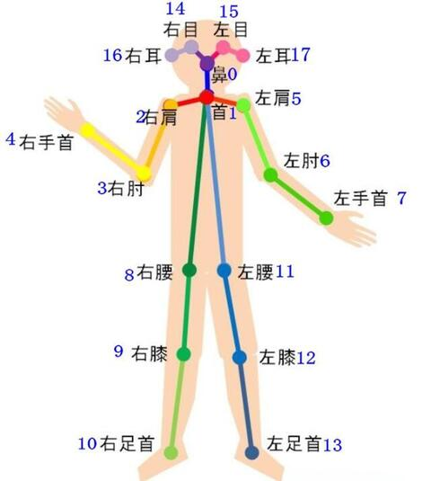
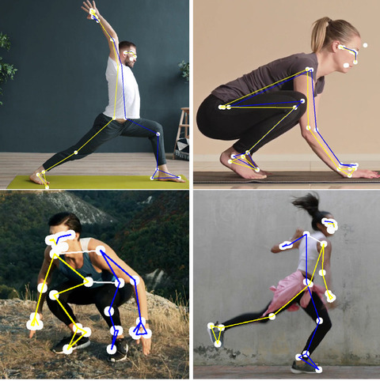
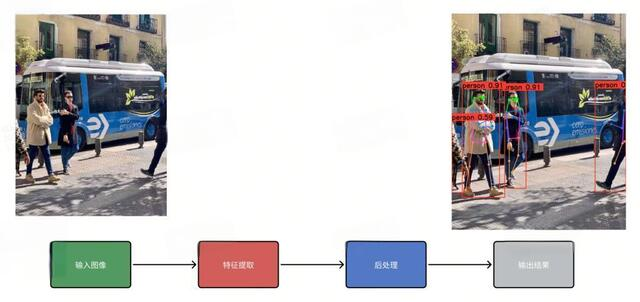
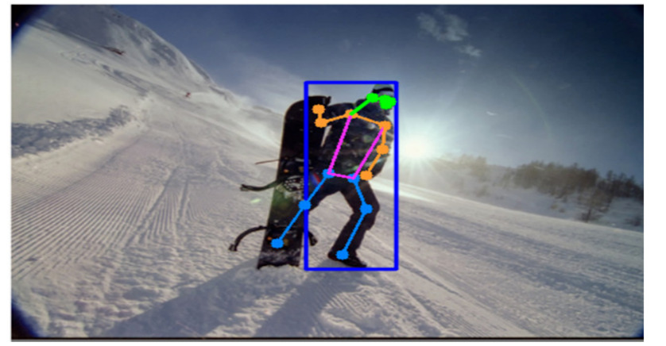
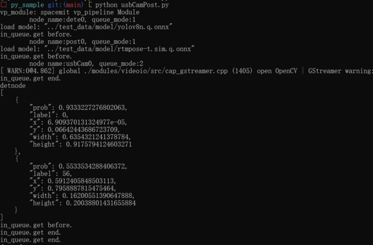

# 姿态识别简介和实例

## 1. 姿态识别任务(姿态估计)

  姿态识别通过计算机视觉技术识别和理解人体的姿态和动作，利用摄像头或传感器捕获的图像或视频数据，分析人体的关键点（如关节、头部等）和骨架信息，进而推断出人体的姿态和动作。一般是对图中17个关键点做检测。

<center>
    
    <br>
    <div style="color:orange; border-bottom: 1px solid #d9d9d9;
    display: inline-block;
    color: #999;
    padding: 2px;"> 图1.1 人体关键点 </div>
</center>

<center>
    
    <br>
    <div style="color:orange; border-bottom: 1px solid #d9d9d9;
    display: inline-block;
    color: #999;
    padding: 2px;"> 图1.2 用关键点来做人体姿态估计 </div>
</center>

### 1.1 姿态识别整体流程

<center>
    
    <br>
    <div style="color:orange; border-bottom: 1px solid #d9d9d9;
    display: inline-block;
    color: #999;
    padding: 2px;"> 图1.1.1 姿态整体流程 </div>
</center>

**输入图像**： 输入图像时一般我们需要对图像做预处理，一般包括letterbox，图像格式转换，像素值归一化 ，图像通道转换等过程。 这些预处理步骤是训练过程中用于提升模型效果的重要手段。因此，推理过程需要保持相同的操作以保证推理结果与训练期间所学的内容相一致。

**特征提取**： 特征提取还是采用卷积层作为核心构建模块，用不同的模块来构建特征提取器。

​检测框预测是目标检测中的方法。

​关键点预测任务专注于检测特定类别的对象，例如人体。对于每个人体实例，模型需要识别17个关节点，每个关节点由其位置（x, y坐标）和置信度（conf）来确定，即 {x, y, conf}。我们用锚框来预测这些关键点。因此，对于每一个锚框（anchor），它将关联到17个关节点，总共51个元素（每个关节点3个元素：x, y 和 conf）。(anchor的概念可以看看目标检测中的相关介绍)

**后处理**：后处理需要将检测框的坐标从(中心点坐标，宽，高)转换到(检测框左上角坐标，检测框右下角坐标)，在通过nms算法除去重复框。预测的关键点我们需要保留conf大于0.5的关键点,低于 0.5 的关键点我们认为它被遮挡或者不在图像上。最后需要把检测框坐标、预测关键点乘以缩放系数还原到原图上的真实坐标值。

**输出结果** 后处理结果可以直接使用，一般使用opencv中的接口来完成画框和关键点连线的功能。

<center>
    
    <br>
    <div style="color:orange; border-bottom: 1px solid #d9d9d9;
    display: inline-block;
    color: #999;
    padding: 2px;"> 图1.1.2 画框和关键点 </div>
</center>

## 2. 姿态识别实例

### 2.1. 相关代码

```python
import time 
import py_node_cfg
import vp_module as vp
from usbCamNode import UsbCamNode
from detectNode import DetectNode
from rtmpostNode import RTMPostNode

# 创建目标检测node,设置node号和模型路径
detectnode = DetectNode("dete0", "../test_data/model/yolov8n.q.onnx")
# 创建姿态识别node,设置node号和模型路径
postnode = RTMPostNode("post0", "../test_data/model/rtmpose-t.sim.q.onnx")
# 创建摄像头node
usbcamnode = UsbCamNode("usbCam0")

# 关联目标检测node和摄像头node
detectnode.attach_to([usbcamnode])
# 关联目标检测node和姿态识别node
postnode.attach_to([detectnode])

# 姿态识别开始
usbcamnode.start()

try:
    wait = input()
except KeyboardInterrupt:
    wait = None

# 姿态识别结束
usbcamnode.stop_cap()
usbcamnode.detach_recursively()
time.sleep(1)
```

### 2.2. 执行流程

软件包下载：
[video_demo.zip](code/video_demo.zip)

```shell
unzip video_demo.zip
cd video_demo/17_usbCamPost
export LD_LIBRARY_PATH=./libs:../third_party/engine/lib:../third_party/mipi_cam/lib:$LD_LIBRARY_PATH
python usbCamPost.py
```

### 2.3. 执行结果:

<center>
    
    <br>
    <div style="color:orange; border-bottom: 1px solid #d9d9d9;
    display: inline-block;
    color: #999;
    padding: 2px;"> 图2.3 姿态识别代码正确执行结果 </div>
</center>
