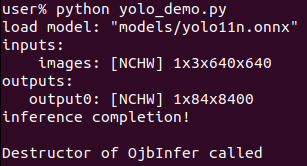
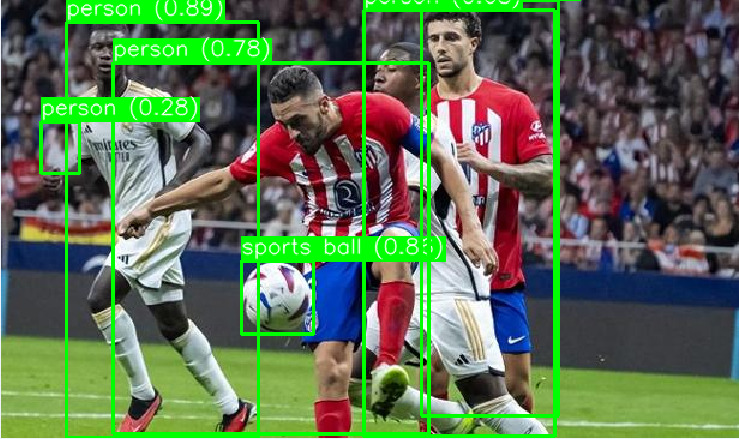
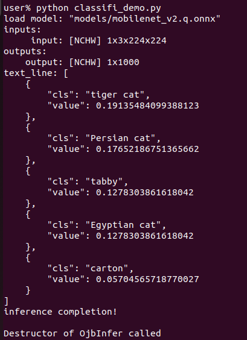
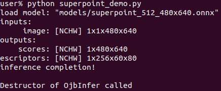
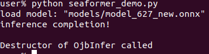
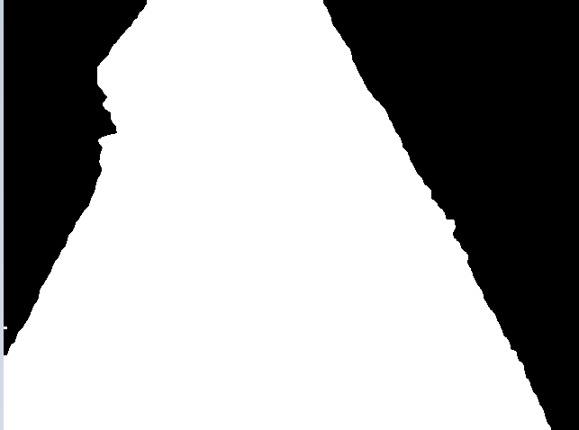
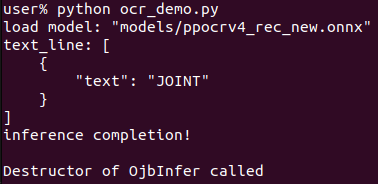

sidebar_position: 18

# 计算机视觉实验

## 1. 实验环境搭建

### 1.1 软件包下载

[vision_experiment.tar.gz](code/vision_experiment.tar.gz)

### 1.2 安装依赖

```shell
tar xzvf vision_experiment
cd vision_experiment
sudo apt update && sudo apt upgrade -y
sudo apt install libopencv-dev
sudo apt-get install -y python3-opencv autoconf automake libopenblas-dev curl k1x-vpu-firmware mpp ffmpeg jupyter-notebook jupyter portaudio19-dev python3-pyaudio
```

## 2. 计算机视觉实验

### 2.1 目标检测实验

目标检测实验使用的是yolov11模型，是最新的yolo系列的模型。

#### 2.1.1 相关代码

```python
import py_dep_cfg
import yolov8 as yolo
import cv2
import json

# 设置模型路径
infer = yolo.create_infer('models/yolo11n.onnx',"onnx")
# 设置图片路径
image  =  cv2.imread("test_data/default_yolo_1.1f868dbe.png")

labels = []

with open("yolo_label.txt", 'r') as file:
    for line in file:
        label = line.strip()
        labels.append(label)

objects = infer.commit(image).get()

# 后处理
for Box in objects:
    objects_dict = json.loads(Box.json_info.text)
    for bbox_info in objects_dict:
        prob = bbox_info['prob']
        label = labels[bbox_info['label']]
        x, y, width, height = bbox_info['x'], bbox_info['y'], bbox_info['width'], bbox_info['height']

        left = int(x * image.shape[1])
        top = int(y * image.shape[0])
        right = int((x + width) * image.shape[1])
        bottom = int((y + height) * image.shape[0])

        cv2.rectangle(image, (left, top), (right, bottom), (0,255,0), 2)

        label_text = f'{label} ({prob:.2f})'

        (text_width, text_height), baseline = cv2.getTextSize(label_text, cv2.FONT_HERSHEY_SIMPLEX, 0.6, 1)

        cv2.rectangle(image, (left, top - text_height - baseline), (left + text_width, top), (0,255,0), -1)

        cv2.putText(image, label_text, (left, top - baseline), cv2.FONT_HERSHEY_SIMPLEX, 0.6, (255, 255, 255), 1, cv2.LINE_AA)

# 保存结果
cv2.imwrite("yolo_result.png",image)
print ("inference completion!\n")
                         
```

#### 2.1.2  执行流程

```shell
python yolo_demo.py
```
<center>
    
    <br>
    <div style="color:orange; border-bottom: 1px solid #d9d9d9;
    display: inline-block;
    color: #999;
    padding: 2px;"> 图 2.1.2.1 目标检测正确执行结果 </div>
</center>

结果保存为yolo_result.png。

<center>
    
    <br>
    <div style="color:orange; border-bottom: 1px solid #d9d9d9;
    display: inline-block;
    color: #999;
    padding: 2px;"> 图 2.1.2.2 目标检测正确执行结果 </div>
</center>

### 2.2 图像分类实验

图像分类使用的是mobilenetv2模型，是非常经典的移动端卷积类模型。

#### 2.2.1 相关代码

```python
import py_dep_cfg
import Classifi as cls
import cv2

# 设置模型路径
infer = cls.create_infer('models/mobilenet_v2.q.onnx',"onnx")
# 设置图像路径
image  =  cv2.imread("test_data/cat_224x224.jpg")

image = cv2.resize(image,(224,224))
objects = infer.commit(image).get()

for text in objects:
    print("text_line:", text.text)

print("inference completion!\n")
```

#### 2.2.2  执行流程

```shell
$ python classifi_demo.py
```

<center>
    
    <br>
    <div style="color:orange; border-bottom: 1px solid #d9d9d9;
    display: inline-block;
    color: #999;
    padding: 2px;"> 图 2.2.2 图像分类正确执行结果</div>
</center>

分类结果如图所示，cls为类别，value为概率。

### 2.3 关键点实验

关键点使用的是superpoint模型，是一个资源需求小，又有不错效果的关键点模型。

#### 2.3.1 相关代码

```python
import py_dep_cfg
import ObjectSuperpoint as Superpoint
import cv2
import json

# 设置图片路径
image_path = "test_data/default_superpoint_2.930391fa.png"
# 设置模型路径
infer = Superpoint.create_infer('models/superpoint_512_480x640.onnx')
image_gray  =  cv2.imread(image_path,0)
image  =  cv2.imread(image_path)

objects = infer.commit(image_gray).get()

for obj in objects:
    obj_dict = json.loads(obj.json)
    for item in obj_dict:
         x = int(image.shape[1]*item['x'])
         y = int(image.shape[0]*item['y'])
         cv2.circle(image, (x, y), 1, (0, 0, 255), thickness=4)


cv2.imwrite("superpoint_result.png", image)
print("inference completion!\n")
```

#### 2.3.2  执行流程

```shell
python superpoint_demo.py
```

<center>
    
    <br>
    <div style="color:orange; border-bottom: 1px solid #d9d9d9;
    display: inline-block;
    color: #999;
    padding: 2px;"> 图 2.3.2.1 关键点正确执行结果</div>
</center>

结果保存为superpoint_result.png。

<center>
    
    <br>
    <div style="color:orange; border-bottom: 1px solid #d9d9d9;
    display: inline-block;
    color: #999;
    padding: 2px;"> 图2.3.2.2 superpoint_result.png</div>
</center>

### 2.4 图像分割实验

图像分割使用的是seaformer模型，是一个参数比较小，效果比较好的分割模型。

#### 2.4.1 相关代码

```python
import py_dep_cfg
import  ObjectMask as mask
import cv2

# 设置模型路径
infer = mask.create_infer('models/model_627_new.onnx')
# 设置图像路径
image = cv2.imread('test_data/camera0_185836_0130.jpg')

objects = infer.commit(image).get()
for idx, obj in enumerate(objects):
    cv2.imwrite(f"py_mask_{idx}.bmp",obj.data)

print ("inference completion!\n")                                                                           
```

#### 2.4.2 执行流程

```shell
python seaformer_demo.py
```

<center>
    
    <br>
    <div style="color:orange; border-bottom: 1px solid #d9d9d9;
    display: inline-block;
    color: #999;
    padding: 2px;"> 图2.4.2.1 图像分割正确执行结果</div>
</center>

结果保存为py_mask_{idx}.bmp

<center>
    
    <br>
    <div style="color:orange; border-bottom: 1px solid #d9d9d9;
    display: inline-block;
    color: #999;
    padding: 2px;"> 图2.4.2.2 py_mask_0.bmp</div>
</center>

### 2.5 手写字体识别实验

手写字体使用是的PPOCR模型，是一个非常受欢迎的手写字体模型。

#### 2.5.1 相关代码

```python
import py_dep_cfg
import PPOCRRec as ocr
import cv2

infer = ocr.create_infer('models/ppocrv4_rec_new.onnx')
image = cv2.imread('test_data/default_ocr_1.e360298e.png')

objects = infer.commit(image).get()
for text_line in objects:
    print("text_line:", text_line.json)

print ("inference completion!\n")                                                   
```

#### 2.5.2 执行流程

```shell
python ocr_demo.py
```

<center>
    
    <br>
    <div style="color:orange; border-bottom: 1px solid #d9d9d9;
    display: inline-block;
    color: #999;
    padding: 2px;"> 图2.5.2 手写字体识别正确执行结果</div>
</center>

结果在终端显示,结果为“text”后面的字段。