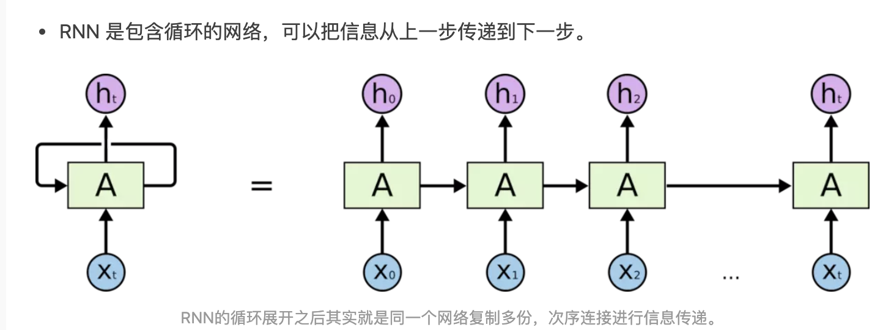
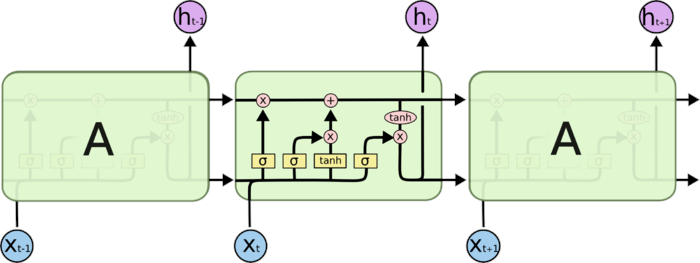
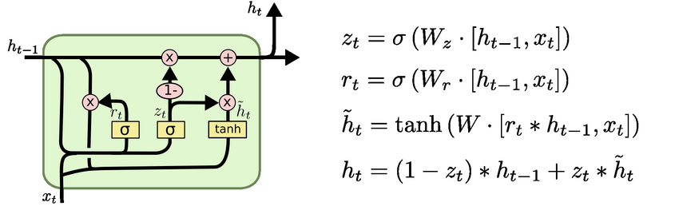
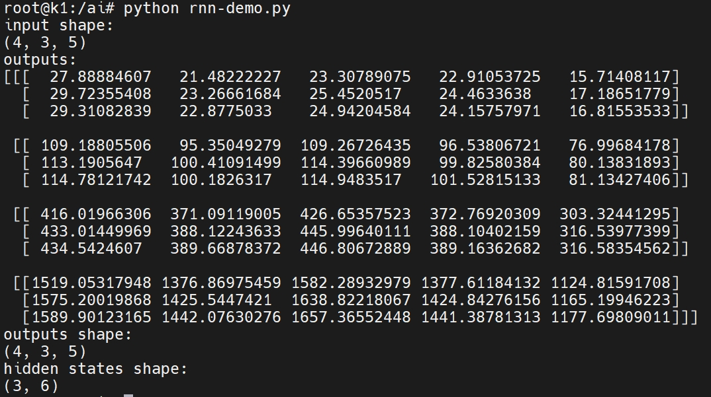

# 1. 循环神经网络介绍
## 1.1 循环神经网络概念
循环神经网络 (RNN) 是一种深度神经网络，基于顺序或时间序列数据进行训练，以创建机器学习模型，可以根据序列输入做出序列预测或结论。
## 1.2 循环神经网络的工作原理
与前馈和卷积神经网络 (CNN) 一样，循环神经网络利用训练数据进行学习。区别在于它们的“记忆”，因为它们从先前的输入中获取信息，用于影响当前的输入和输出。传统的深度神经网络假设输入和输出相互独立，而循环神经网络的输出则取决于序列中的先验元素。虽然未来的事件也有助于确定给定序列的输出，但单向递归神经网络无法在其预测中解释这些事件。

我们用一个俗语来辅助解释 RNN，例如 “feeling under the weather” 通常用来形容某人生病了。为了赋予这个俗语意义，需要以特定的顺序来进行表达。因此，循环网络需要考虑俗语中每个单词的位置，并利用这些信息来预测序列中的下一个单词。
<center>
    
    <br>
    <div style="color:orange; border-bottom: 1px solid #d9d9d9;
    display: inline-block;
    color: #999;
    padding: 2px;"> 图 1.1 </div>
</center>
循环网络的另一个显著特征是它们在网络的每一层共享参数。前馈网络在每个节点上具有不同的权重，而循环神经网络在网络的每一层内共享相同的权重参数。也就是说，这些权重仍然在反向传播和梯度下降过程中进行调整，以促进强化学习。

在此过程中，RNN 往往会遇到两个问题，称为梯度爆炸和梯度消失。这些问题由梯度的大小决定，梯度是沿误差曲线的损失函数的斜率。当梯度过小时，它会继续变小，更新权重参数，直到它们变得微不足道，即零 (0)。出现这种情况时，算法将不再学习。梯度爆炸：梯度太大时会发生这种情况，并创建不稳定的模型。这种情况下，模型权重会变得过大，最终表示为 NaN。针对此类问题的一种解决方案是减少神经网络中的隐藏层数量，从而消除 RNN 模型中的复杂性。

# 2. 循环神经网络的分类
## 2.1 LSTM模型
LSTM通过引入门控机制，能够更好地控制梯度的流动，从而避免了梯度消失和梯度爆炸的问题。因此，LSTM在处理长期依赖关系的序列数据时表现出色。
<center>
    
    <br>
    <div style="color:orange; border-bottom: 1px solid #d9d9d9;
    display: inline-block;
    color: #999;
    padding: 2px;"> 图 2.1 </div>
</center>
在LSTM中，每个单元包含了三个门（输入门、遗忘门和输出门），它们能够控制哪些信息可以通过，哪些信息需要被忽略。LSTM通过这些门控制信息的流动，从而能够更好地处理长期依赖关系，避免了RNN中的梯度消失或爆炸的问题。因此，LSTM被广泛应用于序列数据的建模和分析中。可以将LSTM比喻为一个有记忆功能的人，他可以根据之前的经验和现在的情况来做决策。而传统的RNN则类似于一个只能记住当前状态的人，无法很好地处理长期依赖关系。

## 2.2 GRU模型
GRU(Gated recurrent unit)是RNN中的一种门机制单元，与LSTM类似，GRU有一个遗忘门（forget gate），但其没有输出门（output gate）。GRU在音乐模型、语音信号模型和NLP模型中的性能与LSTM类似，而且在一些小样本数据集表现出更有的性能。
<center>
    
    <br>
    <div style="color:orange; border-bottom: 1px solid #d9d9d9;
    display: inline-block;
    color: #999;
    padding: 2px;"> 图 2.2 </div>
</center>

# 3. 循环神经网络实例

本实例使用numpy构建了一个rnn神经网络以及输入矩阵，并模拟了RNN网络的运作流程。运行该实例，可以打印输入矩阵的尺寸，输出矩阵的结果和尺寸以及中间状态的尺寸。

## 3.1 依赖安装

```bash
sudo apt install python3-numpy
```

## 3.2 文件准备

下载[rnn-demo.py](code/19_rnnDemo/rnn-demo.py)文件

## 3.3 运行demo
使用以下命令运行rnn demo文件
```bash
python rnn-demo.py
```
结果应如下图所示：
<center>
    
    <br>
    <div style="color:orange; border-bottom: 1px solid #d9d9d9;
    display: inline-block;
    color: #999;
    padding: 2px;"> 图 3.1 </div>
</center>