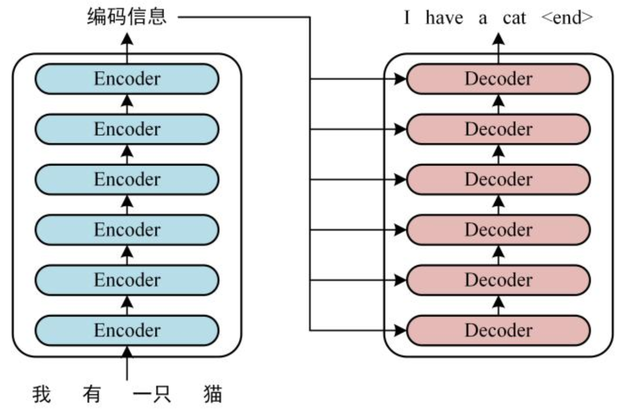
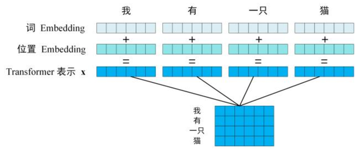
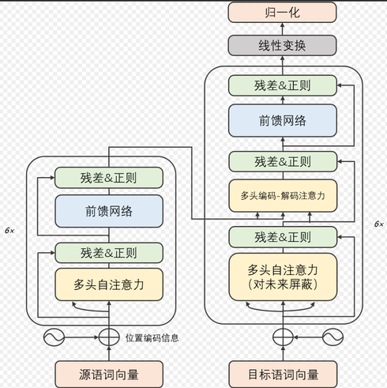
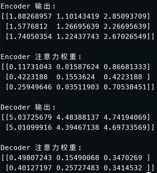

# 1. Transformer简介

Transformer 是一种基于注意力机制（Attention）的深度学习模型架构，最初由 Vaswani 等人在 2017 年的论文《Attention Is All You Need》中提出。Transformer 在自然语言处理（NLP）领域不可或缺，并成为当前最流行的架构之一，广泛应用于文本生成、机器翻译、语音识别等任务。

# 2. Transformer核心概念

在理解Transformer结构之前先来理解一下Transformer最核心的两个概念。

## 2.1 **注意力机制（Attention）**

人类在读句子时，会根据上下文判断哪些词更重要。例如：

* **句子** ：我喜欢吃苹果，因为它很甜。
* 你看到“它”时会自然联想到“苹果”。

Transformer 模型用“注意力”机制模仿这种能力：

* 它会关注句子里哪些词对当前的词更重要。

## 2.2 **编码器（Encoder）和解码器（Decoder）**

* **编码器** ：像“翻译家”，把输入（比如一句话）转化成计算机能理解的表示。
* **解码器** ：像“翻译家助手”，根据这些表示生成输出（比如翻译后的句子）。

## 2.3 Query（Q）、Key（K） 和 Value（V）

在 **Transformer 模型**中， **Query**  **（Q）** 、**Key（K）** 和 **Value（V）** 是注意力机制（Attention Mechanism）的核心组件。

**Query**  **（Q，查询）** ：

* 表示模型的“当前关注点”。
* 在具体实现中，Query 矩阵表示“当前单词想要从整个句子中获取的信息”。
* 比如，当处理单词 “apple” 时，Query 可能表示“需要找到这个词相关的描述，比如它的颜色或用途”。

**Key（K，键）** ：

* 表示整个句子的上下文信息。
* Key 是一个“索引”，它帮助模型判断 Query 是否应该关注某个单词。
* 比如，Key 矩阵可能会描述句子中其他单词的语义信息。

**Value（V，值）** ：

* 包含实际的信息内容。
* 当 Query 和 Key 确定关注某个单词时，从 Value 中提取该单词的具体信息。
* 比如，Value 可能会存储单词的含义或上下文特征。

**通俗来说：**

* Query 是你提出的问题。
* Key 是数据库中的问题索引。
* Value 是数据库中的答案内容。

# 3. Transformer结构

Transformer由Encoder和Decoder两个部分组成，每个部分都包含6个block：

<center>
    
    <br>
    <div style="color:orange; border-bottom: 1px solid #d9d9d9;
    display: inline-block;
    color: #999;
    padding: 2px;"> 图 2.1 </div>
</center>

由于Transformer采用的是 **自注意力机制** ，自注意力机制在计算时不考虑输入序列的顺序，而是将整个序列平等地进行处理，依靠相对关系计算注意力权重。这样虽然提高了并行性，但丢失了序列信息，所以需要显示地添加位置信息，因此他的输入由词嵌入和位置嵌入两个部分组成。

<center>
    
    <br>
    <div style="color:orange; border-bottom: 1px solid #d9d9d9;
    display: inline-block;
    color: #999;
    padding: 2px;"> 图 2.2 </div>
</center>

**词嵌入**是将单词转换为固定维度的向量表示。词嵌入捕捉了单词的语义信息，使得语义相似的单词在向量空间中距离较近。通过词嵌入，Transformer 把单词从原始的“高维离散表示”转化为“较低维、连续的表示”，形成了每个单词的语义表示。

**位置嵌入**则为每个单词编码位置信息，通过将不同的位置信息加入词嵌入，使得模型能够理解词序。例如，"我爱你"与"你爱我"具有不同的含义，位置嵌入帮助 Transformer 识别出这种区别。位置嵌入一般使用**正弦和余弦函数**来生成位置嵌入，这样每个位置的编码都具有唯一性，同时还能够通过函数周期性捕捉位置信息，便于模型识别序列中词的位置关系。

**通俗来说：** 输入序列在被**词嵌入**转换成向量，句中向量在高维会有一定的权重，比如有一只猫坐在席子上，猫和席子在高维空间的权重比较接近，猫会更关注席子，这个是通过自注意力机制实现的，然后经过**位置嵌入**的编码以后，模型会知道这些词语的具体位置在哪里谁在谁的前面（如果是问答模型，会根据相关的文本来生成上下文），在编码器这边输出位置向量。

图 2.3是自注意力机制，左边的是Encoder右边则是Decoder：

<center>
    
    <br>
    <div style="color:orange; border-bottom: 1px solid #d9d9d9;
    display: inline-block;
    color: #999;
    padding: 2px;"> 图 2.3 </div>
</center>

图中的残差主要作用是为了防止网络退化（就是不会随着推理的进行而导致模型的准确率下降）；正则化是一种防止过拟合的技术，通过在损失函数中添加额外的惩罚项，鼓励模型训练过程中选择更简单、更通用的参，从而提高模型对新数据的泛化能力。过拟合则是指模型在训练的过程中表现很好，甚至误差很低，但是在测试集或者新数据集中的表现能力很差。

**Mask** （掩码）即对未来的屏蔽，是一种用于隐藏特定数据或阻止不必要计算的技术。**Mask 的作用**主要在于控制信息流动，使模型在计算时只处理有效数据，同时避免无关或错误信息的干扰。

模型在输出的时候会根据输入序列的向量和相关文本（知识库、文档、数据库检索）进行预测，在推理的过程中，会有一个mask的机制将答案（模型训练的数据）掩盖（训练完成以后，模型会知道这些词语的相关性），然后根据上下文来进行下一个单词的预测。

线性变换和归一化两层之前的Decoder主要作用是处理输入的上下文、提取语义信息、理解上下文中的各个单词之间的关系，假设这个表示的维度是512。在线性变换层会将向量映射到词汇表，假设模型的词汇表的大小为10000，也就意味着这10000个单词都有可能作为下一个输出。线性层将解码器输出的 512 维向量映射到 10,000 维向量，每个值表示一个词汇表中单词的“得分”。假如线性层输出的 10,000 维向量可能是这样的：

| on    | 5.1              |
| ------- | ------------------ |
| in    | 3.1              |
| under | 1.8              |
| above | 2.5              |
| ……  | other              |

模型就会认为on的作为一个比较合理的候选词。

线性层输出的向量本质上是“得分”或“未归一化概率”，这些值并不是真正的概率。Softmax层（归一化）则会将这些得分转化为概率，Softmax 会让得分最大的单词的概率最大，同时确保所有单词的概率之和为 1，然后推理生成下一个词。

# 4. Transformer代码示例

按住键盘ctrl+alt+t打开终端，然后输入sudo apt install python3-numpy -y

<center>
    
    <br>
    <div style="color:orange; border-bottom: 1px solid #d9d9d9;
    display: inline-block;
    color: #999;
    padding: 2px;"> 图 4.1 </div>
</center>

再输入vim test.py，将下面的代码复制，将输入法改为英文，然后在终端点击键盘i键进入编辑模式，然后按住ctrl+shift+v粘贴代码，然后按住shift+:，输入wq保存。然后在终端输入python test.py即可运行代码。

```
import numpy as np

# 定义 Softmax 函数
def softmax(x):
    exp_x = np.exp(x - np.max(x))  # 防止溢出
    return exp_x / exp_x.sum(axis=-1, keepdims=True)

# 定义注意力机制
def attention(query, key, value):
    scores = query @ key.T  # 计算点积注意力分数
    weights = softmax(scores)  # 归一化分数为概率分布
    output = weights @ value  # 加权求和值
    return output, weights

# 定义一个简单的 Encoder
def encoder(inputs, weight_query, weight_key, weight_value):
    query = inputs @ weight_query.T
    key = inputs @ weight_key.T
    value = inputs @ weight_value.T
    encoded_output, attention_weights = attention(query, key, value)
    return encoded_output, attention_weights

# 定义一个简单的 Decoder
def decoder(targets, encoder_output, weight_query, weight_key, weight_value):
    query = targets @ weight_query.T
    key = encoder_output @ weight_key.T  # 使用 Encoder 的输出作为 Key
    value = encoder_output @ weight_value.T  # 使用 Encoder 的输出作为 Value
    decoded_output, attention_weights = attention(query, key, value)
    return decoded_output, attention_weights

# 模拟输入数据
inputs = np.array([
    [1, 0, 1],  # 输入句子的第一个词
    [0, 1, 0],  # 输入句子的第二个词
    [1, 1, 0],  # 输入句子的第三个词
])
targets = np.array([
    [0, 1, 1],  # 目标句子的第一个词
    [1, 0, 0],  # 目标句子的第二个词
])

# 初始化权重矩阵（Query, Key, Value）
weight_query = np.array([[1, 0, 1], [0, 1, 0], [1, 1, 1]])
weight_key = np.array([[1, 1, 0], [0, 1, 1], [1, 0, 0]])
weight_value = np.array([[0, 2, 1], [1, 0, 1], [2, 1, 0]])

# Encoder 过程
encoder_output, encoder_attention_weights = encoder(inputs, weight_query, weight_key, weight_value)

# Decoder 过程
decoder_output, decoder_attention_weights = decoder(targets, encoder_output, weight_query, weight_key, weight_value)

# 打印结果
print("Encoder 输出:")
print(encoder_output)
print("\nEncoder 注意力权重:")
print(encoder_attention_weights)
print("\nDecoder 输出:")
print(decoder_output)
print("\nDecoder 注意力权重:")
print(decoder_attention_weights)
```
最终得到的输出是:

<center>
    
    <br>
    <div style="color:orange; border-bottom: 1px solid #d9d9d9;
    display: inline-block;
    color: #999;
    padding: 2px;"> 图 4.2 </div>
</center>

这个代码模拟Transformer架构的编解码以及自注意力机制的过程。
