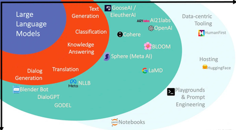
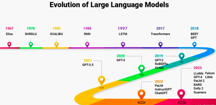
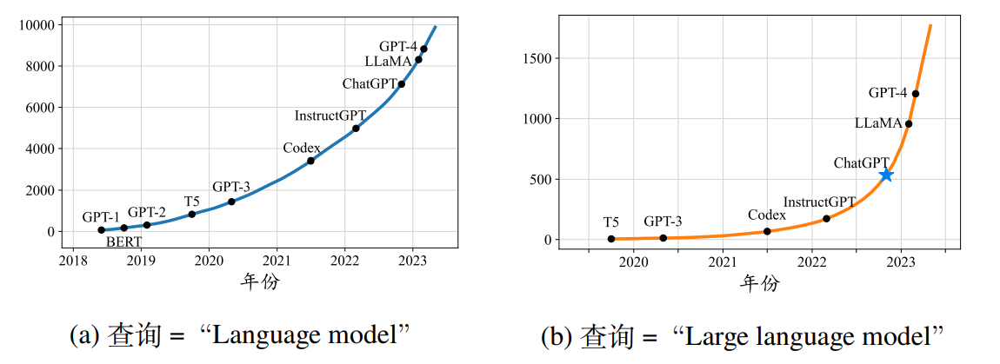
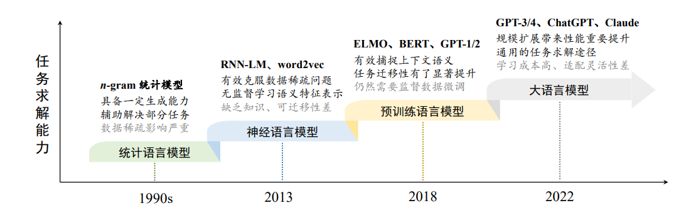

sidebar_position: 22

# 1. 大模型简介

大模型（Large Model）是指具有大量参数和复杂结构的机器学习模型，能够处理海量数据并执行复杂任务，如自然语言处理、计算机视觉和语音识别等。这些模型通常基于深度学习技术，特别是以Transformer为代表的架构。通过在大规模数据集上进行训练，大模型可以捕捉数据中的复杂模式和关系，展现出强大的泛化能力。

近年来，随着计算资源的提升和数据的丰富，大模型在各个领域取得了突破性进展。例如，OpenAI的GPT系列模型从GPT-1的1.17亿参数发展到GPT-3的1750亿参数，其在语言理解和文本生成等任务上的能力显著增强。

<center>
    
    <br>
    <div style="color:orange; border-bottom: 1px solid #d9d9d9;
    display: inline-block;
    color: #999;
    padding: 2px;"> 图 1.1 </div>
</center>

# 2. 语言模型的发展历程

一般来说，语言模型旨在对于人类语言的内在规律进行建模，从而准确预测词序列中未来（或缺失）词或词元（Token）的概率。根据所采用技术方法的不同，针对语言模型的研究工作可以分为以下四个主要发展阶段：

<center>
    
    <br>
    <div style="color:orange; border-bottom: 1px solid #d9d9d9;
    display: inline-block;
    color: #999;
    padding: 2px;"> 图 2.1 </div>
</center>

## 2.1 统计语言模型（StatisticalLanguageModel,SLM）

20世纪90年代兴起的统计语言模型基于马尔可夫假设，通过固定长度的上下文（如𝑛元模型）预测下一个词的概率，被广泛应用于信息检索和自然语言处理。高阶模型随着𝑛的增加面临“维数灾难”，需采用平滑策略（如回退估计和古德-图灵估计）缓解数据稀疏问题。然而，这些方法在高阶语义关系建模上仍显不足，限制了复杂语言序列的表达能力。

## 2.2 神经语言模型（NeuralLanguageModel,NLM）

神经语言模型通过神经网络（如 RNN）建模文本生成，其中灵奖获得者 Yoshua Bengio 提出了分布式词表示（Distributed Word Representation）的概念，使用低维稠密向量替代稀疏的 One-Hot 表示。稠密向量能刻画丰富的隐含语义特征，有效解决统计语言模型的数据稀疏问题，被称为“词嵌入”（Word Embedding）。word2vec 是其代表模型，通过浅层神经网络学习词嵌入，广泛应用于自然语言处理任务中，显著提升了性能。这些研究推动了语言模型从简单的词序列建模向通用文本表示学习的发展，对 NLP 领域影响深远。

<center>
    
    <br>
    <div style="color:orange; border-bottom: 1px solid #d9d9d9;
    display: inline-block;
    color: #999;
    padding: 2px;"> 图 2.2 </div>
</center>

## 2.3 预训练语言模型（Pre-trainedLanguageModel,PLM）

与早期词嵌入模型相比，预训练语言模型在训练架构和数据上进行了创新。ELMo 使用双向 LSTM（biLSTM）从无标注数据中学习上下文感知的词表示，并支持通过微调优化特定任务。然而，传统序列神经网络在长文本建模和并行训练上存在局限性，影响了性能。

Transformer 模型在 2017 年由谷歌提出，其基于自注意力机制设计，适合长序列建模并支持高效的 GPU/TPU 加速。基于此架构，BERT 采用仅编码器设计，通过预训练任务学习双向语言模型，适用于自然语言理解任务；而 GPT-1 使用仅解码器架构，通过下一个词预测完成预训练，更适合自然语言生成任务。

以 ELMo、BERT 和 GPT-1 为代表的模型确立了“预训练-微调”范式：预训练阶段利用无标注数据建立基础语言能力，微调阶段通过有标注数据适配特定任务，大幅提升了自然语言处理的效果。

## 2.4 大语言模型（LargeLanguageModel,LLM）

研究发现，通过扩大模型参数或数据规模（“扩展法则”），可以提升模型在下游任务中的性能。例如，GPT-3（175B参数）和 PaLM（540B参数）展示了小模型（如 BERT-330M、GPT-2-1.5B）无法实现的能力。GPT-3 能通过“上下文学习”（ICL）利用少样本数据解决任务，而 GPT-2 不具备这一能力。这表明扩展模型规模可以带来性能极限的突破。

<center>
    
    <br>
    <div style="color:orange; border-bottom: 1px solid #d9d9d9;
    display: inline-block;
    color: #999;
    padding: 2px;"> 图 2.3 </div>
</center>

大语言模型（LLM）因具备小模型无法实现的“涌现能力”而得名，其代表性应用 ChatGPT 通过将 GPT 系列适配到对话任务，展现了卓越的人机对话能力，并引发社会和学术界的广泛关注。自 ChatGPT 发布以来，与大语言模型相关的研究迅速增长（如图 2.2 所示）。

回顾语言模型的发展历程，早期模型聚焦于自然语言的建模和生成任务，而最新模型（如 GPT-4）更侧重于复杂任务的求解。这标志着语言模型从简单建模到任务求解的一次重要跃升，是理解其前沿进展的关键所在（图 2.3）。

# 3. 大模型常见专业术语

**Transformer** 是大模型核心架构，包括  **Encoder** （编码器）和  **Decoder** （解码器），依赖 **自注意力机制（Self-Attention）** 和 **多头注意力（Multi-Head Attention）** 实现上下文建模。模型训练中涉及 **预训练（Pre-training）** 和  **微调（Fine-tuning）** ，通过 掩码语言建模（MLM） 或 因果语言建模（CLM） 学习语言表示。**分词（Tokenization）** 将文本转化为  **Token** ，结合 **嵌入（Embedding）** 进入模型。

## 3.1 模型结构相关

Transformer、Encoder、Decoder等，详情请转到Transformer简介.

## 3.2 预训练与微调相关

### **Pre-training（预训练）**
> 在大规模无监督数据集上训练模型，学习通用语言表示。

### **Fine-tuning（微调）**
> 在特定任务上用标注数据对预训练模型进行进一步训练。

---

## 3.3 模型优化相关

### **Tokenization（分词）**
> 将文本拆分成小单元（如单词、子词或字符）。

- **常见方法**：
  - **WordPiece**：BERT 使用的子词分词算法。
  - **Byte Pair Encoding (BPE)**：GPT 使用的分词方法。

### **Vocabulary（词汇表）**
> 模型训练时使用的词汇集合。

### **Embedding（嵌入）**
> 将离散的单词映射为连续的向量表示。
- 包括：
  - **词嵌入**。
  - **位置嵌入**。

---

## 3.4 推理相关

### **Temperature（温度）**
> 控制生成结果的多样性：
- 温度越低，生成结果越确定。
- 温度越高，生成结果越随机。

### **Logits**
> 模型输出的未归一化概率。

### **Softmax**
> 将 logits 转换为概率分布。

---

## 3.5 应用相关

### **Prompt（提示）**
> 用于引导语言模型执行特定任务的输入模板。

### **Token（词元）**
> 语言模型将文本分解为可以处理的小单元：
- 可以是**单词、子词、字符**。

### **Context Window（上下文窗口）**
> 模型一次能够处理的最大序列长度。

### **Retrieval-Augmented Generation（RAG）**
> 将外部知识检索与生成结合，提升模型知识覆盖范围。
- **应用**：检索本地文件以获取知识库内容。

### **Function Call（函数调用）**
> 模型通过生成特定格式的输出，调用外部函数或接口。
- **示例**：调用 API 实现网络搜索。

---

# 4. 大语言模型用途

大语言模型能够理解和生成人类语言，用于对话、文本生成、翻译、问答、摘要、代码生成等任务，同时支持多模态处理（如语音和图像）。

---

## 4.1 文本生成

### **功能**
> 根据输入生成符合上下文的自然语言文本。

### **应用**
- 自动化内容生成（如文章、产品描述）。
- 社交媒体文案撰写。

### **示例**
```plaintext
输入："讲一个关于机器人的故事"
输出："很久很久以前，有一个叫安迪的机器人梦想是探索宇宙。"
```

## 4.2 对话生成

### **功能**
> 基于上下文生成自然的对话。

### **应用**
- 智能客服。
- 聊天机器人（如 ChatGPT）。

### **示例**
```plaintext
输入："你好，请问你是谁？"
输出："你好！我是一个由 OpenAI 开发的人工智能助手，可以帮助回答问题、提供建议、协助学习和工作。"
```

## 4.3 多模态功能

### 4.3.1 图像生成和描述

#### **功能**
> 根据文本生成图像，或根据图像生成描述。

#### **应用**
- 图像生成。
- 图像标注。
#### **示例**
```plaintext
输入："生成一座未来的城市."
输出：生成相应图像。
```

### 4.3.2 音频处理

#### **功能**
> 语音转文本（ASR），或文本转语音（TTS）。
#### **应用**
- 语音助手。
- 音频字幕生成。
#### **示例**
```plaintext
输入："你好，近来还好吗?"
输出："你好，近来还好吗?" (文本形式)
```

## 4.4 信息索引

### **功能**
> 从外部知识库或互联网检索答案。
### **应用**
- 动态知识查询。
- 文档搜索。
### **示例**
```plaintext
输入："法国首都在哪里?"
输出："巴黎。"
```
