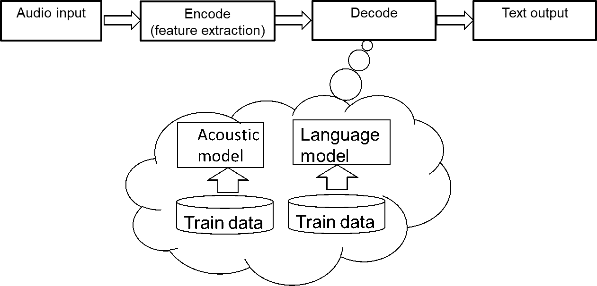
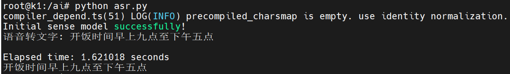

sidebar_position: 23

# 1. ASR介绍

## 1.1 ASR概念
ASR（Automatic Speech Recognition，自动语音识别） 是一种将语音信号转换为文字的技术。它允许计算机或其他设备“听懂”人类语言，并据此做出反应。

## 1.2 ASR用途
<center>
    
    <br>
    <div style="color:orange; border-bottom: 1px solid #d9d9d9;
    display: inline-block;
    color: #999;
    padding: 2px;"> 图 1.1 </div>
</center>

### ASR（自动语音识别）技术应用场景

ASR 技术由于其能够将语音转换为文本的强大能力，已经被广泛应用于多个领域和场景。以下是 ASR 的一些主要使用场景：

### 智能语音助手
- **智能家居控制**：通过语音命令控制家中的智能设备，如灯光、温度调节等。
- **智能手机助手**：例如 Siri、Google Assistant、小爱同学等，用户可以通过语音与手机进行交互，如发送短信、拨打电话、查询信息等。

### 客户服务
- **呼叫中心自动化**：自动接听来电并根据用户的语音输入提供服务或转接至相应部门。
- **聊天机器人**：结合 NLP 技术，处理客户咨询，提高响应速度和服务质量。

### 医疗保健
- **病历记录**：医生可以口述患者的病情和治疗方案，ASR 系统将其转化为电子病历，减少手动输入的工作量。
- **辅助诊断**：在一些情况下，ASR 可以帮助分析患者描述的症状，为医生提供参考意见。

### 教育
- **在线学习平台**：学生可以通过语音提问，系统自动生成答案或指引相关课程内容。
- **语言学习工具**：帮助学习者练习发音，并给出即时反馈。

### 媒体娱乐
- **字幕生成**：为电影、电视剧实时生成字幕，方便听障人士观看视频内容。
- **音乐搜索**：用户哼唱旋律，系统识别歌曲名称或艺术家信息。

### 办公效率提升
- **会议记录**：自动记录会议讨论内容，之后可快速检索关键信息。
- **文档编辑**：利用语音输入来撰写邮件、报告等文件，提高工作效率。

### 无障碍辅助技术
- **视觉障碍者的读屏软件**：帮助视障人士通过语音指令操作计算机或移动设备。
- **听力障碍者的语音转文字服务**：为聋人提供面对面交流时的语音翻译支持。

### 汽车驾驶
- **车载信息系统**：驾驶员可以通过语音命令来导航、播放音乐、调整空调设置等，保证行车安全。

### 法律与执法
- **证据收集**：对审讯过程录音进行转录，确保准确性和完整性。
- **现场指挥调度**：执法人员可以通过语音命令快速获取所需资源和支持。

上述只是 ASR 技术应用的一部分例子。随着技术的进步，我们可以期待更多创新的应用场景出现。

## 1.3 ASR流程
语音识别技术的发展已有数十年发展历史，大体来看可以分成传统的识别的方法和基于深度学习网络的端到端的方法。无论哪种方法，都会遵循“输入-编码-解码-输出”的过程。
<center>
    
    <br>
    <div style="color:orange; border-bottom: 1px solid #d9d9d9;
    display: inline-block;
    color: #999;
    padding: 2px;"> 图 1.2 </div>
</center>

# 2. ASR部署
现在您可以在k1上快速部署ASR
## 2.1 软件准备

执行下面命令下载脚本和模型：
```bash
wget https://archive.spacemit.com/spacemit-ai/openwebui/voice_env.sh -P ~/
bash ~/voice_env.sh
```

上面的voice_env.sh是一个脚本文件：

执行该脚本首先会安装llm-asr以及libopenblas-dev依赖，其中llm-asr是一个自定义python依赖包，里面定义了初始化语音模型的函数。libopenblas-dev是一个开发软件包，提供OpenBLAS的头文件和开发库。OpenBLAS 是一个高性能的开源 BLAS（Basic Linear Algebra Subprograms） 库，专注于优化矩阵运算和线性代数计算。

然后脚本在/usr/local/share路径下创建一个叫voice_test的文件夹，把进迭时空官方提供的音频文件以及sensevoice大模型权重文件下载并解压到该路径。

## 2.2 运行ASR

打开终端键盘输入`vim ~/asr.py`，然后复制以下代码到终端，点击键盘`shift+:`再点击wq以保存退出，然后输入`python ~/asr.py`运行代码。
```
import os
import shutil
import llm_asr

sensevoice_path = "/usr/local/share/voice_test/sensevoice"
sensevoiceModel = llm_asr.llm_asr(sensevoice_path)

original_filepath = "/usr/local/share/voice_test/zh.mp3"
temp_filepath = "/tmp/temp_audio.mp3"

shutil.copy(original_filepath, temp_filepath)

text = sensevoiceModel.audio_to_text(temp_filepath)
print(text)

if os.path.exists(temp_filepath):
    os.remove(temp_filepath)
```

运行该代码文件，即可获取以下输出：
<center>
    
    <br>
    <div style="color:orange; border-bottom: 1px solid #d9d9d9;
    display: inline-block;
    color: #999;
    padding: 2px;"> 图 2.1 </div>
</center>
