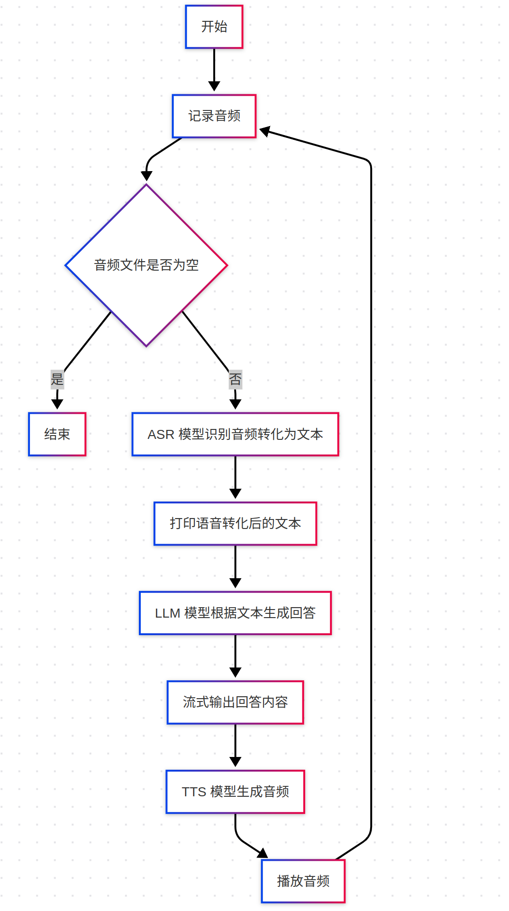
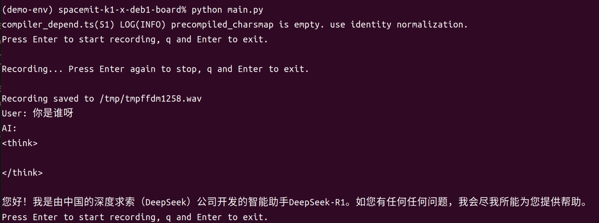

sidebar_position: 1

# AI 聊天机器人

AI聊天机器人是人工智能领域的重要应用，它集成了多种AI技术，能够通过自然语言与人类进行交互。本项目构建了一个端到端的本地化 AI 聊天机器人，旨在通过模块化设计与高效调度，实现 ASR（自动语音识别）、LLM（大语言模型）及 TTS（文本转语音）多项核心功能的协同工作，整个系统支持实时语音交互。

<center>
    
    <br>
    <div style="color:orange; border-bottom: 1px solid #d9d9d9;
    display: inline-block;
    color: #999;
    padding: 2px;"> 图1 AI聊天机器人工作流程示意图 </div>
</center>

## 1. AI聊天机器人核心流程

AI聊天机器人整合了自动语音识别（ASR）、大语言模型（LLM）和文本转语音（TTS）技术，实现端到端的语音交互体验。

### 1.1. 自动语音识别（ASR）

**音频采集与预处理：** 项目采用 Python 音频库（sounddevice）实现实时录入，并利用 Librosa 提取 MFCC 等特征，进行降噪与标准化处理，为后续的语音识别模型提供稳定输入。

**识别模型：** 在 asr 模块中，音频数据经过预处理后输入到深度学习模型中，快速转写为文本。
### 1.2. 大语言模型（LLM）

**Deepseek R1 模型：** 本项目中采用本地部署的 Deepseek R1，基于 Transformer 架构，具备优秀的上下文捕捉和语义推理能力。

**推理过程：** 在推理流程中，输入文本首先经过预处理后送入 Deepseek R1 模型，通过多头注意力机制捕捉上下文信息，生成符合语义逻辑的回复。


### 1.3. 文本转语音（TTS）

**文本预处理：** 将输入文本经过符号映射、标准化和切分，确保文本格式适合模型输入。

**声学特征生成：** 预处理后的文本传入预训练模型，再转换为中间声学表示（Mel-spectrogram），捕捉文本的韵律和音调。

**声码器合成：** 通过声码器将声学特征转换为语音波形，生成最终语音输出。


## 2. AI聊天机器人核心代码


**音频录制模块:**
```python
import wave
import tempfile
import sounddevice as sd

# 录制音频并保存为临时 WAV 文件
def record_audio():
    """Record audio and save to a temporary WAV file."""
    print("Press Enter to start recording, q and Enter to exit.")
    s = input() # 等待用户输入
    if s == 'q':
        return ''

    # 创建临时文件保存录音
    temp_wav_file = tempfile.NamedTemporaryFile(delete=False, suffix='.wav')
    temp_wav_path = temp_wav_file.name  # 获取临时文件路径

    fs = 48000  # 采样频率
    channels = 1  # 单声道录音
    dtype = 'int16'  # 数据类型
    frames = []  # 存储录音数据

    # 录音回调函数
    def callback(indata, frame_count, time_info, status):
        if status:
            print(f"Recording status: {status}", flush=True)
        frames.append(indata.copy()) # 保存录音数据

    with sd.InputStream(samplerate=fs, channels=channels, dtype=dtype, callback=callback):
        input()  # 等待用户停止录音

    # 保存录音数据到 WAV 文件
    with wave.open(temp_wav_path, 'wb') as wf:
        wf.setnchannels(channels)  # 设置声道数
        wf.setsampwidth(2)  # 设置采样宽度
        wf.setframerate(fs)  # 设置采样频率
        wf.writeframes(b''.join(frames))  # 写入录音数据

    return temp_wav_path  # 返回录音文件路径
```

**主程序流程:**

```python
def main():
    from llm import LlmModel  # 导入大语言模型模块
    llm_model = LlmModel()  # 初始化大语言模型

    from asr import AsrModel  # 导入语音识别模块
    asr_model = AsrModel()  # 初始化语音识别模型

    while True:
        audio_file = record_audio()  # 调用录音函数
        if audio_file == '':  # 如果录音返回空，退出循环
            break
        text = asr_model(audio_file)  # 语音转文本
        cont = llm_model.generate(text)  # 生成 AI 回复
        for c in cont:  # 实时输出回复
            print(c, end='', flush=True)
        print()
```

## 3. 部署与运行指南

### 3.1. 依赖配置

下载源码压缩包：
[asr-llm-tts.zip](code/asr-llm-tts.zip)

解压命令：

```bash
unzip asr-llm-tts.zip -d ~/
```

**设置开发环境：**

```bash
# 安装系统依赖
sudo apt update
sudo apt install -y python3-spacemit-ort spacemit-ollama-toolkit virtualenv wget

# 创建Python虚拟环境
virtualenv ~/demo-env

# 配置 pip 源为进迭时空镜像源
pip config set global.extra-index-url https://git.spacemit.com/api/v4/projects/33/packages/pypi/simple

# 安装项目依赖
cd ~/asr-llm-tts
source ~/demo-env/bin/activate
pip install opencv-python==4.6.8.1
pip install pillow==11.2.1
```

### 3.2. 将LLM模型部署到Ollama

#### (1) 确保Ollama服务在后台运行

执行以下命令检查服务状态：

```bash
systemctl status ollama
```

输出应该如下所示：

<center>
    
    <br>
</center>

若状态为 **inactive** ，则使用以下命令启动服务：

```bash
systemctl start ollama
```

#### (2) 下载Deepseek模型及配置文件

```bash
mkdir -p ~/my-ollama
cd ~/my-ollama
wget https://archive.spacemit.com/spacemit-ai/openwebui/deepseek-r1-1.5b.modelfile
wget https://www.modelscope.cn/models/ggml-org/DeepSeek-R1-Distill-Qwen-1.5B-Q4_0-GGUF/resolve/master/deepseek-r1-distill-qwen-1.5b-q4_0.gguf
```

#### (3) 将模型加载至Ollama

```bash
ollama create deepseek-r1-1.5b -f deepseek-r1-1.5b.modelfile
```

#### (4) 复制NLTK数据

```bash
cp -r ~/asr-llm-tts/nltk_data ~/
```

### 3.3. 执行流程

- 进入项目目录并激活虚拟环境

```bash
cd ~/asr-llm-tts/src
source ~/demo-env/bin/activate
```

- 启动语音输出版本

```bash
python main_tts.py
```

- 启动文本输出版本

```bash
python main.py
```

## 4. 执行结果

<center>
    
    <br>
    <div style="color:orange; border-bottom: 1px solid #d9d9d9;
    display: inline-block;
    color: #999;
    padding: 2px;"> 图2.3 AI聊天机器人执行结果 </div>
</center>


## 5. Demo 功能演示

案例演示视频：[AI聊天机器人视频](https://www.bilibili.com/video/BV1KXEvzzENJ/?vd_source=4dbbeb305b760cd9c812b81aca0cc04a&spm_id_from=333.788.videopod.sections&p=1)
