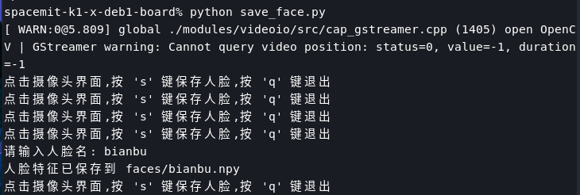
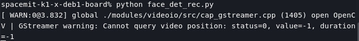

sidebar_position: 2

# 人脸识别应用

人脸识别是人工智能领域的重要应用之一，广泛应用于安防监控、身份验证、智能门禁等场景。本项目旨在构建一个高效、轻量化的本地化人脸识别系统，集成了人脸检测与特征提取两大核心功能，能够实现实时的人脸注册与识别。通过模块化设计与优化部署，系统在资源受限的环境中也能高效运行。

## 1. 人脸识别的数学基础与技术演进

人脸识别本质是将人脸图像 $I$ 映射到高维特征空间中的向量 $f(I) \in \mathbb{R}^d$（通常 $d$=128或512维），然后通过计算特征向量间的余弦相似度进行身份匹配：

$$\text{similarity}(I_1, I_2) = \frac{f(I_1) \cdot f(I_2)}{||f(I_1)|| \cdot ||f(I_2)||} \in [-1, 1]$$

深度学习彻底变革了人脸识别技术，关键里程碑包括：

- **DeepFace (2014, Facebook)**: 首个基于CNN的人脸识别系统，在LFW数据集上达97.35%准确率
- **FaceNet (2015, Google)**: 引入三元组损失函数，准确率提升至99.63%
- **ArcFace (2019)**: 采用角度边缘损失，进一步优化特征区分能力

## 2. 深度神经网络在人脸识别中的应用

### 网络架构与损失函数

人脸识别网络架构已经经历了多次演变：从最初DeepFace的浅层CNN，到ResNet风格的深度网络，再到当前主流的轻量级架构如MobileFaceNet。关键突破点在于特征提取的判别性和计算效率之间的平衡。

现代人脸识别系统的核心在于损失函数设计。ArcFace损失函数通过在角度空间引入边缘间隔，显著提高了特征判别能力：

$$L_{ArcFace} = -\frac{1}{N}\sum_{i=1}^{N}\log\frac{e^{s\cos(\theta_{y_i}+m)}}{e^{s\cos(\theta_{y_i}+m)}+\sum_{j=1,j\neq y_i}^{n}e^{s\cos\theta_j}}$$

其中$\theta_{y_i}$是特征向量与权重的夹角，$m$是角度间隔，$s$是特征缩放因子。

## 3. 人脸识别应用核心流程

### 3.1. 视频流处理

使用 OpenCV 库实现摄像头视频捕捉和图像预处理，如缩放、灰度转换和滤波。保证视频帧的质量，为后续人脸检测提供清晰稳定的输入。

### 3.2. 人脸检测与识别

**人脸检测：** 常用方法包括 OpenCV 内置的 Haar Cascade 检测器以及基于 CNN 的检测器（如 MTCNN），能够在实时场景中平衡检测速度与准确率。本项目使用了基于 YOLOv5 的人脸检测模型，在保持较高检测速度的同时，保证检测精度。

**人脸比对：** 使用 ArcFace 模型提取人脸的深度特征，通过计算欧氏距离或余弦相似度，将检测到的特征与数据库中存储的人脸模板进行匹配。此外还提供了量化版本模型（ arcface_mobilefacenet_cut.q.onnx），可在资源受限的场景下提高运算速度。

**数据库与样本管理：** 人脸样本以文件或轻量级数据库（如 SQLite）的形式保存，每个样本均附有对应的姓名或其它标识信息，方便快速比对。


## 4. 人脸识别应用实例

### 4.1. 人脸注册流程

```python
# 1. 初始化检测和识别模型
det_model_path = "onnx_model/yolov5n-face_320_cut.q.onnx"
rec_model_path = "onnx_model/arcface_mobilefacenet_cut.q.onnx"
det = Detection(det_model_path)
rec = Recognition(rec_model_path, faces_folder)

# 2. 摄像头初始化
cap = cv2.VideoCapture(20)

# 3. 人脸检测
face_img, boxes = det.infer_face(frame)

# 4. 人脸框显示
if boxes is not None:
    for box in boxes:            
        x1, y1, x2, y2 = box  
        cv2.rectangle(frame, (int(x1), int(y1)), (int(x2), int(y2)), (0, 255, 0), 2)

# 5. 人脸特征提取与保存
face_vec = rec.infer(face_img[0])
save_path = os.path.join(save_folder, f"{face_name}.npy")
np.save(save_path, face_vec)
```

### 4.2. 人脸识别流程

```python
# 1. 初始化检测和识别模型
det_model_path = "onnx_model/yolov5n-face_320_cut.q.onnx"
rec_model_path = "onnx_model/arcface_mobilefacenet_cut.q.onnx"
faces_path = "faces"
det = Detection(det_model_path)
rec = Recognition(rec_model_path, faces_path)

# 2. 人脸检测
face_imgs, boxes = det.infer_face(frame)

# 3. 人脸识别与特征匹配
for i, (face_img, box) in enumerate(zip(face_imgs, boxes)):
    face_vector = rec.infer(face_img)
    
    face_name = None
    max_similarity_score = 0.0
    
    # 与人脸库中的特征向量进行匹配
    for key, value in rec.face_bank.items():
        similarity_scores = face_vector @ value.T
        if similarity_scores[0][0] > max_similarity_score and similarity_scores[0][0] > 0.6:
            max_similarity_score = similarity_scores[0][0]
            face_name = key
            results[face_name] = box
        else:
            results[f"unknown_{i}"] = box

# 4. 显示识别结果
for key, value in results.items():
    if "unknown" not in key:
        cv2.putText(frame, key, (int(value[0]), int(value[1] - 10)), 
                   cv2.FONT_HERSHEY_SIMPLEX, 0.8, (0, 255, 0), 2)
    cv2.rectangle(frame, (int(value[0]), int(value[1])), 
                 (int(value[2]), int(value[3])), (0, 255, 0), 2)
```

## 5. 部署与运行指南

### 5.1. 依赖配置

下载源码压缩包：
[face_det_rec.zip](code/face_det_rec.zip)

解压命令：

```bash
unzip face_det_rec.zip -d ~/
```

**设置开发环境：**

```bash
# 安装系统依赖
sudo apt update
sudo apt install python3-venv

# 创建Python虚拟环境
python3 -m venv ~/.venv

# 配置 pip 源为进迭时空镜像源
pip config set global.extra-index-url https://git.spacemit.com/api/v4/projects/33/packages/pypi/simple

# 安装项目依赖
cd ~/face_det_rec
source ~/.venv/bin/activate
pip install opencv-python==4.6.8.1
pip install pillow==11.2.1
```


### 5.2. 执行流程

进入项目目录并激活虚拟环境：

```bash
cd ~/face_det_rec
source ~/.venv/bin/activate
```

**人脸注册**

首先需要注册人脸到人脸库中，在终端中执行以下程序：

```bash
python save_face.py
```

**操作流程：**
- 程序启动后，摄像头捕获人脸
- 确保面部正面出现在检测框内
- 按"s"键进入名称输入环节
- 在终端输入身份名称，回车确认
- 特征向量自动保存至faces目录

**人脸识别**

执行实时人脸检测与识别：

```bash
python face_det_rec.py
```

检测到人脸后，会框出人脸并标记提前录好的人脸名。

## 6. 执行结果

### 6.1. 人脸注册结果

<div style="text-align: center;">
    
    <br>
    <div style="color:orange; border-bottom: 1px solid #d9d9d9;
    display: inline-block;
    color: #999;
    padding: 2px;"> 图5.1 人脸注册结果 </div>
</div>

### 6.2. 人脸识别结果

<center>
    
    <br>
    <div style="color:orange; border-bottom: 1px solid #d9d9d9;
    display: inline-block;
    color: #999;
    padding: 2px;"> 图5.2 人脸识别效果 </div>
</center>

## 6.3. Demo 功能演示

案例演示视频：[人脸识别应用视频](https://www.bilibili.com/video/BV1KXEvzzENJ/?vd_source=4dbbeb305b760cd9c812b81aca0cc04a&spm_id_from=333.788.videopod.sections&p=2)
