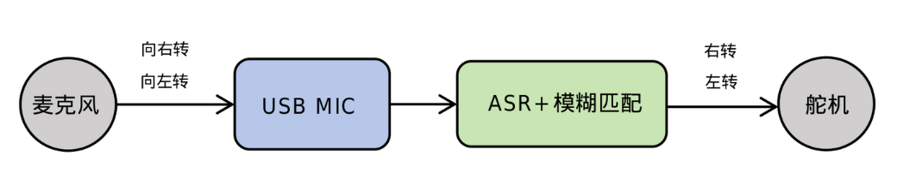
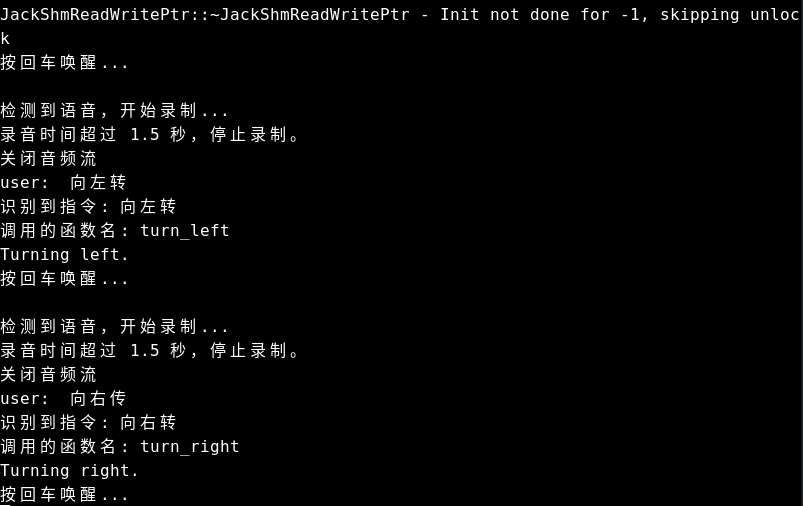

# 语音控制电机系统

语音控制是计算机与人类交互的自然方式之一，通过语音指令操控设备能够实现免手动、高效率的人机交互体验。本节介绍基于RISC-V平台实现的语音控制电机系统。

## 1. 语音控制电机系统流程

<center>
    
    <br>
    <div style="color:orange; border-bottom: 1px solid #d9d9d9;
    display: inline-block;
    color: #999;
    padding: 2px;"> 图1.1 语音控制电机系统架构 </div>
</center>

**语音采集：** 系统通过USB麦克风采集用户语音指令，将声波转换为数字信号。音频采集采用PyAudio库，配置为48kHz采样率、16位量化、单声道格式，确保获取高质量语音输入。

**语音预处理：** 对原始音频信号进行降噪、分帧和加窗等处理，提高后续识别准确率。系统使用VAD(Voice Activity Detection)技术自动检测有效语音段，过滤静音部分，优化计算资源使用。

**特征提取：** 从预处理后的语音信号中提取MFCC(梅尔频率倒谱系数)和Filter Bank等声学特征，这些特征能够有效表征语音的频谱特性，是语音识别的重要输入。

**语音识别(ASR)：** 采用PaddleSpeech框架的DeepSpeech2模型，将声学特征转换为文本。该模型针对RISC-V平台进行了优化，支持实时中文语音识别，识别精度高。

**语义理解：** 利用difflib库实现模糊匹配算法，分析识别出的文本内容，提取控制意图。该模块具有容错能力，即使语音识别结果不完全准确，也能正确理解用户意图。

**舵机控制：** 根据识别到的命令，通过GPIO接口发送PWM信号控制舵机执行相应动作。系统使用gpiozero库实现精确的舵机角度控制，完成从语音到物理控制的闭环。

## 2. 核心代码实现

### 2.1. 舵机初始化与控制

```python
# 设置舵机控制
from gpiozero.pins.lgpio import LGPIOFactory
from gpiozero import Device, Servo
from time import sleep

# 配置GPIO底层库
Device.pin_factory = LGPIOFactory(chip=0)

# 舵机初始化 (GPIO73)
pin_number = 73
servo = Servo(pin_number, min_pulse_width=0.0005, max_pulse_width=0.0025, frame_width=0.02)
servo.value = 0  # 初始化位置
sleep(0.3)
servo.detach()  # 释放舵机
```

### 2.2. 舵机动作函数

```python
# 定义舵机动作
def turn_left():
    """向左转舵机"""
    servo.value = 1.0  # 最大角度
    sleep(0.3)
    servo.detach()  # 完成后释放舵机
    print("Turning left.")

def turn_right():
    """向右转舵机"""
    servo.value = -1.0  # 最小角度
    sleep(0.3)
    servo.detach()  # 完成后释放舵机
    print("Turning right.")
```

### 2.3. 语音识别

```python
# 初始化语音识别
from spacemit_audio import ASRModel, RecAudioThreadPipeLine
asr_model = ASRModel()

# 录音设置
record_device = 2  # 麦克风设备索引
rec_audio = RecAudioThreadPipeLine(vad_mode=1, sld=2, max_time=2, 
                                   channels=1, rate=48000, 
                                   device_index=record_device)

# 启动录音并识别
print("按回车开始录音...")
input()  # 等待用户按回车

# 开始录音
rec_audio.start_recording()
rec_audio.max_time_record = 1.5  # 最长录音时间
rec_audio.frame_is_append = True
rec_audio.thread.join()  # 等待录音完成

# 语音识别
audio_data = rec_audio.get_audio_file()
text = asr_model.generate(audio_data)
print('识别结果:', text)
```

### 2.4. 命令识别与执行

```python
import difflib

# 命令映射表
commands = {
    "向左转": turn_left,
    "向右转": turn_right,
}

# 模糊匹配命令
def execute_command(user_input):
    valid_commands = list(commands.keys())
    
    # 使用difflib进行模糊匹配
    match = difflib.get_close_matches(user_input, valid_commands, n=1, cutoff=0.6)
    
    if match:
        print(f"识别到指令: {match[0]}")
        commands[match[0]]()  # 执行对应函数
        return True
    else:
        print("未识别到有效指令")
        return False
```

### 2.5. 完整控制流程

```python
# 主循环示例
try:
    while True:
        print("按回车开始录音...")
        input()
        
        # 录音和识别
        rec_audio.start_recording()
        rec_audio.frame_is_append = True
        rec_audio.thread.join()
        
        # 语音转文字
        audio_data = rec_audio.get_audio_file()
        text = asr_model.generate(audio_data)
        print('识别结果:', text)
        
        # 执行命令
        execute_command(text)
        
except KeyboardInterrupt:
    print("程序终止")
```


## 3. 部署与运行指南

### 3.1. 依赖配置

下载源码压缩包：
[voice-control-servo.zip](code/voice-control-servo.zip)

解压命令：

```bash
unzip voice-control-servo.zip -d ~/
```

**设置开发环境：**

```bash
# 安装系统依赖
sudo apt update
sudo apt install -y libopenblas-dev \
portaudio19-dev \
python3-dev \
python3-venv \
ffmpeg \
python3-spacemit-ort libcjson-dev libasound2-dev


# 创建Python虚拟环境
python3 -m venv ~/asr_env

# 配置 pip 源为进迭时空镜像源
pip config set global.index-url https://pypi.tuna.tsinghua.edu.cn/simple
pip config set global.extra-index-url https://git.spacemit.com/api/v4/projects/33/packages/pypi/simple

# 安装项目依赖
cd ~/voice-control-servo/spacemit_audio
source ~/asr_env/bin/activate
pip install -r requirements.txt
pip install gpiozero
```

### 3.2. 设置音频设备权限

```bash
sudo usermod -aG audio $USER
```

### 3.4. 执行流程

- 进入项目目录并激活虚拟环境

```bash
cd ~/voice-control-servo
source ~/asr_env/bin/activate
```

- 启动程序：

```bash
python voice_control.py
```

程序启动后，按回车键开始录音，说出"向左转"或"向右转"等指令，系统将识别并执行相应的舵机控制动作。

## 4. 执行结果

<center>
    
    <br>
    <div style="color:orange; border-bottom: 1px solid #d9d9d9;
    display: inline-block;
    color: #999;
    padding: 2px;"> 图4.1 语音控制电机执行结果 </div>
</center>

## 5. Demo 功能演示

案例演示视频：[语音控制电机视频](https://www.bilibili.com/video/BV1KXEvzzENJ/?vd_source=4dbbeb305b760cd9c812b81aca0cc04a&spm_id_from=333.788.videopod.sections&p=3)
