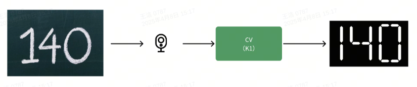
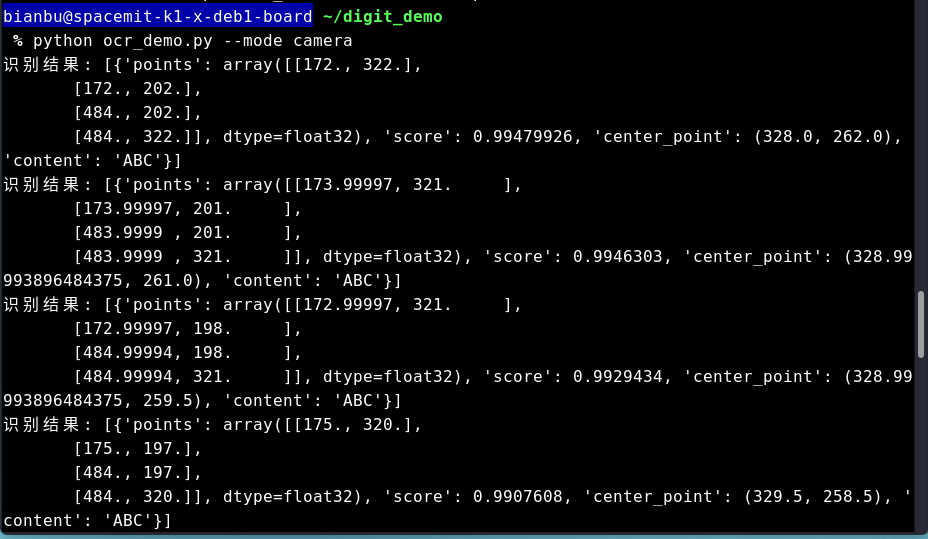
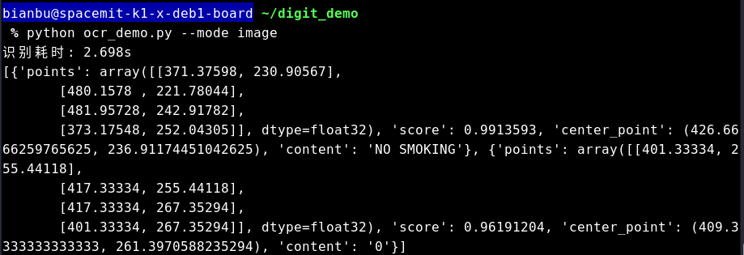
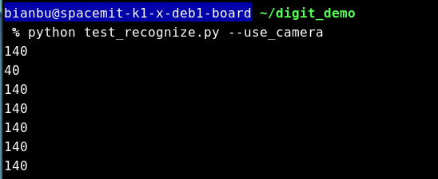
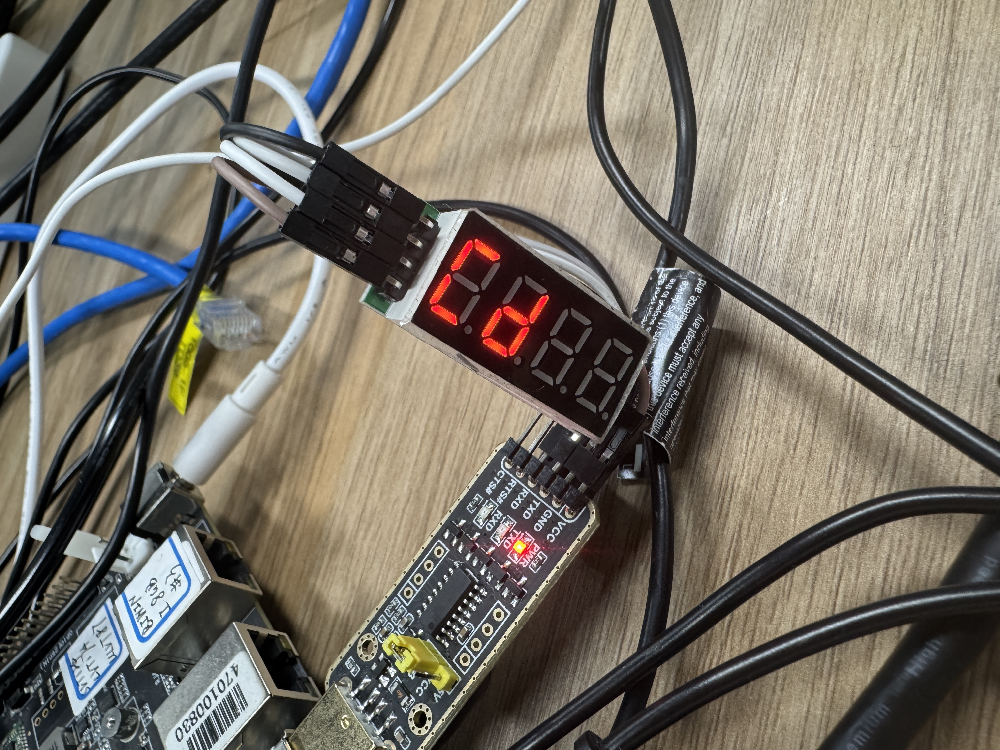
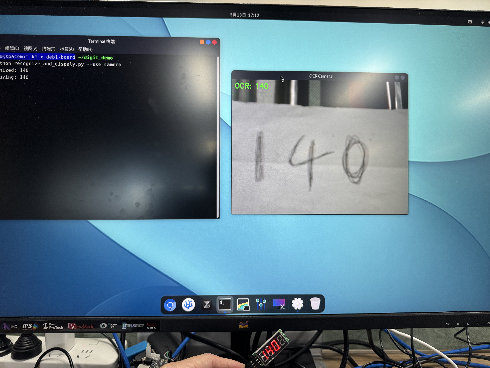

sidebar_position: 4

#  数字识别系统

数字识别是计算机视觉领域的重要应用之一，通过对图像中的数字进行检测和识别，实现数据的自动化采集与处理。本节将介绍一个基于RISC-V平台的本地化数字识别系统实现。

## 1. 目的

构建计算机视觉（CV）与嵌入式系统融合的开发框架，验证CV模型在边缘设备上的部署能力与端侧识别效果，搭建模型部署与物理反馈的原型平台。通过本项目，开发者可以深入理解从视觉感知到物理控制的完整闭环过程，掌握边缘AI应用的开发方法。

## 2. 功能描述

用户启动终端程序后，系统调用USB摄像头实时采集视频流，部署并运行基于PaddleOCR的视觉识别模型，对画面中的纸面数字内容进行检测与识别。识别出的数字将被转换为控制信号，驱动数码管进行同步显示，实现从感知到控制的闭环演示。

## 3. 整体流程

数字识别系统的工作流程是一个从输入到输出的完整闭环，包括视频数据采集、图像处理、AI模型推理以及物理设备反馈等多个环节。每个环节都有其特定的技术实现和功能作用，共同构成了一个端到端的智能识别系统。整个系统采用模块化设计，各组件之间通过标准化接口进行数据交换，保证了系统的稳定性和可扩展性。

以下是数字识别系统的整体流程图，展示了从视频采集到结果显示的完整处理链路。系统通过摄像头采集视频流，经过图像预处理、文本区域检测和数字识别等步骤，最终将识别结果通过数码管实时显示，同时在界面上进行可视化呈现。

<center>
    
    <br>
    <div style="color:orange; border-bottom: 1px solid #d9d9d9;
    display: inline-block;
    color: #999;
    padding: 2px;"> 图3.1 识别流程图 </div>
</center>

**视频采集：** 系统通过USB摄像头实时采集视频流，获取包含数字内容的图像帧。

**图像预处理：** 对获取的图像帧进行预处理，包括调整大小、灰度转换、二值化等，提高数字识别的准确率。

**文本区域检测：** 使用PaddleOCR的检测模型，定位图像中包含数字的文本区域位置。

**数字识别：** 对检测到的文本区域进行数字识别，提取数字内容及其位置信息。

**数字显示：** 将识别结果转换为控制信号，通过GPIO接口传输至数码管模块进行实时显示。

**结果可视化：** 在视频画面中标注识别结果，包括数字区域框、识别出的数字值，并在界面上显示处理信息。


## 4. 核心代码解析

### 4.1. 检测+识别OCR识别核心代码

**识别函数**

```python
def ocr_image(ocr, image_path):
    # 调用 OCR 模型对图像进行识别
    results = ocr(image_path)
    ...
```

**摄像头识别核心逻辑**

```python
class CameraOCR:
    def __init__(self, det_model_path, rec_model_path, rec_dict_path):
        # 初始化 OCR 处理器和摄像头
        self.ocr = OCRProcessor(det_model_path, rec_model_path, rec_dict_path)
        self.cap = cv2.VideoCapture(20) # 根据系统修改摄像头设备索引

    def start_camera(self):
        while True:
            ret, frame = self.cap.read()  # 读取摄像头帧
            if not ret:
                break
            results = self.ocr(frame)  # 对帧进行 OCR 识别
            if cv2.waitKey(1) & 0xFF == ord('q'):  # 按 'q' 键退出
                break
        self.cap.release()  # 释放摄像头资源
```

**程序入口**

```python
if __name__ == "__main__":
    parser = argparse.ArgumentParser()
    parser.add_argument('--mode', type=str, choices=['image', 'camera'], required=True)  # 选择模式
    args = parser.parse_args()

    if args.mode == 'image':
        # 图像模式下初始化 OCR 并处理图像
        ocr = OCRProcessor('det_model.onnx', 'rec_model.onnx', 'rec_dict.txt')
        ocr_image(ocr, 'test_image.jpg')
    elif args.mode == 'camera':
        # 摄像头模式下初始化 OCR 并启动摄像头识别
        camera_ocr = CameraOCR('det_model.onnx', 'rec_model.onnx', 'rec_dict.txt')
        camera_ocr.start_camera()
```

### 4.2. 仅识别OCR识别核心代码

**主逻辑**

```python
def main(args):
    Recognizer = TextRecognizer(args.model_path, args.text_path)

    if args.use_camera:
        cap = cv2.VideoCapture(20)
        while True:
            ret, frame = cap.read()
            if not ret:
                break
            print(Recognizer.forward(frame))
            if cv2.waitKey(1) & 0xFF == ord('q'):
                break
        cap.release()
    else:
        img = cv2.imread(args.img_path)
        ...
```

### 4.3. 数码管显示

```python
import serial
import time

serial_port = '/dev/ttyACM0'  # 串口号，根据你的设备修改，比如 '/dev/ttyUSB0'（Linux）

# 配置串口
ser = serial.Serial(
    port=serial_port,
    baudrate=9600,    # 波特率
    bytesize=serial.EIGHTBITS,
    parity=serial.PARITY_NONE,
    stopbits=serial.STOPBITS_ONE,
    timeout=1         # 超时设置（秒）
)

#number_list = [11, 345, 66, 78]
word_list = ['abc', 'cd']

# 发送字符串
for it in word_list:
    message = f"S={str(it)}\r\n"
    ser.write(message.encode('utf-8'))  # 发送 UTF-8 编码的字符串
    time.sleep(1)

# 关闭串口
ser.close()
```

### 4.4. OCR识别驱动数码管

**数码管控制类**

```python
class DigitalTubeController:
    def __init__(self, serial_port='/dev/ttyACM0', baudrate=9600):
        # 初始化串口配置
        ...

    def display_text(self, text):
        # 显示文本到数码管
        ...

    def close(self):
        # 关闭串口连接
        ...
```

**提取字母数字组合的函数**

```python
def extract_alphanumeric(text):
    # 提取字母和数字的组合
    if not text:
        return None

    matches = re.findall(r'[a-zA-Z0-9]+', text)  # 使用正则表达式匹配
    if matches:
        return matches[0]  # 返回第一个匹配项
    return None
```

**处理识别结果并发送到数码管**

```python
# 处理识别结果
if result:
    try:
        current_text = extract_alphanumeric(result)  # 提取有效字符

        if current_text and current_text != last_text:
            tube_controller.display_text(current_text)  # 显示到数码管
            last_text = current_text
    ...
```

## 5. 部署与运行指南

### 5.1. 依赖配置

下载源码压缩包：
[digit_demo.zip](code/digit_demo.zip)

解压命令：

```bash
unzip digit_demo.zip -d ~/
```

**设置开发环境：**

```bash
# 安装系统依赖
sudo apt update
sudo apt install python3-virtualenv

# 创建Python虚拟环境
python3 -m venv ~/ocr-venv

# 配置 pip 源为进迭时空镜像源
pip config set global.index-url https://pypi.tuna.tsinghua.edu.cn/simple
pip config set global.extra-index-url https://git.spacemit.com/api/v4/projects/33/packages/pypi/simple

# 安装项目依赖
cd ~/digit_demo
source ~/ocr-venv/bin/activate
pip install -r requirements.txt
```

### 5.2. USB转串口设置

#### 5.2.1. USB转串口设备映射规范

所有硬件模块均通过USB转串口设备与开发板连接，系统自动识别并映射以下芯片型号：

  - CH343系列芯片 → /dev/ttyACM*（CDC-ACM协议设备）
  - CH340系列芯片 → /dev/ttyUSB*（标准USB串行设备）

#### 5.2.2. 权限配置指南

1. 执行以下命令配置通用权限规则：

```bash
# 配置CH343设备权限（ttyACM*）
sudo tee /etc/udev/rules.d/99-usb-serial.rules <<<'KERNEL=="ttyACM*", MODE="0666"'

# 配置CH340设备权限（ttyUSB*）
sudo tee /etc/udev/rules.d/100-usb-serial.rules <<<'KERNEL=="ttyUSB*", MODE="0666"'
```

2. 应用配置变更：

```bash
# 重新加载规则并触发设备更新
sudo udevadm control --reload-rules && sudo udevadm trigger
```

3. 查看权限是否生效：

```bash
# 查看CH343系列串口设备
ls -al /dev/ttyACM*
# 输出应该类似：
# crw-rw-rw- 1 root dialout 166, 0  1月17日 17:56 /dev/ttyACM0

# 查看CH340系列串口设备
ls -al /dev/ttyUSB*
# 输出应该类似：
# crw-rw-rw- 1 root dialout 166, 0  1月17日 17:56 /dev/ttyUSB0
```

### 5.3. 执行流程

进入项目目录并激活虚拟环境

```bash
cd ~/digit_demo
source ~/ocr-venv/bin/activate
```

#### (1) OCR识别

- OCR识别：调用检测+识别模型进行推理，仅识别数字和英文

```bash
python ocr_demo.py --mode camera # 启用摄像头推理
python ocr_demo.py --mode image --image_path # 默认为spacemit_orc/data/train_img_33.jpg
```

- OCR识别：仅调用识别模型进行推理，仅识别数字和英文,识别速度更快

```bash
python test_recognize.py --use_camera  # 启用摄像头推理
```

#### (2) 数码管显示

```bash
python digitial_serial.py
```

#### (3) OCR识别并驱动数码管显示

```bash
python recognize_and_dispaly.py --use_camera # 摄像头识别
```


## 6. 执行结果

### 6.1. OCR调用检测+识别模型摄像头推理

<center>
    
    <br>
    <div style="color:orange; border-bottom: 1px solid #d9d9d9;
    display: inline-block;
    color: #999;
    padding: 2px;"> 图7.1 OCR调用检测+识别模型摄像头推理 </div>
</center>

### 6.2. OCR调用检测+识别模型图片推理

<center>
    
    <br>
    <div style="color:orange; border-bottom: 1px solid #d9d9d9;
    display: inline-block;
    color: #999;
    padding: 2px;"> 图7.2 OCR调用检测+识别模型图片推理 </div>
</center>

### 6.3. OCR仅调用识别模型推理

<center>
    
    <br>
    <div style="color:orange; border-bottom: 1px solid #d9d9d9;
    display: inline-block;
    color: #999;
    padding: 2px;"> 图7.3 OCR仅调用识别模型推理 </div>
</center>

### 6.4. 数码管显示

<center>
    
    <br>
    <div style="color:orange; border-bottom: 1px solid #d9d9d9;
    display: inline-block;
    color: #999;
    padding: 2px;"> 图7.4 数码管显示 </div>
</center>


### 6.5. OCR识别并驱动数码管显示

<center>
    
    <br>
    <div style="color:orange; border-bottom: 1px solid #d9d9d9;
    display: inline-block;
    color: #999;
    padding: 2px;"> 图7.5 OCR识别并驱动数码管显示 </div>
</center>

## 7. Demo 功能演示

案例演示视频：[数字识别系统视频](https://www.bilibili.com/video/BV1KXEvzzENJ/?vd_source=4dbbeb305b760cd9c812b81aca0cc04a&spm_id_from=333.788.videopod.sections&p=4)