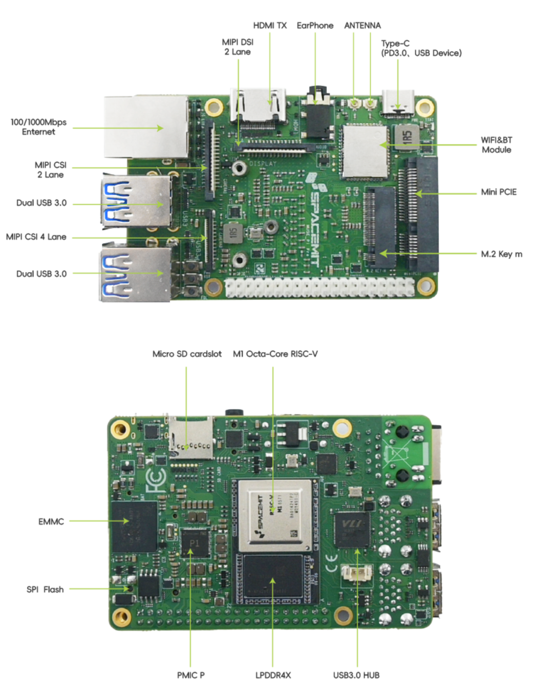

sidebar_position: 1

# Linux 驱动开发环境介绍及搭建

## 1. 硬件描述

### 1.1. MUSE Pi Pro 概览

本次 Linux 驱动开发学习采用 SpacemiT 研发的MUSE Pi Pro ，MUSE Pi Pro 单板计算机将 RISC-V 八核处理器、存储硬盘、通用接口部件和扩展接口布置在同一块电路板上，支持 UEFI 启动以及多种操作系统和应用的运行，是一款完整的计算机系统产品。MUSE Pi Pro 为 1.8 寸单板，能够满足大语言模型应用、机器人、教育科研和物联网等场景中低功耗、空间紧凑情况下的算力需求，为 AI 新时代提供计算能力和丰富的接口扩展。如下图：

<center>
    
    <br>
</center>

> 备注：主板外观可能因为硬件版本不同而有细微的差别

### 1.2. GPIO 接口说明

GPIO 电平域为 3.3V，支持多功能复用，引脚定义和资源如下图：

<center>
    
    <br>
</center>

进迭时空官方参考链接：[MUSE Pi Pro 用户使用指南](https://developer.spacemit.com/documentation?token=EIk1wVY9NinD95kMsw0cFM89npd)


## 2. 开发环境搭建

### 2.1. 系统要求

推荐使用 Ubuntu 22.04 版本进行开发

### 2.2. 安装 Docker

安装必要的证书并允许 apt 包管理器使用以下命令通过 HTTPS 使用存储库
```bash
sudo apt install apt-transport-https ca-certificates curl software-properties-common gnupg lsb-release
```

添加 Docker 的官方 GPG 密钥
```bash
curl -fsSL https://download.docker.com/linux/ubuntu/gpg | sudo gpg --dearmor -o /usr/share/keyrings/docker-archive-keyring.gpg
```

添加 Docker 官方库
```bash
echo "deb [arch=$(dpkg --print-architecture) signed-by=/usr/share/keyrings/docker-archive-keyring.gpg] https://download.docker.com/linux/ubuntu $(lsb_release -cs) stable" | sudo tee /etc/apt/sources.list.d/docker.list > /dev/null
```

更新 Ubuntu 源列表，让 apt知道Docker软件包的存在
```bash
sudo apt update
```

安装 Docker
```bash
sudo apt install docker-ce docker-ce-cli containerd.io docker-compose-plugin
```

验证 Docker 服务是否在运行
```bash
systemctl status docker
```

运行 Docker 服务
```bash
sudo systemctl start docker
```

查看docker版本
```bash
sudo docker version
```


### 2.3. 配置开发容器

#### 2.3.1. 创建工作目录

在 Ubuntu 22.04 系统上执行下面命令：
```bash
mkdir ~/cross-builder
cd ~/cross-builder
```

#### 2.3.2. 创建容器镜像
```bash
# 下载Dockerfile
wget https://archive.spacemit.com/tools/linux-cross-build/Dockerfile

# 构建容器镜像
docker buildx build \
    --platform linux/amd64 \
    --build-arg BASE_IMAGE=harbor.spacemit.com/bianbu/cross-build-common:latest \
    --build-arg group_id=$(id -g) \
    --build-arg group_name=$(id -gn) \
    --build-arg user_id=$(id -u) \
    --build-arg user_name=$(id -un) \
    -t cross-build-user:latest \
    --load \
    -f Dockerfile .
```

#### 2.3.3. 启动开发容器
```bash
docker run -itd \
    -v $HOME:$HOME \
    --name cross-build-user \
    cross-build-user
```

**说明：**

- `-v`：将宿主机home目录挂到容器内。<br>

- 如home目录中有挂载其他目录（如~/WorkSpace），需额外指定 `-v $HOME/WorkSpace:$HOME/WorkSpace`

#### 2.3.4. 进入容器环境
```bash
docker exec -it cross-build-user bash
```

### 2.4. 内核编译环境

#### 2.4.1. 获取内核源码

```bash
git clone https://gitee.com/bianbu-linux/linux-6.6 ~/cross-builder/linux-6.6
cd ~/cross-builder/linux-6.6
git checkout k1-bl-v2.2.y # 切换到2.2分支
```

#### 2.4.2. 配置编译环境

由于后续的驱动开发需要修改并编译设备树，因此需要生成默认配置
```bash
make k1_defconfig
```
<center>
    
    <br>
</center>


> 补充：后续各章节出现的 `path/to/your/` 路径需要修改成自己电脑的具体所在路径。