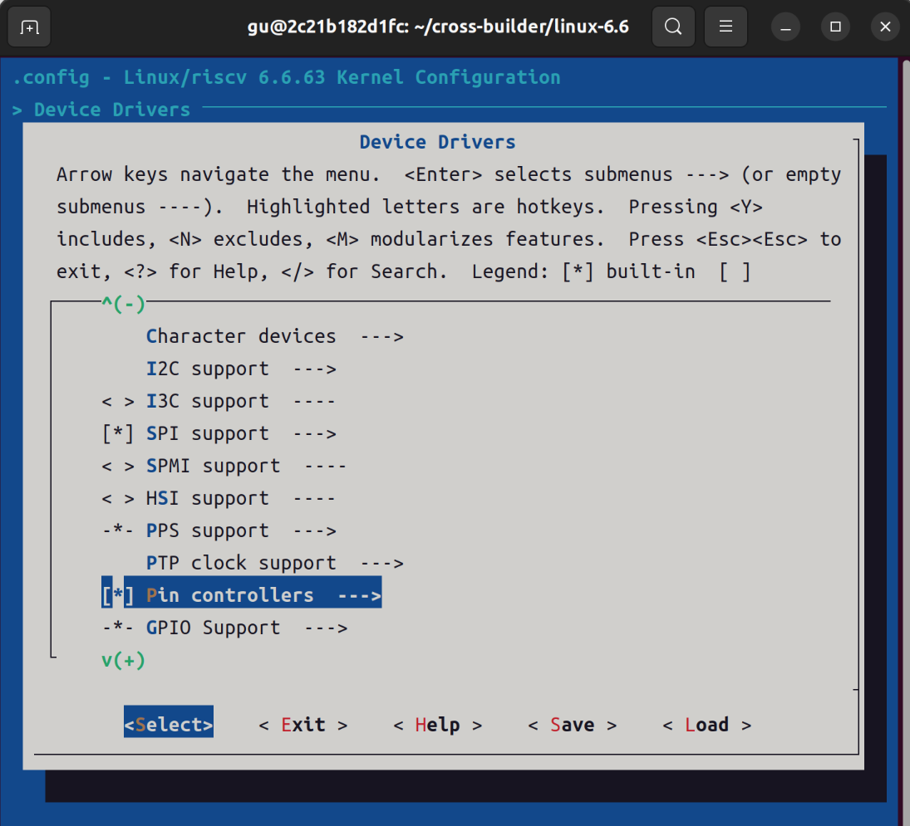
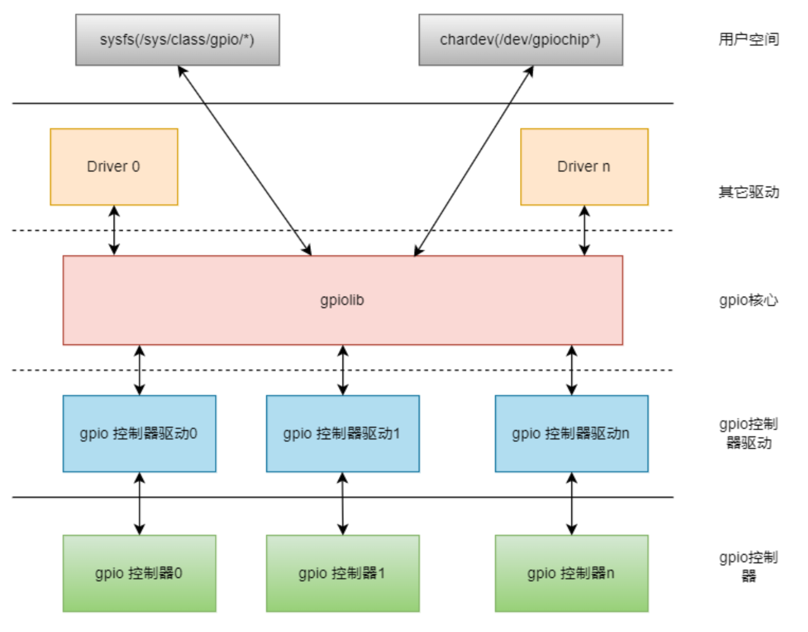
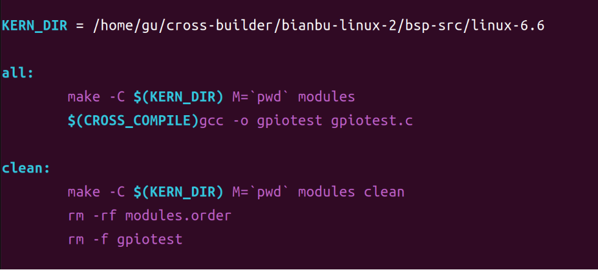
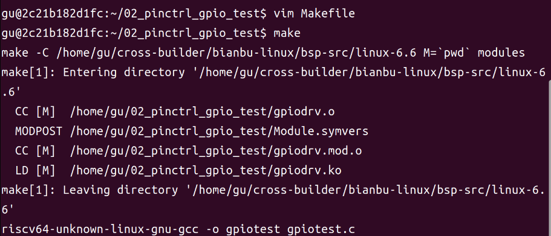
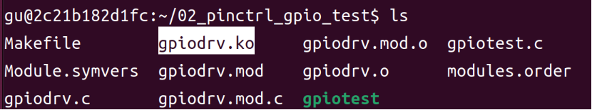
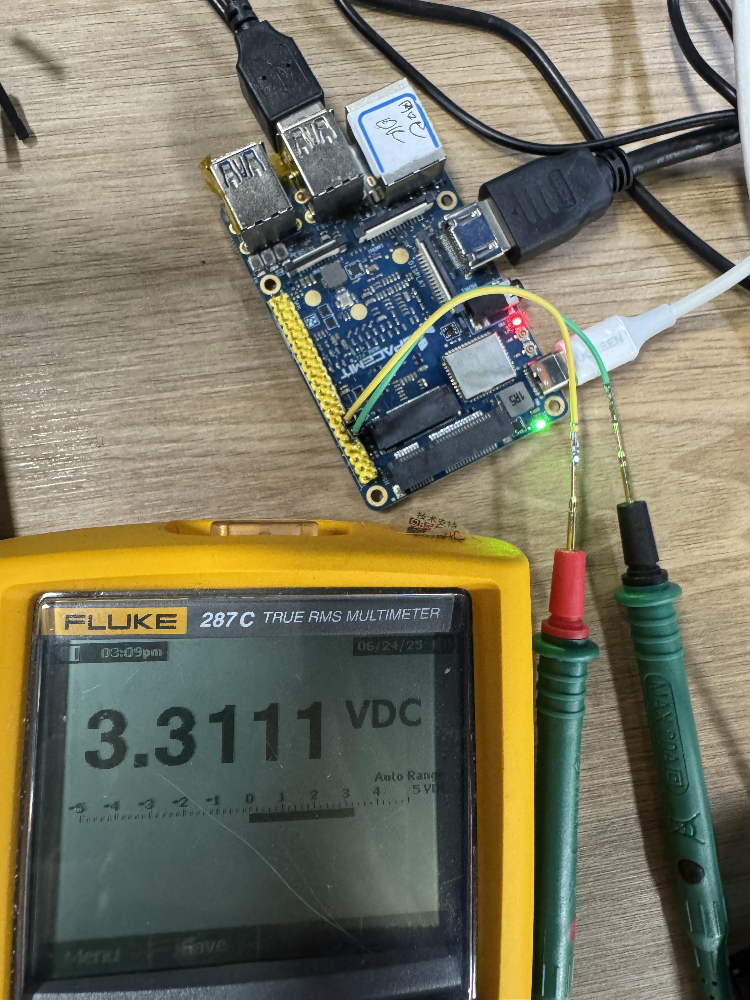

sidebar_position: 3

# Pinctrl及GPIO使用介绍及实践

## 1. Pinctrl 子系统

### 1.1. Pinctrl 介绍

Pinctrl（Pin Control）是引脚控制器的简称，负责管理SoC芯片上的引脚复用、功能选择和电气属性配置。

<center>
    
    <br>
</center>

Linux pinctrl模块包括两部分：pinctrl core 和 pin 控制器驱动。pinctrl core主要有两个功能：<br>

- 提供 pinctrl 功能接口给其它驱动使用<br>

- 提供 pin 控制器设备注册与注销接口<br>

pinctrl控制器驱动主要功能：<br>

- 驱动 pin 控制器硬件<br>

- 实现 pin 的管理和配置<br>

### 1.2. 关键特性

- 支持 pin 复用选择：可将 pin 设置为多种外设功能（如 GPIO、UART、I2C、SPI 等）。<br>

- 支持设置 pin 的电气属性：如边沿检测、上下拉和驱动能力。

### 1.3. CONFIG配置

- `CONFIG_PINCTRL`：为 pin 控制器提供支持，**默认**应启用（Y）。<br>

- `CONFIG_PINCTRL_SINGLE`：为 K1 pinctrl 控制器提供支持，K1 平台**默认**启用（Y）。

```bash
Device Drivers
    Pin controllers (PINCTRL [=y])
        One-register-per-pin type device tree based pinctrl driver (PINCTRL_SINGLE [=y])
```

接下来演示如何配置，我们可以通过 `menuconfig` 查看， 在 `path/to/your/linux-6.6` 目录下输入如下命令：

```bash
make menuconfig
```

<center>
    
    <br>
</center>

移动键盘下键找到 `Device Drivers` 回车。

<center>
    
    <br>
</center>

移动键盘下键找到 `Pin controllers` 回车。

<center>
    
    <br>
</center>

移动键盘下键看到 `One-register-per-pin type device tree based pinctrl driver` 已配置。

<center>
    
    <br>
</center>


### 1.4. pin 配置说明

对于 IO 引脚的复用功能和属性，我们通过设备树里的 pinctrl 节点来配置，具体使用 `K1X_PADCONF` 宏来设置。

#### 1.4.1. 示例：将 GPIO 配置为 UART 功能

定义 pin 组：为外设（如 UART、I2C、SPI）配置功能 pin 组。

**pin controller 节点**

```dts
pinctrl_uart0_2: uart0_2_grp {
    pinctrl-single,pins = <
        K1X_PADCONF(GPIO_68, MUX_MODE2, (EDGE_NONE | PULL_UP | PAD_1V8_DS2)) /* uart0_txd */
        K1X_PADCONF(GPIO_69, MUX_MODE2, (EDGE_NONE | PULL_UP | PAD_1V8_DS2)) /* uart0_rxd */
    >;
};

```

**client device 节点**

uart0 引用定义的 pinctrl_uart0_2 。

```dts
&uart0 {
    pinctrl-names = "default"; /* 设备状态 */
    pinctrl-0 = <&pinctrl_uart0_2>;
    status = "okay";
};
```

#### 1.4.2. pin 配置参数说明

- **pin id**：引脚编号。K1 平台编号范围 1~147，宏定义为 GPIO_00 ~ GPIO_127。<br>

- **pin 功能**：引脚复用功能号 0~7，定义为 MUX_MODE0 ~ MUX_MODE7。<br>

- **pin 属性**：包括边沿检测（EDGE_NONE/EDGE_RISE/EDGE_FALL/EDGE_BOTH）、上下拉（PULL_DIS/PULL_UP/PULL_DOWN）、驱动能力（PAD_1V8_DS0~DS3）。<br>

#### 1.4.3. pin 配置定义说明

- 单个 pin 配置：用 K1X_PADCONF 宏设置 pin_id, mux_mode, pin_config。<br>

- 设备树中通过 pinctrl 节点配置 IO 引脚复用和属性。<br>


### 1.5. API介绍

在设备树中配置好 pinctrl 节点后，驱动程序需要通过以下 API 来使这些配置生效。以下是完整的处理流程：

- 获取设备的 pinctrl 句柄：
```c
struct pinctrl *devm_pinctrl_get(struct device *dev);
```
查找设备节点中的 `pinctrl-names` 属性。

- 释放 pinctrl 句柄：
```c
void devm_pinctrl_put(struct pinctrl *p);
```
释放 pinctrl 资源（使用 devm_ 分配的资源通常不需要手动释放）。

- 查找 pinctrl state：
```c
struct pinctrl_state *pinctrl_lookup_state(struct pinctrl *p, const char *name);
```
查找设备树中定义的特定 pin 状态（如 "default"、"sleep" 等），并获取对应的 `pinctrl-N` 配置。

- 设定 pinctrl state：
```c
int pinctrl_select_state(struct pinctrl *p, struct pinctrl_state *state);
```
将使 `pinctrl-N` 中定义的所有 pin 配置生效。


## 2. GPIO 驱动框架

### 2.1. GPIO 子系统概述

GPIO（General Purpose Input/Output）子系统是 Linux 内核中用于管理和控制 GPIO 引脚的框架。它提供了统一的接口层，使得上层应用可以方便地访问和控制 GPIO 引脚，而无需关心底层硬件的具体实现。

<center>
    
    <br>
</center>

### 2.2. GPIO 驱动架构

Linux gpio子系统驱动框架主要有三部分组成:

- **GPIO 控制器驱动:** 与GPIO控制器进行交互，对控制器进行初始化和操作。

- **gpio lib驱动:** 提供标准的API给其它模块使用，如设置GPIO 方向、读写GPIO电平状态。

- **GPIO 字符设备驱动:** 将GPIO以字符设备的上报给用户空间，用户空间可以通过标准的文件接口访问GPIO 。


### 2.3. 设备树配置

在设备树中， “GPIO 组” 就是一个 GPIO Controller，下面是 k1 芯片的 GPIO 控制器节点，在 `path/to/your/linux-6.6/arch/riscv/boot/dts/k1-x.dtsi` 文件中：

```dtsi
...
gpio: gpio@d4019000 {
    compatible = "spacemit,k1x-gpio";
    reg = <0x0 0xd4019000 0x0 0x800>;
    gpio-controller;
    #gpio-cells = <2>;
    interrupts = <58>;
    clocks = <&ccu CLK_GPIO>;
    interrupt-names = "gpio_mux";
    interrupt-parent = <&intc>;
    interrupt-controller;
    #interrupt-cells = <2>;

    gcb0: gpio0 {
        reg-offset = <0x0>;
    };

    gcb1: gpio1 {
        reg-offset = <0x4>;
    };

    gcb2: gpio2 {
        reg-offset = <0x8>;
    };

    gcb3: gpio3 {
        reg-offset = <0x100>;
    };
};
```

`gpio-controller` 表示这个节点是一个 GPIO Controller，它下面又很多引脚。

`#gpio-cells = <2>` 表示这个控制器下每一个引脚要用2个32位的数 (cell) 来描述。

### 2.4. GPIO 驱动作用

GPIO 驱动用于管理 GPIO 引脚，提供如下功能：<br>

1. 配置 GPIO 引脚方向（输入/输出）<br>

2. 设置 GPIO 电平（高/低）<br>

3. 读取 GPIO 状态<br>

4. 注册 GPIO 中断<br>


## 3. Pinctrl 及 GPIO 实例与实验流程

> **说明**：本次实验采用 **GPIO71** 引脚为例。

### 3.1. 设备树配置

在 `path/to/your/linux-6.6/arch/riscv/boot/dts/spacemit/k1-x_MUSE-Pi-Pro.dts` 根节点下添加：
```dts
/{
    ...
    gpio_test: gpio_test@0{
        compatible = "bianbu,gpio-test";
        gpios = <&gpio 71 0>;
        status = "okay";
    };
};
```

启动 Docker。

```bash
docker start cross-build-user
docker exec -it cross-build-user bash
```

进入 `linux-6.6` 目录重新编译 dtb 文件。

```bash
cd cross-builder/linux-6.6
make dtbs
```
<center>
    
    <br>
</center>


在 MUSE Pi Pro 上执行下面命令查看 ip：

```bash
ifconfig
```

如下图所示，ip 为 `10.0.91.67` 。

<center>
    
    <br>
</center>


执行下面命令将编译好的 k1-x_MUSE-Pi-Pro.dtb 文件传输到 MUSE Pi Pro 板子上。

> **注**：下面的 `bianbu@10.0.91.67` 根据上面结果替换成对应的 ip 。

```bash
sudo scp arch/riscv/boot/dts/spacemit/k1-x_MUSE-Pi-Pro.dtb bianbu@10.0.91.67:/home/bianbu
```

首次通过 ssh 连接 MUSE Pi Pro 会弹出连接确认，键盘输入 yes ，接着再输入密码回车即可。

<center>
    
    <br>
</center>


在 MUSE Pi Pro 上执行以下命令进行替换：

```bash
sudo cp ~/k1-x_MUSE-Pi-Pro.dtb /boot/spacemit/6.6.63
```

将 MUSE Pi Pro 进行重启：

```bash
sudo reboot
```

### 3.2. 驱动实现

```c
static ssize_t test_drv_write (struct file *file, const char __user *buf, size_t size, loff_t *offset)
{
	int err;
	err = copy_from_user(&status, buf, 1);

	gpiod_set_value(test_gpio, status); /* 根据次设备号和status控制LED */
	return 1;
}

static int test_drv_open (struct inode *node, struct file *file)
{
	printk("%s %s line %d\n", __FILE__, __FUNCTION__, __LINE__);

    gpiod_direction_output(test_gpio, 0); /* 根据次设备号初始化LED */
	return 0;
}

static struct file_operations test_drv = {
	.owner	 = THIS_MODULE,
	.open    = test_drv_open,
	.read    = test_drv_read,
	.write   = test_drv_write,
	.release = test_drv_close,
};

static int chip_demo_gpio_probe(struct platform_device *pdev)
{
	/* 4.1 设备树中定义 led-gpios=<...>;	*/
    test_gpio = gpiod_get(&pdev->dev, NULL, 0);

	/* 4.2 注册file_operations 	*/
	major = register_chrdev(0, "bianbu_gpio_test", &test_drv);  /* /dev/led */

	test_class = class_create("bianbu_gpio_test_class");

	device_create(test_class, NULL, MKDEV(major, 0), NULL, "bianbu_gpio_test%d", 0); /* /dev/bianbu_gpio_test0 */
    return 0;

}

static const struct of_device_id bianbu_pinctrl[] = {
    { .compatible = "bianbu,gpio-test" },
    { },
};
```


### 3.3. 编译测试

#### 3.3.1. 编译驱动程序

**下载源码压缩包**

[pinctrl_gpio_test.zip](code/02_pinctrl_gpio_test.zip)

> **补充**：源码文件具体作用请看压缩包里的 README.md 文件。

**解压**

```bash
unzip 02_pinctrl_gpio_test.zip -d ~/
```

**编译**

驱动文件需要在Ubuntu上进行编译，因为SDK在Ubuntu上。修改Makefile里的内核路径为实际路径。

```bash
cd ~/02_pinctrl_gpio_test/
vim Makefile
```

修改``` KERN_DIR ``` 的路径，如图所示：

<center>
    
    <br>
</center>

执行以下命令，编译驱动

```bash
make
```
<center>
    
    <br>
</center>

编译成功以后就会生成一个名为 `gpiodrv.ko` 的驱动模块文件。

<center>
    
    <br>
</center>


#### 3.3.2. 加载驱动

将上一小节编译好的 `02_pinctrl_gpio_test` 文件夹拷贝到 MUSE Pi Pro 开发板上，执行下面命令。

> 注意：下面的 `bianbu@10.0.91.67` 根据上面结果替换成对应的 ip 。

```bash
scp -r ~/02_pinctrl_gpio_test/ bianbu@10.0.91.67:/home/bianbu
```
<center>
    
    <br>
</center>


在开发板上进入该目录并输入如下命令加载 `gpiodrv.ko` 这个驱动模块。

```bash
cd 02_pinctrl_gpio_test/
sudo insmod gpiodrv.ko
```

#### 3.3.3. 运行测试

当驱动模块加载成功以后使用 `gpiotest` 来测试，输入如下命令：

```bash
sudo ./gpiotest /dev/bianbu_gpio_test0 low  # GPIO71 输出低电平
sudo ./gpiotest /dev/bianbu_gpio_test0 high # GPIO71 输出高电平
```

将万用表的红表笔接到 **GPIO71** ，黑表笔接到 **GND** ，并设置到直流电压档位，可以看到如下现象：<br>

**输出低点平：**

<center>
    
    <br>
</center>

**输出高点平：**

<center>
    
    <br>
</center>