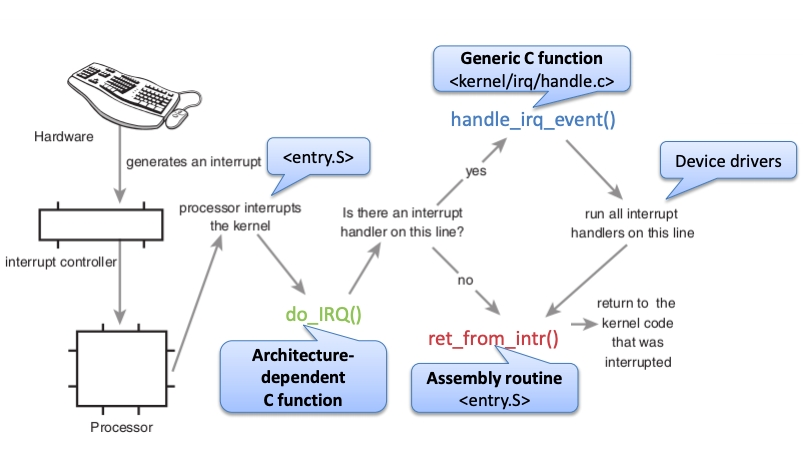
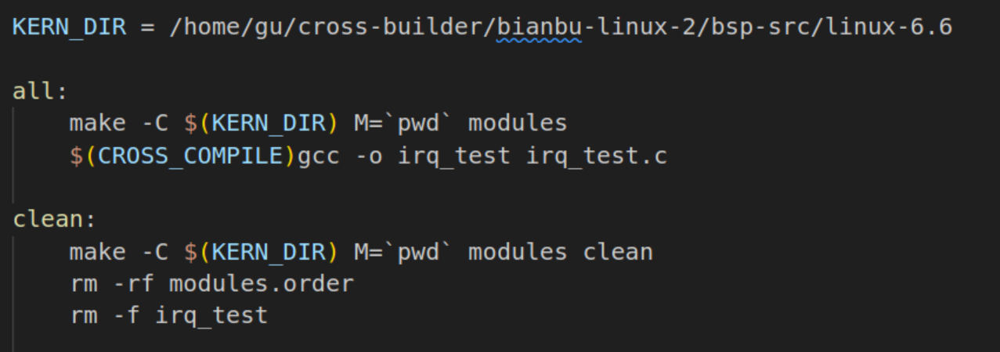
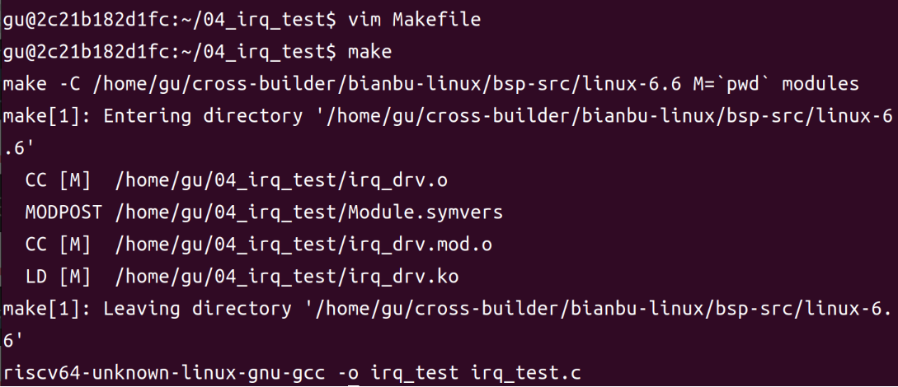
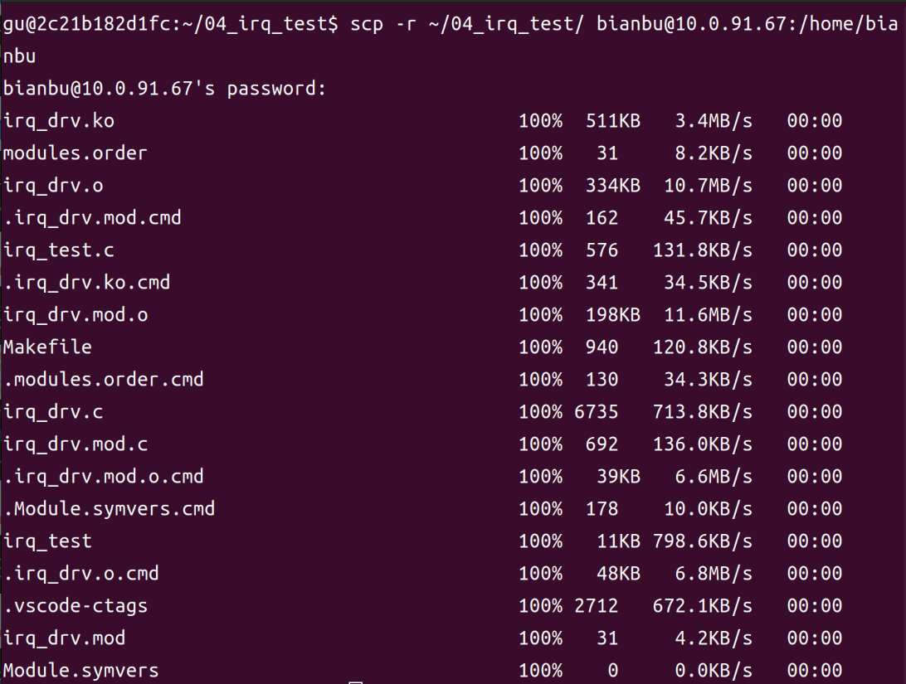
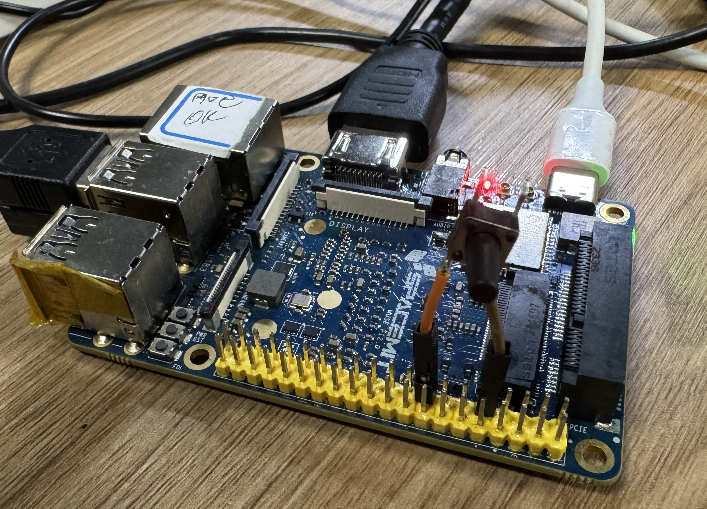

# Linux 中断介绍及实践

## 1. 中断基础概念

中断是现代计算机系统中一种关键的硬件通信机制，允许外部设备通过发送信号打断CPU当前的执行流程，使CPU及时处理外部事件。在裸机系统中，中断处理通常包括中断初始化、注册中断服务函数和中断处理三个步骤。而在Linux内核中，提供了一套完整的中断处理框架，使开发者可以更便捷地使用中断功能。

### 1.1. 中断工作流程

<center>
    
    <br>
</center>

1. **硬件产生中断**：当硬件设备（如键盘）需要通知处理器时，它会生成一个中断信号。<br>

2. **中断控制器**：中断控制器接收到中断信号后，将信号发送给处理器。<br>

3. **处理器响应**：处理器接收到中断信号后，会中断当前正在执行的内核代码，转而处理中断。<br>

4. **架构相关C函数**：处理器调用一个与硬件架构相关的C函数（如do_IRQ()），这个函数负责处理中断。<br>

5. **检查中断处理程序**：do_IRQ()函数会检查是否有中断处理程序（interrupt handler）在当前中断线上注册。<br>

6. **执行中断处理程序**：<br>

    - 如果有对应的设备驱动注册了中断处理器，就调用 handle_irq_event()，运行实际的处理逻辑。<br>

    - 如果没有处理程序，就调用 ret_from_intr()，直接返回原本中断的代码继续执行。<br>

### 1.2. 上半部与下半部

Linux内核将中断处理分为上半部和下半部两个阶段：<br>

- **上半部**：即中断处理函数，负责处理对时间敏感、执行速度快的操作<br>

- **下半部**：用于处理耗时较长的操作，以确保中断处理函数能快进快出<br>


## 2. 中断编程接口

### 2.1. 中断号管理

每个中断都有一个唯一的中断号，用于区分不同的中断源。在Linux内核中，使用一个整型变量表示中断号。

### 2.2. 中断注册API

```c
int request_irq(unsigned int irq,
                irq_handler_t handler,
                unsigned long flags,
                const char *name,
                void *dev);
```

此函数用于申请中断，参数说明：

`irq`：要申请的中断号<br>

`handler`：中断处理函数<br>

`flags`：中断标志，常用标志如下：<br>

- IRQF_SHARED&nbsp;&nbsp;&nbsp;&nbsp;&nbsp;&nbsp;&nbsp;&nbsp;&nbsp;&nbsp;&nbsp;&nbsp;&nbsp;&nbsp;&nbsp;&nbsp;&nbsp;&nbsp;&nbsp;&nbsp;&nbsp;多个设备共享一个中断线<br>

- IRQF_ONESHOT&nbsp;&nbsp;&nbsp;&nbsp;&nbsp;&nbsp;&nbsp;&nbsp;&nbsp;&nbsp;&nbsp;&nbsp;&nbsp;&nbsp;&nbsp;&nbsp;&nbsp;&nbsp;单次中断，中断执行一次就结束<br>

- IRQF_TRIGGER_RISING&nbsp;&nbsp;&nbsp;&nbsp;&nbsp;上升沿触发<br>

- IRQF_TRIGGER_FALLING&nbsp;&nbsp;下降沿触发<br>

- IRQF_TRIGGER_HIGH&nbsp;&nbsp;&nbsp;&nbsp;&nbsp;&nbsp;&nbsp;&nbsp;&nbsp;高电平触发<br>

- IRQF_TRIGGER_LOW&nbsp;&nbsp;&nbsp;&nbsp;&nbsp;&nbsp;&nbsp;&nbsp;&nbsp;&nbsp;低电平触发<br>

`name`：中断名称，可在interrupts文件中看到<br>

`dev`：用于区分共享中断的设备标识<br>

### 2.3. 中断控制函数
```c
void free_irq(unsigned int irq, void *dev);
```

用于释放已申请的中断，参数说明：

`irq`：要释放的中断号<br>

`dev`：如果是共享中断，用于识别具体哪个中断处理函数<br>

### 2.4. 中断处理函数

```c
irqreturn_t (*irq_handler_t)(int irq, void *dev_id);
```
中断处理函数的返回值类型为`irqreturn_t`，有三种可能的返回值：<br>

`IRQ_NONE`：表示不是此设备的中断<br>

`IRQ_HANDLED`：表示中断已成功处理<br>

`IRQ_WAKE_THREAD`：表示需要唤醒线程进行后续处理<br>

### 2.5. 中断使能与禁止函数

```c
void enable_irq(unsigned int irq);
void disable_irq(unsigned int irq);
void disable_irq_nosync(unsigned int irq);
```

`enable_irq`：使能指定中断<br>

`disable_irq`：禁止指定中断，会等待当前正在执行的中断处理函数完成<br>

`disable_irq_nosync`：禁止指定中断，立即返回不等待当前中断处理完成<br>

处理全局中断控制的函数：

```c
local_irq_enable();
local_irq_disable();
```

安全地保存和恢复中断状态的函数：

```c
local_irq_save(flags);
local_irq_restore(flags);
```

## 3. 中断下半部机制

### 3.1. 软中断

软中断是Linux内核提供的一种下半部机制，定义在`path/to/your/linux-6.6/include/linux/interrupt.h`中：

```c
struct softirq_action {
    void (*action)(struct softirq_action *);
};
```

Linux内核定义了10种软中断类型，包括高优先级软中断、定时器软中断、网络发送软中断等。

使用软中断的API函数：

```c
void open_softirq(int nr, void (*action)(struct softirq_action *));
void raise_softirq(unsigned int nr);
```

需要注意的是，软中断必须在编译时静态注册。


### 3.2. Tasklet

tasklet是基于软中断实现的另一种下半部机制，更适合驱动开发使用：

```c
struct tasklet_struct {
    struct tasklet_struct *next;
    unsigned long state;
    atomic_t count;
    void (*func)(unsigned long);
    unsigned long data;
};
```

使用tasklet的API函数：

```c
void tasklet_init(struct tasklet_struct *t,
                  void (*func)(unsigned long),
                  unsigned long data);
void tasklet_schedule(struct tasklet_struct *t);
```

也可以使用宏一次性完成创建和初始化：

```c
DECLARE_TASKLET(name, func, data);
```

tasklet使用示例：

```c
/* 定义tasklet */
struct tasklet_struct testtasklet;

/* tasklet处理函数 */
void testtasklet_func(unsigned long data)
{
    /* tasklet具体处理内容 */
}

/* 中断处理函数 */
irqreturn_t test_handler(int irq, void *dev_id)
{
    /* 调度tasklet */
    tasklet_schedule(&testtasklet);
    return IRQ_HANDLED;
}

/* 驱动入口函数 */
static int __init xxxx_init(void)
{
    /* 初始化tasklet */
    tasklet_init(&testtasklet, testtasklet_func, data);

    /* 注册中断处理函数 */
    request_irq(xxx_irq, test_handler, 0, "xxx", &xxx_dev);

    return 0;
}
```

### 3.3. 工作队列

工作队列是Linux内核提供的另一种下半部机制，它在进程上下文中执行，允许睡眠或重新调度：

```c
struct work_struct {
    atomic_long_t data;
    struct list_head entry;
    work_func_t func;  /* 工作队列处理函数 */
};
```

使用工作队列的API函数：

```c
INIT_WORK(_work, _func);
DECLARE_WORK(n, f);
bool schedule_work(struct work_struct *work);
```

工作队列使用示例：

```c
/* 定义工作 */
struct work_struct testwork;

/* work处理函数 */
void testwork_func_t(struct work_struct *work)
{
    /* work具体处理内容 */
}

/* 中断处理函数 */
irqreturn_t test_handler(int irq, void *dev_id)
{
    /* 调度work */
    schedule_work(&testwork);
    return IRQ_HANDLED;
}

/* 驱动入口函数 */
static int __init xxxx_init(void)
{
    /* 初始化work */
    INIT_WORK(&testwork, testwork_func_t);

    /* 注册中断处理函数 */
    request_irq(xxx_irq, test_handler, 0, "xxx", &xxx_dev);

    return 0;
}
```

## 4. 设备树中断配置

### 4.1. 中断信息节点

在设备树中，通过特定的属性来描述中断信息：

**配置GPIO中断**：

在 `path/to/your/linux-6.6/arch/riscv/boot/dts/spacemit/k1-x.dtsi` 找到 `gpio` 控制器节点，如下：

```dts
gpio: gpio@d4019000 {
	compatible = "spacemit,k1x-gpio";
	reg = <0x0 0xd4019000 0x0 0x800>;
	gpio-controller;
	#gpio-cells = <2>;
	interrupts = <58>;
	clocks = <&ccu CLK_GPIO>;
	interrupt-names = "gpio_mux";
	interrupt-parent = <&intc>;
	interrupt-controller;
	#interrupt-cells = <2>;

	gcb0: gpio0 {
		reg-offset = <0x0>;
	};

	gcb1: gpio1 {
		reg-offset = <0x4>;
	};

	gcb2: gpio2 {
		reg-offset = <0x8>;
	};

	gcb3: gpio3 {
		reg-offset = <0x100>;
	};
};
```
`gpio` 控制器已经声明了 `interrupt-controller` 和 `#interrupt-cells` ，我们只需要定义 `gpios` 属性，驱动会自动处理中断，无需手写 `interrupts`。

### 4.2. 获取中断号

在驱动开发中，有两种常用方法获取中断号：

#### 4.2.1. 从设备树中获取

```c
unsigned int irq_of_parse_and_map(struct device_node *dev, int index);
```

`dev`：设备节点<br>

`index`：索引号，用于选择特定的中断信息<br>

返回值：中断号

#### 4.2.2. 从GPIO获取

```c
int gpio_to_irq(unsigned int gpio);
```

`gpio`：GPIO编号<br>

返回值：对应的中断号


## 5. 中断驱动实践

> **说明**：本次实验采用 **GPIO73** 引脚为例。

### 5.1. 设备树配置

在 `path/to/your/linux-6.6/arch/riscv/boot/dts/spacemit/k1-x_MUSE-Pi-Pro.dts` 根节点下添加：
```dts
/{
    ...
	keys {
		compatible = "my-gpio-keys";
		key0 {
			label = "user-key";
			linux,code = <KEY_ENTER>;
			gpios = <&gpio 73 GPIO_ACTIVE_LOW>;
		};
	};
};
```

启动 Docker。
```bash
docker start cross-build-user
docker exec -it cross-build-user bash
```

进入 `linux-6.6` 目录重新编译 dtb 文件。
```bash
cd cross-builder/linux-6.6
make dtbs
```
<center>
    
    <br>
</center>


在 MUSE Pi Pro 上执行下面命令查看 ip：
```bash
ifconfig
```

如下图所示，ip 为 `10.0.91.67` 。
<center>
    
    <br>
</center>


执行下面命令将编译好的 k1-x_MUSE-Pi-Pro.dtb 文件传输到 MUSE Pi Pro 板子上。

> **注**：下面的 `bianbu@10.0.91.67` 根据上面结果替换成对应的 ip 。

```bash
sudo scp arch/riscv/boot/dts/spacemit/k1-x_MUSE-Pi-Pro.dtb bianbu@10.0.91.67:/home/bianbu
```

首次通过 ssh 连接 MUSE Pi Pro 会弹出连接确认，键盘输入 yes ，接着再输入密码回车即可。

<center>
    
    <br>
</center>


在 MUSE Pi Pro 上执行以下命令进行替换：
```bash
sudo cp ~/k1-x_MUSE-Pi-Pro.dtb /boot/spacemit/6.6.63
```

将 MUSE Pi Pro 进行重启：
```bash
sudo reboot
```

### 5.2. 驱动核心代码
```c
// 获取key子节点GPIO描述符
struct fwnode_handle *fwnode = of_fwnode_handle(child);
gpio_key.gpiod = fwnode_gpiod_get_index(fwnode, NULL, 0, GPIOD_IN, gpio_key.label);

// 获取中断号
gpio_key.irq = gpiod_to_irq(gpio_key.gpiod);

// 注册中断，双沿触发
err = request_irq(gpio_key.irq, gpio_key_isr, IRQF_TRIGGER_RISING | IRQF_TRIGGER_FALLING, gpio_key.label, &gpio_key);

// 中断函数
static irqreturn_t gpio_key_isr(int irq, void *dev_id)
{
	struct gpio_key *key = dev_id;
	int val = gpiod_get_value(key->gpiod);
	// 打印调试信息
	printk("key %s(code=%d) %d\n", key->label, key->code, val);
	// 组合按键码和电平
	g_key = (key->code << 8) | val;
	// 唤醒等待队列
	wake_up_interruptible(&gpio_key_wait);
	return IRQ_HANDLED;
}
```

### 5.3. 编译测试

#### 5.3.1. 下载源码压缩包

[irq_test.zip](code/04_irq_test.zip)

> **补充**：源码文件具体作用请看压缩包里的 README.md 文件。

**解压**
```bash
unzip 04_irq_test.zip -d ~/
```

**编译**

驱动文件需要在Ubuntu上进行编译，因为SDK在Ubuntu上。修改Makefile里的内核路径为实际路径。

```bash
cd ~/04_irq_test
vim Makefile
```

修改``` KERN_DIR ``` 的路径，如图所示：

<center>
    
    <br>
</center>

执行以下命令，编译驱动

```bash
make
```
<center>
    
    <br>
</center>


编译成功以后就会生成一个名为 `irq_drv.ko` 的驱动模块文件。
<center>
    
    <br>
</center>


#### 5.3.2. 加载驱动

将上一小节编译好的 `04_irq_test` 文件夹拷贝到 MUSE Pi Pro 开发板上，执行下面命令。

> 注意：下面的 `bianbu@10.0.91.67` 根据上面结果替换成对应的 ip 。

```bash
scp -r ~/04_irq_test/ bianbu@10.0.91.67:/home/bianbu
```
<center>
    
    <br>
</center>

在开发板上进入该目录并输入如下命令加载 `irq_drv.ko` 这个驱动模块。
```bash
cd 04_irq_test
sudo insmod irq_drv.ko
```


#### 5.3.3. 运行测试

将按键一端接到 **GPIO73** ，另一端接到 **GND** 。
<center>
   
    <br>
</center>


当驱动模块加载成功以后使用 `irq_test` 来测试，输入如下命令：
```bash
sudo ./irq_test /dev/key_irq_test
```

`按下/松开`按键时可看到中断被触发。如图所示：

<center>
   
    <br>
</center>
