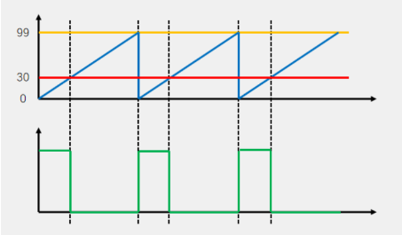
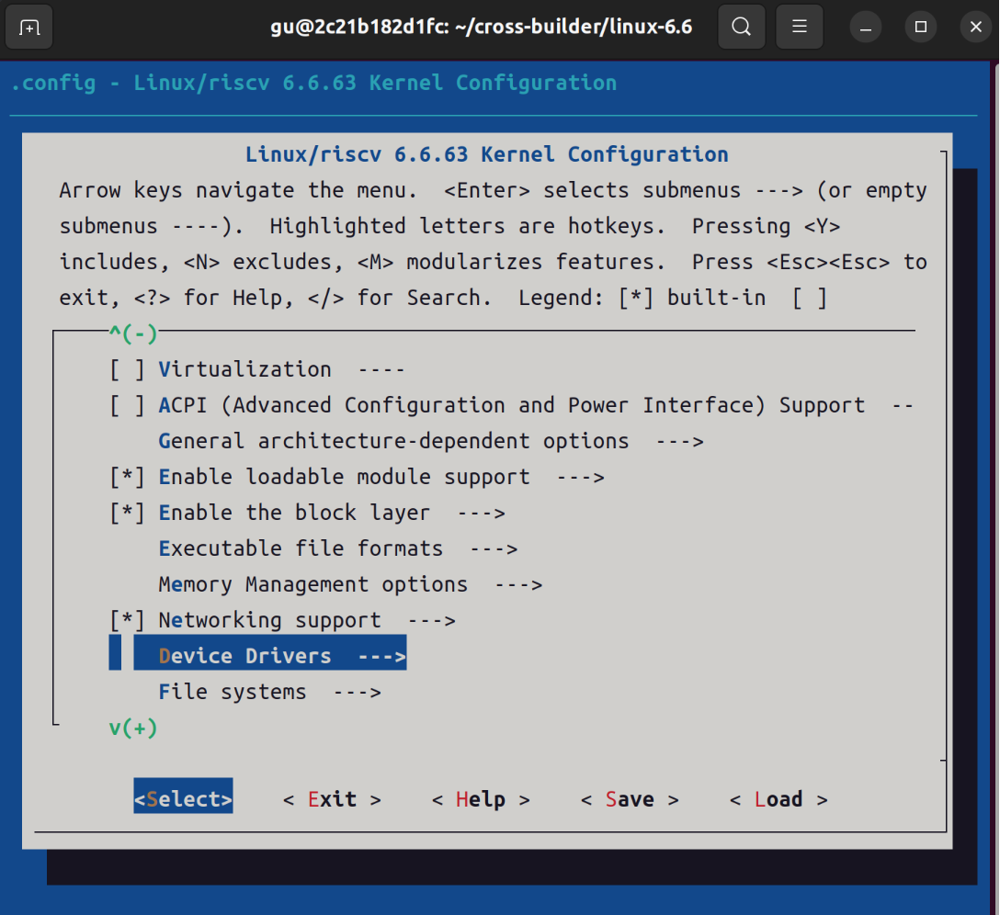
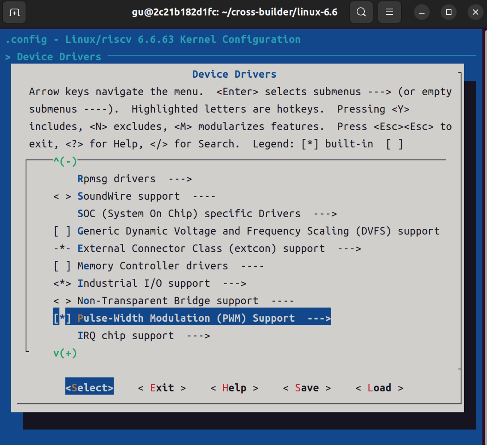
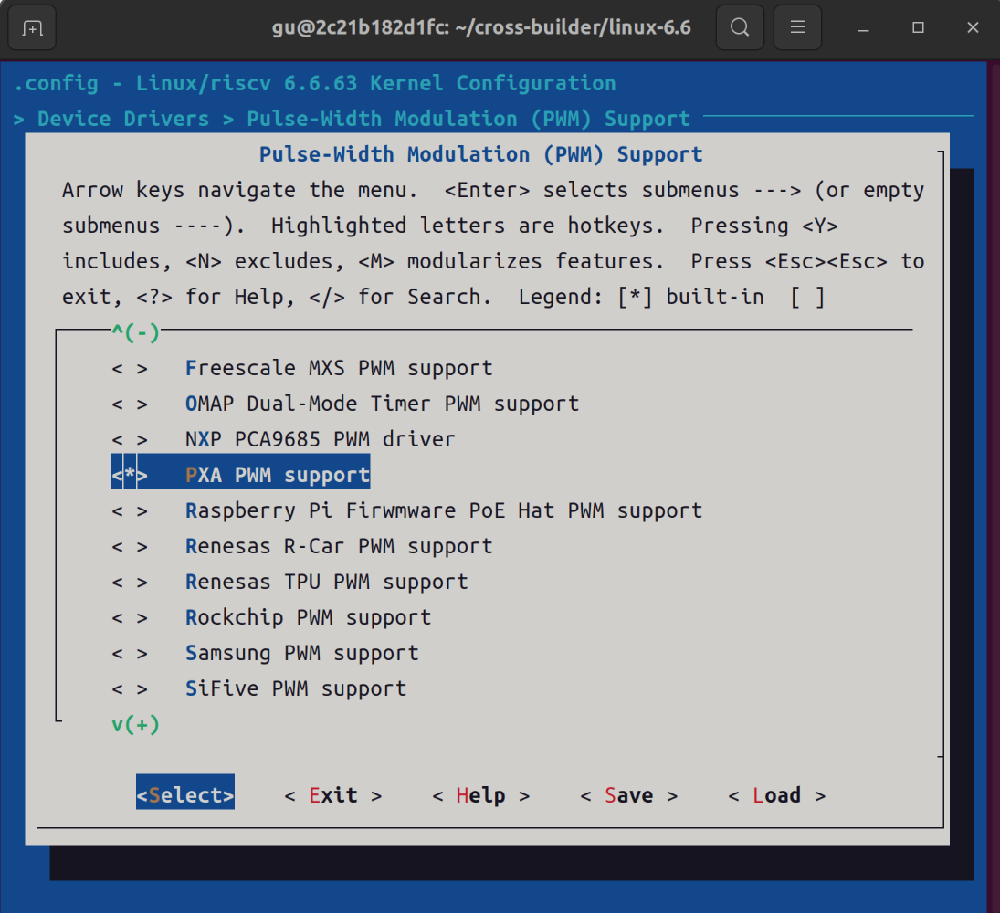
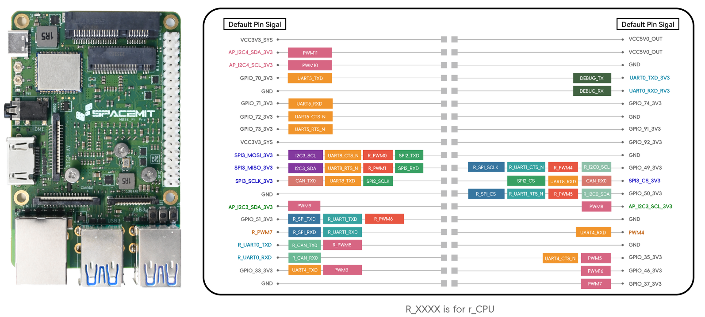
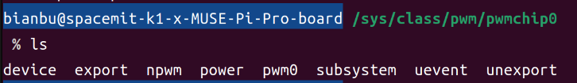
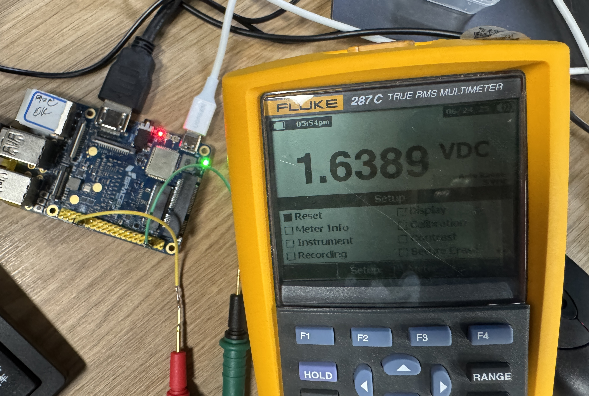

sidebar_position: 6

# Linux PWM 驱动开发实践

## 1. PWM 驱动简析

PWM（脉宽调制，Pulse Width Modulation）是一种常用的信号调制方式，通过周期性地改变信号的高电平和低电平持续时间比例（即占空比），来调节输出的平均电压或功率。PWM 技术广泛应用于电机调速、LED 亮度调节、舵机控制、蜂鸣器音量调节等场景。

### 1.1. PWM 基本原理

PWM 信号是一种矩形脉冲波，其主要参数包括：

- **周期（Period）**：一个完整高低电平循环所需的时间。<br>

- **频率（Frequency）**：单位时间内脉冲周期的个数，频率 = 1/周期。<br>

- **占空比（Duty Cycle）**：高电平持续时间占整个周期的比例，通常用百分比表示。<br>

<center>
    
    <br>
</center>

如上图，在确定周期的情况下，通过调节占空比，可以灵活控制负载的平均电压或功率。例如：

- 占空比越高，LED 越亮，电机转速越快。<br>

- 占空比降低，LED 变暗，电机转速变慢。<br>

PWM 的优点是控制精度高、能量损耗小、抗干扰能力强，因此在嵌入式系统和工业控制领域被广泛采用。

### 1.2. PWM 框架介绍

<center>
    
    <br>
</center>

- **用户空间**：通过/sys/class/pwm接口访问PWM设备，与内核交互。

- **内核空间**：

    **pwm-core**：管理PWM设备，提供API接口。

    **pwm-driver**：具体设备的驱动程序，与硬件交互。

    **pwm-users**：使用PWM核心功能的模块，如背光控制。

- **硬件层**：PWMn，具体的PWM硬件设备。


### 1.3. CONFIG 介绍

CONFIG_PWM 此为内核平台pwm框架提供支持，支持k1 pwm驱动情况下，**默认**为 Y

```bash
Symbol: PWM [=y]
Device Drivers
      -> Pulse-Width Modulation (PWM) Support (PWM [=y])
```

在支持平台层pwm框架后，配置CONFIG_PWM_PXA为Y，默认支持k1 pwm驱动
```bash
Symbol: PWM_PXA [=y]
      ->PXA PWM support (PWM_PXA [=y])
```

接下来演示如何配置，我们可以通过 `menuconfig` 查看， 在 `path/to/your/linux-6.6` 目录下输入如下命令：
```bash
make menuconfig
```

<center>
    
    <br>
</center>

移动键盘下键找到 `Device Drivers` 回车。
<center>
    
    <br>
</center>

移动键盘下键找到 `Pulse-Width Modulation` 回车。
<center>
    
    <br>
</center>

移动键盘下键看到 `PXA PWM support` 已配置。
<center>
    
    <br>
</center>


## 2. 设备树下的PWM控制器节点

Spacemit K1-X 芯片有 20 路主域 PWM 输出（pwm0～pwm19）和 10 路 RCPU 域 PWM 输出（rpwm0～rpwm9），共 30 个 PWM 控制器节点。每个 PWM 控制器在设备树 `path/to/your/linux-6.6/arch/riscv/boot/dts/spacemit/k1-x.dtsi` 中都有独立节点，主域和 RCPU 域节点结构基本一致，仅 reg 地址、时钟、复位资源等参数不同。

以 PWM4 为例，主域 PWM 控制器节点如下：

```dts
pwm4: pwm@d401b000 {
    compatible = "spacemit,k1x-pwm";
    reg = <0x0 0xd401b000 0x0 0x10>;
    #pwm-cells = <1>;                          // 1 个参数，通常为 PWM 通道号
    clocks = <&ccu CLK_PWM4>;
    resets = <&reset RESET_PWM4>;
    k1x,pwm-disable-fd;                        // 关闭死区功能（如有）
    status = "disabled";                       // 默认禁用，实际使用时需使能
};
```

在具体板级设备树 `path/to/your/linux-6.6/arch/riscv/boot/dts/spacemit/k1-x_MUSE-Pi-Pro.dts` 中使能 PWM4 并配置引脚复用：

```dts
&pwm4 {
	pinctrl-names = "default";
	pinctrl-0 = <&pinctrl_pwm4_1>;
	status = "okay";
};
```

引脚复用配置`path/to/your/linux-6.6/arch/riscv/boot/dts/spacemit/k1-x_pinctrl.dtsi`：

```dts
pinctrl_pwm4_1: pwm4_1_grp {
    pinctrl-single,pins = <
        K1X_PADCONF(GPIO_34, MUX_MODE3, (EDGE_NONE | PULL_UP | PAD_1V8_DS2))	/* pwm4 */
    >;
};
```

## 3. PWM 子系统

Linux 内核提供了个 PWM 子系统框架，编写 PWM 驱动的时候一定要符合这个框架。PWM子系统的核心是 pwm_chip 结构体，定义在文件 `path/to/your/linux-6.6/include/linux/pwm.h` 中，定义如下：

```h
struct pwm_chip {
	struct device *dev;
	const struct pwm_ops *ops;
	int base;
	unsigned int npwm;

	struct pwm_device * (*of_xlate)(struct pwm_chip *chip,
					const struct of_phandle_args *args);
	unsigned int of_pwm_n_cells;

	/* only used internally by the PWM framework */
	struct list_head list;
	struct pwm_device *pwms;
};
```

pwm_ops 结构体就是 PWM 外设的各种操作函数集合，编写 PWM 外设驱动的时
候需要开发人员实现。pwm_ops 结构体也定义在 `pwm.h` 头文件中，定义如下：

```h
struct pwm_ops {
	int (*request)(struct pwm_chip *chip, struct pwm_device *pwm);
	void (*free)(struct pwm_chip *chip, struct pwm_device *pwm);
	int (*capture)(struct pwm_chip *chip, struct pwm_device *pwm,
		       struct pwm_capture *result, unsigned long timeout);
	int (*apply)(struct pwm_chip *chip, struct pwm_device *pwm,
		     const struct pwm_state *state);
	int (*get_state)(struct pwm_chip *chip, struct pwm_device *pwm,
			 struct pwm_state *state);
	struct module *owner;
};
```

apply 函数用于配置、启用和禁用 PWM 信号。apply 函数的参数 `state` 包含了所有需要的配置信息，包括占空比、周期、极性等。

```h
struct pwm_state {
	u64 period;
	u64 duty_cycle;
	enum pwm_polarity polarity;
	bool enabled;
	bool usage_power;
};
```

PWM 子系统驱动的核心就是初始化 pwm_chip 结构体各成员变量，然后向内核注册初始化完成以后的 pwm_chip 。这里就要用到 pwmchip_add 函数，此函数定义在 `path/to/your/linux-6.6/drivers/pwm/core.c` 文件中，函数原型如下：

```c
static void of_pwmchip_add(struct pwm_chip *chip)
```
`chip`：要向内核注册的 pwm_chip。

卸载 PWM 驱动的时候需要将前面注册的 pwm_chip 从内核移除掉，这里要用到 pwmchip_remove 函数，函数原型如下：

```c
static void of_pwmchip_remove(struct pwm_chip *chip)
```
`chip`：要移除的 pwm_chip。


## 4. PWM 驱动源码分析

### 4.1. 匹配关系

在 `path/to/your/linux-6.6/drivers/pwm/pwm-pxa.c` 中，我们找到驱动的匹配表 (pwm_of_match)：
```c
#ifdef CONFIG_SOC_SPACEMIT_K1X
	{ .compatible = "spacemit,k1x-pwm", .data = &pwm_id_table[0]},
#endif
```

驱动注册：
```c
static struct platform_driver pwm_driver = {
    .driver = {
        .name = "pxa25x-pwm",
        .of_match_table = pwm_of_match,
        ...
    },
    .probe = pwm_probe,
    .id_table = pwm_id_table,
};
```

注册到内核：
```c
late_initcall(k1x_pwm_driver_init);

static int k1x_pwm_driver_init(void)
{
    return platform_driver_register(&pwm_driver);
}
```

### 4.2. probe 函数

匹配到 compatible 后，内核会调用：
```c
static int pwm_probe(struct platform_device *pdev)
```
probe 函数完成：

- 资源申请（内存映射、时钟、reset 等）<br>

- 初始化 pwm_chip 结构体<br>

- 设置 of_xlate 和 of_pwm_n_cells<br>

- 调用 devm_pwmchip_add 注册 PWM 控制器<br>


## 5. PWM 驱动开发实例与实验流程

> **说明**：本次实验采用**GPIO34 (PWM4)**引脚为例。

PWM 驱动和设备树配置就不需要我们再编写了，MUSE Pi Pro 已经写好了，前面我们也已经进行过分析。

将 MUSE Pi Pro 开发板排针上的 **GPIO34 (右排倒数第5个)** 引脚连接到示波器上，如下图：

<center>
    
    <br>
</center>

通过示波器来查看 PWM 波形图。我们可以直接在用户层来配置 PWM，进入目录 `/sys/class/pwm` 中，如下图所示：

<center>
    
    <br>
</center>

已配置好的 pwmchip0 对应 PWM4，pwmchip1 对应 R_PWM7。

### 5.1. 调出 pwmchip0 的 pwm0 子目录

首先需要调出 pwmchip0 下的 pwm0 目录，否则后续就没法操作了，输入如下命令：

```bash
echo 0 | sudo tee /sys/class/pwm/pwmchip0/export > /dev/null
```

执行完成会在 pwmchip0 目录下生成一个名为 `pwm0` 的子目录，如下图所示：

<center>
    
    <br>
</center>

### 5.2. 设置 PWM4 的频率

注意，这里设置的是周期值，单位为 ns，比如 20KHz 频率的周期就是 50000ns，输入如下命令：

```bash
echo 50000 | sudo tee /sys/class/pwm/pwmchip0/pwm0/period > /dev/null
```

### 5.3. 设置 PWM4 的占空比

这里不能直接设置占空比，而是设置的一个周期的 ON 时间，也就是高电平时间，比如 20KHz 频率下 50% 占空比的 ON 时间就是 25000，输入如下命令：

```bash
echo 25000 | sudo tee /sys/class/pwm/pwmchip0/pwm0/duty_cycle > /dev/null
```

### 5.4. 使能 PWM4

输入如下命令使能 PWM4：
```bash
echo 1 | sudo tee /sys/class/pwm/pwmchip0/pwm0/enable > /dev/null
```

设置完成使用示波器查看波形是否正确，正确的话如下图所示，可以看到一个周期内高低电平所占时间几乎一致。
<center>
    
    <br>
</center>


或者使用万用表测量该引脚的电压，对应约为1.64V (约为3.3V的二分之一) ，如下图所示。
<center>
    
    <br>
</center>