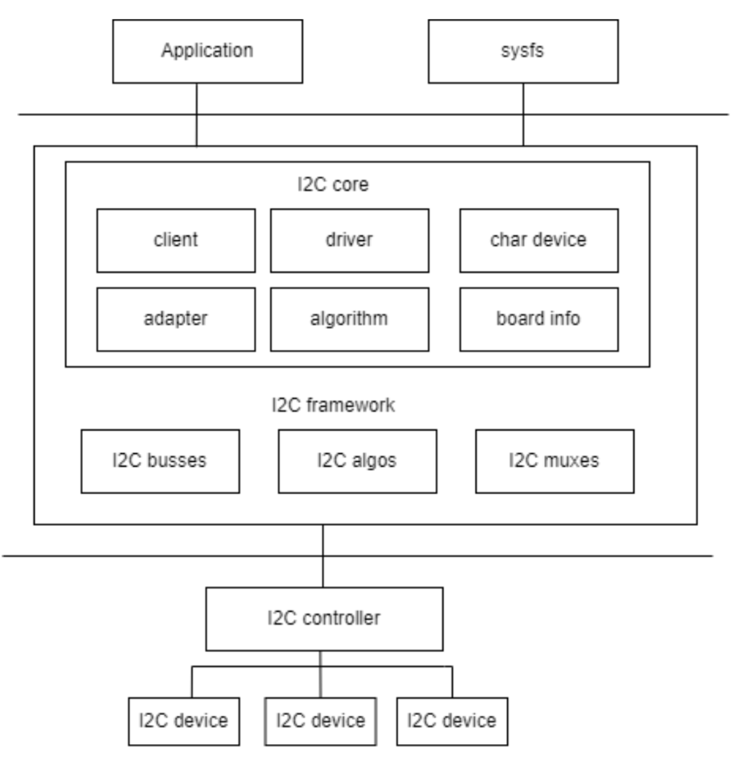
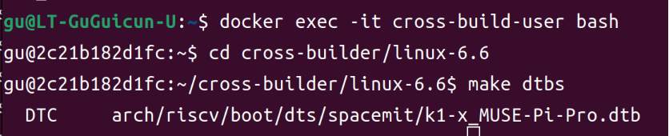
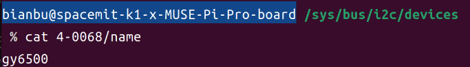
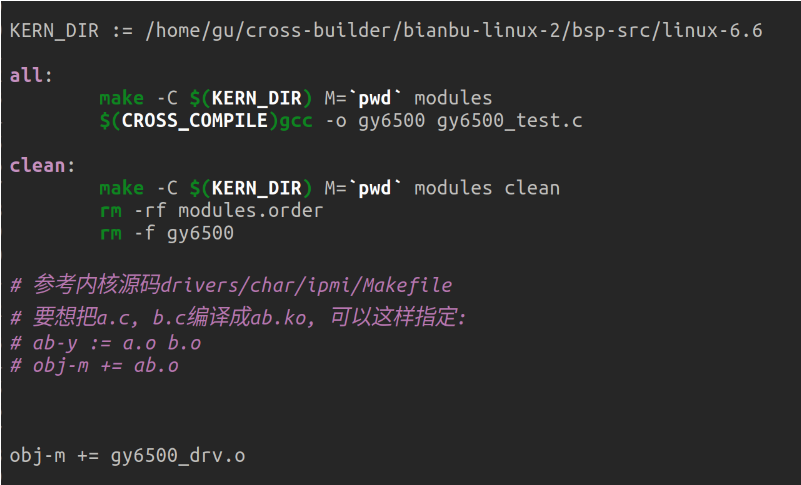
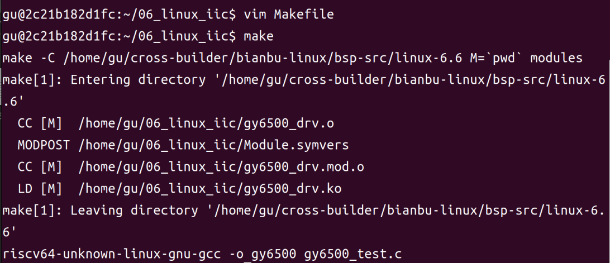
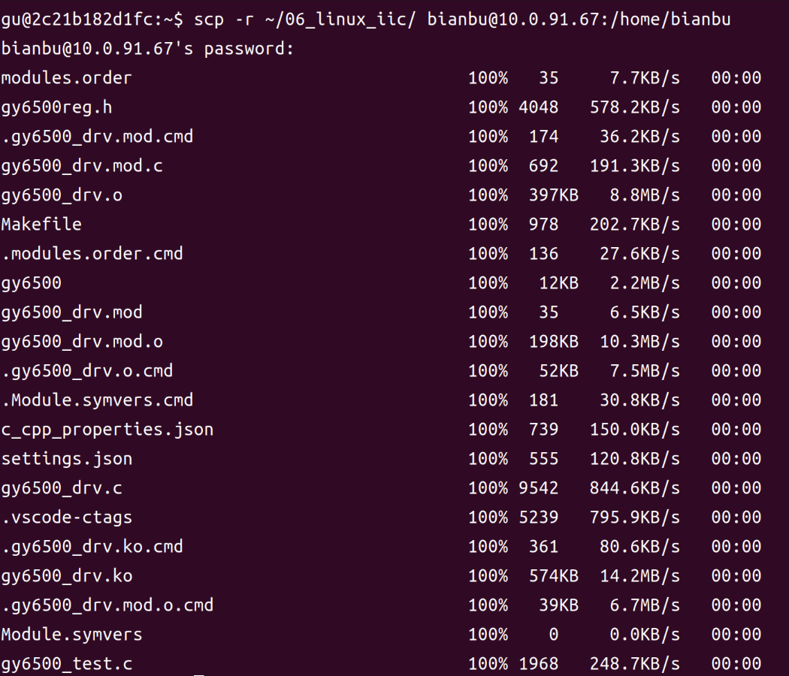
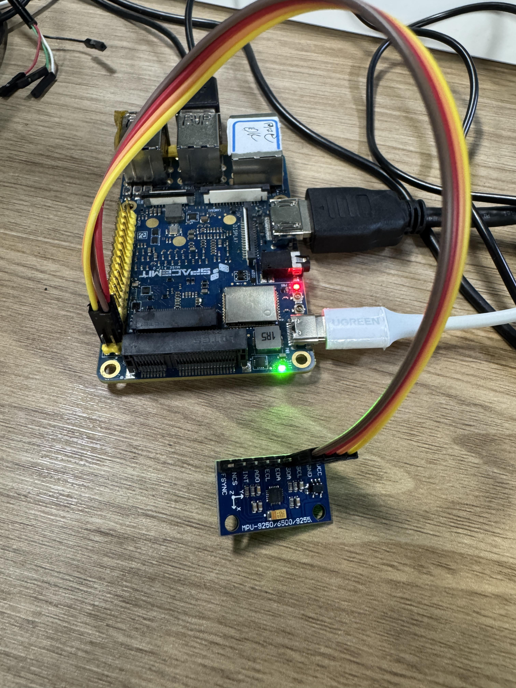
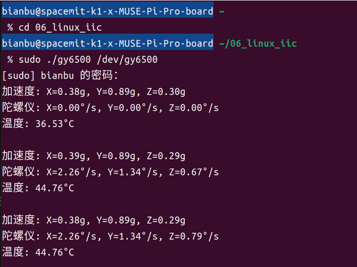

# Linux I2C 设备驱动开发实践

## 1. I2C 基础知识

I2C 总线是一种两线式串行总线，用于连接微控制器及其外围设备，多用于主控制器和从器件间的主从通信，在小数据量场合使用，传输距离短。每个设备都有自己的唯一地址，且I2C为半双工，任意时刻只能有一个主机并进行单行通信。IIC一共有只有两个总线： 一条是双向的串行数据线 SDA，一条是串行时钟线 SCL 。


I2C 总线在传送数据过程中共有三种类型信号， 它们分别是：开始信号、结束信号和应答信号。IIC 总线时序如下图：

<center>
    
    <br>
</center>

- 开始信号：SCL 为高电平时，SDA 由高电平向低电平跳变，开始传送数据。<br>

- 结束信号：SCL 为高电平时，SDA 由低电平向高电平跳变，结束传送数据。<br>

- 应答信号：接收数据的 IC 在接收到 8bit 数据后，向发送数据的 IC 发出特定的低电平脉冲，表示已收到数据。CPU 向受控单元发出一个信号后，等待受控单元发出一个应答信号，CPU 接收到应答信号后，根据实际情况作出是否继续传递信号的判断。若未收到应答信号，由判断为受控单元出现故障。<br>


## 2. Linux I2C 体系结构

<center>
    
    <br>
</center>

Linux 中 I2C 体系结构上图所示，共分成了三个层次：

1. **用户空间**，包括所有使用I2C 设备的应用程序；<br>

2. **内核**，也就是驱动部分；<br>

3. **硬件**，指实际物理设备，包括了 I2C 控制器和 I2C 外设。<br>

其中，Linux 内核中的 I2C 驱动程序从逻辑上主要实现：

- I2C framework 提供一种 “访问 I2C slave devices” 的方法。由于这些 slave devices 由 I2C controller 控制，因而主要由 I2C controller 驱动实现这一目标。<br>

- 在 I2C framework 内部，有 I2C core、I2C busses、I2C algos 和 I2C muxes 四个模块。<br>

    - **I2C core** 使用 I2C adapter 和 I2C algorithm 两个子模块抽象 I2C controller 的功能。<br>

    - **I2C busses** 是各个 I2C controller drivers 的集合，位于 drivers/i2c/busses/目录下， i2c-k1.c。<br>

    - **I2C algos** 包含了一些通用的 I2C algorithm，所谓的 algorithm，是指 I2C 协议的通信方法，用于实现 I2C 的 read/write 指令。<br>

## 3. Linux I2C 驱动架构概述

Linux I2C 驱动分为两大类：

**I2C 总线驱动（适配器驱动）**

   - 负责 SoC 芯片上的 I2C 控制器（适配器）的初始化和管理<br>

   - 实现 I2C 总线的底层读写、时序控制等<br>

   - 常见驱动如 `i2c-designware`、`i2c-imx` 等<br>

**I2C 设备驱动**

   - 负责挂载在 I2C 总线上的具体外设（如 EEPROM、传感器、触摸屏等）<br>

   - 通过 I2C 总线驱动提供的接口与硬件通信<br>

I2C 总线驱动和设备驱动通过内核 I2C 框架解耦，便于不同硬件平台和多种 I2C 设备的灵活组合。<br>


## 4. 关键特性

- 支持9组I2C接口<br>

- 主机模式下支持DMA数据传输<br>

- 支持100k / 400k/ 1.5M三种速度模式<br>

- 多主机模式下支持总线仲裁<br>


## 5. I2C 总线驱动开发

### 5.1 核心数据结构

#### 5.1.1. i2c_adapter 结构体

`i2c_adapter` 抽象表示一个 I2C 控制器，定义在 `path/to/your/linux-6.6/include/linux/i2c.h` 中：

```c
struct i2c_adapter {
    struct module *owner;
    unsigned int class;                 /* 设备类别，允许探测的类型 */
    const struct i2c_algorithm *algo;   /* 总线访问算法 */
    void *algo_data;

    /* 所有设备共用的数据字段 */
    struct rt_mutex bus_lock;

    int timeout;                        /* 超时时间，单位为jiffies */
    int retries;                        /* 重试次数 */
    struct device dev;                  /* 适配器设备 */

    int nr;                             /* 总线编号 */
    char name[48];                      /* 适配器名称 */
    // ...其他字段
};
```

#### 5.1.2. i2c_algorithm 结构体

`i2c_algorithm` 定义了 I2C 总线的数据传输方法，也在 `path/to/your/linux-6.6/include/linux/i2c.h` 中：

```c
struct i2c_algorithm {
    /* 标准I2C传输函数 */
    int (*master_xfer)(struct i2c_adapter *adap,
                      struct i2c_msg *msgs,
                      int num);

    /* SMBus传输函数 */
    int (*smbus_xfer)(struct i2c_adapter *adap, u16 addr,
                     unsigned short flags, char read_write,
                     u8 command, int size, union i2c_smbus_data *data);

    /* 确定适配器支持的功能 */
    u32 (*functionality)(struct i2c_adapter *adap);

    // ...其他函数
};
```

其中 `master_xfer` 是最核心的函数，实现与 I2C 设备的通信。

### 5.2 注册与注销 I2C 适配器

```c
/* 注册I2C适配器 */
int i2c_add_adapter(struct i2c_adapter *adapter);       // 使用动态总线号
int i2c_add_numbered_adapter(struct i2c_adapter *adap); // 使用静态总线号

/* 注销I2C适配器 */
void i2c_del_adapter(struct i2c_adapter *adap);
```

### 5.3 I2C 控制器的设备树表示

在 `path/to/your/linux-6.6/arch/riscv/boot/dts/spacemit/k1-x.dtsi` 中定义了9个 I2C 控制器，分别从 i2c0 ~ i2c8，此外还有一个ri2c0，它是 RCPU 的 I2C 控制器。以 i2c0 为例：

```dts
i2c0: i2c@d4010800 {
    compatible = "spacemit,k1x-i2c";
    spacemit,adapter-id = <0>;
    reg = <0x0 0xd4010800 0x0 0x38>;
    #address-cells = <1>;
    #size-cells = <0>;
    interrupt-parent = <&intc>;
    interrupts = <36>;
    clocks = <&ccu CLK_TWSI0>;
    resets = <&reset RESET_TWSI0>;
    spacemit,dma-disable;
    spacemit,i2c-master-code = /bits/ 8 <0x0e>;
    spacemit,i2c-clk-rate = <32000000>;
    spacemit,i2c-lcr = <0x82c469f>;
    spacemit,i2c-wcr = <0x142a>;
    /* apb clock: 26MHz or 52MHz */
    spacemit,apb_clock = <52000000>;
    power-domains = <&power K1X_PMU_BUS_PWR_DOMAIN>;
    cpuidle,pm-runtime,sleep;
    interconnects = <&dram_range4>;
    interconnect-names = "dma-mem";
    status = "disabled";
};
```

通过 compatible 属性值 `spacemit,k1x-i2c` 可以在Linux 源码中搜索这两个字符串即可找到对应的驱动文件。MUSE Pi Pro 的 I2C 适配器驱动文件为 `path/to/your/linux-6.6/drivers/i2c/busses/i2c-k1x.c`，在文件中有如下内容：

```c
static const struct of_device_id spacemit_i2c_dt_match[] = {
    {
        .compatible = "spacemit,k1x-i2c",
    },
    {}
};

MODULE_DEVICE_TABLE(of, spacemit_i2c_dt_match);

static struct platform_driver spacemit_i2c_driver = {
	.probe  = spacemit_i2c_probe,
	.remove = spacemit_i2c_remove,
	.shutdown = spacemit_i2c_shutdown,
	.driver = {
		.name		= "i2c-spacemit-k1x",
		/* .pm             = &spacemit_i2c_pm_ops, */
		.of_match_table	= spacemit_i2c_dt_match,
	},
};

static int __init spacemit_i2c_init(void)
{
	register_restart_handler(&spacemit_i2c_sys_nb);
	i2c_poweroff_handler = register_sys_off_handler(SYS_OFF_MODE_POWER_OFF,
			SYS_OFF_PRIO_HIGH,
			spacemit_i2c_notifier_poweroff_call,
			NULL);

	return platform_driver_register(&spacemit_i2c_driver);
}

static void __exit spacemit_i2c_exit(void)
{
	platform_driver_unregister(&spacemit_i2c_driver);
	unregister_restart_handler(&spacemit_i2c_sys_nb);
	unregister_sys_off_handler(i2c_poweroff_handler);
}

subsys_initcall(spacemit_i2c_init);
module_exit(spacemit_i2c_exit);

```

从上述代码可以看出，MUSE Pi Pro 的 I2C 适配器驱动是个标准的 platform 驱动，也就是说，虽然 I2C 总线为别的设备提供了一种总线驱动框架，但是 I2C 适配器却是 platform 驱动。<br>

在设备和驱动匹配成功以后 spacemit_i2c_probe 函数就会执行，spacemit_i2c_probe 函数就会完成 I2C 适配器初始化工作。<br>
spacemit_i2c_probe 函数内容如下 (有省略)：

```c
static int spacemit_i2c_probe(struct platform_device *pdev)
{
    struct spacemit_i2c_dev *spacemit_i2c;
    struct device_node *dnode = pdev->dev.of_node;
    int ret = 0;

    // 1. 申请内存并初始化私有数据结构
    spacemit_i2c = devm_kzalloc(&pdev->dev, sizeof(struct spacemit_i2c_dev), GFP_KERNEL);
    if (!spacemit_i2c)
        return -ENOMEM;
    spacemit_i2c->dev = &pdev->dev;
    platform_set_drvdata(pdev, spacemit_i2c);
    mutex_init(&spacemit_i2c->mtx);

    // 2. 复位控制器（可选，部分平台需要）
    spacemit_i2c->resets = devm_reset_control_get_optional(&pdev->dev, NULL);
    reset_control_assert(spacemit_i2c->resets);
    udelay(200);
    reset_control_deassert(spacemit_i2c->resets);

    // 3. 解析设备树参数（如地址、中断、DMA等）
    ret = spacemit_i2c_parse_dt(pdev, spacemit_i2c);

    // 4. 获取寄存器资源并映射
    ret = of_address_to_resource(dnode, 0, &spacemit_i2c->resrc);
    spacemit_i2c->mapbase = devm_ioremap_resource(spacemit_i2c->dev, &spacemit_i2c->resrc);

    // 5. 获取中断号并注册中断处理函数
    spacemit_i2c->irq = platform_get_irq(pdev, 0);
    ret = devm_request_irq(spacemit_i2c->dev, spacemit_i2c->irq, spacemit_i2c_int_handler,
            IRQF_NO_SUSPEND, dev_name(spacemit_i2c->dev), spacemit_i2c);

    // 6. 获取并使能时钟
    spacemit_i2c->clk = devm_clk_get(spacemit_i2c->dev, NULL);
    clk_prepare_enable(spacemit_i2c->clk);

    // 7. 初始化 i2c_adapter 结构体
    i2c_set_adapdata(&spacemit_i2c->adapt, spacemit_i2c);
    spacemit_i2c->adapt.owner = THIS_MODULE;
    spacemit_i2c->adapt.algo = &spacemit_i2c_algrtm; // 指定传输算法
    spacemit_i2c->adapt.dev.parent = spacemit_i2c->dev;
    spacemit_i2c->adapt.nr = pdev->id;
    spacemit_i2c->adapt.dev.of_node = dnode;
    strlcpy(spacemit_i2c->adapt.name, "spacemit-i2c-adapter", sizeof(spacemit_i2c->adapt.name));

    // 8. 注册 i2c_adapter 到内核
    ret = i2c_add_numbered_adapter(&spacemit_i2c->adapt);
}
```

### 5.4. I2C 传输函数分析

在 probe 函数中初始化 i2c_adapter，设置 i2c_algorithm 为 spacemit_i2c_algrtm，最后向 Linux 内核注册 i2c_adapter。spacemit_i2c_algrtm 包含 I2C 适配器与 I2C 设备的通信函数 master_xfer，spacemit_i2c_algrtm 结构体定义如下：

```c
static const struct i2c_algorithm spacemit_i2c_algrtm = {
    .master_xfer    = spacemit_i2c_xfer,
    .functionality  = spacemit_i2c_func,
};
```

重点来看 spacemit_i2c_xfer 函数，因为最终就是通过此函数来完成与 I2C 设备通信的。内容如下 (有省略)：

```c
static int spacemit_i2c_xfer(struct i2c_adapter *adapt, struct i2c_msg msgs[], int num)
{
    struct spacemit_i2c_dev *spacemit_i2c = i2c_get_adapdata(adapt);
    int ret = 0, xfer_try = 0;
    bool clk_directly = false;

    // 1. 上锁，准备传输参数
    mutex_lock(&spacemit_i2c->mtx);
    spacemit_i2c->msgs = msgs;
    spacemit_i2c->num = num;

    // 2. 电源管理：确保时钟可用
    if (!spacemit_i2c->clk_always_on) {
        ret = pm_runtime_get_sync(spacemit_i2c->dev);
        if (ret < 0) {
            // 若PM不可用，直接使能时钟
            if (ret == -EACCES) {
                clk_directly = true;
                clk_enable(spacemit_i2c->clk);
            } else {
                goto err_runtime;
            }
        }
    }

xfer_retry:
    // 3. 控制器状态检查与初始化
    if (spacemit_i2c_read_reg(spacemit_i2c, REG_CR) != spacemit_i2c->i2c_ctrl_reg_value)
        spacemit_i2c_reset(spacemit_i2c);

    spacemit_i2c_choose_xfer_mode(spacemit_i2c); // 选择传输模式
    spacemit_i2c_unit_init(spacemit_i2c);        // 控制器初始化
    spacemit_i2c_clear_int_status(spacemit_i2c, SPACEMIT_I2C_INT_STATUS_MASK); // 清中断
    spacemit_i2c_init_xfer_params(spacemit_i2c); // 初始化传输参数
    spacemit_i2c_mark_rw_flag(spacemit_i2c);     // 标记读写方向
    reinit_completion(&spacemit_i2c->complete);  // 重新初始化完成量
    spacemit_i2c_enable(spacemit_i2c);           // 使能I2C控制器

    // 4. 检查总线状态
    ret = spacemit_i2c_recover_bus_busy(spacemit_i2c);
    if (ret)
        goto timeout_xfex;

    // 5. 数据传输（根据模式选择）
    if (spacemit_i2c->xfer_mode == SPACEMIT_I2C_MODE_INTERRUPT)
        ret = spacemit_i2c_byte_xfer(spacemit_i2c);
    else if (spacemit_i2c->xfer_mode == SPACEMIT_I2C_MODE_FIFO)
        ret = spacemit_i2c_fifo_xfer(spacemit_i2c);
    else
        ret = spacemit_i2c_dma_xfer(spacemit_i2c);

    // 6. 等待传输完成（中断模式下）
    if (spacemit_i2c->xfer_mode == SPACEMIT_I2C_MODE_INTERRUPT) {
        unsigned long time_left = wait_for_completion_timeout(&spacemit_i2c->complete, spacemit_i2c->timeout);
        if (time_left == 0) {
            spacemit_i2c_bus_reset(spacemit_i2c);
            spacemit_i2c_reset(spacemit_i2c);
            ret = -ETIMEDOUT;
            goto timeout_xfex;
        }
    }

timeout_xfex:
    // 7. 关闭I2C控制器
    spacemit_i2c_disable(spacemit_i2c);

    // 8. 错误处理与重试
    if (ret < 0 && (ret == -ETIMEDOUT || ret == -EAGAIN) && ++xfer_try <= spacemit_i2c->drv_retries) {
        usleep_range(150, 200);
        ret = 0;
        goto xfer_retry;
    }

err_runtime:
    // 9. 时钟与电源管理收尾
    if (clk_directly)
        clk_disable(spacemit_i2c->clk);
    if (!spacemit_i2c->clk_always_on) {
        pm_runtime_mark_last_busy(spacemit_i2c->dev);
        pm_runtime_put_autosuspend(spacemit_i2c->dev);
    }
    mutex_unlock(&spacemit_i2c->mtx);

    // 返回成功传输的消息数或错误码
    return ret < 0 ? ret : num;
}
```


## 6. I2C 设备驱动开发

### 6.1 核心数据结构

#### 6.1.1. i2c_client 结构体

`i2c_client` 结构体描述 I2C 设备的信息，每检测到一个 I2C 设备就会为其分配一个 `i2c_client` 实例。定义在 `path/to/your/linux-6.6/include/linux/i2c.h` 中：

```c
struct i2c_client {
    unsigned short flags;              /* 设备标志 */
    unsigned short addr;               /* 芯片地址，7位，存储在低7位 */
    char name[I2C_NAME_SIZE];          /* 设备名称 */
    struct i2c_adapter *adapter;       /* 设备连接的I2C适配器 */
    struct device dev;                 /* 设备结构体 */
    int irq;                           /* 中断号 */
    struct list_head detected;
    // ...其他字段
};
```

#### 6.1.2. i2c_driver 结构体

`i2c_driver` 结构体描述 I2C 设备驱动的信息，类似于`platform_driver`，定义在 `path/to/your/linux-6.6/include/linux/i2c.h` 中：

```c
struct i2c_driver {
    unsigned int class;

    /* 标准驱动模型接口 */
    int (*probe)(struct i2c_client *, const struct i2c_device_id *);
    int (*remove)(struct i2c_client *);

    /* 其他回调函数 */
    void (*shutdown)(struct i2c_client *);
    void (*alert)(struct i2c_client *, unsigned int data);
    int (*command)(struct i2c_client *client, unsigned int cmd, void *arg);

    struct device_driver driver;       /* 设备驱动结构体 */
    const struct i2c_device_id *id_table;  /* 传统匹配ID表 */

    // ...其他字段
};
```

### 6.2 I2C 设备驱动注册与注销

对于I2C 设备驱动编写，重点工作就是构建 i2c_driver，构建完之后需要向内核注册这个 i2c_driver，注册 I2C 设备驱动使用以下函数：
```c
/* 注册I2C驱动 */
int i2c_register_driver(struct module *owner, struct i2c_driver *driver);

/* 简化版注册宏 */
#define i2c_add_driver(driver) i2c_register_driver(THIS_MODULE, driver)
```
`owner`：一般为 THIS_MODULE。
`driver`：要注册的 i2c_driver。

```c
/* 注销I2C驱动 */
void i2c_del_driver(struct i2c_driver *driver);
```

### 6.3 I2C 设备驱动开发流程

此处结合 GY6500 六轴传感器驱动程序进行说明。

#### 6.3.1. 读写函数
```c
// 读函数
static int gy6500_read_regs(struct gy6500_dev *dev, u8 reg, void *val, int len)
{
	int ret;
	struct i2c_msg msg[2];
	struct i2c_client *client = (struct i2c_client *)dev->private_data;

	/* msg[0]为发送要读取的首地址 */
	msg[0].addr = client->addr;			/* gy6500地址 */
	msg[0].flags = 0;					/* 标记为发送数据 */
	msg[0].buf = &reg;					/* 读取的首地址 */
	msg[0].len = 1;						/* reg长度*/

	/* msg[1]读取数据 */
	msg[1].addr = client->addr;			/* gy6500地址 */
	msg[1].flags = I2C_M_RD;			/* 标记为读取数据*/
	msg[1].buf = val;					/* 读取数据缓冲区 */
	msg[1].len = len;					/* 要读取的数据长度*/

	ret = i2c_transfer(client->adapter, msg, 2);
	if(ret == 2) {
		ret = 0;
	} else {
		printk("i2c rd failed=%d reg=%06x len=%d\n",ret, reg, len);
		ret = -EREMOTEIO;
	}
	return ret;
}

// 写函数
static s32 gy6500_write_regs(struct gy6500_dev *dev, u8 reg, u8 *buf, u8 len)
{
	u8 b[256];
	struct i2c_msg msg;
	struct i2c_client *client = (struct i2c_client *)dev->private_data;

	b[0] = reg;					/* 寄存器首地址 */
	memcpy(&b[1],buf,len);		/* 将要写入的数据拷贝到数组b里面 */

	msg.addr = client->addr;	/* gy6500地址 */
	msg.flags = 0;				/* 标记为写数据 */

	msg.buf = b;				/* 要写入的数据缓冲区 */
	msg.len = len + 1;			/* 要写入的数据长度 */

	return i2c_transfer(client->adapter, &msg, 1);
}
```

#### 6.3.2. 打开设备函数
```c
static int gy6500_open(struct inode *inode, struct file *filp)
{
	filp->private_data = &gy6500dev;

	/* 初始化GY6500 */
	gy6500_write_reg(&gy6500dev, MPU_PWR_MGMT1_REG, 0x80);	/* 复位GY6500 */
	mdelay(100);                                     /* 等待复位完成 */
	gy6500_write_reg(&gy6500dev, MPU_PWR_MGMT1_REG, 0x00);	/* 唤醒GY6500 */

	/* 设置陀螺仪和加速度范围 */
	gy6500_write_reg(&gy6500dev, MPU_GYRO_CFG_REG, 0x18);   /* 陀螺仪量程：±2000dps */
	gy6500_write_reg(&gy6500dev, MPU_ACCEL_CFG_REG, 0x18);  /* 加速度量程：±16g */

	/* 设置采样率 */
	gy6500_write_reg(&gy6500dev, MPU_SAMPLE_RATE_REG, 0x07); /* 采样率：1000/(1+7)=125Hz */

	/* 配置低通滤波器 */
	gy6500_write_reg(&gy6500dev, MPU_CFG_REG, 0x06);         /* 低通滤波器：5Hz */

	return 0;
}
```

#### 6.3.3. 定义匹配表

```c
/* 传统匹配方式ID列表 */
static const struct i2c_device_id gy6500_id[] = {
	{"bianbusense,gy6500", 0},
	{}
};

/* 设备树匹配列表 */
static const struct of_device_id gy6500_of_match[] = {
	{ .compatible = "bianbusense,gy6500" },
	{ /* Sentinel */ }
};
```

#### 6.3.4. 实现 probe/remove 等回调函数

```c
static int gy6500_probe(struct i2c_client *client)
{
    /* 1、构建设备号 */
    if (gy6500dev.major) {
        gy6500dev.devid = MKDEV(gy6500dev.major, 0);
        register_chrdev_region(gy6500dev.devid, GY6500_CNT, GY6500_NAME);
    } else {
        alloc_chrdev_region(&gy6500dev.devid, 0, GY6500_CNT, GY6500_NAME);
        gy6500dev.major = MAJOR(gy6500dev.devid);
    }

    /* 2、注册设备 */
    cdev_init(&gy6500dev.cdev, &gy6500_ops);
    cdev_add(&gy6500dev.cdev, gy6500dev.devid, GY6500_CNT);

    /* 3、创建类 */
    gy6500dev.class = class_create(GY6500_NAME);
    if (IS_ERR(gy6500dev.class)) {
        return PTR_ERR(gy6500dev.class);
    }

    /* 4、创建设备 */
    gy6500dev.device = device_create(gy6500dev.class, NULL, gy6500dev.devid, NULL, GY6500_NAME);
    if (IS_ERR(gy6500dev.device)) {
        return PTR_ERR(gy6500dev.device);
    }

    /* 5、保存I2C客户端数据 */
    gy6500dev.private_data = client;

    return 0;
}

static void gy6500_remove(struct i2c_client *client)
{
    /* 删除设备 */
    cdev_del(&gy6500dev.cdev);
    unregister_chrdev_region(gy6500dev.devid, GY6500_CNT);

    /* 注销掉类和设备 */
    device_destroy(gy6500dev.class, gy6500dev.devid);
    class_destroy(gy6500dev.class);
}
```

#### 6.3.5. 构建 i2c_driver 结构体

```c
/* i2c驱动结构体 */
static struct i2c_driver gy6500_driver = {
    .probe = gy6500_probe,
    .remove = gy6500_remove,
    .driver = {
        .owner = THIS_MODULE,
        .name = "gy6500",
        .of_match_table = gy6500_of_match,
    },
    .id_table = gy6500_id,
};
```

## 7. I2C 通信常用 API

### 7.1 I2C 设备通信函数

probe 函数里面初始化 I2C 设备，要初始化 I2C 设备就必须能够对 I2C 设备寄存器进行读写操作，这里就要用到 i2c_transfer 函数了。i2c_transfer 函数最终会调用 I2C 适配器中 i2c_algorithm 里面的 master_xfer 函数

```c
/* 原始传输 */
int i2c_transfer(struct i2c_adapter *adap, struct i2c_msg *msgs, int num);
```
函数参数和返回值含义如下：<br>

`adap`：所使用的 I2C 适配器，i2c_client 会保存其对应的 i2c_adapter。<br>

`msgs`：I2C 要发送的一个或多个消息。<br>

`num`：消息数量，也就是 msgs 的数量。<br>

返回值：负值，失败，其他非负值，发送的 msgs 数量。<br>


### 7.2 I2C 消息结构体

```c
struct i2c_msg {
    __u16 addr;     /* 从机地址 */
    __u16 flags;    /* 读/写标志等 */
    __u16 len;      /* 消息长度 */
    __u8 *buf;      /* 数据缓冲区 */
};
```

## 8. I2C 设备驱动开发实例

> **说明**：本次实验采用 **GPIO40、GPIO41 (即i2c4)** 与六轴传感器 (GY6500) 进行数据读写。

### 8.1. 查看模块地址

下载 i2c 工具包：[i2ctools.zip](code/i2ctools.zip)

执行下面命令解压
```bash
unzip i2ctools.zip -d ~/
```

执行检测工具
```bash
sudo ./i2cdetect -yr 4 # 其中 4 是总线编号（比如 i2c-4）
```

输出如下图：
<center>
    
    <br>
</center>

表示我们的模块地址是 `0x68` 。


### 8.2. 设备树配置

打开设备树 `path/to/your/linux-6.6/arch/riscv/boot/dts/spacemit/k1-x_pinctrl.dtsi` 查看引脚复用功能配置，默认已复用 I2C 功能，内容如下：
```dts
pinctrl_i2c4_0: i2c4_0_grp {
    pinctrl-single,pins =<
        K1X_PADCONF(GPIO_40, MUX_MODE2, (EDGE_NONE | PULL_UP | PAD_1V8_DS2))	/* i2c4_scl */
        K1X_PADCONF(GPIO_41, MUX_MODE2, (EDGE_NONE | PULL_UP | PAD_1V8_DS2))	/* i2c4_sda */
    >;
};
```

使用设备树的时候 I2C 设备信息通过创建相应的节点就行了，所以我们在 i2c4 节点下创建子节点，然后在这个子节点内描述 GY6500 这个芯片的相关信息。打开 `path/to/your/linux-6.6/arch/riscv/boot/dts/spacemit/k1-x_MUSE-Pi-Pro.dts` 这个设备树文件，然后找到如下内容：

```dts
&i2c4 {
	pinctrl-names = "default";
	pinctrl-0 = <&pinctrl_i2c4_0>;
	status = "okay";
};
```

在 i2c4 节点下进行配置，如下：
```dts
&i2c4 {
	pinctrl-names = "default";
	pinctrl-0 = <&pinctrl_i2c4_0>;
	status = "okay";

	gy6500@68 {
		compatible = "bianbusense,gy6500";
		reg = <0x68>;
		spacemit,i2c-fast-mode;
		spacemit,i2c-addr-7bit;
		status = "okay";
	};
};
```

启动 Docker。
```bash
docker start cross-build-user
docker exec -it cross-build-user bash
```

进入 `linux-6.6` 目录重新编译 dtb 文件。
```bash
cd cross-builder/linux-6.6
make dtbs
```
<center>
    
    <br>
</center>


在 MUSE Pi Pro 上执行下面命令查看 ip：
```bash
ifconfig
```

如下图所示，ip 为 `10.0.91.67` 。
<center>
    
    <br>
</center>


执行下面命令将编译好的 k1-x_MUSE-Pi-Pro.dtb 文件传输到 MUSE Pi Pro 板子上。

> **注**：下面的 `bianbu@10.0.91.67` 根据上面结果替换成对应的 ip 。

```bash
sudo scp arch/riscv/boot/dts/spacemit/k1-x_MUSE-Pi-Pro.dtb bianbu@10.0.91.67:/home/bianbu
```

首次通过 ssh 连接 MUSE Pi Pro 会弹出连接确认，键盘输入 yes ，接着再输入密码回车即可。

<center>
    
    <br>
</center>


在 MUSE Pi Pro 上执行以下命令进行替换：
```bash
sudo cp ~/k1-x_MUSE-Pi-Pro.dtb /boot/spacemit/6.6.63
```

将 MUSE Pi Pro 进行重启：
```bash
sudo reboot
```


使用新的设备树启动 Linux 内核之后，在 `/sys/bus/i2c/devices` 目录下存放着所有 I2C 设备，如果设备树修改正确的话，会在 `/sys/bus/i2c/devices` 目录下看到一个名为 `4-0068` 的子目录，如图所示：
<center>
    
    <br>
</center>

上图的 `4-0068` 就是 GY6500 的设备目录， `68` 就是 GY6500 器件地址。进入 `4-0068` 目录，可以看到 `name` 文件，`name` 就是此设备名字，在这里就是 `gy6500` ，如图所示：

<center>
    
    <br>
</center>


### 8.3. 运行和测试

#### 8.3.1. 编译驱动程序

**下载源码压缩包**

[iic_test.zip](code/06_iic_test.zip)

> **补充**：源码文件具体作用请看压缩包里的 README.md 文件。


**解压**
```bash
unzip 06_linux_iic.zip -d ~/
```

**编译**

驱动文件需要在Ubuntu上进行编译，因为SDK在Ubuntu上。修改Makefile里的内核路径为实际路径。

```bash
cd ~/06_linux_iic/
vim Makefile
```

修改``` KERN_DIR ``` 的路径，如图所示：

<center>
    
    <br>
</center>

执行以下命令，编译驱动

```bash
make
```
<center>
    
    <br>
</center>


编译成功以后就会生成一个名为 `gy6500_drv.ko` 的驱动模块文件。
<center>
    
    <br>
</center>

#### 8.3.2. 加载驱动

将上一小节编译好的 `06_linux_iic` 文件夹拷贝到 MUSE Pi Pro 开发板上，执行下面命令。

> **注**：下面的 `bianbu@10.0.91.67` 根据上面结果替换成对应的 ip 。

```bash
scp -r ~/06_linux_iic/ bianbu@10.0.91.67:/home/bianbu
```
<center>
    
    <br>
</center>


在开发板上进入该目录并输入如下命令加载 `gy6500_drv.ko` 这个驱动模块。
```bash
cd 06_linux_iic/
sudo insmod gy6500_drv.ko
```

#### 8.3.3. 硬件连接

将 MUSE Pi Pro 与 gy6500 模块进行硬件连接。

<center>
    
    <br>
</center>

<center>
    
    <br>
</center>


#### 8.3.4. 运行测试

当驱动模块加载成功以后使用 `gy6500_test` 来测试，输入如下命令：
```bash
sudo ./gy6500 /dev/gy6500
```

应用程序会不断的从 gy6500 中读取数据，然后输出到终端上，如图所示：
<center>
    
    <br>
</center>

可以移动旋转六轴模块观察打印数据是否变化。