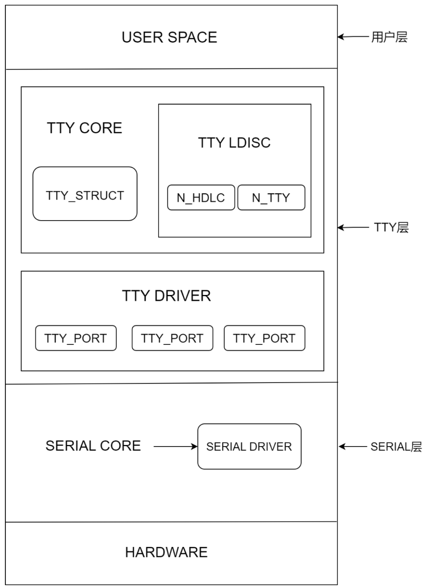
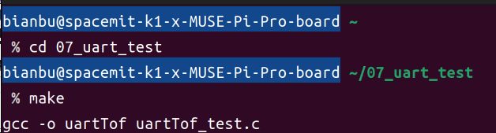
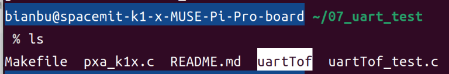
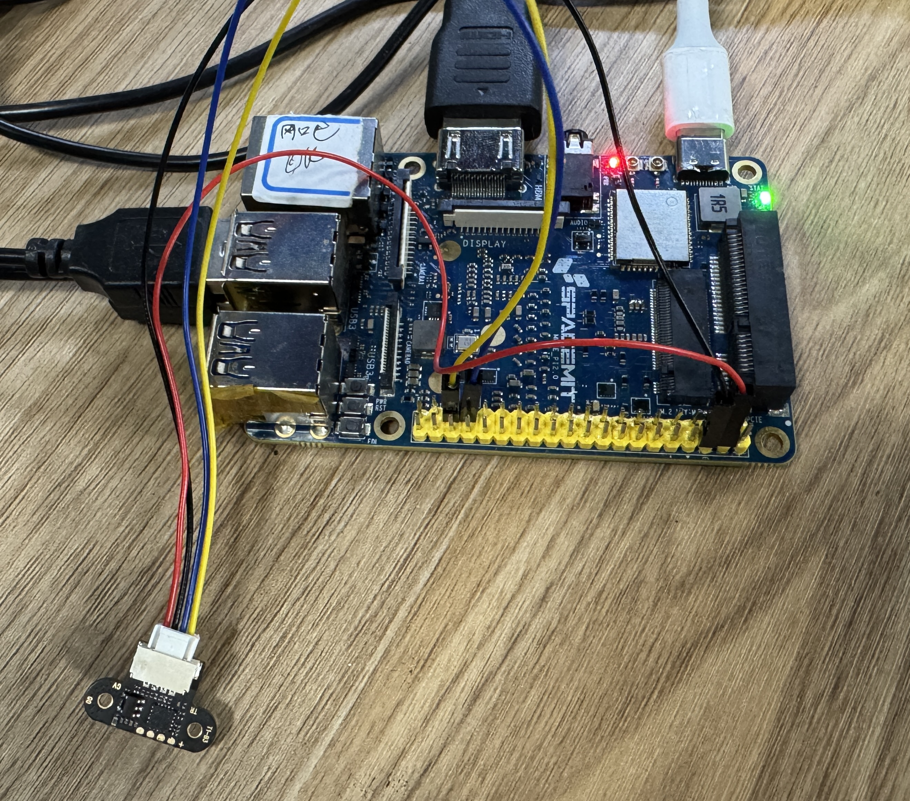
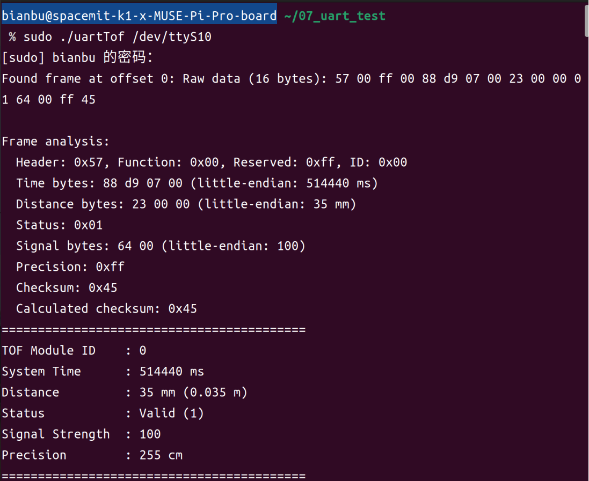

sidebar_position: 8

# Linux UART 设备驱动开发实践

## 1. UART 基础知识

UART 是一种通用串行数据总线，用于异步通信。该总线双向通信，可以实现全双工传输和接收。UART 通道有两条数据线。每个设备上都有一个 RX 引脚和一个 TX 引脚（RX 用于接收，TX 用于发送），每个设备的 RX 引脚都连接到另一个设备的 TX 引脚，如下图。

<center>
    
    <br>
</center>


## 2. Linux UART 体系结构

<center>
    
    <br>
</center>

在Linux内核中，UART的实现通常分为几个层次：

- **用户空间**：应用程序运行的环境，它通过系统调用与内核交互。对于UART设备，用户空间通常通过标准的输入输出（如/dev/ttyS0）来访问UART设备。

- **TTY层**：内核中处理终端设备（包括UART设备）的一层。它提供了一个统一的接口来处理各种类型的终端设备。TTY层主要包括以下几个部分：

    - **TTY CORE**：核心部分，负责管理TTY设备的结构和基本操作。

    - **TTY LDISC（Line Discipline）**：定义了数据如何在TTY设备上进行处理和传输。

    - **TTY DRIVER**：驱动程序，负责与具体的硬件设备进行交互。

- **SERIAL层**：专门处理串行通信的一层，它位于TTY层之下，直接与硬件设备交互。SERIAL层主要包括：

    - **SERIAL CORE**：核心部分，负责管理串行设备的结构和基本操作。

    - **SERIAL DRIVER**：驱动程序，负责与具体的串行硬件设备进行交互。

- **硬件层**：实际的UART硬件设备，它包括UART控制器和相关的硬件资源（如寄存器、中断等）。操作系统通过硬件层与物理设备进行直接交互。

## 3. 关键特性

k1平台支持9路可配置的 uart 。

- 支持硬件流控(uart2，uart3)

- 支持DMA传输模式<br>

- 支持中断模式<br>

- 支持RS485/RS232串口协议<br>

- 支持64B RX/TX fifo<br>

- 波特率最高支持3M<br>

## 4. UART 的内核驱动表示

### 4.1. pinctrl

可查看linux仓库的 `path/to/your/linux-6.6/arch/riscv/boot/dts/spacemit/k1-x_MUSE-Pi-Pro.dts`，参考已配置好的 r_uart0 复用功能配置，如下：

```dts
pinctrl_rcpu: pinctrl_rcpu_grp {
    pinctrl-single,pins = <
        K1X_PADCONF(GPIO_47, MUX_MODE1, (EDGE_NONE | PULL_UP | PAD_3V_DS4))	/* r_uart0_tx */
        K1X_PADCONF(GPIO_48, MUX_MODE1, (EDGE_NONE | PULL_UP | PAD_3V_DS4))	/* r_uart0_rx */
    >;
};
```

### 4.2. dtsi配置

在 `path/to/your/linux-6.6/arch/riscv/boot/dts/spacemit/k1-x.dtsi` 中定义了10个 UART 控制器，分别从 uart0 ~ uart9，此外还有两个 r_uart（r_uart0 和 r_uart1），它们是 RCPU 的 UART 控制器。以 r_uart0 为例：

```dts
r_uart0: r_uart0@c0881000 {
    compatible = "spacemit,rcpu-pxa-uart0";
    reg = <0x0 0xc0881000 0x0 0x100>;
    clocks = <&ccu CLK_RCPU_UART0>, <&ccu CLK_SLOW_UART>;
    clock-names = "func", "gate";
    resets = <&reset RESET_RCPU_UART0>;
    power-domains = <&power K1X_PMU_BUS_PWR_DOMAIN>;
    clk,pm-runtime,no-sleep;
    cpuidle,pm-runtime,sleep;
    rcpu-uart;
    interconnects = <&dram_range4>;
    interconnect-names = "dma-mem";
    reg-shift = <2>;
    reg-io-width = <4>;
    status = "disabled";
};
```

### 4.3. 控制器源码

通过 compatible 属性值 `spacemit,pxa-uart` 可以在Linux 源码中搜索这两个字符串即可找到对应的控制器驱动文件。PI-Pro 的 UART 驱动文件为 `path/to/your/linux-6.6/drivers/tty/serial/pxa_k1x.c`，在文件中有如下内容：

```c
// RCPU UART 设备匹配表
static const struct of_device_id r_serial_pxa0_dt_ids[] = {
    { .compatible = "spacemit,rcpu-pxa-uart0", .data = &private_data[0] },
    {}
};

// RCPU UART 平台驱动
static struct platform_driver r_serial_pxa_driver[] = {
    {
        .probe = serial_pxa_probe,      
        .remove = serial_pxa_remove,    
        .driver = {
            .name = "pxa2xx-ruart0",
            .pm = &serial_pxa_pm_ops,
            .suppress_bind_attrs = true,
            .of_match_table = r_serial_pxa0_dt_ids,  
        },
    },
    ...
};

// RPMSG 驱动部分
static struct rpmsg_device_id rpmsg_driver_ruart_id_table[] = {
    { .name = "ruart-service0", .driver_data = 0 },
    ...
    { },
};
MODULE_DEVICE_TABLE(rpmsg, rpmsg_driver_ruart_id_table);

static int rpmsg_ruart_client_cb(struct rpmsg_device *rpdev, void *data,
        int len, void *priv, u32 src)
{
    struct instance_data *idata = dev_get_drvdata(&rpdev->dev);
    int ret;

    serial_pxa_irq(0, (void*)(idata->dev));
    ret = rpmsg_send(rpdev->ept, IRQUP_MSG, strlen(IRQUP_MSG));
    if (ret) {
        dev_err(&rpdev->dev, "rpmsg_send failed: %d\n", ret);
        return ret;
    }

    return 0;
}

static int rpmsg_ruart_client_probe(struct rpmsg_device *rpdev)
{
    struct instance_data *idata;

    dev_info(&rpdev->dev, "new channel: 0x%x -> 0x%x!\n",
                    rpdev->src, rpdev->dst);

    idata = devm_kzalloc(&rpdev->dev, sizeof(*idata), GFP_KERNEL);
    if (!idata)
        return -ENOMEM;

    dev_set_drvdata(&rpdev->dev, idata);
    idata->rpdev = rpdev;

    for (int i = 0; i < sizeof(rpmsg_driver_ruart_id_table)/sizeof(struct rpmsg_device_id); i++) {
        if (!strncmp(rpdev->id.name, rpmsg_driver_ruart_id_table[i].name, sizeof(rpdev->id.name))) {
            private_data[i] = (unsigned long long)idata;
            platform_driver_register(&r_serial_pxa_driver[i]);
            break;
        }
    }

    return 0;
}

static void rpmsg_ruart_client_remove(struct rpmsg_device *rpdev)
{
    dev_info(&rpdev->dev, "rpmsg uart client driver is removed\n");
    for (int i = 0; i < sizeof(rpmsg_driver_ruart_id_table)/sizeof(struct rpmsg_device_id); i++) {
        if (!strncmp(rpdev->id.name, rpmsg_driver_ruart_id_table[i].name, sizeof(rpdev->id.name))) {
            platform_driver_unregister(&r_serial_pxa_driver[i]);
            break;
        }
    }
}

static struct rpmsg_driver rpmsg_ruart_client = {
    .drv.name   = KBUILD_MODNAME,
    .id_table   = rpmsg_driver_ruart_id_table,
    .probe      = rpmsg_ruart_client_probe,
    .callback   = rpmsg_ruart_client_cb,
    .remove     = rpmsg_ruart_client_remove,
};

// probe 函数
static int serial_pxa_probe(struct platform_device *dev)
{
#ifdef CONFIG_SOC_SPACEMIT_K1_FPGA
    struct device_node *np = dev->dev.of_node;
#endif

    // 获取内存资源
    mmres = platform_get_resource(dev, IORESOURCE_MEM, 0);
    if (!mmres) {
        return -ENODEV;
    }

    // IRQ 资源获取 - RCPU UART 特殊处理
#ifdef CONFIG_SOC_SPACEMIT_K1X
    if (!of_get_property(dev->dev.of_node, "rcpu-uart", NULL)) {
        // 标准 UART
        irq = platform_get_irq(dev, 0);
        if (irq < 0) {
            return irq;
        }
    } else {
        // RCPU UART 使用特殊标识
        irq = RUART_IRQ_MASK;
    }
#else
    irq = platform_get_irq(dev, 0);
    if (irq < 0) {
        return irq;
    }
#endif

    // 分配 uart_pxa_port 结构体
    sport = kzalloc(sizeof(struct uart_pxa_port), GFP_KERNEL);
    if (!sport) {
        return -ENOMEM;
    }

    // 获取时钟资源
    sport->gclk = devm_clk_get(&dev->dev, "gate");

    sport->fclk = devm_clk_get(&dev->dev, "func");

    // 准备时钟
    if(sport->gclk) {
        ret = clk_prepare(sport->gclk);
    }

    if(sport->fclk) {
        ret = clk_prepare(sport->fclk);
    }

    // 初始化 UART 端口基本属性
    sport->port.type = PORT_PXA;
    sport->port.iotype = UPIO_MEM;
    sport->port.mapbase = mmres->start;
    sport->port.irq = irq;
    sport->port.fifosize = 64;
    sport->port.ops = &serial_pxa_pops;
    sport->port.dev = &dev->dev;
    sport->port.flags = UPF_IOREMAP | UPF_BOOT_AUTOCONF;

    // 设置 UART 时钟频率
#ifdef CONFIG_SOC_SPACEMIT_K1_FPGA
    of_property_read_u32(np, "clk-fpga", &sport->clk_fpga);
    if (sport->clk_fpga) {
        sport->port.uartclk = sport->clk_fpga;
    } else {
        sport->port.uartclk = UARTCLK_FPGA;
    }
#else
    sport->port.uartclk = clk_get_rate(sport->fclk);
#endif

    // 获取复位控制器
    sport->resets = devm_reset_control_get_optional(&dev->dev, NULL);
    if(IS_ERR(sport->resets)) {
        ret = PTR_ERR(sport->resets);
        goto err_clk;
    }
    reset_control_deassert(sport->resets);

    // 启用 sysrq 支持
    sport->port.has_sysrq = IS_ENABLED(CONFIG_SERIAL_PXA_CONSOLE);

    // 初始化其他属性
    sport->edge_wakeup_gpio = -1;

    // 解析设备树属性
    ret = serial_pxa_probe_dt(dev, sport);

    // 检查端口号范围
    if (sport->port.line >= ARRAY_SIZE(serial_pxa_ports)) {
        dev_err(&dev->dev, "serial%d out of range\n", sport->port.line);
        ret = -EINVAL;
        goto err_rst;
    }

    // 设置设备名称
    snprintf(sport->name, PXA_NAME_LEN - 1, "UART%d", sport->port.line + 1);

    // IRQ 申请 - RCPU UART 特殊处理
#ifdef CONFIG_SOC_SPACEMIT_K1X
    if(sport->port.irq != RUART_IRQ_MASK) {
        // 标准 UART IRQ 处理
        ret = request_irq(sport->port.irq, serial_pxa_irq, 0, sport->name, sport);
        if (ret) {
            goto err_rst;
        }
        disable_irq(sport->port.irq);
    } else {
        // RCPU UART 特殊处理
        struct instance_data *idata;
        struct rpmsg_device *rpdev;
        const struct of_device_id *of_id;
        int ret;

        if ((of_id = of_match_device(r_serial_pxa0_dt_ids, &dev->dev)))
            idata = (struct instance_data *)(*((unsigned long long *)of_id->data));
        else if ((of_id = of_match_device(r_serial_pxa1_dt_ids, &dev->dev)))
            idata = (struct instance_data *)(*((unsigned long long *)of_id->data));

        if(!of_id)
            return -ENODEV;

        rpdev = idata->rpdev;
        idata->dev = sport;
        ret = rpmsg_send(rpdev->ept, STARTUP_MSG, strlen(STARTUP_MSG));
        if (ret) {
            dev_err(&rpdev->dev, "rpmsg_send failed: %d\n", ret);
            return ret;
        }
    }

    // 映射内存地址
    sport->port.membase = ioremap(mmres->start, resource_size(mmres));
    if (!sport->port.membase) {
        ret = -ENOMEM;
        goto err_qos;
    }

    // 注册 UART 端口
    serial_pxa_ports[sport->port.line] = sport;
    uart_add_one_port(&serial_pxa_reg, &sport->port);
    dev_dbg(&dev->dev, "uart clk_rate: %lu\n", clk_get_rate(sport->fclk));
    platform_set_drvdata(dev, sport);
    return 0;
}

// RCPU UART 不需要单独的 init/exit 函数，因为它通过 RPMSG 驱动管理
module_rpmsg_driver(rpmsg_ruart_client);
```

从上述代码和流程可以看出，UART 驱动同样采用了标准的 platform 驱动开发模式。驱动通过设备树的 compatible 属性与硬件资源自动匹配，初始化时注册 UART 核心驱动和 platform 驱动，probe 函数完成资源申请和硬件初始化。这样设计不仅提升了驱动的可移植性，也方便了不同硬件平台的适配和后续扩展，是 Linux 串口驱动开发的通用方法。


## 5. UART 驱动开发实例

本案例采用 GPIO47、GPIO48 (即 r_uart0) 读取TOF激光测距模块。

### 5.1. 产品形态


<center>
    
    <br>
</center>

TOF模块官网资料链接：[https://www.waveshare.net/wiki/TOF_Laser_Range_Sensor_Mini](https://www.waveshare.net/wiki/TOF_Laser_Range_Sensor_Mini)


### 5.2. 实验步骤

#### 5.2.1. 下载源码并传输

由于不涉及到内核模块驱动编译，避免需要交叉编译，我们直接将源码下载解压后传输到 MUSE Pi Pro 上。

下载源码压缩包：

[uart_test.zip](code/07_uart_test.zip)

解压下载回来的压缩包：

```bash
unzip 07_uart_test.zip -d ~/
```

在 MUSE Pi Pro 上执行下面命令查看 ip：
```bash
ifconfig
```

如下图所示，ip 为 `10.0.91.67` 。
<center>
    
    <br>
</center>

执行下面命令将解压好的源码文件传输到 MUSE Pi Pro 上。

> **注**：下面的 `bianbu@10.0.91.67` 根据上面结果替换成对应的 ip 。

```bash
scp -r 07_uart_test/ bianbu@10.0.91.67:/home/bianbu
```

在 MUSE Pi Pro 中进入源码目录并编译。

```bash
cd 07_uart_test
make
```

<center>
    
    <br>
</center>

编译成功会出现一个 uartTof 可执行文件。

<center>
    
    <br>
</center>


#### 5.2.2. 硬件连接

根据下图将 MUSE Pi Pro 开发板与 tof 模块进行硬件连接。

<center>
    
    <br>
</center>

>**注**：R_UART0_TX (MUSE Pi Pro) <——> RX ( tof )&nbsp;&nbsp;&nbsp;&nbsp;&nbsp;&nbsp;&nbsp;&nbsp;&nbsp;&nbsp;R_UART0_RX (MUSE Pi Pro) <——> TX ( tof )

<center>
    
    <br>
</center>

#### 5.2.3. 运行测试

当驱动模块加载成功以后检测是否成功加载设备，在 MUSE Pi Pro 输入如下命令：
```bash
ls -l /dev/ttyS10
```

显示如下则说明驱动设备加载成功：

<center>
    
    <br>
</center>

接下来安装 coreutils 包，在 MUSE Pi Pro 输入如下命令：
```bash
sudo apt update
sudo apt install coreutils
```

接着，我们需要设置 `/dev/ttyS10` 的波特率，在 MUSE Pi Pro 输入以下命令：
```bash
sudo stty -F /dev/ttyS10 921600
```

最后，我们执行下面命令启动应用程序：
```bash
sudo ./uartTof /dev/ttyS10
```

运行结果显示如下：
<center>
    
    <br>
</center>