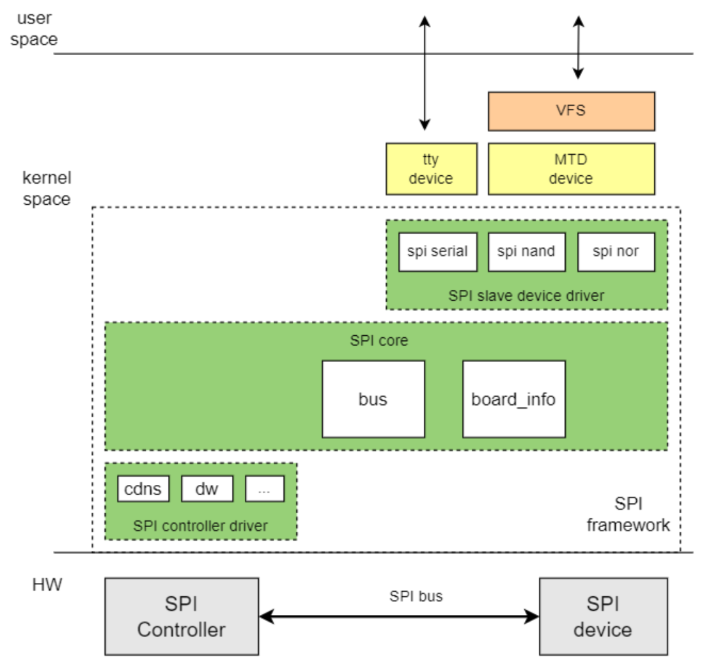
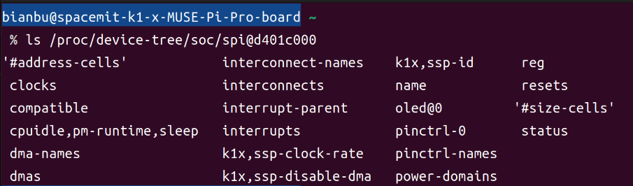
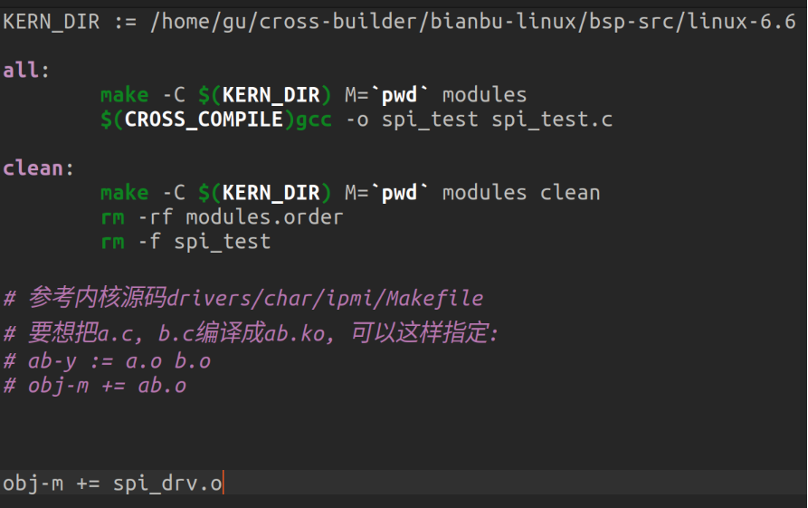
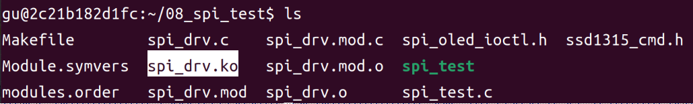
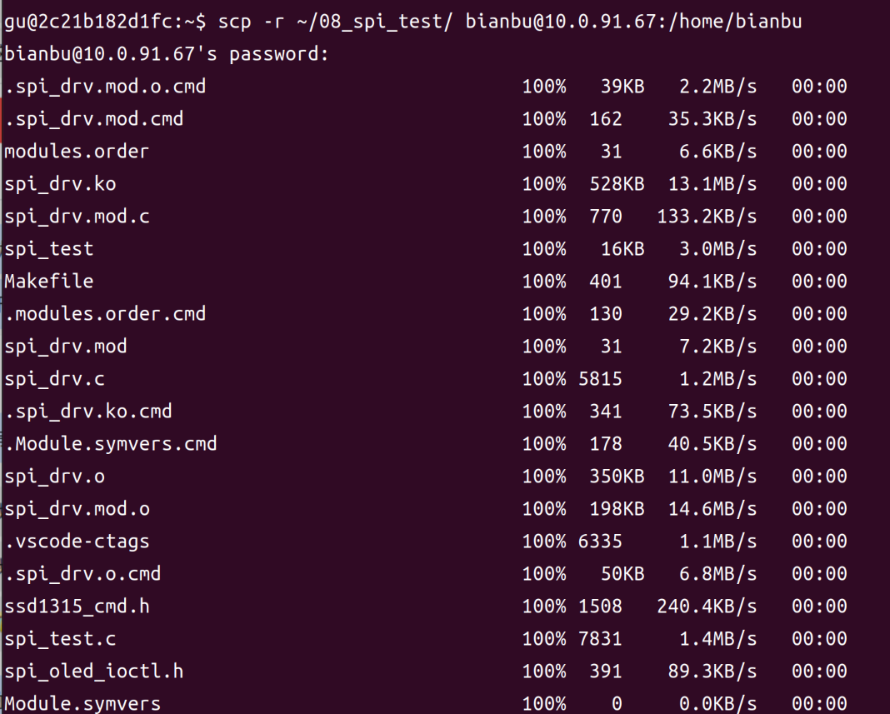
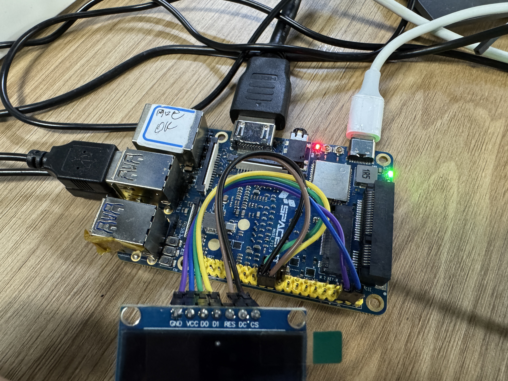
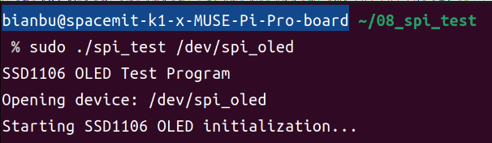

sidebar_position: 9

# Linux SPI 设备驱动开发实践

## 1. SPI 基础知识

SPI（Serial Peripheral Interface）是一种常用的高速全双工同步串行通信总线，广泛应用于 SoC 与各类外设之间的数据传输。SPI 总线支持主从结构，通常由一个主设备（Master）和一个或多个从设备（Slave）组成。主设备通过片选信号选择目标从设备，并提供时钟信号，所有数据传输均由主设备发起。当前 k1 平台的 SPI 仅支持主模式。SPI 通讯协议如下图。

<center>
    
    <br>
</center>

**SPI接口包含四根线：**<br>

- 一根串行时钟线（SCK）<br>

- 一根主设备输出/从设备输入线（MOSI）<br>

- 一根主设备输入/从设备输出线（MISO）<br>

- 一根片选线（CS）<br>

当系统中存在多个从设备时，则需要相应的增加片选线的数量。具体而言，MOSI线负责主设备向从设备发送数据，而从设备则通过MISO线向主设备返回数据。串行时钟线（SCK）由主设备控制，用于同步数据的收发。而片选线（CS）则用于选择特定的从设备进行通信，由主设备控制并以其低电平状态为有效信号。


## 2. Linux SPI 体系结构

<center>
    
    <br>
</center>

Linux SPI 驱动框架分为三层：SPI Core、SPI 控制器驱动（Master 驱动）和 SPI 设备驱动（Slave 驱动）。

**SPI core:**

- spi总线和spi_master类注册<br>

- spi控制器添加和删除<br>

- spi设备添加和删除<br>

- spi设备驱动注册与注销<br>

**SPI 控制器驱动:**<br>

- spi master控制器驱动，对spi master控制器进行操作<br>

**SPI 设备驱动**<br>

- spi device驱动<br>


## 3. 关键特性

- 支持SSP/SPI/MicroWire/PSP协议<br>

- 最高频率支持53MHz, 最低频率支持6.3kbps<br>


## 4. Linux SPI 驱动架构概述

Linux SPI 驱动主要分为两大类：<br>

**SPI 主机驱动（控制器驱动）**

   - 负责 SoC 芯片上的 SPI 控制器（主机）的初始化和管理<br>

   - 实现 SPI 总线的底层读写、时序控制等<br>

   - 常见驱动如 `spi-dw`（DesignWare SPI）、`spi-imx` 等<br>

**SPI 设备驱动**

   - 负责挂载在 SPI 总线上的具体外设（如 Flash、传感器、显示屏等）<br>

   - 通过 SPI 主机驱动提供的接口与硬件通信，实现设备功能<br>

SPI 主机驱动和设备驱动通过内核 SPI 框架解耦，便于不同硬件平台和多种 SPI 设备的灵活组合和扩展。<br>

## 5. SPI 主机驱动开发

### 5.1. 核心数据结构

`spi_master` 抽象表示一个 SPI 控制器，定义在 `path/to/your/linux-6.6/include/linux/spi/spi.h` 中：

```c
struct spi_master {
    struct device dev;              /* 设备结构体 */
    struct list_head list;          /* 链表节点 */
    
    s16 bus_num;                    /* 总线编号 */
    u16 num_chipselect;             /* 片选数量 */
    u16 dma_alignment;              /* DMA对齐要求 */
    u16 mode_bits;                  /* 支持的模式标志位 */
    u32 bits_per_word_mask;         /* 支持的数据位宽掩码 */
    
    /* 传输速度限制 */
    u32 min_speed_hz;               /* 最小传输速度 */
    u32 max_speed_hz;               /* 最大传输速度 */
    
    u16 flags;                      /* 其他约束标志 */
    
    /* SPI总线锁定机制 */
    spinlock_t bus_lock_spinlock;
    struct mutex bus_lock_mutex;
    bool bus_lock_flag;
    
    /* 关键回调函数 */
    int (*setup)(struct spi_device *spi);
    int (*transfer)(struct spi_device *spi, struct spi_message *mesg);
    int (*transfer_one_message)(struct spi_master *master, struct spi_message *mesg);
    // ...其他字段
};
```

其中 `transfer` 和 `transfer_one_message` 是最核心的函数，实现与 SPI 设备的通信。

### 5.2. spi_master 申请与释放

SPI 主机驱动的核心就是申请 spi_master，然后初始化 spi_master，最后向 Linux 内核注册 spi_master。

```c
/* 申请spi_master */
struct spi_master *spi_alloc_master(struct device *dev, unsigned size);

/* 释放spi_master */
void spi_master_put(struct spi_master *master);
```

`dev`：设备，一般是 platform_device 中的 dev 成员变量。
`size`：私有数据大小，可以通过 spi_master_get_devdata 函数获取。

### 5.3. spi_master 注册与注销

```c
/* 注册spi_master */
int spi_register_master(struct spi_master *master);

/* 注销spi_master */
void spi_unregister_master(struct spi_master *master);
```

### 5.4. SPI 控制器的设备树表示与驱动

在 `path/to/your/linux-6.6/arch/riscv/boot/dts/spacemit/k1-x.dtsi` 中定义了4个 SPI 控制器，分别从 spi0 ~ spi3，以 spi3 为例：

```dts
spi3: spi@d401c000 {
    compatible = "spacemit,k1x-spi";
    reg = <0x0 0xd401c000 0x0 0x34>;
    k1x,ssp-id = <3>;
    k1x,ssp-clock-rate = <51200000>;
    dmas = <&pdma0 DMA_SSP3_RX 1
        &pdma0 DMA_SSP3_TX 1>;
    dma-names = "rx", "tx";
    power-domains = <&power K1X_PMU_BUS_PWR_DOMAIN>;
    cpuidle,pm-runtime,sleep;
    interrupt-parent = <&intc>;
    interrupts = <55>;
    clocks = <&ccu CLK_SSP3>;
    resets = <&reset RESET_SSP3>;
    #address-cells = <1>;
    #size-cells = <0>;
    interconnects = <&dram_range4>;
    interconnect-names = "dma-mem";
    status = "disabled";
};
```

通过 compatible 属性值 `spacemit,k1x-spi` 可以在Linux 源码中搜索这两个字符串即可找到对应的驱动文件。PI-Pro 的 SPI 控制器驱动文件为 `path/to/your/linux-6.6/drivers/spi/spi-k1x.c`，在文件中有如下内容：

```c
static const struct of_device_id k1x_spi_dt_ids[] = {
	{ .compatible = "spacemit,k1x-spi", .data = (void *) K1X_SSP },
	{}
};
MODULE_DEVICE_TABLE(of, k1x_spi_dt_ids);

static struct platform_driver driver = {
	.driver = {
		.name	= "k1x-spi",
		.pm	= &k1x_spi_pm_ops,
		.of_match_table = k1x_spi_dt_ids,
	},
	.probe = k1x_spi_probe,
	.remove = k1x_spi_remove,
	.shutdown = k1x_spi_shutdown,
};

static int __init k1x_spi_init(void)
{
	return platform_driver_register(&driver);
}
module_init(k1x_spi_init);

static void __exit k1x_spi_exit(void)
{
	platform_driver_unregister(&driver);
}
module_exit(k1x_spi_exit);
```

从上述代码可以看出，MUSE Pi Pro 的 SPI 控制器驱动是个标准的 platform 驱动，也就是说，虽然 SPI 总线为别的设备提供了一种总线驱动框架，但是 SPI 控制器却是 platform 驱动。<br>

在设备和驱动匹配成功以后 k1x_spi_probe 函数就会执行，k1x_spi_probe 函数就会完成 SPI 控制器初始化工作。<br>
k1x_spi_probe 函数内容如下 (有省略)：

```c
static int k1x_spi_probe(struct platform_device *pdev)
{
    struct spi_master *master;
    struct spi_driver_data *drv_data;
    struct resource *iores;
    int status;

    // 1. 申请并初始化 spi_master
    master = spi_alloc_master(&pdev->dev, sizeof(struct spi_driver_data));
    drv_data = spi_master_get_devdata(master);

    // 2. 获取寄存器资源并映射
    iores = platform_get_resource(pdev, IORESOURCE_MEM, 0);
    drv_data->ioaddr = devm_ioremap_resource(&pdev->dev, iores);

    // 3. 获取中断号并注册中断处理函数
    drv_data->irq = platform_get_irq(pdev, 0);

    status = devm_request_irq(&pdev->dev, drv_data->irq, ssp_int, 
                             IRQF_SHARED, dev_name(&pdev->dev), drv_data);

    // 4. 获取并配置时钟
    drv_data->clk = devm_clk_get(&pdev->dev, NULL);

    // 从设备树获取时钟频率
    status = of_property_read_u32(pdev->dev.of_node, "k1x,ssp-clock-rate", 
                                 &master->max_speed_hz);

    clk_set_rate(drv_data->clk, master->max_speed_hz);
    clk_prepare_enable(drv_data->clk);

    // 5. 复位控制器
    drv_data->reset = devm_reset_control_get_optional(&pdev->dev, NULL);

    // 6. 配置 spi_master 参数
    master->dev.parent = &pdev->dev;
    master->dev.of_node = pdev->dev.of_node;
    master->mode_bits = SPI_CPOL | SPI_CPHA | SPI_CS_HIGH | SPI_LOOP;
    master->bits_per_word_mask = SPI_BPW_RANGE_MASK(4, 32);
    master->setup = setup;
    master->transfer_one_message = k1x_spi_transfer_one_message;
    master->auto_runtime_pm = true;

    // 7. 初始化硬件寄存器（加载默认配置）
    k1x_spi_write(drv_data, TOP_CTRL, TOP_FRF_Motorola | TOP_DSS(8));
    k1x_spi_write(drv_data, FIFO_CTRL, FIFO_RxTresh(RX_THRESH_DFLT) | 
                                       FIFO_TxTresh(TX_THRESH_DFLT));

    // 8. 初始化工作队列和完成量
    INIT_WORK(&drv_data->pump_transfers, pump_transfers);
    init_completion(&drv_data->cur_msg_completion);

    // 9. 注册 spi_master 到内核
    platform_set_drvdata(pdev, drv_data);
    status = devm_spi_register_master(&pdev->dev, master);
    return 0;
}
```

### 5.5. SPI 传输函数分析

在 probe 函数中初始化 spi_master，设置 `transfer_one_message` 为 `k1x_spi_transfer_one_message`，最后向 Linux 内核注册 spi_master。`k1x_spi_transfer_one_message` 是 SPI 控制器与 SPI 设备的核心通信函数。<br>
重点来看 `k1x_spi_transfer_one_message` 函数，因为最终就是通过此函数来完成与 SPI 设备通信的。内容如下 (有省略)：

```c
static int k1x_spi_transfer_one_message(struct spi_master *master,
					   struct spi_message *msg)
{
	struct spi_driver_data *drv_data = spi_master_get_devdata(master);

	drv_data->cur_msg = msg;
	/* Initial message state*/
	drv_data->cur_msg->state = START_STATE;
	drv_data->cur_transfer = list_entry(drv_data->cur_msg->transfers.next,
						struct spi_transfer,
						transfer_list);

	/*
	 * prepare to setup the SSP, in pump_transfers, using the per
	 * chip configuration
	 */
	drv_data->cur_chip = spi_get_ctldata(drv_data->cur_msg->spi);

	if (master->max_speed_hz != drv_data->cur_transfer->speed_hz) {
		master->max_speed_hz = drv_data->cur_transfer->speed_hz;
		clk_set_rate(drv_data->clk, master->max_speed_hz);
	}

	reinit_completion(&drv_data->cur_msg_completion);
	/* Mark as busy and launch transfers */
	queue_work(system_wq, &drv_data->pump_transfers);
	wait_for_completion(&drv_data->cur_msg_completion);

	return 0;
}
```


## 6. SPI 设备驱动开发

### 6.1. 核心数据结构

#### 6.1.1. spi_device 结构体

`spi_device` 结构体描述 SPI 设备的信息，每检测到一个 SPI 设备就会为其分配一个 `spi_device` 实例。定义在 `path/to/your/linux-6.6/include/linux/spi/spi.h` 中：

```c
struct spi_device {
    struct device dev;              /* 设备结构体 */
    struct spi_master *master;      /* 所属的SPI主机 */
    u32 max_speed_hz;               /* 最大传输速度 */
    u8 chip_select;                 /* 片选信号 */
    u8 bits_per_word;               /* 每字数据位数 */
    u16 mode;                       /* SPI模式 */
    int irq;                        /* 中断号 */
    void *controller_state;
    void *controller_data;
    char modalias[SPI_NAME_SIZE];   /* 模块别名 */
    // ...其他字段
};
```

#### 6.1.2. spi_driver 结构体

`spi_driver` 结构体描述 SPI 设备驱动的信息，类似于 `spi_driver`，定义在 `path/to/your/linux-6.6/include/linux/spi/spi.h` 中：

```c
struct spi_driver {
    const struct spi_device_id *id_table;  /* 传统匹配ID表 */
    
    /* 标准驱动模型接口 */
    int (*probe)(struct spi_device *spi);
    int (*remove)(struct spi_device *spi);
    void (*shutdown)(struct spi_device *spi);
    
    struct device_driver driver;           /* 设备驱动结构体 */
    // ...其他字段
};
```

### 6.2. SPI 设备驱动注册与注销

对于 SPI 设备驱动编写，重点工作就是构建 spi_driver，构建完之后需要向内核注册这个 spi_driver：

```c
/* 注册SPI驱动 */
int __spi_register_driver(struct module *owner, struct spi_driver *sdrv);

/* 注销SPI驱动 */
void spi_unregister_driver(struct spi_driver *sdrv);
```

### 6.3. SPI 数据传输函数

在 SPI 设备驱动的 probe 函数里面需要与 SPI 设备进行通信，这里就要用到 spi_sync 等传输函数：

```c
/* 初始化spi_message */
void spi_message_init(struct spi_message *m);

/* 添加spi_transfer到spi_message的transfer列表 */
void spi_message_add_tail(struct spi_transfer *t, struct spi_message *m);

/* 同步传输函数 */
int spi_sync(struct spi_device *spi, struct spi_message *message);

/* 异步传输函数 */
int spi_async(struct spi_device *spi, struct spi_message *message);

/* 简化的读写函数 */
int spi_write(struct spi_device *spi, const void *buf, size_t len);
int spi_read(struct spi_device *spi, void *buf, size_t len);
```

### 6.3. SPI 消息结构体

SPI 传输是以消息（message）为单位进行的，一个消息可以包含多个传输（transfer）：

```c
struct spi_message {
    struct list_head transfers;     /* 传输列表 */
    struct spi_device *spi;         /* 目标SPI设备 */
    unsigned is_dma_mapped:1;       /* 是否已进行DMA映射 */
    void (*complete)(void *context); /* 完成回调函数 */
    void *context;                  /* 回调函数参数 */
    unsigned actual_length;         /* 实际传输长度 */
    int status;                     /* 传输状态 */
    // ...其他字段
};

struct spi_transfer {
    const void *tx_buf;             /* 发送缓冲区 */
    void *rx_buf;                   /* 接收缓冲区 */
    unsigned len;                   /* 传输长度 */
    dma_addr_t tx_dma;              /* 发送DMA地址 */
    dma_addr_t rx_dma;              /* 接收DMA地址 */
    unsigned cs_change:1;           /* 传输后是否改变片选 */
    unsigned tx_nbits:4;            /* 发送时的数据线数 */
    unsigned rx_nbits:4;            /* 接收时的数据线数 */
    u8 bits_per_word;               /* 每字数据位数 */
    u32 speed_hz;                   /* 传输速度 */
    struct list_head transfer_list; /* 传输链表节点 */
    // ...其他字段
};
```

### 6.4. SPI 设备驱动开发流程

此处结合 SPI OLED 模块驱动程序进行说明。

#### 6.4.1. 定义匹配表

```c
/* 设备树匹配列表 */
static const struct of_device_id spi_oled_of_match[] = {
    { .compatible = "ssd1106,oled" },
    { }
};
MODULE_DEVICE_TABLE(of, spi_oled_of_match);
```

#### 6.4.2. 定义设备结构体

```c
struct spi_oled_dev {
    struct spi_device *spi;    // SPI设备指针
    struct cdev cdev;          // 字符设备
    struct device *device;     // 设备节点
    struct class *class;       // 设备类
    dev_t devt;               // 设备号
    int dc_gpio;              // DC控制GPIO
    struct mutex lock;        // 互斥锁
};
```

#### 6.4.3. 实现文件操作接口

```c
static const struct file_operations spi_oled_fops = {
    .owner = THIS_MODULE,
    .open = spi_oled_open,
    .release = spi_oled_release,
    .write = spi_oled_write,
    .unlocked_ioctl = spi_oled_ioctl,
};

static long spi_oled_ioctl(struct file *file, unsigned int cmd, unsigned long arg)
{
    struct spi_oled_dev *dev = file->private_data;
    int ret = 0;
    u8 data;
    
    switch (cmd) {
    case SPI_OLED_SET_DC_HIGH:
        gpio_set_value(dev->dc_gpio, 1);
        break;
        
    case SPI_OLED_SET_DC_LOW:
        gpio_set_value(dev->dc_gpio, 0);
        break;
        
    case SPI_OLED_WRITE_CMD:
        if (copy_from_user(&data, (void __user *)arg, 1))
            return -EFAULT;
        
        mutex_lock(&dev->lock);
        gpio_set_value(dev->dc_gpio, 0);  // DC=0 for command
        udelay(10);
        ret = spi_write(dev->spi, &data, 1);
        mutex_unlock(&dev->lock);
        break;
        
    case SPI_OLED_WRITE_DATA:
        if (copy_from_user(&data, (void __user *)arg, 1))
            return -EFAULT;
        
        mutex_lock(&dev->lock);
        gpio_set_value(dev->dc_gpio, 1);  // DC=1 for data
        udelay(10);
        ret = spi_write(dev->spi, &data, 1);
        mutex_unlock(&dev->lock);
        break;
        
    default:
        return -ENOTTY;
    }
    
    return ret;
}
```

#### 6.4.4. 实现 probe/remove 等回调函数

```c
static int spi_oled_probe(struct spi_device *spi)
{
    struct spi_oled_dev *dev;
    int ret;

    /* 1、分配设备结构体内存 */
    dev = devm_kzalloc(&spi->dev, sizeof(*dev), GFP_KERNEL);
    dev->spi = spi;
    spi_set_drvdata(spi, dev);

    /* 2、获取并配置GPIO资源 */
    dev->dc_gpio = of_get_named_gpio(spi->dev.of_node, "dc-gpios", 0);

    ret = devm_gpio_request_one(&spi->dev, dev->dc_gpio, 
                               GPIOF_OUT_INIT_LOW, "spi-oled-dc");

    /* 3、配置SPI参数 */
    spi->mode = SPI_MODE_0;
    spi->bits_per_word = 8;
    ret = spi_setup(spi);

    /* 4、初始化互斥锁 */
    mutex_init(&dev->lock);

    /* 5、构建设备号 */
    ret = alloc_chrdev_region(&dev->devt, 0, 1, DEVICE_NAME);

    /* 6、注册字符设备 */
    cdev_init(&dev->cdev, &spi_oled_fops);
    dev->cdev.owner = THIS_MODULE;

    ret = cdev_add(&dev->cdev, dev->devt, 1);


    /* 7、创建设备类 */
    dev->class = class_create(CLASS_NAME);

    /* 8、创建设备节点 */
    dev->device = device_create(dev->class, &spi->dev, dev->devt,
                               NULL, DEVICE_NAME);
    return 0;
}

static void spi_oled_remove(struct spi_device *spi)
{
    struct spi_oled_dev *dev = spi_get_drvdata(spi);
    
    /* 销毁设备和类 */
    device_destroy(dev->class, dev->devt);
    class_destroy(dev->class);
    
    /* 注销字符设备 */
    cdev_del(&dev->cdev);
    unregister_chrdev_region(dev->devt, 1);
    
    dev_info(&spi->dev, "SPI OLED driver removed\n");
}
```

#### 6.4.5. 构建 spi_driver 结构体

```c
static struct spi_driver spi_oled_driver = {
    .driver = {
        .name = "spi-oled",
        .of_match_table = spi_oled_of_match,
    },
    .probe = spi_oled_probe,
    .remove = spi_oled_remove,
};
```


## 7. SPI 设备驱动开发实例

> **说明**：本次实验采用 **GPIO75 (SPI3_SCLK) 、GPIO76 (SPI3_CS) 、GPIO77 (SPI3_MOSI) 、GPIO49 (SPI3_DC)** 与 7 针 OLED 进行 SPI 通信。


### 7.1. 设备树配置

本次实验我们使用GPIO75、76、77、78 (spi3) 与 OLED 模块进行通信。
打开设备树 `path/to/your/linux-6.6/arch/riscv/boot/dts/spacemit/k1-x_pinctrl.dtsi` 查看引脚复用功能配置，默认已复用 SPI 功能，内容如下：
```dts
	pinctrl_ssp3_0: ssp3_0_grp {
		pinctrl-single,pins = <
			K1X_PADCONF(GPIO_75, MUX_MODE2, (EDGE_NONE | PULL_DIS | PAD_3V_DS4))	/* ssp3_sclk */
			K1X_PADCONF(GPIO_76, MUX_MODE2, (EDGE_NONE | PULL_UP  | PAD_3V_DS4))	/* ssp3_frm */
			K1X_PADCONF(GPIO_77, MUX_MODE2, (EDGE_NONE | PULL_DIS | PAD_3V_DS4))	/* ssp3_txd */
			K1X_PADCONF(GPIO_78, MUX_MODE2, (EDGE_NONE | PULL_DIS | PAD_3V_DS4))	/* ssp3_rxd */
		>;
	};
```

使用设备树的时候 SPI 设备信息通过创建相应的节点就行了，所以我们在 spi3 节点下创建子节点，然后在这个子节点内描述 OLED 这个模块的相关信息。打开 `path/to/your/linux-6.6/arch/riscv/boot/dts/spacemit/k1-x_MUSE-Pi-Pro.dts` 这个设备树文件，然后找到如下内容：

```dts
&spi3 {
	pinctrl-names = "default";
	pinctrl-0 = <&pinctrl_ssp3_0>;
	k1x,ssp-disable-dma;
	status = "okay";
	k1x,ssp-clock-rate = <25600000>;
};
```

在 spi3 节点下进行配置，如下：
```dts
&spi3 {
	pinctrl-names = "default";
	pinctrl-0 = <&pinctrl_ssp3_0>;
	k1x,ssp-disable-dma;
	status = "okay";
	k1x,ssp-clock-rate = <25600000>;

	oled@0 {
		compatible = "ssd1315,oled";
		reg = <0>;
		spi-max-frequency = <25600000>;
		dc-gpios = <&gpio 49 0>;      // 标准属性名
		status = "okay";
	};
};
```

启动 Docker。
```bash
docker start cross-build-user
docker exec -it cross-build-user bash
```

进入 `linux-6.6` 目录重新编译 dtb 文件。
```bash
cd cross-builder/linux-6.6
make dtbs
```
<center>
    
    <br>
</center>


在 MUSE Pi Pro 上执行下面命令查看 ip：
```bash
ifconfig
```

如下图所示，ip 为 `10.0.91.67` 。
<center>
    
    <br>
</center>


执行下面命令将编译好的 k1-x_MUSE-Pi-Pro.dtb 文件传输到 MUSE Pi Pro 板子上。

> **注**：下面的 `bianbu@10.0.91.67` 根据上面结果替换成对应的 ip 。

```bash
sudo scp arch/riscv/boot/dts/spacemit/k1-x_MUSE-Pi-Pro.dtb bianbu@10.0.91.67:/home/bianbu
```

首次通过 ssh 连接 MUSE Pi Pro 会弹出连接确认，键盘输入 yes ，接着再输入密码回车即可。

<center>
    
    <br>
</center>


在 MUSE Pi Pro 上执行以下命令进行替换：
```bash
sudo cp ~/k1-x_MUSE-Pi-Pro.dtb /boot/spacemit/6.6.63
```

将 MUSE Pi Pro 进行重启：
```bash
sudo reboot
```


使用新的设备树启动 Linux 内核之后，可以通过查看设备树在内核中的实际挂载情况来验证 `oled@0` 子节点是否已经被正确添加。执行以下命令：
```bash
ls /proc/device-tree/soc/spi@d401c000
```

如果设备树节点被内核正确解析正确的话，能看到 `oled@0` 目录，如图所示：

<center>
    
    <br>
</center>


### 7.2. 运行和测试

#### 7.2.1. 编译驱动程序

**下载源码压缩包**

[spi_test.zip](code/08_spi_test.zip)

> **补充**：源码文件具体作用请看压缩包里的 README.md 文件。

**解压**
```bash
unzip 08_spi_test.zip -d ~/
```

**编译**

驱动文件需要在Ubuntu上进行编译，因为SDK在Ubuntu上。修改Makefile里的内核路径为实际路径。

```bash
cd ~/08_spi_test
vim Makefile
```

修改``` KERN_DIR ``` 的路径，如图所示：

<center>
    
    <br>
</center>

执行以下命令，编译驱动

```bash
make
```
<center>
    
    <br>
</center>


编译成功以后就会生成一个名为 `spi_drv.ko` 的驱动模块文件。
<center>
    
    <br>
</center>


#### 7.2.2. 加载驱动

将上一小节编译好的 `08_spi_test` 文件夹拷贝到 MUSE Pi Pro 开发板上，执行下面命令。

> **注**：下面的 `bianbu@10.0.91.67` 根据上面结果替换成对应的 ip 。

```bash
scp -r ~/08_spi_test/ bianbu@10.0.91.67:/home/bianbu
```
<center>
    
    <br>
</center>

在开发板上进入该目录并输入如下命令加载 `spi_drv.ko` 这个驱动模块。
```bash
cd 08_spi_test
sudo insmod spi_drv.ko
```

#### 7.2.3. 硬件连接

将 MUSE Pi Pro 与 OLED 模块进行硬件连接。

<center>
    
    <br>
</center>

**具体说明：**

> GND &nbsp;———— &nbsp;GND<br>
> DO &nbsp;&nbsp;&nbsp;&nbsp;———— &nbsp;SPI3_SCLK_3V3 <br>
> DI &nbsp;&nbsp;&nbsp;&nbsp;&nbsp;&nbsp;———— &nbsp;SPI3_MOSI_3V3<br>
> RES &nbsp;&nbsp;&nbsp;———— &nbsp;浮空 (不接)<br>
> DC &nbsp;&nbsp;&nbsp;&nbsp;&nbsp;———— &nbsp;GPIO_49_3V3<br>
> CS &nbsp;&nbsp;&nbsp;&nbsp;&nbsp;&nbsp;———— &nbsp;SPI3_CS_3V3


#### 7.2.4. 运行测试

当驱动模块加载成功以后使用 `spi_test` 来测试，输入如下命令：
```bash
sudo ./spi_test /dev/spi_oled
```

<center>
    
    <br>
</center>


应用程序会发送 `ABC` 到 OLED 模块，然后显示出来，如图所示：

<center>
    
    <br>
</center>
