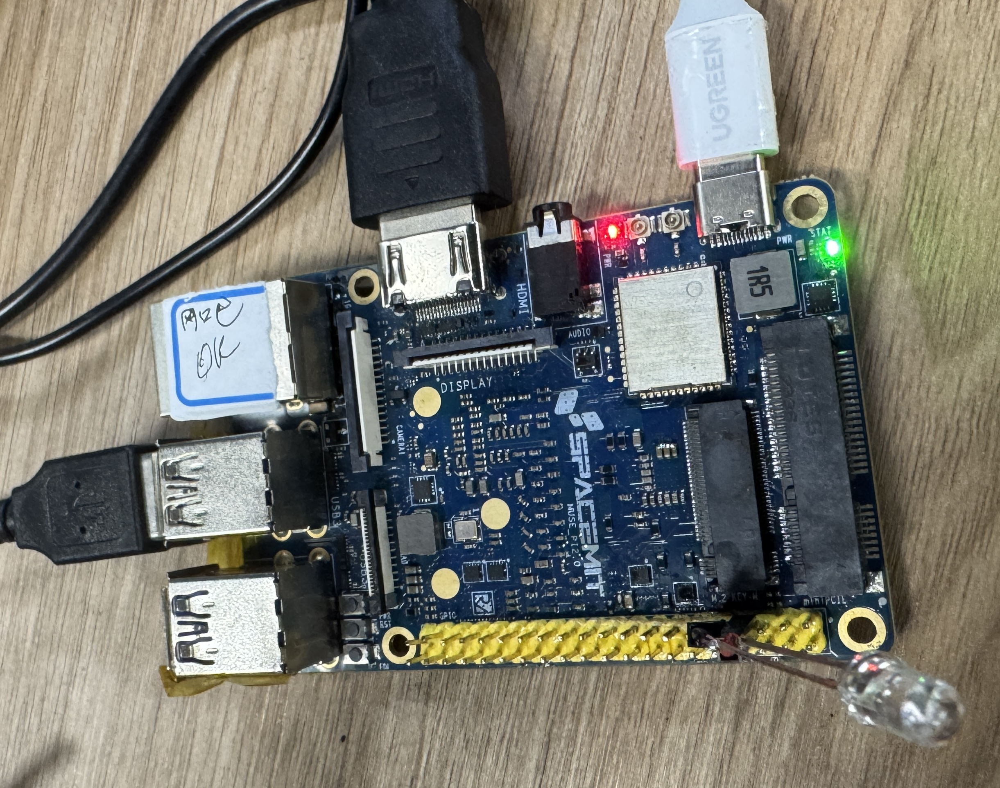
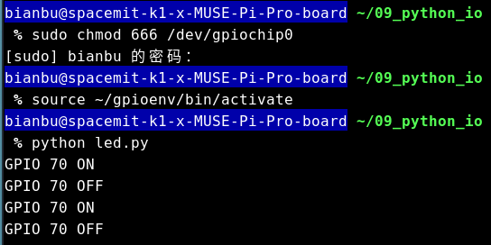

# Python IO 使用介绍及实践

我们为 MUSE Pi Pro 适配了 `gpiozero` 库,通过该库，您可以使用 Python 脚本方便地控制 GPIO 设备，该库的完整文档位于`gpiozero.readthedocs.io`。在实际的使用中，您应该特别注意GPIO引脚的编号和引脚的特殊功能，这些设备的引脚编号与树莓派的教程有所不同。接下来以基于 40 pin 的 MUSE Pi Pro 为例引导您如何使用 `gpiozero` 库。

## 1. 环境搭建

### 1.1. 安装系统依赖

```bash
sudo apt update
sudo apt install -y libopenblas-dev \
python3-dev \
python3-venv \
libcjson-dev libasound2-dev
```

### 1.2. 创建python虚拟环境

设置spacemit python pip源：

```bash
pip config set global.index-url https://pypi.tuna.tsinghua.edu.cn/simple
pip config set global.extra-index-url https://git.spacemit.com/api/v4/projects/33/packages/pypi/simple
```

创建虚拟环境：

```bash
python3 -m venv ~/gpioenv
source ~/gpioenv/bin/activate
```

安装python依赖：

```bash
pip install gpiozero pyserial
```

安装成功则显示：

```bash
Installing collected packages: pyserial, lgpio, setuptools, colorzero, gpiozero
Successfully installed colorzero-2.0 gpiozero-2.0.5 lgpio-0.2.2.0 pyserial-3.5 setuptools-78.1.0
```

注意 gpiozero 的版本必须 >= 2.0.5 。


## 2. 设备引脚布局

以下是对 MUSE Pi Pro引脚说明。

进迭时空官方参考链接：[MUSE Pi Pro 用户使用指南](https://developer.spacemit.com/documentation?token=EIk1wVY9NinD95kMsw0cFM89npd)

<center>
    
    <br>
</center>

GPIO编号：

<center>
    
    <br>
</center>

在编程时，引脚编号请使用 GPIO 后面的数字。

也可以在终端输入以下命令便捷查看：

```bash
sudo chmod 666 /dev/gpiochip0
source ~/gpioenv/bin/activate
pinout
```

输出：

<center>
    
    <br>
</center>

## 3. 从 Python 使用 GPIO

### 3.1. LED 控制

#### 3.1.1. 硬件连接

<center>
    
    <br>
</center>

红色杜邦线连接到 `GPIO70` 控制引脚，黑色杜邦线连接到 `GND` 。


#### 3.1.2. 源码分析

当您在进迭时空的开发板上使用 `gpiozero` 库时，建议在程序的开头加上以下代码：

```py
from gpiozero.pins.lgpio import LGPIOFactory
from gpiozero import Device
Device.pin_factory = LGPIOFactory(chip=0) # 显式指定/dev/gpiochip0
```

这段代码显式地指定了 `gpiozero` 库使用 `lgpio` 库作为底层的引脚工厂，`lgpio` 是针对 linux 更底层的 GPIO 控制库，虽然 `gpiozero` 默认使用 `lgpio` ，但为了保证 `gpiozero` 在 SpacemiT 开发板上的正常工作，建议显示地指定引脚工厂。

当您尝试移植树莓派官方例程时，建议您在其示例代码的开头加上上述三行代码，同时注意引脚编号的差异。


#### 3.1.3. 设备测试

下载源码压缩包：

[Python_IO.zip](code/09_python_io.zip)

解压下载回来的压缩包：

```bash
unzip 09_python_io.zip -d ~/
```

在 MUSE Pi Pro 上执行下面命令查看 ip：
```bash
ifconfig
```

如下图所示，ip 为 `10.0.91.67` 。
<center>
    
    <br>
</center>

执行下面命令将解压好的源码文件传输到 MUSE Pi Pro 上。

> **注**：下面的 `bianbu@10.0.91.67` 根据上面结果替换成对应的 ip 。

```bash
scp -r 09_python_io/ bianbu@10.0.91.67:/home/bianbu
```

在 MUSE Pi Pro 中进入源码目录。
```bash
cd 09_python_io/
```

执行下面命令运行程序：
```bash
sudo chmod 666 /dev/gpiochip0
source ~/gpioenv/bin/activate
python led.py
```

运行脚本之后，LED 灯将以 1s 的间隔时间闪烁。

<center>
    
    <br>
</center>


### 3.2. PWM-LED 控制

#### 3.2.1. 硬件连接

硬件连接方式与 3.1 节相同。

#### 3.2.2. 设备测试

下载源码与 3.1 节相同。

在 MUSE Pi Pro 中进入源码目录。
```bash
cd 09_python_io/
```

执行下面命令运行程序：
```bash
sudo chmod 666 /dev/gpiochip0
source ~/gpioenv/bin/activate
python pwm.py
```

运行脚本之后，LED 灯将以呼吸的方式逐渐由亮变暗然后由暗变亮。

<center>
    
    <br>
</center>


### 3.3. 按键 input 控制

#### 3.3.1. 硬件连接

<center>
    
    <br>
</center>

按键两段分别连接到 `GPIO70` 控制引脚与 `GND` (不区分方向) 。

#### 3.3.2. 设备测试

下载源码与 3.1 节相同。

在 MUSE Pi Pro 中进入源码目录。
```bash
cd 09_python_io/
```

执行下面命令运行程序：
```bash
sudo chmod 666 /dev/gpiochip0
source ~/gpioenv/bin/activate
python input.py
```

运行脚本之后，反复按下按键，可以看到如下输出：

<center>
    
    <br>
</center>


