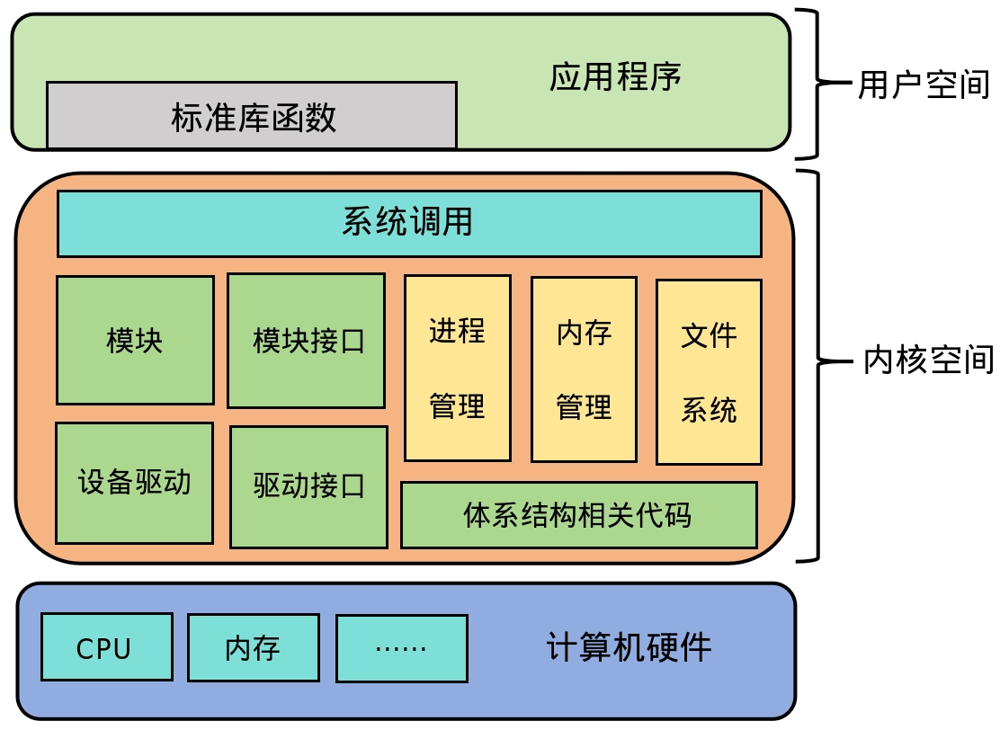
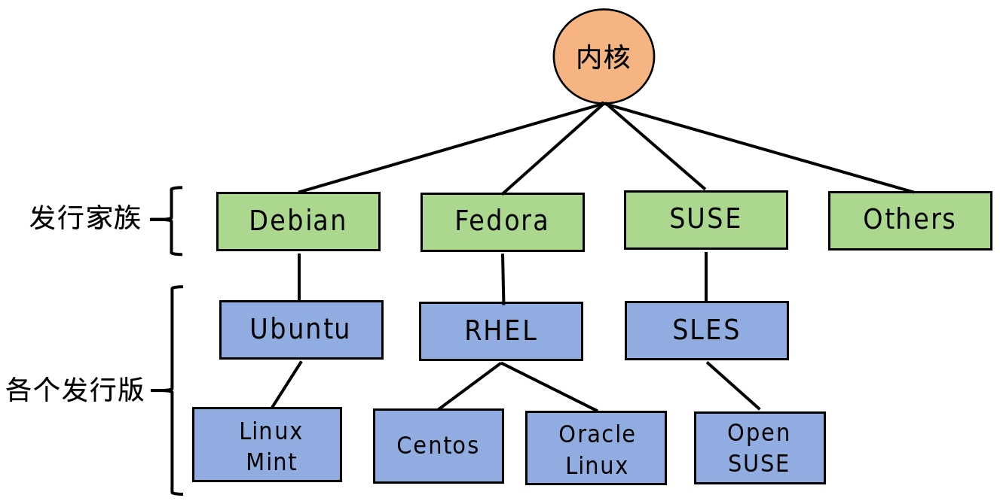
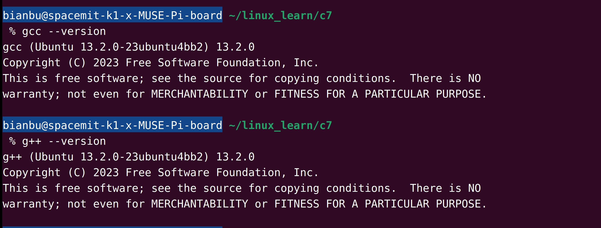
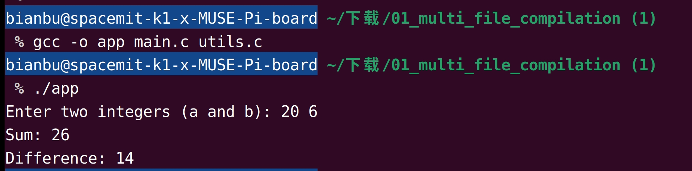

sidebar_position: 1

# 1. Linux系统简介

Linux 是一种开源的、类 Unix 的操作系统，由 Linus Torvalds 于 1991 年首次发布。它因其灵活性、稳定性和广泛的硬件支持，成为从服务器到嵌入式设备广泛使用的操作系统，也是开发者学习操作系统原理和应用开发的首选平台。

## 1.1 Linux系统结构

Linux系统可分为三层，分别是用户空间、内核空间、硬件资源。应用程序位于用户空间，通过系统调用接口与内核空间通信。内核是Linux系统的核心，掌管主要的系统功能，并对硬件资源进行管理。Linux系统结构图可用图1.1.1所示。

<figure style="text-align: center;"> <!-- 设置居中 -->
   <!-- 调整大小 -->
  <figcaption style="margin-top: 10px; color: #555;">图1.1.1 Linux系统结构</figcaption>
</figure>
### **1) 用户空间**

用户空间（User Space）是Linux系统中直接面向用户的部分，包含所有应用程序、标准库和用户级工具，用于提供具体的服务和功能。

- **应用程序**：用户空间包含多种应用程序，如文本编辑器、浏览器、编译器等。这些程序直接与用户交互，为用户提供具体的功能和服务。
- **标准函数库**：标准库函数对复杂的系统调用进行了封装，为开发者提供简单易用的接口。例如，通过GNU C库（glibc），开发者能够以更直观的方式调用系统资源，从而显著提高开发效率。

用户空间程序通过**系统调用**与内核交互，完成文件操作、进程管理、设备访问等任务。系统调用提供了安全且标准化的接口，屏蔽了底层硬件的复杂性。

### **2）内核空间**

内核空间（Kernel Space）是操作系统的核心，负责管理系统的资源并提供基础服务。内核直接控制硬件并实现进程调度、内存管理、设备驱动等关键功能。内核空间的主要功能包括：

- **进程管理**：内核负责进程的调度和管理，支持多任务操作。它通过调度算法决定哪个进程在什么时候执行，从而确保系统的高效运行。
- **内存管理**：内核负责分配和回收内存，支持虚拟内存，使得每个进程能够拥有独立的地址空间，并且系统能够有效地利用物理内存。
- **文件系统**：内核提供文件系统管理，支持不同类型的文件系统（如ext4、xfs）。它负责管理文件的存储、读取和写入操作。
- **设备驱动**：内核通过设备驱动与硬件交互，向上层提供标准化的设备访问接口。例如，无论硬盘使用何种协议，内核提供的接口都保持一致，简化了硬件交互的复杂性。

内核采用模块化设计，支持动态加载和卸载模块（如驱动程序），使得系统更加灵活和可扩展。

### **3）硬件资源**

硬件资源（Hardware Resources Layer）直接涉及计算机的硬件组件，如CPU、内存、硬盘、网络接口等。硬件资源的性能直接影响到操作系统的效率和稳定性。

- **硬件抽象**：内核通过设备驱动程序与硬件资源交互，提供统一的接口给上层应用程序和用户空间。例如，文件系统和应用程序无需关心硬盘使用的具体协议（如SATA、NVMe等），内核会自动处理这些差异。
- **硬件资源管理**：内核对硬件资源进行管理，确保不同应用程序或进程能够共享和访问这些资源，如通过内存管理和CPU调度来优化硬件资源的使用。

## **1.2 Linux发行版**

Linux 的发行版是对 Linux 内核与应用程序的一个打包，旨在提供完整的操作系统体验。每个发行版都集成了不同的工具和组件，以满足不同用户的需求，如桌面环境、服务器管理、开发工具等。Linux发行家族架构如图1.2.1所示。

<figure style="text-align: center;"> <!-- 设置居中 -->
   <!-- 调整大小 -->
  <figcaption style="margin-top: 10px; color: #555;">图1.2.1 Linux发行家族和发行版</figcaption>
</figure>

目前市面上较知名的发行版有：Ubuntu、RedHat、CentOS、Debian、Fedora、SuSE、OpenSUSE、Arch Linux、SolusOS 等。如图1.2.2所示。

<figure style="text-align: center;"> <!-- 设置居中 -->
   <!-- 调整大小 -->
  <figcaption style="margin-top: 10px; color: #555;">图1.2.2 Linux知名发行版</figcaption>
</figure>

# **2. 开发环境搭建**

进行Linux应用开发前，首先需要搭建一个稳定且高效的开发环境。以下是所需的主要工具和环境组件。

## **2.1 软件包管理**

APT（Advanced Package Tool）是 Ubuntu 和 Debian 系列 Linux 发行版的包管理工具，用于安装、更新、删除和管理软件包。常用的包管理命令如下：

- 更新软件包索引

```bash
sudo apt update
```

- 安装软件包

```bash
sudo apt install [软件包名]
```

- 删除软件包

```bash
sudo apt remove [软件包名]
```

- 升级系统所有软件包

```bash
sudo apt upgrade
```

- 清理系统

```bash
sudo apt autoremove  # 删除无用的包
sudo apt clean       # 清理缓存
```

## **2.2 文本编辑器**

选择适合的文本编辑器可以显著提升开发效率。以下是几种常用的编辑器及其特点：

**终端编辑器**

- **`vim`**：功能强大且高度可配置，适合需要高效编辑代码的开发者。
- **`nano`**：简单易用，操作直观，适合初学者快速上手。

**图形界面编辑器**

在 Bianbu Computer S1 上，可以使用以下具有图形界面的编辑器：

- **`VSCodium`**：Visual Studio Code 的开源版本，具备丰富的扩展功能，支持 C/C++ 开发和调试。
- **`Zed`**：一款基于 Rust 开发的现代化轻量级代码编辑器，提供高效性能和简洁界面。

## **2.3 编译器**

GCC是 Linux 系统中强大且标准的编译器工具链，支持多种编程语言，包括 C 和 C++。

打开终端，更新软件包索引并安装 GCC 工具链：

```bash
sudo apt update
sudo apt install build-essential
```

安装完成后，验证 `gcc` 和 `g++` 是否安装成功及其版本信息，如图2.3.1所示。

<figure style="text-align: center;"> <!-- 设置居中 -->
   <!-- 调整大小 -->
  <figcaption style="margin-top: 10px; color: #555;">图2.3.1 GCC工具链安装查询</figcaption>
</figure>

`gcc` 用于编译 C 语言程序， `g++` 用于编译 C++ 语言程序。

## **2.4 调试工具**

- **`gdb`**：GNU 调试器，支持设置断点、单步调试和变量监控。
- **`strace`**：跟踪系统调用和信号，适用于排查系统交互问题。
- **`valgrind`**：用于内存泄漏和内存访问错误的检测。

安装调试工具：

```bash
sudo apt install gdb strace valgrind
```

# **3. 编译工具**

## 3.1 GCC工具链

GCC（GNU Compiler Collection）是一套开源的编译器工具链，支持多种编程语言，包括 C、C++、Objective-C、Fortran、Ada 和 Go。GCC 是 Linux 下的标准编译器，也是跨平台编译的常用工具。其强大的功能和灵活性使其成为开发者在 Linux 环境中进行软件开发的首选工具。

**示例：**编写一个简单程序，输出 "Hello, World!"。

创建程序 hello.c [(点击下载)](code/01_development_enviroment/3-1-hello-example)，内容如下：

```c
#include <stdio.h>

int main() {
    printf("Hello, World!\n");
    return 0;
}
```

> <small style="color: #6c757d;">代码解释：<br>1. `#include <stdio.h>`：包含标准输入输出库，支持 printf 函数。<br>2. `int main()`：程序的入口函数，返回值为 0 表示程序正常运行。<br>3. `printf()`：将字符串 "Hello, World!" 输出到屏幕。</small>

使用 GCC 编译器编译 `hello.c`，生成可执行文件：

```bash
gcc -o hello hello.c
```

> <small style="color: #6c757d;">命令解释：<br>1. `gcc`：调用 GCC 编译器。<br>2. `-o hello`：指定输出文件名为 hello（默认输出文件为 a.out）。<br>3. `hello.c`：输入的源文件。</small>

程序成功运行后，会在终端输出 "Hello, World!"。如图3.1.1所示。

<figure style="text-align: center;"> <!-- 设置居中 -->
   <!-- 调整大小 -->
  <figcaption style="margin-top: 10px; color: #555;">图3.1.1 GCC编译演示</figcaption>
</figure>

## **3.2 多文件编译**

在实际项目中，代码通常由多个源文件组成，而不是集中在一个文件中。为了生成一个完整的可执行程序，开发者需要将这些源文件一起编译并链接。GCC 编译器支持直接对多个文件进行编译链接。

### 示例：多文件项目编译

假设有多文件项目 [(点击下载)](code/01_development_enviroment/3-2-multi-file-compilation) 结构如下：

```bash
project/
├── main.c   # 主程序文件
├── utils.c  # 工具函数实现
├── utils.h  # 工具函数声明
```

1）`main.c`：包含主函数`main()`，负责程序的入口逻辑。

```c
#include <stdio.h>
#include "utils.h"  // 包含工具函数声明

int main() {
    int a, b;

    // 用户输入a和b的值
    printf("Enter two integers (a and b): ");
    scanf("%d %d", &a, &b);

    // 调用工具函数并输出结果
    printf("Sum: %d\n", add(a, b));         // 调用add函数
    printf("Difference: %d\n", subtract(a, b)); // 调用subtract函数

    return 0;
}
```

2）`utils.c`：实现了一些辅助函数，例如加法和减法。

```c
#include "utils.h"  // 包含头文件

int add(int a, int b) {
    return a + b;
}

int subtract(int a, int b) {
    return a - b;
}
```

3）`utils.h`：定义了`utils.c`中的函数接口，供其他文件调用。

```c
#ifndef UTILS_H
#define UTILS_H

// 声明加法函数
int add(int a, int b);

// 声明减法函数
int subtract(int a, int b);

#endif
```

### **3.2.1 单命令编译和链接** 

使用以下命令将多个源文件编译并链接成一个可执行文件：

```bash
gcc -o app main.c utils.c
```

> <small style="color: #6c757d;">命令解释：<br>1. `gcc`：调用 GCC 编译器。<br>2. `-o app`：指定生成的可执行文件名称为app。<br>3. `main.c utils.c`：列出需要编译的所有源文件。</small>

程序运行和输出结果如图3.2.1所示。

<figure style="text-align: center;"> <!-- 设置居中 -->
   <!-- 调整大小 -->
  <figcaption style="margin-top: 10px; color: #555;">图3.2.1 多文件编译演示</figcaption>
</figure>
### **3.2.2 分步编译和链接** 

对于这种多文件项目，也可以先将每个源文件分别编译成目标文件（`.o`文件），然后再进行链接：

```bash
gcc -c main.c              # 编译main.c，生成main.o
gcc -c utils.c             # 编译utils.c，生成utils.o
gcc -o app main.o utils.o  # 链接生成可执行文件app
```

> <small style="color: #6c757d;">`-c`：仅编译源文件，不进行链接，生成目标文件（.o文件）。</small>

编译完成后，运行生成的可执行文件：

```bash
./app
```

在分步编译时，会生成很多中间文件（如`.o`文件）。可以使用以下命令清理：

```bash
rm *.o app
```

## 3.3 Makefile使用

从3.2节可以看到，当项目包含多个文件时，手动管理编译变得繁琐。这时可以使用 `Makefile` 自动化处理文件依赖和编译过程。

针对上述示例，添加下述 `Makefile` 脚本来编译项目：

```makefile
# 定义变量
CC = gcc
CFLAGS = -Wall -g
TARGET = app

# 默认目标
all: $(TARGET)

# 链接目标文件生成可执行文件
$(TARGET): main.o utils.o
	$(CC) $(CFLAGS) -o $(TARGET) main.o utils.o

# 编译源文件
main.o: main.c utils.h
	$(CC) $(CFLAGS) -c main.c

utils.o: utils.c utils.h
	$(CC) $(CFLAGS) -c utils.c

# 清理生成文件
clean:
	rm -f *.o $(TARGET)
```

> <small style="color: #6c757d;">Makefile语句解释：<br>1. `all`：默认目标，表示最终要生成的目标文件。<br>2. `main.o` 和 `utils.o`：编译各源文件生成目标文件。<br>3. `clean`：清理编译过程中的临时文件和生成文件。</small>

使用 `make` 命令编译程序：

```bash
make
```

清理文件：

```bash
make clean
```

整个编译和运行过程如图3.3.1所示。

<figure style="text-align: center;"> <!-- 设置居中 -->
   <!-- 调整大小 -->
  <figcaption style="margin-top: 10px; color: #555;">图3.3.1 makefile编译演示</figcaption>
</figure>

# **4. GDB调试**

GDB（GNU Debugger）是 Linux 系统中功能强大的调试工具，用于调试 C/C++ 程序。它支持断点调试、单步执行、查看变量值、分析调用栈等功能，是开发者定位和修复程序问题的重要工具。

## 4.1 GDB调试命令

假设有可执行程序 `test`，打开终端，启动 GDB 调试：

```bash
gdb test
```

进入 GDB 之后，便可以开始调试代码。以下是一些常用的调试命令：

- 运行程序：启动并运行程序，程序在错误发生处终止。

```bash
(gdb) run
```

- 查看调用栈：分析函数调用顺序，定位错误的函数。

```bash
(gdb) backtrace
```

- 设置断点：

```bash
(gdb) break main
```

> <small style="color: #6c757d;">在 `main` 函数入口处设置断点，程序运行到此处会暂停。</small>

- 单步执行：执行当前代码行并暂停在下一行。

```bash
(gdb) next
```

- 打印变量值：

```bash
(gdb) print val
```

> <small style="color: #6c757d;">打印变量 `val` 值，确认变量是否被正确赋值。</small>

## 4.2 示例：使用 GDB 调试程序

以下示例展示如何通过 GDB 调试工具发现程序中的段错误。

编写代码 debug.c [(点击下载)](code/01_development_enviroment/4-1-gdb-example)：

```c
#include <stdio.h>

int main() {
    int *ptr = NULL;  // 定义一个空指针，未指向任何有效地址

    *ptr = 10;  // 尝试通过空指针访问内存，这会导致段错误
    printf("Value: %d\n", *ptr);  // 这行代码不会被执行

    return 0;
}
```

使用 `gcc` 编译器编译代码，确保添加调试信息（`-g` 标志）：

```bash
gcc -g -o debug debug.c
```

在终端启动 GDB 调试器并加载程序：

```
gdb debug
```

调试过程如图4.2.1所示。在 GDB 中输入 `run`，程序开始运行。由于尝试通过空指针访问内存，程序会抛出段错误并退出。使用 `backtrace` 命令可以查看程序的调用栈，从而定位错误发生的位置。打印 `ptr` 的值，可以看到地址为 `0`，说明是个空指针。

<figure style="text-align: center;"> <!-- 设置居中 -->
   <!-- 调整大小 -->
  <figcaption style="margin-top: 10px; color: #555;">图4.2.1 GDB调试实例</figcaption>
</figure>
