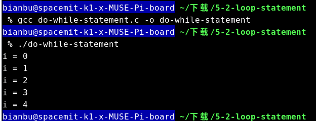
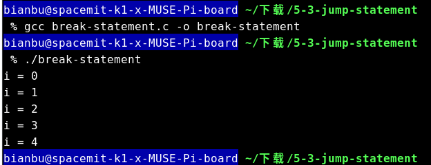
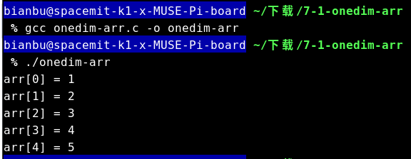
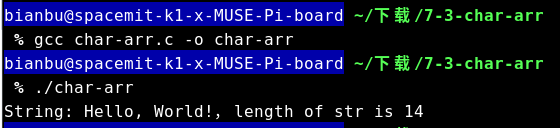
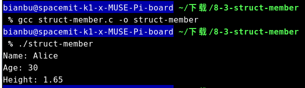
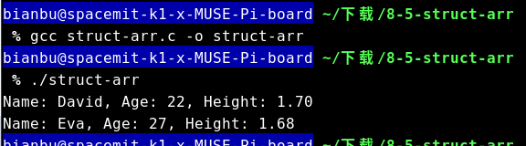

sidebar_position: 3
# 1. 简介
## 1.1 C语言发展历史
C 语言最初是作为 Unix 系统的开发工具而发明的。

1969年，美国贝尔实验室的肯·汤普森（Ken Thompson）与丹尼斯·里奇（Dennis Ritchie）一起开发了 Unix 操作系统。Unix 是用汇编语言写的，无法移植到其他计算机，他们决定使用高级语言重写。但是，当时的高级语言无法满足他们的要求，汤普森就在 BCPL 语言的基础上发明了 B 语言。

1972年，丹尼斯·里奇和布莱恩·柯林汉（Brian Kernighan）又在 B 语言的基础上重新设计了一种新语言，这种新语言取代了 B 语言，所以称为 C 语言。

1973年，整个 Unix 系统都使用 C 语言重写。此后，这种语言开始快速流传，广泛用于各种操作系统和系统软件的开发。

1988年，美国国家标准协会（ANSI）正式将 C 语言标准化，标志着 C 语言开始稳定和规范化。

C语言具有可移植性、语法简单、执行效率高等特点，这也使得 C 语言在几十年后的今天，依然是最广泛使用、最流行的系统编程语言之一，Unix 和 Linux 系统现在还是使用 C 语言开发。

## 1.2 运行C语言代码

要运行 C 语言代码，我们需要一个 C 语言的编译器。以下是运行 C 语言代码的基本步骤：

**1) 编写代码**

使用文本编辑器编写 C 语言代码，并将其保存为 `.c` 文件。例如，创建一个名为 [hello-world.c](code/03_C/1-2-hello-world/) 的文件，并输入以下代码：

```c
#include <stdio.h>

int main() {
    printf("Hello, World!\n");
    return 0;
}
```

**2) 编译代码**

使用 C 语言编译器将源代码编译为可执行文件。常见的 C 编译器包括 GCC（GNU Compiler Collection）和 Clang。以下是使用 GCC 编译 `hello-world.c` 文件的命令：

```sh
gcc hello-world.c -o hello-world
```

这将生成一个名为 `hello-world` 的可执行文件。

**3) 运行程序**

运行生成的可执行文件。例如，在 Unix 或 Linux 系统上，可以使用以下命令运行程序：

```shell
./hello-world
```

这将输出：

```shell
Hello, World!
```

程序运行效果如图 1.2.1 所示。
<center>
    
    <br>
    <div style="color:orange; border-bottom: 1px solid #d9d9d9;
    display: inline-block;
    color: #999;
    padding: 2px;"> 图1.2.1 hello-world运行结果</div>
</center>	

# 2. 基本语法

## 2.1 Token

在 C 语言中，Token（也译作“令牌”）是程序的基本组成单位，编译器通过对源代码进行词法分析，将代码分解成一个个的 Token。

C 语言的 Token 主要包括以下几种类型：

- **关键字（Keywords）**

关键字是 C 语言中预定义的保留字，它们具有特殊的含义并且不能用作标识符。关键字用于定义数据类型、控制结构等。例如：`int`, `return`, `if`, `else`。

- **标识符（Identifiers）**

标识符是程序员定义的名称，用于标识变量、函数、数组等。标识符必须以字母或下划线开头，后面可以跟字母、数字或下划线。例如：`main`, `total`, `sum`。

- **常量（Constants）**

常量是固定值，在程序执行过程中不会改变。常量可以是整数、浮点数、字符或字符串。例如：`10`, `3.14`, `'A'`, `"Hello"`。

- **字符串字面量（String Literals）**

字符串字面量是由双引号括起来的一系列字符，用于表示文本。例如：`"Hello, World!"`。

- **运算符（Operators）**

运算符是用于执行操作的符号，例如算术运算、逻辑运算、比较运算等。例如：`+`, `-`, `*`, `/`, `&&`, `||`, `==`。

- **分隔符（Separators）**

分隔符用于分隔代码中的不同部分，例如语句、函数参数等。常见的分隔符包括逗号、分号、括号等。例如：`,`, `;`, `()`, `{}`。

## 2.2 注释

在使用示例程序之前，我们先简单介绍下注释，这将有利于我们接下来理解案例程序。

在编程中，注释是用来解释代码的文本，它们不会被编译器执行。注释的主要目的是提高代码的可读性，使其他开发者（包括未来的自己）能够更容易地理解代码的意图和逻辑。

在 C 语言中，有两种类型的注释：

- **单行注释：** 使用 `//` 开始，注释内容从 开始到该行的末尾。例如：

```c
// 这是一个单行注释
int a = 5; // 变量 a 被赋值为 5
```

- **多行注释：** 使用 `/*` 开始，`*/` 结束，可以跨越多行。例如：

```c
/* 这是一个多行注释
   它可以跨越多行
   用于解释复杂的代码段 */
int b = 10;
```

注释在代码中非常重要，因为它们可以帮助解释复杂的逻辑、记录假设和决策、以及提供其他有用的信息。

## 2.3 示例程序

以下是一个比较简单的C语言示例程序 [basic-grammar.c](code/03_C/2-3-basic-grammar/) ，其功能是接受用户输入的两个整数，求和之后将和打印到控制台。大家可以结合示例程序中的注释来理解不同种类的Token。

```c
#include <stdio.h>   // 预处理指令，用于包含标准输入输出库

#define PI 3.14159    // 宏定义，定义了一个常量 PI

// 函数声明，int 是关键字，add 是标识符，a 和 b 是参数标识符
int add(int a, int b);  

int main() {         // 主函数，int 是关键字，main 是标识符
    // 变量声明，int 是关键字，num1, num2, sum 是标识符
    int num1, num2, sum;  

    // 函数调用，printf 是标识符，"Enter two integers: " 是字符串字面量
    printf("Enter two integers: ");
    // 函数调用，用户输入，scanf 是标识符，"%d %d" 是字符串字面量，&num1 和 &num2 是地址运算符和标识符 
    scanf("%d %d", &num1, &num2);

    // 函数调用，add 是标识符，num1 和 num2 是标识符，sum 是标识符
    sum = add(num1, num2);

    // 函数调用，输出结果，printf 是标识符，"Sum: %d\n" 是字符串字面量，sum 是标识符
    printf("Sum: %d\n", sum);

    return 0;  // 返回语句，return 是关键字，0 是常量
}

// 函数定义，int 是关键字，add 是标识符，a 和 b 是参数标识符
int add(int a, int b) {
    // 返回语句，return 是关键字，a 和 b 是标识符，+ 是运算符
    return a + b;
}
```

示例程序运行过程及结果如图2.3.1所示。
<center>
    
    <br>
    <div style="color:orange; border-bottom: 1px solid #d9d9d9;
    display: inline-block;
    color: #999;
    padding: 2px;"> 图2.3.1 basic-grammar运行结果</div>
</center>

# 3. 数据类型
## 3.1 基本数据类型

C 语言提供了多种基本数据类型，用于表示不同类型的数据。主要的基本数据类型包括：

- **整型（Integer）**

整型用于表示整数。常见的整型类型有 `int`、`short`、`long` 和 `long long`。例如：

```c
int a = 10;
short b = 5;
long c = 100000L;
long long d = 10000000000LL;
```

- **浮点型（Floating-point）**

浮点型用于表示小数。常见的浮点类型有 `float` 和 `double`。例如：

```c
float e = 3.14f;
double f = 3.141592653589793;
```

- **字符型（Character）**

字符型用于表示单个字符。字符型使用 `char` 类型。例如：

```c
char g = 'A';
```

## 3.2 枚举类型

枚举类型（Enumeration）用于定义一组命名的整数常量。使用 `enum` 关键字定义枚举类型。例如：

```c
enum Day {
    SUNDAY,
    MONDAY,
    TUESDAY,
    WEDNESDAY,
    THURSDAY,
    FRIDAY,
    SATURDAY
};

enum Day today = MONDAY;
```

## 3.3 类型转换

在 C 语言中，可以通过类型转换将一种数据类型转换为另一种数据类型。类型转换有两种方式：隐式转换和显式转换。

- **隐式转换**

隐式转换是由编译器自动完成的类型转换。例如，将 `int` 类型的值赋给 `float` 类型的变量：

```c
int a = 10;
float b = a; // 隐式转换
```

- **显式转换**

显式转换是由程序员手动完成的类型转换，使用类型转换运算符。例如，将 `float` 类型的值转换为 `int` 类型：

```c
float c = 3.14f;
int d = (int)c; // 显式转换
```
# 4. 运算符

## 4.1 算术运算符

算术运算符用于执行基本的数学运算，如加法、减法、乘法和除法。常见的算术运算符包括：

- `+`：加法运算符，用于两个操作数相加。
- `-`：减法运算符，用于从第一个操作数中减去第二个操作数。
- `*`：乘法运算符，用于两个操作数相乘。
- `/`：除法运算符，用于第一个操作数除以第二个操作数。
- `%`：取模运算符，用于计算两个操作数相除的余数。

示例：

```c
int a = 10;
int b = 3;
int sum = a + b;    // sum = 13
int diff = a - b;   // diff = 7
int prod = a * b;   // prod = 30
int quot = a / b;   // quot = 3
int mod = a % b;    // mod = 1
```

## 4.2 关系运算符

关系运算符用于比较两个操作数的关系，结果是一个布尔值（真或假）。常见的关系运算符包括：

- `==`：等于运算符，用于判断两个操作数是否相等。
- `!=`：不等于运算符，用于判断两个操作数是否不相等。
- `>`：大于运算符，用于判断第一个操作数是否大于第二个操作数。
- `<`：小于运算符，用于判断第一个操作数是否小于第二个操作数。
- `>=`：大于等于运算符，用于判断第一个操作数是否大于或等于第二个操作数。
- `<=`：小于等于运算符，用于判断第一个操作数是否小于或等于第二个操作数。

示例：

```c
int a = 10;
int b = 3;
bool result1 = (a == b);  // result1 = false
bool result2 = (a != b);  // result2 = true
bool result3 = (a > b);   // result3 = true
bool result4 = (a < b);   // result4 = false
bool result5 = (a >= b);  // result5 = true
bool result6 = (a <= b);  // result6 = false
```

## 4.3 逻辑运算符

逻辑运算符用于执行逻辑运算，结果是一个布尔值。常见的逻辑运算符包括：

- `&&`：逻辑与运算符，当且仅当两个操作数都为真时，结果为真。
- `||`：逻辑或运算符，当至少一个操作数为真时，结果为真。
- `!`：逻辑非运算符，用于将操作数的布尔值取反。

示例：

```c
bool a = true;
bool b = false;
bool result1 = (a && b);  // result1 = false
bool result2 = (a || b);  // result2 = true
bool result3 = !a;        // result3 = false
```

## 4.4 赋值运算符

赋值运算符用于将右侧操作数的值赋给左侧操作数。常见的赋值运算符包括：

- `=`：赋值运算符，用于将右侧操作数的值赋给左侧操作数。
- `+=`：加赋值运算符，用于将右侧操作数的值加到左侧操作数上，并将结果赋给左侧操作数。
- `-=`：减赋值运算符，用于将右侧操作数的值从左侧操作数中减去，并将结果赋给左侧操作数。
- `*=`：乘赋值运算符，用于将右侧操作数的值乘到左侧操作数上，并将结果赋给左侧操作数。
- `/=`：除赋值运算符，用于将左侧操作数除以右侧操作数，并将结果赋给左侧操作数。
- `%=`：取模赋值运算符，用于将左侧操作数取模右侧操作数，并将结果赋给左侧操作数。

示例 [assignment-operator.c](code/03_C/4-4-assignment-operator/) ：

```c
#include <stdio.h>

int main() {
    int a = 10;
    a += 5;  // a = 15
    printf("a += 5 ： %d\n", a);
    a -= 3;  // a = 12
    printf("a -= 3 ： %d\n", a);
    a *= 2;  // a = 24
    printf("a *= 2 ： %d\n", a);
    a /= 4;  // a = 6
    printf("a /= 4 ： %d\n", a);
    a %= 5;  // a = 1
    printf("a %= 5 ： %d\n", a);
    return 0;
}
```

示例程序运行结果如图4.4.1所示。
<center>
    
    <br>
    <div style="color:orange; border-bottom: 1px solid #d9d9d9;
    display: inline-block;
    color: #999;
    padding: 2px;"> 图4.4.1 赋值运算示例</div>
</center>

## 4.5 位运算符

位运算符用于对整数类型的位进行操作。常见的位运算符包括：

- `&`：按位与运算符，对应位都为1时，结果为1，否则为0。
- `|`：按位或运算符，对应位有一个为1时，结果为1。
- `^`：按位异或运算符，对应位不同，结果为1，否则为0。
- `~`：按位取反运算符，将每个位取反。
- `<<`：左移运算符，将左侧操作数的位左移右侧操作数指定的位数。
- `>>`：右移运算符，将左侧操作数的位右移右侧操作数指定的位数。

示例 [bitwise-operators.c](code/03_C/4-5-bitwise-operators/)：

```c
#include <stdio.h>

int main() {
    int a = 5;      // 0101
    int b = 3;      // 0011
    int result1 = a & b;  // 0001 = 1
    int result2 = a | b;  // 0111 = 7
    int result3 = a ^ b;  // 0110 = 6
    int result4 = ~a;     // 1010 (取决于整数的位数)
    int result5 = a << 1; // 1010 = 10
    int result6 = a >> 1; // 0010 = 2

    printf("result1 = %d\n", result1);
    printf("result2 = %d\n", result2);
    printf("result3 = %d\n", result3);
    printf("result4 = %d\n", result4);
    printf("result5 = %d\n", result5);
    printf("result6 = %d\n", result6);

    return 0;
}
```

示例程序运行结果如图4.5.1所示。
<center>
    
    <br>
    <div style="color:orange; border-bottom: 1px solid #d9d9d9;
    display: inline-block;
    color: #999;
    padding: 2px;"> 图4.5.1 位运算示例</div>
</center>

# 5. 控制结构

## 5.1 条件语句

条件语句用于根据条件的真假执行不同的代码块。常见的条件语句包括 `if`、`else if` 和 `else`。

示例 [conditional-statement.c](code/03_C/5-1-conditional-statement/)：

```c
#include <stdio.h>

int main() {
    int a = 10;
    if (a > 5) {
        printf("a is greater than 5\n");
    } else if (a == 5) {
        printf("a is equal to 5\n");
    } else {
        printf("a is less than 5\n");
    }
    return 0;
}
```

示例程序运行结果如图5.1.1所示。
<center>
    
    <br>
    <div style="color:orange; border-bottom: 1px solid #d9d9d9;
    display: inline-block;
    color: #999;
    padding: 2px;"> 图5.1.1 条件语句运行结果</div>
</center>

## 5.2 循环语句

循环语句用于重复执行代码块，直到满足特定条件。常见的循环语句包括 `for`、`while` 和 `do while`。

### 5.2.1 for 循环

`for` 循环用于执行已知次数的循环。

示例 [for-statement.c](code/03_C/5-2-loop-statement/)：

```c
#include <stdio.h>

int main() {
    for (int i = 0; i < 5; i++) {
        printf("i = %d\n", i);
    }
    return 0;
}
```

示例程序运行结果如图5.2.1所示。
<center>
    
    <br>
    <div style="color:orange; border-bottom: 1px solid #d9d9d9;
    display: inline-block;
    color: #999;
    padding: 2px;"> 图5.2.1 for循环运行结果</div>
</center>

### 5.2.2 while 循环

`while` 循环用于执行未知次数的循环，直到条件为假。

示例 [while-statement.c](code/03_C/5-2-loop-statement/)：

```c
#include <stdio.h>

int main() {
    int i = 0;
    while (i < 5) {
        printf("i = %d\n", i);
        i++;
    }
    return 0;
}
```

示例程序运行结果如图5.2.2所示。
<center>
    
    <br>
    <div style="color:orange; border-bottom: 1px solid #d9d9d9;
    display: inline-block;
    color: #999;
    padding: 2px;"> 图5.2.2 while循环运行结果</div>
</center>

### 5.2.3 do while 循环

`do while` 循环类似于 `while` 循环，但至少执行一次。

示例 [do-while-statement.c](code/03_C/5-2-loop-statement/)：

```c
#include <stdio.h>

int main() {
    int i = 0;
    do {
        printf("i = %d\n", i);
        i++;
    } while (i < 5);
    return 0;
}
```

示例程序运行结果如图5.2.3所示。
<center>
    
    <br>
    <div style="color:orange; border-bottom: 1px solid #d9d9d9;
    display: inline-block;
    color: #999;
    padding: 2px;"> 图5.2.3 do-while循环运行结果</div>
</center>

## 5.3 跳转语句

跳转语句用于控制程序的执行流程。常见的跳转语句包括 `break`、`continue` 和 `goto`。

### 5.3.1 break 语句

`break` 语句用于终止循环或 `switch` 语句。

示例 [break-statement.c](code/03_C/5-3-jump-statement/)：

```c
#include <stdio.h>

int main() {
    for (int i = 0; i < 10; i++) {
        if (i == 5) {
            break;
        }
        printf("i = %d\n", i);
    }
    return 0;
}
```

示例程序运行结果如图5.3.1所示。
<center>
    
    <br>
    <div style="color:orange; border-bottom: 1px solid #d9d9d9;
    display: inline-block;
    color: #999;
    padding: 2px;"> 图5.3.1 break示例</div>
</center>

### 5.3.2 continue 语句

`continue` 语句用于跳过当前循环的剩余部分，并继续下一次循环。

示例 [continue-statement.c](code/03_C/5-3-jump-statement/)：

```c
#include <stdio.h>

int main() {
    for (int i = 0; i < 10; i++) {
        if (i % 2 == 0) {
            continue;
        }
        printf("i = %d\n", i);
    }
    return 0;
}
```

示例程序运行结果如图5.3.2所示。
<center>
    
    <br>
    <div style="color:orange; border-bottom: 1px solid #d9d9d9;
    display: inline-block;
    color: #999;
    padding: 2px;"> 图5.3.2 continue示例</div>
</center>

### 5.3.3 goto 语句

`goto` 语句用于无条件跳转到程序中的指定标签。

示例 [goto-statement.c](code/03_C/5-3-jump-statement/)：

```c
#include <stdio.h>

int main() {
    int i = 0;
    label:
    printf("i = %d\n", i);
    i++;
    if (i < 5) {
        goto label;
    }
    return 0;
}
```

示例程序运行结果如图5.3.3所示。
<center>
    
    <br>
    <div style="color:orange; border-bottom: 1px solid #d9d9d9;
    display: inline-block;
    color: #999;
    padding: 2px;"> 图5.3.3 goto示例</div>
</center>

# 6. 函数

## 6.1 函数定义与声明

在 C 语言中，函数是一个独立的代码块，用于执行特定的任务。函数的定义包括函数名、参数列表和函数体。函数的声明用于告诉编译器函数的名称和参数类型。

示例 [function-define.c](code/03_C/6-1-function-define/)：

```c
#include <stdio.h>

int add(int a, int b) {
    return a + b;
}

int main() {
    int sum = add(5, 3);
    printf("Sum: %d\n", sum);
    return 0;
}
```

示例程序运行结果如图6.1.1所示。
<center>
    
    <br>
    <div style="color:orange; border-bottom: 1px solid #d9d9d9;
    display: inline-block;
    color: #999;
    padding: 2px;"> 图6.1.1 add函数调用结果</div>
</center>

## 6.2 函数参数

函数可以接受参数，这些参数在函数调用时传递给函数。参数可以是值传递或引用传递。

- **值传递**：在函数调用时，将实际参数的值复制一份传递给函数。函数内部对参数的修改不会影响实际参数。

- **引用传递**：在函数调用时，将实际参数的引用传递给函数。函数内部对参数的修改会影响实际参数。

示例 [function-args.c](code/03_C/6-2-function-args/)：

```c
#include <stdio.h>

// 值传递
void printValue(int x) {
    printf("Value: %d\n", x);
}

// 引用传递
void swap(int *a, int *b) {
    int temp = *a;
    *a = *b;
    *b = temp;
}

int main() {
    int num = 10;
    printValue(num);

    int x = 5, y = 10;
    swap(&x, &y);
    printf("x: %d, y: %d\n", x, y);
    return 0;
}
```

示例程序运行结果如图6.2.1所示。
<center>
    
    <br>
    <div style="color:orange; border-bottom: 1px solid #d9d9d9;
    display: inline-block;
    color: #999;
    padding: 2px;"> 图6.2.1 参数传递示例</div>
</center>

## 6.3 返回值

函数可以返回一个值，返回值的类型在函数定义和声明中指定。

示例 [return-value.c](code/03_C/6-3-return-value/)：

```c
#include <stdio.h>

int multiply(int a, int b) {
    return a * b;
}

float divide(float a, float b) {
    if (b != 0) {
        return a / b;
    } else {
        printf("Error: Division by zero\n");
        return 0;
    }
}

int main() {
    int product = multiply(4, 5);
    printf("Product: %d\n", product);

    float quotient = divide(10.0, 2.0);
    printf("Quotient: %.2f\n", quotient);
    return 0;
}
```

示例程序运行结果如图6.3.1所示。
<center>
    
    <br>
    <div style="color:orange; border-bottom: 1px solid #d9d9d9;
    display: inline-block;
    color: #999;
    padding: 2px;"> 图6.3.1 函数返回示例</div>
</center>

# 7. 数组

## 7.1 一维数组

一维数组是具有相同数据类型的元素的集合。数组中的每个元素都有一个索引，可以通过索引访问元素。

示例 [onedim-arr.c](code/03_C/7-1-onedim-arr/)：

```c
#include <stdio.h>

int main() {
    int arr[5] = {1, 2, 3, 4, 5};
    for (int i = 0; i < 5; i++) {
        printf("arr[%d] = %d\n", i, arr[i]);
    }
    return 0;
}
```

示例程序运行结果如图7.1.1所示。
<center>
    
    <br>
    <div style="color:orange; border-bottom: 1px solid #d9d9d9;
    display: inline-block;
    color: #999;
    padding: 2px;"> 图7.1.1 一维数组示例</div>
</center>

在上面的示例中，我们定义了一个包含 5 个整数的一维数组 `arr`，并使用 `for` 循环遍历数组中的每个元素，打印其值。

### 初始化数组

数组可以在声明时进行初始化，也可以在声明后逐个赋值。例如：

```c
int arr[5] = {1, 2, 3, 4, 5}; // 声明时初始化
int arr[5];
arr[0] = 1; // 声明后逐个赋值
arr[1] = 2;
arr[2] = 3;
arr[3] = 4;
arr[4] = 5;
```

### 访问数组元素

数组元素可以通过索引访问，索引从 0 开始。例如：

```c
int firstElement = arr[0]; // 访问第一个元素
int lastElement = arr[4];  // 访问最后一个元素
```

### 修改数组元素

数组元素的值可以通过索引进行修改。例如：

```c
arr[2] = 10; // 将第三个元素的值修改为 10
```

通过以上内容，我们了解了一维数组的基本概念、初始化方法、访问和修改数组元素的方法。

一维数组是具有相同数据类型的元素的集合。数组中的每个元素都有一个索引，可以通过索引访问元素。

## 7.2 二维数组

二维数组是数组的数组，可以用于表示矩阵或表格数据。

示例 [twodim-arr.c](code/03_C/7-2-twodim-arr/)：

```c
#include <stdio.h>

int main() {
    int matrix[2][3] = {
        {1, 2, 3},
        {4, 5, 6}
    };
    for (int i = 0; i < 2; i++) {
        for (int j = 0; j < 3; j++) {
            printf("matrix[%d][%d] = %d\n", i, j, matrix[i][j]);
        }
    }
    return 0;
}
```

示例程序运行结果如图7.2.1所示。
<center>
    
    <br>
    <div style="color:orange; border-bottom: 1px solid #d9d9d9;
    display: inline-block;
    color: #999;
    padding: 2px;"> 图7.2.1 二维数组示例</div>
</center>

## 7.3 字符数组

字符数组用于存储字符串。字符串是以 `\0` 结尾的字符序列，一般情况下我们不用主动去指定字符数组的那个字符是`\0`，但需要在字符数组结尾给`\0`预留一个位置。

示例 [char-arr.c](code/03_C/7-3-char-arr/)：

```c
#include <stdio.h>

int main() {
    char str[] = "Hello, World!";
    size_t length = sizeof(str);  // length 将会等于 14
    printf("String: %s，length of str is %zu\n", str, length);
    return 0;
}
```

示例程序运行结果如图7.3.1所示。
<center>
    
    <br>
    <div style="color:orange; border-bottom: 1px solid #d9d9d9;
    display: inline-block;
    color: #999;
    padding: 2px;"> 图7.3.1 字符串示例</div>
</center>

大家可能会疑惑为什么“Hello, World!”明明只有13个字符，但str的长度却是14。
这是因为该字符串包括 13 个可见字符（H, e, l, l, o, ',', ' ', W, o, r, l, d, '!'）以及一个末尾的空字符 '\0'。因此，字符串的实际长度（即数组 str 的长度）是：13（可见字符） + 1（空字符） = 14

# 8. 结构体

## 8.1 定义结构体

结构体（struct）是用户定义的数据类型，用于将不同类型的数据组合在一起。结构体的定义使用 `struct` 关键字。

### 示例

```c
struct Person {
    char name[50];
    int age;
    float height;
};
```

在上面的示例中，我们定义了一个名为 `Person` 的结构体，包含三个成员：`name`（字符数组）、`age`（整数）和 `height`（浮点数）。

## 8.2 声明和初始化结构体变量

结构体变量可以在定义结构体时声明，也可以在定义后声明。结构体变量可以在声明时初始化，也可以在声明后逐个赋值。

### 示例

```c
struct Person person1 = {"Alice", 30, 1.65}; // 声明时初始化
struct Person person2;
// 声明后逐个赋值
person2.age = 25;
strcpy(person2.name, "Bob");// strcpy函数用于将源字符串复制到目标字符串
person2.height = 1.75;
```

## 8.3 访问结构体成员

结构体成员可以通过点运算符（`.`）访问。

示例 [struct-member.c](code/03_C/8-3-struct-member/)：

```c
#include <stdio.h>
#include <string.h>

struct Person {
    char name[50];
    int age;
    float height;
};

int main() {
    struct Person person1 = {"Alice", 30, 1.65};
    struct Person person2;
    person2.age = 25;
    strcpy(person2.name, "Bob");
    person2.height = 1.75;

    printf("Name: %s\n", person1.name);
    printf("Age: %d\n", person1.age);
    printf("Height: %.2f\n", person1.height);

    return 0;
}
```

示例程序运行结果如图8.3.1所示。
<center>
    
    <br>
    <div style="color:orange; border-bottom: 1px solid #d9d9d9;
    display: inline-block;
    color: #999;
    padding: 2px;"> 图8.3.1 结构体示例</div>
</center>

## 8.4 嵌套结构体

结构体可以包含其他结构体作为其成员。

示例 [nested-struct.c](code/03_C/8-4-nested-struct/)：

```c
#include <stdio.h>
#include <string.h>

int main() {
    struct Address {
        char city[50];
        char street[50];
        int zipCode;
    };

    struct Person {
        char name[50];
        int age;
        float height;
        struct Address address;
    };

    struct Person person3 = {"Charlie", 28, 1.80, {"New York", "5th Avenue", 10001}};
    printf("City: %s\n", person3.address.city);

    return 0;
}
```

示例程序运行结果如图8.4.1所示。
<center>
    
    <br>
    <div style="color:orange; border-bottom: 1px solid #d9d9d9;
    display: inline-block;
    color: #999;
    padding: 2px;"> 图8.4.1 嵌套结构体示例</div>
</center>

## 8.5 结构体数组

可以定义结构体数组来存储多个相同类型的结构体变量。

示例 [struct-arr.c](code/03_C/8-5-struct-arr/)：

```c
#include <stdio.h>

struct Person {
    char name[50];
    int age;
    float height;
};

int main() {
    struct Person people[2] = {
        {"David", 22, 1.70},
        {"Eva", 27, 1.68}
    };

    for (int i = 0; i < 2; i++) {
        printf("Name: %s, Age: %d, Height: %.2f\n", people[i].name, people[i].age, people[i].height);
    }

    return 0;
}
```

示例程序运行结果如图8.5.1所示。
<center>
    
    <br>
    <div style="color:orange; border-bottom: 1px solid #d9d9d9;
    display: inline-block;
    color: #999;
    padding: 2px;"> 图8.5.1 结构体数组示例</div>
</center>

通过以上内容，我们了解了结构体的定义、声明和初始化、访问结构体成员、嵌套结构体以及结构体数组的使用方法。结构体是 C 语言中非常重要的数据类型，用于表示复杂的数据结构。
