# 1. 什么是C++

C++是一种功能强大、灵活且高效的编程语言。它结合了C语言的高性能和面向对象编程的现代设计理念，同时支持泛型编程等高级特性。C++被广泛用于系统软件、游戏开发、嵌入式系统、大型企业应用等领域。

## 1.1 C++的历史与发展

C++最初由Bjarne Stroustrup在20世纪70年代后期至80年代初开发。当时，他在C语言的基础上添加了一些面向对象的特性，并将其命名为“C with Classes”（带类的C语言）。1983年，这种语言正式命名为C++，其中“++”表示自增运算符，象征着语言的不断发展和增强。

**重要里程碑：**

1. **1985年**：C++第一个正式版本发布，同时《The C++ Programming Language》一书出版。
2. **1998年**：C++标准化，ISO/IEC发布C++98标准。
3. **2011年**：C++11发布，引入大量现代特性，如Lambda表达式、智能指针、右值引用等。
4. **2014年**：C++14进一步完善C++11，增加了一些小改进和新特性。
5. **2017年**：C++17发布，引入文件系统库、并行STL算法等。
6. **2020年**：C++20成为最新标准，引入概念（Concepts）、范围（Ranges）等革命性特性。
6. **2023年**：C++23发布，继续增强语言的易用性和效率。

## 1.2 示例：简单的Hello World程序

以下是一个完整的C++程序，用于打印“Hello, World!”：

```cpp
#include <iostream> // 包含输入输出流库
using namespace std; // 使用标准命名空间

int main() { 
    cout << "Hello, World!" << endl; // 输出 "Hello, World!"
    return 0; // 返回0表示程序成功执行
}
```

**程序解析：**

- `#include <iostream>`：引入标准输入输出库，用于使用标准输入 `cin` 和标准输出 `cout` 。
- `using namespace std;`：声明使用标准命名空间，简化标准库名称的调用。
- `int main()`：C++程序的入口函数，`main` 是程序运行时首先执行的函数。
- `cout << "Hello, World!" << endl;`：通过 `cout` 向标准输出打印“Hello, World!”。
- `return 0;`：表示程序运行成功并正常结束。

## 1.3 C++的特性简介

C++的特性为其提供了强大的表现力和高效的执行能力，使其成为一门兼具灵活性和高性能的编程语言。

### 1.3.1 面向对象编程

C++是第一个支持完整面向对象编程的语言之一，主要特性包括：

- **类与对象**：通过类定义对象，实现代码的模块化和抽象。
- **继承**：支持单继承、多继承，以及虚拟继承，用于代码复用和扩展。
- **封装**：使用访问控制符（如`public`、`protected`、`private`）隐藏内部实现。
- **多态**：通过虚函数实现动态多态，增强代码的灵活性。

**示例：类与继承**

```c++
#include <iostream>
using namespace std;

class Animal {           // 父类
public:
    virtual void sound() {
        cout << "Animal makes a sound." << endl;
    }
};

class Dog : public Animal {   // 子类，继承父类
public:
    void sound() override {   // 函数重载
        cout << "Dog barks." << endl;
    }
};

int main() {
    Animal* pet = new Dog();
    pet->sound();  // 输出 Dog barks.
    delete pet;
    return 0;
}
```

### 1.3.2 泛型编程

C++支持通过模板实现泛型编程，从而编写与类型无关的代码，同时保证类型安全和高效性。

**示例：函数模板**

```c++
template <typename T>
T add(T a, T b) {
    return a + b;
}

int main() {
    cout << add(10, 20) << endl;  // T为整数类型，输出 30
    cout << add(1.5, 2.5) << endl;  // T为浮点数类型，输出 4.0
    return 0;
}
```

### 1.3.3 高性能

C++延续了C语言的高效性，支持底层操作（如指针、内存管理），并通过编译优化和直接硬件交互实现高性能。

### 1.3.4 标准库（STL）

C++的标准模板库（STL）提供了丰富的容器（如`vector`、`map`）、算法（如`sort`、`find`）和迭代器，极大地提高了开发效率。

**示例：STL使用**

```c++
#include <vector>
#include <algorithm>
#include <iostream>
using namespace std;

int main() {
    vector<int> nums = {4, 2, 3, 1};
    sort(nums.begin(), nums.end());
    for (int n : nums) {
        cout << n << " ";
    }
    return 0;
}
```

### 1.3.5 现代特性

从C++11到C++20，语言增加了大量现代特性，包括：

- Lambda表达式：支持匿名函数。
- 智能指针：简化内存管理，避免内存泄漏。
- 异步编程：支持线程、异步任务和协程。
- 文件系统库：简化文件操作。

# 2. 开发环境配置

## 2.1 安装编译器和工具
C++开发需要用编辑器来完成对C++代码的编写，然后通过C++的代码转换为Linux系统可执行程序，这个过程就需要编译器，在bianbu操作系统已经内置跨平台开源编译器g++，然后通过支持多平台的轻量级编辑器VS Code来编写代码，就可以完成C++开发环境的配置。

## 2.2 安装g++
如果出于某种原因没有内置g++或者g++已经被卸载，可以用下面这个命令来安装g++：

```bash
sudo apt update
sudo apt install build-essential
g++ --version     # 验证安装是否成功
```

## 2.3 编译与运行

创建源代码文件 `hello.cpp`：

```cpp
#include <iostream>
using namespace std;

int main() {
    cout << "Hello, World!" << endl;
    return 0;
}
```

编译运行：

```bash
g++ hello.cpp -o hello
./hello
```

# 3. C++的基础语法

C++语言的基础语法决定了程序的结构和执行方式，是编写程序的基本组成部分。

## 3.1 数据类型

C++支持多种数据类型，分为基本数据类型、派生数据类型和用户定义类型。

### 3.1.1 基本数据类型

C++的基本数据类型用于存储简单的数值和字符信息。

| 数据类型 | 描述               | 示例                |
| :------- | :----------------- | :------------------ |
| int      | 整型，存储整数     | int a = 10;         |
| float    | 单精度浮点型       | float b = 3.14;     |
| double   | 双精度浮点型       | double c = 2.71828; |
| char     | 单个字符           | char d = 'A';       |
| bool     | 布尔型，存储真或假 | bool e = true;      |
| string   | 字符串             | string s = "Hello"; |

### 3.1.2 派生数据类型

C++支持通过已有类型派生出复杂类型：

- **指针**：存储变量的地址，例如：`int* p = &a;`
- **数组**：存储多个同一类型的值，例如：`int arr[5] = {1, 2, 3, 4, 5};`
- **函数**：通过返回值和参数类型定义一个功能，例如：`int add(int a, int b) { return a + b; }`

### 3.1.3 用户定义类型

C++允许用户自定义类型，增强了语言的灵活性。

- 结构体：用于组织相关数据：


```cpp
struct Point {
    int x, y;
};
```

- 枚举：定义有限范围的变量：


```cpp
enum Color { RED, GREEN, BLUE };
```

- **类**：用于实现面向对象的设计，详见后续章节。

## 3.2 运算符

运算符是C++中用于操作数据和变量的符号。根据功能，可以分为以下几类。

### 3.2.1 算术运算符

| 运算符 | 描述 | 示例  | 结果 |
| :----- | :--- | :---- | :--- |
| +      | 加法 | 5 + 3 | 8    |
| -      | 减法 | 5 - 3 | 2    |
| *      | 乘法 | 5 * 3 | 15   |
| /      | 除法 | 5 / 2 | 2    |
| %      | 取模 | 5 % 2 | 1    |

### 3.2.2 比较运算符

比较运算符用于比较两个值，结果为布尔值。

| 运算符 | 示例   | 描述     | 结果  |
| :----- | :----- | :------- | :---- |
| ==     | 5 == 5 | 等于     | true  |
| !=     | 5 != 3 | 不等于   | true  |
| >      | 5 > 3  | 大于     | true  |
| <      | 5 < 3  | 小于     | false |
| >=     | 5 >= 5 | 大于等于 | true  |
| <=     | 3 <= 5 | 小于等于 | true  |

### 3.2.3 逻辑运算符

逻辑运算符用于连接多个条件。

| 运算符 | 描述   | 示例               | 结果  |
| :----- | :----- | :----------------- | :---- |
| &&     | 逻辑与 | (a > 0 && b > 0)   | true  |
| \|\|   | 逻辑或 | (a > 0 \|\| b > 0) | true  |
| !      | 逻辑非 | !(a > 0)           | false |

> <small style="color: #6c757d;">假设 `a` 和 `b` 均为一个大于 `0` 的值。</small>

# 4. 流程控制

流程控制是程序逻辑的核心，决定了代码的执行顺序。C++支持条件语句和循环语句来实现不同的逻辑控制。

## 4.1 条件语句

条件语句用于根据某个条件的真假执行不同的代码。

### 4.1.1 `if-else` 语句

[示例代码点击下载](code/04_Cpp/4-1-conditional/if_else.cpp)
```cpp
#include <iostream>
using namespace std;

int main() {
    int a = 10, b = 20;
    if (a > b) {
        cout << "a is greater than b";
    } else if (a == b) {
        cout << "a is equal to b";
    } else {
        cout << "b is greater than a";
    }
    return 0;
}
```
<center>
    
    <br>
    <div style="color:orange; border-bottom: 1px solid #d9d9d9;
    display: inline-block;
    color: #999;
    padding: 2px;"> 图4.1.1 if-else语句</div>
</center>

### 4.1.2 `switch` 语句

`switch` 语句用于根据不同的条件执行不同的代码块。

[示例代码点击下载](code/04_Cpp/4-1-conditional/switch.cpp)

```cpp
#include <iostream>
using namespace std;

int main() {
    int day = 3;
    switch (day) {
        case 1:
            cout << "Monday";
            break;
        case 2:
            cout << "Tuesday";
            break;
        case 3:
            cout << "Wednesday";
            break;
        default:
            cout << "Invalid day";
    }
    return 0;
}
```
<center>
    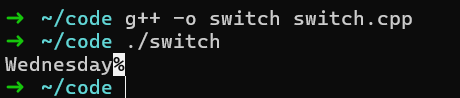
    <br>
    <div style="color:orange; border-bottom: 1px solid #d9d9d9;
    display: inline-block;
    color: #999;
    padding: 2px;"> 图4.1.2 switch语句</div>
</center>

**注意：** `break`语句用于终止`switch`块，否则会继续执行后续的`case`。

## 4.2 循环语句

循环语句用于重复执行一段代码，直到满足某个条件。C++提供了`for`、`while`和`do-while`三种循环语句。

### 4.2.1 `for` 循环

`for` 循环是执行固定次数循环的首选。

**基本语法**：
`for (初始化; 条件; 更新) { 循环体 }`

[示例代码点击下载](code/04_Cpp/4-2-loop/for.cpp)

```cpp
#include <iostream>
using namespace std;

int main() {
    for (int i = 0; i < 5; i++) {
        cout << "Iteration: " << i << endl;
    }
    return 0;
}
```
<center>
    
    <br>
    <div style="color:orange; border-bottom: 1px solid #d9d9d9;
    display: inline-block;
    color: #999;
    padding: 2px;"> 图4.2.1 for循环</div>
</center>

**嵌套循环**：在循环体内部嵌套另一个循环，这样可以实现更复杂的逻辑。

[示例代码点击下载](code/04_Cpp/4-2-loop/nested_for.cpp)

```cpp
#include <iostream>
using namespace std;

int main() {
    for (int i = 1; i <= 3; i++) {
        for (int j = 1; j <= 2; j++) {
            cout << "Outer: " << i << ", Inner: " << j << endl;
        }
    }
    return 0;
}
```
<center>
    
    <br>
    <div style="color:orange; border-bottom: 1px solid #d9d9d9;
    display: inline-block;
    color: #999;
    padding: 2px;"> 图4.2.2 嵌套for循环</div>
</center>

### 4.2.2 `while` 循环

`while` 循环在条件为真时重复执行。

**基本语法**：
`while (条件) { 循环体 }`

[示例代码点击下载](code/04_Cpp/4-2-loop/while.cpp)

```cpp
#include <iostream>
using namespace std;

int main() {
    int count = 0;
    while (count < 3) {
        cout << "Count: " << count << endl;
        count++;
    }
    return 0;
}
```
<center>
    
    <br>
    <div style="color:orange; border-bottom: 1px solid #d9d9d9;
    display: inline-block;
    color: #999;
    padding: 2px;"> 图4.2.3 while循环</div>
</center>

### 4.2.3 `do-while` 循环

`do-while` 循环至少执行一次，然后根据条件判断是否继续。

**基本语法**：
`do { 循环体 } while (条件);`

[示例代码点击下载](code/04_Cpp/4-2-loop/do_while.cpp)

```cpp
#include <iostream>
using namespace std;

int main() {
    int num = 0;
    do {
        cout << "Number: " << num << endl;
        num++;
    } while (num < 3);
    return 0;
}
```

<center>
    
    <br>
    <div style="color:orange; border-bottom: 1px solid #d9d9d9;
    display: inline-block;
    color: #999;
    padding: 2px;"> 图4.2.4 do-while循环</div>
</center>

## 4.3 跳转语句

C++提供了几种跳转语句来控制循环的执行：

- **`break`**：跳出循环。
- **`continue`**：跳过当前迭代，继续下一次循环。
- **`goto`**：转到指定标签（不推荐使用）。

**示例代码[点击下载](code/04_Cpp/4-3-jump/jump.cpp)**：

```cpp
#include <iostream>
using namespace std;

int main() {
    for (int i = 0; i < 5; i++) {
        if (i == 3)
            break;  // 跳出循环
        if (i == 1)
            continue;  // 跳过1的迭代
        cout << i << " ";
    }
    return 0;
}
```
<center>
    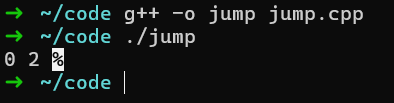
    <br>
    <div style="color:orange; border-bottom: 1px solid #d9d9d9;
    display: inline-block;
    color: #999;
    padding: 2px;"> 图4.3 跳转语句</div>
</center>

可以看到，`break`语句在`i`等于`3`时跳出循环，没有继续输出后面的`3 4 `，`continue`语句在`i`等于`1`时跳过当前迭代，当仍然输出后后续的`2`。

# 5. 面向对象编程（OOP）

面向对象编程（OOP）是 C++ 的核心特性之一，通过封装、继承和多态等特性，使程序更具有可重用性、可扩展性和可维护性。

## 5.1 类与对象

### 5.1.1 定义类和创建对象

类是面向对象编程的基本单位，用于描述具有共同特征的对象。

```cpp
#include <iostream>
#include <string>
using namespace std;

class Animal {
public:
    string name;

    void speak() {
        cout << name << " is speaking!" << endl;
    }
};

int main() {
    Animal dog; // 创建对象
    dog.name = "Dog";
    dog.speak();
    return 0;
}
```

**说明：**

- **类声明**：`class Animal` 定义了一个类。
- **对象创建**：`Animal dog` 创建了 `Animal` 类的一个实例。
- **访问成员变量和方法**：通过 `.` 运算符访问对象的属性和方法。

### 5.1.2 成员变量和成员函数

成员变量是类的属性，成员函数是类的行为。

```cpp
class Person {
private:
    int age; // 私有成员变量

public:
    string name; // 公有成员变量

    // 构造函数
    Person(string n, int a) {
        name = n;
        age = a;
    }

    // 成员函数
    void displayInfo() {
        cout << "Name: " << name << ", Age: " << age << endl;
    }
};

int main() {
    Person john("John", 30);
    john.displayInfo();
    return 0;
}
```

**说明：**

- **访问控制**：`private` 表示私有成员，`public` 表示公有成员。
- **构造函数**：用来初始化对象的成员变量。

### 5.1.3 构造函数与析构函数

构造函数和析构函数是类的特殊成员函数，分别在对象**创建**和**销毁**时调用。

```cpp
class Example {
public:
    Example() {
        cout << "Constructor called" << endl;
    }

    ~Example() {
        cout << "Destructor called" << endl;
    }
};

int main() {
    Example obj;
    return 0;
}
```

**说明：**

- 构造函数：名称与类名相同，无返回值。
- 析构函数：在类名前加 `~`，无参数且无返回值。

## 5.2 继承

继承是 OOP 的重要特性，通过继承可以创建新的类（派生类），从现有类（基类）中获得其成员和行为。继承的语法是：在代码中和原来一样给出该类的名字，但在左括号前加一个冒号和基类的名字。

继承支持按级分类的概念。它可以使用现有类的所有功能，并在无需重新编写原来类的情况下对这些功能进行扩展。
继承的过程其实就是从一般到特殊的过程。

与继承相关的类类型：

- 基类：被继承的类，即"父类"或“超类”。
- 派生类：基于基类创建的新类，又称“子类”。派生类可以访问基类中所有的非私有成员。

<center>
    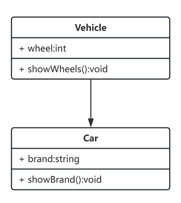
    <br>
    <div style="color:orange; border-bottom: 1px solid #d9d9d9;
    display: inline-block;
    color: #999;
    padding: 2px;"> 图5.2.1 继承类图</div>
</center>
如图5.2.1所示：`Vehicle`作为父类，有一个`int`类型的属性`wheel`和`showWheels()`方法，`Car`继承了`Vehicle`类，并且新增了`brand`属性和`showBrand()`方法，得益于继承的特性，`Car`类在无需编写`wheel`属性和`showWheels`方法的情况下，仍然具有这两个成员，继承的代码示例[点击下载](code/04_Cpp/5-2-inheritance/)如下：


```cpp
#include <iostream>
using namespace std;
class Vehicle {
   public:
    int wheels;

    void showWheels() { cout << "Wheels: " << wheels << endl; }
};

class Car : public Vehicle {
   public:
    string brand;

    void showBrand() { cout << "Brand: " << brand << endl; }
};

int main() {
    Car myCar;
    myCar.wheels = 4;
    myCar.brand = "Toyota";
    myCar.showWheels();
    myCar.showBrand();
    return 0;
}
```

<center>
    
    <br>
    <div style="color:orange; border-bottom: 1px solid #d9d9d9;
    display: inline-block;
    color: #999;
    padding: 2px;"> 图5.2.2 继承类运行图</div>
</center>
运行结果如图5.2.2所示：`myCar`是`Car`类型变量，没有显式写出有`wheels`属性和`showWheels`方法，但由于他继承了`Vehicle`类，因此它其实是存在这些属性和方法的，并且可以使用。

## 5.3 多态

多态是 OOP 的核心特性之一，按字面的意思就是多种形态，指一个类实例的相同方法在不同情况下有不同表现形式。

多态机制使内部结构不同的对象可以共享相同的外部接口。即子类可以重写父类的某个函数，从而为这个函数提供不同于父类的行为。一个父类的多个子类可以为同一个函数提供不同的实现，从而在父类这个公共的接口下，表现出多种行为。
多态的使用场景：当类之间存在层次结构，并且类之间是通过继承关联时。这意味着，虽然针对不同对象的具体操作不同，但通过一个公共的类，它们的那些操作可以通过相同的方式予以调用。

### 5.3.1 静态多态（函数重载）

函数重载是静态多态的一种形式，它的表现就是允许多个函数同名但参数列表不同。示例代码[点击下载](code/04_Cpp/5-3-polymorphism/static_polymorphism.cpp)如下：

```cpp
#include <iostream>
using namespace std;

class Math {
   public:
    int add(int a, int b) { return a + b; }

    double add(double a, double b) { return a + b; }
};

int main() {
    Math math;
    cout << math.add(3, 4) << endl;      // 调用 int 版本
    cout << math.add(3.5, 4.5) << endl;  // 调用 double 版本
    return 0;
}
```
<center>
    
    <br>
    <div style="color:orange; border-bottom: 1px solid #d9d9d9;
    display: inline-block;
    color: #999;
    padding: 2px;"> 图5.3.1 静态多态</div>
</center>
运行结果如图5.3.1所示：同样是调用`math`对象的`add`方面，但可以同时接受整形变量和浮点型变量作为输入，这就是静态多态的一种形式。

### 5.3.2 动态多态（虚函数）

动态多态则是针对不同对象的具体操作不同，但通过一个公共的类，它们的那些操作可以通过相同的方式予以调用，而这是通过虚函数实现的。

示例代码[点击下载](code/04_Cpp/5-3-polymorphism/dynamic_polymorphism.cpp)
```cpp
#include <iostream>
using namespace std;

class Animal {
   public:
    virtual void speak() { cout << "Animal speaks" << endl; }
};

class Dog : public Animal {
   public:
    void speak() override { cout << "Dog barks" << endl; }
};

class Cat : public Animal {
   public:
    void speak() override { cout << "Cat meows" << endl; }
};

int main() {
    Animal* animal = new Dog();
    Animal* cat = new Cat();
    animal->speak();  // 调用 Dog 的 speak 实现
    cat->speak();     // 调用 Cat 的 speak 实现
    delete animal;
    delete cat;
    return 0;
}
```
<center>
    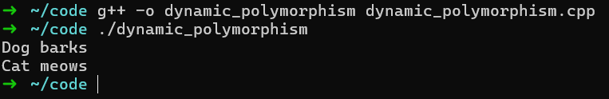
    <br>
    <div style="color:orange; border-bottom: 1px solid #d9d9d9;
    display: inline-block;
    color: #999;
    padding: 2px;"> 图5.3.2 动态多态</div>
</center>
运行结果如图5.3.2所示：同样是调用`Animal`类型对象的`speak()`方法，但是不同的继承对象的表现结果不同，这就是动态多态的一种类型，而这是通过虚函数实现的。

**说明：**

- 使用 `virtual` 关键字声明基类中的函数。
- 动态多态依赖于运行时决定调用哪种实现。


# 6. 现代C++特性

现代C++从C++11开始引入了许多强大的新特性，随后在C++14、C++17和C++20中进一步扩展。这些特性极大地提高了代码的简洁性、性能和可维护性。以下是现代C++中一些重要的特性及其示例。

## 6.1 Lambda表达式

Lambda表达式是一种匿名函数，可以在函数内部定义临时函数，并直接在代码中使用。这种特性非常适合简化回调函数和短期逻辑。

### 6.1.1 基本语法

Lambda表达式的基本语法由一个捕获列表，一个参数列表，一个返回类型（可省略）和一个函数体构成：

[点击下载示例代码](code/04_Cpp/6-1-lambda/lambda.cpp)
```cpp
#include <iostream>
using namespace std;

int main() {
    // 等价于：auto add = [](int a, int b) -> int { return a + b; };
    auto add = [](int a, int b) { return a + b; };
    cout << "Sum: " << add(10, 20) << endl;
    return 0;
}
```
<center>
    
    <br>
    <div style="color:orange; border-bottom: 1px solid #d9d9d9;
    display: inline-block;
    color: #999;
    padding: 2px;"> 图6.1.1 lambda表达式</div>
</center>

### 6.1.2 捕获列表

Lambda表达式可以通过捕获列表捕获外部变量：

[点击下载示例代码](code/04_Cpp/6-1-lambda/capture_list.cpp)
```cpp
#include <iostream>
using namespace std;

int main() {
    int x = 10, y = 20;

    auto add = [x, y]() { return x + y; };  // 捕获x和y
    cout << "Captured Sum: " << add() << endl;

    auto modify = [&x]() { x += 5; };  // 按引用捕获x
    modify();
    cout << "Modified x: " << x << endl;

    return 0;
}
```

**说明：**

- `[x, y]` 按值捕获变量。
- `[&x]` 按引用捕获变量。
- `[=]` 捕获所有变量（按值）。
- `[&]` 捕获所有变量（按引用）。

<center>
    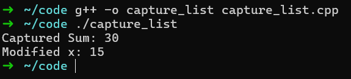
    <br>
    <div style="color:orange; border-bottom: 1px solid #d9d9d9;
    display: inline-block;
    color: #999;
    padding: 2px;"> 图6.1.2 lambda表达式</div>
</center>

### 6.1.3 泛型Lambda表达式

从C++14开始，Lambda支持自动推导参数类型，可以支持更多类型的输入：

[点击下载示例代码](code/04_Cpp/6-1-lambda/auto_lambda.cpp)
```cpp
#include <iostream>
using namespace std;

int main() {
    auto multiply = [](auto a, auto b) { return a * b; };
    cout << multiply(2, 3) << endl;      // 输出6
    cout << multiply(1.5, 2.5) << endl;  // 输出3.75
    return 0;
}
```

<center>
    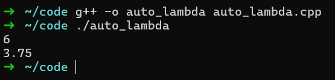
    <br>
    <div style="color:orange; border-bottom: 1px solid #d9d9d9;
    display: inline-block;
    color: #999;
    padding: 2px;"> 图6.1.3 auto lambda表达式</div>
</center>

## 6.2 智能指针
C++提供了类的概念，而当我们像上面一样去`new`一个类的时候，在函数结束时要去手动的`delete`掉这个对象，否则会导致内存的泄露。

智能指针是现代C++中提供的一种内存管理工具，能够自动管理对象的生命周期，避免内存泄漏，当智能指针的计数为0时，智能指针会自动去释放掉内存的占用。C++11引入了三种主要的智能指针：`std::unique_ptr`、`std::shared_ptr` 和 `std::weak_ptr`。

### 6.2.1 unique_ptr

`unique_ptr` 是一种独占所有权的智能指针，不能被拷贝。

[示例代码点击下载](code/04_Cpp/6-2-smart-pointer/unique_pointer.cpp)
```cpp
#include <iostream>
#include <memory>
using namespace std;

class MyClass {
   public:
    MyClass() { cout << "占用内存" << endl; }
    ~MyClass() { cout << "释放内存" << endl; }
};

int main() {
    unique_ptr<MyClass> p1 = make_unique<MyClass>();  // 创建一个unique_ptr
    // unique_ptr不能被复制
    // unique_ptr<int> p2 = p1; // 错误！

    // 但可以转移所有权
    unique_ptr<MyClass> p2 = move(p1);
    return 0;
}
```
<center>
    
    <br>
    <div style="color:orange; border-bottom: 1px solid #d9d9d9;
    display: inline-block;
    color: #999;
    padding: 2px;"> 图6.2.1 unique_ptr</div>
</center>
如图6.2.1所示：在`unique_ptr`生命周期结束时，其所有的对象会被自动释放，这样可以很好的防止内存泄漏的情况。

### 6.2.2 shared_ptr

`shared_ptr` 是一种共享所有权的智能指针，多个 `shared_ptr` 可以共享同一个对象，多个`shared_ptr`指向一个对象时，引用数会叠加。

[示例代码点击下载](code/04_Cpp/6-2-smart-pointer/shared_pointer.cpp)
```cpp
#include <iostream>
#include <memory>
using namespace std;

class MyClass {
   public:
    MyClass() { cout << "占用内存" << endl; }
    ~MyClass() { cout << "释放内存" << endl; }
};

int main() {
    shared_ptr<MyClass> p1 = make_shared<MyClass>();
    cout << "Use count: " << p1.use_count() << endl;  // 输出1
    shared_ptr<MyClass> p2 = p1;  // p1 和 p2 共享所有权
    cout << "Use count: " << p1.use_count() << endl;  // 输出2
    p2.reset();  // p2释放所有权
    cout << "Use count after reset: " << p1.use_count() << endl;  // 输出1
    return 0;
}
```
<center>
    
    <br>
    <div style="color:orange; border-bottom: 1px solid #d9d9d9;
    display: inline-block;
    color: #999;
    padding: 2px;"> 图6.2.2 shared_ptr</div>
</center>
如图6.2.2所示：在全部`shared_ptr`生命周期结束时，其所有的对象会被自动释放，而当有其他`shared_ptr`指向该对象时，引用数会增加。


### 6.2.3 weak_ptr

`weak_ptr` 是一种不影响对象生命周期的智能指针，`weak_ptr`并不会影响所指堆内存空间的引用计数。当 weak_ptr 指针的指向和某一`shared_ptr`相同时，`weak_ptr`并不会使所指堆内存的引用计数加 1；同样，当`weak_ptr`指针被释放时，之前所指堆内存的引用计数也不会因此而减1，因此可以用于解决循环引用问题。

[示例代码点击下载](code/04_Cpp/6-2-smart-pointer/weak_pointer.cpp)
```cpp
#include <iostream>
#include <memory>
using namespace std;

class MyClass {
   public:
    int value;
    shared_ptr<MyClass> next;
    weak_ptr<MyClass> prev;  // 使用weak_ptr避免循环引用

    MyClass(int val) : value(val) {}
    ~MyClass() {
        cout << "MyClass with value " << value << " destroyed" << endl;
    }
};

int main() {
    shared_ptr<MyClass> node1 = make_shared<MyClass>(1);
    shared_ptr<MyClass> node2 = make_shared<MyClass>(2);

    node1->next = node2;
    node2->prev = node1;  // 避免循环引用

    return 0;
}
```
<center>
    
    <br>
    <div style="color:orange; border-bottom: 1px solid #d9d9d9;
    display: inline-block;
    color: #999;
    padding: 2px;"> 图6.2.3 shared_ptr</div>
</center>
如图6.2.3所示：`weak_ptr`的创建和删除都不会改变引用数，通过与`shared_ptr`进行配合可以完美解决循环引用的问题，两个对象都正常释放了。

## 6.3 自动类型推导

`auto` 关键字允许编译器根据上下文推导变量的类型，从C++11开始引入。

[点击下载示例代码](code/04_Cpp/6-3-auto/)
```cpp
#include <iostream>
#include <vector>
using namespace std;

int main() {
    auto x = 10;      // 推导为int
    auto y = 3.14;    // 推导为double
    auto z = "Hello"; // 推导为const char*

    cout << x << ", " << y << ", " << z << endl;

    vector<int> vec = {1, 2, 3};
    for (auto elem : vec) {
        cout << elem << " ";
    }

    return 0;
}
```
<center>
    
    <br>
    <div style="color:orange; border-bottom: 1px solid #d9d9d9;
    display: inline-block;
    color: #999;
    padding: 2px;"> 图6.3.1 auto自动推导</div>
</center>
可以看到`auto`正确推断了变量的类型，提高了代码的简洁性，但在复杂场景下应注意可读性。


## 6.4 `nullptr`
在C语言中，空指针可以使用`(void *)0;`来表示，且标准库中也是如此定义，但在C++语言中，由于多态的存在，可能会导致某些函数重载时的误会，因而空指针的值就不能表示为`(void *)0;`。因此C++11引入了`nullptr`来替代C语言中的`NULL`，表示空指针。

[点击下载示例代码](code/04_Cpp/6-4-nullptr/nullptr.cpp)
```cpp
#include <iostream>
using namespace std;

void checkPointer(int* ptr) {
    if (ptr == nullptr) {
        cout << "Pointer is null" << endl;
    } else {
        cout << "Pointer is not null" << endl;
    }
}

int main() {
    int* p = nullptr; // 使用nullptr初始化
    checkPointer(p);

    int value = 10;
    p = &value;
    checkPointer(p);

    return 0;
}
```
`nullptr`在C++中可以完全替代`NULL`，而无需其他操作。
<center>
    
    <br>
    <div style="color:orange; border-bottom: 1px solid #d9d9d9;
    display: inline-block;
    color: #999;
    padding: 2px;"> 图6.4.1 nullptr</div>
</center>

## 6.5 constexpr

`constexpr` 用于定义在编译期可计算的常量，从C++11开始引入，并在C++14中增强。

- `constexpr` 函数在编译时运行，从而提高程序性能。
- 变量也可以使用 `constexpr` 定义为常量。

[示例代码点击下载](code/04_Cpp/6-5-constexpr/constexpr.cpp)
```cpp
#include <iostream>
using namespace std;

constexpr int square(int x) {
    return x * x;
}

int main() {
    constexpr int value = square(5);  // 在编译期计算，提高性能
    cout << "Square: " << value << endl;
    return 0;
}
```
<center>
    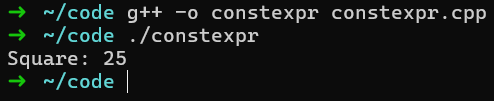
    <br>
    <div style="color:orange; border-bottom: 1px solid #d9d9d9;
    display: inline-block;
    color: #999;
    padding: 2px;"> 图6.5.1 constexpr</div>
</center>

## 6.6 范围for循环

范围for循环简化了对容器的迭代操作，可以快速获得容器内每个元素，从C++11开始引入。

[示例代码点击下载](code/04_Cpp/6-6-foreach/foreach.cpp)
```cpp
#include <iostream>
#include <vector>
using namespace std;

int main() {
    vector<int> numbers = {1, 2, 3, 4, 5};
    for (int num : numbers) {
        cout << num << " ";
    }
    cout << endl;
    return 0;
}
```
<center>
    
    <br>
    <div style="color:orange; border-bottom: 1px solid #d9d9d9;
    display: inline-block;
    color: #999;
    padding: 2px;"> 图6.6.1 constexpr</div>
</center>

**说明：** 范围for循环是C++11的新特性，适用于标准容器（如`vector`、`map`等）和自定义类。

## 6.7 多线程支持

C++11标准库引入了对多线程的支持，包括线程管理、互斥锁和条件变量。

[示例代码点击下载](code/04_Cpp/6-7-thread/thread.cpp)
```cpp
#include <iostream>
#include <thread>
using namespace std;

void printMessage(const string& message) {
    cout << message << endl;
}

int main() {
    // 创建和管理线程
    thread t1(printMessage, "Hello from thread 1!");
    thread t2(printMessage, "Hello from thread 2!");
    // 等待线程完成
    t1.join();
    t2.join();
    return 0;
}
```
<center>
    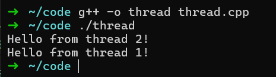
    <br>
    <div style="color:orange; border-bottom: 1px solid #d9d9d9;
    display: inline-block;
    color: #999;
    padding: 2px;"> 图6.7.1 constexpr</div>
</center>

# 7. C++标准库（STL）
C++ 标准模板库（Standard Template Library，STL）是一套功能强大的 C++ 模板类和函数的集合，它提供了一系列通用的、可复用的算法和数据结构，可以极大的提高C++开发效率。

## 7.1 容器

STL提供了多种类型的容器，每种容器都有不同的特性和用途。下面是一些常用容器的详细介绍。

### 7.1.1 vector（动态数组）

`vector` 是最常用的顺序容器，它能动态地向尾部扩展大小，可以存储任意类型的元素。`vector` 的元素存储在连续的内存块中，因此它支持快速的随机访问。

`vector`模型如图7.1.1所示：

<center>
    
    <br>
    <div style="color:orange; border-bottom: 1px solid #d9d9d9;
    display: inline-block;
    color: #999;
    padding: 2px;"> 图7.1.1 vector模型</div>
</center>

**vector 常用成员函数：**

- `push_back()`：在`vector`的末尾插入一个元素。
- `pop_back()`：删除`vector`末尾的元素。
- `size()`：返回`vector`中元素的个数。
- `empty()`：检查`vector`是否为空。
- `at()`：访问指定位置的元素，且会进行越界检查。
- `front()`：返回第一个元素。
- `back()`：返回最后一个元素。

[示例代码点击下载](code/04_Cpp/7-1-container/vector.cpp)
```cpp
#include <iostream>
#include <vector>
using namespace std;

int main() {
    // 创建一个空的vector
    vector<int> nums;

    // 向vector中添加元素
    nums.push_back(10);
    nums.push_back(20);
    nums.push_back(30);

    // 访问元素
    cout << "First element: " << nums[0] << endl;
    cout << "Second element: " << nums.at(1) << endl;

    // 输出所有元素
    for (int num : nums) {
        cout << num << " ";
    }
    return 0;
}
```
<center>
    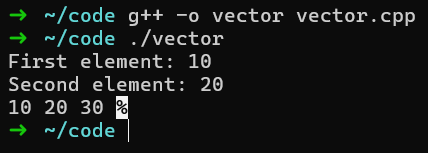
    <br>
    <div style="color:orange; border-bottom: 1px solid #d9d9d9;
    display: inline-block;
    color: #999;
    padding: 2px;"> 图7.1.2 vector示例</div>
</center>

运行结果如图7.1.2所示：`vector`是一个动态数组，可以根据需要动态扩展大小，支持快速的随机访问，是最常用的容器之一。


### 7.1.2 deque（双端队列）

`deque` 是一个支持从两端高效插入和删除元素的容器，适用于需要从两端操作的场景。

`deque`模型如图7.1.3所示：
<center>
    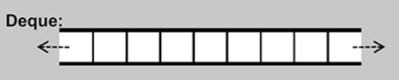
    <br>
    <div style="color:orange; border-bottom: 1px solid #d9d9d9;
    display: inline-block;
    color: #999;
    padding: 2px;"> 图7.1.3 deque模型</div>
</center>

与`vector`相比，`deque`由于在两端也可以进行插入和删除操作，因此常用的成员函数增加了`push_front()`和`pop_front()`。

**deque 常用成员函数：**

- `push_front()`：在`deque`的前端插入一个元素。
- `push_back()`：在`deque`的后端插入一个元素。
- `pop_front()`：删除`deque`前端的元素。
- `pop_back()`：删除`deque`后端的元素。
- `size()`：返回`deque`中元素的个数。
- `empty()`：检查`deque`是否为空。
- `at()`：访问指定位置的元素，且会进行越界检查。
- `front()`：返回第一个元素。
- `back()`：返回最后一个元素。

[示例代码点击下载](code/04_Cpp/7-1-container/deque.cpp)

```cpp
#include <iostream>
#include <deque>
using namespace std;

int main() {
    deque<int> dq = {1, 2, 3, 4};
    dq.push_front(0); // 在前端插入
    dq.push_back(5);  // 在后端插入

    for (int num : dq) {
        cout << num << " ";
    }
    return 0;
}
```
运行结果如图7.1.4所示：`deque`比`vector`更适合在两端进行插入和删除操作，是一个双端队列。
<center>
    
    <br>
    <div style="color:orange; border-bottom: 1px solid #d9d9d9;
    display: inline-block;
    color: #999;
    padding: 2px;"> 图7.1.4 deque示例</div>
</center>

### 7.1.3 list（双向链表）

`list` 是一个双向链表，支持在任意位置快速插入和删除，但随机访问性能较差，并且相较于`vector`和`deque`，`list`没有提高随机访问迭代器。

`list`模型如图7.1.5所示：
<center>
    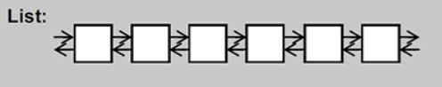
    <br>
    <div style="color:orange; border-bottom: 1px solid #d9d9d9;
    display: inline-block;
    color: #999;
    padding: 2px;"> 图7.1.5 list模型</div>
</center>

**list 常用成员函数：**

- `push_front()`：在`list`的前端插入一个元素。
- `push_back()`：在`list`的后端插入一个元素。
- `pop_front()`：删除`list`前端的元素。
- `pop_back()`：删除`list`后端的元素。
- `size()`：返回`list`中元素的个数。
- `empty()`：检查`list`是否为空。
- `front()`：返回第一个元素。
- `back()`：返回最后一个元素。

[示例代码点击下载](code/04_Cpp/7-1-container/list.cpp)

```cpp
#include <iostream>
#include <list>
using namespace std;

int main() {
    list<int> lst = {1, 2, 3, 4};
    lst.push_back(5);
    lst.push_front(0);

    for (int num : lst) {
        cout << num << " ";
    }
    return 0;
}
```
<center>
    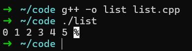
    <br>
    <div style="color:orange; border-bottom: 1px solid #d9d9d9;
    display: inline-block;
    color: #999;
    padding: 2px;"> 图7.1.6 list示例</div>
</center>

### 7.1.4 set（集合）

`set` 是一个按升序排列的关系型容器，允许存储唯一的元素，无法存储重复元素，使用红黑树实现。

`set`模型如图7.1.7所示：
<center>
    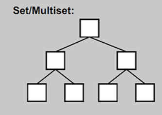
    <br>
    <div style="color:orange; border-bottom: 1px solid #d9d9d9;
    display: inline-block;
    color: #999;
    padding: 2px;"> 图7.1.7 set模型</div>
</center>

**set 常用成员函数：**

- `insert()`：插入元素。
- `erase()`：删除元素。
- `size()`：返回`set`中元素的个数。
- `empty()`：检查`set`是否为空。

[示例代码点击下载](code/04_Cpp/7-1-container/set.cpp)

```cpp
#include <iostream>
#include <set>
using namespace std;

int main() {
    set<int> s = {5, 1, 2, 4, 3};
    s.insert(6);  // 插入元素
    for (int num : s) {
        cout << num << " ";  // 自动按升序排列
    }
    cout << endl;

    s.erase(1);  // 删除元素
    for (int num : s) {
        cout << num << " ";
    }
    cout << endl;
    return 0;
}
```
<center>
    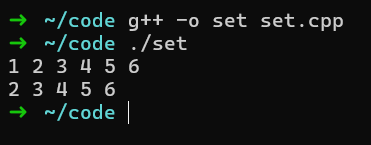
    <br>
    <div style="color:orange; border-bottom: 1px solid #d9d9d9;
    display: inline-block;
    color: #999;
    padding: 2px;"> 图7.1.8 set示例</div>
</center>

### 7.1.5 map（映射）

`map` 是一个存储键值对的容器，键值对会自动按键升序排列，且每个键只能出现一次，也是通过红黑树实习的。

`map`模型如图7.1.9所示：
<center>
    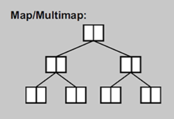
    <br>
    <div style="color:orange; border-bottom: 1px solid #d9d9d9;
    display: inline-block;
    color: #999;
    padding: 2px;"> 图7.1.9 map模型</div>
</center>

**map 常用成员函数：**

- `insert()`：插入键值对。
- `erase()`：删除键值对。
- `size()`：返回`map`中键值对的个数。
- `empty()`：检查`map`是否为空。

[示例代码点击下载](code/04_Cpp/7-1-container/map.cpp)

```cpp
#include <iostream>
#include <map>
using namespace std;

int main() {
    map<string, int> m;
    // 插入元素
    m["apple"] = 3;
    m["banana"] = 5;
    for (auto& pair : m) {
        cout << pair.first << ": " << pair.second << endl;
    }

    // 删除元素
    m.erase("apple");
    for (auto& pair : m) {
        cout << pair.first << ": " << pair.second << endl;
    }
    return 0;
}
```
<center>
    
    <br>
    <div style="color:orange; border-bottom: 1px solid #d9d9d9;
    display: inline-block;
    color: #999;
    padding: 2px;"> 图7.1.10 map示例</div>
</center>

### 7.1.6 unordered_set（无序集合）

`unordered_set` 是一个无序容器，它使用哈希表来存储元素，查找操作具有常数时间复杂度。

`unordered_set`模型如图7.1.11所示：
<center>
    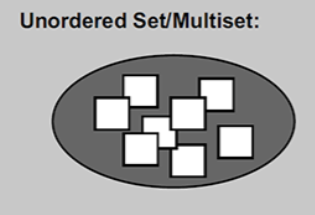
    <br>
    <div style="color:orange; border-bottom: 1px solid #d9d9d9;
    display: inline-block;
    color: #999;
    padding: 2px;"> 图7.1.11 unordered_set模型</div>
</center>

**unordered_set 常用成员函数与set相同，二者之间的区别仅在于元素的存储方式。**

[示例代码点击下载](code/04_Cpp/7-1-container/unordered_set.cpp)

```cpp
#include <iostream>
#include <unordered_set>
using namespace std;

int main() {
    unordered_set<int> us = {5, 1, 2, 4, 3};
    us.insert(6);

    for (int num : us) {
        cout << num << " "; // 元素顺序不固定
    }
    return 0;
}
```
<center>
    
    <br>
    <div style="color:orange; border-bottom: 1px solid #d9d9d9;
    display: inline-block;
    color: #999;
    padding: 2px;"> 图7.1.12 unordered_set示例</div>
</center>

### 7.1.7 unordered_map（无序映射）

`unordered_map` 是一个基于哈希表的键值对容器，类似于 `map`，但其元素无序。

`unordered_map`模型如图7.1.13所示：
<center>
    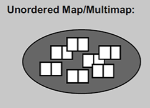
    <br>
    <div style="color:orange; border-bottom: 1px solid #d9d9d9;
    display: inline-block;
    color: #999;
    padding: 2px;"> 图7.1.13 unordered_map模型</div>
</center>

**unordered_map 常用成员函数与map相同，二者之间的区别仅在于元素的存储方式。**

[示例代码点击下载](code/04_Cpp/7-1-container/unordered_map.cpp)

```cpp
#include <iostream>
#include <unordered_map>
using namespace std;

int main() {
    unordered_map<string, int> umap;
    umap["apple"] = 3;
    umap["banana"] = 5;

    // 元素顺序不固定
    for (auto& pair : umap) {
        cout << pair.first << ": " << pair.second << endl;
    }
    return 0;
}
```
<center>
    
    <br>
    <div style="color:orange; border-bottom: 1px solid #d9d9d9;
    display: inline-block;
    color: #999;
    padding: 2px;"> 图7.1.14 unordered_map示例</div>
</center>


## 7.2 常用算法

STL还提供了一组强大的算法，可以与容器一起使用，执行各种操作。以下是一些常见的算法。

#### 7.2.1 sort（排序）

`sort` 用于对容器中的元素进行排序，默认按升序排列。

```cpp
#include <iostream>
#include <vector>
#include <algorithm>
using namespace std;

int main() {
    vector<int> nums = {4, 2, 5, 1, 3};
    sort(nums.begin(), nums.end());

    for (int num : nums) {
        cout << num << " ";
    }
    return 0;
}
```

### 7.2. reverse（反转）

`reverse` 用于将容器中的元素顺序反转。

```cpp
#include <iostream>
#include <vector>
#include <algorithm>
using namespace std;

int main() {
    vector<int> nums = {1, 2, 3, 4, 5};
    reverse(nums.begin(), nums.end());

    for (int num : nums) {
        cout << num << " ";
    }
    return 0;
}
```

### 7.2.3 find（查找）

`find` 用于查找容器中的特定元素，返回一个指向该元素的迭代器，如果未找到返回 `end()`。

```cpp
#include <iostream>
#include <vector>
#include <algorithm>
using namespace std;

int main() {
    vector<int> nums = {1, 2, 3, 4, 5};
    auto it = find(nums.begin(), nums.end(), 3);

    if (it != nums.end()) {
        cout << "Found " << *it << endl;
    } else {
        cout << "Not Found!" << endl;
    }
    return 0;
}
```

### 7.2.4 count（计数）

`count` 用于统计容器中某个元素的出现次数。

```cpp
#include <iostream>
#include <vector>
#include <algorithm>
using namespace std;

int main() {
    vector<int> nums = {1, 2, 3, 4, 1, 5, 1};
    int count_of_1 = count(nums.begin(), nums.end(), 1);

    cout << "Number 1 appears " << count_of_1 << " times." << endl;
    return 0;
}
```

### 7.2.5 accumulate（累加）

`accumulate` 用于计算容器中元素的总和。

```cpp
#include <iostream>
#include <vector>
#include <numeric>
using namespace std;

int main() {
    vector<int> nums = {1, 2, 3, 4, 5};
    int sum = accumulate(nums.begin(), nums.end(), 0);

    cout << "Sum: " << sum << endl;
    return 0;
}
```

### 7.2.6 lower_bound / upper_bound（查找下界/上界）

`lower_bound` 返回一个指向第一个不小于目标元素的迭代器，而 `upper_bound` 返回指向第一个大于目标元素的迭代器。

```cpp
#include <iostream>
#include <vector>
#include <algorithm>
using namespace std;

int main() {
    vector<int> nums = {1, 2, 4, 4, 5, 6};
    auto lb = lower_bound(nums.begin(), nums.end(), 4);
    auto ub = upper_bound(nums.begin(), nums.end(), 4);

    cout << "Lower bound: " << *lb << endl;
    cout << "Upper bound: " << *ub << endl;

    return 0;
}
```

### 7.2.7 merge（合并两个已排序的容器）

`merge` 用于将两个已排序的容器合并成一个新的排序容器。

```cpp
#include <iostream>
#include <vector>
#include <algorithm>
using namespace std;

int main() {
    vector<int> nums1 = {1, 3, 5, 7};
    vector<int> nums2 = {2, 4, 6, 8};
    vector<int> merged;

    merge(nums1.begin(), nums1.end(), nums2.begin(), nums2.end(), back_inserter(merged));

    for (int num : merged) {
        cout << num << " ";
    }

    return 0;
}
```

### 7.2.8 remove / remove_if（删除元素）

`remove` 和 `remove_if` 用于删除容器中的元素，`remove_if` 根据给定的条件删除元素。

```cpp
#include <iostream>
#include <vector>
#include <algorithm>
using namespace std;

int main() {
    vector<int> nums = {1, 2, 3, 4, 5, 6};
    auto it = remove(nums.begin(), nums.end(), 4); // 删除值为4的元素

    nums.erase(it, nums.end()); // 移除“被删除”的元素

    for (int num : nums) {
        cout << num << " ";
    }
    return 0;
}
```


# 8. 异常处理

C++提供了一种机制用于在程序运行时处理错误或异常情况，避免程序崩溃。异常处理可以帮助我们在发生错误时以优雅的方式退出或修复问题，而不是让程序直接崩溃。C++的异常处理由三部分组成：`throw`、`try`和`catch`。

## 8.1 基本的异常处理

在C++中，异常是通过 `throw` 关键字**抛出**的，然后通过 `try` 块**捕获**和`catch`块**处理**。

**语法：**

```cpp
try {
    // 可能会抛出异常的代码
    throw exception_type;  // 抛出异常
} catch (exception_type& e) {
    // 处理异常的代码
    // e 是捕获的异常对象
}
```

[示例代码点击下载](code/04_Cpp/8-1-basic-exception/basic_exception.cpp)


```cpp
#include <iostream>
using namespace std;

int divide(int a, int b) {
    if (b == 0) {
        throw "Division by zero error";  // 抛出字符串类型的异常
    }
    return a / b;
}

int main() {
    try {
        cout << divide(10, 2) << endl;   // 正常除法
        cout << divide(10, 0) << endl;   // 会抛出异常
    } catch (const char* msg) {
        cout << "Caught an exception: " << msg << endl;
    }
    return 0;
}
```
运行结果如图8.1.1所示：

<center>
    
    <br>
    <div style="color:orange; border-bottom: 1px solid #d9d9d9;
    display: inline-block;
    color: #999;
    padding: 2px;"> 图8.1.1 基本异常处理</div>
</center>

在上述代码中，当除数为0时，程序会抛出异常，并通过 `catch` 捕获该异常并输出错误信息。

## 8.2 异常类型

C++允许使用不同类型的异常，通常有两种常见方式：

1. **标准异常类**：C++ 提供了一系列标准的异常，定义在`exception`中，我们可以在程序中使用这些标准的异常。它们是以父子类层次结构组织起来的，如图8.2.1所示：
2. **内置异常**：如整数、字符数组等，C++允许任何类型的对象作为异常抛出。

<center>
    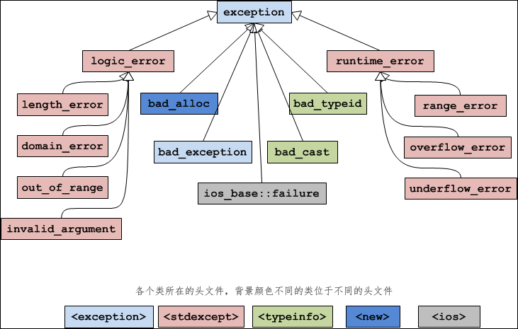
    <br>
    <div style="color:orange; border-bottom: 1px solid #d9d9d9;
    display: inline-block;
    color: #999;
    padding: 2px;"> 图8.2.1 异常类层次结构</div>
</center>


**[示例点击下载](code/04_Cpp/8-2-exception/exception.cpp)**

```cpp
#include <iostream>
#include <stdexcept>
using namespace std;

void throw_runtime_error() {
    throw runtime_error("Runtime error occurred");
}

int main() {
    try {
        throw_runtime_error();
    } catch (const runtime_error& e) {
        cout << "Caught exception: " << e.what() << endl;
    }
    return 0;
}
```
运行结果如图8.2.2所示：

<center>
    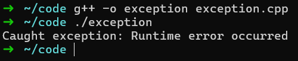
    <br>
    <div style="color:orange; border-bottom: 1px solid #d9d9d9;
    display: inline-block;
    color: #999;
    padding: 2px;"> 图8.2.2 异常类型</div>
</center>
`runtime_error` 是 C++ 标准库提供的一个异常类，继承自 `std::exception`，并可以使用 `what()` 方法获取异常的详细信息。

## 8.3 捕获多个异常

C++ 允许在同一个 `try-catch` 块中捕获多种不同类型的异常。

**[示例点击下载](code/04_Cpp/8-3-multi-exception/multi_exception.cpp)：**

```cpp
#include <iostream>
#include <stdexcept>
using namespace std;

void test_function(int val) {
    if (val == 0) {
        throw runtime_error("Runtime error");
    } else if (val < 0) {
        throw invalid_argument("Negative value error");
    } else {
        cout << "Value is " << val << endl;
    }
}

int main() {
    try {
        test_function(0);  // 将抛出 runtime_error
    } catch (const runtime_error& e) {
        cout << "Caught runtime_error: " << e.what() << endl;
    } catch (const invalid_argument& e) {
        cout << "Caught invalid_argument: " << e.what() << endl;
    }

    try {
        test_function(-5); // 将抛出 invalid_argument
    } catch (const runtime_error& e) {
        cout << "Caught runtime_error: " << e.what() << endl;
    } catch (const invalid_argument& e) {
        cout << "Caught invalid_argument: " << e.what() << endl;
    }

    return 0;
}
```
<center>
    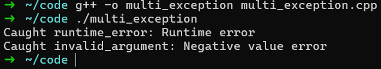
    <br>
    <div style="color:orange; border-bottom: 1px solid #d9d9d9;
    display: inline-block;
    color: #999;
    padding: 2px;"> 图8.3.1 捕获多个异常</div> 
</center>

这里演示了如何在同一个 `try-catch` 块中捕获不同类型的异常。不同的 `catch` 块会按顺序检查异常类型。

## 8.4 异常的传播

当抛出异常时，程序控制流会被中断，程序会从当前函数返回并进入上层调用函数的 `catch` 块，直到异常被捕获或程序终止。如果异常没有被捕获，它会继续向上传递，传递过程如图8.4.1所示：

<center>
    
    <br>
    <div style="color:orange; border-bottom: 1px solid #d9d9d9;
    display: inline-block;
    color: #999;
    padding: 2px;"> 图8.4.1 异常传播</div>
</center>

**[示例点击下载](code/04_Cpp/8-4-exception-propagation/exception_propagation.cpp)**

```cpp
#include <iostream>
#include <stdexcept>
using namespace std;

void f() {
    throw runtime_error("Error in f");
}

void g() {
    f();  // 抛出异常
}

int main() {
    try {
        g();  // 捕获异常
    } catch (const runtime_error& e) {
        cout << "Caught exception: " << e.what() << endl;
    }

    return 0;
}
```
<center>
    
    <br>
    <div style="color:orange; border-bottom: 1px solid #d9d9d9;
    display: inline-block;
    color: #999;
    padding: 2px;"> 图8.4.2 异常传播</div>
</center>

在上面的例子中，`f()` 抛出了异常，但 `g()` 并没有捕获它。异常会向上传递到 `main()` 函数的 `catch` 块，最后被捕获。

## 8.5 自定义异常类

C++允许通过继承 `std::exception` 来定义自定义的异常类型。这样可以提供更多关于错误的信息。

**[示例点击下载](code/04_Cpp/8-5-custom-exception/custom_exception.cpp)**

```cpp
#include <iostream>
#include <stdexcept>
using namespace std;

class MyException : public exception {
public:
    const char* what() const noexcept override {
        return "My custom exception occurred";
    }
};

void test_custom_exception() {
    throw MyException();  // 抛出自定义异常
}

int main() {
    try {
        test_custom_exception();
    } catch (const MyException& e) {
        cout << "Caught exception: " << e.what() << endl;
    }

    return 0;
}
```
<center>
    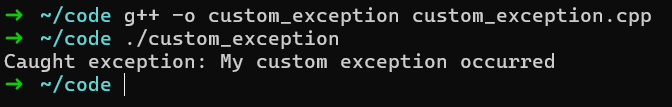
    <br>
    <div style="color:orange; border-bottom: 1px solid #d9d9d9;
    display: inline-block;
    color: #999;
    padding: 2px;"> 图8.5.1 自定义异常</div>
</center>

在此示例中，我们通过继承 `std::exception` 类创建了一个名为 `MyException` 的自定义异常类，并重写了 `what()` 方法以返回自定义错误消息。
