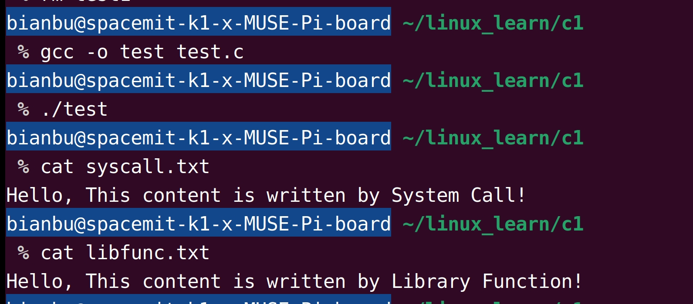
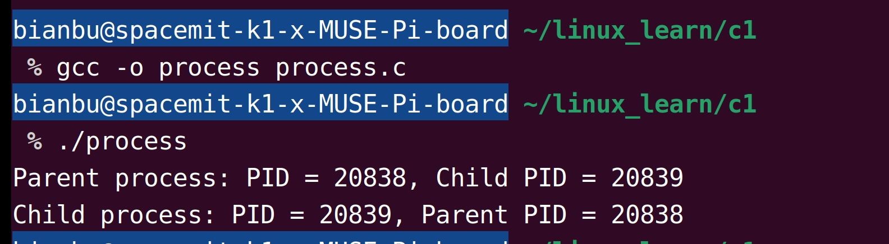

sidebar_position: 5

# 1. 系统调用

在 Linux 操作系统中，用户程序运行于用户空间，而硬件资源的管理和系统关键功能则由内核完成。由于直接操作硬件可能引发安全和稳定性问题，用户程序无法直接访问硬件资源。为了解决这一矛盾，Linux 提供了一组**系统调用（System Call）**接口，充当用户态与内核态交互的桥梁。

## **1.1 系统调用简介**

系统调用是 Linux 内核为用户层程序提供的标准接口（API），允许用户程序向内核请求完成特定任务，如进程管理、内存管理和文件系统操作等。通过系统调用，用户程序可以安全、受控地访问硬件资源和系统服务，而无需直接操纵底层设备。系统调用的主要功能可归纳为以下几类：

#### **1）文件操作**

系统调用为文件操作提供了基础接口，使程序能够处理磁盘上的数据。常用的系统调用包括：

- 打开文件：`open`
- 关闭文件：`close`
- 读取文件：`read`
- 写入文件：`write`

这些接口支持文件的创建、访问和数据读写，是文件系统操作的核心。

#### **2）进程管理**

进程是操作系统调度的基本单位。通过系统调用，用户程序可以管理进程的生命周期和行为，例如：

- 创建新进程：`fork`
- 运行新程序：`exec`
- 等待子进程结束：`wait`
- 终止进程：`kill`

这些功能使用户能够灵活地创建、控制并同步多个进程。

#### **3）内存管理**

系统调用为用户程序提供对内存的动态管理和控制能力，包括地址空间的分配和回收。例如：

- 映射内存区域：`mmap`
- 取消映射：`munmap`
- 调整堆空间大小：`brk`

这些功能为内存密集型程序提供了高效的内存使用方式。

#### **4）设备控制**

系统调用支持与设备的直接交互，例如打开设备文件或向设备发送特定控制指令。常见调用包括：

- 设备控制：`ioctl`
- 打开设备文件：`open`
- 关闭设备文件：`close`

通过这些接口，用户程序可以操作物理设备或虚拟设备，完成设备驱动相关的任务。

## **1.2 系统调用过程**

### **1.2.1 用户态与内核态**

Linux 操作系统中，运行环境分为两种模式：用户态（User Mode） 和 内核态（Supervisor Mode）。这种分层结构是为了确保系统的安全性和稳定性。

- **用户态：**应用程序运行在用户态，权限受到严格限制，无法直接操作硬件资源。应用程序通过调用系统接口间接完成文件读写、内存分配、进程控制等任务。

- **内核态：**内核态是操作系统核心运行的模式，拥有完全的硬件控制权限，包括管理内存、调度进程、与设备交互等。当应用程序需要访问系统资源时，必须通过系统调用陷入内核态，由内核完成具体操作。

应用程序通过系统调用在用户态与内核态之间切换，完成硬件资源的操作和管理。

### **1.2.2 调用过程详解**

系统调用是用户程序与内核交互的关键机制，在 RISC-V 架构中，系统调用过程如图1.2.1所示：

<figure style="text-align: center;"> <!-- 设置居中 -->
   <!-- 调整大小 -->
  <figcaption style="margin-top: 10px; color: #555;">图1.2.1 Linux系统调用流程图</figcaption>
</figure>

#### 1）用户态程序触发系统调用

当用户程序需要执行操作系统提供的功能时，它会触发一个系统调用。具体步骤如下：

- 用户程序通过某种方式生成系统调用的请求（比如使用 `ecall` 指令）。
- 系统调用会带上一个系统调用号和相关参数，这些信息通常存储在寄存器中。

`ecall` 是一个特殊的指令，用于生成一个环境调用（Environment Call）中断，指示处理器进行模式切换。

#### 2）执行 `ecall` 指令触发中断

当程序执行 `ecall` 指令时，RISC-V 处理器会触发一个中断，并进行以下操作：

- 保存程序状态：处理器会保存用户态的程序状态（包括程序计数器 `PC` 和相关寄存器的值），以便在内核处理完系统调用后能恢复到用户态。
- 切换到内核态：RISC-V 会从用户模式切换到内核模式。这是通过设置 `mstatus` 寄存器中的相关标志位（如 `MIE` 和 `MPIE`）来实现的。
- 中断处理：系统的中断处理程序会被执行，通常会跳转到内核代码中定义的中断向量表中的处理函数。

#### 3）内核态处理系统调用

一旦切换到内核态，内核可以通过如下方式处理系统调用：

- 查找系统调用号：系统调用号会存储在 `a7` 寄存器中（在 RISC-V 中，系统调用号通常放在 `a7` 寄存器，参数则通常放在 `a0` 到 `a6` 寄存器）。内核通过该系统调用号查找并调用相应的系统调用处理函数。
- 执行内核代码：内核根据系统调用号执行相应的操作，如文件操作、内存分配等。

#### 4）返回用户态

一旦内核完成了系统调用的处理，它会将处理结果返回到用户态。这包括以下步骤：

- 恢复用户态程序状态：内核会恢复用户程序的状态，通常会使用 `mepc` 寄存器（保存用户程序的返回地址）和 `mstatus` 寄存器中的标志来恢复用户模式。
- 执行 `sret` 指令：内核执行 `sret`（Supervisor Return）指令来将控制权返回到用户程序，恢复到原来的程序计数器（`PC`）位置，继续执行用户代码。

# **2. 库函数**

库函数是操作系统或编程语言标准库为开发者提供的高级接口，用于简化开发过程。它们通常基于更底层的系统调用进行封装，并在封装过程中提供更强的功能、缓冲机制和更高的易用性。通过库函数，开发者可以专注于功能实现，而无需深入了解底层实现细节。

## **2.1 什么是库函数？**

库函数是程序开发中的重要工具，提供了一组通用功能的实现。例如，C语言标准库（`libc` 或 `glibc`）为开发者提供了文件操作、字符串处理、数学计算、动态内存分配等功能。这些库函数大大减少了开发者编写底层代码的需求。

常见的库函数有：

- 标准输入输出函数： `printf`、`scanf`、`fopen`、`fclose`、`fread`、`fwrite` 等。
- 字符串操作函数： `strlen`、`strcpy`、`strcmp` 等。
- 数学函数： `sqrt`、`pow`、`abs` 等。
- 动态内存管理： `malloc`、`calloc`、`free` 等。

库函数有以下优势：

- 简化开发：库函数隐藏了底层的复杂实现，使开发者可以专注于应用逻辑。例如，`fwrite` 函数通过封装系统调用 `write`，实现了文件写入功能，并且加入了缓冲机制，开发者无需手动处理缓冲区。

- 跨平台支持：库函数通常由标准库实现，并支持多种操作系统。例如，C语言标准库的函数在不同平台上表现一致，使代码具有良好的可移植性。

- 性能优化：许多库函数内置了优化机制。例如，`fread` 和 `fwrite` 使用缓冲区来减少与内核的交互，从而显著提高性能。

- 丰富的功能：库函数提供了许多通用功能，例如字符串操作、数学计算、动态内存分配等，开发者无需重复造轮子。

## 2.2 系统调用和库函数

在Linux中，系统调用和库函数是应用程序与操作系统交互的重要方式，但两者的概念经常被混淆。系统调用是操作系统内核提供的接口，用于直接与内核交互，而库函数则是基于系统调用的高级封装，提供更易用、更高效的功能。以下表格对两者进行了对比和总结：

| 特性         | 系统调用（System Call）    | 库函数（Library Function）    |
| :----------- | :------------------------- | ----------------------------- |
| **定义**     | 操作系统直接提供的内核接口 | 基于系统调用封装的高级接口    |
| **执行位置** | 内核态运行                 | 用户态运行                    |
| **缓存机制** | 无，直接操作内核资源       | 有（如标准I/O库具有缓冲机制） |
| **性能**     | 调用开销较大               | 通常更高效                    |
| **移植性**   | 操作系统相关               | 跨平台（如glibc库）           |


# **3. 编程实例**

## 3.1 简单的文件操作示例

以下代码 test.c [(点击下载)](code/05_syscall_libfunction/3-1-syscall-libfunction) 展示了使用系统调用和库函数操作文件的示例。 

```c
#include <stdio.h>
#include <fcntl.h>
#include <unistd.h>
#include <string.h>

int main() {
    // 使用系统调用write
    const char *data1 = "Hello, This content is written by System Call!\n";
    int fd = open("syscall.txt", O_WRONLY | O_CREAT | O_TRUNC, 0644);
    write(fd, data1, strlen(data1));
    close(fd);

    // 使用库函数fwrite
    const char *data2 = "Hello, This content is written by Library Function!\n";
    FILE *fp = fopen("libfunc.txt", "w");
    fwrite(data2, 1, strlen(data2), fp);
    fclose(fp);

    return 0;
}
```

在上述代码中，`fopen` 和 `fclose`是库函数，对系统调用 `open` 和 `close` 的封装，提供文件流操作的接口。`fread` 和 `fwrite` 内部使用 `read` 和 `write`，并加入了缓冲机制，提高了性能。

使用 GCC 编译并运行程序：

```bash
gcc -o test test.c
./test
```

运行程序后，将生成两个文件：

- `syscall.txt`：由系统调用 `write` 写入；
- `libfunc.txt`：由库函数 `fwrite` 写入。

使用 `cat` 命令查看文件内容，结果如图3.1.1所示。

<figure style="text-align: center;"> <!-- 设置居中 -->
   <!-- 调整大小 -->
  <figcaption style="margin-top: 10px; color: #555;">图3.1.1 使用库函数和系统调用写文件</figcaption>
</figure>


## **3.2 进程管理示例**

进程是Linux系统的基本执行单位。以下代码 process.c [(点击下载)](code/05_syscall_libfunction/3-2-process) 展示了如何使用系统调用 `fork` 创建子进程，并使用 `getpid` 和 `getppid` 获取当前进程和父进程的ID。

```c
#include <unistd.h>
#include <stdio.h>

int main() {
    pid_t pid = fork(); // 创建子进程
    if (pid == -1) {
        perror("fork");
        return -1;
    }

    if (pid == 0) {
        // 子进程
        printf("Child process: PID = %d, Parent PID = %d\n", getpid(), getppid());
    } else {
        // 父进程
        printf("Parent process: PID = %d, Child PID = %d\n", getpid(), pid);
    }

    return 0;
}
```

在上述代码中，`fork` 系统调用用于创建子进程。返回0表示当前进程是子进程，返回一个正数表示当前进程是父进程，该值是子进程的PID。`getpid` 用于获取当前进程的PID，`getppid` 用于获取当前进程的父进程PID。

程序编译和运行结果如图3.2.1所示。

<figure style="text-align: center;"> <!-- 设置居中 -->
   <!-- 调整大小 -->
  <figcaption style="margin-top: 10px; color: #555;">图3.2.1 fork系统调用示例输出</figcaption>
</figure>