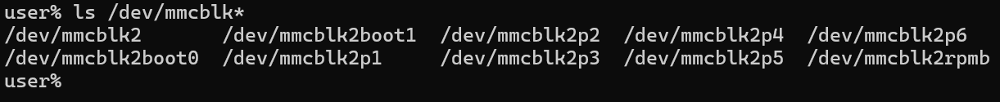
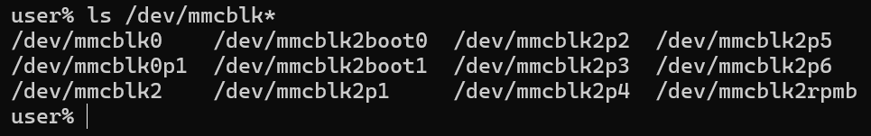
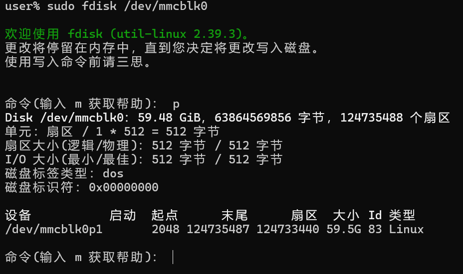
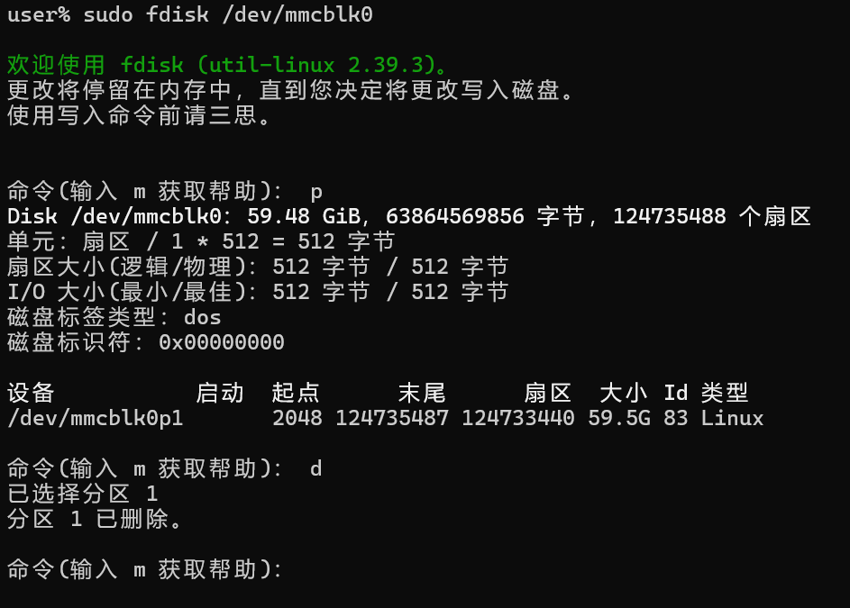
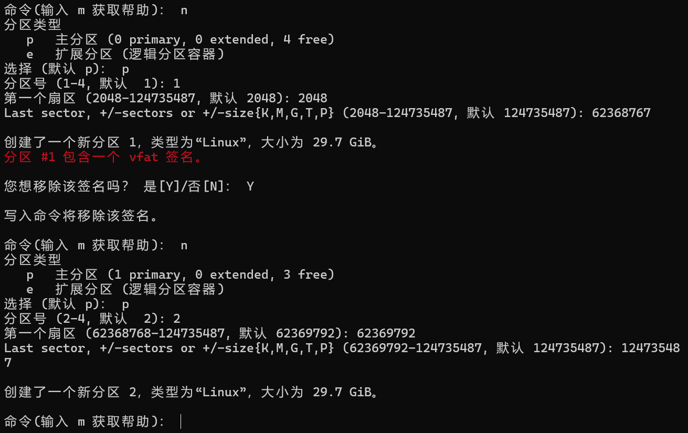
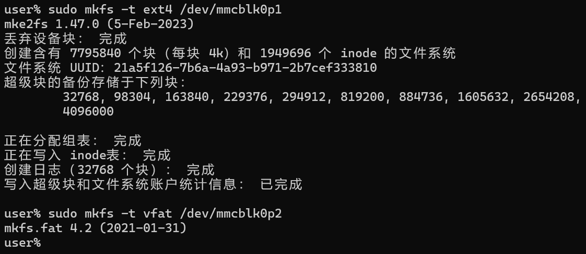
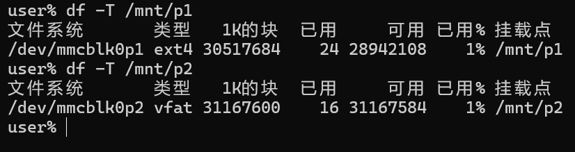

sidebar_position: 6

# **1. 存储分区**

## **1.1 存储设备管理**
在Linux系统中所有的设备都会以文件的形式存储，设备一般保存在`/dev`目录下面。因此磁盘、SD卡也会以文件的形式保存在/dev目录下，一般磁盘以sda、sda1、sda2 ...,sdb为命名，SD卡以mmcblk0、mmcblk1等命名，这里以插入一块SD卡为例子：
<figure style="text-align: center;"> <!-- 设置居中 -->
   <!-- 调整大小 -->
  <figcaption style="margin-top: 10px; color: #555;">图1.1.1 未插入SD卡</figcaption>
</figure>

<figure style="text-align: center;"> <!-- 设置居中 -->
   <!-- 调整大小 -->
  <figcaption style="margin-top: 10px; color: #555;">图1.1.2 插入SD卡</figcaption>
</figure>

如图1.1.1和1.1.2所示，插入SD卡后，`/dev`目录下新增了`mmcblk0`和`mmcblk0p1`两个文件，其中`mmcblk0`就是新插入的SD卡文件，而`mmcblk0p1`则是这个SD卡上的分区文件。

## **1.2 存储设备分区**
上面讲到了分区文件，分区的目的就是便于管理，比如在Windows系统我们一般会分C盘，D盘，E盘等，而`mmcblk0p1`就是`mmcblk0`的第一个分区，也就是类似C盘。

Linux只能创建4个主分区，如果需要创建更多的分区那么就必须创建逻辑分区，其中逻辑分区需要占用一个主分区。

在Linux中，我们可以通过查看`/proc/partitions`文件来查看当前系统下全部的分区：
```bash
cat /proc/partitions
```
结果如图1.2.1所示：
<figure style="text-align: center;"> <!-- 设置居中 -->
   <!-- 调整大小 -->
  <figcaption style="margin-top: 10px; color: #555;">图1.2.1 系统全部分区</figcaption>
</figure>

可以看到刚插入的SD卡已经出现在了分区表内。

`fdisk`命令是用于磁盘分区的工具，可以创建、编辑、删除和显示硬盘分区。它是一个强大且常用的命令，适用于各种Linux发行版，可以通过以下命令安装：
```bash
sudo apt install fdisk
```

`fdisk`是一个交互式的软件，通过`fdisk`打开要进行分区管理的磁盘文件即可进入交互式命令行，对刚插入的SD卡操作如图：
```bash
sudo fdisk /dev/mmcblk0
```
进入交换命令后可以输入`m`，回车后可以看到使用说明，这里有几个常用的命令说明：

- `p`：打印分区表
- `n`：添加新分区
- `d`：删除分区
- `w`：将分区表写入磁盘并退出
- `q`：退出而不保存更改

首先查看`mmcblk0`上已存在的分区：
<figure style="text-align: center;"> <!-- 设置居中 -->
   <!-- 调整大小 -->
  <figcaption style="margin-top: 10px; color: #555;">图1.2.2 已存在分区</figcaption>
</figure>

把这个分区删掉：
<figure style="text-align: center;"> <!-- 设置居中 -->
   <!-- 调整大小 -->
  <figcaption style="margin-top: 10px; color: #555;">图1.2.3 删除分区</figcaption>
</figure>

然后使用SD卡全部空间新建两个一样大的分区：
<figure style="text-align: center;"> <!-- 设置居中 -->
   <!-- 调整大小 -->
  <figcaption style="margin-top: 10px; color: #555;">图1.2.4 新建分区</figcaption>
</figure>

保存退出，然后重新查看全部分区表如图1.2.5所示：
<figure style="text-align: center;"> <!-- 设置居中 -->
   <!-- 调整大小 -->
  <figcaption style="margin-top: 10px; color: #555;">图1.2.5 新全部分区</figcaption>
</figure>

可以看到现在有两个分区了。


# **2. 文件系统**
Linux操作系统支持很多不同的文件系统，比如ext2、ext3、FAT等等，而Linux把对不同文件系统的访问交给了VFS（虚拟文件系统），VFS能访问和管理各种不同的文件系统。所以有了分区之后就需要把它格式化成具体的文件系统以便VFS访问。

格式化的命令非常的简单，使用`mkfs`make filesystem）命令:
```bash
mkfs [-t 文件系统格式] 装置文件名
```
`-t`：可以接文件系统格式，例如ext2、ext3、vfat等

这里，我们把刚刚`mmcblk0`新建的两个分区分别格式化为ext4和vfat系统：
<figure style="text-align: center;"> <!-- 设置居中 -->
   <!-- 调整大小 -->
  <figcaption style="margin-top: 10px; color: #555;">图2.1.1 格式化分区</figcaption>
</figure>

用`df`命令可以查看挂载后的文件系统格式，将分区1、2分别挂载到`/mnt/p1`和`/mnt/p2`，结果见图2.1.2：
<figure style="text-align: center;"> <!-- 设置居中 -->
   <!-- 调整大小 -->
  <figcaption style="margin-top: 10px; color: #555;">图2.1.2 查看分区格式</figcaption>
</figure>

可以看到分区1、2都格式化为了对应的文件系统。

# **3. 挂载与使用**
挂载指的就是将设备文件中的顶级目录安装到Linux根目录下的某一目录（最好是空目录），访问此目录就等同于访问设备文件。因此我们需要将有文件系统的分区挂载到一个目录上，这样对这个目录操作就相当于对这个设备的该分区进行操作。

`df`命令可以检查文件系统的磁盘空间占用情况、查看文件系统挂载情况等，利用该命令来获取硬盘被占用了多少空间，目前还剩下多少空间等信息。

**使用方法：**
```bash
df [-ahikHTm] [目录或文件名]
```
- `-h`：以人类可读的方式显示输出结果（例如，使用 KB、MB、GB 等单位）。
- `-T`：显示文件系统的类型。
- `-t`：<文件系统类型>：只显示指定类型的文件系统。
- `-i`：显示 inode 使用情况。
- `-k`：这个选项会以 KB 作为单位显示磁盘空间使用情况。
- `-a`：该参数将显示所有的文件系统，包括虚拟文件系统，例如proc、sysfs等。如果没有使用该选项，默认情况下，df命令不会显示虚拟文件系统。

但是此时`mmcblk0`的两个分区均未被挂载，`df`命令无法看到他的文件系统情况，因此需要`mount`命令来将文件系统挂载到`/mnt`目录下，一般约定俗成可移动设备都挂载在`/mnt`目录下，而不是直接挂载到根目录下，`mount`命令的使用方法如下：
```bash
mount [-t vfstype] [-o options] device dir
```
常用的几个选项有：

- `-t`：指定挂载设备的文件系统。
- `-o ro`：用只读模式挂载。
- `-o rw`：用可读写模式挂载。
- `o sync`：在同步模式下执行。

挂载完成后使用`df`命令查看，结果如图3.1.1所示：
<figure style="text-align: center;"> <!-- 设置居中 -->
   <!-- 调整大小 -->
  <figcaption style="margin-top: 10px; color: #555;">图3.1.1 查看挂载结果</figcaption>
</figure>

可以看到两个分区都已经成功挂载了，此时可以通过跟访问其他目录一样访问该目录了。

如果需要将该SD卡拆卸带走，可以使用`umount`命令将分区取消挂载，然后重新挂载到另外的机器上即可使用。

`umount`的使用方法：
```bash
umount [-ahnrvV][-t <文件系统类型>][挂载点]
```
其中常用参数的含义为：

- `-r`：若无法成功卸除，则尝试以只读的方式重新挂入文件系统。
- `-t`：仅卸除选项中所指定的文件系统。

卸载结果如图3.1.2所示：
<figure style="text-align: center;"> <!-- 设置居中 -->
   <!-- 调整大小 -->
  <figcaption style="margin-top: 10px; color: #555;">图3.1.2 取消挂载</figcaption>
</figure>