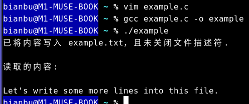

sidebar_position: 7

# **1. 文件权限**

在Linux操作系统中，文件权限是指对文件或目录的访问控制机制。它帮助用户管理对系统资源的访问和操作，从而提高安全性和控制性。文件权限的管理基于三个基本操作：读（Read）、写（Write）和执行（Execute），用户进行对应的操作前必须具有对应的权限，否则系统就会报错。

## 1.1 文件权限的基本概念

- **读（r）**：用户可以查看文件内容。对于目录而言，读权限允许用户列出目录中的文件和子目录。
- **写（w）**：用户可以修改文件内容。这包括编辑、删除文件，以及在目录中添加或删除文件。
- **执行（x）**：用户可以执行文件作为程序运行。对于目录，执行权限允许用户进入目录并访问该目录内的文件。

## 1.2 用户、组及其他用户的概念

Linux系统将用户分为三种类别，每种类别都有不同的权限设置：

- **用户（User，U）**：文件的所有者。每个文件都有一个指定的用户，用户对该文件拥有最完整的权限。用户可以设置和修改文件的权限。
- **组（Group，G）**：文件所属的组。每个文件可以被分配到一个特定的用户组。组内的用户可以根据组权限访问文件。这种设置便于管理多个用户的访问控制。
- **其他用户（Others，O）**：不属于文件所有者和文件组的所有其他用户。其他用户对文件的权限控制使得系统能够管理外部用户访问文件的能力。

## 1.3 权限的表示方式

文件权限通常以一个三位二进制数或字母形式表示。在Unix/Linux系统中，使用类似于`rwxr-xr--`的格式表示权限，每个字符代表特定的权限，具体如下：

- 第一个字符表示文件类型（例如，`-` 表示普通文件，`d` 表示目录）。
- 接下来的三组字符依次表示用户、组和其他用户的权限：
  - `r` 表示读权限
  - `w` 表示写权限
  - `x` 表示执行权限
  - `-` 表示没有相应的权限

例如，权限字符串 `-rwxr-xr--` 的含义如下：

- `-`：普通文件
- `rwx`：用户拥有读、写和执行权限
- `r-x`：组拥有读和执行权限，但没有写权限
- `r--`：其他用户只有读权限

## 1.4 权限的修改

在Linux中，可以使用 chmod 命令修改文件的权限。篇幅原因，chmod命令在此不做过多介绍，以下只作一些基本的命令讲解，感兴趣的同学可以自行查阅相关资料。

只有文件所有者和超级用户可以修改文件或目录的权限。可以使用绝对模式（八进制数字模式）以及符号模式指定文件的权限。

### **1.4.1 符号模式**

使用符号模式可以设置多个项目：who（用户类型），operator（操作符）和 permission（权限），每个项目的设置可以用逗号隔开。 命令 chmod 将修改 who 指定的用户类型对文件的访问权限，用户类型由一个或者多个字母在 who 的位置来说明，如 who 的符号模式表所示:

| who  | 用户类型 | 说明                   |
| :--- | :------- | :--------------------- |
| `u`  | user     | 文件所有者             |
| `g`  | group    | 文件所有者所在组       |
| `o`  | others   | 所有其他用户           |
| `a`  | all      | 所有用户, 相当于 *ugo* |

operator 的符号模式表:

| Operator | 说明                                                   |
| :------- | :----------------------------------------------------- |
| `+`      | 为指定的用户类型增加权限                               |
| `-`      | 去除指定用户类型的权限                                 |
| `=`      | 设置指定用户权限的设置，即将用户类型的所有权限重新设置 |

permission 的符号模式表:

| 模式 | 名字         | 说明                                                                           |
| :--- | :----------- | :----------------------------------------------------------------------------- |
| `r`  | 读           | 设置为可读权限                                                                 |
| `w`  | 写           | 设置为可写权限                                                                 |
| `x`  | 执行权限     | 设置为可执行权限                                                               |
| `X`  | 特殊执行权限 | 只有当文件为目录文件，或者其他类型的用户有可执行权限时，才将文件权限设置可执行 |
| `s`  | setuid/gid   | 当文件被执行时，根据who参数指定的用户类型设置文件的setuid或者setgid权限        |
| `t`  | 粘贴位       | 设置粘贴位，只有超级用户可以设置该位，只有文件所有者u可以使用该位              |

###  **1.4.2 绝对模式（八进制数字模式）**

chmod命令可以使用八进制数来指定权限。文件或目录的权限位是由9个权限位来控制，每三位为一组，它们分别是文件所有者（User）的读、写、执行，用户组（Group）的读、写、执行以及其它用户（Other）的读、写、执行。历史上，文件权限被放在一个比特掩码中，掩码中指定的比特位设为1，用来说明一个类具有相应的优先级。

| #    | 权限           | rwx  | 二进制 |
| :--- | :------------- | :--- | :----- |
| 7    | 读 + 写 + 执行 | rwx  | 111    |
| 6    | 读 + 写        | rw-  | 110    |
| 5    | 读 + 执行      | r-x  | 101    |
| 4    | 只读           | r--  | 100    |
| 3    | 写 + 执行      | -wx  | 011    |
| 2    | 只写           | -w-  | 010    |
| 1    | 只执行         | --x  | 001    |
| 0    | 无             | ---  | 000    |

例如， 765 将这样解释：

- 所有者的权限用数字表达：属主的那三个权限位的数字加起来的总和。如 rwx ，也就是 4+2+1 ，应该是 7。
- 用户组的权限用数字表达：属组的那个权限位数字的相加的总和。如 rw- ，也就是 4+2+0 ，应该是 6。
- 其它用户的权限数字表达：其它用户权限位的数字相加的总和。如 r-x ，也就是 4+0+1 ，应该是 5。

### **1.4.3 示例**

我们使用以下命令来演示字符模式和绝对模式下，chmod命令的差异以及文件权限的修改效果，实验结果如图1.4.1。

```shell
# 创建示例文件 example.txt
echo 1234567890 > example.txt
# 查看示例文件 example.txt 的初始权限
ls -l example.txt
# 将示例文件 example.txt 的权限修改为 644
chmod 644 example.txt
# 查看修改后的示例文件 example.txt 的权限
ls -l example.txt
# 为示例文件的所有用户添加 w（写） 权限
chmod a+w example.txt
# 查看修改后的示例文件 example.txt 的权限
ls -l example.txt
```

<center>
    
    <br>
    <div style="color:orange; border-bottom: 1px solid #d9d9d9;
    display: inline-block;
    color: #999;
    padding: 2px;"> 图 1.4.1 </div>
</center>	

# **2. 文件定位与I/O操作**

## 2.1 文件描述符

Linux一个很核心的设计理念是一切皆文件。Linux 中的各种事物比如像文档、目录、键盘、监视器、硬盘、可移动媒体设备、打印机、调制解调器、虚拟终端，还有进程间通信和网络通信等输入/输出资源都是定义在文件系统空间下的字节流。

一切都可看作是文件，其最显著的好处是对于上面所列出的输入/输出资源，只需要相同的一套 Linux 工具、实用程序和 API。你可以使用同一套 API和工具来处理unix中大多数的资源.

既然在Linux 中一切皆文件，那么面对这么多的文件，我们自然而然地需要有一个高效地索引去定位每一个文件，以方便进程进行 I/O 操作。在Linux中，文件描述符就承担起了索引的职责。程序中会经常用到文件描述符来定位文件并进行 I/O 操作，比如在打开文件时，我们提供的参数是文件的路径，但程序返回的是分配好的文件描述符。
需要注意的是，在 Linux 和 Unix 系统中，文件描述符通常从`0`开始分配，但是文件描述符`0`、`1`和`2`在系统初始化时分别被分配给了标准输入（stdin）、标准输出（stdout）和标准错误（stderr）。因此，用户能够创建的文件描述符通常从`3`开始。

## 2.2 文件I/O操作

**2.2.1 打开文件**

我们通常会使用`open`函数来打开文件，该函数的声明如下：

```c
int open(const char *pathname, int flags, mode_t mode);
```

**参数说明：**

- `pathname` ： 打开文件或创建文件的名字。
- `flags` ： 表示选项，用 "\|" 连接多个选项。 `flags`选项宏的定义文件在每个系统中有所不同，Linux中定义在fcntl-linux.h文件中。
- `mode` ： 仅在使用部分选项时才用到，例如`O_CREAT`在`mode`中需要给定文件初始权限。

**返回值:**

- 打开的文件描述符，失败返回 -1。
- 返回的文件描述符符合最小未使用分配原则。

参数中的`flags`选项有几个比较常用选项，介绍如下：

```	yaml
//以下这五个选项只能五选其一
O_RDONLY:只读
O_WRONLY:只写
O_RDWR:可读可写
O_EXEC:可执行
O_SEARCH:只搜索（应用于目录）
//剩下这些选项可以同时存在多个
O_APPEND:追加写，打开文件时将文件当前偏移量置为文件长度，如果想要在文件末尾追加数据的话可以加上这个选项，偏移量的概念会在后面解释。
O_CREAT:文件不存在则创建，全线由mode给出
O_CLOEXEC:当前进程如果发生进程替换，自动关闭当前文件
O_DIRECTORY:打开的不是目录则报错
O_EXCL:同时存在O_CREAT时如果文件存在则报错
O_NOFOLLOW:如果打开的是一个符号链接则出错
O_NONBLOCK:非阻塞打开文件
O_SYNC:非延迟写，即同步写，每次都等待物理写磁盘成功后再返回
O_TRUNC:打开文件则截断文件
```

以上这些宏定义在`fcntl.h`中，但是根据操作系统不同具体定义的位置也可能会不同。

**2.2.2 关闭文件**

我们通常会使用`close`函数来关闭文件，该函数的声明如下：

```c
int close(int fd);
```

**参数说明：**

- `fd` : 要关闭文件的文件描述符。

**返回值:**

- 成功返回 0，失败返回 -1。

**2.2.3 读取文件**

我们通常会使用`read`函数来读取文件内容，该函数的声明如下：

```c
size_t read(int fildes, void *buf, size_t nbyte);
```

**参数说明：**

- `fildes` ： 读取的文件描述符。
- `buf` ： 数据存放的目标缓冲区。
- `nbyte` ： 最多读取的数据长度，16位无符号整型，一次读取最多为65535个字节。

**返回值:**

- 返回实际读取的数据长度，大部分情况下目标文件中有多少数据则读取多少数据并且返回读取长度。
- 如果是管道或者套接字目前暂无数据则会阻塞。
- 如果是普通文件，读到文件结尾返回 0。
- 可以设置非阻塞读取，如果暂无数据则不会阻塞而回返回 -1 并将`errno`置为`EAGAIN`。
- 返回值`ssize_t`是一个带符号整形,如果出错则返回 -1。

**2.2.4 写入文件**

我们通常会使用`write`函数向文件中写入内容，该函数的声明如下：

```c
ssize_t write(int fildes, const void *buf, size_t nbyte);
```

**参数说明：**

- `fildes` ： 要写入的文件描述符。
- `buf` ： 数据存放的目标缓冲区。
- `nbyte` ： 最多写入的数据长度，16位无符号整型，一次写入最多为65535个字节。

**返回值:**

- 返回实际写入的数据长度，如果数据长度小于`nbyte`则在后补'\0'。
- 如果文件剩余容量小于`nbyte`则返回能写入的最大数据长度。

## 2.3 文件I/O示例

我们已经介绍了使用哪些函数来打开、读取、写入和关闭文件。接下来我们将使用这些函数来操作一个示例文件，示例代码 [IO-example.c](code/07_file_IO_basic/2-3-IO-example/) 如下。

```c
#include <stdio.h>
#include <fcntl.h>
#include <unistd.h>
#include <string.h>

int main() {
    const char *filename = "example.txt";
    int fd; // 文件描述符
    char buffer[256];

    // 写入文件
    fd = open(filename, O_CREAT | O_WRONLY | O_TRUNC, S_IRUSR | S_IWUSR); // 打开文件以进行写入
    if (fd == -1) {
        perror("无法打开文件以写入");
        return 1;
    }

    const char *text = "Hello, this is a file writing example.\n";
    ssize_t bytes_written = write(fd, text, strlen(text));
    if (bytes_written == -1) {
        perror("写入文件时出错");
        close(fd);
        return 1;
    }

    const char *more_text = "Let's write some more lines into this file.\n";
    bytes_written = write(fd, more_text, strlen(more_text));
    if (bytes_written == -1) {
        perror("写入文件时出错");
        close(fd);
        return 1;
    }

    close(fd); // 关闭文件
    printf("已将内容写入 %s.\n", filename);

    // 读取文件
    fd = open(filename, O_RDONLY); // 打开文件以进行读取
    if (fd == -1) {
        perror("无法打开文件以读取");
        return 1;
    }

    printf("\n读取的内容:\n");
    ssize_t bytes_read;
    while ((bytes_read = read(fd, buffer, sizeof(buffer) - 1)) > 0) {
        buffer[bytes_read] = '\0'; // 确保字符串结束
        printf("%s", buffer);
    }

    if (bytes_read == -1) {
        perror("读取文件时出错");
    }

    close(fd); // 关闭文件

    return 0;
}
```

该程序运行的结果如图 2.3.1。如何编译并运行程序请参见“AI基础学习及实践”的“C++环境搭建”章节。

<center>
    
    <br>
    <div style="color:orange; border-bottom: 1px solid #d9d9d9;
    display: inline-block;
    color: #999;
    padding: 2px;"> 图 2.3.1 </div>
</center>

## **2.4 偏移量**

细心的同学可能已经发现了，在前面的文件I/O示例当中，我们写完文件后先关闭了文件，在读的时候又重新打开，为什么要这样做呢，难道不能写完文件之后直接读吗？

这里我们引入一个新的概念——偏移量（offset）。 每个文件在打开后都会一个文件当前偏移量的概念存在，也可以叫做文件指针，它指向文件中某一位置，并且之后的读写操作会全部从此处开始，一般来说文件当前偏移量一般来说是一个非负整数，但是在某些情况下我们获取的偏移量有可能为负值或者大于文章长度。每个文件当前偏移量存储在系统级的打开文件表当中。当一个文件被打开时文件当前偏移量被置为0，如果使用了O_APPEND选项则会将偏移量置为文件内容长度，方便在文件内容的末尾追加写入。

因此，在文件I/O示例中，我们写入文件后偏移量已经到了文件内容末尾，此时直接调用read函数读取文件描述符对应的文件内容会从文件内容的末尾开始读，什么也读不到，如图2.4.1所示。

<center>
    
    <br>
    <div style="color:orange; border-bottom: 1px solid #d9d9d9;
    display: inline-block;
    color: #999;
    padding: 2px;"> 图 2.4.1 </div>
</center>

但是，当我们重新打开文件时，文件偏移量又会归零，因此又可以读取到完整的文件内容。既然如此，有没有办法去控制文件I/O操作时起始的偏移量呢？答案是肯定的，C语言提供了lseek函数来设置文件描述符对应文件的偏移量，其函数原型如下：

```c
off_t lseek(int fd, off_t offset, int whence);
```

**参数说明：**

- `fd` ： 操作的文件描述符。
- `offset` ： 表示移动距离，offset可正可负。
- `whence` ： 可以有三种参数，SEEK_SET，SEEK_CUR，SEEK_END，分别代表相对位置文件开头，当前文件偏移量，文件结尾位置，如图 2.4.2。

<center>
    
    <br>
    <div style="color:orange; border-bottom: 1px solid #d9d9d9;
    display: inline-block;
    color: #999;
    padding: 2px;"> 图 2.4.2 </div>
</center>

**返回值:**

- 成功返回更改后的文件当前偏移量，失败返回-1。
- 如果当前fd是一个管道，套接字等不可修改的会将errno置为ESPIPE

## **2.5 文件I/O示例改造**

前文我们提到可以使用lseek函数来设置文件I/O操作时的偏移量，于是我们可以把“2.2 文件I/O示例”提供的代码改造一下，将执行读操作时的偏移量设置为0，就无需在写文件之后再重新打开文件进行读操作了。示例代码 [modified-example.c](code/07_file_IO_basic/2-5-modified-example/) 如下:

```c
#include <stdio.h>
#include <fcntl.h>
#include <unistd.h>
#include <string.h>

int main() {
    const char *filename = "example.txt";
    int fd; // 文件描述符
    char buffer[256];

    // 打开文件，这里将 O_WRONLY 标识修改为 O_RDWR 是因为后续还要进行读的操作
    fd = open(filename, O_CREAT | O_RDWR | O_TRUNC, S_IRUSR | S_IWUSR); 
    if (fd == -1) {
        perror("无法打开文件以写入");
        return 1;
    }

    const char *text = "Hello, this is a file writing example.\n";
    ssize_t bytes_written = write(fd, text, strlen(text));
    if (bytes_written == -1) {
        perror("写入文件时出错");
        close(fd);
        return 1;
    }

    const char *more_text = "Let's write some more lines into this file.\n";
    bytes_written = write(fd, more_text, strlen(more_text));
    if (bytes_written == -1) {
        perror("写入文件时出错");
        close(fd);
        return 1;
    }

    printf("已将内容写入 %s，且未关闭文件描述符.\n", filename);

    // 设置文件偏移量为 SEEK_SET 即文件开头
    lseek(fd, 0, SEEK_SET);

    printf("\n读取的内容:\n");

    ssize_t bytes_read;
    while ((bytes_read = read(fd, buffer, sizeof(buffer) - 1)) > 0) {
        buffer[bytes_read] = '\0'; // 确保字符串结束
        printf("%s", buffer);
    }

    if (bytes_read == -1) {
        perror("读取文件时出错");
    }

    close(fd); // 关闭文件

    return 0;
}
```

该程序运行的结果如图 2.5.1。如何编译并运行程序请参见“AI基础学习及实践”的“C++环境搭建”章节。

<center>
    
    <br>
    <div style="color:orange; border-bottom: 1px solid #d9d9d9;
    display: inline-block;
    color: #999;
    padding: 2px;"> 图 2.5.1 </div>
</center>

## **2.6 操作的原子性**

操作的原子性是指在计算机系统中，某个操作（或一系列操作）要么完全执行，要么完全不执行，不能在中间状态产生任何影响。这种属性通常用于保证数据的一致性和完整性。
为什么要讲到操作的原子性呢？

考虑这么一种场景，两个不同的进程同时打开了一个文件，要对文件进行追加写，但是问题来了，两个进程这里都使用了lseek的方式将当前文件偏移量置为文件末尾处再写，这样的操作并不是一个原子性操作，很有可能导致两个进程同时先将偏移量移到末尾，然后一个写文件结束，另一个再继续在之前的偏移量接着写，这时的偏移量并不在文章末尾，会导致将第一个进程写的数据覆盖。举个例子，假设一个文件目前长度为1500，进程都将偏移量置为了1500，然后第一个线程先写400的数据，之后第二个进程接着准备写200数据，但是第二个进程的偏移量还在1500处，并没有更新为1900，此时再写入数据就会把之前进程写入的数据覆盖，如图2.6.1。

<center>
    
    <br>
    <div style="color:orange; border-bottom: 1px solid #d9d9d9;
    display: inline-block;
    color: #999;
    padding: 2px;"> 图 2.6.1 </div>
</center>

以上的问题想要解决也很容易，有两个办法，第一个就是使用O_APPEND选项，在打开文件加入这个选项后，每次写入数据都会自动将偏移量置为文件末尾处再写，不用lseek保证了原子性；第二个办法就是使用pread()和pwrite()函数，这两个函数与read()和write()几乎无异，不同的是它多了一个参数，可以原子性的帮助我们在读写之前修改文件偏移量，但是要注意这里的文件偏移量修改只对这一次操作有效，以下是函数声明。

```c
ssize_t pread(int fildes, void *buf, size_t nbyte, off_t offset);
ssize_t pwrite(int fildes, const void *buf, size_t nbyte,off_t offset);
```

可见，与函数read和write相比，pread和pwrite多了一个offset的参数，这个参数设置了进行读写操作时的文件偏移量。此外，与read和write利用lseek函数设置文件偏移量后再进行读写操作不同，pread和pwrite在函数实现上就是原子性的。