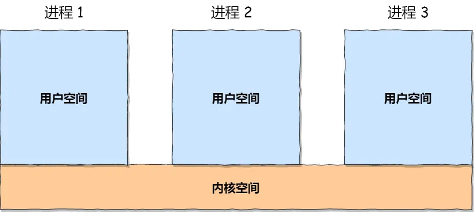
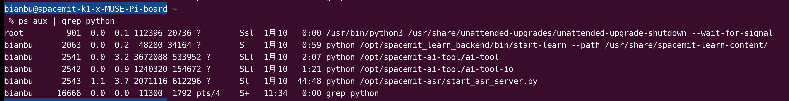
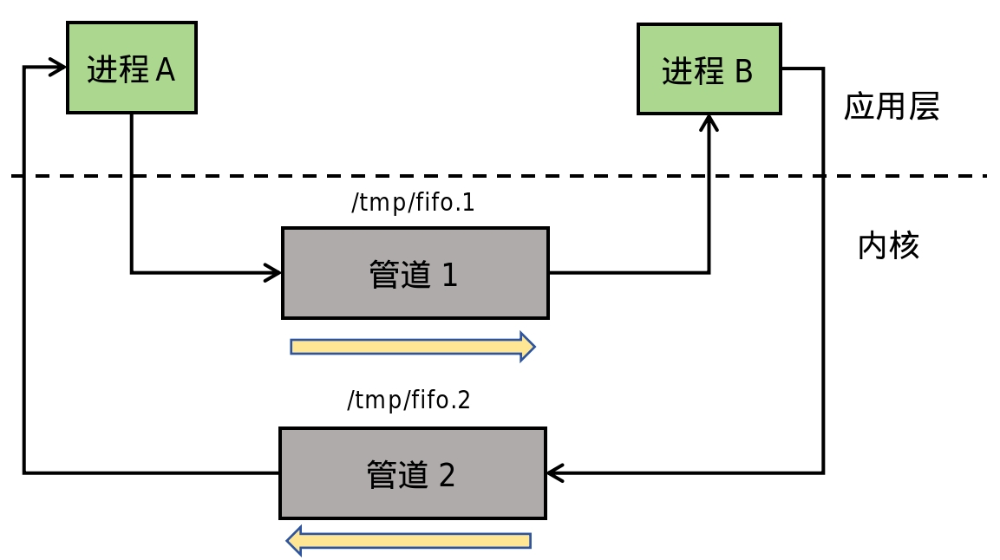
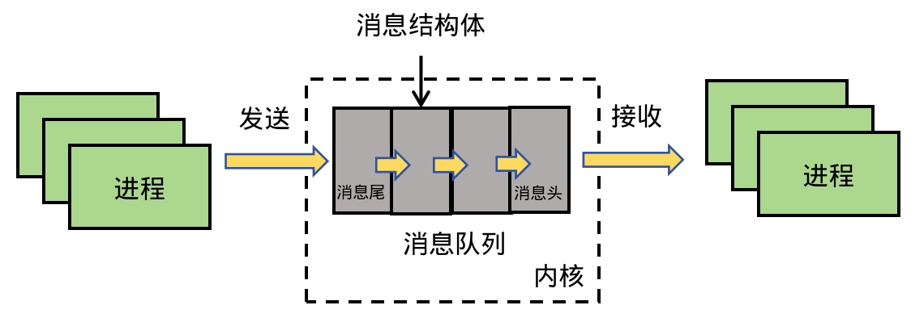
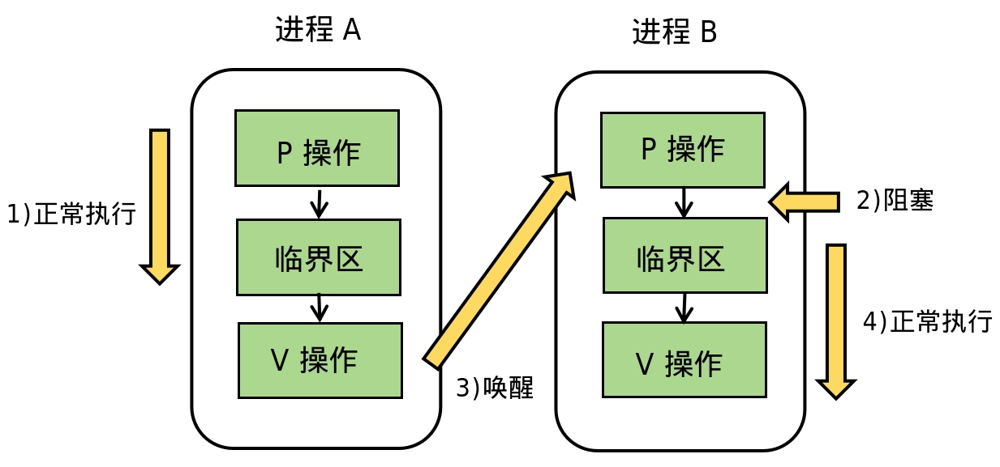
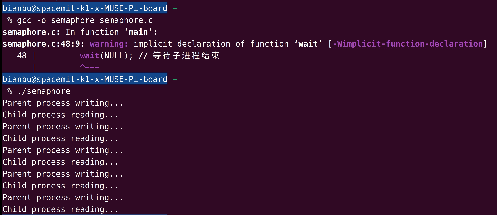

sidebar_position: 9

# 1. 进程间通信的概念

## 1.1 进程间通信简介

进程间通信（interprocess communication，简称 IPC）指两个进程之间的通信。系统中的每一个进程都有各自的地址空间，并且相互独立、隔离，每个进程都处于自己的地址空间中。所以同一个进程的不同模块（譬如不同的函数）之间进行通信都是很简单的，譬如使用全局变量等。

但是，两个不同的进程之间要进行通信通常是比较难的，因为这两个进程处于不同的地址空间中；通常情况下，一些小型、简单程序是单进程程序（可以有多个线程），不需要考虑进程间通信，对于一些复杂、大型的应用程序，则会根据实际需要将其设计成多进程程序，譬如 GUI、服务区应用程序等。

**进程间通信的作用：**

- **数据共享：** 不同进程之间需要共享某些状态或数据，例如客户端与服务器之间的数据交互。
- **任务协作：** 父子进程或不同进程之间需要协作完成复杂任务。
- **资源同步：** 防止多个进程同时访问共享资源导致数据竞争问题，例如文件写入或内存更新。
- **事件通知：** 一个进程需要通知另一个进程某个事件已经发生，例如任务完成或信号到达。

## 1.2 进程间通信机制

在 Linux 系统中，每个进程的用户空间是独立的，无法直接访问其他进程的用户空间。但多个进程共享内核空间，因此进程间通信（IPC）需要通过内核来实现，如图1.2.1所示。

<figure style="text-align: center;"> <!-- 设置居中 -->
   <!-- 调整大小 -->
  <figcaption style="margin-top: 10px; color: #555;">图1.2.1 多个进程共享内核空间</figcaption>
</figure>

Linux 提供了丰富的 IPC 机制，这些机制主要继承自 UNIX 系统，包括以下几类：

1）UNIX IPC：

早期的 UNIX 提供了以下简单的通信机制：

- **管道（Pipe）**：无名管道用于父子进程通信。
- **FIFO（命名管道）**：支持无亲缘关系的进程间通信。
- **信号**：用来通知进程发生的事件。

2）System V IPC：

System V 扩展了早期的 UNIX IPC，适用于单机环境：

- **信号量（Semaphore）**：用于进程间同步。
- **消息队列（Message Queue）**：允许通过消息在进程间传递数据。
- **共享内存（Shared Memory）**：提供最快速的进程间通信方式，进程可以直接访问同一块内存区域。

3）POSIX IPC：

POSIX IPC 是对 System V 的改进，增强了灵活性和可移植性：

- **POSIX 信号量**：改进了 System V 信号量的复杂性。
- **POSIX 消息队列**：提供更规范的消息传递功能。
- **POSIX 共享内存**：改善了共享内存的管理和使用。

4）Socket IPC：

**Socket** 是一种强大的通信方式，支持跨网络的进程间通信：

- 可用于本地通信（如 Unix Socket）。
- 支持分布式通信，是网络应用程序的核心。

Linux 同时支持上述所有通信机制，使得进程间数据传输和同步需求都能得到满足。

# 2. 管道与FIFO

在 Linux 系统中，管道是一种简单高效的进程间通信机制，通过将一个进程的输出连接到另一个进程的输入来实现数据流的传递。管道可分为匿名管道（`pipe`）和有名管道（`FIFO`），它们在通信方向、使用限制和适用场景上有所不同。

## 2.1 匿名管道（Pipe）

匿名管道由 `pipe()` 系统调用创建，适用于**具有亲缘关系的进程间通信**（如父子进程或兄弟进程），并且数据**只能单向传输**，如图2.1.1所示。

<figure style="text-align: center;"> <!-- 设置居中 -->
   <!-- 调整大小 -->
  <figcaption style="margin-top: 10px; color: #555;">图2.1.1 匿名管道图示</figcaption>
</figure>


**匿名管道的限制：**

- 单工通信： 数据只能沿着一个方向传输，例如从父进程到子进程或反过来。要实现双向通信，需要创建两个管道。
- 进程亲缘性限制：只能在创建它的进程及其子进程之间共享，不能用于无关的进程。

在 Shell 中，管道的符号是竖线（`|`）。它的作用是将前一个命令的输出作为后一个命令的输入。例如：

```bash
ps aux | grep python
```

> <small style="color: #6c757d;">命令解析：<br>1. `ps aux` 列出所有进程信息。<br>2. `grep python` 从中筛选出与 `python` 相关的进程信息。</small>

运行结果如图 2.1.2 所示，`grep` 筛选出了符合条件的进程。

<figure style="text-align: center;"> <!-- 设置居中 -->
   <!-- 调整大小 -->
  <figcaption style="margin-top: 10px; color: #555;">图2.1.2 匿名管道示例</figcaption>
</figure>
## 2.2 有名管道（FIFO）

有名管道（`Named Pipe` 或 `FIFO`）是匿名管道的扩展。与匿名管道不同，有名管道去除了**亲缘关系限制**，允许**不相关的进程之间进行通信**。有名管道在文件系统中以路径的形式存在，如图 2.2.1 所示。

<figure style="text-align: center;"> <!-- 设置居中 -->
   <!-- 调整大小 -->
  <figcaption style="margin-top: 10px; color: #555;">图2.2.1 有名管道图示</figcaption>
</figure>

**有名管道的特点：**

- 双向通信：有名管道支持双向数据传输。通过在文件系统中创建两个有名管道，可以实现完整的双向通信。
- 进程无关性：有名管道支持不相关的进程间通信。只要进程能够访问管道文件，就可以进行读写操作。
- 持久化：有名管道在文件系统中以路径名表示（例如 `/tmp/myfifo`），即使所有进程关闭管道，该文件仍然存在，直到被显式删除。

**匿名管道与有名管道对比：**

| 特性         | **匿名管道（Pipe）**                         | **有名管道（FIFO）**                         |
| :----------- | :------------------------------------------- | :------------------------------------------- |
| **创建方式** | 使用 `pipe()` 创建，仅存在于内存中。         | 使用 `mkfifo()` 创建，在文件系统中有路径名。 |
| **通信方向** | 单向通信，需两个管道实现双向通信。           | 支持双向通信（需双管实现完整双向通信）。     |
| **进程关系** | 仅限具有亲缘关系的进程间通信（如父子进程）。 | 可用于无亲缘关系的任意进程间通信。           |
| **生命周期** | 临时存在，进程结束后自动销毁。               | 持久化存在，需手动删除路径文件。             |
| **使用场景** | 简单的短时进程间通信，效率高。               | 跨进程通信，适合共享资源和持久性需求的场景。 |

### 2.2.1 有名管道的创建

有名管道可以通过以下两种方式创建：

- Shell 命令创建：

```bash
mkfifo my_fifo
```

- `mkfifo()` 系统调用：

```c
int mkfifo(const char *pathname, mode_t mode);
```

> <small style="color: #6c757d;">参数解释：<br>1. `pathname`：管道的路径名，这里是 `"my_fifo"`，表示在当前目录下创建一个名为 `my_fifo` 的管道文件。<br>2. `mode`：文件权限，采用八进制数设置。`0666` 表示管道的权限为可读可写（`rw-rw-rw-`）。</small>

### 2.2.2 示例：`mkfifo` 命令创建管道

通过 `mkfifo` 命令创建有名管道 `my_fifo`：

```
mkfifo my_fifo
```

查看管道：

```
ls -al my_fifo
```

基于Linux一切皆文件的理念，my_fifo管道以文件形式存在，文件类型是 p，即`pipe`的意思，如图2.2.2所示。

<figure style="text-align: center;"> <!-- 设置居中 -->
   <!-- 调整大小 -->
  <figcaption style="margin-top: 10px; color: #555;">图2.2.2 mkfifo命令创建有名管道</figcaption>
</figure>
往 `my_fifo` 管道写入数据：

```
echo "hello" > my_fifo
```

此时程序被阻塞，因为管道中的数据没有被读取，在读取数据之后，程序才可以正常退出。

打开另一个中断，读取管道内容：

```
cat < my_fifo
```

可以看到，管道内容通过 `cat` 命令读取到屏幕，如图2.3.2所示。

<figure style="text-align: center;"> <!-- 设置居中 -->
   <!-- 调整大小 -->
  <figcaption style="margin-top: 10px; color: #555;">图2.2.3 读取管道内容</figcaption>
</figure>


### 2.2.3 示例：`mkfifo()`系统调用创建管道

以下示例展示了两个独立的进程如何通过有名管道通信。代码已打包上传，点击 [代码示例](code/09_ipc/5-2-fifo) 下载。

1）进程1：向管道写入数据（fifo_writer.c）

```c
#include <stdio.h>
#include <fcntl.h>
#include <unistd.h>
#include <string.h> // 包含 strlen 函数

int main() {
    const char *fifo_path = "my_fifo";
    if (mkfifo(fifo_path, 0666) == -1) { // 创建有名管道
        perror("Failed to create FIFO");
    }

    int fd = open(fifo_path, O_WRONLY); // 打开管道写端

    const char *message = "Hello through FIFO!";
    ssize_t bytes_written = write(fd, message, strlen(message) + 1); // 写入数据
    if (bytes_written == -1) {
        perror("Failed to write to FIFO");
    } else {
        printf("Message sent: %s\n", message);
    }

    close(fd); // 关闭管道写端

    return 0;
}
```

2）进程2：从管道读取数据（fifo_reader.c）

```c
#include <stdio.h>
#include <fcntl.h>
#include <unistd.h>
#include <string.h> // 包含 memset 函数

int main() {
    const char *fifo_path = "my_fifo";

    int fd = open(fifo_path, O_RDONLY); // 打开管道读端
  
    char buffer[100];
    memset(buffer, 0, sizeof(buffer)); // 清空缓冲区
    ssize_t bytes_read = read(fd, buffer, sizeof(buffer) - 1); // 读取数据
    if (bytes_read > 0) {
        buffer[bytes_read] = '\0'; // 确保字符串以 '\0' 结尾
        printf("Received message: %s\n", buffer);
    } else {
        perror("Failed to read from FIFO");
    }

    close(fd); // 关闭管道读端

    return 0;
}
```

编译两个程序：

```
gcc -o fifo_reader fifo_reader.c
gcc -o fifo_writer fifo_writer.c
```

在一个终端中运行进程1（发送数据）：

```
./fifo_writer
```

在另一个终端中运行进程2（读取数据）：

```
./fifo_reader
```

运行结果如图2.2.4所示，`fifo_reader` 读取 `fifo_writer` 写到管道中的内容。

<figure style="text-align: center;"> <!-- 设置居中 -->
   <!-- 调整大小 -->
  <figcaption style="margin-top: 10px; color: #555;">图2.2.4 mkfifo()系统调用创建管道</figcaption>
</figure>
# 3. 消息队列

在管道通信中，数据以字节流形式传递，而消息队列和信号两则提供了更高级的结构化消息管理功能，使得通信更灵活高效。消息队列可以跨越父子进程的限制，在多个不相关的进程之间传递有结构化的数据。每条消息可以附带一个类型标识，便于接收方按类型筛选。消息队列通信机制如图3.1.1所示。

<figure style="text-align: center;"> <!-- 设置居中 -->
   <!-- 调整大小 -->
  <figcaption style="margin-top: 10px; color: #555;">图3.1.1 消息队列通信机制</figcaption>
</figure>

**消息队列的特点：**

- 持久性：消息队列中的数据在接收前会一直存在，即使发送方已经退出。
- 按消息类型读取：接收方可以按指定的类型接收消息，不需要严格按顺序。
- 容量限制：消息队列有固定的容量，容量达到上限时，新的消息会被阻塞或丢弃。

## 3.1 消息队列API

**1）创建/获取消息队列**

`msgget` 函数用于创建一个新的消息队列，或者获取一个已经存在的消息队列。函数原型如下：

```c
int msgget(key_t key, int msgflg);
```

> <small style="color: #6c757d;">参数解释：<br>1. `key`: 用于唯一标识消息队列的键值。<br>2. `msgflg`: 标志参数，可以指定消息队列的访问权限和行为。</small>

**2）发送消息**

`msgsnd` 函数用于将消息发送到消息队列中。

```c
int msgsnd(int msqid, const void *msgp, size_t msgsz, int msgflg);
```

> <small style="color: #6c757d;">参数解释：<br>1. `msqid`: 消息队列的标识符，通过 `msgget` 获取。<br>2. `msgp`: 指向要发送的消息的指针。<br>3. `msgsz`: 消息的大小（不包括消息头部）。<br>4. `msgflg`: 控制发送行为的标志。</small>

**3）接收消息**

`msgrcv` 函数用于从消息队列中接收消息。

```c
ssize_t msgrcv(int msqid, void *msgp, size_t msgsz, long msgtyp, int msgflg);
```

> <small style="color: #6c757d;">`msgtyp`: 要接收的消息类型，接收指定类型的消息。如果设置为 `0`，表示接收任何类型的消息。</small>

**4）删除消息队列**

`msgctl` 函数用于控制消息队列的操作，如删除队列、查看队列状态等。

```c
int msgctl(int msqid, int cmd, struct msqid_ds *buf);
```

> <small style="color: #6c757d;">参数解释：<br>1. `cmd`: 控制命令。<br>2. `buf`: 指向 `msqid_ds` 结构的指针，用于获取或设置消息队列的状态。</small>

结构体  `msqid_ds` 用于存储消息队列的属性和状态信息，通常作为 `msgctl` 的参数。`msqid_ds` 定义如下：

```c
struct msqid_ds {
    struct ipc_perm msg_perm;  // 消息队列的权限
    time_t msg_stime;          // 最后发送消息的时间
    time_t msg_rtime;          // 最后接收消息的时间
    time_t msg_ctime;          // 最后修改消息队列状态的时间
    unsigned long msg_qnum;    // 队列中的消息数量
    unsigned long msg_qbytes;  // 队列的最大字节数
    pid_t msg_lspid;           // 最后发送消息的进程 ID
    pid_t msg_lrpid;           // 最后接收消息的进程 ID
};
```

## **3.2 示例：消息队列代码演示**

以下代码演示了一个简单的消息队列通信实例。代码已经打包上传，点击 [代码示例](code/09_ipc/5-3-msg-queue) 下载。

1）进程1：消息队列发送端（msg_sender.c）

```c
#include <stdio.h>
#include <sys/ipc.h>
#include <sys/msg.h>
#include <string.h>
#include <stdlib.h>

struct message {
    long mtype;       // 消息类型
    char mtext[100];  // 消息正文
};

int main() {
    key_t key = ftok("msgqueue", 65); // 生成唯一键
    int msgid = msgget(key, 0666 | IPC_CREAT); // 创建消息队列

    struct message msg;
    msg.mtype = 1; // 设置消息类型
    strcpy(msg.mtext, "Hello from message queue!");

    // 发送消息
    if (msgsnd(msgid, &msg, sizeof(msg.mtext), 0) == -1) {
        perror("msgsnd failed");
        exit(1);
    }

    printf("Message sent: %s\n", msg.mtext);
    return 0;
}
```

2）进程2：消息队列接收端（msg_receiver.c）

```c
#include <stdio.h>
#include <sys/ipc.h>
#include <sys/msg.h>
#include <stdlib.h>

struct message {
    long mtype;       // 消息类型
    char mtext[100];  // 消息正文
};

int main() {
    key_t key = ftok("msgqueue", 65); // 生成唯一键
    int msgid = msgget(key, 0666 | IPC_CREAT); // 获取消息队列

    struct message msg;

    // 接收消息
    if (msgrcv(msgid, &msg, sizeof(msg.mtext), 1, 0) == -1) {
        perror("msgrcv failed");
        exit(1);
    }

    printf("Message received: %s\n", msg.mtext);

    // 删除消息队列
    msgctl(msgid, IPC_RMID, NULL);
    return 0;
}
```

编译发送端和接收端：

```bash
gcc msg_sender.c -o msg_sender
gcc msg_receiver.c -o msg_receiver
```

启动发送端：


```
./msg_sender
```

启动接收端：


```
./msg_receiver
```

运行结果如图3.2.1所示。

<figure style="text-align: center;"> <!-- 设置居中 -->
   <!-- 调整大小 -->
  <figcaption style="margin-top: 10px; color: #555;">图3.2.1 消息队列通信</figcaption>
</figure>


# 4. 共享内存

消息队列的读取和写入，需要在用户态和内核态之间进行消息拷贝，开销较大。共享内存提供了更加高效的IPC解决方案。

## **4.1 什么是共享内存？**

共享内存是一种通过内核分配内存区域，让多个进程可以同时访问的通信方式。它是 System V IPC 和 POSIX IPC 中的重要组成部分。由于进程可以直接对共享的内存区域进行读写操作，减少了系统调用的开销，因此共享内存具有极高的效率，适合需要频繁传递大量数据的场景。

Linux系统中，每个进程都有独立的虚拟内存空间，不同进程的虚拟地址映射到不同的物理内存地址上。共享内存的机制，就是不同进程的虚拟内存空间映射到同一块物理内存，如图4.1.1所示。这样进程写入的数据，另一个进程可以立马看到，无需跨越内核进行拷贝，大大提高了通信效率。

<figure style="text-align: center;"> <!-- 设置居中 -->
   <!-- 调整大小 -->
  <figcaption style="margin-top: 10px; color: #555;">图4.1.1 共享内存通信机制</figcaption>
</figure>


**共享内存的特点**

- 高效性：直接访问内存，无需额外的数据复制或内核参与，速度极快。
- 无阻塞：访问共享内存不会导致进程阻塞，进程可自由读写内存中的数据。
- 需要同步机制：由于共享内存是多个进程同时访问的资源，需要配合同步机制（如信号量）来避免数据竞争和一致性问题。
- 生命周期：共享内存的生命周期独立于进程，必须显式创建和销毁。

## **4.2 共享内存API**

**1）创建或获取共享内存**

```c
int shmget(key_t key, size_t size, int shmflg);
```

> <small style="color: #6c757d;">参数解释：<br>1. `key`：共享内存的标识符，可以通过 `ftok()` 生成。<br>2. `size`：共享内存的大小。<br>3. `shmflg`：标志位，用于指定权限或创建共享内存。</small>

**2）映射共享内存**

```c
void *shmat(int shmid, const void *shmaddr, int shmflg);
```

> <small style="color: #6c757d;">参数解释：<br>1. `shmid`：共享内存的标识符，由 `shmget()` 返回。<br>2. `shmaddr`：共享内存的地址指针。<br>3. 返回值是映射到进程地址空间的指针，进程通过该指针访问共享内存。</small>

**3）数据操作与断开映射**

```c
int shmdt(void *shmaddr);
```

> <small style="color: #6c757d;">通过返回的指针直接读写共享内存中的数据。</small>

**4）删除共享内存**

```c
int shmctl(int shmid, int cmd, struct shmid_ds *buf);
```

> <small style="color: #6c757d;">`cmd` 可选择 `IPC_RMID` 来删除共享内存。</small>

## 4.3 示例：共享内存代码演示

以下是两个进程通过共享内存通信的简单示例。代码已打包上传，点击 [代码示例](code/09_ipc/5-4-shard-memory) 下载。

1）进程1：写入数据的进程（shard_memory_writer.c）

```c
#include <stdio.h>
#include <sys/ipc.h>
#include <sys/shm.h>
#include <string.h>

int main() {
    key_t key = ftok("shmfile", 65); // 生成唯一键
    int shmid = shmget(key, 1024, 0666 | IPC_CREAT); // 创建共享内存
    char *str = (char*) shmat(shmid, NULL, 0); // 映射共享内存

    printf("Write data: ");
    fgets(str, 1024, stdin); // 从用户输入读取数据

    shmdt(str); // 断开映射
    return 0;
}
```

2）进程2：读取数据的进程（shard_memory_reader.c）

```c
#include <stdio.h>
#include <sys/ipc.h>
#include <sys/shm.h>

int main() {
    key_t key = ftok("shmfile", 65); // 生成唯一键
    int shmid = shmget(key, 1024, 0666); // 获取共享内存
    char *str = (char*) shmat(shmid, NULL, 0); // 映射共享内存

    printf("Data read from shared memory: %s\n", str);

    shmdt(str); // 断开映射
    shmctl(shmid, IPC_RMID, NULL); // 删除共享内存
    return 0;
}
```

编译代码：

```bash
gcc shard_memory_writer.c -o shard_memory_writer
gcc shard_memory_reader.c -o shard_memory_reader
```

启动写进程：

```
./shard_memory_writer
```

启动读进程：

```
./shard_memory_reader
```

运行结果如图4.3.1所示。

<figure style="text-align: center;"> <!-- 设置居中 -->
   <!-- 调整大小 -->
  <figcaption style="margin-top: 10px; color: #555;">图4.3.1 共享内存通信</figcaption>
</figure>
# 5. 信号量

共享内存虽然通信高效，但引入了同步问题。多个进程可能会同时访问同一块内存区域，导致数据的不一致或冲突。这时，就需要引入一种同步机制来协调进程的访问顺序，保证共享资源的安全性。信号量（Semaphore）正是为了解决该问题而设计的。

## 5.1 信号量简介

信号量（Semaphore）是一种用于进程间同步的机制，主要解决多进程共享资源时的同步与互斥问题。它可以控制多个进程对共享资源的访问，从而避免竞争条件的发生。

**信号量的特点：**

- 信号量是一种计数器，记录可用资源的数量。
- 提供对共享资源的互斥访问。
- 支持对进程间的同步操作。

**信号量可以分为两类：**

- 二值信号量（Binary Semaphore）：信号量的值只有 0 和 1，常用于实现互斥锁。
- 计数信号量（Counting Semaphore）：信号量的值可以是非负整数，用于管理多个资源。

**信号量的主要操作：**

- P 操作（wait 或 down）：试图获取资源。如果信号量值大于 0，则减少 1；如果信号量值为 0，则进程阻塞，进入休眠模式。
- V 操作（signal 或 up）：释放资源，将信号量值加 1，并唤醒一个休眠的进程。

进程间通过二值信号量进行PV操作的流程可用图5.1.1所示。

<figure style="text-align: center;"> <!-- 设置居中 -->
   <!-- 调整大小 -->
  <figcaption style="margin-top: 10px; color: #555;">图5.1.1 进程通过信号量进行PV操作流程</figcaption>
</figure>


## 5.2 信号量API

**1）创建或获取信号量**

```c
int semget(key_t key, int nsems, int semflg);
```

> <small style="color: #6c757d;">参数解释：<br>1. `key`：信号量的标识符。<br>2. `nsems`：信号量的个数。<br>3. `semflg`：权限标志（如 `0666`）和创建标志（如 `IPC_CREAT`）。<br>4. 返回值：返回信号量集的标识符。</small>

**2）初始化信号量**

```c
int semctl(int semid, int semnum, int cmd, union semun arg);
```

> <small style="color: #6c757d;">参数解释：<br>1. `semid`：信号量集的标识符。<br>2. `semnum`：信号量的编号（对于单个信号量，通常为 0）。<br>3. `cmd`：操作命令，使用 `SETVAL` 设置信号量的初值。<br>4. `arg`：联合体，用于指定信号量的值。</small>

**3）操作信号量**

使用 `semop()` 实现 P 操作和 V 操作

```c
int semop(int semid, struct sembuf *sops, size_t nsops);
```

> <small style="color: #6c757d;">参数解释：<br>1. `semid`：信号量集的标识符。<br>2. `sops`：指向操作数组的指针。<br>3. `nsops`：操作的数量。</small>

`struct sembuf` 的定义：

```c
struct sembuf {
    unsigned short sem_num; // 信号量编号
    short sem_op;           // 操作类型：P 操作(-1)，V 操作(+1)
    short sem_flg;          // 操作标志
};
```

**4）删除信号量**

```c
int semctl(int semid, int semnum, int cmd, struct semid_ds *buf);
```

> <small style="color: #6c757d;">参数解释：<br>1. `semid`：信号量集的标识符，由 `semget()` 返回。<br>2. `semnum`：信号量编号，在 `IPC_RMID` 操作中被忽略（填 0 即可）。<br>3. `cmd`：控制命令，这里需要使用 `IPC_RMID` 来删除信号量集。<br>4. `buf`：用于设置或获取信号量集的状态。在删除信号量时填 `NULL`。</small>

## 5.3 示例：信号量代码演示

以下代码 semaphore.c [(点击下载)](code/09_ipc/5-4-sem) 演示了两个进程通过信号量实现对共享资源的互斥访问，实现父进程写入，子进程读取。

```c
#include <stdio.h>
#include <sys/ipc.h>
#include <sys/sem.h>
#include <sys/types.h>
#include <unistd.h>
#include <stdlib.h>

union semun {
    int val;
};

void wait_semaphore(int semid) {
    struct sembuf sem_op = {0, -1, 0}; // P 操作
    semop(semid, &sem_op, 1);
}

void signal_semaphore(int semid) {
    struct sembuf sem_op = {0, 1, 0}; // V 操作
    semop(semid, &sem_op, 1);
}

int main() {
    key_t key = ftok("path", 65);
    int semid = semget(key, 1, 0666 | IPC_CREAT);

    union semun arg;
    arg.val = 1; // 初始化信号量为 1
    semctl(semid, 0, SETVAL, arg);

    if (fork() == 0) {
        // 子进程：读取共享资源
        for (int i = 0; i < 5; i++) {
            wait_semaphore(semid);
            printf("Child process reading...\n");
            sleep(1);
            signal_semaphore(semid);
            sleep(1);
        }
    } else {
        // 父进程：写入共享资源
        for (int i = 0; i < 5; i++) {
            wait_semaphore(semid);
            printf("Parent process writing...\n");
            sleep(1);
            signal_semaphore(semid);
            sleep(1);
        }
        wait(NULL); // 等待子进程结束
        semctl(semid, 0, IPC_RMID); // 删除信号量
    }

    return 0;
}
```

程序运行结果如图5.3.1所示，父子进程交替读写。

<figure style="text-align: center;"> <!-- 设置居中 -->
   <!-- 调整大小 -->
  <figcaption style="margin-top: 10px; color: #555;">图5.3.1 信号量示例输出</figcaption>
</figure>

# 6. 信号

信号（Signal）是 Linux/Unix 系统中一种用于进程间通信的重要机制。它是一种异步通知机制，允许一个进程（或操作系统）向另一个进程发送通知，告知其发生了某种事件。信号的处理方式灵活多样，可以中断进程的默认执行流程并触发自定义的处理逻辑。信号通信机制如图6.1.1所示。

<figure style="text-align: center;"> <!-- 设置居中 -->
   <!-- 调整大小 -->
  <figcaption style="margin-top: 10px; color: #555;">图6.1.1 信号通信机制</figcaption>
</figure>

**信号的特点:**

- 异步性：信号可以在任何时间点发送给目标进程，而无需目标进程的主动参与。
- 轻量级：信号只传递少量信息（信号编号），不适合用于大数据通信。
- 内置机制：信号是操作系统内核提供的功能，无需用户显式创建。
- 预定义行为：每个信号都有默认的处理方式，用户可以通过自定义信号处理函数来改变默认行为。

Linux 系统中预定义了多种信号，每种信号都有特定的含义和用途。以下是一些常用信号：

| **信号编号** | **信号名称** | **默认行为**     | **用途**                       |
| :----------- | :----------- | :--------------- | :----------------------------- |
| `1`          | `SIGHUP`     | 终止进程         | 终端挂起或控制终端关闭         |
| `2`          | `SIGINT`     | 终止进程         | 用户发送中断信号（如 Ctrl+C）  |
| `9`          | `SIGKILL`    | 终止进程         | 强制杀死进程，不能被捕获或忽略 |
| `15`         | `SIGTERM`    | 终止进程         | 请求终止进程，可被捕获和忽略   |
| `17`         | `SIGCHLD`    | 忽略             | 子进程结束时通知父进程         |
| `19`         | `SIGSTOP`    | 停止进程（暂停） | 暂停进程，不能被捕获或忽略     |
| `20`         | `SIGTSTP`    | 停止进程（暂停） | 用户暂停进程（如 Ctrl+Z）      |

### 示例：常见信号使用

运行在shell终端的进程，可以通过键盘输入一些组合键来发送信号给进程。比如：

- “Ctrl+C”产生 `SIGINT` 信号，表示终止当前进程。
- “Ctrl+Z”产生 `SIGTSTP` 信号，表示暂停当前进程。

如果进程运行在后台，可以通过 `kill` 命令给进程发送信号，但需要知道进程的PID号，比如：

- `kill -9 1050` 表示给PID为 `1050` 的进程发送 `SIGKILL` 信号，用来立即结束该进程。

# 7. 套接字（Socket）

前面几种通信机制都只能在同一台机器上进行通行，如果要跨机器通信，则需要通过套接字（Socket）。套接字是一种广泛使用的进程间通信机制，特别适用于网络通信。它允许在同一台机器的进程之间通信，也支持在不同机器上的进程通过网络进行通信。套接字之后的文章会详细介绍，本文便不再赘述。


