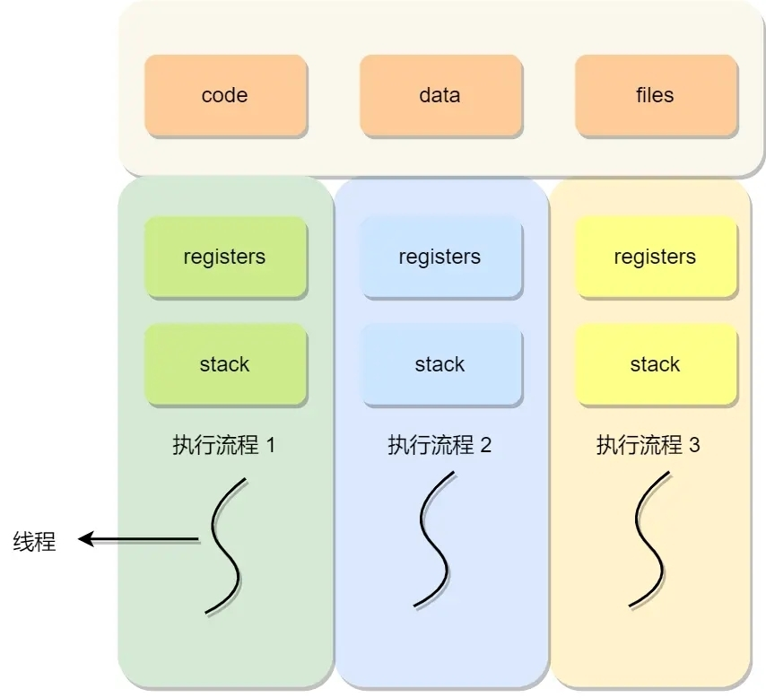
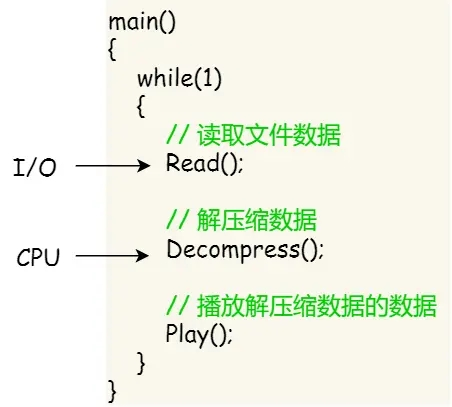
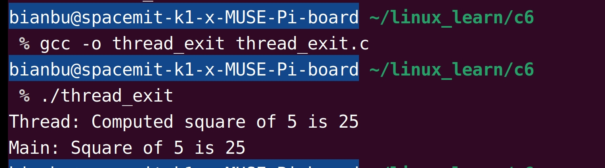

sidebar_position: 10

# 1. 线程简介

进程是独立运行的程序实例，但其通信复杂、资源占用高，在并发性能上存在瓶颈。为解决这些问题，引入了线程。线程是进程中更小的执行单元，共享进程资源，具有更轻量、更高效的特点，特别适用于高并发和需要频繁切换的任务场景，弥补了进程模型的不足。

## **1.1 什么是线程**

线程（Thread）是操作系统能够进行独立运算和调度的最小单位，它是进程中的一个子任务，代表程序中一个独立的执行流。一个进程可以包含多个线程，所有线程共享进程的资源（如内存、文件描述符、全局变量等），每个线程都有独立的寄存器（Registers）和栈（Stack），用来存储执行状态和局部变量，如图1.1.1所示。

<figure style="text-align: center;"> <!-- 设置居中 -->
   <!-- 调整大小 -->
  <figcaption style="margin-top: 10px; color: #555;">图1.1.1 多线程共享进程资源</figcaption>
</figure>


在实际应用中，每个进程至少包含一个主线程，主线程负责执行程序的主要逻辑，其他线程则可以分担任务。例如，在一个文件下载应用中，主线程可以负责用户界面交互，子线程负责下载文件或保存到磁盘，从而实现任务分离和高效执行。

## 1.2 为什么使用线程

使用线程有以下优势：

- **提升并发性能：**线程可以并发执行多个任务，比如同时处理用户请求、后台计算、文件读写等，使程序更高效地利用多核 CPU 的能力。
- **资源共享：**同一进程内的所有线程共享全局变量、内存、文件描述符等资源，避免了进程间通信的复杂性和性能开销。
- **轻量级操作：**线程的创建、销毁以及线程间切换的开销远小于进程，适合需要频繁创建和销毁任务的应用场景。
- **灵活性：**线程模型适用于各种应用场景，特别是需要高性能并发和实时响应的任务，比如IO密集型任务、多核CPU应用场景。

假设一个视频播放器软件有三个核心任务：

- 从视频中读取数据。
- 对读取的数据进行解压缩。
- 播放解压缩的视频数据。

对于单进程，软件模型如下：

<figure style="text-align: center;"> <!-- 设置居中 -->
   <!-- 调整大小 -->
  <figcaption style="margin-top: 10px; color: #555;">图1.2.1 单线程播放器模型</figcaption>
</figure>


当基于单进程时，播放出来的画面和声音可能会不连贯，因为当CPU能力不够时，进程会阻塞在 `Decompress()` 操作，花费较多时间多数据进行解压缩。这种情况下，任务之间不是并发执行的，影响资源使用效率。可改为多线程模型，如图1.2.2所示。

<figure style="text-align: center;"> <!-- 设置居中 -->
   <!-- 调整大小 -->
  <figcaption style="margin-top: 10px; color: #555;">图1.2.2 多线程播放器模型</figcaption>
</figure>


这样，多个任务可以并发执行，资源被充分利用，用户也会有更好的播放体验。

## 1.3 进程和线程对比

进程和线程的**联系**如下：

1. 线程依附于进程：线程不能独立存在，必须属于某个进程。一个进程至少包含一个主线程，其他线程共享进程的资源。
2. 线程共享进程资源：线程共享进程的全局数据和资源，但具有独立的程序计数器、寄存器和栈，能够独立调度和执行。
3. 多线程提高进程效率：通过引入多线程，一个进程可以同时进行多项任务，比如处理网络连接、用户请求和后台任务。

线程和进程在以下几个方面有明显**区别**：

| **特性**     | **线程**                                     | **进程**                                               |
| :----------- | :------------------------------------------- | :----------------------------------------------------- |
| **定义**     | 进程中的执行单元，多个线程共享同一进程资源   | 程序的独立运行实例，拥有独立资源                       |
| **调度单位** | 操作系统调度的基本单位之一，线程切换更加频繁 | 进程调度较少，因其创建和销毁的代价更高                 |
| **资源共享** | 同一进程内的线程共享内存、文件描述符等资源   | 进程间资源完全独立，通信需要额外机制                   |
| **开销**     | 创建、销毁、切换的开销较低                   | 创建、销毁、切换的开销较高                             |
| **通信方式** | 通过共享内存或同步机制，通信效率高           | 需要借助 IPC（如管道、消息队列、共享内存等），效率较低 |
| **并发能力** | 线程并发能力强，适合多核处理                 | 进程也支持并发，但切换成本较高                         |
| **崩溃影响** | 一个线程崩溃可能导致整个进程崩溃             | 一个进程崩溃不会直接影响其他进程                       |
| **典型场景** | IO密集型、需要共享资源的高并发场景           | 独立运行的任务，需要安全隔离                           |

# **2. 线程的创建与终止**

## **2.1 创建线程**

`pthread_create` 是创建线程的主要函数，其基本语法如下：

```c
int pthread_create(pthread_t *thread, const pthread_attr_t *attr, 
                   void *(*start_routine)(void *), void *arg);
```

> <small style="color: #6c757d;">参数说明：<br>1. `thread`：存储线程标识符。<br>2. `attr`：线程属性，通常设置为 NULL 使用默认属性。<br>3. `start_routine`：线程执行的入口函数。<br>4. `arg`：传递给线程入口函数的参数。<br>5. 成功返回 `0`，出错返回错误码。</small>

### **示例：创建线程**

以下代码 thread_create.c [(点击下载)](code/10_thread_basic/2-1-thread-create) 展示了通过 `pthread_create` 函数来创建线程。

```c
#include <pthread.h>
#include <stdio.h>
#include <stdlib.h>

void *thread_func(void *arg) {
    printf("Thread is running: %s\n", (char *)arg);
    return NULL;
}

int main() {
    pthread_t thread_id;
    const char *message = "Hello, Thread!";

    if (pthread_create(&thread_id, NULL, thread_func, (void *)message) != 0) {
        perror("Failed to create thread");
        return EXIT_FAILURE;
    }

    // 等待线程完成
    pthread_join(thread_id, NULL);

    printf("Main thread ends.\n");
    return EXIT_SUCCESS;
}
```

在上述代码中，`pthread_join` 用于等待线程执行完成并清理其资源。编译和运行程序，输出结果如图2.1.1所示。

<figure style="text-align: center;"> <!-- 设置居中 -->
   <!-- 调整大小 -->
  <figcaption style="margin-top: 10px; color: #555;">图2.1.1 pthread_create创建线程示例</figcaption>
</figure>

## 2.2 终止线程

线程的终止涉及到线程如何结束自己的生命周期以及主线程如何正确管理线程的退出。线程的终止可以分为显式终止和隐式终止，此外，主线程需要正确管理子线程的退出以避免资源泄漏。

### 2.2.1 显式终止

`pthread_exit` 是线程库提供的用于线程终止的函数，它允许线程安全地退出，并返回一个值给等待它的线程（通常是主线程）。

```c
void pthread_exit(void *retval);
```

> <small style="color: #6c757d;">`retval`：线程的返回值，主线程或其他线程可以通过 `pthread_join` 获取这个值。</small>

**显示终止有以下特点：**

- 线程资源释放：`pthread_exit` 会自动释放线程占用的资源（如线程栈空间等），但不会关闭线程共享的资源（如文件描述符等）。
- 线程返回值：调用线程可以通过参数 `retval` 将退出状态返回给其他线程（通常是主线程）。
- 不会退出整个进程：如果主线程调用 `pthread_exit`，则主线程会退出，但不会终止整个进程。

### 2.2.2 隐式终止

线程在完成其任务时，可以通过正常返回的方式隐式终止。这种方式本质上与调用 `pthread_exit` 类似，返回值会被系统自动传递给等待线程。

以下示例展示了线程的隐式终止。

```c
void *thread_func(void *arg) {
    int *result = malloc(sizeof(int));
    *result = 42;  // 设置返回值
    return (void *)result;  // 隐式终止，等价于 pthread_exit
}
```

注意：隐式终止时，线程函数返回的值仍然需要通过 `pthread_join` 获取。

### **2.2.3 主线程等待**

主线程可以通过 `pthread_join` 等待指定的线程终止，同时获取线程的退出状态。这是线程同步和资源管理的重要手段。

```c
int pthread_join(pthread_t thread, void **retval);
```

> <small style="color: #6c757d;">参数说明：<br>1. `thread`：要等待的线程 ID。<br>2. `retval`：指针，用于存储线程的返回值。</small>

`pthread_join` 函数主要有以下功能：

1. 实现线程同步：主线程调用 `pthread_join` 后，会阻塞等待，直到指定线程终止。
2. 获取返回值：可以通过 `retval` 获取子线程的返回值。
3. 避免僵尸线程：调用 `pthread_join` 后，子线程的资源（如线程栈空间）会被系统释放。

### 2.2.4 示例：线程显式终止与主线程等待

以下示例 thread_exit.c [(点击下载)](code/10_thread_basic/2-2-thread-exit) 展示了如何使用 `pthread_exit` 和 `pthread_join` 进行线程的创建、终止以及返回值的获取。

```c
#include <pthread.h>
#include <stdio.h>
#include <stdlib.h>

// 子线程计算平方值
void *compute_square(void *arg) {
    int n = *(int *)arg;  // 获取输入参数
    int *result = malloc(sizeof(int));  // 为结果分配内存
    if (result == NULL) {
        perror("Failed to allocate memory");
        pthread_exit(NULL);
    }
    *result = n * n;  // 计算平方值
    printf("Thread: Computed square of %d is %d\n", n, *result);
    pthread_exit((void *)result);  // 显式终止线程
}

int main() {
    pthread_t thread_id;  // 线程 ID
    int num = 5;          // 输入值
    int *result;          // 存储线程返回值

    // 创建线程
    if (pthread_create(&thread_id, NULL, compute_square, (void *)&num) != 0) {
        perror("Failed to create thread");
        return EXIT_FAILURE;
    }

    // 等待线程完成，并获取返回值
    if (pthread_join(thread_id, (void **)&result) != 0) {
        perror("Failed to join thread");
        return EXIT_FAILURE;
    }

    printf("Main: Square of %d is %d\n", num, *result);  // 输出结果
    free(result);  // 释放线程返回的动态内存

    return EXIT_SUCCESS;
}
```

编译和运行结果如图2.2.1所示。

<figure style="text-align: center;"> <!-- 设置居中 -->
   <!-- 调整大小 -->
  <figcaption style="margin-top: 10px; color: #555;">图2.2.1 线程退出和主线程等待</figcaption>
</figure>
# **3. 线程的分离与回收**

在多线程编程中，线程的分离与回收是重要的管理手段。分离线程使线程在执行完成后自动释放资源，而回收线程则是手动管理线程的生命周期，以获取线程的执行结果或确保其任务完成。

## **3.1 线程分离**

线程分离是指将线程的执行与主线程脱离开，使其在完成任务后自动释放资源。分离后的线程无需`pthread_join` 来回收资源，适用于不需要主线程等待其完成的场景。

通过 `pthread_detach` 函数可以将线程设置为分离状态：

```c
int pthread_detach(pthread_t thread);
```

> <small style="color: #6c757d;">参数说明：<br>1. thread：需要分离的线程的 ID。<br>2. 成功返回 0，失败返回错误码。</small>

### **示例：分离线程**

创建代码 thread_detach.c [(点击下载)](code/10_thread_basic/3-1-thread-detach)：

```c
#include <pthread.h>
#include <stdio.h>
#include <unistd.h>

void *detached_thread_func(void *arg) {
    printf("Detached thread is running: %s\n", (char *)arg);
    sleep(2); // 模拟任务执行
    printf("Detached thread ends.\n");
    return NULL;
}

int main() {
    pthread_t thread_id;

    if (pthread_create(&thread_id, NULL, detached_thread_func, "Task A") != 0) {
        perror("Failed to create thread");
        return -1;
    }

    // 将线程设置为分离状态
    if (pthread_detach(thread_id) != 0) {
        perror("Failed to detach thread");
        return -1;
    }

    printf("Main thread does not wait for detached thread.\n");
    sleep(3); // 确保分离线程有足够的时间完成任务
    return 0;
}
```

上述代码中，`pthread_detach` 函数使得线程分离，该线程无需通过 `pthread_join` 函数来等待主线程回收资源，而是在完成任务后自动释放。编译和运行结果如图3.1.1所示。

<figure style="text-align: center;"> <!-- 设置居中 -->
   <!-- 调整大小 -->
  <figcaption style="margin-top: 10px; color: #555;">图3.1.1 线程分离示例</figcaption>
</figure>

## **3.2 线程回收**

线程回收是指主线程通过 `pthread_join` 函数等待一个线程执行完成，并获取其返回值，同时释放该线程的资源。上述章节已经演示过 `pthread_join` 函数的使用，本节便不再赘述。

**线程分离与回收的区别**：

| **特性**         | **线程分离**                   | **线程回收**                   |
| :--------------- | :----------------------------- | :----------------------------- |
| **资源释放方式** | 自动释放，无需主线程干预       | 主线程通过 `pthread_join` 释放 |
| **获取返回值**   | 主线程无法获取分离线程的返回值 | 主线程通过 `pthread_join` 获取 |
| **适用场景**     | 后台任务、无需同步的任务       | 主线程需要等待的任务           |
| **控制权**       | 分离后不可再控制线程           | 可以对线程进行完整管理         |
