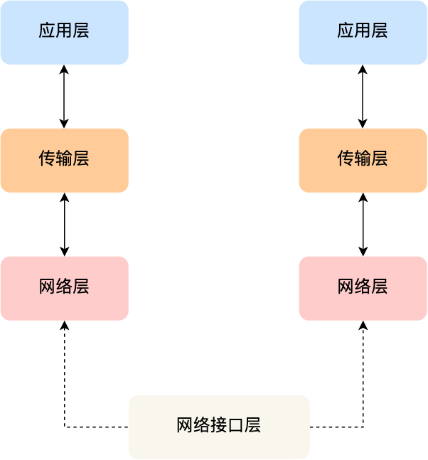
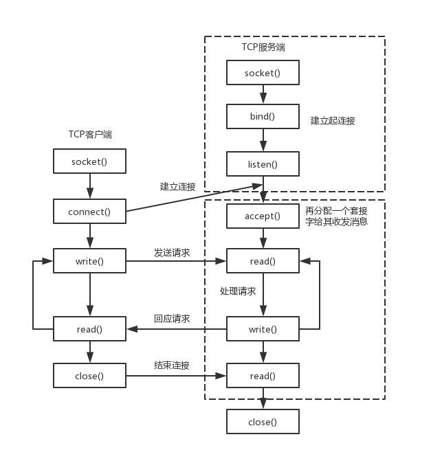
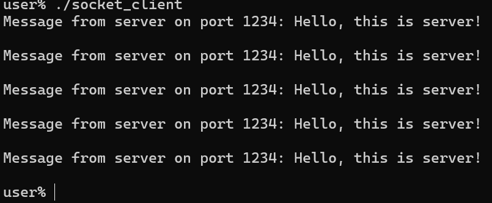

sidebar_position: 12

# **1. 网络编程基础**
网络编程是指在网络中进行数据交换的程序设计。通过网络编程，开发者可以实现不同计算机之间的通信。Socket（套接字）是实现网络编程的主要接口，本节将介绍Socket的基本概念以及TCP/IP协议的相关知识。

## **1.1 Socket编程的基本概念**
TCP/IP（传输控制协议/互联网协议）是一组用于网络通信的协议。它为网络中设备之间的通信提供了规则和标准。TCP/IP协议栈通常分为四个层次：

1. **应用层**：负责提供网络服务给用户应用程序，包括HTTP（网页）、FTP（文件传输）、SMTP（邮件）等协议。
2. **传输层**：提供端到端的通信服务，主要有TCP和UDP协议。
3. **网络层**：负责数据包的传输路径选择，主要协议是IP（互联网协议），负责在网络中寻址和路由。
4. **网络接口层**：处理在物理网络上直接传输数据的任务，包括Ethernet和Wi-Fi等协议。

<figure style="text-align: center;"> <!-- 设置居中 -->
   <!-- 调整大小 -->
  <figcaption style="margin-top: 10px; color: #555;">图1.1.1 TCP/IP网络模型</figcaption>
</figure>

Socket则是对 TCP/IP 协议族的一种封装，是应用层与TCP/IP协议族通信的中间软件抽象层。从设计模式的角度看来，Socket其实就是一个门面模式，它把复杂的TCP/IP协议族隐藏在Socket接口后面，对用户来说，一组简单的接口就是全部，让Socket去组织数据，以符合指定的协议。因此我们只需要学会去使用socket即可直接利用TCP/IP网络模型来进行计算机之间的交互。

## **1.2 创建与绑定Socket**
上面我们已经知道网络中的进程是通过Socket来通信的，而Socket起源于Unix，而Unix/Linux基本哲学之一就是“一切皆文件”，都可以用“打开open –> 读写write/read –> 关闭close”模式来操作。Socket就是该模式的一个实现，可以理解为Socket是一种特殊的文件，一些Socket函数就是对其进行的操作（读/写IO、打开、关闭）。

### **1.2.1 创建Socket**
Socket的创建函数原型如下：
```c
int socket(int domain, int type, int protocol);
```
socket创建函数对应于普通文件的打开操作。普通文件的打开操作返回一个文件描述字，而`socket()`用于创建一个socket描述符（socket descriptor），它唯一标识一个socket。这个socket描述字跟文件描述字一样，后续的操作都有用到它，把它作为参数，通过它来进行一些读写操作。
正如可以给fopen的传入不同参数值，以打开不同的文件。创建socket的时候，也可以指定不同的参数创建不同的socket描述符，socket函数的三个参数分别为：

地址族`domain`，常用的有：

- `AF_INET`：IPv4 网络协议。
- `AF_INET6`：IPv6 网络协议。
- `AF_UNIX`：本地通信（UNIX 域套接字）。

套接字类型`type`，常用的有：

- `SOCK_STREAM`：流式套接字（TCP）。
- `SOCK_DGRAM`：数据报套接字（UDP）。

指定协议`protocol`，通常填 0，由系统选择默认协议，也可手动选择，常见可选项有：

- IPPROTO_TCP：TCP传输协议。
- IPPTOTO_UDP：UDP传输协议。
- IPPROTO_SCTP：STCP传输协议。
- IPPROTO_TIPC：TIPC传输协议。

需要注意的是上面type和protocol并不能随意组合，比如SOCK_STREAM不可以跟IPPROTO_UDP组合，这是因为UDP协议不支持流式传输。

### **1.2.2 绑定Socket**
上面Socket创建成功后就规定了该Socket的地址族、指定的协议，要能够使用Socket则需要将一个地址族中的特定地址赋给Socket，这样才能在网络中唯一的找到该一个Socket。例如对应AF_INET、AF_INET6就是把一个ipv4或ipv6地址和端口号组合赋给socket。
绑定的函数原型如下：
```c
int bind(int sockfd, const struct sockaddr *addr, socklen_t addrlen);
```
函数的三个参数分别为：

- sockfd：即socket描述字，它是通过`socket()`函数创建了，唯一标识一个socket。`bind()`函数就是将给这个描述字绑定一个名字。
- addrlen：对应的是地址结构的长度。
- addr：一个const struct sockaddr *指针，指向要绑定给sockfd的协议地址。这个地址结构根据地址创建socket时的地址协议族的不同而不同，如ipv4对应的是：
```c
struct sockaddr_in {
    sa_family_t    sin_family; /* address family: AF_INET */
    in_port_t      sin_port;   /* port in network byte order */
    struct in_addr sin_addr;   /* internet address */
};

/* Internet address. */
struct in_addr {
    uint32_t       s_addr;     /* address in network byte order */
};
```
ipv6对应的是：
```c
struct sockaddr_in6 { 
    sa_family_t     sin6_family;   /* AF_INET6 */ 
    in_port_t       sin6_port;     /* port number */ 
    uint32_t        sin6_flowinfo; /* IPv6 flow information */ 
    struct in6_addr sin6_addr;     /* IPv6 address */ 
    uint32_t        sin6_scope_id; /* Scope ID (new in 2.4) */ 
};

struct in6_addr { 
    unsigned char   s6_addr[16];   /* IPv6 address */ 
};
```
Unix域对应的是：
```c
#define UNIX_PATH_MAX    108

struct sockaddr_un { 
    sa_family_t sun_family;               /* AF_UNIX */ 
    char        sun_path[UNIX_PATH_MAX];  /* pathname */ 
};
```
Socket绑定后即可在给定的地址和端口上进行通信，通常服务器在启动的时候都会绑定一个众所周知的地址（如ip地址+端口号），用于提供服务，客户就可以通过它来接连服务器；而客户端就不用指定，有系统自动分配一个端口号和自身的ip地址组合。这就是为什么通常服务器端在监听之前会调用`bind()`，而客户端就不会调用，而是在`connect()`时由系统随机生成一个。


## **1.3 Socket的读写与关闭**
如果作为一个服务器，在调用`socket()`、`bind()`之后需要调用`listen()`来监听这个Socket，如果客户端这时调用`connect()`发出连接请求，服务器端就会通过`accept()`函数来接收这个请求，此时Socket连接正式建立，就可以像文件IO类似进行读写操作了。
`listen()`、`connect()`、`accept()`函数原型如下：
```c
int listen(int sockfd, int backlog);
int connect(int sockfd, const struct sockaddr *addr, socklen_t addrlen);
int accept(int sockfd, struct sockaddr *addr, socklen_t *addrlen);
```
listen函数的第一个参数即为要监听的socket描述字，第二个参数为相应socket可以排队的最大连接个数。`socket()`函数创建的socket默认是一个主动类型的，listen函数将Socket变为被动类型的，等待客户的连接请求。

connect函数的第一个参数即为客户端的socket描述字，第二参数为服务器的socket地址，第三个参数为socket地址的长度。客户端通过调用connect函数来建立与TCP服务器的连接。


### **1.3.1 Socket读写**
一旦，建立好了tcp连接之后，就可以把得到的fd当作文件描述符来使用。由此网络程序里最基本的函数就是read和write函数了。他们的使用方法是一样的，只需要把需要操作的Socket描述字跟需要操作的缓冲区指针跟长度传递给参数即可。
读写函数原型如下：
```c
ssize_t write(int fd, const void*buf, size_t nbytes);
ssize_t read(int fd, void *buf, size_t nbyte)
```
write函数将buf中的nbytes字节内容写入Socket描述字fd，成功时返回写的字节数，失败时返回-1，并设置errno变量。在网络程序中，当我们向套接字文件描述符写时有两可能：

- write的返回值大于0,表示写了部分或者是全部的数据。这样我们用一个while循环来不停的写入，但是循环过程中的buf参数和nbyte参数得由我们来更新。也就是说，网络写函数是不负责将全部数据写完之后在返回的。
- write的返回的值小于0,此时出现了错误，常见的错误有以下两种：
    1. 如果错误为`EINTR`表示在写的时候出现了中断错误
    2. 如果为`EPIPE`表示网络连接出现了问题(对方已经关闭了连接)

read函数是负责从Socket描述字fd中读取内容。当读成功时，read返回实际所读的字节数，如果返回的值是0表示已经读到文件的结束了，小于0表示出现了错误。如果错误为EINTR说明读是由中断引起的，如果是ECONNREST则表示网络连接出了问题。

`write()`和`read()`是Socket进行读写中最简单的函数，只负责对缓冲区和Socket之间进行数据的交换，具体细节由系统默认指定了，但实际上Socket中数据的读写还有`recv()`/`send()`、`recvmsg()`/`sendmsg()`、`recvfrom()`/`sendto()`等其他函数可以使用，通过这些函数可以指定Socket在通信时的一些行为，比如`send()`函数携带了`MSG_DONTROUTE`标志则表明目的主机在本地网络上面，Socket没有必要查找表；`recv()`函数携带了`MSG_WAITALL`时会一直阻塞，直到指定的条件满足，或者是发生了错误才返回。篇幅限制，这里只详细介绍最简单write和read函数。

### **1.3.2 Socket关闭**
在服务器和客户端建立连接之后，会进行一些读写操作，完成了读写操作就要关闭相应的socket描述字，否则会有一些资源不被释放，长期运行会导致资源的浪费。函数原型如下：
```c
int close(int fd);
```
调用`close()`会把该Socket标记为关闭，然后立即返回到调用进程。该描述字不能再由调用进程使用，也就是说不能再作为`read`或`write`的第一个参数，当这个描述字的引用为0时就会释放资源。


## **1.4 Socket服务端和客户端通信综合案例**
通过前面的知识，我们可以完成一个简单的服务端和客户端使用Socket来进行通信的案例，通信过程如图1.4.1所示：

<figure style="text-align: center;"> <!-- 设置居中 -->
   <!-- 调整大小 -->
  <figcaption style="margin-top: 10px; color: #555;">图1.4.1 Socket通信流程</figcaption>
</figure>

示例代码[打包下载](code/12_network_basic/1-1-socket/)

**服务端代码：**
```c
#include <arpa/inet.h>
#include <netinet/in.h>
#include <stdio.h>
#include <stdlib.h>
#include <string.h>
#include <sys/socket.h>
#include <unistd.h>

int main() {
    // 创建套接字
    int serv_sock = socket(AF_INET, SOCK_STREAM, IPPROTO_TCP);

    // 将套接字和IP、端口绑定
    struct sockaddr_in serv_addr;
    memset(&serv_addr, 0, sizeof(serv_addr));  // 每个字节都用0填充
    serv_addr.sin_family = AF_INET;            // 使用IPv4地址
    serv_addr.sin_addr.s_addr = inet_addr("127.0.0.1");  // 127.0.0.1表示本机IP
    serv_addr.sin_port = htons(1234);                    // 端口，需要保证未被占用
    bind(serv_sock, (struct sockaddr*)&serv_addr, sizeof(serv_addr));

    // 进入监听状态，等待用户发起请求
    listen(serv_sock, 20);

    // 接收客户端请求
    struct sockaddr_in clnt_addr;
    socklen_t clnt_addr_size = sizeof(clnt_addr);
    while (1) {
        int clnt_sock =
            accept(serv_sock, (struct sockaddr*)&clnt_addr, &clnt_addr_size);

        // 提取客户端的 IP 地址和端口
        char client_ip[INET_ADDRSTRLEN];
        inet_ntop(AF_INET, &clnt_addr.sin_addr, client_ip, sizeof(client_ip));
        int client_port = ntohs(clnt_addr.sin_port);

        // 打印客户端信息
        printf("Client connected: IP = %s, Port = %d\n", client_ip,
               client_port);

        // 向客户端发送数据
        char str[] = "Hello, this is server!\n";
        write(clnt_sock, str, sizeof(str));

        // 关闭套接字
        close(clnt_sock);
    }
    close(serv_sock);
    return 0;
}

```

**客户端代码：**
```c
#include <arpa/inet.h>
#include <stdio.h>
#include <stdlib.h>
#include <string.h>
#include <sys/socket.h>
#include <time.h>
#include <unistd.h>

int main() {
    const char* server_ip = "127.0.0.1";  // 服务器的IP地址
    int port = 1234;                      // 服务器端口
    int num_attempts = 5;                 // 连接次数

    for (int i = 0; i < num_attempts; i++) {
        // 创建套接字
        int sock = socket(AF_INET, SOCK_STREAM, 0);
        if (sock < 0) {
            perror("Socket creation failed");
            exit(EXIT_FAILURE);
        }

        // 向服务器发起请求
        struct sockaddr_in serv_addr;
        memset(&serv_addr, 0, sizeof(serv_addr));  // 每个字节都用0填充
        serv_addr.sin_family = AF_INET;            // 使用IPv4地址
        serv_addr.sin_addr.s_addr = inet_addr(server_ip);  // 具体的IP地址
        serv_addr.sin_port = htons(port);  // 设置端口为1234

        // 尝试连接到服务器
        if (connect(sock, (struct sockaddr*)&serv_addr, sizeof(serv_addr)) <
            0) {
            perror("Connection failed");
            close(sock);
            sleep(1);  // 连接失败后休眠1秒
            continue;  // 如果连接失败，继续尝试下一个连接
        }

        // 读取服务器传回的数据
        char buffer[40];
        ssize_t bytes_read = read(sock, buffer, sizeof(buffer) - 1);
        if (bytes_read < 0) {
            perror("Failed to read from server");
        } else {
            buffer[bytes_read] = '\0';  // 确保字符串以 null 结尾
            printf("Message from server on port %d: %s\n", port, buffer);
        }

        // 关闭套接字
        close(sock);

        // 暂停 1 秒钟
        sleep(1);
    }

    return 0;
}
```
在分别编译完成以上服务端和客户端代码后，先运行服务端进程，进入监听模式，然后再另一个终端运行客户端进程，可以看到图1.4.2和图1.4.3的结果：
<figure style="text-align: center;"> <!-- 设置居中 -->
   <!-- 调整大小 -->
  <figcaption style="margin-top: 10px; color: #555;">图1.4.2 服务端输出</figcaption>
</figure>

<figure style="text-align: center;"> <!-- 设置居中 -->
   <!-- 调整大小 -->
  <figcaption style="margin-top: 10px; color: #555;">图1.4.3 客户端输出</figcaption>
</figure>
可以看到，客户端连续向服务端发起了5次Socket请求，并都得到了正确的回应。


# **2. 网络工具与命令**
除了通过Socket来进行网络编程，Linux下还有数量众多的已发行软件可以使用，本节将介绍其中较为常用的一些软件和Linux命令。

## **2.1 使用netcat调试网络通信**
netcat（通常缩写为nc）是一种计算机联网实用程序，用于使用TCP或UDP读写网络连接。 该命令被设计为可靠的后端，可以直接使用或由其他程序和脚本轻松驱动。 同时，它是功能丰富的网络调试和调查工具，因为它可以产生用户可能需要的几乎任何类型的连接，并具有许多内置功能。netcat被称为网络工具中的瑞士军刀，体积小巧，但功能强大。

首先是nc的安装，有些精简版的Linux发行版没有内置集成nc，需要使用包管理器进行安装：
```bash
sudo apt update
sudo apt install netcat
```

常见的一些用法：

1） 用nc进行**端口监听**：
```bash
nc -l <port>
```
然后用客户端连接该端口：
```bash
nc <ip> <port>
```
就可以实现TCP通信，如果需要使用UDP协议作为传输层协议，则需要添加`-u`参数

2）使用nc进行**文件传输**：
```bash
nc -l <port> > <filename>
```
通过该命令就可以将监听端口的数据重定向到给定的文件中

客户端则通过命令进行发文件：
```bash
nc <ip> <port> < <filename>
```

3）使用nc进行**端口扫描**
```bash
nc -vz <domain> <port>
```
- `-z`：仅用于扫描，不发送任何数据。
- `-v`：启用详细模式，显示连接尝试的结果。

其他详细参数如下表：

| **选项** | **说明**                                                               |
| :------- | :--------------------------------------------------------------------- |
| `-h`     | 输出 nc 的帮助                                                         |
| `-v`     | 在网络通讯时，显示详细的输出信息                                       |
| `-n`     | 对命令行中的“主机”，**不**进行域名解析                                 |
| `-p`     | 指定“端口号”                                                           |
| `-l`     | 开启“监听模式”，nc 作为**服务端**。注：如不加该选项，nc 默认作为客户端 |
| `-u`     | 使用 UDP 协议。注：如不加该选项，默认是 TCP 协议                       |
| `-w`     | 设置连接的超时间隔（N 秒）                                             |
| `-q`     | 让 nc 延时（N 秒）再退出                                               |
| `-z`     | 开启“zero-I/O 模式”。注：该选项仅用于**端口扫描**                      |
| `-k`     | 配合 -l 选项使用，可以重复接受客户端连接                               |
| `-X`     | 指定代理的类型                                                         |
| `-x`     | 以 IP:port 的格式指定代理的位置                                        |
| `-e`     | 启动某个进程，把该进程的标准输入输出与网络通讯对接                     |


## **2.2 tcpdump抓包工具**
tcpdump是Linux下一款强大的网络抓包工具，它使用libpcap库来抓取网络数据包，这个库在几乎在所有的Linux/Unix中都有。熟悉 tcpdump的使用能够帮助你分析调试网络数据，本节将通过一个个具体的示例来介绍它在不同场景下的使用方法。

**不指定任何参数：**
监听第一块网卡上经过的数据包。主机上可能有不止一块网卡，所以经常需要指定网卡。
```bash
tcpdump
```

**监听特定网卡：**
```bash
tcpdump -i en0
```

**监听特定主机：**
例子：监听本机跟主机182.254.38.55之间往来的通信包，收、发的包都会被监听
```bash
tcpdump host 182.254.38.55
```

**监听特定来源、目标地址的通信：**

- **特定来源**
```bash
tcpdump src host hostname
```

- **特定目标地址**
```bash
tcpdump dst host hostname
```

**特定端口：**
```bash
tcpdump port 1234
```

**监听TCP/UDP：**
服务器上不同服务分别用了TCP、UDP作为传输层，假如只想监听TCP的数据包
``` bash
tcpdump tcp
```
例子：

**来源主机+端口+TCP**：监听来自主机123.207.116.169在端口22上的TCP数据包
```bash
tcpdump tcp port 22 and src host 123.207.116.169
```

**监听特定主机之间的通信：**
210.27.48.1除了和210.27.48.2之外的主机之间的通信
```bash
tcpdump ip host 210.27.48.1 and ! 210.27.48.2
```

tcpdump支持的参数十分之多，能够满足各种Linux下对网络的调试和分析，这里列出较为完善的参数以供快速查询，无需硬记：

**参数格式：**
```bash
tcpdump [ -AdDeflLnNOpqRStuUvxX ] [ -c count ]
           [ -C file_size ] [ -F file ]
           [ -i interface ] [ -m module ] [ -M secret ]
           [ -r file ] [ -s snaplen ] [ -T type ] [ -w file ]
           [ -W filecount ]
           [ -E spi@ipaddr algo:secret,...  ]
           [ -y datalinktype ] [ -Z user ]
           [ expression ]
```
**参数解释：**

| 参数 | 含义                                                                                                 |
| :--- | :--------------------------------------------------------------------------------------------------- |
| `-A` | 以ASCII码方式显示每一个数据包                                                                        |
| `-c` | tcpdump将在接受到count个数据包后退出                                                                 |
| `-d` | 以容易阅读的形式,在标准输出上打印出编排过的包匹配码, 随后tcpdump停止                                 |
| `-D` | 打印系统中所有tcpdump可以在其上进行抓包的网络接口                                                    |
| `-f` | 采用数字方式显示外部IPv4                                                                             |
| `-i` | 指定tcpdump需要监听的wwawanwang网kka卡                                                               |
| `-l` | 对标准输出进行行缓冲                                                                                 |
| `-n` | 不对地址进行数字表示到名字表示的转换                                                                 |
| `-N` | 不打印出host的域名部分                                                                               |
| `-p` | 把网络接口设置为非混杂模式                                                                           |
| `-q` | 快速打印输出                                                                                         |
| `-s` | 置tcpdump的数据包抓取长度, 缺省68字节                                                                |
| `-t` | 在每行输出中不打印时间戳                                                                             |
| `-U` | 使得当tcpdump在使用-w选项时, 其文件写入与包的保存同步（**同步写盘**）                                |
| `-v` | 当分析和打印的时候, 产生详细的输出                                                                   |
| `-w` | 把包数据直接写入文件而不进行分析和打印输出                                                           |
| `-W` | 配合-C选项使用, 这将限制可打开的文件数目, 并且当文件数据超过这里设置的限制时, 依次循环替代之前的文件 |
| `-Z` | 使tcpdump放弃自己的超级权限                                                                          |

## **2.3 常用的网络命令**
以下是一些在Linux系统中常用的网络命令的简单介绍，这些命令对于网络调试、监控和管理非常有用。

**ping**
功能：用于测试网络连接的可达性。

用法：

```bash
ping [hostname或IP地址]
```
示例：
```bash
ping baidu.com
```
说明：ping 命令通过发送 ICMP 回显请求（Echo Request）到目标主机，并等待回显应答（Echo Reply），从而测试目标主机是否可达。它还会显示延迟和丢包率等信息。

**netstat**
功能：用于显示网络连接、路由表、接口统计信息等。

用法：

```bash
netstat [选项]
```
常用选项：

- `-a`：显示所有连接和监听端口。
- `-t`：显示 TCP 连接。
- `-u`：显示 UDP 连接。
- `-n`：以数字形式显示地址和端口号（不进行域名解析）。
- `-l`：显示正在监听的服务端口。
示例：

```bash
netstat -tuln
```
说明：该命令会显示所有正在监听的 TCP 和 UDP 端口及其对应的地址。

**traceroute**
功能：用于跟踪数据包到达目标主机的路径。

用法：

```bash
traceroute [hostname或IP地址]
```
示例：

```bash
traceroute baidu.com
```
说明：traceroute 显示数据包经过的每个路由器的 IP 地址和响应时间，帮助分析网络路径和发现网络问题。

**ifconfig / ip**
功能：用于显示和配置网络接口。

用法：

```bash
ifconfig [接口名]
ip addr show
```
示例：

```bash
ifconfig eth0
ip addr show
```
说明：这两个命令用于查看网络接口的状态和配置。ifconfig 是较旧的命令，而 ip 是更现代和功能更强的工具，推荐使用 ip 命令。

**curl**
功能：用于在命令行中与 URL 进行交互，可以发送请求并查看响应。

用法：

```bash
curl [选项] [URL]
```
示例：

```bash
curl https://www.spacemit.com/
```
说明：curl 可以发送各类 HTTP 请求（GET、POST 等），并可以用来下载文件、测试 API 等。

**wget**
功能：用于从网络下载文件。

用法：

```bash
wget [URL]
```
示例：

```bash
wget https://www.spacemit.com/wp-content/uploads/2022/08/SPACEMIT-LOGO.svg
```
说明：wget 支持 HTTP、HTTPS 和 FTP 协议，适用于从网络上下载文件。

**nslookup**
功能：用于查询 DNS 记录。

用法：

```bash
nslookup [hostname]
```
示例：

```bash
nslookup spacemit.com
```
说明：nslookup 可以用于查找域名的 IP 地址或查询 DNS 记录，帮助诊断 DNS 相关问题。

**whois**
功能：用于查询域名的注册信息。

用法：

```bash
whois [domain]
```
示例：

```bash
whois spacemit.com
```
说明：whois 查询域名的注册信息，包括注册人、注册日期和 DNS 服务器等。

**netstat**
功能：用于显示网络连接、路由表和网络接口统计信息。

用法：

```bash
netstat [选项]
```
常用选项：

- `-a`：显示所有连接和监听的端口。
- `-t`：显示 TCP 连接。
- `-u`：显示 UDP 连接。
- `-n`：以数字形式显示地址和端口号（不进行域名解析）。
- `-l`：显示正在监听的服务端口。
- `-p`：显示每个连接的进程 ID 和名称（需要 root 权限）。
- `-r`：显示路由表。
示例：

```bash
netstat -tuln
```
说明：该命令会显示所有正在监听的 TCP 和 UDP 端口及其对应的地址。