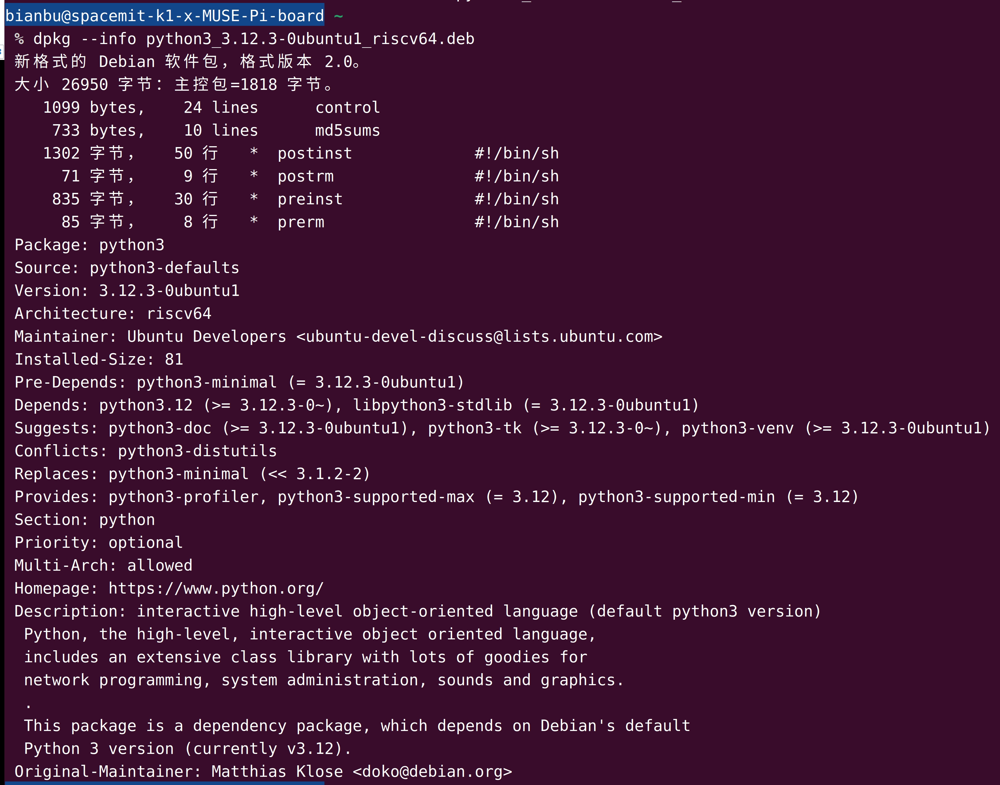
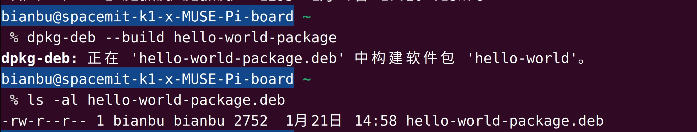
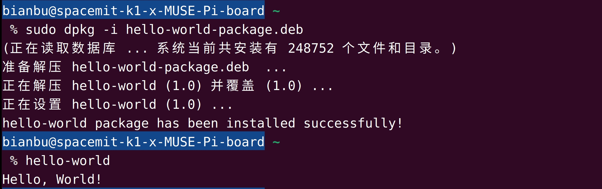
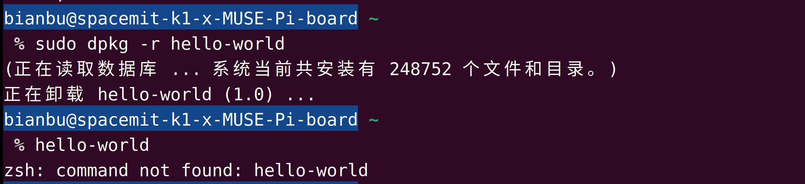

sidebar_position: 14

# 1. 什么是DEB包

DEB包是Linux系统中用于软件管理和分发的标准化包格式，主要用于基于Debian的发行版（如Ubuntu、Debian本身、Linux Mint等）。它为用户提供了一种便捷的方式来安装、升级、卸载和管理软件。

DEB包本质上是一个压缩文件，包含了软件的二进制文件、配置文件、依赖信息及其它所需文件。它的格式和结构使得包管理工具（如`dpkg`、`apt`）能够高效地处理软件的安装与管理。

### DEB包的命名规范

一个DEB包的文件名通常包含以下信息：

```bash
package_name-version-architecture.deb
```

- **`package_name`**：软件包的名称，如 `nginx`。
- **`version`**：版本号，表示软件的具体版本，例如 `1.18.0`。
- **`architecture`**：支持的硬件架构，例如 `amd64` 或 `riscv64`。

例如：

```bash
nginx-1.18.0-1-riscv64.deb
```

### DEB包的优势

- **标准化和一致性**： DEB包提供了一个统一的标准，使得不同软件的安装过程一致。它确保了软件的依赖关系和配置的正确性。
- **依赖管理**： DEB包在安装时会自动检查软件的依赖，并确保所需的库和工具已正确安装。
- **易于维护和更新**： 通过 `apt` 或 `dpkg` 工具，用户可以轻松地更新已安装的软件，确保系统始终保持最新状态。
- **系统稳定性**： 使用DEB包进行软件管理可以确保系统的一致性和稳定性，减少因手动安装软件带来的潜在问题。

# 2. DEB包的组成

DEB包具有统一的目录结构和文件组成，方便软件的安装、管理和分发。它主要由以下三部分构成：

| 组成             | 说明                                                       | 解压后位置                     |
| :--------------- | :--------------------------------------------------------- | :----------------------------- |
| 数据包           | 包含实际安装的程序数据，文件名为 `data.tar.XXX`            | 安装目录（如`/usr`、`/etc`等） |
| 安装信息及控制包 | 包含deb的安装说明，标识，脚本等，文件名为 `control.tar.gz` | `DEBIAN/`目录                  |
| 二进制数据       | 包含文件头等信息，需要特殊软件才能查看                     | 无直接对应（安装工具自动处理） |

以下是DEB包的解包结构示例：

```
package_name_version_architecture.deb
├── DEBIAN/                      # 控制信息目录
│   ├── control                   # 软件包的元数据文件（必需）
│   ├── preinst                   # 安装前脚本
│   ├── postinst                  # 安装后脚本
│   ├── prerm                     # 卸载前脚本
│   ├── postrm                    # 卸载后脚本
│   ├── changelog                 # 软件包的修订记录
│   ├── copyright                 # 软件的版权信息
│   ├── conffiles                 # 需要保护的配置文件列表
├── etc/                         # 安装到系统的配置文件目录
├── usr/                         # 程序文件的主要安装位置
│   ├── bin/                      # 可执行文件
│   ├── lib/                      # 库文件
│   ├── share/                    # 共享数据（文档、图标等）
├── opt/                         # 可选程序目录
├── tmp/                         # 临时文件目录
├── var/                         # 日志和运行时数据
│   └── log/                      # 日志文件
└── boot/                        # 启动相关文件
    └── initrd-vstools.img        # 初始内存映像文件
```

## 2.1 组成部分详解

### **2.1.1 控制信息（DEBIAN目录）**

DEBIAN目录包含DEB包的元数据和脚本，是DEB包的核心部分。其内容包括：

**1）control 文件**

- 软件包的描述性文件，包含包的基本信息，如名称、版本、依赖关系等。
- 必须存在，格式固定，用于安装管理工具识别包的内容。

常见字段有：

| 字段         | 说明                                   |
| ------------ | :------------------------------------- |
| Package      | 软件包名称                             |
| Version      | 版本号                                 |
| Description  | 简要说明                               |
| Depends      | 运行所需的依赖项                       |
| Architecture | 支持的平台（如`amd64`、`riscv64`）     |
| Priority     | 包的重要性（如`required`、`optional`） |
| Section      | 包的分类（如`utils`、`net`）           |

**2）脚本文件**

安装或卸载时的自定义操作通过以下脚本完成：

- **preinst**：安装前执行的脚本，通常用于停止旧版本服务或备份配置。
- **postinst**：安装后执行的脚本，常用于配置环境或启动服务。
- **prerm**：卸载前执行的脚本，用于停止服务或准备卸载。
- **postrm**：卸载后执行的脚本，用于清理残留文件或恢复系统状态。

**3）附加文件**

- **changelog**：记录软件包的修订历史。
- **copyright**：描述软件的版权和许可信息。
- **conffiles**：列出需要保护的配置文件，升级时不会被覆盖。

### **2.1.2 数据文件（安装目录）**

数据文件是DEB包的主要内容，包含软件运行所需的实际文件。安装时会根据Linux目录结构存放到系统中。

**1）etc/**：存放配置文件（如`/etc/myapp.conf`）。

**2）usr/**：程序的主要目录，包括：

- **bin/**：可执行文件（如`/usr/bin/myapp`）。
- **lib/**：库文件（如`/usr/lib/libmyapp.so`）。
- **share/**：共享数据（如文档、图标）。

**3）var/**：运行时数据目录（如`/var/log/myapp.log`）。

**4）opt/**：可选程序安装目录。

**5）tmp/**：临时文件目录。

### 2.1.3 二进制文件

二进制数据包含DEB包的头信息（如格式版本号），用于指示安装工具如何解析DEB包内容。常见文件：

- **debian-binary**：包含DEB包版本号。
- **data.tar.xxx**：压缩的程序文件数据。
- **control.tar.gz**：压缩的控制信息数据。

## 2.2 示例：解包并分析一个DEB包

以 `python3_3.12.3-0ubuntu1_riscv64.deb` 为例，以下是解包并查看内容的过程：

- 安装并下载  `python3` 的DEB包：

```bash
sudo apt update
sudo apt install python3
sudo apt download python3
```

- 查看DEB包基本信息：

```bash
dpkg --info python3_3.12.3-0ubuntu1_riscv64.deb
```

输出结果如图2.2.1所示：

<figure style="text-align: center;"> <!-- 设置居中 -->
   <!-- 调整大小 -->
  <figcaption style="margin-top: 10px; color: #555;">图2.2.1 python3包info</figcaption>
</figure>

可以对照上文control字段表来解读 `python3` 包的info。

- 使用 `dpkg-deb` 工具解压DEB包：

```bash
mkdir python_deb                                     # 先创建一个空目录存放解压后的数据
dpkg-deb -x python3_3.12.3-0ubuntu1_riscv64.deb python_deb/        # 解压数据文件
dpkg-deb -e python3_3.12.3-0ubuntu1_riscv64.deb python_deb/DEBIAN  # 解压控制文件
```

- 查看解包后的内容：

```bash
sudo apt install tree   # 查看目录结构需要安装的软件包
tree python_deb/
```

输出结果如图2.2.2所示。

<figure style="text-align: center;"> <!-- 设置居中 -->
   <!-- 调整大小 -->
  <figcaption style="margin-top: 10px; color: #555;">图2.2.1 python3包解压目录</figcaption>
</figure>

# 3. 常见DEB工具和使用

在Linux系统中，`dpkg` 和 `apt` 是最常用的两种工具，用于对DEB包进行自动化管理。此外，还有一些其他工具也可以用于软件包管理。以下是常见的DEB工具及其用途：

## 3.1 基本包管理工具

`dpkg` 是Debian系统的基本包管理工具，用于安装、删除、查询和构建 `.deb` 包。它是一个底层工具，通常与 `apt` 配合使用。

- **安装 `.deb` 包：**

```bash
sudo dpkg -i package_name.deb
```

- **删除已安装的包：**

```bash
sudo dpkg -r package_name
```

- **查询已安装包的状态：**

```bash
dpkg -l
```

> <small style="color: #6c757d;">显示系统上已安装的所有包。</small>

- **显示包的文件内容：**

```bash
dpkg -L package_name
```

> <small style="color: #6c757d;">显示指定包安装的所有文件路径。</small>

- **修复未满足的依赖：**

```bash
sudo dpkg --configure -a
```

## 3.2 高级包管理工具

`apt` 和 `apt-get` 是基于 `dpkg` 的高级包管理工具，提供更强大的依赖处理功能，简化了包的安装、升级和删除过程。`apt` 是更现代的前端工具，而 `apt-get` 是旧版命令。

- **安装软件包：**

```bash
sudo apt install package_name
```

> <small style="color: #6c757d;">使用此命令安装指定的软件包，`apt` 会自动处理依赖关系。</small>

- **卸载软件包：**

```bash
sudo apt remove package_name
```

> <small style="color: #6c757d;">删除指定的软件包，但保留其配置文件。</small>

- **完全删除软件包及其配置文件：**

```bash
sudo apt purge package_name
```

> <small style="color: #6c757d;">删除指定软件包及其相关配置文件。</small>

- **更新包列表：**

```bash
sudo apt update
```

> <small style="color: #6c757d;">更新本地包数据库，获取最新的软件包信息。</small>

- **升级已安装的包：**

```bash
sudo apt upgrade
```

> <small style="color: #6c757d;">升级系统中所有已安装的软件包至最新版本。</small>

- **清理不再需要的包：**

```bash
sudo apt autoremove
```

> <small style="color: #6c757d;">删除系统中不再需要的旧版本软件包或依赖项。</small>

## 3.3 查询包信息

`apt-cache` 是一个用于查询和显示软件包信息的工具。它允许用户查看可用的包、版本和依赖关系。

- **查询包的可用版本：**

```bash
apt-cache show package_name
```

- **查找包含特定文件的包：**

```bash
apt-cache search file_name
```

## 3.4 安装本地DEB包

`gdebi` 是一个用于安装本地 `.deb` 包的工具，特别适用于处理DEB包的依赖关系。它会在安装DEB包时自动处理缺失的依赖。

- **安装本地DEB包：**

```bash
sudo gdebi package_name.deb
```

`gdebi` 会安装指定的 `.deb` 包，并自动处理任何缺失的依赖关系。

## 3.5 创建和解包DEB包

`dpkg-deb` 是一个用于创建和解包DEB包的工具，适用于开发者和包维护者。

- 打包DEB包：

```
dpkg-deb --build package_name
```

> <small style="color: #6c757d;">将 package_name 目录打包成一个 `.deb` 包。</small>

- **解包DEB包：**

```bash
dpkg-deb -x package_name.deb /path/to/destination
```

> <small style="color: #6c757d;">将 `.deb` 包的数据文件解压到指定目录。</small>

- **提取DEB包的控制信息：**

```bash
dpkg-deb -e package_name.deb /path/to/destination/DEBIAN
```

> <small style="color: #6c757d;">将 `.deb` 包中的控制文件提取到指定目录。</small>

# 4. 示例：制作一个DEB包

本节将展示如何从零开始制作一个简单的DEB包，目标是帮助读者更快地掌握制作DEB包的基本流程。

## 4.1 准备工作

假设要创建一个简单的 `hello-world` 应用包。具体步骤如下：

### 4.1.1 创建软件源代码

编写一个简单的 hello-world.c [(点击下载)](code//14_deb/4-1-hello-world) 程序，源代码如下：

```c
#include <stdio.h>

int main() {
    printf("Hello, World!\n");
    return 0;
}
```

编译生成可执行文件：

```bash
gcc hello-world.c -o hello-world
```

### 4.1.2 创建目录结构

为了将程序打包成DEB文件，需要创建一个符合标准的目录结构。假设 `hello-world` 程序是简单的命令行工具，安装后会放在 `/usr/local/bin` 目录中。具体目录结构如下：

```bash
hello-world-package/
├── DEBIAN/                 # 控制文件目录
│   ├── control             # 包信息
│   ├── postinst            # 安装后脚本
├── usr/
│   └── local/
│       └── bin/
│           └── hello-world # 可执行文件
```

其中：

- DEBIAN/control 文件包含包的基本信息。
- DEBIAN/postinst 脚本在安装后执行，用于执行必要的配置或操作（例如启动服务等）。
- usr/local/bin/hello-world 是我们编译的程序文件。

执行下述命令创建所有目录和文件：

```bash
mkdir -p hello-world-package/DEBIAN
mkdir -p hello-world-package/usr/local/bin
touch hello-world-package/DEBIAN/control
touch hello-world-package/DEBIAN/postinst
mv hello-world hello-world-package/usr/local/bin/
```

## 4.2 创建控制文件

在 `DEBIAN` 目录中, 为 `control` 文件添加以下内容：

```bash
Package: hello-world
Version: 1.0
Architecture: riscv64
Maintainer: Your Name <your.email@example.com>
Description: A simple hello-world program
Priority: optional
Section: utils
Depends: libc6 (>= 2.27)
```

每个字段的说明如下：

- **Package**: 包名称，这里是 `hello-world`。
- **Version**: 软件版本，这里是 `1.0`。
- **Architecture**: 支持的架构，通常是 `riscv64`（对于64位的riscv架构）。
- **Maintainer**: 包维护者的姓名和邮箱。
- **Description**: 软件包的简短描述。
- **Priority**: 包的优先级，`optional` 表示非必须安装。
- **Section**: 包的分类，`utils `表示工具类。
- **Depends**: 包的依赖关系，表示安装此包前需要安装 `libc6` 版本大于等于2.27。

## 4.3 添加安装脚本

`postinst` 脚本用于执行安装后的操作。这个脚本可以为空，或者用于打印安装完成的提示信息。

假设 `DEBIAN/postinst` 文件内容如下：

```bash
#!/bin/bash
echo "hello-world package has been installed successfully!"
```

确保脚本文件可执行，使用 `chmod` 命令修改文件属性：

```bash
chmod +x hello-world-package/DEBIAN/postinst
```

## 4.4 打包DEB包

完成上述目录结构和文件后，使用`dpkg-deb`工具来打包 `hello-world` 程序：

```bash
dpkg-deb --build hello-world-package
```

执行完毕后，会创建一个名为 `hello-world-package.deb` 的DEB包。如图4.4.1所示。

<figure style="text-align: center;"> <!-- 设置居中 -->
   <!-- 调整大小 -->
  <figcaption style="margin-top: 10px; color: #555;">图4.4.1 打包生成deb</figcaption>
</figure>

## 4.5 安装DEB包

制作完成后，可使用 `dpkg` 命令安装刚刚创建的DEB包：

```bash
sudo dpkg -i hello-world-package.deb
```

安装完成后，执行以下命令验证是否正确安装了程序：

```bash
hello-world
```

如果安装成功，输出如图4.5.1所示。

<figure style="text-align: center;"> <!-- 设置居中 -->
   <!-- 调整大小 -->
  <figcaption style="margin-top: 10px; color: #555;">图4.5.1 安装和验证hello-world包</figcaption>
</figure>

## 4.6 更新和删除DEB包

- **更新DEB包**：如果修改了程序或控制文件，可以重新构建DEB包并安装新的版本。安装时，`dpkg`会自动覆盖旧版本。
- **删除DEB包**：要删除已安装的DEB包，可以使用以下命令：

```bash
sudo dpkg -r hello-world
```

如果卸载成功，输出如图4.6.1所示。

<figure style="text-align: center;"> <!-- 设置居中 -->
   <!-- 调整大小 -->
  <figcaption style="margin-top: 10px; color: #555;">图4.6.1 卸载hello-world包</figcaption>
</figure>
