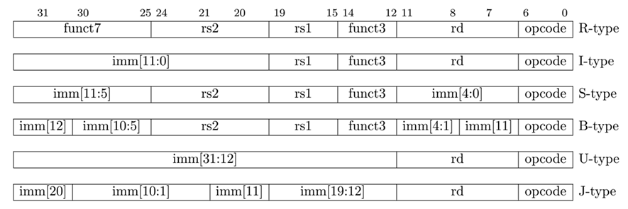

sidebar_position: 3

# 1. RISC-V 指令格式

RISC-V 指令集包含六种基本指令格式：

- **R 型指令**：用于寄存器-寄存器操作
- **I 型指令**：用于短立即数和访存load操作
- **S 型指令**：用于访存store操作
- **B 型指令**：用于条件跳转操作
- **U 型指令**：用于长立即数
- **J 型指令**：用于无条件跳转
## 1.1 格式



## 1.2 字段说明

- **opcode（操作码）字段**：位于指令编码Bit[6:0]，用于指令的分类。
- **funct3和fiunct7(功能码）字段**：常常与opcode字段结合在一起定义指令的操作功能。
- **rd字段**：表示目标寄存器的编号，位于指令编码的Bi[11:7]。
- **rs1字段**：表示第一源操作寄存器的编号，位于指令编码的Bit[19:15]。
- **rs2字段**：表示第二源操作寄存器的编号，位于指令编码的Bit[24:20]。
- **imm**：表示立即数。在RISC-V中使用的立即数大部分是符号扩展（sign-extended)的立即数。


# 2. R 型指令

## 2.1. 格式

R 型指令用于寄存器-寄存器操作，结构如下：

| bit[31:25] | bit[24:20] | bit[19:15] | bit[14:12] | bit[11:7] | bit[6:0] |
|------------|------------|------------|------------|-----------|----------|
| funct7   | rs2     | rs1      | funct3   | rd      | opcode |

## 2.2 字段说明：
- **opcode**: 操作码，7 位
- **rd**: 目的寄存器，5 位
- **funct3**: 额外操作字段，3 位
- **rs1**: 第一个源寄存器，5 位
- **rs2**: 第二个源寄存器，5 位
- **funct7**: 额外操作字段，7 位

## 2.3 示例

R 型指令主要用于加法、减法、移位和逻辑操作。

```assembly
add a0, a1, a2    # 将寄存器 a1 和 a2 的值相加，结果存入寄存器 a0
sub a0, a1, a2    # 将寄存器 a1 的值减去寄存器 a2 的值，结果存入寄存器 a0
sll a0, a1, a2    # 将寄存器 a1 的值左移 a2 位，结果存入寄存器 a0（算术左移）
srl a0, a1, a2    # 将寄存器 a1 的值右移 a2 位，结果存入寄存器 a0（逻辑右移，不保留符号位）
xor a0, a1, a2    # 对寄存器 a1 和 a2 的值进行按位异或运算，结果存入寄存器 a0
and a0, a1, a2    # 对寄存器 a1 和 a2 的值进行按位与运算，结果存入寄存器 a0
```

# 3. I 型指令

## 3.1 格式

I 型指令包括立即数的运算和访存加载指令，具有以下结构：

| bit[31:20]  | bit[19:15] | bit[14:12] | bit[11:7] | bit[6:0] |
|-------------|------------|------------|-----------|----------|
| imm[11:0] | rs1     | funct3   | rd      | opcode |

## 3.2 字段说明：
- **opcode**: 操作码，7 位
- **rd**: 目的寄存器，5 位
- **funct3**: 操作字段，3 位
- **rs1**: 第一个源寄存器，5 位
- **imm**: 立即数，12 位

## 3.3 示例

I 型指令包括立即数运算和访存load操作。

```assembly
addi a0, a1, 5    # a0 = a1 + 5
lw a0, 0(a1)      # 将内存地址 a1+0 处的 32 位数据加载到 a0
lb a0, 0(a1)      # 将内存地址 a1+0 处的 8 位数据加载到 a0
```

# 4. S 型指令

## 4.1 格式

S 型指令用于存储数据，具有以下结构：

| bit[31:25] | bit[24:20] | bit[19:15] | bit[14:12] | bit[11:7] | bit[6:0] |
|------------|------------|------------|------------|-----------|----------|
| imm[11:5]  | rs2        | rs1        | funct3     | imm[4:0]  | opcode   |

## 4.2 字段说明

- **opcode**: 操作码，7 位
- **rs1**: 源寄存器，5 位
- **rs2**: 第二个源寄存器，5 位
- **funct3**: 操作字段，3 位
- **imm**: 立即数，12 位（分为两部分）

## 4.3 示例

S 型指令用于将寄存器的值存储到内存。

```assembly
sb x10, 0(x1)    # 将 x10 的最低 8 位存储到 x1 地址处
sh x10, 0(x1)    # 将 x10 的最低 16 位存储到 x1 地址处
sw x10, 0(x1)    # 将 x10 的最低 32 位存储到 x1 地址处
```

# 5. B 型指令

## 5.1 格式
B 型指令用于条件跳转操作，具有以下结构：

| bit [31:25] | bit [24:20] | bit [19:15] | bit [14:12] | bit [11:8] | bit [7] | bit [6:0] |
|-------------|-------------|-------------|-------------|------------|---------|-----------|
| imm[12]     | imm[10:5]   | rs2         | rs1         | funct3     | imm[4:1] | opcode    |

## 5.2 字段说明

- **opcode**: 操作码，7 位
- **rs1**: 第一个源寄存器，5 位
- **rs2**: 第二个源寄存器，5 位
- **funct3**: 操作字段，3 位
- **imm**: 立即数，12 位（用于计算跳转偏移）

## 5.3 示例
B 型指令用于条件跳转。

```assembly
beq a1, a2, Label  # 如果 a1 == a2，则跳转到 Label
bne a1, a2, Label  # 如果 a1 != a2，则跳转到 Label
blt a1, a2, Label  # 如果 a1 < a2，则跳转到 Label
bgt a1, a2, Label  # 如果 a1 > a2，则跳转到 Label
```
# 6. U 型指令

## 6.1 格式
U 型指令用于长立即数操作，具有以下结构：

| bit [31:12] | bit [11:7] | bit [6:0] |
|-------------|------------|-----------|
| imm[31:12]  | rd         | opcode    |

## 6.2 字段说明

- **opcode**: 操作码，7 位
- **rd**: 目的寄存器，5 位
- **imm**: 立即数，20 位（只保留高 20 位）

## 6.3 示例
U 型指令主要用于加载高 20 位的立即数。

```assembly
lui x10, 0x12345  # 将高 20 位立即数加载到 x10 寄存器
```
# 7. J 型指令

## 7.1 格式
J 型指令用于无条件跳转，具有以下结构：

| bit [31:12] | bit [11] | bit [10:1] | bit [20] | bit [19:12] | bit [11:7] | bit [6:0] |
|-------------|----------|------------|----------|-------------|------------|-----------|
| imm[19:12]  | imm[11]  | imm[10:1]  | imm[20]  | rd          | opcode     |

## 7.2 字段说明

- **opcode**: 操作码，7 位
- **rd**: 目的寄存器，5 位
- **imm**: 立即数，21 位

## 7.3 示例
J 型指令用于无条件跳转。

```assembly
jal ra, Label    # 跳转到 Label 处，并保存返回地址到 ra 寄存器
jalr ra, 40(x10) # 跳转到 x10+40 地址处，并保存返回地址到 ra 寄存器
```