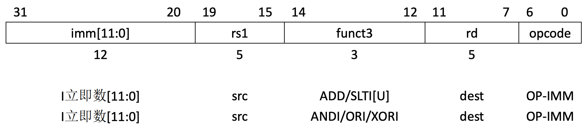
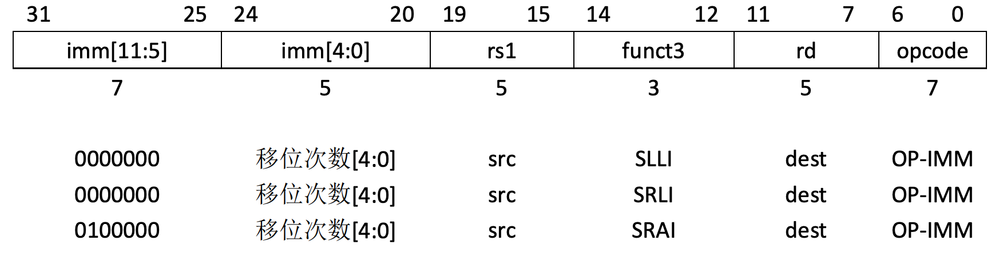
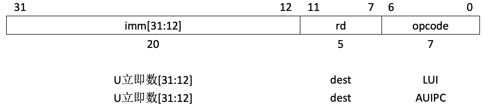
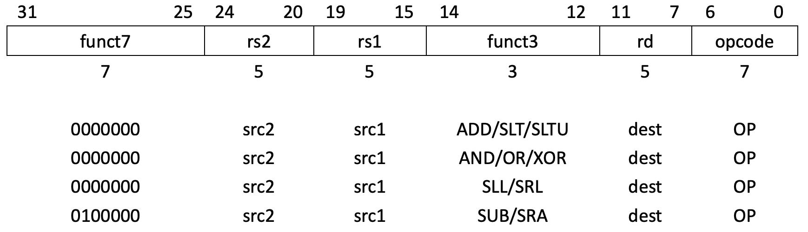
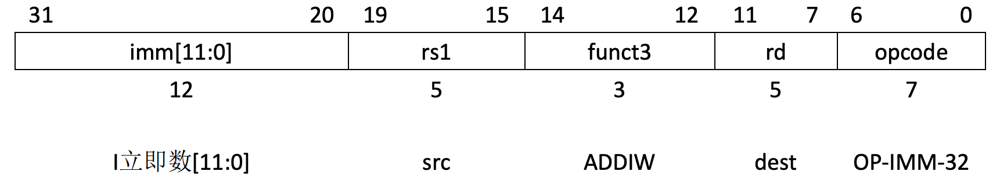
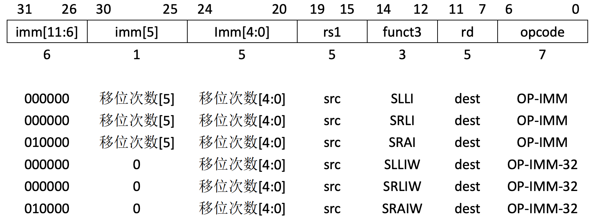
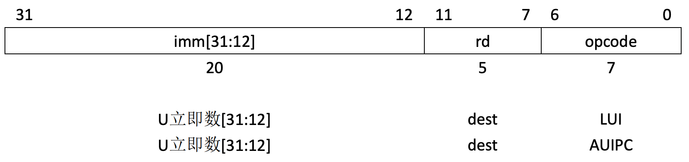
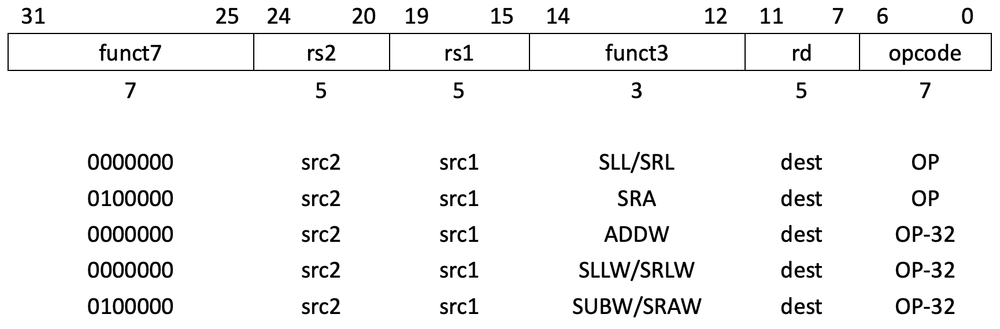
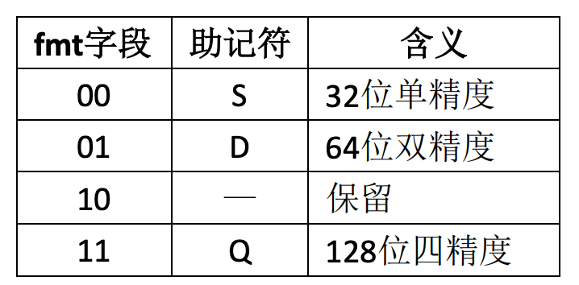
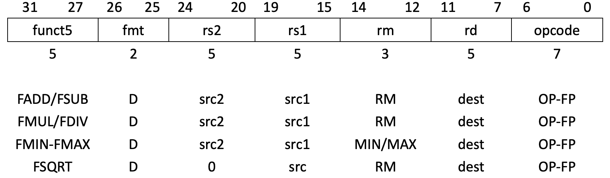

# 1. RV32I 算术运算指令

绝大多数整数计算指令对保存在整数寄存器中的XLEN位值进行操作。整数计算指令要么使用I类格式编码为寄存器-立即数操作，要么使用R类格式编码为寄存器-寄存器操作。对于寄存器-立即数指令和寄存器-寄存器指令，其目标都是寄存器rd。没有整数计算指令产生算术异常。

## 1.1 RV32I 算术运算指令编码格式

### 1.1.1 RV32I 立即数指令编码格式

RV32I 立即数指令编码格式如下图所示

其中，

#### · opcode (7位，位位置：6-0):

opcode 字段表示指令的操作码，指示该指令的类型。它通常占据 32 位指令的最右边 7 位。在 RISC-V 指令集架构中，每个操作码对应不同的操作类别，例如算术运算、加载/存储、跳转等。
例如，ADDI 指令的 opcode 是 0010011，它表示这是一条立即数加法指令。

#### · rd (5位，位位置：11-7):

rd 字段指定了目标寄存器（Destination Register），即该指令执行结果将存放的寄存器位置。RISC-V 指令格式中，每条指令有一>个目标寄存器，该寄存器存储指令执行后的结果。
例如，在 ADDI x5, x6, 10 中，rd 为 x5，表示计算结果将存储在 x5 寄存器中。

#### · funct3 (3位，位位置：14-12):

funct3 字段用于进一步细分操作码，指定具体的操作类型。它有 3 位，因此可以表示 8 种不同的操作。不同的指令类型根据 funct3 字段来区分操作。
例如， ADDI 指令，funct3 的值是 000，表示该指令是一个加法操作（加上立即数）。

#### · rs1 (5位，位位置：19-15):

rs1 字段指定了源寄存器 1（Source Register 1），即参与运算的第一个寄存器。RISC-V 指令的执行通常需要一个或多个源寄存器>，这些寄存器包含参与计算的操作数。
例如，在 ADDI x5, x6, 10 中，rs1 为 x6，表示 x6 寄存器的值将作为运算的第一个操作数。

#### · imm[11:0] (12位，位位置：31~20)：

imm[11:0] 字段是立即数（Immediate），它提供了一个固定的常数值，这个值通常用来与寄存器的值进行运算。RISC-V 指令集支持>多个指令格式，其中有的指令需要立即数。这个立即数是一个有符号的 12 位常数。
例如，对于 ADDI 指令，imm[11:0] 表示 12 位的立即数，它可以用于加法操作。在 ADDI x5, x6, 10 中，立即数是 10，即将 x6 >寄存器的值加上 10，结果存储到 x5 中。

ADDI将符号扩展的12位立即数加到寄存器rs1上。算术溢出被忽略，而结果就是运算结 果的低XLEN位。ADDI rd,rs1,0用于实现MV rd,rs1汇编语言伪指令。

SLTI(set less than immediate)将数值1放到寄存器rd中，如果寄存器rs1小于符号扩展的 立即数(比较时，两者都作为有符号数)，否则将0写入rd。SLTIU与之相似，但是将两者作 为无符号数进行比较(也就是说，立即数被首先符号扩展为XLEN位，然后被作为一个无符 号数)。注意，SLTIU rd,rs1,1将设置rd为1，如果rs1等于0，否则将rd设置为0(汇编语言伪指 令SEQZ rd,rs)。

ANDI、ORI、XORI是逻辑操作，在寄存器rs1和符号扩展的12位立即数上执行按位AND、 OR、XOR操作，并把结果写入rd。注意，XORI rd,rs1,-1在rs1上执行一个按位取反操作(汇编 语言伪指令NOT rd,rs)。

### 1.1.2 RV32I 移位指令编码格式

RV32I 移位指令编码格式如下图所示

其中，

#### · opcode (7 位，位位置：6-0)：

该字段表示指令的操作类型。移位指令使用 OP-IMM 操作码 (0010011)，表示立即数操作。
对于 SLLI（逻辑左移），opcode 为 0010011。
对于 SRLI（逻辑右移），opcode 也是 0010011。
对于 SRAI（算术右移），opcode 为 0010011，但 funct7 字段的值是 0100000。

#### · rd (5 位，位位置：11-7)：
目标寄存器字段，表示指令计算结果存放的寄存器。
例如，在 SLLI x5, x6, 10 中，rd 为 x5，表示将移位操作的结果存放在 x5 寄存器。

#### · funct3 (3 位，位位置：14-12)：

用于进一步指定具体操作类型。对于移位指令，funct3 的值为 001 对应 SLLI、101 对应 SRLI，而 SRAI 指令对应 funct3 值为 101。
SLLI（左移）使用 funct3 = 001。
SRLI（逻辑右移）使用 funct3 = 101。
SRAI（算术右移）使用 funct3 = 101。

#### · rs1 (5 位，位位置：19-15)：

源寄存器字段，表示操作数来源的寄存器。
例如，在 SLLI x5, x6, 10 中，rs1 为 x6，表示操作数来源于 x6 寄存器。

#### · imm[4:0] (5 位，位位置：24-20)：

立即数的低 5 位部分，表示要移位的次数。
例如，在 SLLI x5, x6, 10 中，立即数是 10，即移位次数为 10。

#### · imm[11:5] (7 位，位位置：31-25)：

立即数的高 7 位部分，通常为 0000000，因为立即数最多是 12 位。
例如，在 SLLI 中，imm[11:5] 的值通常是 0000000，表示立即数的高 7 位为空。

被移位常数次，被编码为I类格式的特例。被移位的操作数放在rs1中，移位的次数被编 码到I立即数字段的低5位。右移类型被编码到I立即数的一位高位。SLLI是逻辑左移(0被移 入低位);SRLI是逻辑右移(0被移入高位);SRAI是算术右移(原来的符号位被复制到空出的 高位中)。

### 1.1.3 RV32I 移位指令编码格式

RV32I 立即数移位指令编码格式如下图所示

其中，

#### · opcode (7 位，位位置：6-0)：

该字段表示指令的操作类型。对于 LUI 和 AUIPC 指令，opcode 的值都是 0110111，表示这是一个 U 类型指令。
LUI（加载上 20 位）指令用于将一个 20 位的立即数加载到目标寄存器的高 20 位。
AUIPC（加上当前指令地址的上 20 位）指令在 LUI 的基础上会加上程序计数器（PC）的值。

#### · rd (5 位，位位置：11-7)：

目标寄存器字段，表示结果存储的寄存器位置。
例如，在 LUI x5, 0x12345 中，rd 为 x5，表示立即数 0x12345 将被加载到 x5 寄存器的高 20 位。

#### · imm[31:12] (20 位，位位置：31-12)：

立即数字段。对于 LUI 和 AUIPC 指令，该字段表示一个 20 位的立即数。
对于 LUI x5, 0x12345，立即数 imm[31:12] 是 0x12345，该立即数将填充到 x5 寄存器的高 20 位。
对于 AUIPC x5, 0x12345，立即数 imm[31:12] 也是 0x12345，但会加上当前指令的地址（PC）。

LUI(load upper immediate)用于构建32位常数，并使用U类格式。LUI将U立即数放到目标寄存器rd的高20位，将rd的低12位填0。

AUIPC(add upper immediate to pc)用于构建pc相对地址，并使用U类格式。AUIPC从20位U立即数构建一个32位偏移量，将其低12位填0，然后将这个偏移量加到pc上，最后将结 果写入寄存器rd。

### 1.1.4 RV32I 寄存器操作指令编码格式

RV32I定义了几种算术R类操作。所有操作都是读取rs1和rs2寄存器作为源操作数，并把结果写入到寄存器rd中。funct7和funct3字段选择了操作的类型。

RV32I 寄存器操作指令编码格式如下图

其中，

#### · opcode (7 位，位位置：6-0)：

操作码字段，表示指令类型。

对于算术和逻辑操作指令，该字段通常为 0110011，表示寄存器到寄存器的算术和逻辑运算。

#### · rd (5 位，位位置：11-7)：

目标寄存器字段，表示运算结果存放的寄存器。

例如，在 ADD x5, x6, x7 中，rd 为 x5，表示运算结果将存放到 x5 寄存器。

#### · funct3 (3 位，位位置：14-12)：

功能字段，用于指定操作的类型。

常见的值包括：

000：加法（ADD）或减法（SUB）

001：逻辑左移（SLL）

101：逻辑右移（SRL）或算术右移（SRA）

#### · rs1 (5 位，位位置：19-15)：

源寄存器 1 字段，表示第一个操作数所在的寄存器。

例如，在 ADD x5, x6, x7 中，rs1 为 x6，表示第一个操作数来自寄存器 x6。

#### · rs2 (5 位，位位置：24-20)：

源寄存器 2 字段，表示第二个操作数所在的寄存器。

例如，在 ADD x5, x6, x7 中，rs2 为 x7，表示第二个操作数来自寄存器 x7。

#### · funct7 (7 位，位位置：31-25)：

功能字段，用于进一步区分操作类型。

常见的值包括：

0000000：表示加法（ADD）、逻辑左移（SLL）、逻辑右移（SRL）。

0100000：表示减法（SUB）、算术右移（SRA）。

ADD和SUB分别执行加法和减法。溢出被忽略，并且结果的低XLEN位被写入目标寄存器 rd。SLT和SLTU分别执行符号数和无符号数的比较，如果rs1 < rs2，则将1写入rd，否则写入0。 注意，SLTU rd,x0,rs2，如果rs2不等于0(译者注:在RISC-V中，x0寄存器永远是0)，则把1写 入rd，否则将0写入rd(汇编语言伪指令SNEZ rd,rs)。AND、OR、XOR执行按位逻辑操作。 SLL、SRL、SRA分别执行逻辑左移、逻辑右移、算术右移，被移位的操作数是寄存器rs1，移位次数是寄存器rs2的低5位。

## 1.2 ADDI 

**功能**: `ADDI` (Add Immediate) 将一个 12 位符号扩展的立即数加到寄存器 `rs1` 的值中，并将结果存储在寄存器 `rd` 中。算术溢出被忽略，且只存储结果的低 32 位。

**示例**:
```assembly
addi x1, x2, 10  # 将立即数 10 加上 x2 中的值，并将结果存储到 x1
```
## 1.3 SLTI 

**功能**: `SLTI` (Set Less Than Immediate) 将寄存器 `rs1` 与一个符号扩展的立即数进行比较。如果 `rs1` 小于该立即数（使用符号比较），则将 1 存入 `rd`；否则，将 0 存入 `rd`。

**示例**:
```assembly
slti x1, x2, 5  # 如果 x2 < 5（符号比较），则将 1 存入 x1
```
## 1.4 SLTIU 

**功能**: `SLTIU` (Set Less Than Immediate, Unsigned) 将寄存器 `rs1` 与一个符号扩展的立即数进行比较，但使用无符号比较。如果 `rs1` 小于该立即数（无符号比较），则将 1 存入 `rd`；否则，将 0 存入 `rd`。

**示例**:
```assembly
sltiu x1, x2, 5  # 如果 x2 < 5（无符号比较），则将 1 存入 x1
```
## 1.5 ANDI 

**功能**: `ANDI` (AND Immediate) 对寄存器 rs1 和一个 12 位带符号扩展的立即数进行按位与运算，并将结果存储在 rd 寄存器中。

**示例**:
```assembly
andi x1, x2, 0xFF  # 对 x2 和 0xFF 进行按位与运算，将结果存储在 x1 中
```
## 1.6 ORI 

**功能**: `ORI` (OR Immediate) 对寄存器 rs1 和一个 12 位带符号扩展的立即数进行按位或运算，并将结果存储在 rd 寄存器中。

**示例**:
```assembly
ori x1, x2, 0x1  # 对 x2 和 0x1 进行按位或运算，将结果存储在 x1 中
```
## 1.7 XORI 

**功能**: `XORI` (XOR Immediate) 对寄存器rs1和一个12 位带符号扩展的立即数进行按位异或运算，并将结果存储在 rd 寄存器中。

**示例**:
```assembly
xori x1, x2, 0xFFFF  # 对 x2 和 0xFFFF 进行按位异或运算，将结果存储在 x1 中
```
## 1.8 SLLI 

**功能**: `SLLI` (Shift Left Logical Immediate) 对寄存器 rs1 中的值进行逻辑左移，移位的位数由 5 位立即数字段指定，并将结果存储在 rd 寄存器中。移位的位数限制在 0 到 31 之间。

**示例**:
```assembly
slli x1, x2, 3  # 将 x2 中的值左移 3 位，将结果存储在 x1 中
```
## 1.9 SRLI

**功能**: `SRLI` (Shift Right Logical Immediate) 对寄存器 rs1 中的值进行逻辑右移，移位的位数由 5 位立即数字段指定，并将结果存储在 rd 寄存器中。移位的位数限制在 0 到 31 之间。

**示例**:
```assembly
srli x1, x2, 3  # 将 x2 中的值右移 3 位，将结果存储在 x1 中
```
## 1.10 SRAI 

**功能**: `SRAI` (Shift Right Arithmetic Immediate) 对寄存器 rs1 中的值进行算术右移，移位的位数由 5 位立即数字段指定，并将结果存储在 rd 寄存器中。移位的位数限制在 0 到 31 之间。

**示例**:
```assembly
srai x1, x2, 3  # 将 x2 中的值算术右移 3 位，将结果存储在 x1 中
```
## 1.11 LUI 

**功能**: `LUI` (Load Upper Immediate) 将一个 20 位的立即数加载到目标寄存器 rd 的高 20 位中，并将低 12 位设置为 0。

**示例**:
```assembly
lui x1, 0x12345  # 将立即数 0x12345 加载到 x1 的高 20 位
```
## 1.12 AUIPC

**功能**: `AUIPC` (Add Upper Immediate to PC) 将一个 20 位的立即数加到当前程序计数器 (pc) 上，并将结果存储到寄存器 rd。立即数在加到 pc 前会左移 12 位。

**示例**:
```assembly
auipc x1, 0x100  # 将立即数 (0x100 << 12) 加到 pc 上，结果存储到 x1
```
## 1.13 ADD

**功能**:`ADD` (Add)  将寄存器 rs1 和 rs2 中的值相加，并将结果存储到 rd 中。

**示例**:
```assembly
add x1, x2, x3  # 将 x2 和 x3 中的值相加，结果存储到 x1
```
## 1.14 SUB

**功能**: `SUB` (Subtract) 将寄存器 rs2 中的值从寄存器 rs1 中的值中减去，并将结果存储到 rd 中。

**示例**:
```assembly
sub x1, x2, x3  # 从 x2 中减去 x3 中的值，结果存储到 x1
```
## 1.15 SLT 

**功能**: `SLT` (Set Less Than) 比较寄存器 rs1 和 rs2 中的值（有符号比较）。如果 rs1 小于 rs2，则将 1 存入 rd；否则，将 0 存入 rd。

**示例**:
```assembly
slt x1, x2, x3  # 如果 x2 < x3（有符号比较），则将 1 存入 x1
```
## 1.16 SLTU 

**功能**: `SLTU` (Set Less Than, Unsigned) 比较寄存器 rs1 和 rs2 中的值（无符号比较）。如果 rs1 小于 rs2，则将 1 存入 rd；否则，将 0 存入 rd。

**示例**:
```assembly
sltu x1, x2, x3  # 如果 x2 < x3（无符号比较），则将 1 存入 x1
```
## 1.17 AND 

**功能**: `AND` (Bitwise AND) 执行寄存器 rs1 和 rs2 中值的按位与操作，并将结果存储在 rd 中。

**示例**:
```assembly
and x1, x2, x3  # 执行 x2 和 x3 之间的按位与操作，结果存储在 x1
```
## 1.18 OR

**功能**: `OR` (Bitwise OR) 执行寄存器 rs1 和 rs2 中值的按位或操作，并将结果存储在 rd 中。

**示例**:
```assembly
or x1, x2, x3  # 执行 x2 和 x3 之间的按位或操作，结果存储在 x1
```
## 1.19 XOR

**功能**: `XOR` (Bitwise XOR) 执行寄存器 rs1 和 rs2 中值的按位异或操作，并将结果存储在 rd 中。

**示例**:
```assembly
xor x1, x2, x3  # 执行 x2 和 x3 之间的按位异或操作，结果存储在 x1
```
## 1.20 NOP (No Operation)

**功能**: `NOP` (No Operation) 无操作，除了推进程序计数器 (PC)。

**示例**:
```assembly
nop  # 无操作
```

# 2. RV64I 算术运算指令

## 2.1 RV64I 算术运算指令编码格式

在RV64I中，提供了额外的指令变种来操作32位数值，这通过在操作码后面加上“W” 后缀来识别。这些“W”指令忽略了它们输入的高32位，并且总是生成32位有符号数值， 也就是说，XLEN-1位到31位都是相同的。这在RV32I中将会产生一个非法指令异常。

### 2.1.1 RV64I 立即数指令编码格式 

RV64I 立即数指令编码格式如下图所示

其中，

#### · opcode (7 位，位位置：6-0)：

该字段表示指令的操作类型。对于 ADDIW 指令，opcode 的值是 0010011，表示这是一个操作立即数的指令。
ADDIW 是对 ADD 指令的一种扩展，执行 32 位有符号整数加法，并将结果截断到 32 位。

#### · rd (5 位，位位置：11-7)：目标寄存器字段，表示指令计算结果存放的寄存器。
例如，在 ADDIW x5, x6, 10 中，rd 为 x5，表示将加法结果存放在 x5 寄存器。

#### · funct3 (3 位，位位置：14-12)：

用于指定具体操作类型。对于 ADDIW 指令，funct3 的值为 000，表示是一个加法操作。ADDIW 使用 funct3 = 000。

#### · rs1 (5 位，位位置：19-15)：

源寄存器字段，表示操作数来源的寄存器。
例如，在 ADDIW x5, x6, 10 中，rs1 为 x6，表示操作数来源于 x6 寄存器。

#### · imm[11:0] (12 位，位位置：31-20)：

立即数字段，表示加法操作中的立即数。
例如，在 ADDIW x5, x6, 10 中，imm[11:0] 为 10，表示立即数是 10。

ADDIW 指令用于将 32 位有符号整数加法运算的结果存放到目标寄存器中。通过 opcode、rd、funct3、rs1 和立即数来确定具体的操作行为。

ADDIW是一条RV64I仅有的指令，它将符号扩展的12位立即数和寄存器rs1相加，生成正确符号扩展的32位结果，保存到rd中。溢出被忽略，并且结果的低32位符号扩展成64位。注意，ADDIW rd,rs1,0将寄存器rs1的低32位符号扩展，结果写入寄存器rd中（汇编语言伪指令SEXT.W）。

### 2.1.2 RV64I 移位指令编码格式

RV64I 移位指令编码格式如下图所示

其中，

#### · opcode (7 位，位位置：6-0)：

该字段表示指令的操作类型。对于移位指令，opcode 的值为 0010011，表示立即数操作。
SLLI, SRLI, SRAI, SLLIW, SRLIW, SRAIW 都属于该类型，区别在于 funct7 和 funct3 字段。

#### · rd (5 位，位位置：11-7)：

目标寄存器字段，表示移位操作的结果存放的寄存器。
例如，在 SLLI x5, x6, 10 中，rd 为 x5，表示将移位结果存放在 x5 寄存器。

#### · funct3 (3 位，位位置：14-12)：

指定移位操作类型。不同的移位操作有不同的 funct3 值。
对于 SLLI（逻辑左移），funct3 = 001。
对于 SRLI（逻辑右移），funct3 = 101。
对于 SRAI（算术右移），funct3 = 101。
对于 SLLIW、SRLIW、SRAIW，funct3 也是 001、101、101，但 funct7 的值不同，分别是 0000000、0000000 和 0100000。

#### · rs1 (5 位，位位置：19-15)：

源寄存器字段，表示操作数来源的寄存器。
例如，在 SLLI x5, x6, 10 中，rs1 为 x6，表示操作数来源于 x6 寄存器。

#### · imm[4:0] (5 位，位位置：24-20)：

立即数的低 5 位部分，表示移位次数。
例如，在 SLLI x5, x6, 10 中，imm[4:0] 为 10，表示移位次数为 10。

#### · imm[11:6] (6 位，位位置：31-26)：

立即数的高 6 位部分，通常为 000000。

#### · imm[5] (1 位，位位置：25)：

用于区分移位类型（在某些指令中用于扩展立即数）。


该格式用于表示不同类型的移位指令，包括逻辑移位（左移、右移）和算术移位（右移）。funct3 和 funct7 字段用于区分不同的移位操作。

移位常数次被编码为I类指令格式的特例，使用与RV32I相同的指令操作码。被移位的操作数存放在寄存器rs1中，RV64I中移位次数被编码到I立即数字段的低6位。右移类型被编码到30位。SLLI是逻辑左移操作（0被移入低位）；SRLI是逻辑右移操作（0被移入高位）；SRAI是算术右移操作（原来的符号位被复制到空出的高位中）。对于RV32I，如果imm[5]≠0，则SLLI、SRLI、SRAI指令将会产生一个异常。

SLLIW、SRLIW、SRAIW是RV64I仅有的指令，与其定义相类似，但是它们对32位数值进行操作，并产生有符号的32位结果。如果imm[5]≠0，SLLIW、SRLIW、SRAIW指令将会产生一个异常。

### 2.1.3 RV64I U型指令编码格式

RV64I U型指令编码格式如下图所示

其中，

#### · opcode (7 位，位位置：6-0)：

该字段表示指令的操作类型。对于 LUI 和 AUIPC 指令，opcode 的值为 0110111，表示是 U 类型指令。
LUI 用于将一个 20 位的立即数加载到寄存器的高 20 位。
AUIPC 将一个 20 位的立即数与当前指令的地址（PC）相加并存储在寄存器中。

#### · rd (5 位，位位置：11-7)：

目标寄存器字段，表示结果存储的寄存器位置。
例如，在 LUI x5, 0x12345 中，rd 为 x5，表示立即数 0x12345 被加载到 x5 寄存器的高 20 位。

#### · imm[31:12] (20 位，位位置：31-12)：

立即数字段，表示 20 位的立即数。
对于 LUI x5, 0x12345，imm[31:12] 为 0x12345，该立即数将填充到 x5 寄存器的高 20 位。
对于 AUIPC x5, 0x12345，立即数也是 0x12345，但会加上当前指令地址（PC）。

LUI 和 AUIPC 指令的格式简单，主要通过 opcode、rd 和 20 位的立即数字段来控制指令的行为。LUI 将立即数加载到寄存器的高 20 位，而 AUIPC 则会在 LUI 的基础上加上当前指令的地址。

LUI（load upper immediate）使用了与RV32I一样的指令操作码，LUI将20位的U立即数放到目标寄存器rd的31-12位，将rd的低12位填0。32位结果将会符号扩展到64位。

AUIPC（add upper immediate to pc）使用了与RV32I一样的指令操作码，AUIPC指令用于构建pc相对地址，并使用U类格式。AUIPC将在20位U立即数低部添加了12个0位，符号扩展成64位，然后将它加到pc上，最后将结果写入寄存器rd。

### 2.1.4 RV64I 寄存器操作指令编码格式

RV64I 寄存器操作指令编码格式如下图所示

其中，

#### · opcode (7 位，位位置：6-0)：

该字段表示指令的操作类型。对于算术操作指令，opcode 的值为 0110011。
SLL, SRL, SRA, ADDW, SUBW, SLLW, SRLW 都属于 OP 类操作。


#### · funct7 (7 位，位位置：31-25)：

用于进一步区分不同的算术操作指令。例如，SLL 和 SRL 的 funct7 为 0000000，而 SRA 的 funct7 为 0100000。

rs1 和 rs2 (5 位，位位置：19-15 和 24-20)：

操作数寄存器，分别表示源寄存器 1 和源寄存器 2。对于 SLL 指令，rs1 和 rs2 分别为源寄存器，表示需要进行移位或加法的操作数。

#### · funct3 (3 位，位位置：14-12)：

用于区分不同的操作类型，例如 SLL 和 SRL 的 funct3 为 001，而 SRA 的 funct3 为 101。

#### · rd (5 位，位位置：11-7)：

目标寄存器，表示指令的运算结果存放的位置。


这类指令包括算术操作（如加法、减法、移位），通过 funct3 和 funct7 进一步区分不同的操作方式。

ADDW、SUBW是RV64I仅有的指令，它们的定义和ADD、SUB指令相类似，但是它们作用在32位数值上，并产生有符号的32位结果。溢出被忽略，结果的低32位被符号扩展成64位，再写入目标寄存器。

SLL、SRL、SRA分别执行逻辑左移、逻辑右移、算术右移，被移位的操作数是寄存器rs1，移位次数是寄存器rs2。对于RV64I，只有rs2的低6位被认为是移位次数。

SLLW、SRLW、SRAW是RV64I仅有的指令，它们具有类似的指令定义，但是它们作用在32位数值上，并产生有符号的32位结果。移位的次数由rs2[4:0]给出。

## 2.2 ADDIW 

**功能**: `ADDIW` (Add Immediate, Word) 将一个12位的立即数加到寄存器rs1中的值上，并生成32位的结果（扩展为64位）。

**示例**:
```assembly
addiw x1, x2, 4  # x1 = sign-extended(32-bit(x2) + 4)
```
## 2.3 SLLIW

**功能**: SLLIW` (Shift Left Logical Immediate, Word) 对寄存器rs1中的32位值进行逻辑左移，移位量由指令中的低5位立即数（imm[4:0]）决定，并将结果存储在rd寄存器中。结果会进行符号扩展至64位。

**示例**:
```assembly
slliw x1, x2, 4  # x1 = 32-bit(x2) << 4 (逻辑移位)
```
## 2.4 SRLIW

**功能**: `SRLIW` (Shift Right Logical Immediate, Word) 对寄存器rs1中的32位值进行逻辑右移，移位量由指令中的低5位立即数（imm[4:0]）决定，并将结果存储在rd寄存器中。结果会进行符号扩展至64位。

**示例**:
```assembly
srliw x1, x2, 4  # x1 = 32-bit(x2) >> 4 (逻辑移位)
```
## 2.5 SRAIW 

**功能**: `SRAIW` (Shift Right Arithmetic Immediate, Word) 对寄存器rs1中的32位值进行算术右移，移位量由指令中的低5位立即数（imm[4:0]）决定，并将结果存储在rd寄存器中。结果会进行符号扩展至64位。

**示例**:
```assembly
sraiw x1, x2, 4  # x1 = 32-bit(x2) >> 4 (算术移位)
```
## 2.6 ADDW

**功能**: `ADDW` (Add Word) 对寄存器rs1和rs2中的32位值进行加法运算，并将结果存储在rd寄存器中。结果会进行符号扩展至64位。

**示例**:
```assembly
addw x1, x2, x3  # x1 = 32-bit(x2) + 32-bit(x3)
```
## 2.7 SUBW

**功能**: `SUBW` (Subtract Word) 从寄存器rs1中的32位值减去寄存器rs2中的32位值，并将结果存储在rd寄存器中。结果会进行符号扩展至64位。

**示例**:
```assembly
subw x1, x2, x3  # x1 = 32-bit(x2) - 32-bit(x3)
```
## 2.8 SLL

**功能**: `SLL` (Shift Left Logical) 对寄存器rs1中的值进行逻辑左移，移位量由寄存器rs2的低6位指定，并将结果存储在rd寄存器中。只有rs2的低6位用于移位量。

**示例**:
```assembly
sll x1, x2, x3  # x1 = x2 << x3[5:0] (逻辑移位)
```
## 2.9 SRL 
**功能**: `SRL` (Shift Right Logical) 对寄存器rs1中的值进行逻辑右移，移位量由寄存器rs2的低6位指定，并将结果存储在rd寄存器中。只有rs2的低6位用于移位量。

**示例**:
```assembly
srl x1, x2, x3  # x1 = x2 >> x3[5:0] (逻辑移位)
```
## 2.10 SRA 

**功能**: `SRA` (Shift Right Arithmetic) 对寄存器 rs1 中的值执行算术右移操作，右移的位数由寄存器 rs2[5:0] 中的值指定，并将结果存储在 rd 中。只有 rs2 的低 6 位用于确定移位数。

**示例**:
```assembly
sra x1, x2, x3  # x1 = x2 >> x3[5:0] (算术移位)
```
## 2.11 SLLW 

**功能**: `SLLW` (Shift Left Logical Word) 对寄存器 rs1 中的 32 位值执行逻辑左移操作，移位的位数由寄存器 rs2[4:0] 中的值指定，并将结果存储在 rd 中。结果会进行符号扩展到 64 位。

**示例**:
```assembly
sllw x1, x2, x3  # x1 = 32-bit(x2) << x3[4:0] (逻辑移位)
```
## 2.12 SRLW 

**功能**: `SRLW` (Shift Right Logical Word) 对寄存器 rs1 中的 32 位值执行逻辑右移操作，移位的位数由寄存器 rs2[4:0] 中的值指定，并将结果存储在 rd 中。结果会进行符号扩展到 64 位。

**示例**:
```assembly
srlw x1, x2, x3  # x1 = 32-bit(x2) >> x3[4:0] (逻辑移位)
```
## 2.13 SRAW 

**功能**: `SRAW` (Shift Right Arithmetic Word) 对寄存器 rs1 中的 32 位值执行算术右移操作，移位的位数由寄存器 rs2[4:0] 中的值指定，并将结果存储在 rd 中。结果会进行符号扩展到 64 位。

**示例**:
```assembly
sraw x1, x2, x3  # x1 = 32-bit(x2) >> x3[4:0] (算术移位)
```
# 3. 单精度浮点算术运算指令

## 3.1 单精度浮点算术运算指令编码格式

具有1个或者2个操作数的浮点算术指令，使用R类指令格式，其主操作码是OP-FP。FADD.S、FSUB.S、FMUL.S、FDIV.S指令在rs1和rs2之间分别执行单精度浮点的加、减、乘、除运算，并将结果写入rd。FMIN.S、FMAX.S指令分别将rs1、rs2中的较小者或者较大者写入到rd中。FSQRT.S指令计算rs1的平方根，并把结果写入rd。

2位的浮点格式字段fmt，其编码如下图所示。对于F扩展中的所有指令，它被设置为S（00）。



### 3.1.1 单精度浮点算术运算基础指令编码格式

所有执行舍入的浮点操作指令，可以通过rm字段选择其舍入模式，舍入模式编码如下图所示。

其中，

#### · opcode (7 位，位位置：6-0)：

该字段表示指令的操作类型。对于浮点运算指令，opcode 的值是 0001111，表示是浮点运算类指令。

例如，FADD（浮点加法）、FSUB（浮点减法）、FMUL（浮点乘法）、FDIV（浮点除法）、FMIN（浮点最小值）、FMAX（浮点最大值）、FSQRT（浮点平方根）等指令都属于这种类型。

#### · rd (5 位，位位置：11-7)：

目标寄存器字段，表示指令计算结果存放的寄存器。

例如，在 FADD x5, x6, x7 中，rd 为 x5，表示浮点加法的结果存放在 x5 寄存器。

#### · rm (3 位，位位置：14-12)：

四舍五入模式字段，指定浮点运算的舍入模式。rm 可能的值如下：

000：最近舍入（Round to Nearest, ties to Even）

001：向正无穷舍入（Round toward +∞）

010：向负无穷舍入（Round toward -∞）

011：向零舍入（Round toward zero）

100：不可用（Reserved）

#### · rs1 和 rs2 (5 位，位位置：19-15 和 24-20)：

源寄存器字段，表示运算的两个源操作数寄存器。

例如，在 FADD x5, x6, x7 中，rs1 为 x6，rs2 为 x7，表示加法操作数分别来源于 x6 和 x7 寄存器。

#### · fmt (2 位，位位置：26-25)：

浮点数格式字段，表示浮点数的类型。常见的格式有：

00：单精度浮点数（single-precision, 32-bit）

01：双精度浮点数（double-precision, 64-bit）

10：扩展精度浮点数（extended-precision, 80-bit）

11：不可用（Reserved）

#### · funct5 (5 位，位位置：31-27)：

该字段用于表示具体的操作类型，例如加法、减法、乘法、除法等。具体的操作类型如下：

00000：FADD（浮点加法）

00001：FSUB（浮点减法）

00010：FMUL（浮点乘法）

00011：FDIV（浮点除法）

00100：FMIN（浮点最小值）

00101：FMAX（浮点最大值）

01000：FSQRT（浮点平方根）

这些指令用于执行常见的单精度浮点计算操作，包括加法、减法、乘法、除法、最小值、最大值和平方根。通过 funct5 字段可以区分具体的操作类型，fmt 字段指定浮点数格式，rm 字段指定舍入模式，rs1 和 rs2 字段指定操作数寄存器，rd 字段指定结果寄存器。

### 3.1.2 单精度浮点乘加/乘减指令编码格式

浮点融合乘加指令需要一种新的标准指令格式。R4类指令指明了3个源寄存器（rs1、rs2、rs3）和一个目的寄存器（rd）。这种格式仅被浮点融合乘加指令使用。浮点融合乘加指令将rs1、rs2中的值相乘，然后用未舍入的乘积加上或者减去rs3中的值，可选地取负舍入的结果。FMADD.S指令计算rs1×rs2＋rs3；FMSUB.S指令计算rs1×rs2－rs3；FNMSUB.S指令计算－（rs1×rs2－rs3）；FNMADD.S指令计算－（rs1×rs2＋rs3）。

![单精度浮点乘加/乘减指令（F[N]MADD/F[N]MSUB）编码格式](./images/computational/15computationalsinglefloat3.png "单精度浮点乘加/乘减指令（F[N]MADD/F[N]MSUB）编码格式")
其中，

#### · opcode (7 位，位位置：6-0)：

该字段表示指令的操作类型。对于浮点乘加和乘减指令，opcode 的值是 0001111，表示浮点运算类指令。

例如，FMADD（浮点乘加）、FMSUB（浮点乘减）等指令都属于这种类型。

#### · rd (5 位，位位置：11-7)：

目标寄存器字段，表示指令计算结果存放的寄存器。

例如，在 FMADD x5, x6, x7, x8 中，rd 为 x5，表示浮点乘加的结果存放在 x5 寄存器。

#### · rm (3 位，位位置：14-12)：

四舍五入模式字段，指定浮点运算的舍入模式，类似于之前提到的 rm 字段。

#### · rs1 和 rs2 (5 位，位位置：19-15 和 24-20)：

源寄存器字段，表示运算的两个源操作数寄存器。对于乘加和乘减指令，rs1 和 rs2 代表乘法运算的操作数。

#### · rs3 (5 位，位位置：31-27)：

第三个源寄存器字段，用于存储加法或减法的操作数。

例如，在 FMADD x5, x6, x7, x8 中，rs3 为 x8，表示加法或减法的操作数来自 x8 寄存器。

#### · fmt (2 位，位位置：26-25)：

浮点数格式字段，表示浮点数的类型。常见的格式有：

00：单精度浮点数（single-precision, 32-bit）

01：双精度浮点数（double-precision, 64-bit）

10：扩展精度浮点数（extended-precision, 80-bit）

11：不可用（Reserved）

## 3.2 FADD.S 

**功能**: `FADD.S` (Floating-Point Add Single) 对两个单精度浮点数（rs1 和 rs2）进行加法运算，并将结果写入 rd。

**示例**:
```assembly
fadd.s x1, x2, x3  # x1 = x2 + x3 (单精度浮点加法)
```
## 3.3 FSUB.S

**功能**: `FSUB.S` (Floating-Point Subtract Single) 从 rs1 中减去 rs2（单精度浮点数减法），并将结果写入 rd。

**示例**:
```assembly
fsub.s x1, x2, x3  # x1 = x2 - x3 (单精度浮点数减法)
```
## 3.4 FMUL.S 

**功能**: `FMUL.S` (Floating-Point Multiply Single) 将两个单精度浮点数（rs1 和 rs2）相乘，并将结果写入 rd。

**示例**:
```assembly
fmul.s x1, x2, x3  # x1 = x2 * x3 (单精度浮点数乘法)
```
## 3.5 FDIV.S 

**功能**: `FDIV.S` (Floating-Point Divide Single) 将 rs1 除以 rs2（单精度浮点数除法），并将结果写入 rd。

**示例**:
```assembly
fdiv.s x1, x2, x3  # x1 = x2 / x3 (单精度浮点数除法)
```
## 3.6 FMIN.S 

**功能**: `FMIN.S` (Floating-Point Minimum Single) 计算两个单精度浮点数（rs1 和 rs2）中的较小值，并将结果写入 rd。

**示例**:
```assembly
fmin.s x1, x2, x3  # x1 = min(x2, x3) (单精度浮点数最小值)
```
## 3.7 FMAX.S 

**功能**: `FMAX.S` (Floating-Point Maximum Single) 计算两个单精度浮点数（rs1 和 rs2）中的较大值，并将结果写入 rd。

**示例**:
```assembly
fmax.s x1, x2, x3  # x1 = max(x2, x3) (单精度浮点数最大值)
```
## 3.8 FSQRT.S 

**功能**: `FSQRT.S` (Floating-Point Square Root Single) 计算寄存器 rs1 中单精度浮点数的平方根，并将结果写入 rd。

**示例**:
```assembly
fsqrt.s x1, x2  # x1 = sqrt(x2) (单精度浮点数平方根)
```
## 3.9 FMADD.S 

**功能**: `FMADD.S` (Floating-Point Multiply-Add Single) 计算 rs1 × rs2 + rs3 的融合乘加（单精度浮点数），并将结果写入 rd。

**示例**:
```assembly
fmadd.s x1, x2, x3, x4  # x1 = (x2 * x3) + x4 (融合乘加)
```
## 3.10 FMSUB.S 

**功能**: `FMSUB.S` (Floating-Point Multiply-Subtract Single) 计算 rs1 × rs2 - rs3 的融合乘减（单精度浮点数），并将结果写入 rd。

**示例**:
```assembly
fmsub.s x1, x2, x3, x4  # x1 = (x2 * x3) - x4 (融合乘减)
```
## 3.11 FNMSUB.S 

**功能**: `FNMSUB.S` (Floating-Point Negative Multiply-Subtract Single) 计算 -rs1 × rs2 + rs3 的融合负乘减（单精度浮点数），并将结果写入 rd。

**示例**:
```assembly
fnmsub.s x1, x2, x3, x4  # x1 = (-x2 * x3) + x4 (负融合乘减)
```
## 3.12 FNMADD.S 

**功能**: `FNMADD.S` (Floating-Point Negative Multiply-Add Single) 计算 -rs1 × rs2 - rs3 的融合负乘加（单精度浮点数），并将结果写入 rd。

**示例**:
```assembly
fnmadd.s x1, x2, x3, x4  # x1 = (-x2 * x3) - x4 (负融合乘加)
```

# 4. 双精度浮点算术运算指令

## 4.1 双精度浮点运算指令编码格式

双精度浮点计算指令的定义与它们的单精度版本相类似，但是它们作用在双精度操作数上，并产生双精度结果。

### 4.1.1 双精度浮点运算基础指令编码格式

双精度浮点运算基础指令（FADD, FSUB, FMUL, FDIV, FMIN, FMAX, FSQRT）编码格式如下图

其中，

#### · opcode (7 位，位位置：6-0)：

该字段表示指令的操作类型。对于双精度浮点运算指令，opcode 的值是 0001111，表示该指令属于浮点运算类指令。

例如，FADD（浮点加法）、FSUB（浮点减法）、FMUL（浮点乘法）、FDIV（浮点除法）、FMIN（浮点最小值）、FMAX（浮点最大值）、FSQRT（浮点平方根）等指令都属于这种类型。

#### · rd (5 位，位位置：11-7)：

目标寄存器字段，表示指令计算结果存放的寄存器。

例如，在 FADD x5, x6, x7 中，rd 为 x5，表示浮点加法的结果存放在 x5 寄存器。

#### · rm (3 位，位位置：14-12)：

四舍五入模式字段，指定浮点运算的舍入模式。rm 可能的值如下：

000：最近舍入（Round to Nearest, ties to Even）

001：向正无穷舍入（Round toward +∞）

010：向负无穷舍入（Round toward -∞）

011：向零舍入（Round toward zero）

100：不可用（Reserved）

#### · rs1 和 rs2 (5 位，位位置：19-15 和 24-20)：

源寄存器字段，表示运算的两个源操作数寄存器。

例如，在 FADD x5, x6, x7 中，rs1 为 x6，rs2 为 x7，表示加法操作数分别来源于 x6 和 x7 寄存器。

#### · fmt (2 位，位位置：26-25)：

浮点数格式字段，表示浮点数的类型。对于双精度浮点数，fmt 字段的值为 01。

00：单精度浮点数（single-precision, 32-bit）

01：双精度浮点数（double-precision, 64-bit）

10：扩展精度浮点数（extended-precision, 80-bit）

11：不可用（Reserved）

#### · funct5 (5 位，位位置：31-27)：

该字段用于表示具体的操作类型，例如加法、减法、乘法、除法等。具体的操作类型如下：

00000：FADD（浮点加法）

00001：FSUB（浮点减法）

00010：FMUL（浮点乘法）

00011：FDIV（浮点除法）

00100：FMIN（浮点最小值）

00101：FMAX（浮点最大值）

01000：FSQRT（浮点平方根）

这些指令用于执行常见的双精度浮点计算操作，包括加法、减法、乘法、除法、最小值、最大值和平方根。通过 funct5 字段可以区分具体的操作类型，fmt 字段指定浮点数格式为双精度，rm 字段指定舍入模式，rs1 和 rs2 字段指定操作数寄存器，rd 字段指定结果寄存器。

### 4.1.2 双精度浮点乘加/乘减指令编码格式

![双精度浮点乘加/乘减指令（F[N]MADD/F[N]MSUB）编码格式](./images/computational/15computationaldouble2.png "双精度浮点乘加/乘减指令（F[N]MADD/F[N]MSUB）编码格式")
其中，

#### · opcode (7 位，位位置：6-0)：

该字段表示指令的操作类型。对于浮点乘加和乘减指令，opcode 的值是 0001111，表示浮点运算类指令。

例如，FMADD（浮点乘加）、FMSUB（浮点乘减）等指令都属于这种类型。

#### · rd (5 位，位位置：11-7)：

目标寄存器字段，表示指令计算结果存放的寄存器。

例如，在 FMADD x5, x6, x7, x8 中，rd 为 x5，表示浮点乘加的结果存放在 x5 寄存器。

#### · rm (3 位，位位置：14-12)：

四舍五入模式字段，指定浮点运算的舍入模式，类似于之前提到的 rm 字段。

#### · rs1 和 rs2 (5 位，位位置：19-15 和 24-20)：

源寄存器字段，表示运算的两个源操作数寄存器。对于乘加和乘减指令，rs1 和 rs2 代表乘法运算的操作数。

#### · rs3 (5 位，位位置：31-27)：

第三个源寄存器字段，用于存储加法或减法的操作数。

例如，在 FMADD x5, x6, x7, x8 中，rs3 为 x8，表示加法或减法的操作数来自 x8 寄存器。

#### · fmt (2 位，位位置：26-25)：

浮点数格式字段，表示浮点数的类型。对于双精度浮点数，fmt 字段的值为 01。

00：单精度浮点数（single-precision, 32-bit）

01：双精度浮点数（double-precision, 64-bit）

10：扩展精度浮点数（extended-precision, 80-bit）

11：不可用（Reserved）


浮点乘加（FMADD）和乘减（FMSUB）指令通过 rs1、rs2 和 rs3 寄存器分别提供乘法操作数和加减法操作数，实现了乘法和加减法的高效计算。这些指令对于需要复杂浮点运算的应用程序非常有用，特别是在科学计算和图形渲染等领域。

## 4.2 FADD.D 

**功能**: `FADD.D` (Floating-Point Add Double) 将两个双精度浮点数（rs1 和 rs2）相加，并将结果写入 rd。

**示例**:
```assembly
fadd.d x1, x2, x3  # x1 = x2 + x3 (双精度浮点加法)
```
## 4.3 FSUB.D

**功能**: `FSUB.D` (Floating-Point Subtract Double) 将 rs2 从 rs1 中减去（双精度浮点数减法），并将结果写入 rd。

**示例**:
```assembly
fsub.d x1, x2, x3  # x1 = x2 - x3 (双精度浮点数减法)
```
## 4.4 FMUL.D 

**功能**: `FMUL.D` (Floating-Point Multiply Double) 将两个双精度浮点数（rs1 和 rs2）相乘，并将结果写入 rd。

**示例**:
```assembly
fmul.d x1, x2, x3  # x1 = x2 * x3 (双精度浮点数乘法)
```
## 4.5 FDIV.D

**功能**: `FDIV.D` (Floating-Point Divide Double) 将 rs1 除以 rs2（双精度浮点数除法），并将结果写入 rd。

**示例**:
```assembly
fdiv.d x1, x2, x3  # x1 = x2 / x3 (双精度浮点数除法)
```
## 4.6 FMIN.D 

**功能**: `FMIN.D` (Floating-Point Minimum Double) 计算两个双精度浮点数（rs1 和 rs2）中的较小值，并将结果写入 rd。

**示例**:
```assembly
fmin.d x1, x2, x3  # x1 = min(x2, x3) (双精度浮点数最小值)
```
## 4.7 FMAX.D

**功能**: `FMAX.D` (Floating-Point Maximum Double) 计算两个双精度浮点数（rs1 和 rs2）中的较大值，并将结果写入 rd。

**示例**:
```assembly
fmax.d x1, x2, x3  # x1 = max(x2, x3) (双精度浮点数最大值)
```
## 4.8 FSQRT.D

**功能**: `FSQRT.D` (Floating-Point Square Root Double) 计算 rs1 中双精度浮点值的平方根，并将结果写入 rd。

**示例**:
```assembly
fsqrt.d x1, x2  # x1 = sqrt(x2) (双精度浮点数平方根)
```
## 4.9 FMADD.D

**功能**: `FMADD.D` (Floating-Point Multiply-Add Double) 计算 rs1 * rs2 + rs3 的融合乘加 (双精度浮点)，并将结果写入 rd。它计算 rs1 × rs2 + rs3。

**示例**:
```assembly
fmadd.d x1, x2, x3, x4  # x1 = (x2 * x3) + x4 (融合乘加，双精度浮点)
```
## 4.10 FMSUB.D 

**功能**: `FMSUB.D` (Floating-Point Multiply-Subtract Double) 计算 rs1 * rs2 - rs3 的融合乘减 (双精度浮点)，并将结果写入 rd。它计算 rs1 × rs2 - rs3。

**示例**:
```assembly
fmsub.d x1, x2, x3, x4  # x1 = (x2 * x3) - x4 (融合乘减，双精度浮点)
```
## 4.11 FNMSUB.D 

**功能**: `FNMSUB.D` (Floating-Point Negative Multiply-Subtract Double) 计算 -rs1 * rs2 + rs3 的融合负乘减 (双精度浮点)，并将结果写入 rd。它计算 -rs1 × rs2 + rs3。

**示例**:
```assembly
fnmsub.d x1, x2, x3, x4  # x1 = (-x2 * x3) + x4 (负融合乘减，双精度浮点)
```
## 4.12 FNMADD.D

**功能**: `FNMADD.D` (Floating-Point Negative Multiply-Add Double) 计算 -rs1 * rs2 - rs3 的融合负乘加 (双精度浮点)，并将结果写入 rd。它计算 -rs1 × rs2 - rs3。

**示例**:
```assembly
fnmadd.d x1, x2, x3, x4  # x1 = (-x2 * x3) - x4 (负融合乘加，双精度浮点)
```

# 5.示例 

## 5.1 进入示例

[下载测试代码](code/computational)

下载解压并进入示例目录

## 5.2 编译

```plain
make
```

## 5.3 运行

```plain
make run
```

**运行后LOG如下**
````
make run
qemu-system-riscv64 -nographic -machine virt -m 128M  -bios m_mode.bin  -device loader,file=s_mode.bin,addr=0x80200000  -kernel s_mode.elf
   _____ ____ _____
   / ____|  _ \_   _|
 | (___ | |_) || |
  \ \___ \|  _ < | |
  ____) | |_) || |_
 |_|_____/|____/_____|

Result of RV32I addi: 15
Result of RV32I slti: 0
Result of RV32I sltiu: 0
Result of RV32I andi: 5
Result of RV32I ori: 5
Result of RV32I xori: 2042
Result of RV32I slli: 40
Result of RV32I srli: 0
Result of RV32I srai: 0
Result of RV32I lui: 305418240
Result of RV32I auipc: -2144335336
Result of RV32I add: 8
Result of RV32I sub: 2
Result of RV32I slt: 0
Result of RV32I sltu: 0
Result of RV32I and: 1
Result of RV32I or: 7
Result of RV32I xor: 6
RV32I nop executed successfully
Result of RV64I addiw: 9
Result of RV64I slliw: 80
Result of RV64I srliw: 0
Result of RV64I sraiw: 0
Result of RV64I addw: 8
Result of RV64I subw: 2
Result of RV64I sll: 40
Result of RV64I srl: 0
Result of RV64I sra: 0
Result of RV64I sllw: 40
Result of RV64I srlw: 0
Result of RV64I sraw: 0
Result of single-precision fadd.s: 4.70
Result of single-precision fsub.s: 2.30
Result of single-precision fmul.s: 4.20
Result of single-precision fdiv.s: 2.92
Result of single-precision fsqrt.s: 1.87
Result of single-precision fmin.s: 1.20
Result of single-precision fmax.s: 3.50
Result of single-precision fmadd.s: 5.20
Result of single-precision fmsub.s: 3.20
Result of single-precision fnmsub.s: -3.20
Result of single-precision fnmadd.s: -5.20
Result of double-precision fadd.d: 4.70
Result of double-precision fsub.d: 2.30
Result of double-precision fmul.d: 4.20
Result of double-precision fdiv.d: 2.92
Result of double-precision fsqrt.d: 1.87
Result of double-precision fmin.d: 1.20
Result of double-precision fmax.d: 3.50
Result of double-precision fmadd.d: 5.20
Result of double-precision fmsub.d: 3.20
Result of double-precision fnmsub.d: -3.20
Result of double-precision fnmadd.d: -5.20
````
详见请参考文档：实验环境搭。
