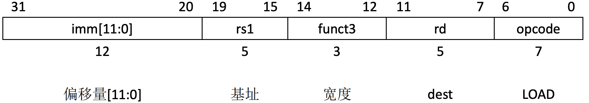
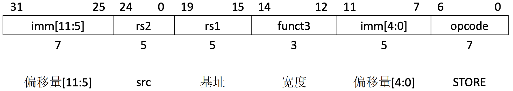
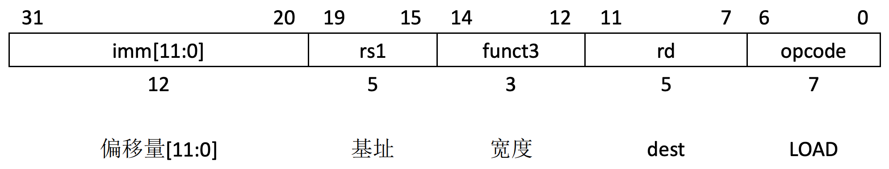
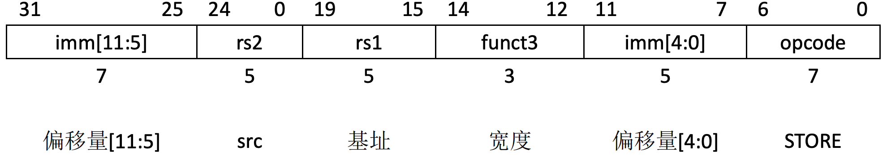
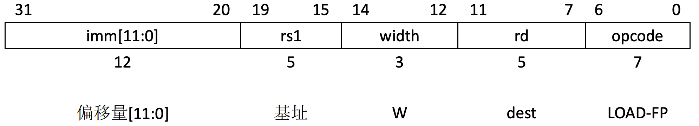
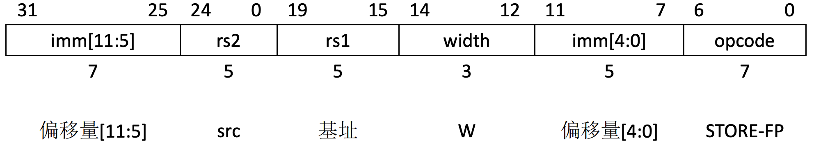

sidebar_position: 5

# 1. RV32I 加载和存储指令

## 1.1 RV32I 加载和存储指令编码格式

RV32I是一个load-store体系结构，也就是说，只有load和store指令可以访问存储器，而算术指令只在CPU寄存器上进行操作运算。RV32I提供了一个32位用户地址空间，它是字节寻址并且是小端的。执行环境将定义这个地址空间的哪些部分是可以合法访问的。

### 1.1.1 RV32I 加载指令编码格式

RV32I 加载指令编码格式如下

其中，

#### · opcode (7 位，位位置：6-0)：

操作码字段，表示该指令的类型。对于加载指令（如 LW，LH，LB 等），opcode 的值通常为 0000011，表示加载操作。

#### · rd (5 位，位位置：11-7)：

目标寄存器字段，表示将加载的值存放到哪个寄存器中。

例如，LW x5, 0(x6) 中，rd 为 x5，表示将内存中的数据加载到 x5 寄存器。

#### · funct3 (3 位，位位置：14-12)：

操作类型的子字段，表示加载的具体类型。常见的值如下：

000：字节加载（LB）

001：半字加载（LH）

010：单字加载（LW）

100：无符号字节加载（LBU）

101：无符号半字加载（LHU）

#### · rs1 (5 位，位位置：19-15)：

基址寄存器字段，表示加载操作的基址寄存器，通常是指存储器地址所在的寄存器。

例如，在 LW x5, 0(x6) 中，rs1 为 x6，表示基址是 x6 寄存器中的值。

#### · imm[11:0] (12 位，位位置：31-20)：

立即数字段，表示偏移量。它用于指定数据加载地址的偏移量。

例如，在 LW x5, 4(x6) 中，imm[11:0] 为 4，表示从基址 x6 开始偏移 4 字节位置的数据。

加载指令（LOAD） 主要用于从内存加载数据到寄存器中，支持字节、半字、单字以及无符号字节和半字的加载。通过 funct3 字段来区分加载的数据类型，imm 字段则指定了数据的偏移量。

### 1.1.2 RV32I 存储指令编码格式

RV32I 存储指令编码格式如下

其中，

#### · opcode (7 位，位位置：6-0)：

操作码字段，表示该指令的类型。对于存储指令（如 SW，SH，SB 等），opcode 的值通常为 0100011，表示存储操作。

#### · rs1 (5 位，位位置：19-15)：

基址寄存器字段，表示存储操作的基址寄存器，通常是存储数据的地址所在的寄存器。

例如，在 SW x5, 0(x6) 中，rs1 为 x6，表示基址是 x6 寄存器中的值。

#### · rs2 (5 位，位位置：24-20)：

源寄存器字段，表示要存储的数据来自哪个寄存器。

例如，在 SW x5, 0(x6) 中，rs2 为 x5，表示存储数据来自 x5 寄存器。

#### · funct3 (3 位，位位置：14-12)：

操作类型的子字段，表示存储的具体类型。常见的值如下：

000：字节存储（SB）

001：半字存储（SH）

010：单字存储（SW）

#### · imm[11:5] 和 imm[4:0] (12 位，位位置：31-25 和 11-7)：

立即数字段，表示偏移量。与加载指令一样，存储指令的偏移量由这两个字段组成。

例如，在 SW x5, 0(x6) 中，imm[11:5] 和 imm[4:0] 组合成 0，表示从基址 x6 开始偏移 0 字节位置存储数据。

存储指令（STORE） 主要用于将寄存器中的数据存储到内存中，支持字节、半字和单字的存储。通过 funct3 字段来区分存储的数据类型，imm 字段则指定了数据的偏移量。

## 1.2 LD 

**功能**: `LD` (Load) 从内存地址加载一个32位的值到寄存器。

**示例**:
```assembly
ld x1, 0(x2)   # 将内存地址 x2 处的值加载到寄存器 x1 
```
## 1.3 LH 

**功能**: `LH` (Load Halfword) 从内存加载一个16位半字（halfword），并将其符号扩展为32位存入寄存器。

**用法**: 该指令从内存中加载一个半字（16位），并将其符号扩展后存入目标寄存器。

**示例**:
```assembly
lh x1, 0(x2)  # 从内存地址 x2 处加载一个有符号半字（16位）到寄存器 x1，并进行符号扩展
```
## 1.4 LW 

**功能**: `LW` (Load Word) 从内存加载一个32位字（word）到32位寄存器。

**用法**: 该指令从内存中加载一个32位字（32 bits），并存入目标寄存器。

**示例**:
```assembly
lw x1, 0(x2)  # 从内存地址 x2 处加载一个32位字到寄存器 x1
```
## 1.5 LBU

**功能**: `LBU` (Load Byte Unsigned) 从内存加载一个无符号字节（8位）到32位寄存器，并进行零扩展。

**用法**: 该指令从内存中加载一个8位的无符号值，并将其零扩展后存入目标寄存器。

**示例**:
```assembly
lbu x1, 0(x2)  # 从内存地址 x2 处加载一个无符号字节到寄存器 x1，并进行零扩展
```
## 1.6 LHU

**功能**: `LHU` (Load Halfword Unsigned) 从内存加载一个无符号半字（16位）到32位寄存器，并进行零扩展。

**用法**: 该指令从内存中加载一个16位的无符号值，并将其零扩展为32位后存入目标寄存器。

**示例**:
```assembly
lhu x1, 0(x2)  # 从内存地址 x2 处加载一个无符号半字到寄存器 x1，并进行零扩展
```
## 1.7 SB 

**功能**: `SB` (Store Byte) 将寄存器的最低有效字节存储到内存中。

**用法**: 该指令将源寄存器的最低有效字节存储到由基地址寄存器加上偏移量计算出的内存地址中。

**示例**:
```assembly
sb x1, 0(x2)  # 将寄存器 x1 的最低有效字节存储到内存地址 x2 处
```
## 1.8 SH

**功能**: `SH` (Store Halfword) 将寄存器的最低有效16位存储到内存中。

**用法**: 该指令将源寄存器的最低有效16位存储到由基地址寄存器加上偏移量计算出的内存地址中。

**示例**:
```assembly
sh x1, 0(x2)  # 将寄存器 x1 的最低有效16位存储到内存地址 x2 处
```
## 1.9 SW 

**功能**: `SW` (Store Word) 将寄存器中的一个32位字存储到内存中。

**用法**: 该指令将源寄存器中的整个32位值存储到由基地址寄存器加上偏移量计算出的内存地址中。

**示例**:
```assembly
sw x1, 0(x2)  # 将寄存器 x1 中的32位字存储到内存地址 x2 处
```

# 2. RV64I 加载和存储指令

## 2.1 RV64I 加载和存储指令编码格式

RV64I将地址空间扩展到64位。执行环境将定义地址空间的哪些部分是可以合法访问的。

### 2.1.1 RV64I 加载指令编码格式 

RV64I 加载指令编码格式如下

其中，

#### · opcode (7 位，位位置：6-0)：

操作码字段，表示该指令的类型。对于加载指令（如 LD，LW，LBU 等），opcode 的值通常为 0000011，表示加载操作。

#### · rd (5 位，位位置：11-7)：

目标寄存器字段，表示将加载的值存放到哪个寄存器中。

例如，LD x5, 0(x6) 中，rd 为 x5，表示将内存中的数据加载到 x5 寄存器。

#### · funct3 (3 位，位位置：14-12)：

操作类型的子字段，表示加载的具体类型。常见的值如下：

000：字节加载（LB）

001：半字加载（LH）

010：单字加载（LW）

100：无符号字节加载（LBU）

101：无符号半字加载（LHU）

110：双字加载（LD）

#### · rs1 (5 位，位位置：19-15)：

基址寄存器字段，表示加载操作的基址寄存器，通常是存储器地址所在的寄存器。

例如，在 LD x5, 0(x6) 中，rs1 为 x6，表示基址是 x6 寄存器中的值。

#### · imm[11:0] (12 位，位位置：31-20)：

立即数字段，表示偏移量。它用于指定数据加载地址的偏移量。

例如，在 LD x5, 4(x6) 中，imm[11:0] 为 4，表示从基址 x6 开始偏移 4 字节位置的数据。

加载指令（LOAD） 主要用于从内存加载数据到寄存器中，支持字节、半字、单字、双字以及无符号字节和半字的加载。通过 funct3 字段来区分加载的数据类型，imm 字段则指定了数据的偏移量。

### 2.1.2 RV64I 存储指令编码格式

RV64I 存储指令编码格式如下

其中，

#### · opcode (7 位，位位置：6-0)：

操作码字段，表示该指令的类型。对于存储指令（如 SD，SW，SB 等），opcode 的值通常为 0100011，表示存储操作。

#### · rs1 (5 位，位位置：19-15)：

基址寄存器字段，表示存储操作的基址寄存器，通常是存储数据的地址所在的寄存器。

例如，在 SD x5, 0(x6) 中，rs1 为 x6，表示基址是 x6 寄存器中的值。

#### · rs2 (5 位，位位置：24-20)：

源寄存器字段，表示要存储的数据来自哪个寄存器。

例如，在 SD x5, 0(x6) 中，rs2 为 x5，表示存储的数据来自 x5 寄存器。

#### · funct3 (3 位，位位置：14-12)：

操作类型的子字段，表示存储的具体类型。常见的值如下：

000：字节存储（SB）

001：半字存储（SH）

010：单字存储（SW）

011：双字存储（SD）

#### · imm[11:5] 和 imm[4:0] (12 位，位位置：31-25 和 11-7)：

立即数字段，表示偏移量。与加载指令一样，存储指令的偏移量由这两个字段组成。

例如，在 SD x5, 0(x6) 中，imm[11:5] 和 imm[4:0] 组合成 0，表示从基址 x6 开始偏移 0 字节位置存储数据。

存储指令（STORE） 主要用于将寄存器中的数据存储到内存中，支持字节、半字、单字和双字的存储。通过 funct3 字段来区分存储的数据类型，imm 字段则指定了数据的偏移量。

## 2.2 LD 

**功能**: `LD` (Load Doubleword) 从内存加载一个64位的值到64位寄存器。

**用法**: 该指令从指定的内存地址加载一个64位的值到目标寄存器中。

**示例**:
```assembly
ld x1, 0(x2)  # 将内存地址 x2 处的64位值加载到寄存器 x1
```
## 2.3 LW 

**功能**: `LW` (Load Word) 从内存加载一个32位的值，符号扩展为64位，并存储到64位寄存器中。

**用法**: 该指令从指定的内存地址加载一个32位有符号值，将其符号扩展为64位，并存储到目标寄存器中。

**示例**:
```assembly
lw x3, 4(x4)  # 从内存地址 (x4 + 4) 加载一个32位值，符号扩展为64位，并存储到寄存器 x3
```
## 2.4 LWU

**功能**: `LWU` (Load Word Unsigned) 从内存加载一个32位无符号值，零扩展为64位，并存储到64位寄存器中。

**用法**: 该指令从指定的内存地址加载一个32位无符号值，将其零扩展为64位，并存储到目标寄存器中。

**示例**:
```assembly
lwu x5, 8(x6)  # 从内存地址 (x6 + 8) 加载一个32位无符号值，零扩展为64位，并存储到寄存器 x5
```
## 2.5 LH 

**功能**: `LH` (Load Halfword) 从内存加载一个16位的值，符号扩展为64位，并存储到64位寄存器中。

**用法**: 该指令从指定的内存地址加载一个16位有符号值，将其符号扩展为64位，并存储到目标寄存器中。

**示例**:
```assembly
lh x7, 12(x8)  # 从内存地址 (x8 + 12) 加载一个16位值，符号扩展为64位，并存储到寄存器 x7
```
## 2.6 LHU 

**功能**: `LHU` (Load Halfword Unsigned) 从内存加载一个16位无符号值，零扩展为64位，并存储到64位寄存器中。

**用法**: 该指令从指定的内存地址加载一个16位无符号值，将其零扩展为64位，并存储到目标寄存器中。

**示例**:
```assembly
lhu x9, 16(x10)  # 从内存地址 (x10 + 16) 加载一个16位无符号值，零扩展为64位，并存储到寄存器 x9
```
## 2.7 LB 

**功能**: `LB` (Load Byte) 从内存加载一个8位的值，符号扩展为64位，并存储到64位寄存器中。

**用法**: 该指令从指定的内存地址加载一个8位有符号值，将其符号扩展为64位，并存储到目标寄存器中。

**示例**:
```assembly
lb x11, 20(x12)  # 从内存地址 (x12 + 20) 加载一个8位值，符号扩展为64位，并存储到寄存器 x11
```
## 2.8 LBU 

**功能**: `LBU` (Load Byte Unsigned) 从内存加载一个8位无符号值，零扩展为64位，并存储到64位寄存器中。

**用法**: 该指令从指定的内存地址加载一个8位无符号值，将其零扩展为64位，并存储到目标寄存器中。

**示例**:
```assembly
lbu x13, 24(x14)  # 从内存地址 (x14 + 24) 加载一个8位无符号值，零扩展为64位，并存储到寄存器 x13
```
## 2.9 SD 

**功能**: `SD` (Store Doubleword) 将64位寄存器中的值存储到内存中。

**用法**: 该指令将源寄存器中的64位值存储到指定的内存地址中。

**示例**:
```assembly
sd x1, 0(x2)  # 将寄存器 x1 中的64位值存储到内存地址 x2 处
```
## 2.10 SW 

**功能**: `SW` (Store Word) 将64位寄存器的低32位存储到内存中。

**用法**: 该指令将源寄存器的低32位存储到指定的内存地址中。

**示例**:
```assembly
sw x3, 4(x4)  # 将寄存器 x3 的低32位存储到内存地址 (x4 + 4) 处
```
## 2.11 SH 

**功能**: `SH` (Store Halfword) 将64位寄存器的低16位存储到内存中。

**用法**: 该指令将源寄存器的低16位存储到指定的内存地址中。

**示例**:
```assembly
sh x5, 8(x6)  # 将寄存器 x5 的低16位存储到内存地址 (x6 + 8) 处
```
## 2.12 SB 

**功能**: `SB` (Store Byte) 将64位寄存器的低8位存储到内存中。

**用法**: 该指令将源寄存器的低8位存储到指定的内存地址中。

**示例**:
```assembly
sb x7, 12(x8)  # 将寄存器 x7 的低8位存储到内存地址 (x8 + 12) 处
```

# 3. 单精度加载和存储指令

## 3.1 单精度加载和存储指令编码格式

浮点load和store指令使用与整数ISA相同的“基址+偏移量”的寻址方式，寄存器rs1保存着基址，字节偏移量是一个12位有符号数。FLW指令从存储器中将一个单精度浮点值读入到浮点寄存器rd中。FSW指令将浮点寄存器rs2中的单精度浮点值写入到存储器中。

### 3.1.1 单精度加载指令编码格式

单精度加载指令编码格式如下

其中，

#### · opcode (7 位，位位置：6-0)：

操作码字段，表示该指令的类型。对于单精度浮点数加载指令（如 FLW），opcode 的值通常为 0000111，表示加载浮点数数据。

#### · rd (5 位，位位置：11-7)：

目标寄存器字段，表示将加载的浮点数据存放到哪个寄存器中。

例如，FLW f5, 0(f6) 中，rd 为 f5，表示将内存中的浮点数据加载到 f5 寄存器。

#### · width (3 位，位位置：14-12)：

指定数据的宽度，通常为 W，表示单精度浮点数（32 位）。

W 表示加载的是 32 位单精度浮点数。

#### · rs1 (5 位，位位置：19-15)：

基址寄存器字段，表示加载操作的基址寄存器，通常是存储器地址所在的寄存器。

例如，在 FLW f5, 0(f6) 中，rs1 为 f6，表示基址是 f6 寄存器中的值。

#### · imm[11:0] (12 位，位位置：31-20)：

立即数字段，表示偏移量。它用于指定数据加载地址的偏移量。

例如，在 FLW f5, 4(f6) 中，imm[11:0] 为 4，表示从基址 f6 开始偏移 4 字节的位置加载数据。

单精度浮点数加载指令（LOAD-FP） 主要用于从内存加载浮点数到寄存器中。通过 funct3 字段来指定数据的类型（如单精度浮点数），并通过 imm 字段指定偏移量。

### 3.1.2 单精度存储指令编码格式

单精度存储指令编码格式如下

其中，

#### · opcode (7 位，位位置：6-0)：

操作码字段，表示该指令的类型。对于单精度浮点数存储指令（如 FSW），opcode 的值通常为 0100111，表示存储浮点数数据。

#### · rs1 (5 位，位位置：19-15)：

基址寄存器字段，表示存储操作的基址寄存器，通常是存储数据的地址所在的寄存器。

例如，在 FSW f5, 0(f6) 中，rs1 为 f6，表示基址是 f6 寄存器中的值。

#### · rs2 (5 位，位位置：24-20)：

源寄存器字段，表示要存储的浮点数据来自哪个寄存器。

例如，在 FSW f5, 0(f6) 中，rs2 为 f5，表示要存储的数据来自 f5 寄存器。

#### · width (3 位，位位置：14-12)：

指定数据的宽度，通常为 W，表示单精度浮点数（32 位）。

W 表示存储的是 32 位单精度浮点数。

#### · imm[11:5] 和 imm[4:0] (12 位，位位置：31-25 和 11-7)：

立即数字段，表示偏移量。与加载指令一样，存储指令的偏移量由这两个字段组成。

例如，在 FSW f5, 4(f6) 中，imm[11:5] 和 imm[4:0] 组合成 4，表示从基址 f6 开始偏移 4 字节的位置存储数据。

## 3.2 FLW 

**功能**: `FLW` (Floating-Point Load Word) 从内存加载一个单精度浮点值到浮点寄存器（rd）。

**示例**:
```assembly
flw f1, 0(x2)  # 从内存地址 (x2 + 0) 加载一个单精度浮点值到 f1
```
## 3.3 FSW 

**功能**: `FSW` (Floating-Point Store Word) 将一个单精度浮点值（32位）从浮点寄存器（rs2）存储到内存。

**示例**:
```assembly
fsw f3, 4(x4)  # 将 f3 中的单精度浮点值存储到内存地址 (x4 + 4)
```

# 4. 双精度加载和存储指令 

## 4.1 双精度加载和存储指令编码格式

FLD指令从存储器读取一个双精度浮点值，写入到浮点寄存器rd中。FSD指令从浮点寄存
器读取双精度浮点值，写入到存储器中。

双精度浮点数（double-precision floating-point）加载和存储指令与单精度浮点数的加载和存储指令类似，唯一的区别在于它们操作的是 64 位数据（双精度浮点数）。这两个指令用于将双精度浮点数从内存加载到寄存器，或将双精度浮点数从寄存器存储到内存。

### 4.1.1 双精度加载指令编码格式

双精度加载指令编码格式如下

其中，

#### · opcode (7 位，位位置：6-0)：

操作码字段，表示该指令的类型。对于双精度浮点数加载指令（如 FLD），opcode 的值通常为 0000111，表示加载浮点数数据。

#### · rd (5 位，位位置：11-7)：

目标寄存器字段，表示将加载的双精度浮点数据存放到哪个寄存器中。

例如，FLD f5, 0(f6) 中，rd 为 f5，表示将内存中的双精度浮点数加载到 f5 寄存器。

#### · width (3 位，位位置：14-12)：

指定数据的宽度，通常为 D，表示双精度浮点数（64 位）。

D 表示加载的是 64 位双精度浮点数。

#### · rs1 (5 位，位位置：19-15)：

基址寄存器字段，表示加载操作的基址寄存器，通常是存储器地址所在的寄存器。

例如，在 FLD f5, 0(f6) 中，rs1 为 f6，表示基址是 f6 寄存器中的值。

#### · imm[11:0] (12 位，位位置：31-20)：

立即数字段，表示偏移量。它用于指定数据加载地址的偏移量。

例如，在 FLD f5, 4(f6) 中，imm[11:0] 为 4，表示从基址 f6 开始偏移 4 字节的位置加载数据。

双精度浮点数加载指令（LOAD-FP） 主要用于从内存加载双精度浮点数到寄存器中。通过 funct3 字段来指定数据的类型（如双精度浮点数），并通过 imm 字段指定偏移量。

### 4.1.2 双精度存储指令编码格式

双精度存储指令编码格式如下

其中，

#### · opcode (7 位，位位置：6-0)：

操作码字段，表示该指令的类型。对于双精度浮点数存储指令（如 FSD），opcode 的值通常为 0100111，表示存储浮点数数据。

#### · rs1 (5 位，位位置：19-15)：

基址寄存器字段，表示存储操作的基址寄存器，通常是存储数据的地址所在的寄存器。

例如，在 FSD f5, 8(f6) 中，rs1 为 f6，表示基址是 f6 寄存器中的值。

#### · rs2 (5 位，位位置：24-20)：

源寄存器字段，表示要存储的双精度浮点数据来自哪个寄存器。

例如，在 FSD f5, 8(f6) 中，rs2 为 f5，表示要存储的数据来自 f5 寄存器。

#### · width (3 位，位位置：14-12)：

指定数据的宽度，通常为 D，表示双精度浮点数（64 位）。

D 表示存储的是 64 位双精度浮点数。

#### · imm[11:5] 和 imm[4:0] (12 位，位位置：31-25 和 11-7)：

立即数字段，表示偏移量。与加载指令一样，存储指令的偏移量由这两个字段组成。

例如，在 FSD f5, 8(f6) 中，imm[11:5] 和 imm[4:0] 组合成 8，表示从基址 f6 开始偏移 8 字节的位置存储数据。

双精度浮点数存储指令（STORE-FP） 主要用于将双精度浮点数从寄存器存储到内存中。通过 funct3 字段指定存储的数据类型（如双精度浮点数），并通过 imm 字段指定偏移量。

如果一个浮点寄存器保存了一个单精度浮点值，必须确保使用FSD指令将寄存器的值保存到存储器之后，再使用FLD指令重新读取该值，那么将在寄存器中重新生成原始的单精度浮点值。除了这个特性之外，保存在存储器中的数据格式并没有明确定义。


## 4.2 FLD 

**功能**: `FLD` (Floating-Point Load Doubleword) 将一个双精度浮点值从内存加载到浮点寄存器（rd）。

**示例**:
```assembly
fld f2, 0(x3)  # 从内存地址 (x3 + 0) 加载一个双精度浮点值到 f2
```
## 4.3 FSD

**功能**: `FSD` (Floating-Point Store Doubleword) 将一个双精度浮点值从浮点寄存器（rs2）存储到内存。

**示例**:
```assembly
fsd f4, 0(x5)  # 将 f4 中的双精度浮点值存储到内存地址 (x5 + 0)
```

# 5. 示例

## 5.1 进入示例

[下载测试代码](code/load_store)

下载解压并进入示例目录

## 5.2 编译

```plain
make
```

## 5.3 运行

```plain
make run
```

**运行后LOG如下**
````
make run
qemu-system-riscv64 -nographic -machine virt -m 128M  -bios m_mode.bin  -device loader,file=s_mode.bin,addr=0x80200000  -kernel s_mode.elf
   _____ ____ _____
   / ____|  _ \_   _|
 | (___ | |_) || |
  \ \___ \|  _ < | |
  ____) | |_) || |_
 |_|_____/|____/_____|

Result of risc-v assembly 'ld x1, 0(x2)': 42
Result of risc-v assembly 'lh x1, 0(x2)': 42
Result of risc-v assembly 'lw x1, 0(x2)': 42
Result of risc-v assembly 'lbu x1, 0(x2)': 42
Result of risc-v assembly 'lhu x1, 0(x2)': 42
Result of risc-v assembly 'sb x1, 0(x2)': 255
Result of risc-v assembly 'sh x1, 0(x2)': 65535
Result of risc-v assembly 'sw x1, 0(x2)': 123456
Result of risc-v assembly 'ld x1, 0(x2)': 1942892530
Result of risc-v assembly 'lw x3, 4(x4)': 2874
Result of risc-v assembly 'lwu x5, 8(x6)': 0
Result of risc-v assembly 'lh x7, 12(x8)': 0
Result of risc-v assembly 'lhu x9, 16(x10)': 0
Result of risc-v assembly 'lb x11, 20(x12)': 0
Result of risc-v assembly 'lbu x13, 24(x14)': 0
Result of risc-v assembly 'sd x1, 0(x2)': 1286608618
Result of risc-v assembly 'sw x3, 4(x4)': 1286608618
Result of risc-v assembly 'sh x5, 8(x6)': 1286608618
Result of risc-v assembly 'sb x7, 12(x8)': 1286608618
Result of risc-v assembly 'flw f1, 0(x2)': -0.00
Result of risc-v assembly 'fsw f3, 4(x4)': 0.00
Result of risc-v assembly 'fld f2, 0(x3)': 3.141592653589790
Result of risc-v assembly 'fsd f4, 0(x5)': 3.141592653589790
````

详见请参考文档：实验环境搭。
